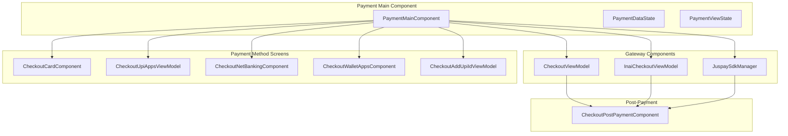
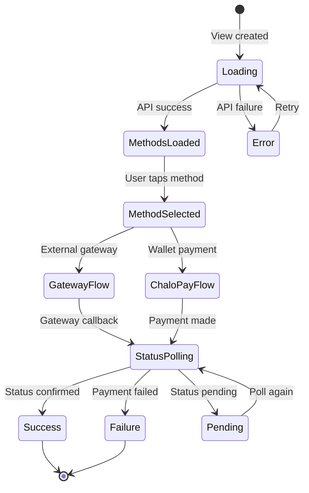
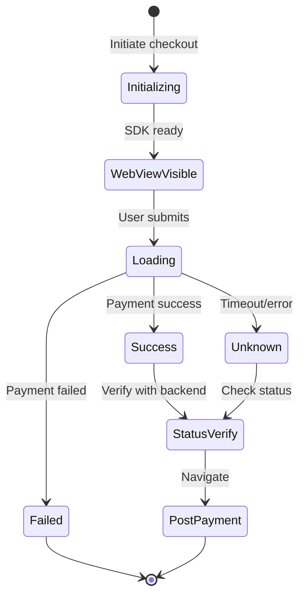
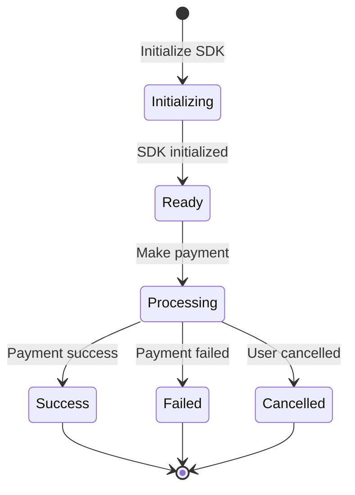
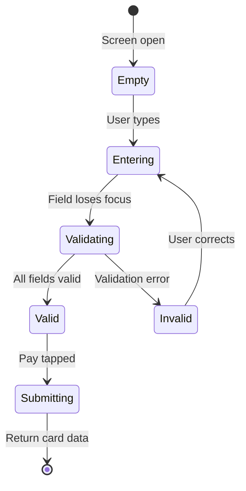
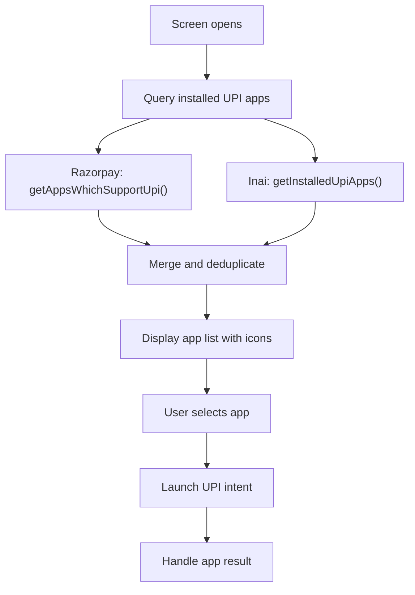
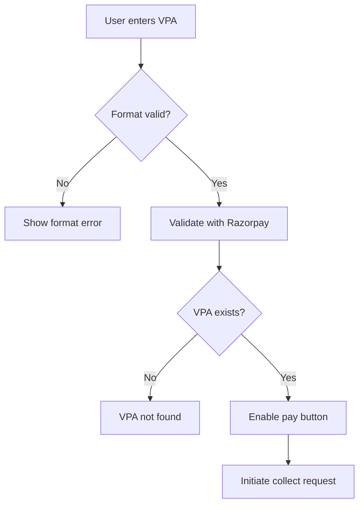
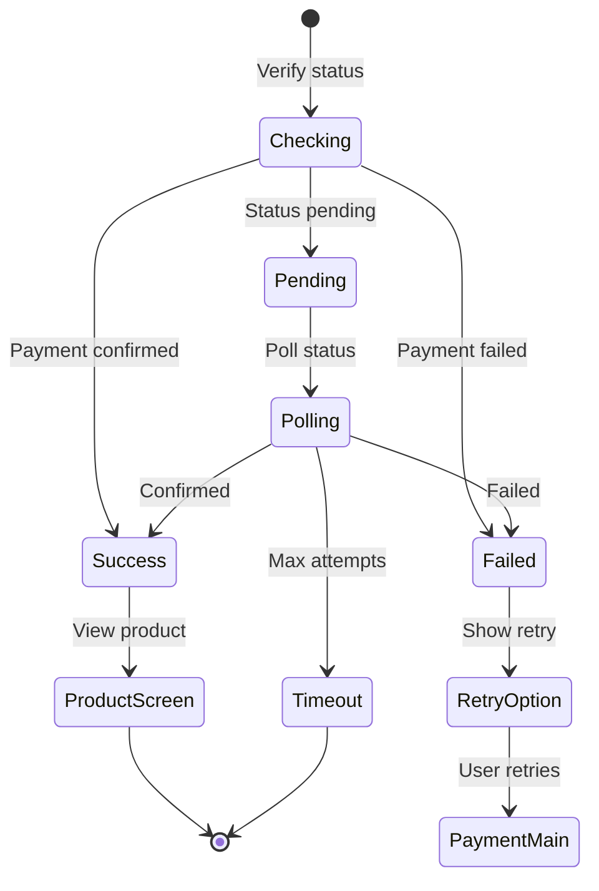
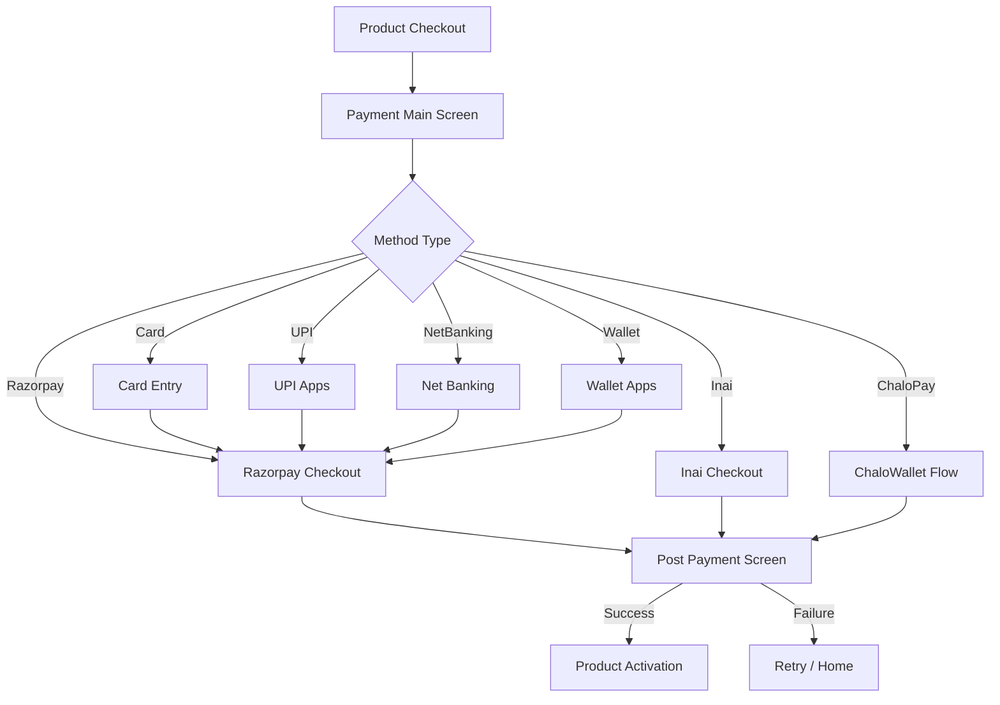

# Payment — Component Documentation

## Architecture Overview

The payment presentation layer implements a modular component architecture using Decompose. The main payment component orchestrates multiple gateway-specific components (Razorpay, Inai, Juspay) and method-specific screens (Card, UPI, NetBanking, Wallet). Each component follows MVI patterns with well-defined state contracts.

---

## Screen Inventory

| Screen | Component | Purpose |
|--------|-----------|---------|
| **Payment Main** | PaymentMainComponent | Payment method selection and orchestration |
| **Razorpay Checkout** | CheckoutViewModel | Razorpay SDK webview and flow management |
| **Inai Checkout** | InaiCheckoutViewModel | Inai SDK payment initiation |
| **Card Entry** | CheckoutCardComponent | Card number, expiry, CVV input |
| **Net Banking** | CheckoutNetBankingComponent | Bank selection with search |
| **UPI Apps** | CheckoutUpiAppsViewModel | UPI app selection and intent |
| **Wallet Apps** | CheckoutWalletAppsComponent | Wallet app selection |
| **Add UPI ID** | CheckoutAddUpiIdViewModel | Manual UPI VPA entry |
| **Post Payment** | CheckoutPostPaymentComponent | Success/failure display |

---

## Payment Main Screen

The payment main screen serves as the entry point for all payment flows. It displays available payment methods grouped by category and handles method selection.

### User Journey

1. User arrives from product checkout with order details
2. Screen loads available payment methods from API
3. Methods displayed in priority sections (Preferred, ChaloPay, UPI Apps, etc.)
4. User selects a payment method
5. Screen routes to appropriate gateway or method screen
6. On completion, navigates to post-payment screen

### State Flow

### View State Structure

The view state composes multiple UI states for different screen sections:

| State Component | Description |
|-----------------|-------------|
| **toolbarUiState** | Back button, title, progress indicator |
| **paymentCardListUiState** | List of payment method cards by section |
| **bottomSheetUiState** | Bottom sheets for errors, confirmations |
| **loaderUiState** | Full-screen and dialog loaders |
| **snackbarUIState** | Transient error messages |
| **fullScreenErrorUiState** | Full-screen error with retry |
| **confirmationDialogUiState** | Exit confirmation dialog |

### Payment Method Sections

Methods are grouped into priority-ordered sections:

| Section | Priority | Contains |
|---------|----------|----------|
| **PreferredModes** | 1 | User's previously used methods |
| **ChaloPay** | 2 | ChaloWallet with balance display |
| **UPIApps** | 3 | Third-party UPI apps (GPay, PhonePe, etc.) |
| **OneClickUPI** | 4 | Saved UPI accounts via Juspay |
| **OtherPaymentModes** | 5 | Card, NetBanking, Wallet, LazyPay |
| **NativeUPIApps** | 6 | Direct UPI intent apps |

### Intents

| Intent | Trigger | Action |
|--------|---------|--------|
| **ViewCreatedIntent** | Screen mount | Initialize with payment data |
| **LoadPaymentMethodsIntent** | After init | Fetch methods from API |
| **PaymentMethodSelected** | Card tap | Route to selected method flow |
| **PreferredItemSelected** | Preferred tap | Use preferred method |
| **NativeUpiAppSelected** | UPI app tap | Launch UPI intent |
| **GetPaymentStatus** | Gateway callback | Poll payment status |
| **ChaloPaySelectedFromWalletScreen** | Wallet confirm | Process wallet payment |
| **PaymentStatusBottomSheetPositiveButtonClicked** | Dialog action | Handle status action |

### Side Effects

| Effect | When Triggered | Result |
|--------|----------------|--------|
| **NavigateToRazorpay** | Razorpay method selected | Open Razorpay component |
| **NavigateToInai** | Inai method selected | Open Inai component |
| **LaunchUpiIntent** | UPI app selected | System intent to UPI app |
| **NavigateToPostPayment** | Payment complete | Show success/failure |
| **ShowChaloPayBottomSheet** | ChaloPay selected | Confirm wallet deduction |
| **ShowExitConfirmation** | Back pressed mid-payment | Exit confirmation dialog |

---

## Razorpay Checkout Screen

Handles Razorpay SDK integration via embedded webview and native callbacks.

### User Journey

1. Component receives Razorpay payment data
2. Initializes Razorpay SDK with order details
3. Displays SDK webview or launches native flow
4. Receives payment result callback
5. Verifies payment status with backend
6. Routes to post-payment screen

### State Flow

### View State

| Field | Type | Description |
|-------|------|-------------|
| **showCheckoutWebView** | Boolean | Display Razorpay webview |
| **showDialogLoader** | Boolean | Processing indicator |
| **showToolbar** | Boolean | Show/hide toolbar during SDK flow |

### Intents

| Intent | Description |
|--------|-------------|
| **InitiateCheckoutViewIntent** | Start Razorpay flow with data |
| **WebViewPageLoaded** | Webview finished loading |
| **LazyPayLoadingCompleted** | LazyPay BNPL page ready |
| **PaymentCompletedIntent.Success** | Razorpay success callback |
| **PaymentCompletedIntent.Failed** | Razorpay failure callback |
| **PaymentCompletedIntent.Unknown** | Ambiguous callback |
| **CheckoutBackPressed** | Handle back navigation |

### Side Effects

| Effect | Description |
|--------|-------------|
| **RazorpayFlowInitiated** | Trigger SDK with key, URL, and payment data |
| **LazyPayFlowInitiated** | Open LazyPay webview with URL |
| **PaymentCancelled** | User cancelled, navigate back |

---

## Inai Checkout Screen

Handles Inai SDK integration for alternate payment methods.

### User Journey

1. Component receives Inai order token and config
2. Initializes Inai SDK with configuration
3. Triggers payment via SDK
4. Receives result callback
5. Routes based on success/failure/cancelled

### State Flow

### View State

| Field | Type | Description |
|-------|------|-------------|
| **showToolbar** | Boolean | Show toolbar during Inai flow |

### Intents

| Intent | Description |
|--------|-------------|
| **InitialiseInaiIntent** | Initialize SDK with config |
| **PaymentCompletedIntent.Success** | Payment completed successfully |
| **PaymentCompletedIntent.Failed** | Payment failed |
| **PaymentCompletedIntent.Cancelled** | User cancelled payment |

### Side Effects

| Effect | Description |
|--------|-------------|
| **InitiatePayment** | Trigger Inai SDK with checkout, data, and method code |

---

## Card Entry Screen

Handles card details entry with real-time validation.

### User Journey

1. User navigates from payment main
2. Enters card number with Luhn validation
3. Enters expiry date (MM/YY format)
4. Enters CVV
5. Enters cardholder name
6. Taps pay button
7. Card data sent to gateway

### State Flow

### Input Validation

| Field | Rule | Error Message |
|-------|------|---------------|
| **Card Number** | ≥13 digits, Luhn valid | "Invalid card number" |
| **Expiry** | MM/YY, month 1-12, not expired | "Invalid expiry" |
| **CVV** | ≥3 digits | "Invalid CVV" |
| **Name** | Non-empty | "Name required" |

### Field Types for Validation

| Field Type | Validation Applied |
|------------|-------------------|
| **CARD_NUMBER** | Length + Luhn algorithm |
| **CARD_EXPIRY** | Format + date validation |
| **CARD_CVV** | Numeric length |
| **CARD_HOLDER_NAME** | Non-empty string |

---

## Net Banking Screen

Displays list of banks for selection with search functionality.

### User Journey

1. Screen shows list of popular banks
2. User can search by bank name
3. User selects bank from list
4. Bank code returned to payment flow
5. Redirect to bank's payment page

### Bank List Structure

| Category | Description |
|----------|-------------|
| **Popular Banks** | Top banks shown first |
| **All Banks** | Complete alphabetical list |
| **Search Results** | Filtered by user query |

### State

| Field | Description |
|-------|-------------|
| **bankList** | Full list of NetBankingPaymentInstrumentAppModel |
| **searchQuery** | Current search filter |
| **filteredBanks** | Banks matching search |
| **selectedBank** | Currently selected bank |

---

## UPI Apps Screen

Displays available UPI apps installed on user's device.

### User Journey

1. Screen detects installed UPI apps
2. Displays app icons with names
3. User taps preferred UPI app
4. Launches app via intent with payment details
5. Returns to app after UPI flow completes
6. Verifies payment status

### App Detection

### UPI App Data

| Field | Description |
|-------|-------------|
| **appName** | Display name (Google Pay, PhonePe, etc.) |
| **iconBase64** | App icon as base64 string |
| **appIdentifier** | Package name (Android) or URL scheme (iOS) |

---

## Add UPI ID Screen

Allows manual entry of UPI VPA (Virtual Payment Address).

### User Journey

1. User taps "Add UPI ID" option
2. Enters UPI ID (format: user@bank)
3. System validates VPA format
4. Optional: Validates VPA with Razorpay
5. Initiates UPI collect request
6. User approves in their UPI app

### Validation Flow

### VPA Format Rules

| Rule | Example |
|------|---------|
| Contains @ symbol | user@okhdfcbank |
| Non-empty username | (before @) |
| Valid bank suffix | (after @) |

---

## Wallet Apps Screen

Displays available wallet payment options.

### User Journey

1. Screen shows supported wallets
2. User selects wallet (PayTM, PhonePe, etc.)
3. Redirects to wallet app/webview
4. User completes payment in wallet
5. Returns to app with result

### Supported Wallets

Wallet list depends on gateway (Razorpay/Inai) and user eligibility.

| Field | Description |
|-------|-------------|
| **walletName** | Display name |
| **walletCode** | API identifier |
| **iconUrl** | Wallet logo URL |
| **isAvailable** | User eligibility |

---

## Post-Payment Screen

Handles success, failure, and pending states after payment attempt.

### User Journey

1. Receives payment result from gateway
2. Displays appropriate screen based on status
3. Shows product details on success
4. Provides retry option on failure
5. Navigates to product activation or home

### State Flow

### Success Product Types

| Product Type | Display | Navigation Target |
|--------------|---------|-------------------|
| **InstantTicket** | QR code, booking ID | Ticket activation |
| **SuperPass** | Pass details, QR | Pass activation |
| **PremiumReserveTicket** | Booking confirmation | Premium bus tracking |
| **OndcTicket** | ONDC ticket details | ONDC ticket screen |
| **MetroTicket** | Metro pass/ticket | Metro ticket screen |
| **MTicket** | M-Ticket QR | M-Ticket activation |
| **OtherProduct** | Generic success | Home screen |

### Failure Handling

| Failure Type | User Action | System Action |
|--------------|-------------|---------------|
| **Gateway Error** | Retry payment | Show error message |
| **Timeout** | Check status later | Poll periodically |
| **Insufficient Funds** | Top up wallet | Show balance |
| **Cancelled** | Try again | Return to methods |

---

## Navigation Flow

---

## Analytics Events

| Event | Trigger | Key Properties |
|-------|---------|----------------|
| **payment_screen_opened** | Screen mount | order_id, amount, product_type |
| **payment_methods_loaded** | API response | methods_count, preferred_count |
| **payment_method_selected** | User selection | method_type, gateway |
| **payment_initiated** | Gateway call | gateway, method, amount |
| **payment_success** | Success callback | transaction_id, gateway |
| **payment_failure** | Failure callback | error_code, error_message |
| **payment_cancelled** | User back press | step, method |
| **upi_app_selected** | UPI tap | app_name, package_name |
| **chalopay_selected** | Wallet selected | wallet_balance, amount |

---

## Error Handling

| Error Scenario | UI Response | Recovery Action |
|----------------|-------------|-----------------|
| **Methods load failed** | Full-screen error | Retry button |
| **Gateway timeout** | Pending status | Auto-poll status |
| **Gateway error** | Error bottom sheet | Retry or change method |
| **UPI app not found** | Remove from list | Show other methods |
| **Insufficient balance** | Balance warning | Top-up prompt |
| **Network error** | Snackbar | Retry action |
| **Session expired** | Error dialog | Re-authenticate |
