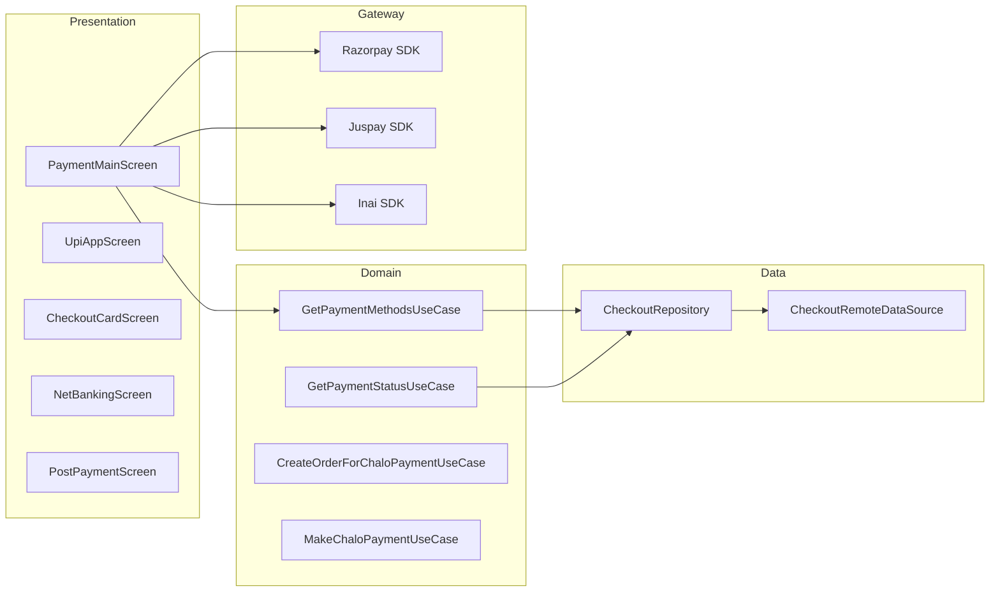

# Payment — High-Level Design

## Overview

The Payment feature handles all payment processing in the Chalo app. It supports multiple payment gateways (Razorpay, Juspay, Inai), various payment methods (UPI, cards, net banking, wallets), and integrates with Chalo Pay (internal wallet). The feature includes checkout screens, payment method selection, and post-payment success/failure handling.

## User Journey

1. **Entry Points**:
   - Product checkout (tickets, passes, premium bus)
   - Wallet recharge
   - Card recharge (NCMC)

2. **Core Flow**:
   - View order summary and total
   - Select payment method (UPI, card, net banking, wallet)
   - Process payment via gateway
   - View success/failure screen
   - Navigate to activated product

3. **Exit Points**:
   - Payment success → Product activation screen
   - Payment failure → Retry or return to product
   - Payment cancelled → Return to previous screen

## Architecture Diagram



## Key Components

| Component | Platform | File Path | Responsibility |
|-----------|----------|-----------|----------------|
| `PaymentMainComponent` | Shared | `shared/checkout/.../ui/screen/payment/PaymentMainComponent.kt` | Payment method selection |
| `CheckoutViewModel` | Shared | `shared/checkout/.../ui/screen/checkout/razorpay/CheckoutViewModel.kt` | Razorpay checkout |
| `InaiCheckoutViewModel` | Shared | `shared/checkout/.../ui/screen/checkout/inai/InaiCheckoutViewModel.kt` | Inai checkout |
| `CheckoutPostPaymentComponent` | Shared | `shared/checkout/.../ui/screen/postpayment/CheckoutPostPaymentComponent.kt` | Success/failure handling |
| `GetPaymentMethodsUseCase` | Shared | `shared/checkout/.../domain/GetPaymentMethodsUseCase.kt` | Fetch available methods |
| `GetPaymentStatusUseCase` | Shared | `shared/checkout/.../domain/GetPaymentStatusUseCase.kt` | Check payment status |
| `CheckoutRepository` | Shared | `shared/checkout/.../data/repository/CheckoutRepository.kt` | Payment data abstraction |
| `RazorpaySdk` | Android/iOS | `shared/checkout/.../paymentprovider/razorpay/RazorpaySdk.kt` | Razorpay SDK wrapper |

## Data Flow

### Payment Method Selection
1. `PaymentMainComponent` initializes with order details
2. `GetPaymentMethodsUseCase` fetches available methods from API
3. Methods filtered by `FilterValidPaymentMethodsUseCase`
4. UI displays preferred methods + all options
5. User selects payment method

### Razorpay Payment
1. `CreateRazorPayDataUseCase` builds payment data
2. `RazorpaySdk.submit()` launches Razorpay SDK
3. `RazorpayResultListener` handles callback
4. `GetPaymentStatusUseCase` verifies on server
5. Navigate to post-payment screen

### Juspay Payment
1. `CreateJusPaySDKRequestJsonUseCase` builds request
2. `JuspaySdkManager.processRequest()` initiates payment
3. `ProcessJuspayResultObjectUseCase` handles result
4. Verify and navigate to result screen

### Chalo Pay (Wallet) Payment
1. Check wallet balance
2. `CreateOrderForChaloPaymentUseCase` creates order
3. `MakeChaloPaymentUseCase` deducts from wallet
4. Update wallet balance
5. Navigate to success screen

## Platform Differences

### Android-Specific
- Native Razorpay SDK integration
- Native Juspay HyperServices SDK
- Inai SDK for alternate payment methods
- UPI intent resolution for installed apps

### iOS-Specific
- Razorpay iOS SDK wrapper
- Juspay iOS integration
- Limited UPI app detection

## Integration Points

### Analytics Events
- See [Analytics: payment](/analytics/flows/payment) for event documentation
- Key events:
  - `payment_screen_opened`
  - `payment_method_selected`
  - `payment_initiated`
  - `payment_success` / `payment_failure`
  - `razorpay_callback_received`

### Shared Services
- **Wallet**: `WalletRepository` for Chalo Pay
- **Checkout**: Order management
- **Analytics**: Payment tracking

### Navigation
- **Navigates to**: Post-payment, Product activation
- **Navigated from**: Product checkout, Wallet recharge

## Payment Methods

| Method | Gateway | Implementation |
|--------|---------|----------------|
| UPI Intent | Razorpay/Inai | Native app deep linking |
| UPI Collect | Razorpay/Inai | VPA collection |
| Credit/Debit Card | Razorpay | Card entry form |
| Net Banking | Razorpay | Bank selection |
| Wallets | Razorpay | PayTM, PhonePe, etc. |
| Chalo Pay | Internal | Wallet deduction |
| LazyPay | Razorpay | BNPL integration |

## Edge Cases & Error Handling

| Scenario | Handling |
|----------|----------|
| Payment timeout | Shows pending status, polls for result |
| Gateway error | Shows error with retry option |
| Insufficient wallet balance | Shows top-up prompt |
| Network failure | Retry with cached order |
| UPI app not installed | Filters from available options |
| Payment cancelled | Returns to payment method selection |

## Post-Payment States

```kotlin
sealed class PostPaymentSuccessProductType {
    data class InstantTicket(val bookingId: String)
    data class SuperPass(val qrCode: String, val passId: String)
    data class PremiumReserveTicket(...)
    data class OndcTicket(...)
    data class MetroTicket(...)
    data class MTicket(...)
}
```

## Data Models

### PaymentMethodsAppModel
```kotlin
data class PaymentMethodsAppModel(
    val preferredMethods: List<PreferredPaymentMethodsAppModel>,
    val options: List<PaymentMethodOptionsAppModel>
)

sealed class PaymentMethodOptionsAppModel {
    object ChaloPay
    object JuspayTurboUpi
    sealed class RazorPayPaymentMethodOption {
        object LazyPay
        object Card
        object UPI
        object Wallet
        object NetBanking
    }
}
```

### CheckoutErrorType
```kotlin
sealed class CheckoutErrorType {
    object Unknown
    object UnknownPaymentProvider
    object ResponseParsing
    data class API(val message: String?)
    data class Local(val message: String?)
    object InvalidData
}
```

## Dependencies

### Internal
- `shared:checkout` — Payment UI and domain
- `shared:wallet` — Chalo Pay integration
- `shared:network` — API client

### External
- Razorpay SDK — Primary payment gateway
- Juspay HyperServices SDK — Alternate gateway
- Inai SDK — International payments
