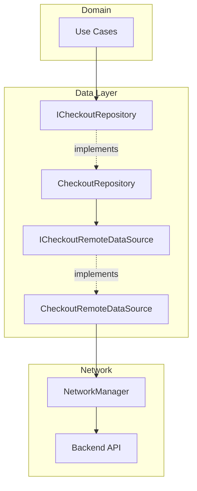
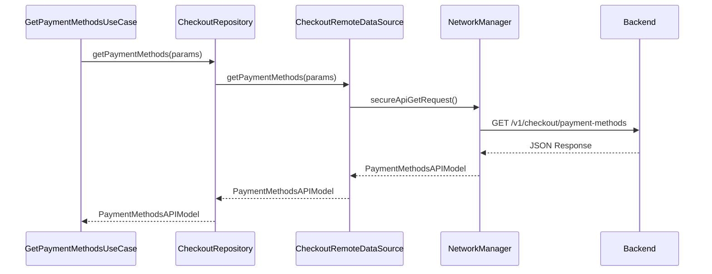
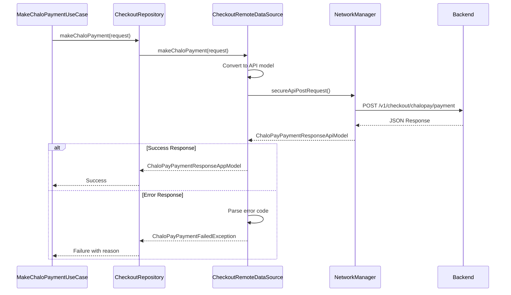
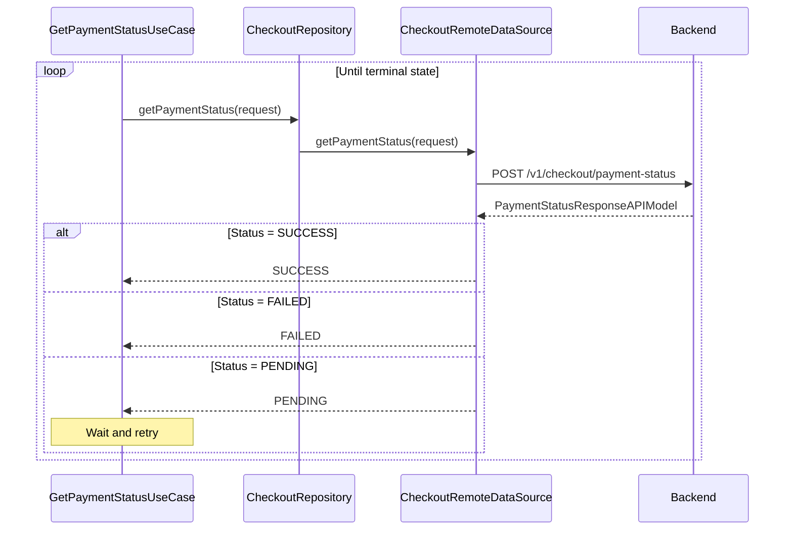
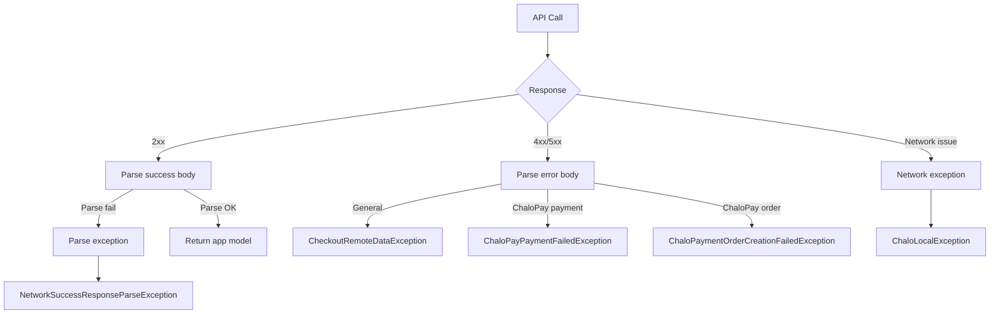

# Payment — Repository Documentation

## Data Layer Overview

The payment data layer handles all API communication for checkout operations. The layer consists of the repository interface, its implementation, and the remote data source that makes HTTP calls. It supports multiple payment gateways (Razorpay, Inai, Juspay) and the internal ChaloWallet system.

---

## Repository Interface

The `ICheckoutRepository` interface defines all checkout data operations.

### Operations

| Method | Purpose | Returns |
|--------|---------|---------|
| **getPaymentMethods** | Fetch available payment options | PaymentMethodsAPIModel |
| **getOrderStatus** | Check order validity | OrderStatus |
| **getPaymentStatus** | Poll payment completion | PaymentStatus |
| **getLazyPayWebUrl** | Get LazyPay redirect URL | LazyPayResponseApiModel |
| **createChaloPayOrder** | Create wallet payment order | ChaloPayOrderResponseAppModel |
| **makeChaloPayment** | Execute wallet deduction | ChaloPayPaymentResponseAppModel |
| **getJusPaySignature** | Get Juspay auth signature | JusPaySignaturesAppModel |

---

## API Endpoints

### Get Payment Methods

Fetches available payment methods based on agency and city.

| Property | Value |
|----------|-------|
| **Endpoint** | GET /v1/checkout/payment-methods |
| **Auth** | Required (Bearer token) |

**Query Parameters:**

| Parameter | Type | Description |
|-----------|------|-------------|
| **agency** | String | Transit agency code |
| **city** | String | City name |

**Response: PaymentMethodsAPIModel**

| Field | Type | Description |
|-------|------|-------------|
| **paymentMethodErrorCopy** | String? | Error message if any |
| **paymentMethodOptions** | List | Available payment options |
| **preferredPaymentMethods** | List | User's preferred methods |

---

### Get Order Status

Retrieves current status of an order before payment.

| Property | Value |
|----------|-------|
| **Endpoint** | POST /v1/checkout/order-status |
| **Auth** | Required |

**Request Body:**

| Field | Type | Description |
|-------|------|-------------|
| **chaloOrderId** | String | Internal order ID |

**Response: OrderStatus**

Order validity and details.

---

### Get Payment Status

Polls payment completion status after gateway callback.

| Property | Value |
|----------|-------|
| **Endpoint** | POST /v1/checkout/payment-status |
| **Auth** | Required |

**Request Body: PaymentStatusRequestApiModel**

| Field | Type | Description |
|-------|------|-------------|
| **orderId** | String | Gateway order ID |
| **chaloOrderId** | String | Internal order ID |
| **transactionId** | String | Payment transaction ID |
| **instrumentName** | String? | Payment app used (UPI) |

**Response: PaymentStatusResponseAPIModel**

| Field | Type | Description |
|-------|------|-------------|
| **status** | PaymentStatus | SUCCESS, PENDING, FAILED, UNKNOWN |

---

### Get LazyPay Web URL

Retrieves LazyPay BNPL redirect URL.

| Property | Value |
|----------|-------|
| **Endpoint** | POST /v1/checkout/lazypay/url |
| **Auth** | Required |

**Request Body: LazyPayRequestApiModel**

| Field | Type | Description |
|-------|------|-------------|
| **eligibilityId** | String | LazyPay eligibility ID |
| **chaloOrderId** | String | Order to pay |

**Response: LazyPayResponseApiModel**

| Field | Type | Description |
|-------|------|-------------|
| **url** | String | LazyPay checkout URL |

---

### Create ChaloWallet Order

Creates a payment order for wallet deduction.

| Property | Value |
|----------|-------|
| **Endpoint** | POST /v1/checkout/chalopay/order |
| **Auth** | Required |

**Request Body: ChaloPayOrderRequestApiModel**

| Field | Type | Description |
|-------|------|-------------|
| **chaloOrderId** | String | Original product order |
| **providerId** | Int | Payment provider ID |
| **city** | String | User's city |
| **walletId** | String | User's wallet ID |

**Response: ChaloPayOrderResponseApiModel**

| Field | Type | Description |
|-------|------|-------------|
| **newChaloOrderId** | String | Payment order ID |
| **amount** | Double | Amount to deduct |

---

### Make ChaloWallet Payment

Executes the wallet balance deduction.

| Property | Value |
|----------|-------|
| **Endpoint** | POST /v1/checkout/chalopay/payment |
| **Auth** | Required |

**Request Body: ChaloPayPaymentRequestApiModel**

| Field | Type | Description |
|-------|------|-------------|
| **walletId** | String | User's wallet ID |
| **orderId** | String | Payment order ID |
| **mobileNumber** | String | User phone |
| **countryCode** | String | Phone country code |
| **amount** | Double | Amount to deduct |

**Response: ChaloPayPaymentResponseApiModel**

| Field | Type | Description |
|-------|------|-------------|
| **status** | ChaloPaymentStatus | SUCCESS, FAILED, PENDING |
| **transactionId** | String? | Transaction reference |

---

### Get Juspay Signature

Retrieves authentication signature for Juspay SDK.

| Property | Value |
|----------|-------|
| **Endpoint** | POST /v1/checkout/juspay/signature |
| **Auth** | Required |

**Request Body: JusPaySignatureRequestApiModel**

Multiple request types supported:

| Request Type | Purpose |
|--------------|---------|
| **InitiateSDK** | Initialize SDK session |
| **GetUpiSessionToken** | Get UPI session token |
| **OnboardingAndPay** | Register and pay |
| **Management** | Manage saved methods |
| **UpdateSessionToken** | Refresh session |

**Response: JusPaySignatureResponseApiModel**

| Field | Type | Description |
|-------|------|-------------|
| **signature** | String | Auth signature |
| **clientAuthToken** | String? | Client token |
| **sessionToken** | String? | Session token |

---

## Data Flow Diagrams

### Payment Methods Fetch

### ChaloWallet Payment Flow

### Payment Status Polling

---

## Data Transformation

### API to App Model Mapping

**Payment Methods:**

| API Field | App Field | Transform |
|-----------|-----------|-----------|
| paymentMethodOptions | options | Type-specific conversion |
| preferredPaymentMethods | preferredMethods | Direct mapping |
| paymentMethodErrorCopy | errorMessage | Direct |

**Payment Status:**

| API Value | App Enum |
|-----------|----------|
| "SUCCESS" | PaymentStatus.SUCCESS |
| "PENDING" | PaymentStatus.PENDING |
| "FAILED" | PaymentStatus.FAILED |
| Other | PaymentStatus.UNKNOWN |

**ChaloWallet Payment Status:**

| API Value | App Enum |
|-----------|----------|
| "SUCCESS" | ChaloPaymentStatus.SUCCESS |
| "FAILED" | ChaloPaymentStatus.FAILED |
| "PENDING" | ChaloPaymentStatus.PENDING |
| Other | ChaloPaymentStatus.UNKNOWN |

---

## Exception Handling

### Exception Flow

### Error Types

| Exception | When Thrown | Contains |
|-----------|-------------|----------|
| **CheckoutRemoteDataException** | General API error | errorResponse, message |
| **ChaloPayPaymentFailedException** | Wallet payment failed | genericChaloErrorResponse |
| **ChaloPaymentOrderCreationFailedException** | Order creation failed | genericChaloErrorResponse |
| **ChaloLocalException** | Network/local error | message |
| **NetworkSuccessResponseParseException** | JSON parse failed | message |

### Error Code Mapping

**ChaloWallet Payment Errors:**

| Error Code | Reason | User Message |
|------------|--------|--------------|
| 2013 | WALLET_NOT_FOUND_ERROR | "Wallet not found" |
| 2014 | WALLET_INACTIVE_ERROR | "Wallet is inactive" |
| 2015 | RECLAIM_ERROR | "Reclaim in progress" |
| 2019 | WALLET_BLOCKED_ERROR | "Wallet is blocked" |
| 2020 | INSUFFICIENT_BALANCE_ERROR | "Insufficient balance" |
| 5001 | ORDER_NOT_FOUND | "Order not found" |

**ChaloWallet Order Creation Errors:**

| Error Code | Reason | User Message |
|------------|--------|--------------|
| 4000 | ORDER_NOT_FOUND | "Order not found" |
| 4006 | ORDER_EXPIRED | "Order has expired" |
| 4009 | WALLET_NOT_FOUND_ERROR | "Wallet not found" |
| 4010 | INSUFFICIENT_WALLET_BALANCE | "Insufficient balance" |
| 4011 | WALLET_RECLAIM_ERROR | "Reclaim in progress" |
| 4012 | WALLET_INACTIVE_ERROR | "Wallet is inactive" |
| 4013 | WALLET_BLOCKED_ERROR | "Wallet is blocked" |

**Payment Status Errors:**

| Error Code | Reason |
|------------|--------|
| 6050 | BOOKING_UNSUCCESSFUL |

---

## Local Storage

The payment feature does not maintain significant local storage. Payment state is transient and managed by:

| Data | Storage | Purpose |
|------|---------|---------|
| **Pending transactions** | Memory | Track in-flight payments |
| **Selected method** | Component state | User selection |
| **Order details** | Navigation args | Pass between screens |

Wallet balance is managed by `WalletRepository` (separate module).

---

## Dependency Injection

### Module Bindings

| Interface | Implementation |
|-----------|----------------|
| ICheckoutRepository | CheckoutRepository |
| ICheckoutRemoteDataSource | CheckoutRemoteDataSource |

### Repository Dependencies

**CheckoutRepository:**

| Dependency | Purpose |
|------------|---------|
| ICheckoutRemoteDataSource | API calls |
| NetworkManager | HTTP client |

**CheckoutRemoteDataSource:**

| Dependency | Purpose |
|------------|---------|
| NetworkManager | HTTP client |
| AnalyticsHelper | Debug logging |

---

## Request/Response Models

### Request Models

**ChaloPayOrderRequestApiModel:**

| Field | Type | Required |
|-------|------|----------|
| chaloOrderId | String | Yes |
| providerId | Int | Yes |
| city | String | Yes |
| walletId | String | Yes |

**ChaloPayPaymentRequestApiModel:**

| Field | Type | Required |
|-------|------|----------|
| walletId | String | Yes |
| orderId | String | Yes |
| mobileNumber | String | Yes |
| countryCode | String | Yes |
| amount | Double | Yes |

**PaymentStatusRequestApiModel:**

| Field | Type | Required |
|-------|------|----------|
| orderId | String | Yes |
| chaloOrderId | String | Yes |
| transactionId | String | Yes |
| instrumentName | String | No |

**LazyPayRequestApiModel:**

| Field | Type | Required |
|-------|------|----------|
| eligibilityId | String | Yes |
| chaloOrderId | String | Yes |

**JusPaySignatureRequestApiModel (variants):**

| Variant | Key Fields |
|---------|------------|
| InitiateSDK | clientId, merchantId |
| GetUpiSessionToken | sessionToken |
| OnboardingAndPay | orderId, amount, customerId |
| Management | customerId |
| UpdateSessionToken | sessionToken |

### Response Models

**PaymentMethodsAPIModel:**

| Field | Type |
|-------|------|
| paymentMethodErrorCopy | String? |
| paymentMethodOptions | List<PaymentMethodOptionsAppModel> |
| preferredPaymentMethods | List<PreferredPaymentMethodsAppModel> |

**PaymentStatusResponseAPIModel:**

| Field | Type |
|-------|------|
| status | String (SUCCESS/PENDING/FAILED) |

**ChaloPayOrderResponseApiModel:**

| Field | Type |
|-------|------|
| newChaloOrderId | String |
| amount | Double |

**ChaloPayPaymentResponseApiModel:**

| Field | Type |
|-------|------|
| status | String |
| transactionId | String? |

**LazyPayResponseApiModel:**

| Field | Type |
|-------|------|
| url | String |

**JusPaySignatureResponseApiModel:**

| Field | Type |
|-------|------|
| signature | String |
| clientAuthToken | String? |
| sessionToken | String? |

---

## Gateway SDK Integration

The repository layer also coordinates with payment gateway SDKs through expect/actual patterns:

### Razorpay SDK

| Operation | Method |
|-----------|--------|
| Get UPI apps | getAppsWhichSupportUpi() |
| Validate VPA | isValidVpa() |
| Submit payment | submit() |
| Get bank logo | getBankLogoUrl() |
| Get wallet logo | getWalletSqLogoUrl() |

### Inai SDK

| Operation | Method |
|-----------|--------|
| Initialize | InaiSdkCheckout(config) |
| Make payment | makePayment() |
| Validate fields | validateFields() |
| Execute action | execute() |

### Juspay SDK

| Operation | Method |
|-----------|--------|
| Initialize | initiate() |
| Process payment | process() |
| Check subscription | hasActiveSubscription() |
| Handle back | onBackPressed() |

---

## Network Configuration

### Headers

All checkout API calls include:

| Header | Value |
|--------|-------|
| Authorization | Bearer {token} |
| Content-Type | application/json |
| X-Platform | android/ios |
| X-App-Version | {version} |

### Timeouts

| Operation | Timeout |
|-----------|---------|
| Payment methods | 30s |
| Payment status | 15s |
| ChaloWallet operations | 30s |
| Juspay signature | 15s |

### Retry Policy

| Scenario | Retry |
|----------|-------|
| Network timeout | 1 retry |
| 5xx errors | 1 retry |
| Payment status polling | Up to 10 times (2s interval) |
