# Payment — UseCase Documentation

## Domain Layer Overview

The payment domain layer orchestrates all payment operations through specialized use cases. Use cases handle payment method retrieval, gateway-specific data preparation, payment execution, and status verification. The layer coordinates between multiple payment gateways (Razorpay, Inai, Juspay) and the internal ChaloWallet system.

```mermaid
flowchart TB
    subgraph Presentation
        PaymentMain["PaymentMainComponent"]
        Razorpay["CheckoutViewModel"]
        Inai["InaiCheckoutViewModel"]
        Juspay["JuspaySdkManager"]
    end

    subgraph Domain["Domain Layer"]
        subgraph Core["Core Use Cases"]
            GetMethods["GetPaymentMethodsUseCase"]
            GetStatus["GetPaymentStatusUseCase"]
            GetOrderStatus["GetOrderStatusUseCase"]
            FilterMethods["FilterValidPaymentMethodsUseCase"]
        end

        subgraph ChaloWallet["ChaloWallet Use Cases"]
            CreateOrder["CreateOrderForChaloPaymentUseCase"]
            MakePayment["MakeChaloPaymentUseCase"]
        end

        subgraph RazorpayUC["Razorpay Use Cases"]
            CreateRazorpay["CreateRazorPayDataUseCase"]
            ValidateRazorpay["ValidateRazorPayDataUseCase"]
            ValidateVPA["ValidateVPAUseCase"]
            GetUpiApps["GetRazorPaySupportedUpiAppsUseCase"]
            GetLazyPay["GetLazyPayCheckoutUrlUseCase"]
        end

        subgraph InaiUC["Inai Use Cases"]
            CreateInai["CreateInaiPaymentDataUseCase"]
            GetInaiCheckout["GetInaiCheckoutUseCase"]
            ConvertInaiMethods["ConvertPaymentMethodsApiModelToAppModelForInaiUseCase"]
        end

        subgraph JuspayUC["Juspay Use Cases"]
            CreateJuspay["CreateJusPaySDKRequestJsonUseCase"]
            ProcessJuspay["ProcessJuspayResultObjectUseCase"]
        end

        subgraph Validation["Validation Use Cases"]
            ValidateCard["ValidateCheckoutCardDataUseCase"]
        end
    end

    subgraph Data
        Repo["CheckoutRepository"]
        WalletRepo["WalletRepository"]
    end

    PaymentMain --> GetMethods
    PaymentMain --> FilterMethods
    PaymentMain --> GetStatus
    Razorpay --> CreateRazorpay
    Razorpay --> ValidateRazorpay
    Inai --> CreateInai
    Inai --> GetInaiCheckout
    Juspay --> CreateJuspay
    Juspay --> ProcessJuspay
    GetMethods --> Repo
    CreateOrder --> Repo
    MakePayment --> WalletRepo
```

---

## Use Case Inventory

| Use Case | Purpose | Called From |
|----------|---------|-------------|
| **GetPaymentMethodsUseCase** | Fetch available payment methods | PaymentMainComponent |
| **GetPaymentStatusUseCase** | Poll payment completion status | PaymentMainComponent |
| **GetOrderStatusUseCase** | Check order status | PaymentMainComponent |
| **FilterValidPaymentMethodsUseCase** | Filter methods by eligibility | PaymentMainComponent |
| **PaymentMethodsCheckoutItemsUseCase** | Convert methods to UI items | PaymentMainComponent |
| **CreateOrderForChaloPaymentUseCase** | Create ChaloWallet order | PaymentMainComponent |
| **MakeChaloPaymentUseCase** | Execute wallet payment | PaymentMainComponent |
| **CreateRazorPayDataUseCase** | Build Razorpay payment data | CheckoutViewModel |
| **ValidateRazorPayDataUseCase** | Validate Razorpay fields | CheckoutViewModel |
| **ValidateVPAUseCase** | Validate UPI ID format | CheckoutAddUpiIdViewModel |
| **GetRazorPaySupportedUpiAppsUseCase** | Get installed UPI apps | PaymentMainComponent |
| **GetLazyPayCheckoutUrlUseCase** | Get LazyPay redirect URL | CheckoutViewModel |
| **CreateInaiPaymentDataUseCase** | Build Inai payment data | InaiCheckoutViewModel |
| **GetInaiCheckoutUseCase** | Initialize Inai SDK | InaiCheckoutViewModel |
| **ConvertPaymentMethodsApiModelToAppModelForInaiUseCase** | Convert Inai API response | GetPaymentMethodsUseCase |
| **CreateJusPaySDKRequestJsonUseCase** | Build Juspay request JSON | JuspaySdkManager |
| **ProcessJuspayResultObjectUseCase** | Parse Juspay result | JuspaySdkManager |
| **ValidateCheckoutCardDataUseCase** | Validate card input fields | CheckoutCardComponent |

---

## Get Payment Methods Use Case

**Responsibility:** Fetches available payment methods from API and converts them to app models based on payment provider.

### Flow

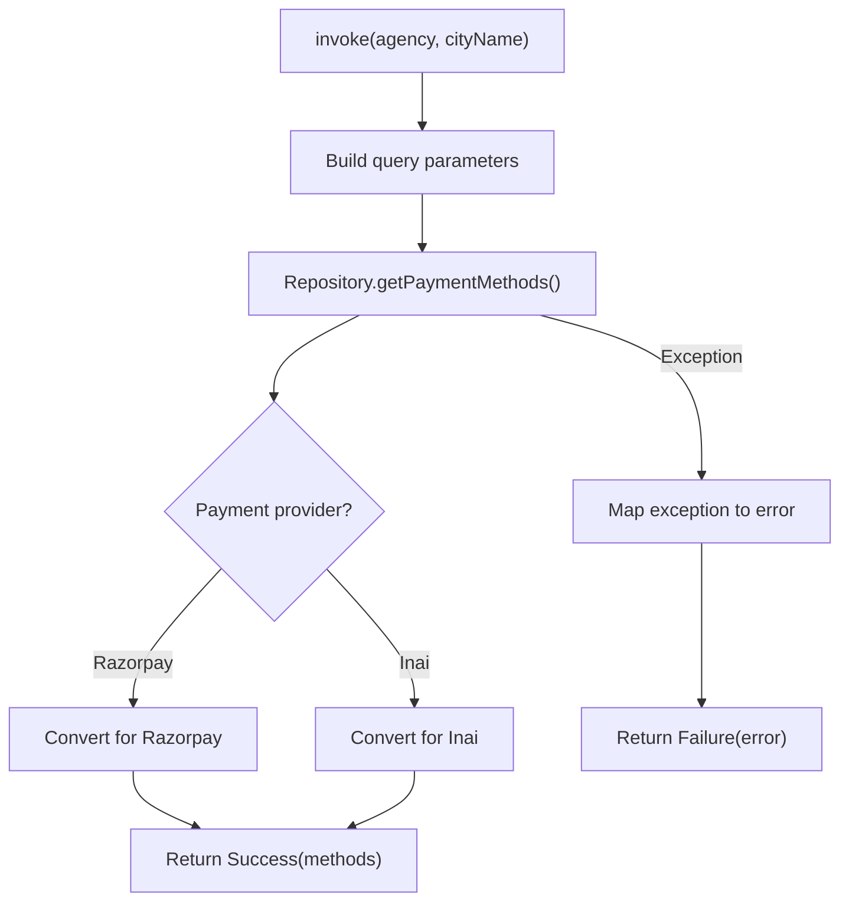

### Input Parameters

| Parameter | Type | Description |
|-----------|------|-------------|
| **agency** | String | Transit agency code |
| **cityName** | String | City for regional methods |

### Output: PaymentMethodsAppModel

| Field | Type | Description |
|-------|------|-------------|
| **preferredMethods** | List | User's frequently used methods |
| **options** | List | All available payment options |

### Payment Method Options

| Option Type | Description |
|-------------|-------------|
| **ChaloPay** | ChaloWallet payment |
| **JuspayTurboUpi** | Juspay one-click UPI |
| **RazorPayPaymentMethodOption.Card** | Credit/debit card |
| **RazorPayPaymentMethodOption.UPI** | UPI with app list |
| **RazorPayPaymentMethodOption.Wallet** | Third-party wallets |
| **RazorPayPaymentMethodOption.NetBanking** | Bank transfer |
| **RazorPayPaymentMethodOption.LazyPay** | BNPL option |
| **InaiPaymentMethodOption.**** | Inai-specific variants |

### Error Types

| Error | Cause | Handling |
|-------|-------|----------|
| **Unknown** | Unexpected error | Show generic message |
| **UnknownPaymentProvider** | Invalid provider config | Log and show error |
| **ResponseParsing** | JSON parse failure | Show generic error |
| **API** | Server error with code | Show server message |
| **Local** | Local storage error | Show generic error |

---

## Get Payment Status Use Case

**Responsibility:** Polls backend to verify payment completion after gateway callback.

### Flow

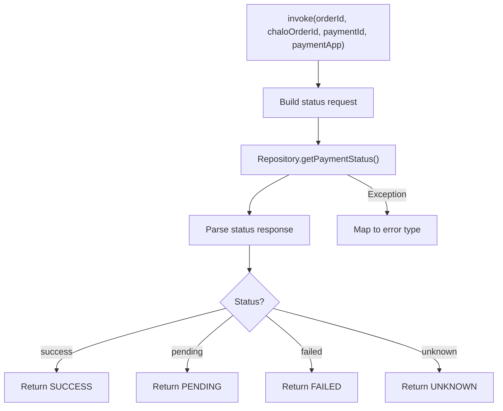

### Input Parameters

| Parameter | Type | Description |
|-----------|------|-------------|
| **orderId** | String | Gateway order ID |
| **chaloOrderId** | String | Internal order ID |
| **paymentId** | String | Transaction ID |
| **paymentApp** | String? | UPI app used (optional) |

### Output: PaymentStatus

| Status | Meaning | Next Action |
|--------|---------|-------------|
| **SUCCESS** | Payment confirmed | Navigate to success |
| **PENDING** | Still processing | Poll again |
| **FAILED** | Payment failed | Show failure |
| **UNKNOWN** | Status unclear | Show pending UI |

---

## Get Order Status Use Case

**Responsibility:** Retrieves current order status to check validity before payment.

### Flow

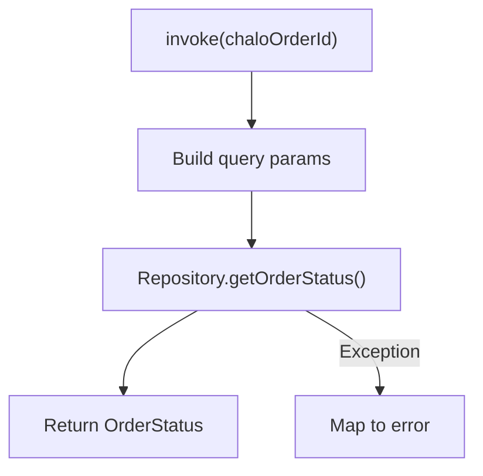

### Input/Output

| Direction | Type | Description |
|-----------|------|-------------|
| **Input** | String | Chalo order ID |
| **Output** | OrderStatus | Current order state |

---

## Create Order For Chalo Payment Use Case

**Responsibility:** Creates an order in the backend for ChaloWallet payment, validating user authentication and wallet availability.

### Flow

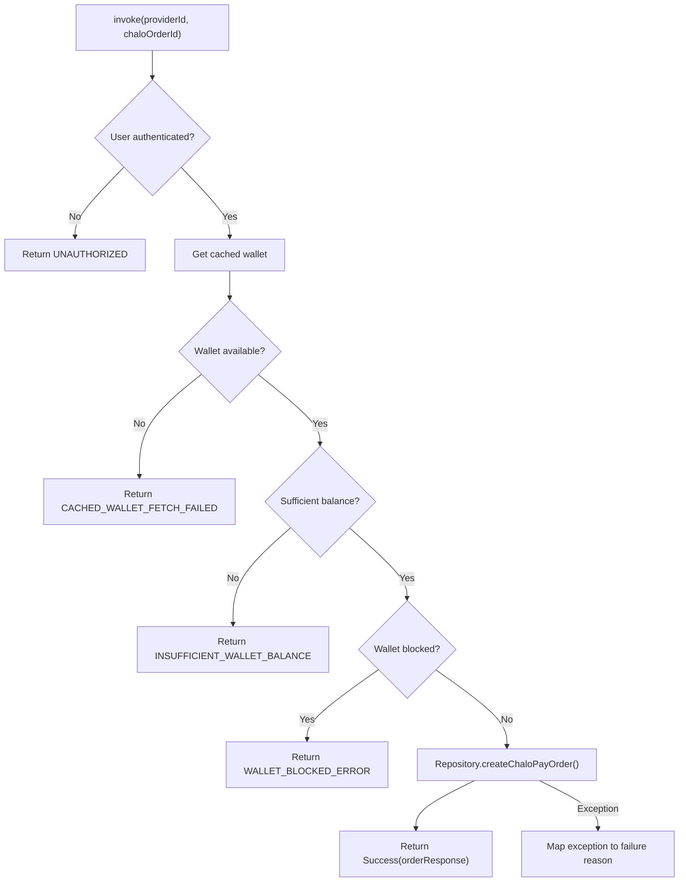

### Input Parameters

| Parameter | Type | Description |
|-----------|------|-------------|
| **providerId** | Int | Payment provider ID |
| **chaloOrderId** | String | Order to pay for |

### Output: ChaloPayOrderResponseAppModel

| Field | Type | Description |
|-------|------|-------------|
| **newChaloOrderId** | String | Created payment order ID |
| **amount** | Double | Amount to deduct |

### Failure Reasons

| Reason | Error Code | Cause |
|--------|------------|-------|
| **UNKNOWN_ERROR** | 0 | Unexpected error |
| **CACHED_WALLET_FETCH_FAILED** | 1 | Cannot get wallet data |
| **UNAUTHORIZED** | 2 | User not logged in |
| **INTERNAL_SERVER_ERROR** | 1004 | Backend error |
| **ORDER_NOT_FOUND** | 4000 | Order doesn't exist |
| **ORDER_EXPIRED** | 4006 | Order timed out |
| **WALLET_NOT_FOUND_ERROR** | 4009 | No wallet for user |
| **INSUFFICIENT_WALLET_BALANCE** | 4010 | Balance too low |
| **WALLET_RECLAIM_ERROR** | 4011 | Reclaim in progress |
| **WALLET_INACTIVE_ERROR** | 4012 | Wallet deactivated |
| **WALLET_BLOCKED_ERROR** | 4013 | Wallet blocked |

---

## Make Chalo Payment Use Case

**Responsibility:** Executes the actual wallet deduction and payment.

### Flow

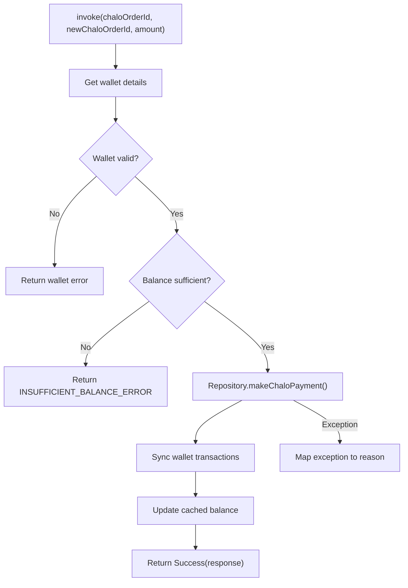

### Input Parameters

| Parameter | Type | Description |
|-----------|------|-------------|
| **chaloOrderId** | String | Original order ID |
| **newChaloOrderId** | String | Payment order ID |
| **amount** | Double | Amount to deduct |

### Output: ChaloPayPaymentResponseAppModel

| Field | Type | Description |
|-------|------|-------------|
| **status** | ChaloPaymentStatus | Payment result |
| **transactionId** | String? | Transaction reference |

### Failure Reasons

| Reason | Error Code | Description |
|--------|------------|-------------|
| **UNKNOWN_ERROR** | 0 | Unexpected failure |
| **INSUFFICIENT_BALANCE_ERROR** | 2020 | Not enough funds |
| **WALLET_BLOCKED_ERROR** | 2019 | Wallet is blocked |
| **WALLET_INACTIVE_ERROR** | 2014 | Wallet deactivated |
| **RECLAIM_ERROR** | 2015 | Reclaim in progress |
| **WALLET_NOT_FOUND_ERROR** | 2013 | Wallet not found |
| **ORDER_NOT_FOUND** | 5001 | Order missing |

---

## Create RazorPay Data Use Case

**Responsibility:** Builds the payment data object required by Razorpay SDK.

### Flow

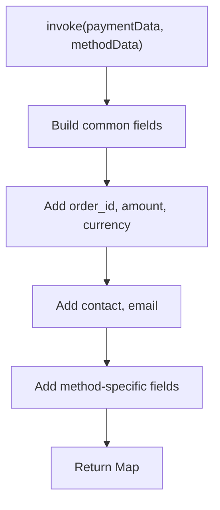

### Common Fields

| Field | Source | Description |
|-------|--------|-------------|
| **order_id** | Payment data | Razorpay order ID |
| **amount** | Payment data | Amount in paise |
| **currency** | Payment data | INR |
| **contact** | User profile | Phone number |
| **email** | User profile | Email address |
| **key** | Config | Razorpay API key |

### Method-Specific Fields

| Method | Additional Fields |
|--------|-------------------|
| **Card** | card[number], card[expiry_month], card[expiry_year], card[cvv], card[name] |
| **UPI** | vpa (for collect) or upi_app_package_name (for intent) |
| **NetBanking** | bank, method: "netbanking" |
| **Wallet** | wallet, method: "wallet" |

---

## Validate RazorPay Data Use Case

**Responsibility:** Validates payment fields before submission to Razorpay.

### Flow

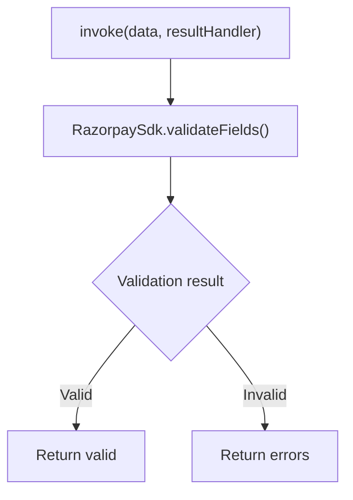

### Validation Result

| Field | Type | Description |
|-------|------|-------------|
| **isValid** | Boolean | Overall validity |
| **errors** | Map<String, String> | Field-specific errors |

---

## Validate VPA Use Case

**Responsibility:** Validates UPI VPA format and existence.

### Flow

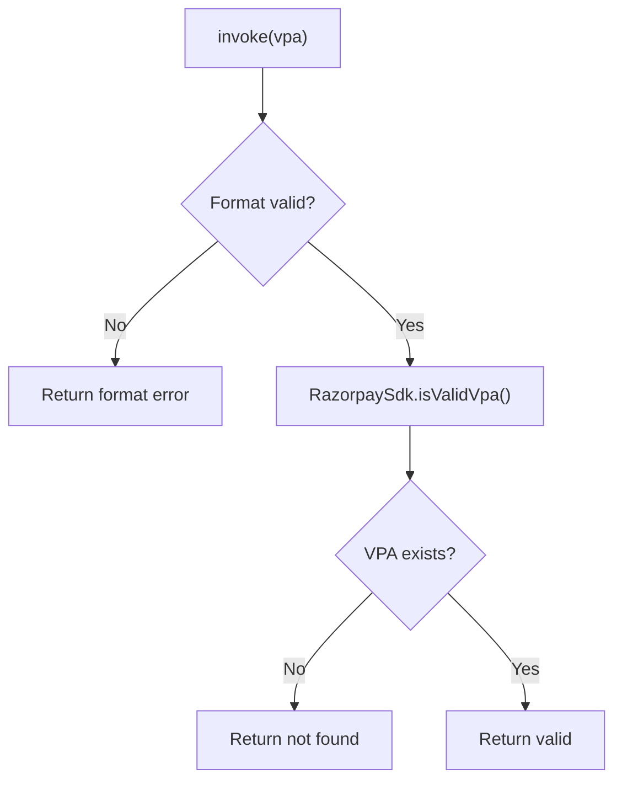

### VPA Validation

| Check | Rule | Error |
|-------|------|-------|
| **Format** | Contains @ | "Invalid format" |
| **Existence** | API lookup | "VPA not found" |

---

## Get RazorPay Supported UPI Apps Use Case

**Responsibility:** Retrieves list of UPI apps installed on the device.

### Flow

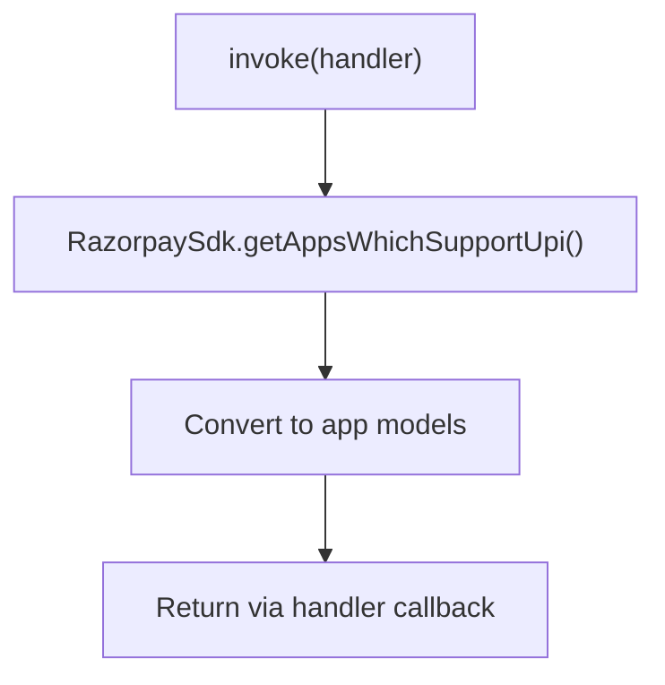

### Output: RazorpayUpiAppDetails

| Field | Type | Description |
|-------|------|-------------|
| **appName** | String | Display name |
| **iconBase64** | String | App icon encoded |
| **appIdentifier** | String | Package name |

---

## Create Inai Payment Data Use Case

**Responsibility:** Constructs payment details map for Inai SDK.

### Flow

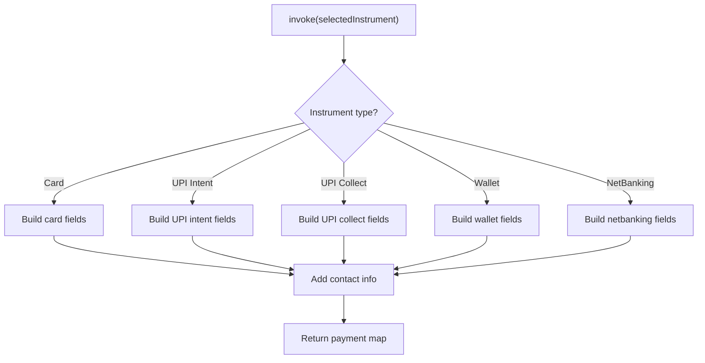

### Instrument-Specific Fields

| Instrument | Fields |
|------------|--------|
| **Card** | number, expiry_month, expiry_year, cvc, holder_name |
| **UPI Intent** | app (package name) |
| **UPI Collect** | vpa |
| **Wallet** | wallet (name) |
| **NetBanking** | bank_code |

### Contact Fields

| Field | Source |
|-------|--------|
| **first_name** | User profile |
| **last_name** | User profile |
| **email** | User profile |
| **phone_number** | User profile |

---

## Get Inai Checkout Use Case

**Responsibility:** Initializes and returns Inai SDK checkout instance.

### Flow

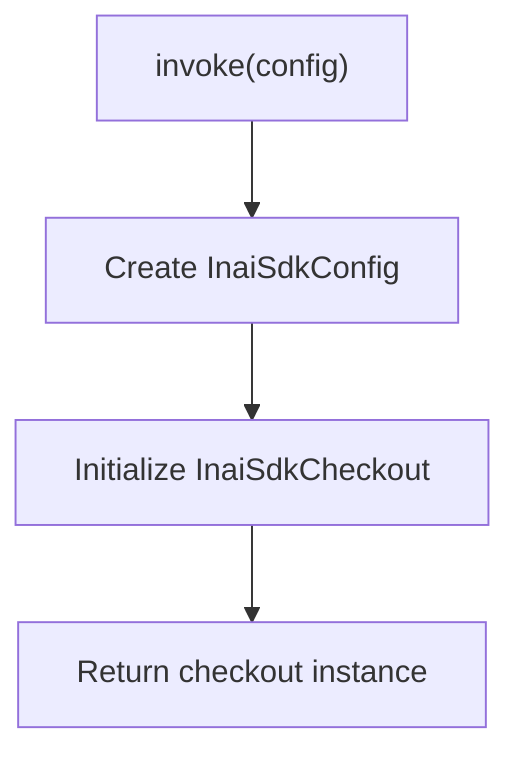

### Input: InaiSdkConfig

| Field | Type | Description |
|-------|------|-------------|
| **orderId** | String | Inai order ID |
| **token** | String | Auth token |
| **countryCode** | String? | Country for methods |

---

## Create JusPay SDK Request JSON Use Case

**Responsibility:** Generates JSON request for Juspay SDK operations.

### Flow

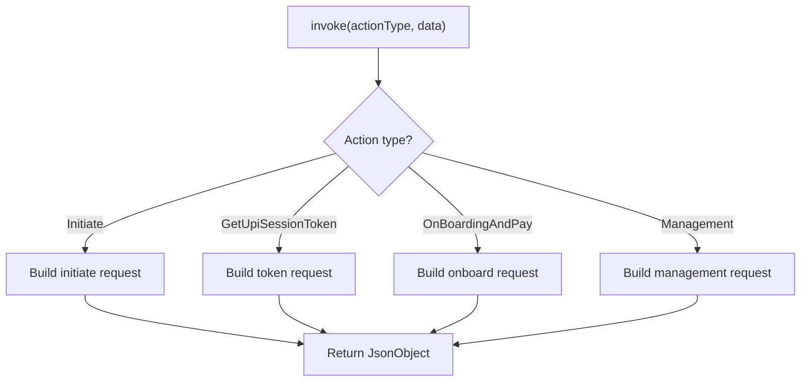

### Action Types

| Action | Purpose |
|--------|---------|
| **Initiate** | Initialize SDK session |
| **GetUpiSessionToken** | Get UPI session token |
| **OnBoardingAndPay** | Register + pay flow |
| **Management** | Manage saved methods |

---

## Process Juspay Result Object Use Case

**Responsibility:** Parses Juspay SDK callback result into structured app model.

### Flow

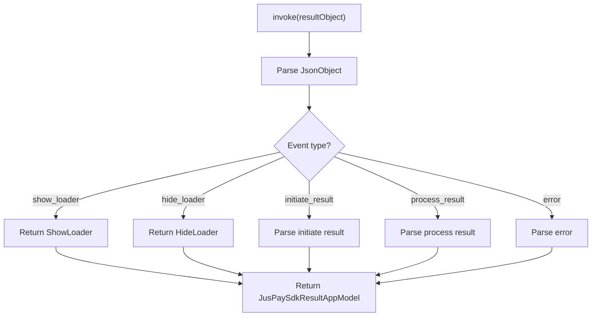

### Result Types

| Type | Content |
|------|---------|
| **ShowLoader** | Display loading |
| **HideLoader** | Hide loading |
| **InitiateResult** | SDK ready status |
| **ProcessResult** | Payment result |
| **Error** | Error details |

---

## Validate Checkout Card Data Use Case

**Responsibility:** Validates card input fields in real-time.

### Flow

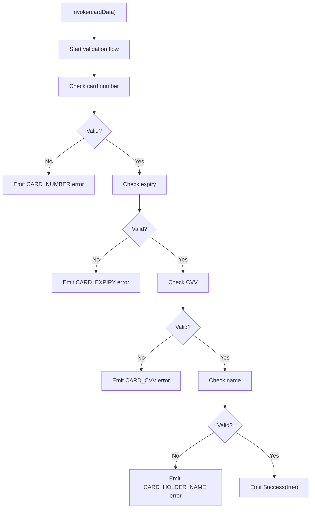

### Validation Rules

| Field | Rule | Example |
|-------|------|---------|
| **Card Number** | ≥13 digits | 4111111111111111 |
| **Expiry** | MM/YY, month 1-12, not past | 12/25 |
| **CVV** | ≥3 digits | 123 |
| **Name** | Non-empty string | John Doe |

### Field Types

| Type | Validation Error Message |
|------|--------------------------|
| **CARD_NUMBER** | "Invalid card number" |
| **CARD_EXPIRY** | "Invalid expiry date" |
| **CARD_CVV** | "Invalid CVV" |
| **CARD_HOLDER_NAME** | "Cardholder name required" |

---

## Filter Valid Payment Methods Use Case

**Responsibility:** Filters payment methods based on user eligibility and availability.

### Filter Criteria

| Criteria | Check |
|----------|-------|
| **User eligibility** | LazyPay eligibility status |
| **Method availability** | Gateway supports method |
| **Wallet balance** | ChaloPay balance check |
| **UPI availability** | At least one UPI app |

---

## Payment Methods Checkout Items Use Case

**Responsibility:** Converts payment methods to UI checkout items with proper grouping.

### Grouping Logic

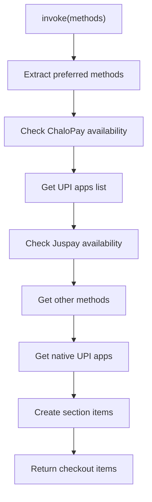

### Section Types

| Section | Priority | Items |
|---------|----------|-------|
| **PreferredModes** | 1 | User's recent methods |
| **ChaloPay** | 2 | Wallet with balance |
| **UPIApps** | 3 | Installed UPI apps |
| **OneClickUPI** | 4 | Saved Juspay accounts |
| **OtherPaymentModes** | 5 | Card, NetBanking, Wallet |
| **NativeUPIApps** | 6 | System UPI apps |

---

## Domain Models

### Payment Data

| Field | Type | Description |
|-------|------|-------------|
| **chaloOrderId** | String | Internal order reference |
| **gatewayOrderId** | String | Gateway order ID |
| **amount** | Double | Payment amount |
| **currency** | String | Currency code (INR) |
| **productType** | ProductType | Ticket, pass, etc. |

### Selected Payment Instrument Data

| Variant | Fields |
|---------|--------|
| **UpiData.IntentFlow** | packageName |
| **UpiData.CollectFlow** | vpa |
| **WalletData** | walletName |
| **NetBankingData** | bankCode |
| **CardData** | number, expiry, cvv, name |

### Checkout Payment Method

| Method | Code | Gateway |
|--------|------|---------|
| **ChaloPay** | "chalopay" | Internal |
| **JuspayTurboUpi** | "juspayTurboUpi" | Juspay |
| **Inai.Card** | "card" | Inai |
| **Inai.Upi** | "upi" | Inai |
| **RazorPay.Card** | "card" | Razorpay |
| **RazorPay.Upi** | "upi" | Razorpay |

---

## Business Rules

| Rule | Description | Enforced By |
|------|-------------|-------------|
| **Auth required** | User must be logged in for payment | CreateOrderForChaloPaymentUseCase |
| **Balance check** | Verify wallet balance before deduction | MakeChaloPaymentUseCase |
| **Order validity** | Check order not expired | GetOrderStatusUseCase |
| **Method filtering** | Hide ineligible methods | FilterValidPaymentMethodsUseCase |
| **Status polling** | Poll until terminal state | GetPaymentStatusUseCase |

---

## Sequence Diagrams

### ChaloWallet Payment Sequence

```mermaid
sequenceDiagram
    participant UI as PaymentMainComponent
    participant Create as CreateOrderForChaloPaymentUseCase
    participant Make as MakeChaloPaymentUseCase
    participant Repo as CheckoutRepository
    participant Wallet as WalletRepository
    participant API as Backend API

    UI->>Create: invoke(providerId, chaloOrderId)
    Create->>Wallet: getCachedWallet()
    Wallet-->>Create: WalletAppModel

    Create->>Create: Validate balance, status
    Create->>Repo: createChaloPayOrder()
    Repo->>API: POST /v1/checkout/chalopay/order
    API-->>Repo: ChaloPayOrderResponse
    Repo-->>Create: Order details
    Create-->>UI: Success(orderResponse)

    UI->>Make: invoke(ids, amount)
    Make->>Repo: makeChaloPayment()
    Repo->>API: POST /v1/checkout/chalopay/payment
    API-->>Repo: PaymentResponse
    Repo-->>Make: Payment result
    Make->>Wallet: syncTransactions()
    Make-->>UI: Success(paymentResponse)
```

### Razorpay Payment Sequence

```mermaid
sequenceDiagram
    participant UI as CheckoutViewModel
    participant Create as CreateRazorPayDataUseCase
    participant SDK as RazorpaySdk
    participant Status as GetPaymentStatusUseCase
    participant Repo as CheckoutRepository

    UI->>Create: invoke(paymentData, methodData)
    Create-->>UI: Map<String, Any>

    UI->>SDK: submit(data, listener)
    SDK-->>UI: Success/Failure callback

    UI->>Status: invoke(orderId, chaloOrderId, paymentId)
    Status->>Repo: getPaymentStatus()
    Repo-->>Status: PaymentStatus
    Status-->>UI: SUCCESS/PENDING/FAILED
```

---

## Error Handling

### Error Type Mapping

| Exception | Error Type | User Message |
|-----------|------------|--------------|
| **NetworkTimeout** | Unknown | "Connection timed out" |
| **ApiException** | API | Server message |
| **ParseException** | ResponseParsing | "Something went wrong" |
| **LocalException** | Local | "Something went wrong" |
| **ChaloPayPaymentFailed** | Mapped reason | Specific message |

### Recovery Strategies

| Error | Strategy |
|-------|----------|
| **INSUFFICIENT_BALANCE** | Show top-up option |
| **WALLET_BLOCKED** | Contact support |
| **ORDER_EXPIRED** | Return to product |
| **GATEWAY_ERROR** | Retry with same/different method |
| **NETWORK_ERROR** | Retry request |
