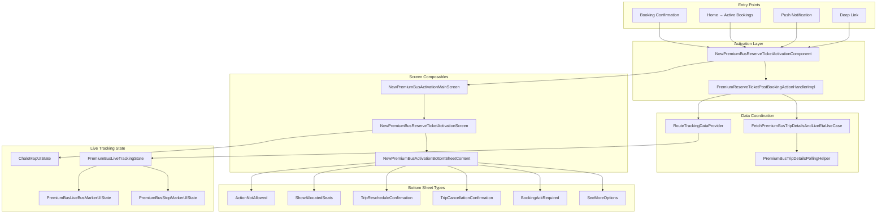
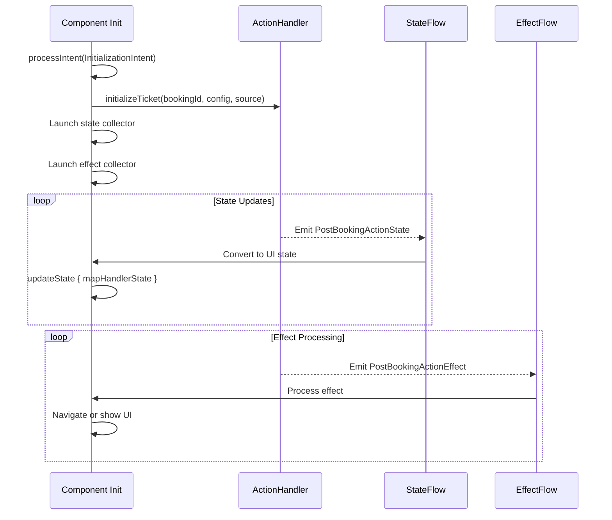
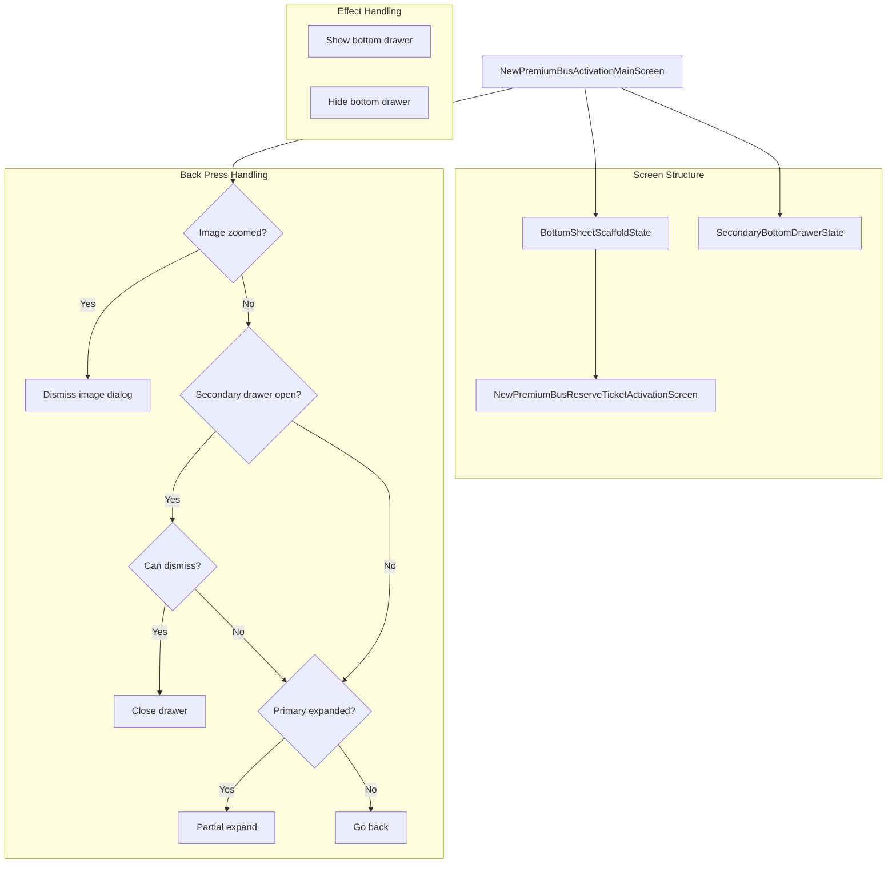
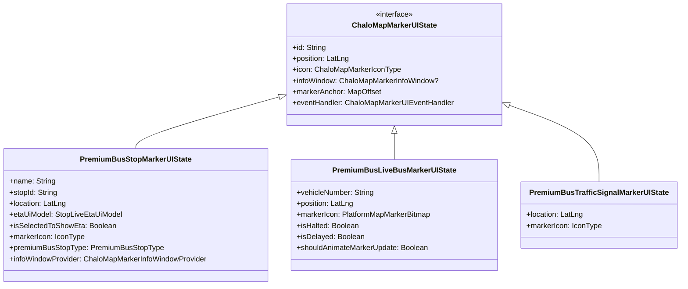
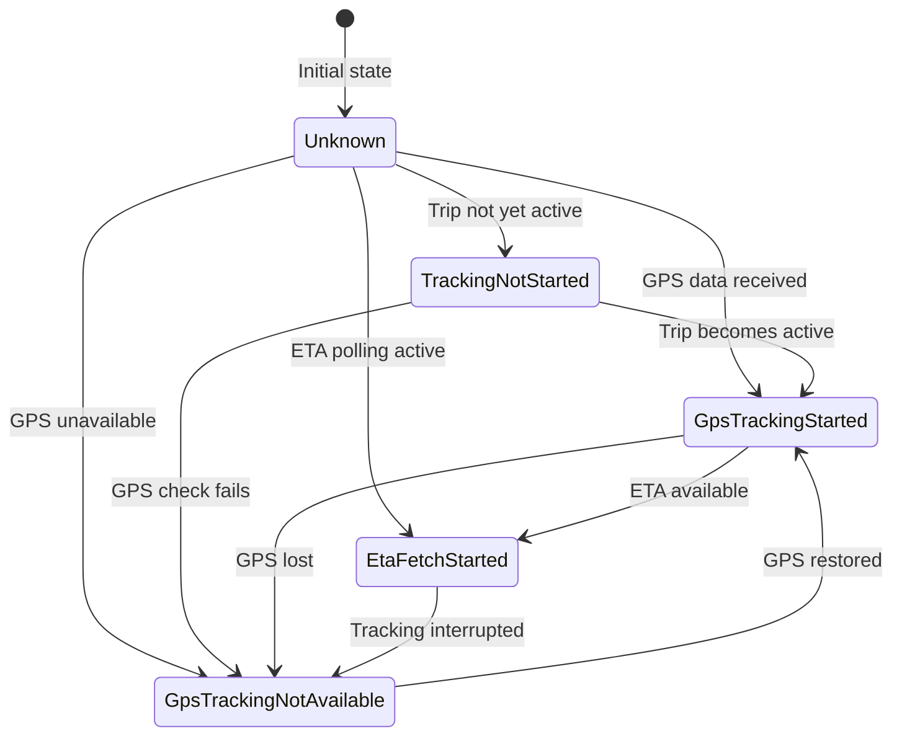
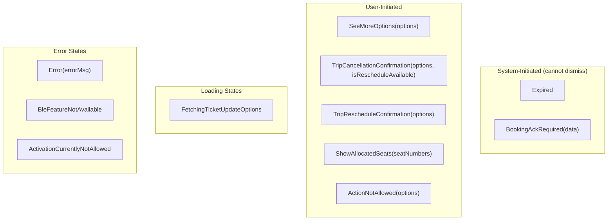
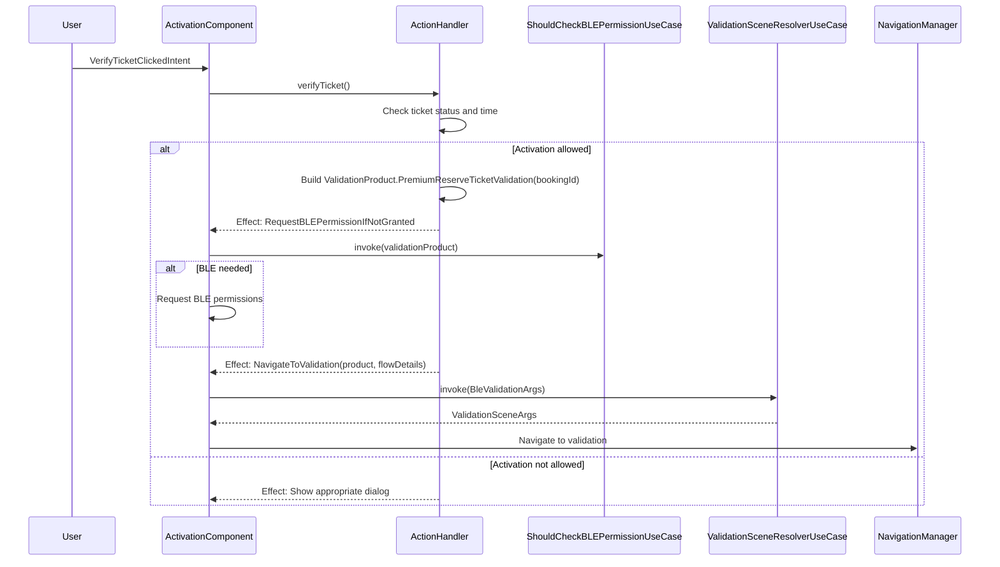
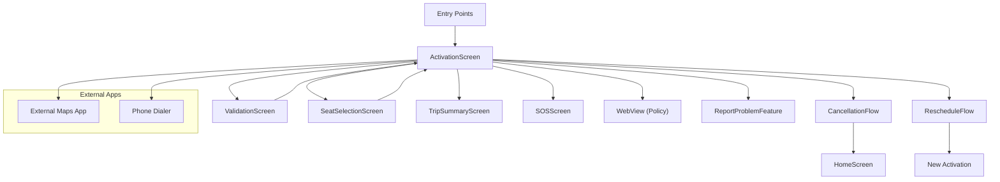

# Premium Bus Activation & Tracking — Component Documentation

## Architecture Overview

The Premium Bus Activation & Tracking presentation layer implements a Decompose-based MVI architecture for managing the post-booking experience. The core component, `NewPremiumBusReserveTicketActivationComponent`, orchestrates ticket display, live tracking, and user actions through a delegated handler pattern that separates complex business logic from UI state management. The handler, `PremiumReserveTicketPostBookingActionHandlerImpl`, coordinates with multiple data sources including trip polling, live tracking via `RouteTrackingDataProvider`, and the validation SDK.



---

## Component Inventory

| Component | File Path | Responsibility |
|-----------|-----------|----------------|
| **NewPremiumBusReserveTicketActivationComponent** | `shared/home/.../ui/newactivation/NewPremiumBusReserveTicketActivationComponent.kt` | MVI orchestration, state management, navigation |
| **PremiumReserveTicketPostBookingActionHandlerImpl** | `shared/home/.../ui/newactivation/ticketinfohandler/PremiumReserveTicketPostBookingActionHandlerImpl.kt` | Ticket operations, polling, live tracking coordination |
| **NewPremiumBusActivationMainScreen** | `shared/home/.../newactivation/NewPremiumBusActivationMainScreen.kt` | Main Composable entry point, bottom sheet management |
| **NewPremiumBusReserveTicketActivationScreen** | `shared/home/.../newactivation/NewPremiumBusReserveTicketActivationScreen.kt` | Ticket details UI, map integration |
| **PremiumBusTicketActivationMoreOptionsList** | `shared/home/.../newactivation/PremiumBusTicketActivationMoreOptionsList.kt` | More options bottom sheet content |
| **PremiumReserveTicketValidationModel** | `shared/home/.../validation/PremiumReserveTicketValidationModel.kt` | Validation data model for BLE/QR |

---

## NewPremiumBusReserveTicketActivationComponent

The primary Decompose component managing the entire activation screen lifecycle. It extends `ChaloBaseStateMviComponent` and delegates complex business operations to `PremiumReserveTicketPostBookingActionHandler`.

### Class Signature

```kotlin
class NewPremiumBusReserveTicketActivationComponent(
    private val args: PremiumBusActivationArgs,
    private val componentContext: ComponentContext,
    private val postBookingActionHandler: PremiumReserveTicketPostBookingActionHandler,
    private val cityProvider: CityProvider,
    private val userProfileDetailsProvider: UserProfileDetailsProvider,
    private val analyticsContract: AnalyticsContract,
    private val chaloNavigationManager: ChaloNavigationManager,
    private val userPreferencesDataStore: IUserPreferencesDataStore,
    private val stringProvider: StringProvider,
    private val validationSceneResolverUseCase: ValidationSceneResolverUseCase,
    private val toastManager: KotlinToastManager,
    private val systemHelper: SystemHelper,
    private val shouldCheckBLEPermissionForActivationUseCase: ShouldCheckBLEPermissionForActivationUseCase,
    private val checkBluetoothPermissionHelper: CheckBluetoothPermissionHelper,
    private val permissionHandlerProvider: PermissionHandlerProvider,
    private val adjustManager: AdjustManager,
    private val reportProblemFeature: IReportProblemFeature
) : ChaloBaseStateMviComponent<...>
```

### Initialization Flow

The component initializes by collecting state from the action handler and processing effects for navigation and UI updates.



### View State Structure

The `NewPremiumBusReserveTicketActivationState` data class encapsulates all UI-relevant state.

| Field | Type | Description |
|-------|------|-------------|
| **shouldSetupTicketDetailsSection** | Boolean | Controls main content visibility |
| **fromStopName** | String? | Pickup stop display name |
| **toStopName** | String? | Drop-off stop display name |
| **routeName** | String? | Route identifier/name |
| **originalSlotTime** | Long? | Original scheduled slot time |
| **tripTimeInfoState** | PremiumBusBookingTripTimeInfoState? | ETA or scheduled time display |
| **vehicleInfoState** | PremiumBusBookingVehicleInfoState? | Vehicle and driver details |
| **pickupStopScheduleTime** | PremiumBusPostBookingStopSchedule | Pickup timing info |
| **dropStopScheduleTime** | PremiumBusPostBookingStopSchedule | Drop timing info |
| **numberOfSeats** | String? | Passenger count string |
| **dialogType** | PremiumBusActivationScreenBottomSheetTypes? | Active bottom sheet |
| **ticketDetailsScreenType** | NewPremiumReserveTicketDetailsScreenType? | PRE_VALIDATION or POST_VALIDATION |
| **trackingState** | PremiumReserveTicketTrackingState | Tracking availability status |
| **liveTrackingState** | PremiumBusLiveTrackingState? | Map markers and polylines |
| **chaloMapUIState** | ChaloMapUIState | Complete map configuration |
| **noOfStopsBetweenPickUpAndDrop** | Int? | Intermediate stop count |
| **isLocationPermissionGranted** | Boolean | Location permission status |
| **pickUpStopImageDetails** | List<PBStopImagesDetails> | Pickup stop photos |
| **dropOffStopImageDetails** | List<PBStopImagesDetails> | Drop stop photos |
| **routeStopList** | List<PremiumBusPostActivationStopDetails> | All stops on route |
| **userCancellationAndReschedulePolicyWebUrl** | String? | Policy URL |
| **passedStopName** | String? | Last passed stop name |
| **isUserReadyToBoard** | Boolean | User near boarding stop |
| **distanceFromBoardingStop** | Int? | Distance in meters |
| **isBusTrackingDown** | Boolean | Tracking system health |
| **etaLastUpdateAtTimeString** | String? | Last ETA update timestamp |
| **tripCommunicationBanners** | List<TripCommunicationAppModel> | In-trip announcements |
| **zoomedImagesState** | PBStopDetailsZoomedImageState | Image zoom dialog state |
| **postValidationScreenSelectedTab** | PremiumBusPostBoardingDetailsTab | ROUTE or TRIP_DETAILS |
| **selectedSeats** | List<SeatInfoAppModel> | Passenger seat assignments |

### Intent Catalog

The component processes user intents through `processIntent()`, delegating most operations to the action handler.

| Intent | Trigger | Handler Delegation |
|--------|---------|-------------------|
| **InitializationIntent** | Component created | `postBookingActionHandler.initializeTicket()` |
| **FragmentStartIntent** | Screen visible | `postBookingActionHandler.startTripDetailsPolling()` |
| **FragmentStopIntent** | Screen hidden | `postBookingActionHandler.clearResources()` |
| **VerifyTicketClickedIntent** | Validate button | `postBookingActionHandler.verifyTicket()` |
| **MoreOptionsClickedIntent** | Options button | `postBookingActionHandler.showMoreOptionsAvailable()` |
| **MoreOptionsItemClickedIntent** | Option selected | `postBookingActionHandler.handleMoreOptionsItem()` |
| **BookingCancelledBottomSheetDismissIntent** | Ack sheet dismissed | `postBookingActionHandler.acknowledgeSystemCancellationReschedule()` |
| **TicketExpiredDialogDismissIntent** | Expired dialog dismissed | `postBookingActionHandler.acknowledgeTicketExpiry()` |
| **ShowOnMapsClickedIntent** | Directions button | Opens external maps via `systemHelper.openMaps()` |
| **ShowStopsBetweenPickUpAndDropIntent** | Show stops button | `postBookingActionHandler.showStopsBetweenPickUpAndDrop()` |
| **MapInteractionIntent.MapLoaded** | Map ready | `postBookingActionHandler.onPremiumBusLiveTrackingMapLoaded()` |
| **MapInteractionIntent.AlignMap** | My location button | `postBookingActionHandler.resetMapView()` |
| **MapInteractionIntent.MapCameraUpdateLoaded** | Camera moved | `postBookingActionHandler.saveMapCameraUpdate()` |
| **RouteStopListStopClickedIntent** | Stop selected | `postBookingActionHandler.startStopEtaFetchForLiveTracking()` |
| **TripCancellationConfirmationCancelRideCtaClickIntent** | Cancel confirmed | `postBookingActionHandler.openCancelRideFlow()` |
| **TripCancellationConfirmationRescheduleRideCtaClickIntent** | Reschedule confirmed | `postBookingActionHandler.navigateToRescheduleFlow()` |
| **OpenPassengerAllocatedSeatsDialog** | View seats | `postBookingActionHandler.showAllocatedSeats()` |
| **ToggleTrafficViewClicked** | Traffic toggle | Updates map traffic layer config |
| **SOSClickedIntent** | SOS button | `postBookingActionHandler.navigateToSOSScreen()` |

### Side Effects

Effects trigger UI actions that cannot be represented in state alone.

| Effect | Action |
|--------|--------|
| **ShowBottomSheet** | Expand secondary bottom drawer |
| **HideBottomSheet** | Collapse secondary bottom drawer |

---

## PremiumReserveTicketPostBookingActionHandler

The handler interface defines the contract for all post-booking operations. The implementation `PremiumReserveTicketPostBookingActionHandlerImpl` manages complex state coordination across ticket data, live tracking, map visualization, and user actions.

### Interface Contract

```kotlin
interface PremiumReserveTicketPostBookingActionHandler {
    val state: StateFlow<PremiumReserveTicketPostBookingActionState>
    val effect: Flow<PremiumReserveTicketPostBookingActionEffect>

    fun initializeTicket(bookingId: String, config: PostBookingHandlerConfig, source: Source)
    fun startTripDetailsPolling(source: Source)
    fun clearResources()
    suspend fun verifyTicket()
    fun showMoreOptionsAvailable()
    suspend fun handleMoreOptionsItem(item: PremiumBusProductOptionsAppModel, isRescheduleOptionAvailable: Boolean, selectedSeat: List<SeatInfoAppModel>)
    fun clearBottomSheetTypeState()
    fun acknowledgeTicketExpiry()
    fun acknowledgeSystemCancellationReschedule(shouldShowUpdatedDetails: Boolean)
    fun showStopsBetweenPickUpAndDrop()
    fun onHandlerReset()
    fun onClear()
    fun onPremiumBusLiveTrackingMapLoaded()
    fun stopEtaFetchForLiveTracking()
    fun startStopEtaFetchForLiveTracking(stopId: String, isForStopList: Boolean)
    fun fetchRouteDetails()
    fun saveMapCameraUpdate(newUpdate: MapCameraUpdate)
    suspend fun resetMapView()
    fun openCancelRideFlow(item: PremiumBusProductOptionsAppModel, isFromCancellationConfirmationBottomSheet: Boolean, noOfSeatCurrentlyBooked: Int)
    fun navigateToRescheduleFlow(item: PremiumBusProductOptionsAppModel, isFromCancellationConfirmationBottomSheet: Boolean, noOfSeatCurrentlyBooked: Int)
    fun showAllocatedSeats(allocatedSeats: List<SeatInfoAppModel>)
    fun dismissStopsBetweenPickUpAndDropDialog()
    fun navigateToSOSScreen()
}
```

### PostBookingHandlerConfig

Configuration options for the handler's behavior.

| Field | Type | Default | Purpose |
|-------|------|---------|---------|
| **shouldUpdateLocalRouteData** | Boolean | false | Update local route cache |
| **trackRoute** | Boolean | false | Enable live tracking |
| **fetchStopImages** | Boolean | false | Load stop photos |

### Handler State Structure

The `PremiumReserveTicketPostBookingActionState` contains the complete handler state.

| Field | Type | Purpose |
|-------|------|---------|
| **bookingId** | String? | Current booking identifier |
| **isTicketDetailsInitialized** | Boolean | Data load completion flag |
| **ticketStatus** | PremiumReserveTicketStatus? | Current ticket lifecycle status |
| **fromStopDetails** | PremiumStopDetailsAppModel? | Pickup stop full details |
| **toStopDetails** | PremiumStopDetailsAppModel? | Drop stop full details |
| **routeName** | String? | Route name |
| **routeId** | String? | Route identifier |
| **originalSlotTime** | Long? | Original scheduled time |
| **pickupStopScheduledTime** | PremiumBusPostBookingStopSchedule | Pickup timing |
| **dropStopScheduleTime** | PremiumBusPostBookingStopSchedule | Drop timing |
| **arrivalTimeInfo** | PremiumBusBookingTripTimeInfoState? | ETA or scheduled time |
| **vehicleInfoState** | PremiumBusBookingVehicleInfoState? | Assigned vehicle details |
| **dialogTypes** | PremiumBusPostBookingBottomSheetType? | Active dialog |
| **trackingState** | PremiumReserveTicketTrackingState | Tracking status |
| **liveTrackingState** | PremiumBusLiveTrackingState? | Map visualization state |
| **isLocationPermissionGranted** | Boolean | Location permission |
| **isBusTrackingDown** | Boolean | Tracking system health |
| **etaLastUpdateAtTimeString** | String? | Last ETA update |
| **tripCommunicationBanners** | List<TripCommunicationAppModel> | In-trip banners |
| **selectedSeats** | List<SeatInfoAppModel> | Seat assignments |

### Handler Effects

Navigation and action effects emitted by the handler.

| Effect | Purpose | Destination |
|--------|---------|-------------|
| **Exit** | Leave activation screen | Navigate to Home |
| **NavigateToValidation** | Start ticket validation | BLE/QR validation screen |
| **NavigateToCancellationFlow** | User wants to cancel | PremiumBusProductModificationArgs with CANCEL_RIDE |
| **NavigateToRescheduleFlow** | User wants to reschedule | PremiumBusProductModificationArgs with RESCHEDULE_RIDE |
| **NavigateToCallSupport** | Call support | System dialer |
| **NavigateToChatSupport** | Chat support | ReportProblemFeature |
| **NavigateToRepurchaseFlow** | Rebook with same route | Slot selection screen |
| **NavigateToPremiumActivationScreen** | Reload activation | Self-navigation with new booking |
| **NavigateToProductBookingSummary** | View receipt | TripSummaryArgs |
| **NavigateToSeatSelection** | Change seats | PremiumBusSeatSelectionArgs |
| **NavigateToSOSScreen** | Emergency | SosArgs |
| **RequestBLEPermissionIfNotGranted** | Need BLE permission | Permission dialog |
| **DialogTypeUpdated** | Bottom sheet changed | Emit ShowBottomSheet |
| **RouteDataFetchFailed** | Route fetch error | Show snackbar |
| **OpenTripCancellationConfirmationBottomSheet** | Show cancel confirm | ShowBottomSheet effect |
| **OpenTripRescheduleConfirmationBottomSheet** | Show reschedule confirm | ShowBottomSheet effect |
| **UnknownErrorToast** | Generic error | Toast message |

---

## Screen Composables

### NewPremiumBusActivationMainScreen

The entry Composable that sets up the scaffold structure and handles back navigation.



### Screen Type Resolution

The screen displays different UIs based on ticket validation status, determined by `NewPremiumReserveTicketDetailsScreenType.getScreenTypeFromTicketStatus()`.

| Ticket Status | Screen Type | UI Focus |
|---------------|-------------|----------|
| ACTIVE | PRE_VALIDATION | Validation button, tracking, cancel/reschedule |
| PAYMENT_PROCESSING | PRE_VALIDATION | Payment status, wait message |
| PAYMENT_FAILED | PRE_VALIDATION | Payment retry options |
| USER_CANCELLED | PRE_VALIDATION | Cancellation info, rebook option |
| SYSTEM_CANCELLED | PRE_VALIDATION | Acknowledgment required, refund info |
| USER_RESCHEDULED | PRE_VALIDATION | Old booking redirect |
| SYSTEM_RESCHEDULED | PRE_VALIDATION | New booking link |
| EXPIRED | PRE_VALIDATION | Expiry message, rebook option |
| BOOKING_UNDER_PROCESS | PRE_VALIDATION | Processing status |
| BOOKING_FAILED | PRE_VALIDATION | Error display, retry |
| FAILED | PRE_VALIDATION | General failure |
| PUNCHED | POST_VALIDATION | Drop ETA, trip progress, route tab |
| USED | POST_VALIDATION | Trip complete, receipt access |

---

## Live Tracking State

### PremiumBusLiveTrackingState

Contains all map visualization elements for the live tracking view.

| Field | Type | Description |
|-------|------|-------------|
| **routePolylinePoints** | List<PolylinePointUIState> | Route path coordinates |
| **stopMarkerList** | List<PremiumBusStopMarkerUIState> | All stop markers |
| **pickupStopMarker** | PremiumBusStopMarkerUIState? | Highlighted pickup |
| **dropStopMarker** | PremiumBusStopMarkerUIState? | Highlighted drop |
| **liveVehicleMarker** | List<PremiumBusLiveBusMarkerUIState> | Moving bus marker(s) |
| **trafficSignalMarkerList** | List<PremiumBusTrafficSignalMarkerUIState> | Traffic signals near bus |
| **mapCameraViewState** | MapCameraViewState | Camera position/bounds |

### Marker Class Hierarchy



### PremiumBusStopType Enum

| Value | Usage |
|-------|-------|
| **PICKUP** | User's boarding stop |
| **DROP** | User's alighting stop |
| **INTERMEDIATE** | Stops between pickup and drop |
| **NONE** | Default/unknown |

---

## Tracking State Machine

The `PremiumReserveTicketTrackingState` sealed class represents tracking availability.



| State | Fields | UI Display |
|-------|--------|------------|
| **TrackingNotStarted** | infoMsg: String | "Tracking starts at X" |
| **GpsTrackingStarted** | infoMsg: String | "Tracking live" |
| **EtaFetchStarted** | N/A | Show live ETA |
| **GpsTrackingNotAvailable** | infoMsg: String | "Tracking unavailable" |
| **Unknown** | N/A | Loading state |

---

## Trip Time Info States

The `PremiumBusBookingTripTimeInfoState` sealed class represents ETA display states.

| State | Fields | Display |
|-------|--------|---------|
| **LiveEta** | etaString, etaLastUpdatedAtStatus?, tripScheduleTag? | "Arriving in X mins" with tag |
| **ExpectedTime** | timeString, tripScheduleTag, updatedTripStartTime? | "Expected at HH:MM" |
| **BusPassedPickupStop** | N/A | "Bus has departed" |
| **LiveEtaNotAvailable** | N/A | "ETA unavailable" |
| **NotFetched** | N/A | Loading state |

### PremiumBusTripScheduleTag

| Tag | Condition | Color Indication |
|-----|-----------|------------------|
| **ARRIVING_EARLY** | ETA before scheduled - busArrivedEarlyThresholdInSec | Green |
| **ON_TIME** | Within onTimeBufferThresholdInSec | Green |
| **RUNNING_BEHIND** | Between on-time and runningLateStatusThresholdInSec | Yellow |
| **DELAYED** | Beyond runningLateStatusThresholdInSec | Red |

---

## Bottom Sheet Types

### PremiumBusPostBookingBottomSheetType

The sealed class hierarchy for bottom sheet content.



### Sheet Specifications

| Sheet Type | Content | Primary Actions | Secondary Actions |
|------------|---------|-----------------|-------------------|
| **Expired** | Ticket expiry notice | Dismiss | Book New |
| **BookingAckRequired** | System change details with PremiumBusInAppCommunicationBottomSheetData | View Details | Acknowledge |
| **SeeMoreOptions** | List of PremiumBusProductOptionsAppModel | Select action | View policy |
| **TripCancellationConfirmation** | Refund info, policy with cancellation option | Cancel Ride | Reschedule, Go Back |
| **TripRescheduleConfirmation** | New trip details | Confirm | Go Back |
| **ShowAllocatedSeats** | List of SeatInfoAppModel | Close | - |
| **ActionNotAllowed** | Blocked action reason from option | Dismiss | - |
| **FetchingTicketUpdateOptions** | Loading spinner | Wait | - |
| **Error** | Error message | Retry | Dismiss |
| **BleFeatureNotAvailable** | BLE not supported | Dismiss | - |

---

## Validation Flow Integration

### Validation Trigger Sequence



### PremiumReserveTicketValidationModel

The validation model passed to the SDK.

| Field | Source | Purpose |
|-------|--------|---------|
| **transactionId** | tripProperties.tripId | Transaction tracking |
| **paymentMode** | bookingProperties.paymentMode | Payment info |
| **qrCode** | validationProperties.qrCode | QR validation data |
| **soundStaticTone** | validationProperties.tone | Audio confirmation |
| **expiryTime** | validationProperties.expiryTime | Validity check |
| **amount** | fareAndPassengerProperties.amount | Display |
| **orderId** | bookingProperties.bookingId | Order identification |
| **productSubType** | bookingProperties.productSubType | Product type |
| **productType** | bookingProperties.productType | Product category |
| **scheduledAt** | tripProperties.tripStaticSlotTime | Trip timing |
| **city** | bookingProperties.city | City context |
| **startStopName** | tripProperties.fromStopDetails.stopName | Display |
| **endStopName** | tripProperties.toStopDetails.stopName | Display |
| **routeName** | tripProperties.routeName | Display |
| **userDetails** | PremiumReserveTicketValidationUserDetails | User info |
| **checkIsValid** | Lambda checking expiry and cancellation | Runtime validity |

---

## Analytics Events

Events raised by the activation component and handler.

| Event | Trigger | Key Properties |
|-------|---------|----------------|
| **PB_ACTIVATION_SCREEN_OPENED** | Screen displayed | bookingId |
| **PB_FIRST_TIME_ETA_RENDERED_ON_ACTIVATION_SCREEN** | First live ETA shown | ticketStatus, bookingId, delayInFetchingEta, timestamps |
| **PB_NAVIGATE_DIRECTIONS_CLICKED** | Directions button | bookingId |
| **PB_TRIP_CANCELLATION_GO_BACK_CTA_CLICKED** | Cancel flow abandoned | cancellationEligibilityCopy |
| **PB_ACTIVATION_SCREEN_TRAFFIC_VIEW_TOGGLED** | Traffic layer toggled | isChecked |
| **BLE_PERMISSION_DENIED** | BLE permission rejected | - |
| **PB_VALUE_PASS_BOOKING_CANCELLATION_UPGRADE_CTA_CLICKED** | Pass upgrade CTA | passId |
| **PB_TRIP_POLLING_RESPONSE_CHANGE** | Vehicle/route changed | lastVehicle, newVehicle, bookingId |

---

## Navigation Graph



### Navigation Args

| Destination | Args Type | Key Fields |
|-------------|-----------|------------|
| **Activation** | PremiumBusActivationArgs | bookingId, productType, productSubType, source |
| **Validation** | BleValidationArgs | validationProduct, validationProcessFlowDetails, source |
| **Cancellation** | PremiumBusProductModificationArgs | bookingId, reason=CANCEL_RIDE, noOfSeatSelectedInCurrentBooking |
| **Reschedule** | PremiumBusProductModificationArgs | bookingId, reason=RESCHEDULE_RIDE, noOfSeatSelectedInCurrentBooking |
| **TripSummary** | TripSummaryArgs.TicketSummaryScreen | bookingsRequestType=PremiumBusTicketType(bookingId), source |
| **SeatSelection** | PremiumBusSeatSelectionArgs | flowType (JSON), source |
| **SOS** | SosArgs | sosRequestParams (Map) |
| **WebView** | WebViewArgs | url, title, imageMode, hideActionBar |
| **Home** | HomeArgs | - (with ClearAll PopUpToConfig) |

---

## Error Handling

| Error Scenario | Handler Action | UI Response |
|----------------|----------------|-------------|
| **Ticket not found in DB** | Check for rescheduled booking, then emit Exit | Navigate away or show new booking |
| **Route details fetch failed** | Emit RouteDataFetchFailed effect | Show retry snackbar |
| **Live tracking unavailable** | Fall back to polling-based ETA | Show scheduled/expected time |
| **Cancellation API failed** | Emit UnknownErrorToast | Toast message |
| **BLE not available** | Show BleFeatureNotAvailable dialog | Bottom sheet with info |
| **ETA not received for threshold** | Mark trip ended for user | Update UI to completed |
| **GPS unavailable for threshold** | Set isBusTrackingDown | Show tracking down indicator |
| **Network offline** | Use cached ticket data | Stale indicator |
