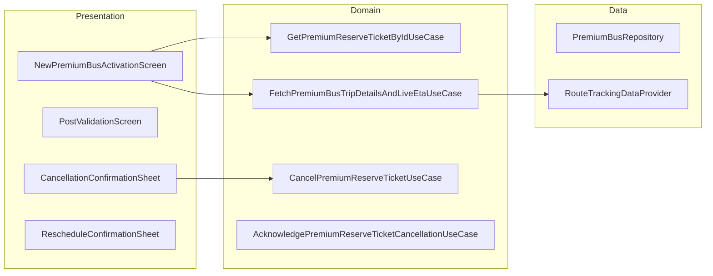

# Premium Bus — Activation & Tracking — High-Level Design

## Overview

The Premium Bus Activation & Tracking feature handles post-booking operations for premium bus tickets. It includes ticket activation, real-time bus tracking with ETA, ticket validation, cancellation/reschedule workflows, and acknowledgment cards for system-initiated changes. The feature provides a comprehensive view of the user's booked journey.

## User Journey

1. **Entry Points**:
   - Booking confirmation → Activation screen
   - Home → Active bookings
   - Notifications → Booking updates

2. **Core Flow**:
   - View booking details and trip info
   - Track live bus position and ETA
   - Validate ticket at boarding
   - Handle cancellation/reschedule
   - View post-trip receipts

3. **Exit Points**:
   - Trip completed → History
   - Ticket cancelled → Refund info
   - Ticket rescheduled → New booking

## Architecture Diagram



## Key Components

| Component | Platform | File Path | Responsibility |
|-----------|----------|-----------|----------------|
| `NewPremiumBusReserveTicketActivationComponent` | Shared | `shared/home/.../premiumbus/prebookedtickets/ui/newactivation/NewPremiumBusReserveTicketActivationComponent.kt` | Activation orchestration |
| `PremiumReserveTicketPostBookingActionHandler` | Shared | `shared/home/.../premiumbus/prebookedtickets/ui/newactivation/ticketinfohandler/PremiumReserveTicketPostBookingActionHandlerImpl.kt` | Post-booking operations |
| `PremiumBusTripDetailsPollingHelper` | Shared | `shared/home/.../premiumbus/PremiumBusTripDetailsPollingHelper.kt` | Trip details polling |
| `PremiumReserveTicketValidationModel` | Shared | `shared/home/.../premiumbus/prebookedtickets/validation/PremiumReserveTicketValidationModel.kt` | Ticket validation |
| `CancelPremiumReserveTicketUseCase` | Shared | `shared/home/.../premiumbus/prebookedtickets/domain/CancelPremiumReserveTicketUseCase.kt` | Cancellation handling |

## Data Flow

### Activation Display
1. `NewPremiumBusReserveTicketActivationComponent` initializes with booking ID
2. `GetPremiumReserveTicketByIdUseCase` fetches ticket details
3. `FetchPremiumBusTripDetailsAndLiveEtaUseCase` fetches trip info
4. Display booking details, stop info, and vehicle info
5. Start live tracking if trip is active

### Live Tracking
1. `RouteTrackingDataProvider` provides live vehicle data
2. Updates flow: GPS position, ETA, stop information
3. Map displays polyline and vehicle marker
4. Bottom sheet shows ETA and stop details
5. Polling continues until trip ends

### Cancellation Flow
1. User selects "Cancel" from more options
2. `FetchPremiumBusTicketsUpdateOptionsUseCase` gets cancellation options
3. User selects cancellation reason
4. `CancelPremiumReserveTicketUseCase` processes cancellation
5. Navigate to summary or show refund info

## Platform Differences

### Android-Specific
- `PremiumBusStopInfoWindow.kt` for Google Maps info windows
- Native map integration for live tracking
- Platform-specific ETA formatting

### iOS-Specific
- Compose Multiplatform UI
- iOS map integration
- Platform-specific navigation

## Integration Points

### Analytics Events
- See [Analytics: premium-bus-activation-tracking](/analytics/flows/premium-bus-activation-tracking) for event documentation
- Key events:
  - `pb_activation_screen_opened`
  - `pb_live_tracking_started`
  - `pb_ticket_validated`
  - `pb_cancellation_initiated`
  - `pb_reschedule_initiated`
  - `pb_acknowledgment_shown`

### Shared Services
- **Live Tracking**: `RouteTrackingDataProvider` for vehicle positions
- **Validation**: BLE/QR validation SDK
- **Support**: Report problem integration

### Navigation
- **Navigates to**: Validation, Reschedule flow, Receipt, Support
- **Navigated from**: Booking confirmation, Home, Notifications

## Ticket Status States

### PremiumReserveTicketStatus
```kotlin
enum class PremiumReserveTicketStatus {
    ACTIVE,               // Ready to use
    PAYMENT_PROCESSING,   // Payment in progress
    PAYMENT_FAILED,       // Payment failed
    PUNCHED,              // Validated on bus
    USED,                 // Trip completed
    USER_CANCELLED,       // Cancelled by user
    SYSTEM_CANCELLED,     // Cancelled by system
    USER_RESCHEDULED,     // Rescheduled by user
    SYSTEM_RESCHEDULED,   // Rescheduled by system
    EXPIRED,              // Validity expired
    BOOKING_UNDER_PROCESS,// Being processed
    BOOKING_FAILED,       // Creation failed
    FAILED                // General failure
}
```

## Live Tracking State

### PremiumBusLiveTrackingState
```kotlin
data class PremiumBusLiveTrackingState(
    val polylinePoints: List<LatLng>,
    val stopMarkers: List<PremiumBusStopMarkerUIState>,
    val liveVehicleMarker: PremiumBusLiveBusMarkerUIState?,
    val trafficSignalMarkers: List<TrafficSignalMarkerUIState>,
    val mapCameraViewState: MapCameraViewState
)
```

### Trip Time Info States
```kotlin
sealed class PremiumBusBookingTripTimeInfoState {
    data class LiveEta(val etaMinutes: Int)
    data class ExpectedTime(val time: String)
    object BusPassedPickupStop
    object LiveEtaNotAvailable
}
```

## Acknowledgment System

### PremiumReserveTicketAckType
```kotlin
enum class PremiumReserveTicketAckType {
    SYSTEM_CANCELLED,    // System cancelled the booking
    SYSTEM_RESCHEDULED   // System rescheduled the booking
}
```

### Acknowledgment Flow
1. System changes booking status
2. `GetPremiumReserveTicketsWithPendingAckUseCase` detects change
3. Show acknowledgment bottom sheet
4. User acknowledges change
5. `AcknowledgePremiumReserveTicketCancellationUseCase` confirms

## Bottom Sheet Types

### PremiumBusPostBookingBottomSheetType
```kotlin
sealed class PremiumBusPostBookingBottomSheetType {
    object Expired
    object BookingAckRequired
    object SeeMoreOptions
    object TripCancellationConfirmation
    object TripRescheduleConfirmation
    object ShowAllocatedSeats
    object ActionNotAllowed
}
```

## Edge Cases & Error Handling

| Scenario | Handling |
|----------|----------|
| Live tracking unavailable | Shows scheduled time |
| Cancellation window closed | Shows action not allowed |
| System cancelled | Shows acknowledgment card |
| Network offline | Shows cached ticket data |
| Validation failed | Shows manual validation option |
| Bus passed stop | Shows "Bus has departed" |

## Data Models

### Booking Vehicle Info
```kotlin
data class PremiumBusBookingVehicleInfoState(
    val vehicleNumber: String?,
    val routeName: String?,
    val driverDetails: DriverDetails?,
    val vehicleCapacity: Int?
)
```

### Stop Schedule Info
```kotlin
data class PremiumBusPostBookingStopSchedule(
    val stopName: String,
    val scheduledTime: Long,
    val actualTime: Long?,
    val stopLocation: LatLng
)
```

## Dependencies

### Internal
- `shared:home` — Activation and tracking module
- `shared:livetracking` — Live vehicle tracking
- `shared:validationsdk` — Ticket validation
- `shared:productbooking` — Booking repository

### External
- Maps SDK — Route and vehicle visualization
- SQLDelight — Local ticket storage
- CRTS — Real-time tracking system
