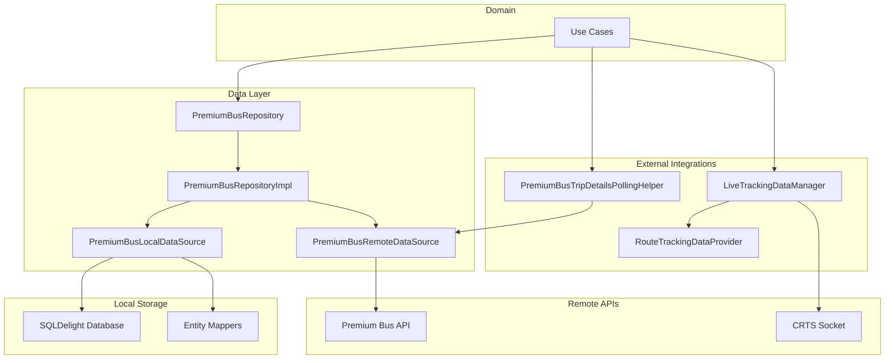
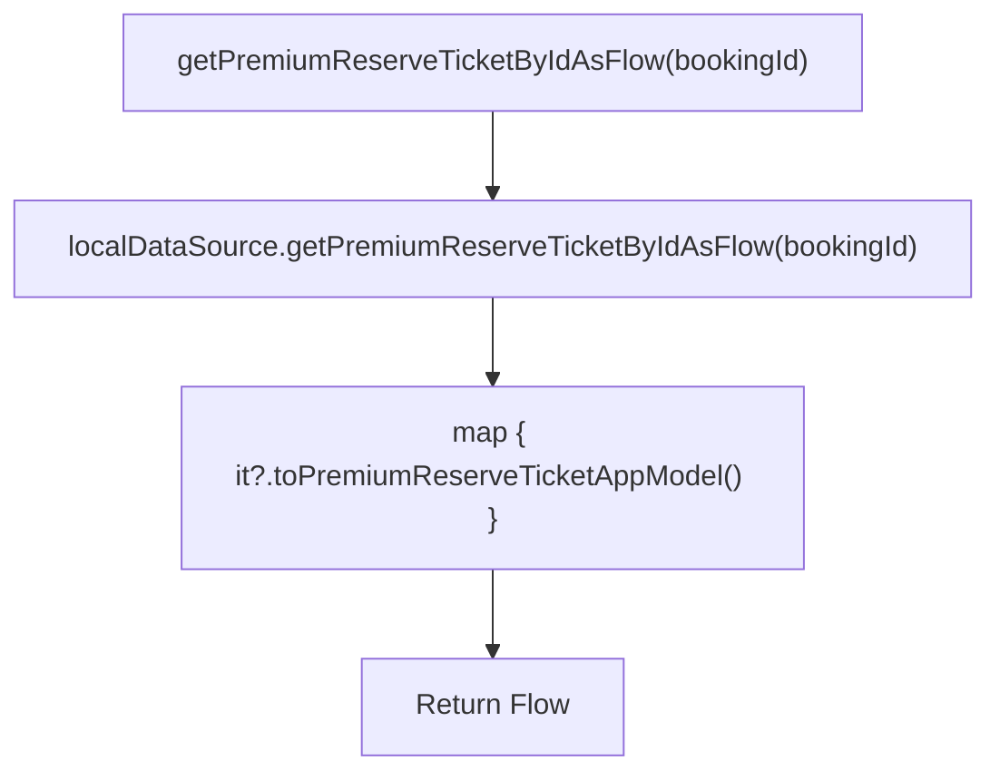
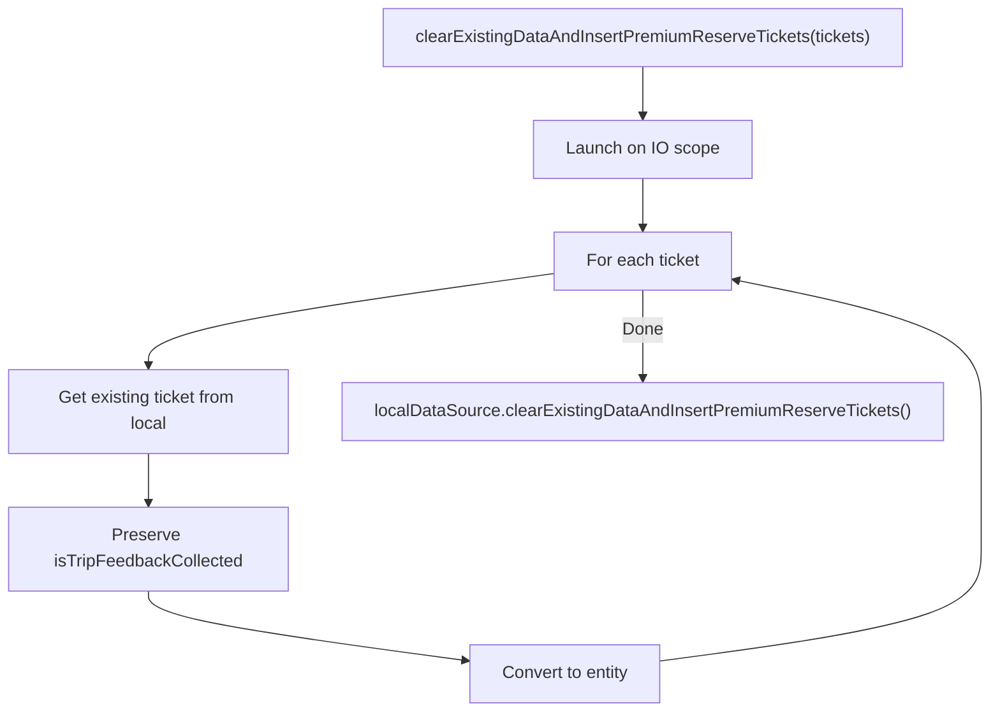
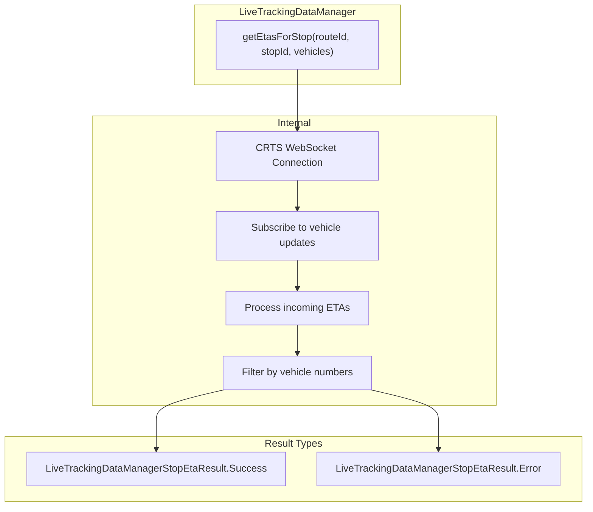
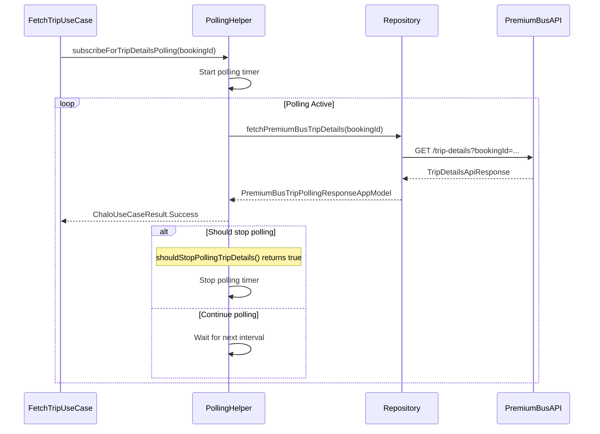
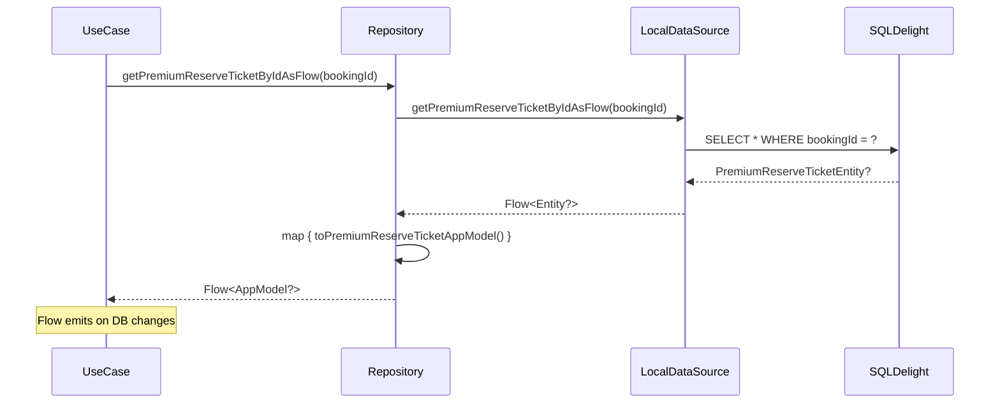
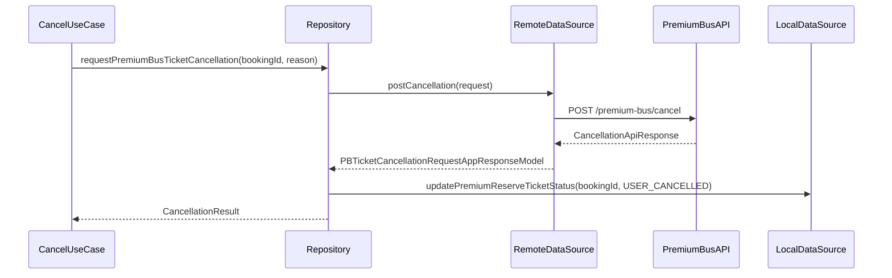
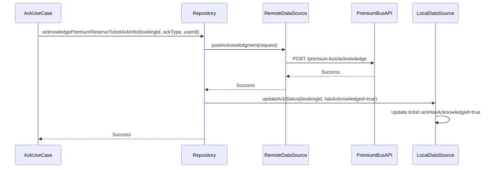
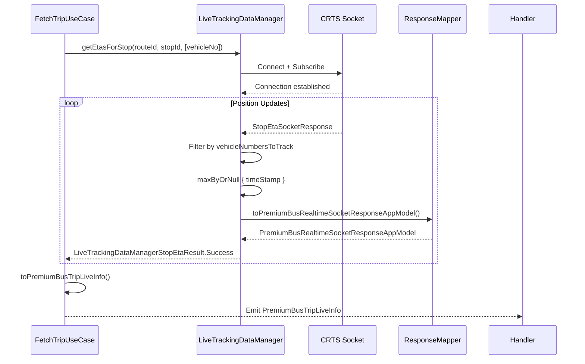
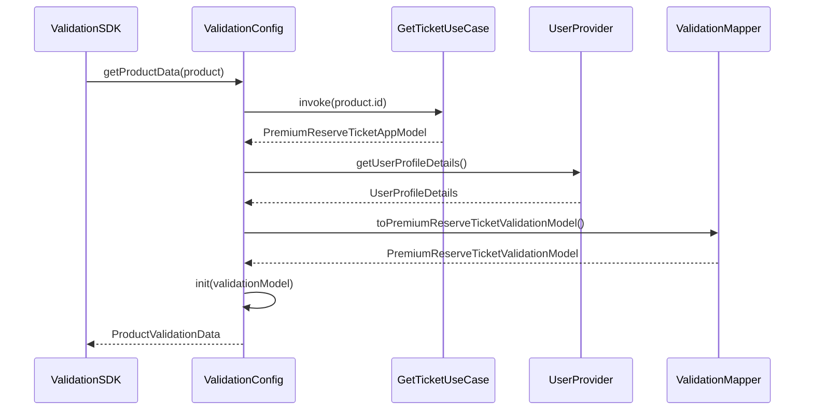

# Premium Bus Activation & Tracking — Repository Documentation

## Data Layer Overview

The Premium Bus Activation & Tracking data layer manages ticket persistence, remote API communication, live tracking data coordination, and trip details polling. The architecture follows a repository pattern with dedicated local and remote data sources. The `PremiumBusRepository` serves as the central abstraction, coordinating between SQLDelight-backed local storage and REST API endpoints. Live tracking integrates with the `LiveTrackingDataManager` for real-time vehicle position updates, while `PremiumBusTripDetailsPollingHelper` manages periodic trip status polling.



---

## Repository Interface

### PremiumBusRepository

The central repository interface for premium bus ticket operations. Located in `shared/productbooking/src/commonMain/kotlin/app/chalo/premiumbus/data/repository/PremiumBusRepository.kt`.

| Method | Purpose | Returns |
|--------|---------|---------|
| **getPremiumReserveTicketByIdAsFlow** | Observe ticket by ID | Flow<PremiumReserveTicketAppModel?> |
| **getAllPremiumReserveTicketsForCityAsFlow** | Observe all tickets for city | Flow<List<PremiumReserveTicketAppModel>> |
| **getAllPremiumReserveTicketForCityBetweenGivenTime** | Filter tickets by time range | Flow<List<PremiumReserveTicketAppModel>> |
| **updatePremiumReserveTicketStatus** | Update local ticket status | Unit |
| **clearExistingDataAndInsertPremiumReserveTickets** | Bulk insert from sync | Unit |
| **insertPremiumReserveTicket** | Insert single ticket | Unit |
| **fetchPremiumReserveTicketReceipt** | Fetch receipt from API | List<PremiumReserveTicketReceiptAppModel> |
| **getPremiumReserveTicketReceiptByIdAsFlow** | Observe receipt locally | Flow<PremiumReserveTicketReceiptAppModel?> |
| **getAllPremiumReserveTicketsFromStartTimeOnwardsThatRequireAcknowledgement** | Find pending acks | Flow<List<PremiumReserveTicketAppModel>> |
| **getAllAckInfoForGivenAckStatus** | Query ack info | Flow<List<PremiumReserveTicketAckAppModel>> |
| **getAckInfoForGivenBooking** | Get specific ack info | Flow<PremiumReserveTicketAckAppModel?> |
| **acknowledgePremiumReserveTicketAckInfo** | Post ack to server | Unit |
| **fetchPremiumBusTicketUpdateOptions** | Get cancel/reschedule options | PremiumBusBookingAvailableOptionsAppModel |
| **requestPremiumBusTicketCancellation** | Cancel ticket | PBTicketCancellationRequestAppResponseModel |
| **reschedulePremiumReserveTicket** | Reschedule ticket | PBRescheduleResponseAppModel |
| **fetchPremiumBusTripDetails** | Get trip polling details | PremiumBusTripPollingResponseAppModel |
| **changeSeatsForPremiumReserveTicket** | Change seat assignment | PremiumBusChangeSeatsAppResponseModel |

---

## Repository Implementation

### PremiumBusRepositoryImpl

The concrete implementation coordinating local and remote data sources. Located in `shared/productbooking/src/commonMain/kotlin/app/chalo/premiumbus/data/repository/PremiumBusRepositoryImpl.kt`.

```kotlin
class PremiumBusRepositoryImpl(
    private val localDataSource: PremiumBusLocalDataSource,
    private val remoteDataSource: PremiumBusRemoteDataSource,
    private val coroutineContextProvider: CoroutineContextProvider,
    private val basicInfoContract: BasicInfoContract
) : PremiumBusRepository
```

### Implementation Patterns

#### Reactive Local Queries

Local queries return Flow for reactive UI updates. The repository maps database entities to app models.



#### Sync with History Preservation

Bulk insertion preserves certain local-only fields like `isTripFeedbackCollected` that should not be overwritten during sync.



#### Active Ticket Filtering

When fetching all tickets, the repository filters by status and expiry time.

| Status Type | Filter Logic |
|-------------|--------------|
| **ALL** | Return all tickets |
| **ACTIVE** | isActiveAndWithinExpiryTime(chaloTime) == true |
| **EXPIRED** | isActiveAndWithinExpiryTime(chaloTime) == false |

---

## Live Tracking Integration

### LiveTrackingDataManager

Manages real-time vehicle tracking via CRTS socket connections. The FetchPremiumBusTripDetailsAndLiveEtaUseCase uses this manager to get live ETAs once trip becomes active.



### getEtasForStop Method

Returns a Flow of ETA updates for specified vehicles at a stop.

```kotlin
fun getEtasForStop(
    routeId: String,
    stopId: String,
    vehicleNumbersToTrack: List<String>
): Flow<LiveTrackingDataManagerStopEtaResult>
```

### LiveTrackingDataManagerStopEtaResult

| Variant | Fields | Description |
|---------|--------|-------------|
| **Success** | etaList: List<StopVehicleEta> | Valid ETA updates with timestamps |
| **Error** | error: Throwable | Socket or processing error |

### StopVehicleEta Structure

| Field | Type | Description |
|-------|------|-------------|
| **vehicleNumber** | String | Vehicle identifier |
| **eta** | Long | ETA in seconds (-1 if passed) |
| **distanceToReach** | Double | Distance in meters |
| **timeStamp** | Long | Update timestamp |

---

## RouteTrackingDataProvider

A comprehensive interface for all tracking-related data needs. Used by the activation screen for map visualization.

### Interface

```kotlin
interface RouteTrackingDataProvider {
    val staticDataState: StateFlow<TrackingDataState>

    fun init(routeId: String): RouteTrackingManagerInitState
    fun fetchRouteDetails(shouldUpdateRouteCache: Boolean)
    fun startFetchingLiveVehicleDetails(
        filterVehicleNumber: List<String> = emptyList(),
        handleBusCrossedStopDetails: Boolean,
        shouldFetchBusGpsIfLiveVehicleDataNotAvailable: Boolean
    ): Flow<LiveVehicleDetailsResult>
    fun startFetchingStopETAs(
        stopId: String,
        filterVehicleNumber: List<String> = emptyList(),
        startSeatAvailabilityFetchForLiveVehicles: Boolean
    ): Flow<LiveStopEtaResult>
    fun startFetchingBusGpsLocation(
        number: String,
        pollingFrequencyInMillis: Long = VEHICLE_GPS_FETCH_INTERVAL_IN_MILLIS
    ): Flow<VehicleGpsDataResult>
    fun clearResources()
    fun reset()
}
```

### Result Types

| Result Type | Variants | Description |
|-------------|----------|-------------|
| **LiveVehicleDetailsResult** | VehicleGPSData, LiveData, Error | Vehicle position and live data |
| **LiveStopEtaResult** | Success, Error | Stop-specific ETA data |
| **VehicleGpsDataResult** | Success, Error | GPS position polling result |
| **RouteDetailsResult** | FetchInProgress, Success, Error | Route data fetch status |

---

## Trip Details Polling

### PremiumBusTripDetailsPollingHelper

Manages periodic polling for trip status and details. The polling continues until conditions are met to switch to socket-based tracking.

```kotlin
class PremiumBusTripDetailsPollingHelper(
    private val premiumBusRepository: PremiumBusRepository,
    private val pollingConfig: PollingConfig
) {
    fun subscribeForTripDetailsPolling(
        bookingId: String
    ): Flow<ChaloUseCaseResult<PremiumBusTripPollingResponseAppModel>>
}
```

### Polling Flow



### Polling Response Model

The `PremiumBusTripPollingResponseAppModel` contains all trip status information.

| Field | Type | Description |
|-------|------|-------------|
| **tripStatus** | PremiumBusTripStatus | NOT_STARTED, ACTIVE, COMPLETED, CANCELLED |
| **bookingStatus** | PremiumReserveTicketStatus | Current ticket status |
| **vehicleNo** | String? | Assigned vehicle number |
| **routeId** | String | Route identifier |
| **stopId** | String | Pickup stop ID |
| **estimatedStopTime** | Long? | Estimated arrival time (millis) |
| **scheduledStopTime** | Long? | Scheduled arrival time (millis) |
| **updatedTripStartTimeInMillisFromPolling** | Long? | Updated trip start time |
| **assignedSeats** | List<Int> | Seat numbers |
| **seats** | List<SeatInfoAppModel> | Detailed seat info |
| **tripCommunicationBanners** | List<TripCommunicationAppModel> | In-trip banners |

### Stop Polling Conditions

```kotlin
fun PremiumBusTripPollingResponseAppModel.shouldStopPollingTripDetails(): Boolean
```

Returns `true` when:
- Trip status is ACTIVE and vehicle is assigned
- Booking status is terminal (CANCELLED, USED, etc.)

### Can Connect for Live ETA

```kotlin
fun PremiumBusTripPollingResponseAppModel.canConnectForLiveETA(): Boolean
```

Returns `true` when:
- Trip status is ACTIVE
- Vehicle number is non-null
- Route and stop IDs are available

---

## App Models

### PremiumReserveTicketAppModel

Domain representation of a premium bus ticket. Located in `shared/productbooking/src/commonMain/kotlin/app/chalo/premiumbus/data/models/app/PremiumReserveTicketAppModel.kt`.

| Property | Type | Description |
|----------|------|-------------|
| **bookingProperties** | PremiumBusBookingProperties | Core booking data |
| **tripProperties** | PremiumBusTripProperties | Trip and route info |
| **validationProperties** | PremiumBusValidationProperties | Validation data |
| **fareAndPassengerProperties** | PremiumBusFareAndPassengerProperties | Pricing and passenger info |
| **cancellationProperties** | PremiumBusCancellationProperties? | Cancellation details |

### PremiumBusBookingProperties

| Field | Type | Description |
|-------|------|-------------|
| **bookingId** | String | Unique booking identifier |
| **status** | PremiumReserveTicketStatus | Current status |
| **city** | String | City code |
| **productType** | ProductType | Premium bus type |
| **productSubType** | ProductSubType | Specific product variant |
| **createdAt** | Long | Booking timestamp |
| **paymentMode** | String? | Payment method |

### PremiumBusTripProperties

| Field | Type | Description |
|-------|------|-------------|
| **tripId** | String | Trip identifier |
| **routeId** | String | Route identifier |
| **routeName** | String | Route display name |
| **fromStopDetails** | PremiumStopDetailsAppModel | Pickup stop info |
| **toStopDetails** | PremiumStopDetailsAppModel | Drop stop info |
| **tripStaticSlotTime** | Long | Scheduled trip start |
| **tripValidityTime** | Long | Ticket expiry time |

### PremiumBusValidationProperties

| Field | Type | Description |
|-------|------|-------------|
| **qrCode** | String? | Validation QR code |
| **tone** | String? | Validation sound |
| **expiryTime** | Long? | QR expiry time |
| **ackType** | PremiumReserveTicketAckType? | Pending ack type |
| **ackHasAcknowledged** | Boolean? | Ack completion flag |

### Helper Methods on App Model

| Method | Purpose |
|--------|---------|
| **isActiveAndWithinExpiryTime(chaloTime)** | Check if ticket is usable |
| **toPremiumReserveTicketEntity()** | Convert to DB entity |
| **toPremiumReserveTicketValidationModel(...)** | Convert for validation SDK |
| **getAnalyticsProperties()** | Extract analytics properties |

---

## Data Flow Diagrams

### Ticket Fetch Flow



### Cancellation Flow



### Acknowledgment Flow



### Live Tracking Data Flow



---

## Status Enums

### PremiumReserveTicketStatus

```kotlin
enum class PremiumReserveTicketStatus(val value: String) {
    ACTIVE("ACTIVE"),
    PAYMENT_PROCESSING("PAYMENT_PROCESSING"),
    PAYMENT_FAILED("PAYMENT_FAILED"),
    PUNCHED("PUNCHED"),
    USED("USED"),
    USER_CANCELLED("USER_CANCELLED"),
    SYSTEM_CANCELLED("SYSTEM_CANCELLED"),
    USER_RESCHEDULED("USER_RESCHEDULED"),
    SYSTEM_RESCHEDULED("SYSTEM_RESCHEDULED"),
    EXPIRED("EXPIRED"),
    BOOKING_UNDER_PROCESS("BOOKING_UNDER_PROCESS"),
    BOOKING_FAILED("BOOKING_FAILED"),
    FAILED("FAILED")
}
```

### PremiumReserveTicketAckType

```kotlin
enum class PremiumReserveTicketAckType(val value: String) {
    SYSTEM_CANCELLED("SYSTEM_CANCELLED"),
    SYSTEM_RESCHEDULED("SYSTEM_RESCHEDULED")
}
```

### PremiumBusTripStatus

```kotlin
enum class PremiumBusTripStatus {
    NOT_STARTED,
    ACTIVE,
    COMPLETED,
    CANCELLED
}
```

---

## API Endpoints

### Get Trip Details (Polling)

| Property | Value |
|----------|-------|
| **Method** | GET |
| **Path** | /premium-bus/trip-details |
| **Auth** | Required |

**Query Parameters**

| Parameter | Type | Required | Description |
|-----------|------|----------|-------------|
| **bookingId** | String | Yes | Booking identifier |

**Response**

| Field | Type | Description |
|-------|------|-------------|
| **tripStatus** | String | Trip lifecycle status |
| **bookingStatus** | String | Ticket status |
| **vehicleNo** | String? | Assigned vehicle |
| **routeId** | String | Route identifier |
| **stopId** | String | Boarding stop |
| **estimatedStopTime** | Long? | ETA in millis |
| **scheduledStopTime** | Long? | Scheduled time |
| **seats** | List<SeatApiModel> | Seat details |
| **tripCommunicationBanners** | List<BannerApiModel> | Announcements |

### Cancel Ticket

| Property | Value |
|----------|-------|
| **Method** | POST |
| **Path** | /premium-bus/cancel |
| **Auth** | Required |

**Request Body**

| Field | Type | Description |
|-------|------|-------------|
| **bookingId** | String | Booking to cancel |
| **reason** | String | Cancellation reason code |
| **reasonText** | String? | Additional text |
| **source** | String? | Analytics source |

**Response**

| Field | Type | Description |
|-------|------|-------------|
| **bookingId** | String | Cancelled booking |
| **refundAmount** | Double | Total refund |
| **refundBreakdown** | List<RefundItem> | Itemized refund |
| **transactionId** | String | Refund transaction |

### Get Update Options

| Property | Value |
|----------|-------|
| **Method** | GET |
| **Path** | /premium-bus/update-options |
| **Auth** | Required |

**Query Parameters**

| Parameter | Type | Description |
|-----------|------|-------------|
| **bookingId** | String | Booking identifier |
| **fetchCancelOptions** | Boolean | Include cancel options |
| **fetchRescheduleOptions** | Boolean | Include reschedule options |

**Response**

| Field | Type | Description |
|-------|------|-------------|
| **options** | List<OptionApiModel> | Available actions |
| **cancellationPolicy** | PolicyApiModel? | Cancel policy |
| **reschedulePolicy** | PolicyApiModel? | Reschedule policy |

### Acknowledge System Change

| Property | Value |
|----------|-------|
| **Method** | POST |
| **Path** | /premium-bus/acknowledge |
| **Auth** | Required |

**Request Body**

| Field | Type | Description |
|-------|------|-------------|
| **bookingId** | String | Booking identifier |
| **ackType** | String | SYSTEM_CANCELLED or SYSTEM_RESCHEDULED |
| **userId** | String | User identifier |

### Reschedule Ticket

| Property | Value |
|----------|-------|
| **Method** | POST |
| **Path** | /premium-bus/reschedule |
| **Auth** | Required |

**Request Body**

| Field | Type | Description |
|-------|------|-------------|
| **bookingId** | String | Original booking |
| **newTripId** | String | Target trip |
| **preferredSeats** | List<String>? | Preferred seats |

**Response**

| Field | Type | Description |
|-------|------|-------------|
| **newBookingId** | String | New booking ID |
| **fareAdjustment** | FareAdjustmentApiModel | Price difference |
| **newTripDetails** | TripDetailsApiModel | New trip info |

---

## Error Handling

### Repository Error Patterns

| Scenario | Handling |
|----------|----------|
| **Network failure** | Throw exception, let use case handle |
| **API 4xx** | Parse error body, throw typed exception |
| **API 5xx** | Throw generic server exception |
| **Local DB error** | Log and rethrow |
| **Mapping failure** | Log and return null or throw |

### Exception Types

| Exception | Cause |
|-----------|-------|
| **PBRemoteToAppModelMappingFailedException** | API response parsing failed |
| **PremiumBusSeatChangeFailureException** | Seat change API error |
| **ReserveSeatThroughPassFailedException** | Pass booking error |

### Fallback Strategies

| Operation | Fallback |
|-----------|----------|
| **Ticket fetch** | Return cached local data |
| **Trip details polling** | Continue polling, emit error as result |
| **Live tracking** | Fall back to polling-based ETA |
| **Cancellation** | No fallback, surface error to UI |
| **Acknowledgment** | Retry later, persist pending locally |

---

## Dependency Injection

### Module Bindings (Koin)

```kotlin
single<PremiumBusRepository> {
    PremiumBusRepositoryImpl(
        localDataSource = get(),
        remoteDataSource = get(),
        coroutineContextProvider = get(),
        basicInfoContract = get()
    )
}

single { PremiumBusLocalDataSource(database = get()) }

single { PremiumBusRemoteDataSource(apiClient = get()) }

single { PremiumBusTripDetailsPollingHelper(repository = get(), config = get()) }
```

### Module Location

- Repository: `shared/productbooking`
- Local Data Source: `shared/productbooking`
- Remote Data Source: `shared/productbooking`
- Polling Helper: `shared/home`
- Live Tracking Manager: `shared/livetracking`

---

## Validation SDK Integration

### PremiumReserveTicketValidationConfig

Configures the validation SDK for premium bus ticket validation. The config is created when navigating to validation screen and provides all necessary ticket data.

### Validation Data Retrieval



### Post-Punch Handling

After successful validation, the SDK triggers punch event handling:

1. Validates punch event matches booking ID
2. Updates ticket status to PUNCHED via `UpdatePremiumReserveTicketToPunchedStatusUseCase`
3. Triggers product sync via `ProductsSyncContract`
4. Returns validation success to navigation

---

## Analytics Events

| Event | Trigger | Key Properties |
|-------|---------|----------------|
| **PB_TRIP_POLLING_RESPONSE_CHANGE** | Vehicle/route/stop changed in polling | lastAssignedVehicle, newAssignedVehicle, lastAssignedStopId, newAssignedStopId, lastAssignedRouteId, newAssignedRouteId, bookingId |
| **PB_TICKET_FETCH_SUCCESS** | Local fetch succeeded | bookingId, status |
| **PB_CANCELLATION_API_SUCCESS** | Cancellation confirmed | bookingId, refundAmount |
| **PB_CANCELLATION_API_FAILED** | Cancellation failed | bookingId, errorCode |
| **PB_RESCHEDULE_API_SUCCESS** | Reschedule confirmed | oldBookingId, newBookingId |
| **PB_ACK_API_SUCCESS** | Acknowledgment posted | bookingId, ackType |
| **PB_LIVE_ETA_RECEIVED** | Socket ETA update | bookingId, etaSeconds |
