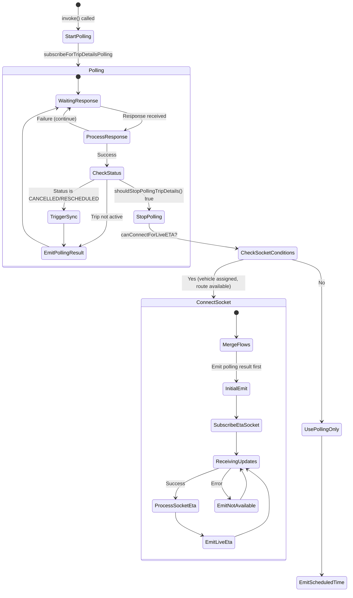
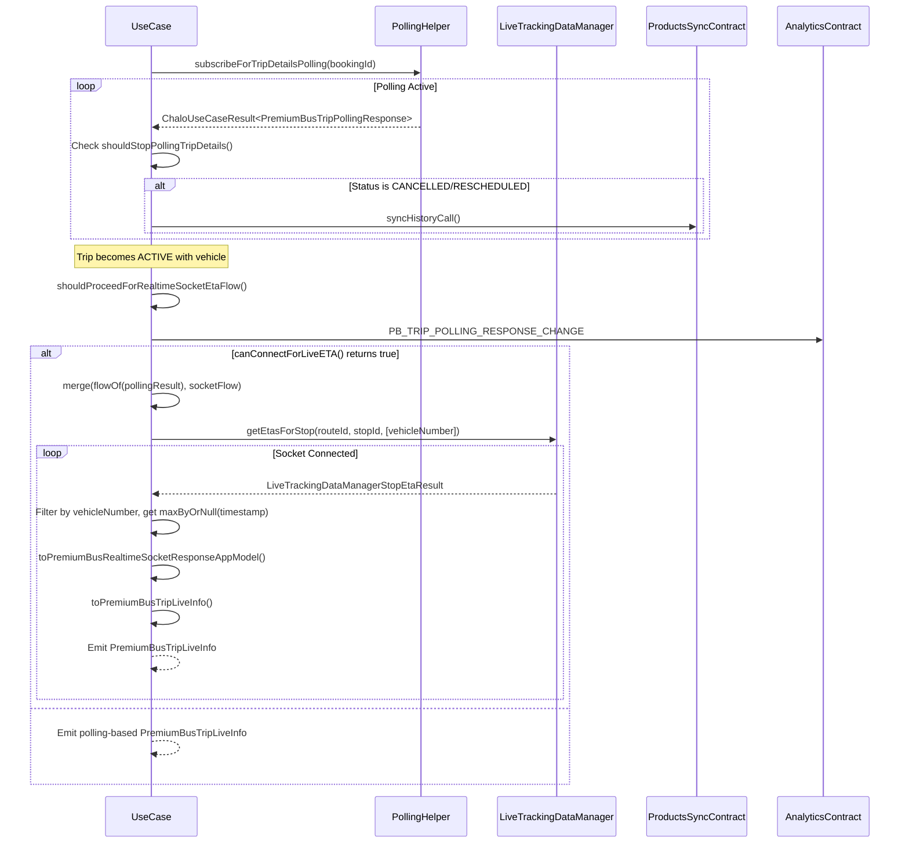
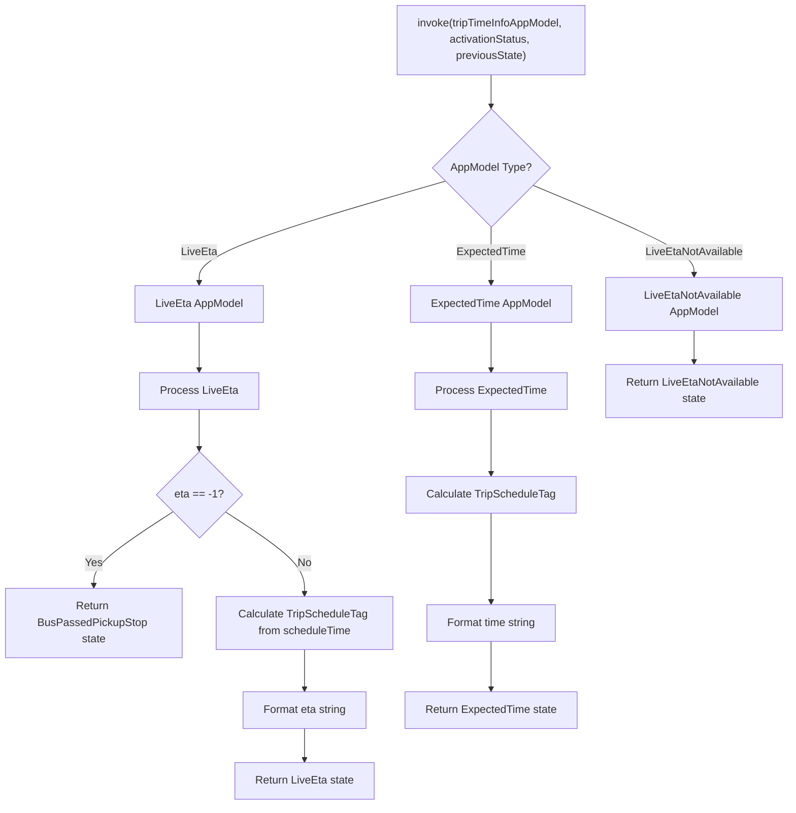
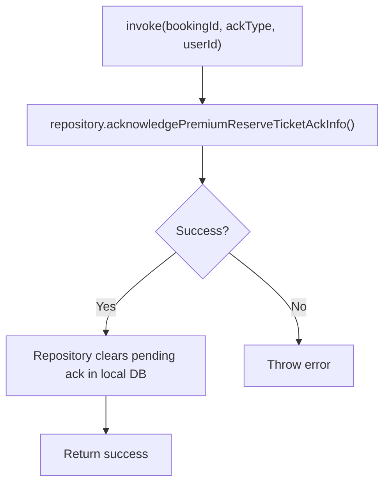
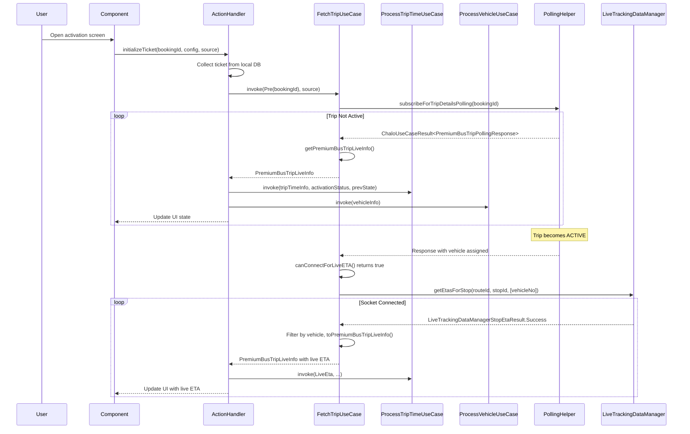
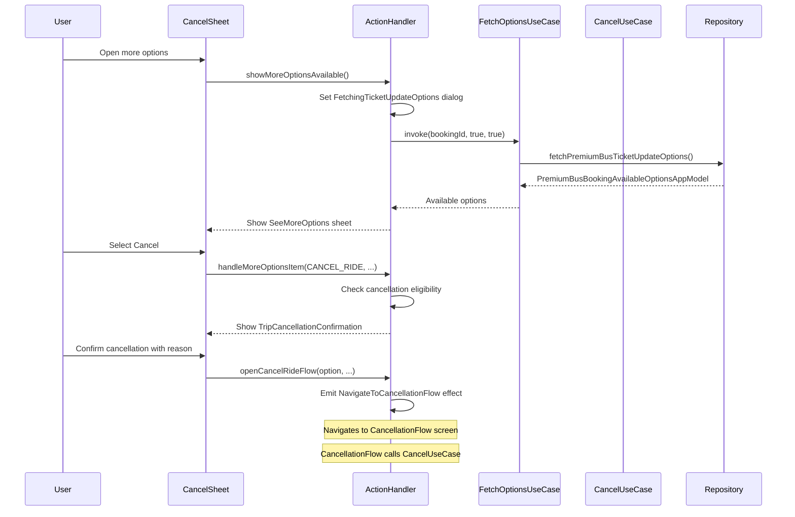
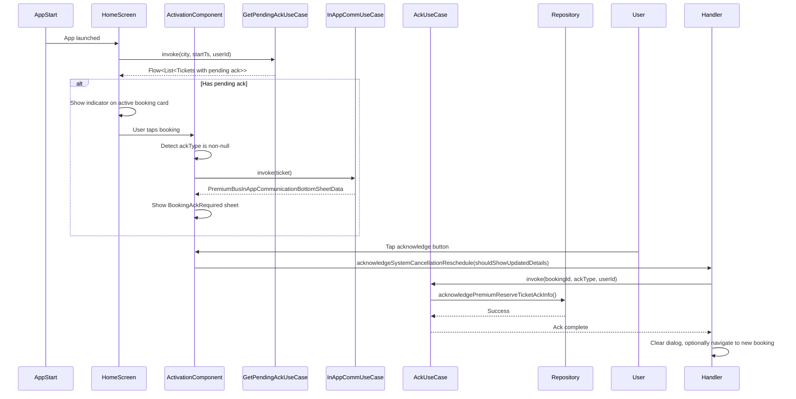

# Premium Bus Activation & Tracking — UseCase Documentation

## Domain Layer Overview

The Premium Bus Activation & Tracking domain layer orchestrates all post-booking operations through a set of specialized use cases. These use cases coordinate ticket retrieval, live ETA fetching with real-time socket integration, trip time processing, vehicle info processing, cancellation workflows, rescheduling, and acknowledgment of system-initiated changes. The domain layer encapsulates complex business logic around polling strategies, polling-to-socket transitions, status transitions, and booking lifecycle management.

```mermaid
flowchart TB
    subgraph Presentation
        ActivationComp["ActivationComponent"]
        ActionHandler["PostBookingActionHandler"]
    end

    subgraph Domain["Domain Layer"]
        GetTicket["GetPremiumReserveTicketByIdUseCase"]
        FetchTrip["FetchPremiumBusTripDetailsAndLiveEtaUseCase"]
        ProcessTripTime["ProcessPremiumBusTripTimeInfoUseCase"]
        ProcessVehicle["ProcessPremiumBusVehicleInfoUseCase"]
        Cancel["CancelPremiumReserveTicketUseCase"]
        FetchOptions["FetchPremiumBusTicketsUpdateOptionsUseCase"]
        Acknowledge["AcknowledgePremiumReserveTicketCancellationUseCase"]
        GetPendingAck["GetPremiumReserveTicketsWithPendingAckUseCase"]
        InAppComm["PremiumBusInAppCommunicationBottomSheetDataUseCase"]
    end

    subgraph Data["Data Layer"]
        PremiumRepo["PremiumBusRepository"]
        LiveTrackingMgr["LiveTrackingDataManager"]
        PollingHelper["PremiumBusTripDetailsPollingHelper"]
        ProductsSync["ProductsSyncContract"]
    end

    ActivationComp --> GetTicket
    ActivationComp --> GetPendingAck
    ActionHandler --> FetchTrip
    ActionHandler --> ProcessTripTime
    ActionHandler --> ProcessVehicle
    ActionHandler --> Cancel
    ActionHandler --> FetchOptions
    ActionHandler --> Acknowledge
    ActionHandler --> InAppComm

    FetchTrip --> PollingHelper
    FetchTrip --> LiveTrackingMgr
    FetchTrip --> ProductsSync

    GetTicket --> PremiumRepo
    Cancel --> PremiumRepo
    GetPendingAck --> PremiumRepo
    Acknowledge --> PremiumRepo
    FetchOptions --> PremiumRepo
```



---

## UseCase Inventory

| UseCase | Module | Responsibility |
|---------|--------|----------------|
| **GetPremiumReserveTicketByIdUseCase** | productbooking | Retrieve ticket details by booking ID from local DB as Flow |
| **FetchPremiumBusTripDetailsAndLiveEtaUseCase** | home | Orchestrate polling and live tracking, transition to socket when trip is ACTIVE |
| **ProcessPremiumBusTripTimeInfoUseCase** | home | Transform trip time data into UI state with schedule tags |
| **ProcessPremiumBusVehicleInfoUseCase** | home | Transform vehicle data into UI state |
| **CancelPremiumReserveTicketUseCase** | home | Process ticket cancellation with reason |
| **FetchPremiumBusTicketsUpdateOptionsUseCase** | home | Get available cancel/reschedule options |
| **AcknowledgePremiumReserveTicketCancellationUseCase** | home | Record user ack for system changes |
| **GetPremiumReserveTicketsWithPendingAckUseCase** | home | Find tickets requiring acknowledgment |
| **PremiumBusInAppCommunicationBottomSheetDataUseCase** | home | Generate bottom sheet data for in-app communications |

---

## FetchPremiumBusTripDetailsAndLiveEtaUseCase

The central use case for fetching trip details with live ETA. This is the most sophisticated use case in the activation tracking feature, orchestrating the transition from polling-based updates to real-time socket-based tracking.

### Responsibility

Manages the complete lifecycle of trip information retrieval. Initially polls for trip details at regular intervals. When the trip becomes ACTIVE and a vehicle is assigned, automatically switches to real-time socket-based ETA tracking via `LiveTrackingDataManager`. Also handles status transitions like SYSTEM_CANCELLED or SYSTEM_RESCHEDULED by triggering product sync.

### Source Location

`shared/home/src/commonMain/kotlin/app/chalo/premiumbus/domains/FetchPremiumBusTripDetailsAndLiveEtaUseCase.kt`

### Class Dependencies

| Dependency | Purpose |
|------------|---------|
| **PremiumBusTripDetailsPollingHelper** | Manages periodic polling for trip details |
| **LiveTrackingDataManager** | Real-time ETA via CRTS socket |
| **ProductsSyncContract** | Triggers history sync when booking status changes |
| **AnalyticsContract** | Logs analytics events |

### State Machine



### Interface

```kotlin
class FetchPremiumBusTripDetailsAndLiveEtaUseCase(
    private val premiumBusTripDetailsPollingHelper: PremiumBusTripDetailsPollingHelper,
    private val liveTrackingDataManager: LiveTrackingDataManager,
    private val productsSyncContract: ProductsSyncContract,
    private val analyticsContract: AnalyticsContract
) {
    operator fun invoke(
        ticketActivationStatus: PremiumTicketActivationStatus,
        source: Source
    ): Flow<PremiumBusTripLiveInfo>
}
```

### Input Parameters

| Parameter | Type | Description |
|-----------|------|-------------|
| **ticketActivationStatus** | PremiumTicketActivationStatus | Pre or Post validation status with bookingId |
| **source** | Source | Analytics source tracking |

### PremiumTicketActivationStatus

The sealed class distinguishes between pre-validation (tracking pickup) and post-validation (tracking drop) scenarios.

| Variant | Fields | Purpose |
|---------|--------|---------|
| **Pre** | bookingId: String | Pre-validation: track pickup stop ETA using polling stopId |
| **Post** | bookingId: String, stopId: String | Post-validation: track drop stop ETA using provided stopId |

### Output

| Type | Description |
|------|-------------|
| **Flow<PremiumBusTripLiveInfo>** | Continuous stream of trip info with live or scheduled times |

### PremiumBusTripLiveInfo Structure

| Field | Type | Description |
|-------|------|-------------|
| **vehicleInfoState** | PremiumBusBookingVehicleInfoAppModel | Vehicle assignment state |
| **tripTimeInfoState** | PremiumBusBookingTripTimeInfoAppModel | ETA or scheduled time |
| **tripCommunicationBanners** | List<TripCommunicationAppModel> | In-trip announcements |
| **selectedSeat** | List<SeatInfoAppModel> | Seat assignments |

### Polling to Socket Transition Logic

The use case intelligently transitions from polling to socket-based tracking when conditions are met.



### Socket Reconnection Logic

The use case handles vehicle/route/stop changes by reconnecting to the socket.

```kotlin
private fun shouldProceedForRealtimeSocketEtaFlow(
    lastPbTripPollingResponse: PremiumBusTripPollingResponseAppModel?,
    pollingResponse: PremiumBusTripPollingResponseAppModel
): Boolean {
    return lastPbTripPollingResponse?.vehicleNo != pollingResponse.vehicleNo
            || lastPbTripPollingResponse?.stopId != pollingResponse.stopId
            || lastPbTripPollingResponse.routeId != pollingResponse.routeId
}
```

### Stop ID Resolution

The stop ID for ETA fetching differs based on activation status.

| Activation Status | Stop ID Source |
|-------------------|----------------|
| **Pre** | From polling response (`pollingResponse.stopId`) |
| **Post** | From status object (`ticketActivationStatus.stopId`) |

### Vehicle Info States

| State | Condition | Display |
|-------|-----------|---------|
| **VehicleAssigned** | Vehicle number available | Shows vehicleNumber, vehicleName, vehicleImageUrl, tripStatus, assignedSeats, seats |
| **VehicleNotAssigned** | No vehicle yet | Shows seats list only, "Vehicle will be assigned" |

### Trip Time Info States

| State | Source | Description |
|-------|--------|-------------|
| **LiveEta** | Socket response | Live ETA in seconds, hasBusCrossedStop flag, etaUpdatedAtTimestamp, scheduleStopTime, distanceToReach |
| **ExpectedTime** | Polling response | expectedStopTimeInMillis, scheduledStopTimeInMillis, updatedTripStartTimeInMillisFromPolling |
| **LiveEtaNotAvailable** | Socket error | Fallback when socket fails |

---

## ProcessPremiumBusTripTimeInfoUseCase

Transforms raw trip polling response and live tracking data into structured UI state for display on the activation screen.

### Responsibility

Converts `PremiumBusBookingTripTimeInfoAppModel` into `PremiumBusBookingTripTimeInfoState` sealed class variants. Handles different scenarios: scheduled time, live ETA, bus passed stop, and tracking unavailable states. Calculates trip schedule tags (ON_TIME, DELAYED, etc.) based on configured thresholds.

### Source Location

`shared/home/src/commonMain/kotlin/app/chalo/premiumbus/prebookedtickets/domain/ProcessPremiumBusTripTimeInfoUseCase.kt`

### Interface

```kotlin
class ProcessPremiumBusTripTimeInfoUseCase(
    private val basicInfoContract: BasicInfoContract,
    private val stringProvider: StringProvider,
    private val premiumBusProductConfigManager: PremiumBusProductConfigManager
) {
    operator fun invoke(
        tripTimeInfoAppModel: PremiumBusBookingTripTimeInfoAppModel,
        ticketActivationStatus: PremiumTicketActivationStatus,
        previousTripTimeInfoState: PremiumBusBookingTripTimeInfoState?
    ): PremiumBusBookingTripTimeInfoState
}
```

### Transformation Flow



### Trip Schedule Tag Calculation

Tags are calculated based on thresholds from `PremiumBusProductConfigManager`.

| Tag | Condition |
|-----|-----------|
| **ARRIVING_EARLY** | ETA < scheduledTime - busArrivedEarlyThresholdInSec |
| **ON_TIME** | abs(ETA - scheduledTime) <= onTimeBufferThresholdInSec |
| **RUNNING_BEHIND** | scheduledTime < ETA <= scheduledTime + runningLateStatusThresholdInSec |
| **DELAYED** | ETA > scheduledTime + runningLateStatusThresholdInSec |

### Output State Types

| State | Fields | Usage |
|-------|--------|-------|
| **LiveEta** | etaString, etaLastUpdatedAtStatus?, tripScheduleTag? | Active tracking with live ETA |
| **ExpectedTime** | timeString, tripScheduleTag, updatedTripStartTime? | Before vehicle assignment or GPS unavailable |
| **BusPassedPickupStop** | N/A | Bus has crossed the pickup stop |
| **LiveEtaNotAvailable** | N/A | Socket error or tracking failure |
| **NotFetched** | N/A | Initial loading state |

---

## ProcessPremiumBusVehicleInfoUseCase

Transforms vehicle info app model into UI state for the activation screen.

### Responsibility

Converts `PremiumBusBookingVehicleInfoAppModel` into `PremiumBusBookingVehicleInfoState` sealed class, handling vehicle assignment status and providing formatted display strings.

### Source Location

`shared/home/src/commonMain/kotlin/app/chalo/premiumbus/prebookedtickets/domain/ProcessPremiumBusVehicleInfoUseCase.kt`

### Interface

```kotlin
class ProcessPremiumBusVehicleInfoUseCase(
    private val stringProvider: StringProvider
) {
    operator fun invoke(
        vehicleInfoAppModel: PremiumBusBookingVehicleInfoAppModel
    ): PremiumBusBookingVehicleInfoState
}
```

### Output State Types

| State | Source | Fields |
|-------|--------|--------|
| **VehicleAssigned** | VehicleAssigned AppModel | vehicleNumber, vehicleName?, vehicleImageUrl?, assignedSeats, seats |
| **VehicleNotAssigned** | VehicleNotAssigned AppModel | seats list |

---

## CancelPremiumReserveTicketUseCase

Processes ticket cancellation requests by coordinating with the repository to cancel the booking and update local state.

### Responsibility

Validates cancellation request parameters and delegates to repository for API call. Receives cancellation response with refund details. Window validation is handled at presentation layer before invoking this use case.

### Source Location

`shared/home/src/commonMain/kotlin/app/chalo/premiumbus/prebookedtickets/domain/CancelPremiumReserveTicketUseCase.kt`

### Interface

```kotlin
class CancelPremiumReserveTicketUseCase(
    private val premiumBusRepository: PremiumBusRepository
) {
    suspend operator fun invoke(
        bookingId: String,
        reasonModel: PremiumBusProductModificationReasonAppModel,
        isCancel: Boolean,
        source: Source?
    ): PBTicketCancellationRequestAppResponseModel
}
```

### Input Parameters

| Parameter | Type | Description |
|-----------|------|-------------|
| **bookingId** | String | Booking to cancel |
| **reasonModel** | PremiumBusProductModificationReasonAppModel | Selected cancellation reason with code and text |
| **isCancel** | Boolean | True for cancel, false for reschedule preparation |
| **source** | Source? | Analytics source tracking |

### Output

| Type | Description |
|------|-------------|
| **PBTicketCancellationRequestAppResponseModel** | Cancellation result with refund info |

### Cancellation Response Fields

| Field | Type | Description |
|-------|------|-------------|
| **bookingId** | String | Cancelled booking ID |
| **refundAmount** | Double | Total refund amount |
| **refundBreakdown** | List<RefundItem> | Itemized refund |
| **transactionId** | String | Refund transaction reference |

---

## FetchPremiumBusTicketsUpdateOptionsUseCase

Retrieves available modification options (cancel/reschedule) for a ticket, including policy details and eligibility windows.

### Responsibility

Fetches current modification options from repository. Determines what actions are available based on ticket status and time until departure. Returns detailed policy information and eligibility windows for display in UI.

### Source Location

`shared/home/src/commonMain/kotlin/app/chalo/premiumbus/prebookedtickets/domain/FetchPremiumBusTicketsUpdateOptionsUseCase.kt`

### Interface

```kotlin
class FetchPremiumBusTicketsUpdateOptionsUseCase(
    private val premiumBusRepository: PremiumBusRepository
) {
    suspend operator fun invoke(
        bookingId: String,
        fetchCancelOptions: Boolean,
        fetchRescheduleOptions: Boolean
    ): PremiumBusBookingAvailableOptionsAppModel
}
```

### Input Parameters

| Parameter | Type | Description |
|-----------|------|-------------|
| **bookingId** | String | Booking identifier |
| **fetchCancelOptions** | Boolean | Include cancellation options in response |
| **fetchRescheduleOptions** | Boolean | Include reschedule options in response |

### Output Structure

| Field | Type | Description |
|-------|------|-------------|
| **options** | List<PremiumBusProductOptionsAppModel> | Available action items |
| **cancellationPolicy** | CancellationPolicy? | Refund terms if cancellable |
| **reschedulePolicy** | ReschedulePolicy? | Reschedule terms if available |

### Option Actions

| Action | Description | Availability |
|--------|-------------|--------------|
| **CANCEL_RIDE** | User-initiated cancellation | Based on cancellation window |
| **RESCHEDULE_RIDE** | Reschedule to different trip | Based on reschedule window |
| **CHANGE_SEATS** | Change seat selection | Before trip start |
| **CALL_SUPPORT** | Contact customer support | Always available |
| **CHAT_SUPPORT** | Report problem via chat | Always available |
| **VIEW_ALLOCATED_SEATS** | Show current seat assignments | After seat assignment |
| **DOWNLOAD_RECEIPT** | Download trip receipt | After booking |

---

## AcknowledgePremiumReserveTicketCancellationUseCase

Records user acknowledgment of system-initiated booking changes (cancellation or rescheduling by operator).

### Responsibility

Sends acknowledgment to server and updates local database to clear pending ack flag. Handles both SYSTEM_CANCELLED and SYSTEM_RESCHEDULED acknowledgment types.

### Source Location

`shared/home/src/commonMain/kotlin/app/chalo/premiumbus/prebookedtickets/domain/AcknowledgePremiumReserveTicketCancellationUseCase.kt`

### Interface

```kotlin
class AcknowledgePremiumReserveTicketCancellationUseCase(
    private val premiumBusRepository: PremiumBusRepository
) {
    suspend operator fun invoke(
        bookingId: String,
        ackType: PremiumReserveTicketAckType,
        userId: String
    )
}
```

### Input Parameters

| Parameter | Type | Description |
|-----------|------|-------------|
| **bookingId** | String | Booking to acknowledge |
| **ackType** | PremiumReserveTicketAckType | Type of system change |
| **userId** | String | User identifier |

### Acknowledgment Types

| Type | Description |
|------|-------------|
| **SYSTEM_CANCELLED** | Operator cancelled the trip |
| **SYSTEM_RESCHEDULED** | Operator changed the schedule |

### Flow



---

## GetPremiumReserveTicketsWithPendingAckUseCase

Retrieves all tickets that have pending acknowledgments for system-initiated changes.

### Responsibility

Queries local storage for tickets with unacknowledged system changes. Filters by current time, city, and user to return only relevant tickets. Returns as Flow for reactive UI updates on home screen.

### Source Location

`shared/home/src/commonMain/kotlin/app/chalo/premiumbus/prebookedtickets/domain/GetPremiumReserveTicketsWithPendingAckUseCase.kt`

### Interface

```kotlin
class GetPremiumReserveTicketsWithPendingAckUseCase(
    private val premiumBusRepository: PremiumBusRepository
) {
    operator fun invoke(
        city: String,
        startTs: Long,
        userId: String
    ): Flow<List<PremiumReserveTicketAppModel>>
}
```

### Query Criteria

Tickets are returned if they meet ALL criteria:

1. City matches user's current city
2. Trip time is after startTs (not expired)
3. User ID matches
4. Has pending acknowledgment type (ackType is non-null)
5. Acknowledgment not yet completed (ackHasAcknowledged is false)

### Usage Context

This use case is called from the home screen to check if any system-initiated changes need user attention. When tickets are found, the activation screen shows `BookingAckRequired` bottom sheet.

---

## PremiumBusInAppCommunicationBottomSheetDataUseCase

Generates bottom sheet data for in-app communications about system changes.

### Responsibility

Creates structured display data for the BookingAckRequired bottom sheet, including change reason, refund information (for cancellation), and new schedule details (for rescheduling).

### Source Location

`shared/home/src/commonMain/kotlin/app/chalo/premiumbus/prebookedtickets/domain/PremiumBusInAppCommunicationBottomSheetDataUseCase.kt`

### Interface

```kotlin
class PremiumBusInAppCommunicationBottomSheetDataUseCase(
    private val stringProvider: StringProvider
) {
    operator fun invoke(
        ticket: PremiumReserveTicketAppModel
    ): PremiumBusInAppCommunicationBottomSheetData
}
```

### Output Structure

| Field | Type | Description |
|-------|------|-------------|
| **title** | String | Bottom sheet title |
| **description** | String | Change explanation |
| **changeType** | AckType | Type of system change |
| **refundInfo** | RefundDisplayInfo? | Refund details (if cancelled) |
| **newTripInfo** | TripDisplayInfo? | New trip details (if rescheduled) |
| **primaryCtaText** | String | Primary button text |
| **secondaryCtaText** | String? | Secondary button text |

---

## GetPremiumReserveTicketByIdUseCase

Retrieves premium bus ticket details from local storage as a reactive Flow, enabling real-time UI updates when ticket data changes.

### Responsibility

Provides a reactive stream of ticket data from the local database. The repository observes database changes and emits updated models automatically. This enables the UI to stay synchronized with local ticket state without manual refresh.

### Source Location

`shared/productbooking/src/commonMain/kotlin/app/chalo/premiumbus/domain/GetPremiumReserveTicketByIdUseCase.kt`

### Interface

```kotlin
class GetPremiumReserveTicketByIdUseCase(
    private val premiumBusRepository: PremiumBusRepository
) {
    operator fun invoke(bookingId: String): Flow<PremiumReserveTicketAppModel?>
}
```

### PremiumReserveTicketAppModel Structure

| Field | Type | Description |
|-------|------|-------------|
| **bookingProperties** | PremiumBusBookingProperties | Core booking data (ID, status, timestamps) |
| **tripProperties** | PremiumBusTripProperties | Route, stops, trip timing |
| **validationProperties** | PremiumBusValidationProperties | QR code, validation state |
| **fareAndPassengerProperties** | PremiumBusFareAndPassengerProperties | Price breakdown, passenger count |
| **cancellationProperties** | PremiumBusCancellationProperties? | Cancellation details if cancelled |

---

## Domain Models

### PremiumReserveTicketStatus

The comprehensive status enum representing all possible ticket states.

| Status | Value | Description | Can Cancel | Can Reschedule |
|--------|-------|-------------|------------|----------------|
| **ACTIVE** | "ACTIVE" | Ticket ready for use | Yes (window-dependent) | Yes (window-dependent) |
| **PAYMENT_PROCESSING** | "PAYMENT_PROCESSING" | Payment in progress | No | No |
| **PAYMENT_FAILED** | "PAYMENT_FAILED" | Payment unsuccessful | No | No |
| **PUNCHED** | "PUNCHED" | Validated on bus | No | No |
| **USED** | "USED" | Trip completed | No | No |
| **USER_CANCELLED** | "USER_CANCELLED" | Cancelled by user | No | No |
| **SYSTEM_CANCELLED** | "SYSTEM_CANCELLED" | Cancelled by operator | No | No |
| **USER_RESCHEDULED** | "USER_RESCHEDULED" | Rescheduled by user | No | No |
| **SYSTEM_RESCHEDULED** | "SYSTEM_RESCHEDULED" | Rescheduled by operator | No | No |
| **EXPIRED** | "EXPIRED" | Validity expired | No | No |
| **BOOKING_UNDER_PROCESS** | "BOOKING_UNDER_PROCESS" | Being processed | No | No |
| **BOOKING_FAILED** | "BOOKING_FAILED" | Creation failed | No | No |
| **FAILED** | "FAILED" | General failure | No | No |

### PremiumReserveTicketAckType

| Value | Description |
|-------|-------------|
| **SYSTEM_CANCELLED** | System cancelled the trip |
| **SYSTEM_RESCHEDULED** | System rescheduled the trip |

### PremiumBusTripStatus

| Value | Description |
|-------|-------------|
| **NOT_STARTED** | Trip not yet begun |
| **ACTIVE** | Trip in progress |
| **COMPLETED** | Trip finished |
| **CANCELLED** | Trip cancelled |

---

## Business Rules

| Rule | Description | Enforcement Location |
|------|-------------|---------------------|
| **Polling continues until conditions met** | Trip details polling continues until `shouldStopPollingTripDetails()` returns true | FetchPremiumBusTripDetailsAndLiveEtaUseCase |
| **Socket replaces polling** | When `canConnectForLiveETA()` returns true, switch from polling to socket | FetchPremiumBusTripDetailsAndLiveEtaUseCase |
| **Socket reconnection on change** | If vehicle/route/stop changes, reconnect socket | FetchPremiumBusTripDetailsAndLiveEtaUseCase |
| **Auto-sync on system status change** | If status becomes SYSTEM_CANCELLED or SYSTEM_RESCHEDULED, trigger `syncHistoryCall()` | FetchPremiumBusTripDetailsAndLiveEtaUseCase |
| **ETA -1 means passed** | Live ETA of -1 indicates bus has passed the stop | ProcessPremiumBusTripTimeInfoUseCase |
| **Schedule tag calculation** | Tags calculated from config thresholds | ProcessPremiumBusTripTimeInfoUseCase |
| **Ack clears pending flag** | Acknowledging clears the local pending ack flag | AcknowledgePremiumReserveTicketCancellationUseCase |

---

## Sequence Diagrams

### Complete Activation Flow with Live Tracking



### Cancellation Flow



### Acknowledgment Flow



---

## Error Handling

| Error | UseCase | Handling |
|-------|---------|----------|
| **Network timeout** | All remote calls | Throw exception, let presentation retry |
| **API 4xx error** | Cancel, FetchOptions | Parse error message, return to UI |
| **API 5xx error** | All remote calls | Throw generic server error |
| **Empty response** | FetchOptions | Return empty options list |
| **Socket disconnection** | FetchTripDetails | Continue emitting last known state or polling result |
| **Socket error** | FetchTripDetails | Filter out errors, only emit success results via mapNotNull |
| **Local DB error** | GetTicketById | Return null, trigger remote fetch |
| **Invalid ticket status** | Cancel, Reschedule | Not enforced in domain (presentation checks window) |
