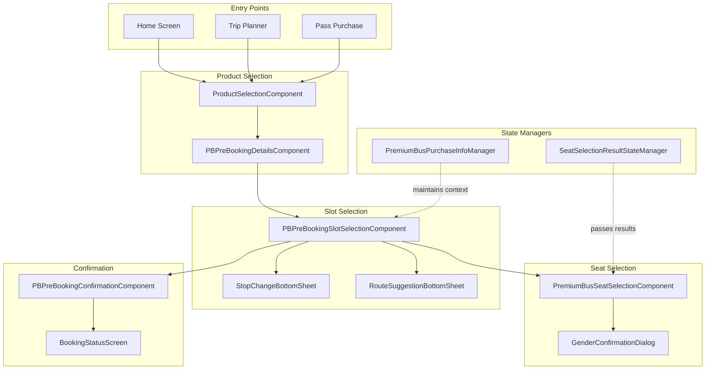
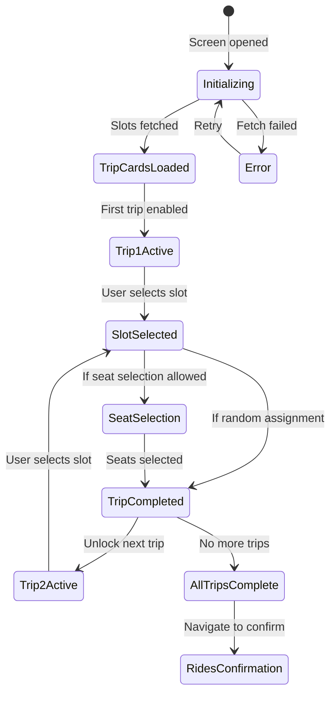
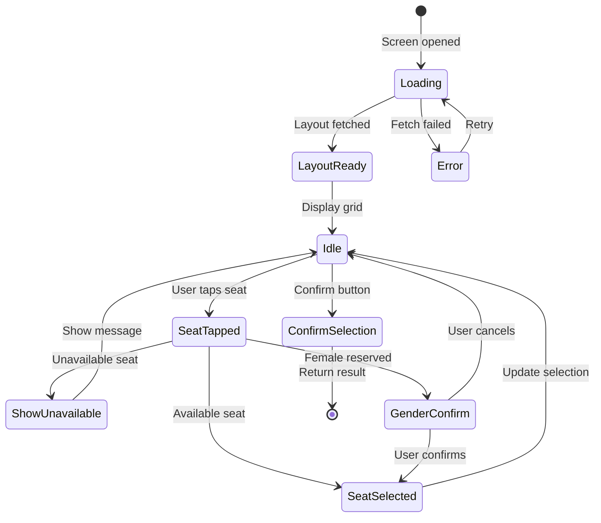
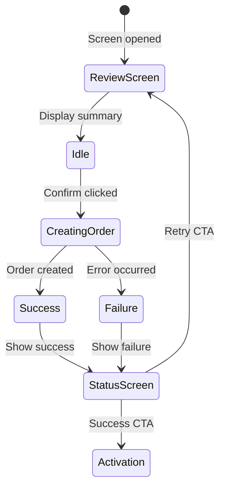
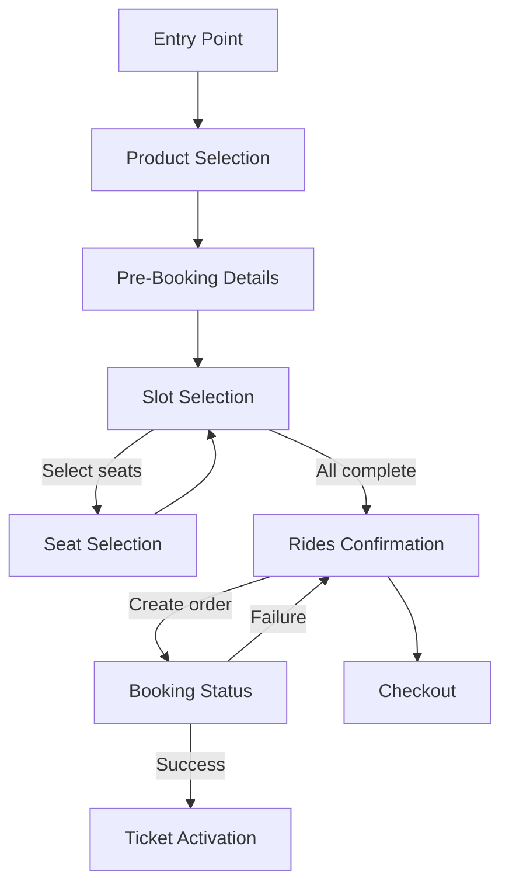

# Premium Bus Booking — Component Documentation

## Architecture Overview

The Premium Bus Booking presentation layer implements a multi-step booking flow using Decompose components. The flow supports multiple booking types: fresh purchases, pass-based bookings, bulk pre-bookings, seat changes, and reschedules. Each component manages its state through the MVI pattern with distinct data states, intents, and side effects.

---

## Screen Inventory

| Screen | Component | Purpose |
|--------|-----------|---------|
| **Product Selection** | ProductSelectionComponent | Configure booking type and pass selection |
| **Pre-Booking Details** | PBPreBookingDetailsComponent | Set date range, trips per day, weekdays |
| **Slot Selection** | PBPreBookingSlotSelectionComponent | Select departure slots for each trip |
| **Seat Selection** | PremiumBusSeatSelectionComponent | Interactive seat grid for seat selection |
| **Rides Confirmation** | PBPreBookingConfirmationComponent | Review and confirm all trips |
| **Booking Status** | BookingStatusScreen | Success/failure result with CTAs |

---

## Slot Selection Screen

The slot selection component manages the complex multi-trip booking flow, handling slot selection for multiple trips sequentially with associated bottom sheets for stop changes and route suggestions.

### User Journey

1. User arrives with pre-booking configuration (dates, trips per day)
2. Trip cards displayed for each trip slot (Trip 1, Trip 2, etc.)
3. Only first trip starts enabled; subsequent trips unlock sequentially
4. User selects pickup/drop stops and departure slot for each trip
5. Optionally proceeds to seat selection if seat assignment type allows
6. Completes selection for all trips
7. Proceeds to rides confirmation

### State Flow

### View State Structure

| Field | Type | Description |
|-------|------|-------------|
| **tripSlotCards** | List<TripSlotCardUiData> | Card data for each trip |
| **selectedDates** | List<LocalDate> | Booking date range |
| **selectedWeekdays** | List<Weekday> | Selected days of week |
| **bottomSheetState** | BottomSheetState? | Current bottom sheet |
| **isLoading** | Boolean | Loading indicator |
| **errorMessage** | String? | Error display |

### Trip Slot Card Data

| Field | Type | Description |
|-------|------|-------------|
| **tripId** | String | Trip identifier (1, 2, 3...) |
| **originDestinationInfo** | PBOriginDestinationAppModel | Stop pair details |
| **isSlotSelectionComplete** | Boolean | Slot selected status |
| **isSeatSelectionAllowed** | Boolean | Can select seats |
| **isSeatSelectionCompleted** | Boolean | Seats selected status |
| **selectedSeats** | List<SeatInfoAppModel> | Selected seat list |
| **isEnabled** | Boolean | Trip card active status |

### Intents

| Intent | Trigger | Action |
|--------|---------|--------|
| **ViewCreated** | Screen mount | Fetch available slots |
| **StopChangeClicked** | Stop chip tap | Show stop change sheet |
| **SlotSelectedByUser** | Slot tap | Update selected slot |
| **SeatSelectionClicked** | Select seats button | Navigate to seat selection |
| **RouteSuggestionClicked** | Route suggestion tap | Show route suggestion sheet |
| **ProceedToConfirmation** | Next button | Navigate to confirmation |
| **DismissBottomSheet** | Sheet dismiss | Close current sheet |
| **RetryFetch** | Retry button | Re-fetch slots |

### Bottom Sheet Types

| Type | Trigger | Content |
|------|---------|---------|
| **StopChangeSheet** | Stop change tap | Origin/destination selection |
| **RouteSuggestionSheet** | Route suggestion | Alternative routes list |
| **SlotDetailsSheet** | Slot info tap | Slot timing and availability |
| **SeatAssignmentSheet** | Seat type info | Assignment type explanation |
| **ErrorSheet** | Slot fetch error | Error message and retry |
| **FewSeatsWarningSheet** | Low availability | Seat availability warning |

### Side Effects

| Effect | When Triggered | Result |
|--------|----------------|--------|
| **NavigateToSeatSelection** | Seat selection clicked | Open seat selection |
| **NavigateToConfirmation** | All trips complete | Open rides confirmation |
| **ShowToast** | Error or info | Display toast message |
| **DismissSheet** | Sheet action complete | Close bottom sheet |

---

## Seat Selection Screen

The seat selection component displays an interactive 3D seat grid allowing users to select available seats with gender validation for reserved seats.

### User Journey

1. User arrives from slot selection
2. Seat layout fetched for selected trip
3. Interactive grid displays seat availability
4. User taps available seats to select
5. Female-reserved seats trigger confirmation dialog
6. User confirms gender if required
7. Selection confirmed and returned to caller

### State Flow

### View State Structure

| Field | Type | Description |
|-------|------|-------------|
| **seatGrid** | List<List<SeatInfoAppModel>> | 3D seat layout |
| **selectedSeats** | List<SeatInfoAppModel> | User's selections |
| **maxSeatsAllowed** | Int | Selection limit |
| **totalFare** | Long | Calculated fare |
| **flowType** | SeatSelectionFlowType | Booking flow type |
| **isLoading** | Boolean | Loading state |
| **genderDialogVisible** | Boolean | Show gender dialog |

### Seat Information Model

| Field | Type | Description |
|-------|------|-------------|
| **seatId** | Int | Unique identifier |
| **seatNumber** | String | Display label (1A, 2B) |
| **seatType** | SeatType | WINDOW, AISLE, MIDDLE, EMPTY, DRIVER |
| **status** | SeatStatus | AVAILABLE, UNAVAILABLE |
| **reservationType** | ReservationType | GENERAL, FEMALE |
| **x, y, z** | Int | 3D grid coordinates |
| **isSelectedByUser** | Boolean | Selection state |

### Seat Selection Flow Types

| Type | Description | Use Case |
|------|-------------|----------|
| **FreshPurchase** | Direct ticket purchase | Single trip booking |
| **FreshPurchaseThroughPass** | Using pass credit | Pass holder booking |
| **BulkBooking** | Multiple trips | Pre-booking flow |
| **ChangeSeat** | Modify existing booking | Seat change request |
| **Reschedule** | Change to different slot | Trip reschedule |

### Intents

| Intent | Trigger | Action |
|--------|---------|--------|
| **ViewCreated** | Screen mount | Fetch seat layout |
| **SeatTapped** | Seat icon tap | Handle seat selection |
| **GenderConfirmed** | Dialog confirm | Add female seat |
| **GenderCancelled** | Dialog cancel | Reset selection |
| **ConfirmSelection** | Confirm button | Return results |
| **RetryFetch** | Retry button | Re-fetch layout |

### Seat Status Indicators

| Status | Visual | Selectable |
|--------|--------|------------|
| **Available** | Green outline | Yes |
| **Unavailable** | Gray filled | No |
| **Selected** | Blue filled | Toggle off |
| **Female Reserved** | Pink outline | With confirmation |
| **Driver** | Special icon | No |
| **Empty** | No display | N/A |

### Side Effects

| Effect | When Triggered | Result |
|--------|----------------|--------|
| **ReturnSeatSelection** | Confirm clicked | Pass results to manager |
| **ShowGenderDialog** | Female seat tapped | Display confirmation |
| **ShowMaxSeatsError** | Limit exceeded | Toast with limit |
| **NavigateBack** | Cancel clicked | Return without selection |

---

## Pre-Booking Confirmation Screen

The confirmation component displays all selected trips with their slots and seats for final review before order creation.

### User Journey

1. User arrives with all trips configured
2. Summary displays each trip's details
3. Total fare calculated across all trips
4. User reviews and confirms booking
5. Order created via bulk pre-book use case
6. Success or failure status displayed
7. User proceeds to activation or retries

### State Flow

### View State Structure

| Field | Type | Description |
|-------|------|-------------|
| **tripSummaries** | List<TripSummaryUiModel> | Trip details list |
| **totalFare** | Long | Combined fare |
| **totalRides** | Int | Number of rides |
| **isCreatingOrder** | Boolean | Loading state |
| **orderResult** | OrderCreationResult? | Success/failure |
| **errorDetails** | ErrorDetails? | Error information |

### Intents

| Intent | Trigger | Action |
|--------|---------|--------|
| **ConfirmBooking** | Confirm button | Create bulk order |
| **RetryBooking** | Retry button | Retry failed order |
| **NavigateToActivation** | Success CTA | Open ticket activation |
| **GoBack** | Back press | Return to slot selection |

### Order Creation Errors

| Error Code | Type | Description | Handling |
|------------|------|-------------|----------|
| **2020** | BookingWindowOverlapping | Booking conflicts with existing | Show conflict message |
| **5003** | FareMappingError | Fare calculation mismatch | Show effective fare option |
| **Generic** | API Error | Network or server error | Show retry option |

### Side Effects

| Effect | When Triggered | Result |
|--------|----------------|--------|
| **NavigateToActivation** | Order success | Open activation screen |
| **ShowErrorDialog** | Order failed | Display error with options |
| **ShowToast** | Info message | Display toast |

---

## State Managers

### PremiumBusPurchaseInfoManager

Maintains booking context across the multi-screen flow.

| Property | Type | Description |
|----------|------|-------------|
| **productConfig** | ProductConfigAppModel? | Selected product configuration |
| **originDestination** | PBOriginDestinationAppModel? | Selected stop pair |
| **slotSelected** | PBAvailableSlotsTripAppModel? | Selected departure slot |
| **passId** | String? | Pass ID if pass-based booking |
| **configId** | String? | Configuration identifier |

| Method | Purpose |
|--------|---------|
| **setProductConfig** | Store product selection |
| **setOriginDestination** | Store stop pair |
| **setSlotSelected** | Store slot selection |
| **reset** | Clear all state |
| **getState** | Retrieve current state |

### SeatSelectionResultStateManager

Manages seat selection results for multi-trip flows.

| Property | Type | Description |
|----------|------|-------------|
| **result** | SelectSeatsResult? | Current selection result |
| **listeners** | List<ResultListener> | Result observers |

| Method | Purpose |
|--------|---------|
| **setResult** | Store seat selection |
| **getResult** | Retrieve selection |
| **clearResult** | Reset selection |
| **addListener** | Subscribe to changes |

---

## Navigation Flow

---

## Analytics Events

| Event | Screen | Trigger |
|-------|--------|---------|
| **pb_pickup_drop_selected** | Slot Selection | Stop pair selected |
| **pb_slot_selection_screen_opened** | Slot Selection | Screen mount |
| **pb_slot_selected_by_user** | Slot Selection | Slot tapped |
| **pb_seat_selection_screen_opened** | Seat Selection | Screen mount |
| **premium_bus_seat_selection_seat_icon_clicked** | Seat Selection | Seat tapped |
| **premium_bus_order_creation_success** | Confirmation | Order created |
| **premium_bus_order_creation_failed** | Confirmation | Order failed |
| **pb_booking_confirmed** | Status | Booking complete |

---

## Error Handling

| Error Scenario | Screen | UI Response |
|----------------|--------|-------------|
| **Slots fetch failed** | Slot Selection | Error state with retry |
| **No slots available** | Slot Selection | Empty state message |
| **Layout fetch failed** | Seat Selection | Error with retry |
| **Seat unavailable** | Seat Selection | Toast with refresh |
| **Max seats exceeded** | Seat Selection | Toast with limit |
| **Gender mismatch** | Seat Selection | Confirmation dialog |
| **Order creation failed** | Confirmation | Error dialog with retry |
| **Booking window overlap** | Status | Conflict message |
| **Fare mapping error** | Status | Effective fare option |
