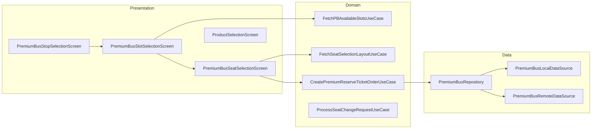

# Premium Bus — Booking — High-Level Design

## Overview

The Premium Bus Booking feature enables users to book reserved seats on premium bus services. The booking flow includes stop selection (pickup/drop points), slot selection (departure times), seat selection (interactive seat grid), and checkout. The feature supports multiple flow types: fresh purchase, pass-based booking, and seat changes.

## User Journey

1. **Entry Points**:
   - Home screen → Premium Bus card
   - Trip planner → Premium bus result
   - Pass purchase landing

2. **Core Flow**:
   - Select pickup and drop locations
   - Choose departure slot/time
   - Select seats on interactive grid
   - Review fare and apply coupons
   - Complete payment
   - Receive booking confirmation

3. **Exit Points**:
   - Booking confirmed → Activation screen
   - Payment failed → Retry
   - Seat unavailable → Re-select

## Architecture Diagram



## Key Components

| Component | Platform | File Path | Responsibility |
|-----------|----------|-----------|----------------|
| `PremiumBusStopSelectionComponent` | Shared | `shared/productbooking/.../premiumbus/ui/stopselection/PremiumBusStopSelectionComponent.kt` | Pickup/drop selection |
| `PremiumBusSlotSelectionComponent` | Shared | `shared/productbooking/.../premiumbus/ui/slotselection/PremiumBusSlotSelectionComponent.kt` | Departure time selection |
| `PremiumBusSeatSelectionComponent` | Shared | `shared/productbooking/.../premiumbus/ui/seatselection/PremiumBusSeatSelectionComponent.kt` | Seat grid and selection |
| `PremiumBusProductSelectionComponent` | Shared | `shared/productbooking/.../premiumbus/ui/productselection/PremiumBusProductSelectionComponent.kt` | Product configuration |
| `CreatePremiumReserveTicketOrderUseCase` | Shared | `shared/productbooking/.../premiumbus/domain/CreatePremiumReserveTicketOrderUseCase.kt` | Order creation |
| `PremiumBusRepository` | Shared | `shared/productbooking/.../premiumbus/data/repository/PremiumBusRepository.kt` | Data orchestration |

## Data Flow

### Stop Selection
1. User enters source/destination location
2. `FetchPBODPairsForGivenLocationsUseCase` fetches nearby pickup/drop points
3. User selects origin-destination pair
4. Navigate to slot selection

### Slot Selection
1. `FetchPBAvailableSlotsUseCase` fetches available departure times
2. Display slots with seat availability
3. Show pass purchase options (if eligible)
4. User selects slot
5. Navigate to seat selection

### Seat Selection
1. `FetchSeatSelectionLayoutUseCase` fetches seat grid
2. Display interactive seat layout
3. User selects available seats
4. Gender confirmation for reserved seats
5. `CreatePremiumReserveTicketOrderUseCase` creates order
6. Navigate to checkout

## Platform Differences

### Android-Specific
- Native Compose UI for seat grid
- Touch gesture handling for seat selection
- Google Maps integration for stop display

### iOS-Specific
- Compose Multiplatform UI
- Platform-specific map integration
- SKIE annotations for Swift interop

## Integration Points

### Analytics Events
- See [Analytics: premium-bus-booking](/analytics/flows/premium-bus-booking) for event documentation
- Key events:
  - `pb_pickup_drop_selected`
  - `pb_slot_selection_screen_opened`
  - `pb_slot_selected_by_user`
  - `pb_seat_selection_screen_opened`
  - `premium_bus_seat_selection_seat_icon_clicked`
  - `premium_bus_order_creation_success`

### Shared Services
- **Payment**: Checkout for ticket payment
- **Super Pass**: Pass-based bookings
- **Live Tracking**: Post-booking vehicle tracking

### Navigation
- **Navigates to**: Slot selection, Seat selection, Checkout, Activation
- **Navigated from**: Home, Trip planner, Pass landing

## Seat Selection Flow Types

### PremiumBusSeatSelectionFlowType
```kotlin
enum class PremiumBusSeatSelectionFlowType {
    FreshPurchase,           // Direct ticket purchase
    FreshPurchaseThroughPass, // Using pass credit
    ChangeSeat,              // Modify existing booking
    Reschedule,              // Change to different slot
    BulkBooking              // Multiple slots
}
```

## Seat Grid Model

### SeatInfoAppModel
```kotlin
data class SeatInfoAppModel(
    val seatId: String,
    val seatNumber: String,
    val seatType: SeatType,           // Window, Aisle, Middle
    val status: SeatStatus,           // Available, Unavailable
    val reservationType: ReservationType, // General, Female
    val x: Int, y: Int,               // Grid coordinates
    val isSelectedByUser: Boolean
)
```

### Seat Status Indicators
- **Available**: Can be selected (green)
- **Unavailable**: Already booked (gray)
- **Selected**: User's selection (blue)
- **Female Reserved**: For women passengers (pink)

## Edge Cases & Error Handling

| Scenario | Handling |
|----------|----------|
| No slots available | Shows empty state message |
| Seat already booked | Shows conflict and refreshes layout |
| Gender mismatch | Shows confirmation dialog |
| Payment failed | Shows retry option |
| Order creation failed | Shows error with specific reason |
| Booking window overlap | Error code 2020, shows message |

## Data Models

### PremiumReserveTicketAppModel
```kotlin
data class PremiumReserveTicketAppModel(
    val bookingProperties: BookingPropertiesAppModel,
    val tripProperties: TripPropertiesAppModel,
    val validationProperties: ValidationPropertiesAppModel,
    val fareAndPassengerProperties: FarePropertiesAppModel
)
```

### PBAvailableSlotsAppModel
```kotlin
data class PBAvailableSlotsAppModel(
    val tripId: String,
    val routeId: String,
    val fromStopId: String,
    val toStopId: String,
    val tripStartTime: Long,
    val seatsAvailable: Int,
    val totalSeats: Int,
    val fare: Long
)
```

### PremiumBusOrderCreationError
```kotlin
sealed class PremiumBusOrderCreationError {
    class BookingWindowOverlapping(...) // Code: 2020
    class FareMappingError(...)          // Code: 5003
    class API(...)
    class Local(...)
    object Unknown
}
```

## Managers

### PremiumBusPurchaseInfoManager
Maintains booking context across screens:
- Selected product configuration
- Selected slot and stops
- Origin-destination pair
- User selections

### SeatSelectionResultStateManager
Passes seat selection results back to caller for:
- Reschedule flow
- Bulk booking flow
- Seat change flow

## Dependencies

### Internal
- `shared:productbooking` — Premium bus booking module
- `shared:home` — Post-booking management
- `shared:checkout` — Payment processing
- `shared:chalo-base` — Base models

### External
- SQLDelight — Local ticket storage
- Compose — Interactive seat grid UI
- Maps SDK — Stop location display
