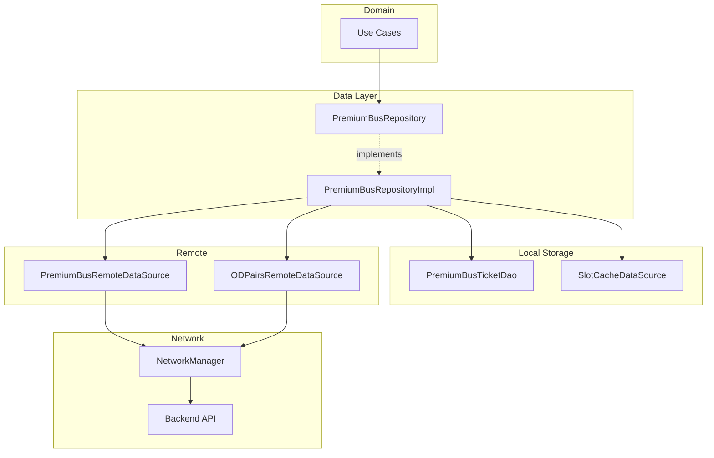
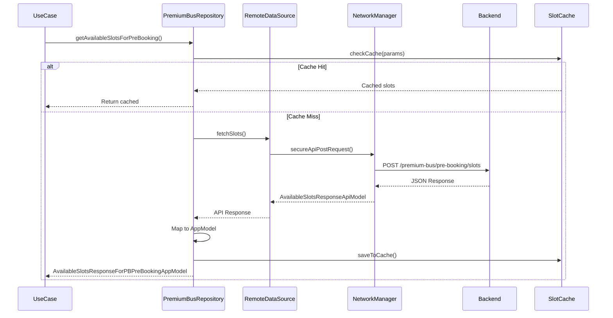
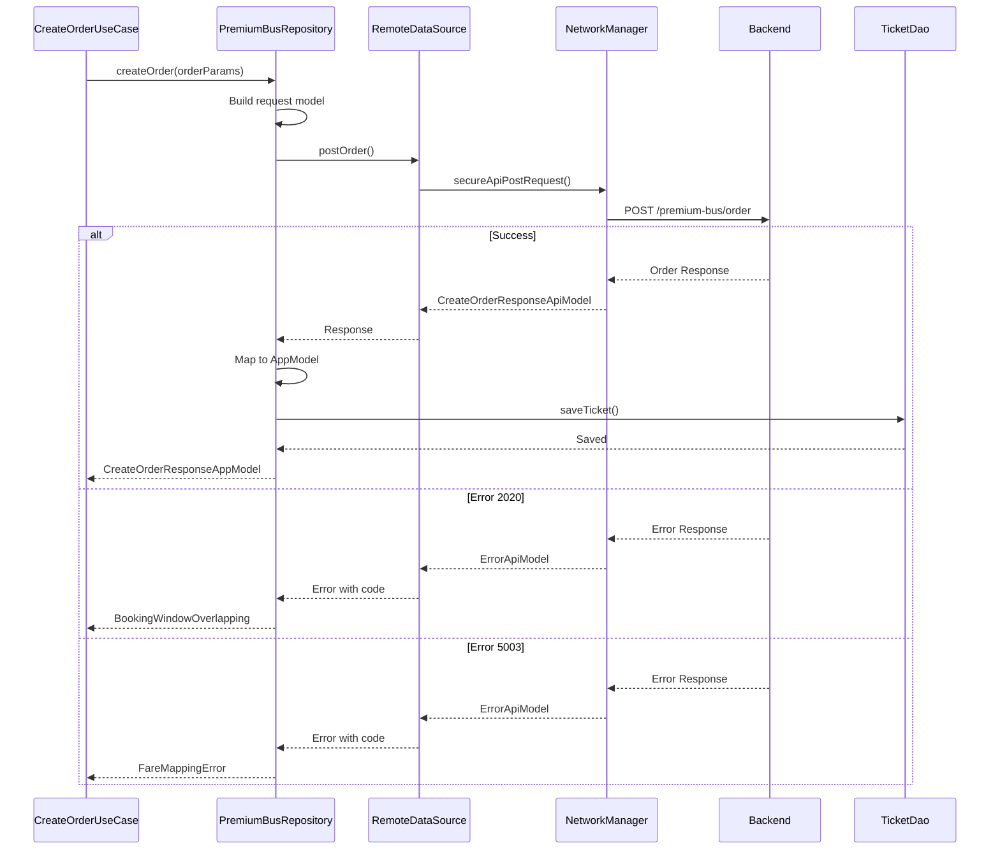
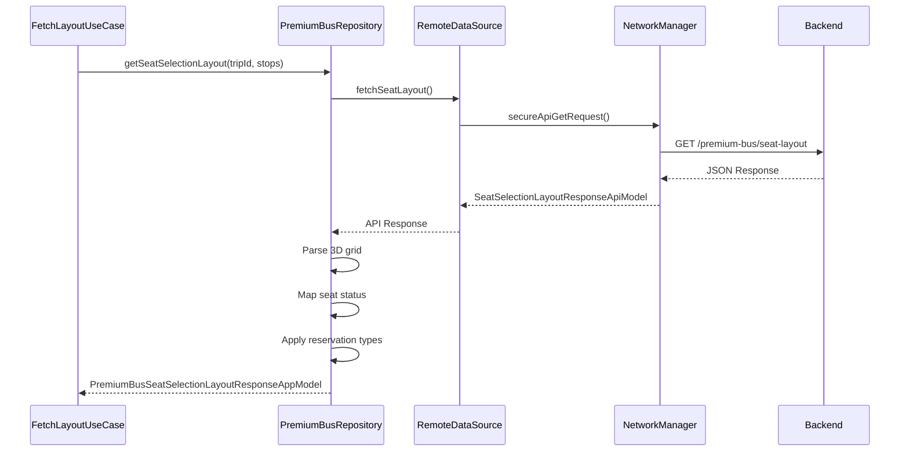
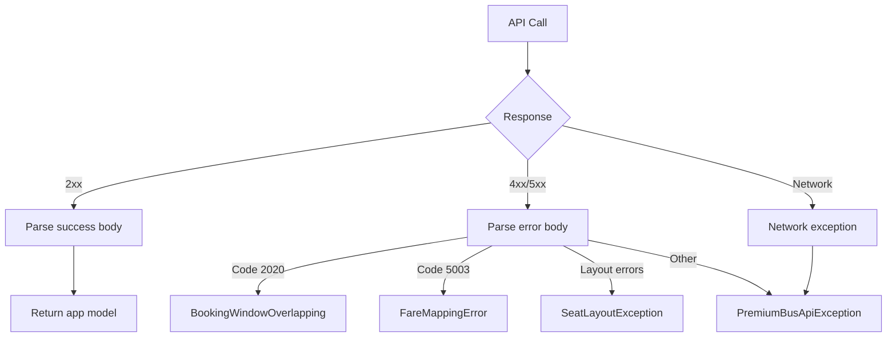

# Premium Bus Booking — Repository Documentation

## Data Layer Overview

The Premium Bus Booking data layer manages API communication for slot availability, seat layouts, and order creation. The layer uses PremiumBusRepository as the central data orchestrator, coordinating between remote data sources for API calls and local data sources for ticket persistence. The repository handles complex transformations between API models and app models while managing error mapping for booking-specific failure scenarios.

---

## Repository Interface

The `PremiumBusRepository` interface defines all premium bus booking data operations.

### Slot Operations

| Method | Purpose | Returns |
|--------|---------|---------|
| **getAvailableSlots** | Fetch slots for date range | AvailableSlotsResponseAppModel |
| **getAvailableSlotsForPreBooking** | Fetch pre-booking slots | AvailableSlotsResponseForPBPreBookingAppModel |
| **getSlotDetails** | Get single slot info | PBAvailableSlotsTripAppModel |

### Stop Operations

| Method | Purpose | Returns |
|--------|---------|---------|
| **getODPairsForLocations** | Get origin-destination pairs | List<PBOriginDestinationAppModel> |
| **getNearbyStops** | Find stops near location | List<StopAppModel> |
| **getRouteSuggestions** | Get alternative routes | List<RouteSuggestionAppModel> |

### Seat Operations

| Method | Purpose | Returns |
|--------|---------|---------|
| **getSeatSelectionLayout** | Fetch seat grid | PremiumBusSeatSelectionLayoutResponseAppModel |
| **changeSeat** | Process seat change | Boolean |
| **validateSeatAvailability** | Check seat status | SeatAvailabilityResult |

### Order Operations

| Method | Purpose | Returns |
|--------|---------|---------|
| **createOrder** | Create booking order | CreateOrderResponseAppModel |
| **createBulkOrder** | Create bulk pre-booking | BulkPreBookResponseAppModel |
| **cancelOrder** | Cancel existing order | Boolean |

### Ticket Operations

| Method | Purpose | Returns |
|--------|---------|---------|
| **getTicketById** | Fetch single ticket | PremiumReserveTicketAppModel? |
| **getAllTickets** | Fetch all user tickets | List<PremiumReserveTicketAppModel> |
| **updateTicketStatus** | Update ticket state | Unit |
| **saveTicket** | Persist ticket locally | Unit |
| **deleteTicket** | Remove ticket | Unit |
| **getTicketReceipt** | Fetch receipt URL | String? |

---

## API Endpoints

### Get Available Slots

Fetches available departure slots for a route and date.

| Property | Value |
|----------|-------|
| **Endpoint** | GET /premium-bus/available-slots |
| **Auth** | Required |

**Query Parameters**

| Parameter | Type | Description |
|-----------|------|-------------|
| **routeId** | String | Route identifier |
| **fromStopId** | String | Origin stop ID |
| **toStopId** | String | Destination stop ID |
| **date** | String | Query date (YYYY-MM-DD) |
| **cityId** | String | City identifier |

**Response: AvailableSlotsResponseApiModel**

| Field | Type | Description |
|-------|------|-------------|
| **slots** | List<PBAvailableSlotsTripApiModel> | Available slots |
| **totalSlots** | Int | Total count |

---

### Get Available Slots for Pre-Booking

Fetches slots for bulk pre-booking across date range.

| Property | Value |
|----------|-------|
| **Endpoint** | POST /premium-bus/pre-booking/slots |
| **Auth** | Required |

**Request Body: PreBookingSlotsRequestApiModel**

| Field | Type | Description |
|-------|------|-------------|
| **passId** | String | Pass identifier |
| **routeIds** | List<String> | Route identifiers |
| **fromStopId** | String | Origin stop ID |
| **toStopId** | String | Destination stop ID |
| **startDate** | String | Range start (YYYY-MM-DD) |
| **endDate** | String | Range end (YYYY-MM-DD) |
| **weekdays** | List<Int> | Day codes (1-7) |

**Response: AvailableSlotsResponseForPBPreBookingApiModel**

| Field | Type | Description |
|-------|------|-------------|
| **slotsByDate** | Map<String, List<SlotApiModel>> | Slots grouped by date |
| **routeDetails** | List<RouteDetailsApiModel> | Route information |

---

### Get OD Pairs for Locations

Fetches origin-destination stop pairs near user locations.

| Property | Value |
|----------|-------|
| **Endpoint** | GET /premium-bus/od-pairs |
| **Auth** | Required |

**Query Parameters**

| Parameter | Type | Description |
|-----------|------|-------------|
| **fromLat** | Double | Origin latitude |
| **fromLng** | Double | Origin longitude |
| **toLat** | Double | Destination latitude |
| **toLng** | Double | Destination longitude |
| **maxFare** | Long | Maximum fare filter |
| **cityId** | String | City identifier |

**Response: ODPairsResponseApiModel**

| Field | Type | Description |
|-------|------|-------------|
| **odPairs** | List<PBOriginDestinationApiModel> | Available pairs |

---

### Get Seat Selection Layout

Fetches the seat grid layout for a specific trip.

| Property | Value |
|----------|-------|
| **Endpoint** | GET /premium-bus/seat-layout |
| **Auth** | Required |

**Query Parameters**

| Parameter | Type | Description |
|-----------|------|-------------|
| **tripId** | String | Trip identifier |
| **fromStopId** | String | Origin stop ID |
| **toStopId** | String | Destination stop ID |

**Response: SeatSelectionLayoutResponseApiModel**

| Field | Type | Description |
|-------|------|-------------|
| **seats** | List<List<SeatInfoApiModel>> | 3D seat grid |
| **totalSeats** | Int | Total seats |
| **availableSeats** | Int | Available count |
| **vehicleType** | String | Vehicle configuration |

---

### Create Order

Creates a booking order for premium bus tickets.

| Property | Value |
|----------|-------|
| **Endpoint** | POST /premium-bus/order |
| **Auth** | Required |

**Request Body: CreateOrderRequestApiModel**

| Field | Type | Description |
|-------|------|-------------|
| **tripId** | String | Trip identifier |
| **configId** | String | Configuration ID |
| **amount** | Long | Fare amount |
| **fromStopId** | String | Origin stop |
| **toStopId** | String | Destination stop |
| **seats** | List<SeatRequestApiModel> | Selected seats |
| **passengers** | List<PassengerApiModel> | Passenger info |
| **passId** | String? | Pass ID if used |

**Response: CreateOrderResponseApiModel**

| Field | Type | Description |
|-------|------|-------------|
| **orderId** | String | Created order ID |
| **transactionId** | String | Payment transaction ID |
| **amount** | Long | Final amount |
| **bookingInfo** | BookingInfoApiModel | Booking details |

---

### Create Bulk Pre-Booking Order

Creates bulk booking for multiple trips.

| Property | Value |
|----------|-------|
| **Endpoint** | POST /premium-bus/pre-booking/order |
| **Auth** | Required |

**Request Body: BulkPreBookRequestApiModel**

| Field | Type | Description |
|-------|------|-------------|
| **passId** | String | Pass identifier |
| **configId** | String | Configuration ID |
| **trips** | List<TripDetailsApiModel> | Trip configurations |
| **totalAmount** | Long | Combined fare |
| **dateRange** | DateRangeApiModel | Booking dates |
| **weekdays** | List<Int> | Selected days |

**Response: BulkPreBookResponseApiModel**

| Field | Type | Description |
|-------|------|-------------|
| **orderId** | String | Bulk order ID |
| **bookings** | List<BookingApiModel> | Individual bookings |
| **totalAmount** | Long | Total charged |

---

### Change Seat

Processes seat change request for existing booking.

| Property | Value |
|----------|-------|
| **Endpoint** | POST /premium-bus/change-seat |
| **Auth** | Required |

**Request Body: ChangeSeatRequestApiModel**

| Field | Type | Description |
|-------|------|-------------|
| **bookingId** | String | Existing booking ID |
| **newSeats** | List<SeatRequestApiModel> | New seat selection |

**Response: ChangeSeatResponseApiModel**

| Field | Type | Description |
|-------|------|-------------|
| **success** | Boolean | Operation status |
| **updatedBooking** | BookingApiModel? | Updated booking |

---

### Get Ticket Receipt

Fetches receipt URL for a completed booking.

| Property | Value |
|----------|-------|
| **Endpoint** | GET /premium-bus/receipt/{bookingId} |
| **Auth** | Required |

**Response: ReceiptResponseApiModel**

| Field | Type | Description |
|-------|------|-------------|
| **receiptUrl** | String | PDF receipt URL |
| **generatedAt** | Long | Generation timestamp |

---

## Data Flow Diagrams

### Slot Fetching Flow

### Order Creation Flow

### Seat Layout Fetching Flow

---

## Data Transformation

### Slot Response Mapping

| API Field | App Field | Transform |
|-----------|-----------|-----------|
| tripId | tripId | Direct |
| routeId | routeId | Direct |
| routeName | routeName | Direct |
| fromStopId | fromStopId | Direct |
| toStopId | toStopId | Direct |
| fromStopTime | fromStopTime | Long timestamp |
| toStopTime | toStopTime | Long timestamp |
| vehicleCapacity | vehicleCapacity | Int |
| availableSeats | availableSeats | Int |
| vehicleNumber | vehicleNumber | Direct |
| seatAssignmentType | seatAssignmentType | Enum (0=RANDOM, 1=UNIQUE, 2=SELECTION) |
| slotStatus | slotStatus | Enum mapping |
| arrivalStatus | slotArrivalStatus | Enum (EARLY, ON_TIME, DELAY) |
| multiSeatAllowed | multiSeatAllowed | Boolean |
| rules | applicableRules | List<ApplicableRuleAppModel> |

### Seat Info Mapping

| API Field | App Field | Transform |
|-----------|-----------|-----------|
| seatId | seatId | Int |
| seatNumber | seatNumber | Direct |
| seatType | seatType | Enum (WINDOW, AISLE, etc.) |
| status | status | Enum (AVAILABLE, UNAVAILABLE) |
| reservationType | reservationType | Enum (GENERAL, FEMALE) |
| x | x | Int coordinate |
| y | y | Int coordinate |
| z | z | Int coordinate (deck) |
| isSelected | isSelectedByUser | Boolean |

### Order Response Mapping

| API Field | App Field | Transform |
|-----------|-----------|-----------|
| orderId | orderId | Direct |
| transactionId | transactionId | Direct |
| amount | amount | Long |
| bookingInfo.bookingId | bookingProperties.bookingId | Direct |
| bookingInfo.bookingTime | bookingProperties.bookingTime | Long |
| bookingInfo.status | bookingProperties.ticketStatus | Enum |
| bookingInfo.seats | bookingProperties.seats | List<SeatInfoAppModel> |

---

## Exception Handling

### Exception Flow

### Exception Types

| Exception | When Thrown |
|-----------|-------------|
| **BookingWindowOverlapping** | Order conflicts with existing booking (2020) |
| **FareMappingError** | Fare calculation mismatch (5003) |
| **SeatLayoutNotFoundException** | No layout for trip |
| **InvalidCityException** | City configuration mismatch |
| **SeatAssignmentFailedException** | Seat change failed |
| **PremiumBusApiException** | Generic API error |
| **NetworkException** | Network connectivity failure |

### Error Code Mapping

| API Code | Exception Type | User Message |
|----------|----------------|--------------|
| **2020** | BookingWindowOverlapping | "This booking conflicts with an existing trip" |
| **5003** | FareMappingError | "Fare has changed. New fare: ₹X" |
| **404** | SeatLayoutNotFoundException | "Seat layout not available for this trip" |
| **400** | InvalidCityException | "Invalid city configuration" |
| **409** | SeatAssignmentFailedException | "Selected seat is no longer available" |
| **500** | PremiumBusApiException | "Something went wrong. Please try again" |

---

## Local Storage

### Database Entities

**PremiumBusTicketEntity**

| Field | Type | Description |
|-------|------|-------------|
| **bookingId** | String (PK) | Booking identifier |
| **tripId** | String | Trip identifier |
| **routeId** | String | Route identifier |
| **routeName** | String | Route display name |
| **fromStopId** | String | Origin stop |
| **toStopId** | String | Destination stop |
| **fromStopName** | String | Origin name |
| **toStopName** | String | Destination name |
| **fromStopTime** | Long | Departure timestamp |
| **toStopTime** | Long | Arrival timestamp |
| **configurationId** | String | Configuration ID |
| **ticketStatus** | String | Status enum value |
| **seats** | String | JSON serialized seats |
| **amount** | Long | Fare amount |
| **bookingTime** | Long | Booking timestamp |
| **qrCode** | String? | QR code data |
| **validationStartTime** | Long? | Validation window start |
| **expiryTime** | Long? | Ticket expiry |
| **passId** | String? | Pass ID if used |

### DAO Operations

| Method | Purpose |
|--------|---------|
| **insert** | Save new ticket |
| **update** | Update existing ticket |
| **delete** | Remove ticket |
| **getById** | Fetch by booking ID |
| **getAll** | Fetch all tickets |
| **getByStatus** | Filter by status |
| **getUpcoming** | Get future tickets |
| **deleteExpired** | Clean expired tickets |

### Slot Cache

Temporary caching for slot availability to reduce API calls during slot selection flow.

| Property | Description |
|----------|-------------|
| **Cache Duration** | 5 minutes |
| **Cache Key** | passId + routeIds + dateRange |
| **Invalidation** | On order creation, manual refresh |

---

## Dependency Injection

### Module Bindings

| Interface | Implementation |
|-----------|----------------|
| PremiumBusRepository | PremiumBusRepositoryImpl |
| PremiumBusRemoteDataSource | PremiumBusRemoteDataSourceImpl |
| PremiumBusLocalDataSource | PremiumBusLocalDataSourceImpl |
| SlotCacheDataSource | SlotCacheDataSourceImpl |

### Repository Dependencies

**PremiumBusRepositoryImpl**

| Dependency | Purpose |
|------------|---------|
| PremiumBusTicketDao | Local ticket storage |
| PremiumBusRemoteDataSource | Slot and seat APIs |
| ODPairsRemoteDataSource | OD pair queries |
| SlotCacheDataSource | Slot caching |
| Data mappers | Model transformation |

---

## Network Configuration

### Headers

All premium bus API calls include:

| Header | Value |
|--------|-------|
| Authorization | Bearer {token} |
| Content-Type | application/json |
| X-Platform | android/ios |
| X-App-Version | {version} |
| X-City-Id | {cityId} |

### Timeouts

| Operation | Timeout |
|-----------|---------|
| Slot fetch | 30s |
| Seat layout | 15s |
| Order creation | 60s |
| Bulk order | 90s |
| Receipt fetch | 15s |

### Retry Policy

| Scenario | Retry |
|----------|-------|
| Network timeout | 2 retries |
| 5xx errors | 1 retry |
| 4xx errors | No retry |
| Seat conflicts | No retry (refresh required) |

---

## Data Sync Strategy

### Ticket Sync

Tickets are synced from server on specific triggers:

| Trigger | Action |
|---------|--------|
| **App launch** | Fetch all active tickets |
| **Order completion** | Save new ticket locally |
| **Pull refresh** | Re-fetch from server |
| **Ticket validation** | Update local status |

### Conflict Resolution

| Conflict | Resolution |
|----------|------------|
| **Local newer** | Keep local (pending sync) |
| **Server newer** | Update local |
| **Status mismatch** | Server wins |
| **Missing locally** | Fetch from server |

---

## Error Recovery

### Seat Conflict Recovery

When seat assignment fails due to concurrent booking:

1. Return specific error to UI
2. Trigger seat layout refresh
3. Display updated availability
4. User re-selects from fresh data

### Order Failure Recovery

When order creation fails:

1. Parse error code for specific handling
2. Display appropriate message
3. For fare mismatch: show new fare, allow retry
4. For conflicts: navigate back to slot selection
5. For generic errors: show retry option

### Network Failure Recovery

When network calls fail:

1. Check connectivity status
2. If offline: show offline message
3. If online: retry with exponential backoff
4. Cache last successful response for slot queries
5. Allow offline viewing of existing tickets
