# Premium Bus Booking — UseCase Documentation

## Domain Layer Overview

The Premium Bus Booking domain layer orchestrates the complex booking flow through specialized use cases. The layer handles slot availability queries, seat layout fetching, seat change processing, and order creation. Use cases coordinate between the presentation layer and data repositories while enforcing business rules for seat selection, gender validation, and booking window constraints.

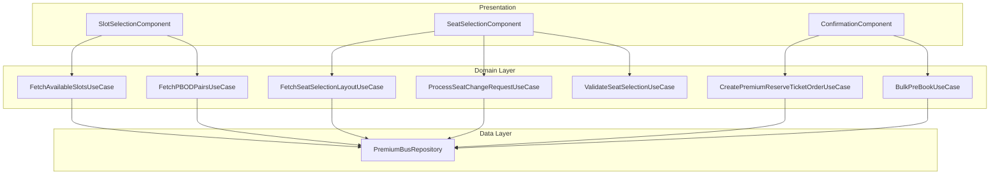

---

## UseCase Inventory

| UseCase | Layer | Purpose |
|---------|-------|---------|
| **FetchAvailableSlotsForPreBookingUseCase** | Domain | Fetch available departure slots |
| **FetchPBODPairsForGivenLocationsUseCase** | Domain | Get origin-destination stop pairs |
| **FetchSeatSelectionLayoutUseCase** | Domain | Retrieve seat grid layout |
| **ProcessSeatChangeRequestUseCase** | Domain | Handle seat change requests |
| **CreatePremiumReserveTicketOrderUseCase** | Domain | Create booking order |
| **BulkPreBookUseCase** | Domain | Create bulk pre-booking |
| **ValidateSeatSelectionUseCase** | Domain | Validate seat selection rules |
| **CalculatePremiumBusFareUseCase** | Domain | Calculate total fare |

---

## FetchAvailableSlotsForPreBookingUseCase

Fetches available departure slots for premium bus trips within a date range and weekday selection.

### Responsibility

Retrieves available slots from the repository based on pass configuration, route information, and user-selected dates. Applies filtering for weekday selection and validates slot availability status.

### Flow Diagram

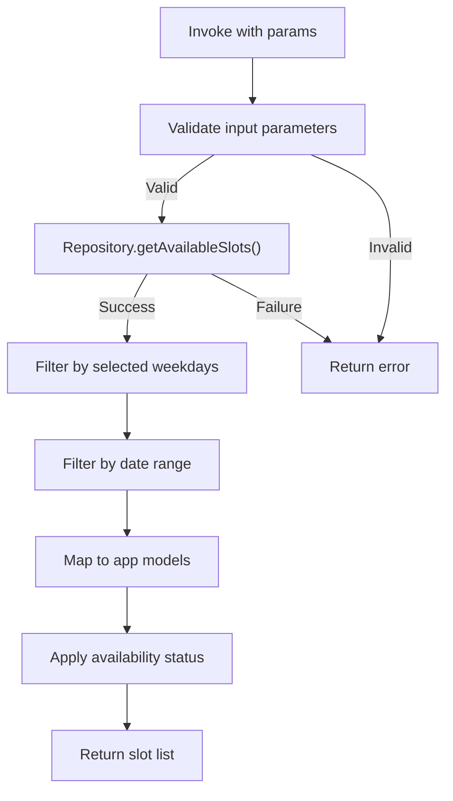

### Input Parameters

| Parameter | Type | Description |
|-----------|------|-------------|
| **passId** | String | Pass identifier for the booking |
| **routeIds** | List<String> | Route identifiers to query |
| **fromStopId** | String | Origin stop identifier |
| **toStopId** | String | Destination stop identifier |
| **startDate** | LocalDate | Booking date range start |
| **endDate** | LocalDate | Booking date range end |
| **weekdays** | List<Weekday> | Selected days of week |

### Output

| Type | Description |
|------|-------------|
| **AvailableSlotsResponseForPBPreBookingAppModel** | Slot list with availability |

### Error Handling

| Error Type | Cause | Handling |
|------------|-------|----------|
| **NoSlotsAvailable** | No slots match criteria | Return empty result |
| **CityNotFound** | Invalid city in route | Return configuration error |
| **ServerError** | API failure | Propagate with message |
| **ParseException** | Response parsing failed | Return parse error |

---

## FetchPBODPairsForGivenLocationsUseCase

Retrieves origin-destination stop pairs for given source and destination locations with fare constraints.

### Responsibility

Queries available stop pairs near the user's selected locations. Applies fare filtering based on maximum allowed fare per trip and returns sorted results by proximity.

### Flow Diagram

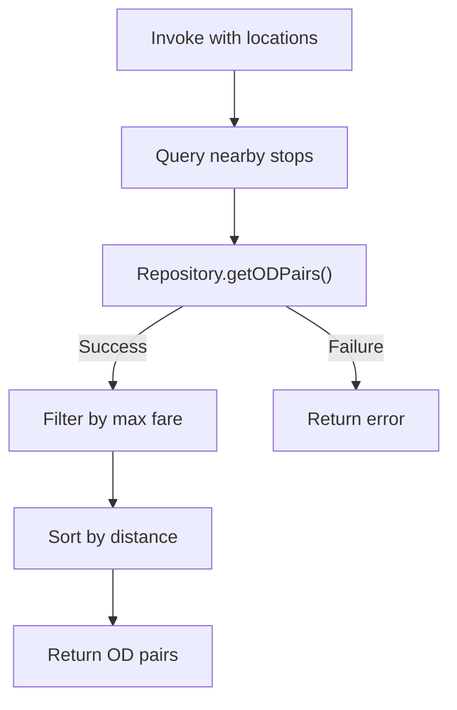

### Input Parameters

| Parameter | Type | Description |
|-----------|------|-------------|
| **fromLocation** | Location | User's origin location |
| **toLocation** | Location | User's destination location |
| **maxFarePerTrip** | Long | Maximum fare filter |
| **cityId** | String | City identifier |

### Output

| Type | Description |
|------|-------------|
| **List<PBOriginDestinationAppModel>** | Available stop pairs |

### Error Handling

| Error Type | Cause | Handling |
|------------|-------|----------|
| **NoStopPointsAvailable** | No stops near locations | Return empty list |
| **ServerError** | API failure | Propagate error |

---

## FetchSeatSelectionLayoutUseCase

Retrieves the seat grid layout for a specific trip including seat availability and reservation types.

### Responsibility

Fetches the 3D seat layout from the repository for the specified trip and stop pair. Returns seat information including position, status, type, and reservation category for rendering the interactive seat grid.

### Flow Diagram

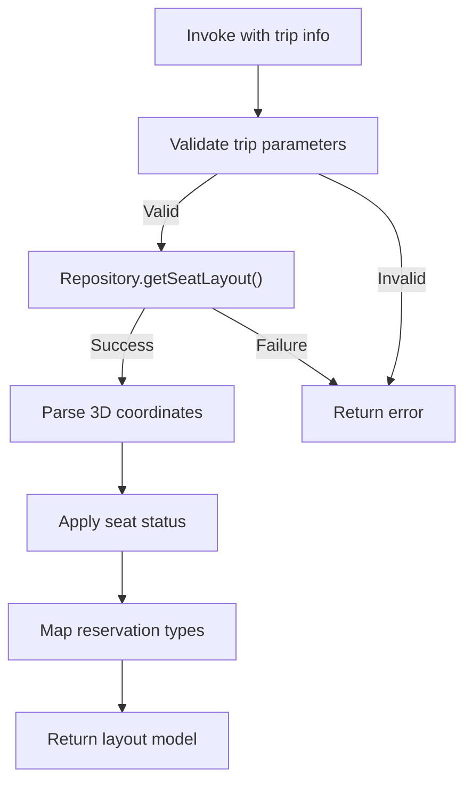

### Input Parameters

| Parameter | Type | Description |
|-----------|------|-------------|
| **tripId** | String | Trip identifier |
| **fromStopId** | String | Origin stop identifier |
| **toStopId** | String | Destination stop identifier |

### Output

| Type | Description |
|------|-------------|
| **PremiumBusSeatSelectionLayoutResponseAppModel** | Seat grid with status |

### Seat Layout Response Fields

| Field | Type | Description |
|-------|------|-------------|
| **seats** | List<List<SeatInfoAppModel>> | 3D seat grid |
| **totalSeats** | Int | Total seat count |
| **availableSeats** | Int | Available seat count |
| **vehicleType** | String | Vehicle configuration |

### Error Handling

| Error Type | Cause | Handling |
|------------|-------|----------|
| **NO_LAYOUT_FOUND** | No layout for trip | Return not found error |
| **INVALID_CITY** | City mismatch | Return configuration error |
| **SERVER_ERROR** | API failure | Propagate with message |

---

## ProcessSeatChangeRequestUseCase

Handles seat change requests for existing bookings.

### Responsibility

Validates the seat change request, checks seat availability, and processes the change through the repository. Ensures the new seat selection is valid and updates the booking record.

### Flow Diagram

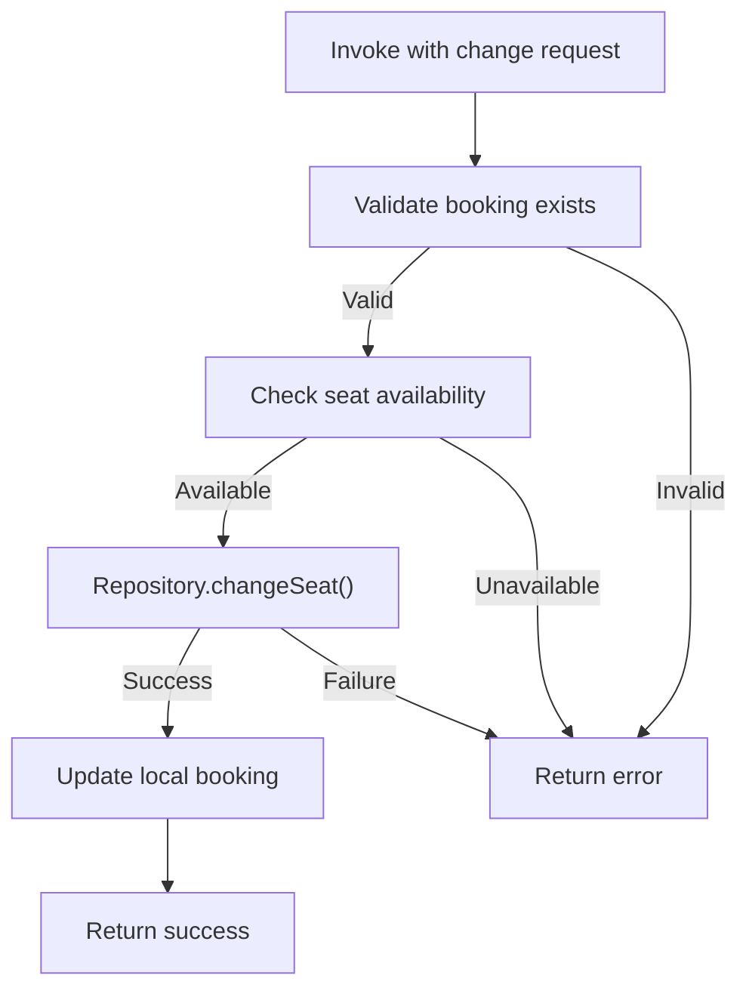

### Input Parameters

| Parameter | Type | Description |
|-----------|------|-------------|
| **bookingId** | String | Existing booking identifier |
| **newSeats** | List<SeatInfoAppModel> | New seat selection |

### Output

| Type | Description |
|------|-------------|
| **Boolean** | Success status |

### Error Handling

| Error Type | Cause | Handling |
|------------|-------|----------|
| **SEAT_ASSIGNMENT_FAILED** | Seat already taken | Return conflict error |
| **BOOKING_NOT_FOUND** | Invalid booking ID | Return not found |
| **SERVER_ERROR** | API failure | Propagate error |

---

## CreatePremiumReserveTicketOrderUseCase

Creates a booking order for premium bus tickets.

### Responsibility

Orchestrates the order creation process including fare validation, seat reservation, and payment order generation. Handles multiple flow types including fresh purchase, pass-based booking, and reschedules.

### Flow Diagram

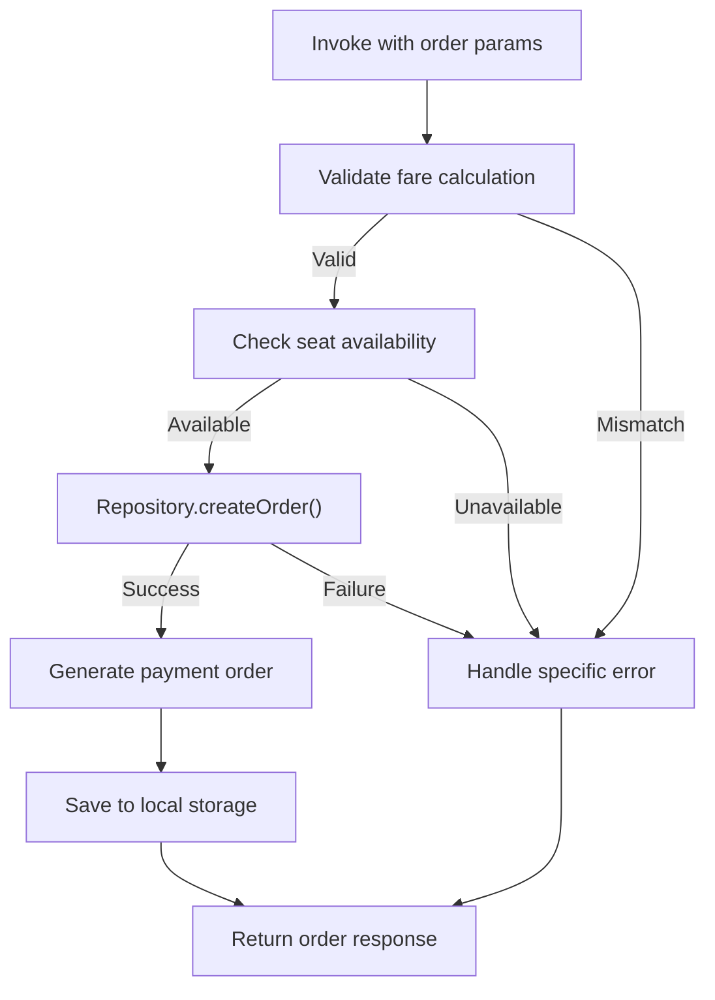

### Input Parameters

| Parameter | Type | Description |
|-----------|------|-------------|
| **tripId** | String | Trip identifier |
| **configId** | String | Configuration identifier |
| **amount** | Long | Calculated fare amount |
| **trips** | List<TripDetails> | Trip details list |
| **passengers** | List<PassengerDetails> | Passenger information |
| **seats** | List<SeatInfoAppModel> | Selected seats |
| **passId** | String? | Pass ID if pass-based |

### Output

| Type | Description |
|------|-------------|
| **CreateOrderResponseAppModel** | Order creation response |

### Order Response Fields

| Field | Type | Description |
|-------|------|-------------|
| **orderId** | String | Created order identifier |
| **transactionId** | String | Payment transaction ID |
| **amount** | Long | Final amount |
| **bookingInfo** | BookingInfo | Booking details |

### Error Handling

| Error Code | Type | Description |
|------------|------|-------------|
| **2020** | BookingWindowOverlapping | Booking conflicts with existing |
| **5003** | FareMappingError | Fare calculation mismatch |
| **Generic** | API | Network or server error |
| **Local** | Local | Local storage failure |

---

## BulkPreBookUseCase

Creates bulk pre-bookings for multiple trips across a date range.

### Responsibility

Handles the bulk booking flow where users book multiple trips with the same configuration. Validates all trips, creates a combined order, and processes the booking in a single transaction.

### Flow Diagram

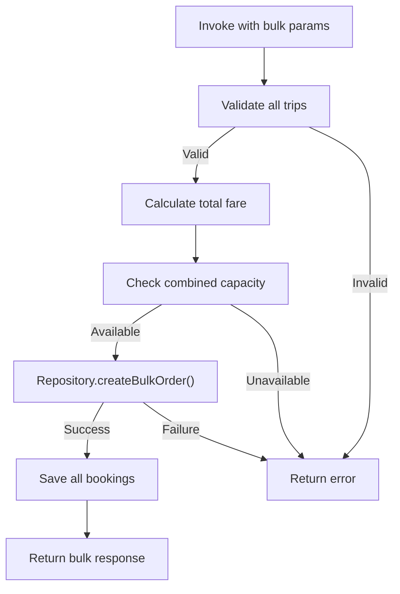

### Input Parameters

| Parameter | Type | Description |
|-----------|------|-------------|
| **passId** | String | Pass identifier |
| **configId** | String | Configuration ID |
| **tripDetails** | List<TripSlotCardUiData> | All trip configurations |
| **dateRange** | DateRange | Booking dates |
| **weekdays** | List<Weekday> | Selected weekdays |

### Output

| Type | Description |
|------|-------------|
| **BulkPreBookResponseAppModel** | Combined booking response |

---

## ValidateSeatSelectionUseCase

Validates seat selection against business rules.

### Responsibility

Enforces seat selection rules including gender reservation validation, maximum seat limits, and multi-seat configuration. Returns validation result with specific violation if any.

### Flow Diagram

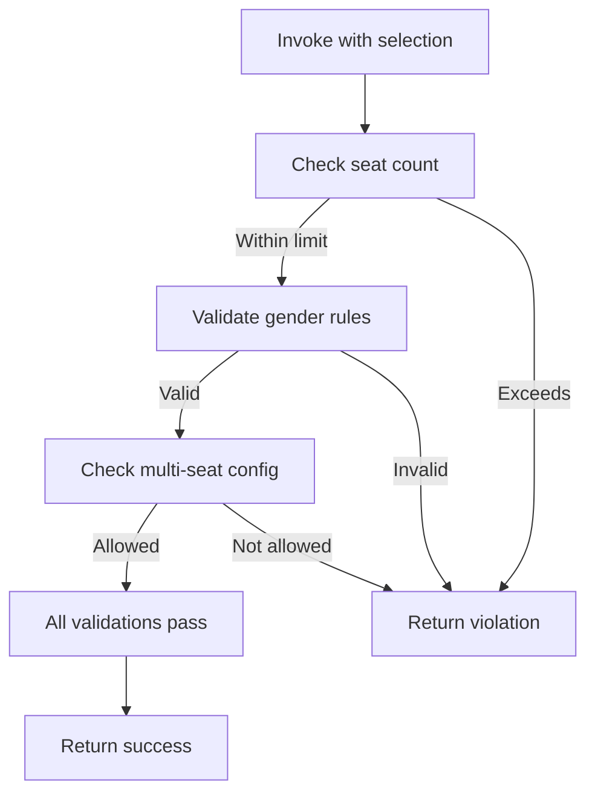

### Input Parameters

| Parameter | Type | Description |
|-----------|------|-------------|
| **selectedSeats** | List<SeatInfoAppModel> | User's selection |
| **maxAllowed** | Int | Maximum seats allowed |
| **multiSeatAllowed** | Boolean | Multi-seat configuration |
| **userGender** | Gender? | User's declared gender |

### Output

| Type | Description |
|------|-------------|
| **SeatValidationResult** | Validation success or violation |

### Validation Rules

| Rule | Check | Violation |
|------|-------|-----------|
| **MaxSeats** | selectedSeats.size <= maxAllowed | ExceedsMaximum |
| **GenderReservation** | Female seats require female user | GenderMismatch |
| **MultiSeat** | Single seat if not allowed | MultiSeatNotAllowed |
| **Availability** | All seats must be available | SeatUnavailable |

---

## Domain Models

### PBAvailableSlotsTripAppModel

| Field | Type | Description |
|-------|------|-------------|
| **tripId** | String | Trip identifier |
| **routeId** | String | Route identifier |
| **routeName** | String | Route display name |
| **fromStopId** | String | Origin stop ID |
| **toStopId** | String | Destination stop ID |
| **fromStopTime** | Long | Departure timestamp |
| **toStopTime** | Long | Arrival timestamp |
| **vehicleCapacity** | Int | Total vehicle seats |
| **availableSeats** | Int | Remaining seats |
| **vehicleNumber** | String | Vehicle identifier |
| **seatAssignmentType** | SeatAssignmentType | RANDOM, UNIQUE, SELECTION |
| **slotStatus** | SlotStatus | Availability status |
| **slotArrivalStatus** | ArrivalStatus | EARLY, ON_TIME, DELAY |
| **multiSeatAllowed** | Boolean | Multi-seat configuration |
| **applicableRules** | List<ApplicableRuleAppModel> | Booking rules |

### SeatInfoAppModel

| Field | Type | Description |
|-------|------|-------------|
| **seatId** | Int | Unique seat identifier |
| **seatNumber** | String | Display label (1A, 2B) |
| **seatType** | SeatType | WINDOW, AISLE, MIDDLE, EMPTY, DRIVER |
| **status** | SeatStatus | AVAILABLE, UNAVAILABLE |
| **reservationType** | ReservationType | GENERAL, FEMALE |
| **x** | Int | Grid X coordinate |
| **y** | Int | Grid Y coordinate |
| **z** | Int | Grid Z coordinate (deck) |
| **isSelectedByUser** | Boolean | Selection state |

### PremiumReserveTicketAppModel

| Field | Type | Description |
|-------|------|-------------|
| **bookingProperties** | BookingPropertiesAppModel | Booking metadata |
| **tripProperties** | TripPropertiesAppModel | Trip details |
| **validationProperties** | ValidationPropertiesAppModel | Ticket validation data |
| **fareAndPassengerProperties** | FarePropertiesAppModel | Fare and passenger info |

### BookingPropertiesAppModel

| Field | Type | Description |
|-------|------|-------------|
| **bookingId** | String | Unique booking ID |
| **bookingTime** | Long | Booking timestamp |
| **configurationId** | String | Configuration used |
| **ticketStatus** | PremiumReserveTicketStatus | Current status |
| **seats** | List<SeatInfoAppModel> | Assigned seats |
| **passIdUsedToPurchaseTicket** | String? | Pass ID if used |

---

## Enumerations

### SeatAssignmentType

| Value | Code | Description |
|-------|------|-------------|
| **RANDOM** | 0 | System assigns seats |
| **UNIQUE** | 1 | One seat per trip |
| **SELECTION** | 2 | User selects seats |

### SlotStatus

| Value | Description |
|-------|-------------|
| **AVAILABLE** | Can be booked |
| **SOLD_OUT** | No seats remaining |
| **FEW_SEATS_LEFT** | Low availability |
| **CURRENTLY_BOOKED_SLOT** | User's current booking |

### SeatType

| Value | Description |
|-------|-------------|
| **WINDOW** | Window position seat |
| **AISLE** | Aisle position seat |
| **MIDDLE** | Middle position seat |
| **EMPTY** | No seat (spacing) |
| **DRIVER** | Driver position |

### ReservationType

| Value | Description |
|-------|-------------|
| **GENERAL** | Open to all |
| **FEMALE** | Female passengers only |

---

## Business Rules

| Rule | Description | Enforcement |
|------|-------------|-------------|
| **Trip Sequencing** | Only first trip enabled initially | Component state |
| **Seat Limit** | Max seats per configuration | Validation use case |
| **Gender Reservation** | Female seats require confirmation | Selection use case |
| **Booking Window** | No overlapping bookings | Order creation |
| **Slot Availability** | Cannot book SOLD_OUT slots | Slot selection |
| **Fare Consistency** | Client fare must match server | Order creation |
| **Multi-seat Config** | Controlled by trip configuration | Validation use case |

---

## Sequence Diagrams

### Slot Selection Flow

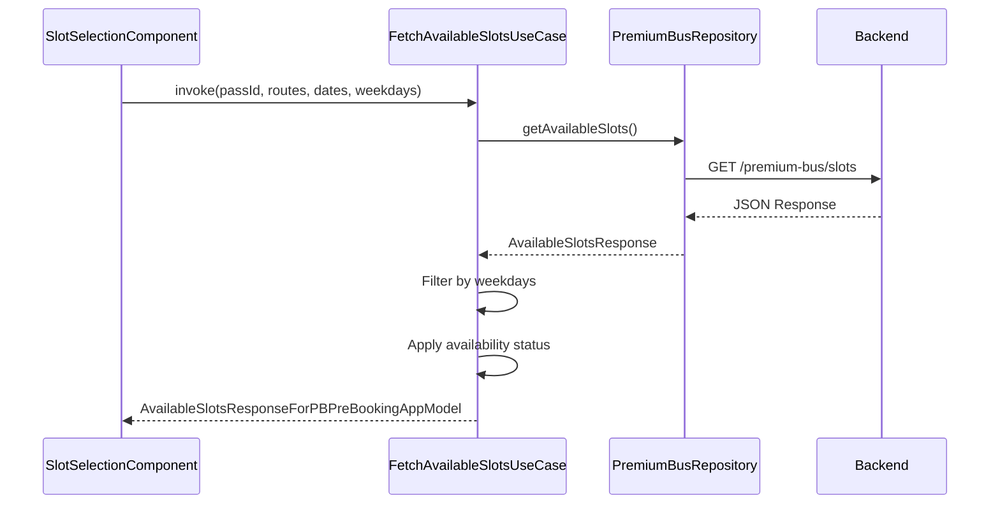

### Seat Selection Flow

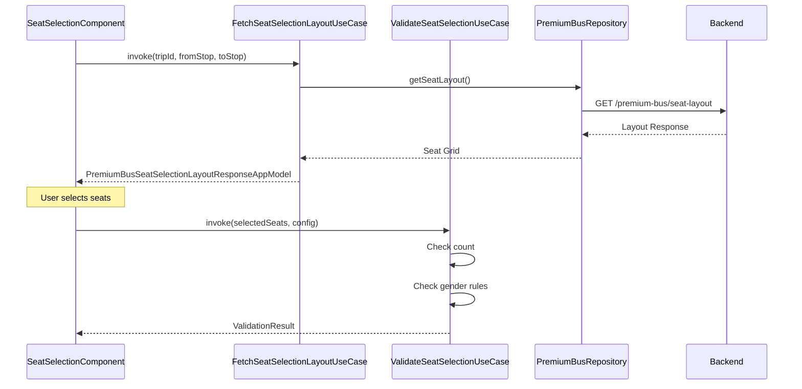

### Order Creation Flow

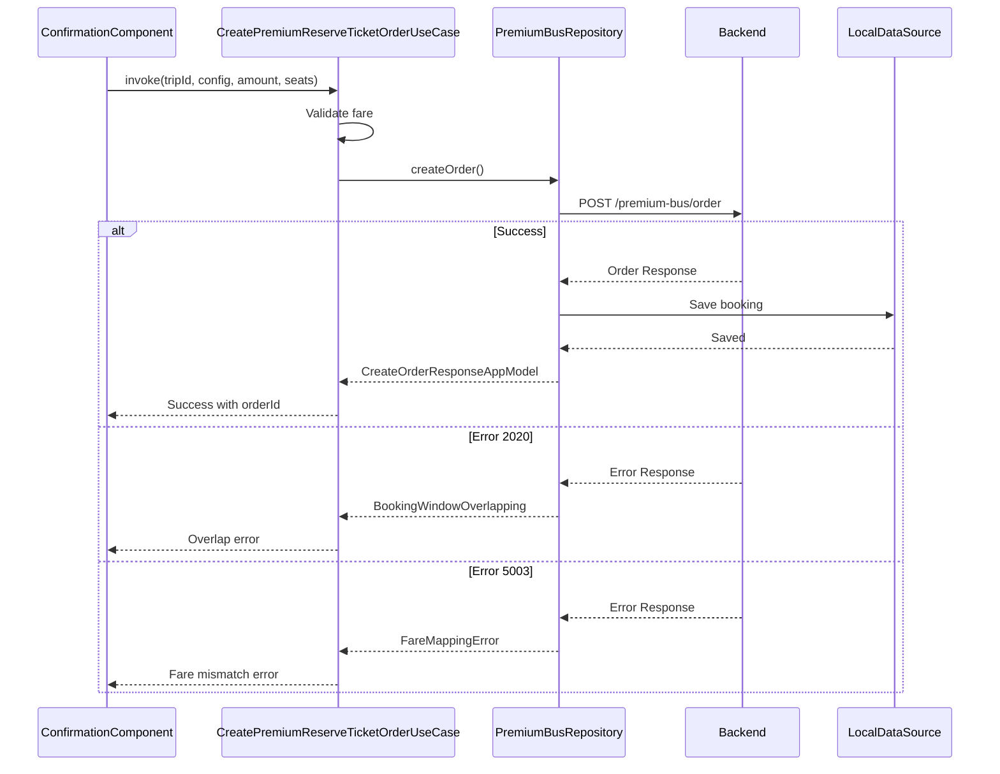

---

## Error Mapping

| API Error | Domain Exception | UI Message |
|-----------|------------------|------------|
| **2020** | BookingWindowOverlapping | "Booking conflicts with existing trip" |
| **5003** | FareMappingError | "Fare has changed. Effective fare: ₹X" |
| **404** | NO_LAYOUT_FOUND | "Seat layout not available" |
| **400** | INVALID_CITY | "Invalid city configuration" |
| **500** | SERVER_ERROR | "Something went wrong. Please retry" |
| **Network** | NetworkException | "Check your connection" |
