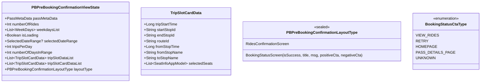

# Premium Bus Bulk Booking - Component Architecture

This document describes the UI components that power the Premium Bus Bulk Booking feature, which enables SuperPass holders to pre-book multiple rides across a date range with specific weekday and time slot selections.

## Architecture Overview

The bulk booking feature spans two KMP shared modules following the MVI (Model-View-Intent) architecture pattern with Decompose for lifecycle management. Each component extends `ChaloBaseStateMviComponent`, managing its own view state through intent processing and orchestrating domain use cases.


## Screen Inventory

| Screen | Component | Module | Purpose |
|--------|-----------|--------|---------|
| Ride Details | PbBulkBookingRideDetailsComponent | home | View booked rides, manage pass, initiate bookings |
| Pre-Booking Details | PBPreBookingDetailsComponent | productbooking | Configure date range, weekdays, trips per day |
| Slot Selection | PBPreBookingSlotSelectionComponent | productbooking | Select O-D pairs and time slots for each trip |
| Rides Confirmation | PBPreBookingConfirmationComponent | productbooking | Review and submit bulk booking request |

---

## PbBulkBookingRideDetailsComponent

The primary entry point for managing rides booked through a SuperPass. This component orchestrates the complete lifecycle of pass-based ride management including viewing tickets categorized as upcoming or past, initiating new bookings, and modifying pass start dates.

### Source Location

```
shared/home/src/commonMain/kotlin/app/chalo/premiumbus/bulkbookingridedetails/ui/
├── PbBulkBookingRideDetailsComponent.kt
├── PbBulkBookingRideDetailsViewState.kt
└── PbBulkBookingRideDetailsScreen.kt
```

### Component Dependencies

| Dependency | Type | Purpose |
|------------|------|---------|
| FetchFailedAndUnderProcessBookingsAndUpdateAllBookingsInDBUseCase | Domain | Sync remote tickets to local DB |
| FetchAllPremiumReserveTicketsBookedThroughPassUseCase | Domain | Stream all tickets for pass |
| UpdatePassStartDateChangesUseCase | Domain | Modify pass validity period |
| CheckIfContinueWithBulkBookingFlowUseCase | Domain | Validate booking eligibility |
| SuperPassDataWrapper | Data | Access SuperPass properties |
| ActivePremiumBusTicketsHelper | Helper | Polling for active ticket ETAs |
| ChaloNavigationManager | Navigation | Screen transitions |
| AnalyticsContract | Analytics | Event tracking |

### View State Structure

The component maintains comprehensive state encompassing pass details, ride categorization, and UI configuration.


### Intent Processing Flow


### Key Intents

| Intent | Trigger | Handler |
|--------|---------|---------|
| ViewCreatedIntent | Screen load | Initialize state, fetch tickets |
| BookSingleRideClickIntent | Single ride CTA | Navigate to single booking flow |
| BookMultipleRideClickIntent | Multiple rides CTA | Validate eligibility, navigate to pre-booking |
| DateChangeOptionClickIntent | Change date CTA | Show date picker dialog |
| PassDateChangeConfirmationDialog | Date selected | Call UpdatePassStartDateChangesUseCase |
| OnRidesCardCtaClickIntent | Ride card tap | Navigate to tracking or details |
| BookAgainClickedIntent | Book again CTA | Pre-fill booking with previous route |

### Active Ticket Polling

The component implements real-time polling for active rides using `ActivePremiumBusTicketsHelper`. This maintains live ETA updates for up to three concurrent active tickets.


The polling system uses mutex locks (`pollingActiveTicketMutex`, `pbActiveBookingsPollingMutex`, `clearResourcesMutex`) to ensure thread-safe updates across concurrent coroutines. The `activeCardBufferCardList` serves as a buffer that the polling job reads from every second to emit updated state.

### Dialog Types

| Dialog | Trigger | Purpose |
|--------|---------|---------|
| ChaloDatePicker | Date change banner tap | Select new pass start date |
| PassDateChangeConfirmationDialog | Date selected | Confirm validity change |
| PassDateChangeFailureDialog | API error | Show error with retry option |
| ChaloConfirmationDialog | Product disabled | Inform user of disabled product |

---

## PBPreBookingDetailsComponent

Configures bulk booking parameters including date range, weekday selection, and trips per day. Validates selections against pass ride balance before proceeding to slot selection.

### Source Location

```
shared/productbooking/src/commonMain/kotlin/app/chalo/premiumbus/ui/pbprebooking/bookingdetails/
├── PBPreBookingDetailsComponent.kt
└── PBPreBookingDetailsContract.kt
```

### Component Dependencies

| Dependency | Type | Purpose |
|------------|------|---------|
| FetchPBODPairsForGivenLocationsUseCase | Domain | Validate O-D pair availability |
| SuperPassDataWrapper | Data | Pass validation and trip preferences |
| TimeUtilsContract | Utility | Timezone handling |
| StringProvider | Utility | Localized strings |
| ChaloNavigationManager | Navigation | Screen transitions |
| AnalyticsContract | Analytics | Event tracking |

### View State Structure


### Proceed Button Validation Flow

The component implements sophisticated validation before enabling the proceed action.


### Key Intents

| Intent | Purpose |
|--------|---------|
| ViewCreatedIntent(passId, passSubType) | Initialize with pass data |
| SelectedNumberOfTripIntent(tripsPerDay) | Set 1 or 2 trips per day |
| DayItemClicked(day) | Toggle weekday selection |
| ChangeDatesClickedIntent | Open date range picker |
| UpdateSelectedDateIntent(start, end) | Update selected dates |
| ProceedButtonClickedIntent(isComingFromDialog) | Validate and navigate forward |
| DismissDialogIntent | Close error dialog |
| ConfirmationDialogPositiveBtnClicked | Handle dialog confirmation |

### Error Dialog Types

| Dialog Action Type | Trigger | Actions |
|-------------------|---------|---------|
| DATE_RANGE_INVALID | Zero total trips calculated | Dismiss |
| ZERO_CURRENT_BALANCE | Pass balance is zero | Navigate to pass details |
| RIDE_BALANCE_INSUFFICIENT | Balance less than required trips | Continue with available, Change Dates |

---

## PBPreBookingSlotSelectionComponent

The most complex component in the flow, managing multi-trip slot selection with support for O-D pair selection, time slot selection, and optional seat selection per trip. This component coordinates the configuration of multiple trip cards sequentially.

### Source Location

```
shared/productbooking/src/commonMain/kotlin/app/chalo/premiumbus/ui/pbprebooking/slotselection/
├── PBPreBookingSlotSelectionComponent.kt
└── PBPreBookingSlotSelectionContract.kt
```

### Component Dependencies

| Dependency | Type | Purpose |
|------------|------|---------|
| FetchPBODPairsForGivenLocationsUseCase | Domain | O-D pair options |
| FetchAvailableSlotsForPreBookingUseCase | Domain | Time slot availability |
| SeatSelectionResultStateManager | State | Seat selection coordination |
| UniversalSearchResultStateManager | State | Stop search coordination |
| GetPremiumBusCurrentCityConfigUseCase | Domain | City configuration |
| TimeUtilsContract | Utility | Timezone handling |
| BasicInfoContract | Utility | True time access |
| ChaloNavigationManager | Navigation | Screen transitions |
| AnalyticsContract | Analytics | Event tracking |

### View State Structure


### Trip Card Initialization

On component creation, trip cards are initialized based on `tripsPerDay`. The first trip is pre-filled with saved trip preferences if available, while subsequent trips start empty.


### Bottom Sheet Types

| Type | Purpose | Key Fields |
|------|---------|------------|
| MultipleOriginDestinationSelection | O-D pair picker | options, tripId, from/to stops |
| SlotSelection | Time slot picker | SlotUiData list, tripId |
| NewRouteSuggestion | Suggest new route | fromStop, toStop |
| NewSlotSuggestion | Suggest new time | hour, minute, amPm, tripId |
| NewRouteSuggestionSubmitSuccess | Route suggestion confirmation | - |
| NewSlotSuggestionSubmitSuccess | Slot suggestion confirmation | - |
| ErrorInfo | Error display | title, msg, positiveBtnText, tripId |
| NoOriginDestinationPairsAvailable | No routes message | - |

### Seat Selection Integration

The component integrates with the shared seat selection flow for trips where `seatAssignmentType == PremiumBusSeatAssignmentType.SELECTION`.


The `BulkBooking` flow type includes parameters for aggregated seat availability:

| Parameter | Purpose |
|-----------|---------|
| tripId | Trip identifier (1, 2) |
| fromStopId, toStopId | Selected O-D pair stops |
| routeId | Route serving these stops |
| days | List of selected weekday names |
| slotFromStopTime, slotTripStartTime | Selected time slot |
| startTimeInMillis, endTimeInMillis | Date range boundaries |

### Proceed Button Validation

The proceed button only becomes visible when all trips are fully configured.


### Ride Count Calculation

The component calculates the actual number of rides that will be booked, accounting for slots that may have already passed on the first day of the range.


---

## PBPreBookingConfirmationComponent

Final confirmation screen before booking submission. Displays the summary of all selected rides and handles the bulk pre-book API call through `BulkPreBookUseCase`.

### Source Location

```
shared/productbooking/src/commonMain/kotlin/app/chalo/premiumbus/ui/pbprebooking/confirmation/
├── PBPreBookingConfirmationComponent.kt
└── PBPreBookingConfirmationContract.kt
```

### Component Dependencies

| Dependency | Type | Purpose |
|------------|------|---------|
| BulkPreBookUseCase | Domain | Submit bulk booking request |
| SuperPassDataWrapper | Data | Pass details lookup |
| StringProvider | Utility | Localized strings |
| ChaloNavigationManager | Navigation | Post-booking navigation |
| AnalyticsContract | Analytics | Event tracking |

### View State Structure



### Booking Flow


### Request Transformation

The component transforms the `TripSlotCardData` list into the API request format.

| TripSlotCardData Field | RequestedTripAppModel Field |
|------------------------|----------------------------|
| startStopId | startStopId |
| endStopId | endStopId |
| routeId | routeId |
| fromStopTime | slotInfo.fromStopTime |
| tripStartTime | slotInfo.tripStartTime |
| selectedSeats | seatPreference |

### Error Handling

The component handles failure scenarios through `BulkPreBookRequestFailedReason`.

| Error Type | UI Response | CTA Options |
|------------|-------------|-------------|
| NO_INTERNET_ERROR | "Booking failed" | Retry, Go back to pass details |
| SERVER_ERROR | "Booking failed" | Retry, Go back to pass details |
| CITY_NOT_FOUND | "Booking failed" | Retry, Go back to pass details |
| INTERNAL_SERVER_ERROR | "Booking failed" | Retry, Go back to pass details |
| PRODUCT_DISABLED_ERROR | "Booking failed" with server message | View pass details |
| PASS_VALIDATION_ERROR | "Booking failed" with server message | View pass details |

### Post-Booking Navigation

On successful booking or navigation to pass details, the component uses `buildStack` to reset navigation.


---

## Navigation Arguments

### Argument Classes

| Class | Module | Key Fields |
|-------|--------|------------|
| PbBulkBookingRideDetailsArgs | chalo-base | passId, superPassSubType, isNewPurchaseFlow, configId, fareMappingId |
| PBPreBookingArgs.PreBookingDetails | productbooking | passId, superPassSubTypes |
| PBPreBookingArgs.PreBookingSlotSelection | productbooking | data (JSON: SlotSelectionScreenArgs) |
| PBPreBookingArgs.PreBookingRideConfirmation | productbooking | data (JSON: RidesConfirmationScreenArgs) |

### SlotSelectionScreenArgs Structure

| Field | Type | Description |
|-------|------|-------------|
| passId | String | SuperPass identifier |
| passType | SuperPassSubTypes | Pass type enum |
| tripsPerDay | Int | Number of trips per day (1 or 2) |
| weekdayList | List<WeekDays> | Selected weekdays |
| selectedDateRange | SelectedDateRange? | Start and end dates |
| slotScreenType | SlotScreenType | Valid O-D pair or no stops available |
| totalRequiredTrips | Int | Total rides to be booked |
| maxFarePerTrip | Double? | Maximum fare constraint |
| configId | String | Configuration identifier |

### RidesConfirmationScreenArgs Structure

| Field | Type | Description |
|-------|------|-------------|
| passId | String | SuperPass identifier |
| passSuperType | SuperPassSubTypes | Pass type enum |
| tripsPerDay | Int | Number of trips per day |
| numberOfRides | Int | Actual rides to be booked |
| weekdayList | List<WeekDays> | Selected weekdays |
| selectedDateRange | SelectedDateRange? | Start and end dates |
| tripSlotCardDataList | List<TripSlotCardData> | Complete trip configurations |
| numberOfDaysInRange | Int | Total days in date range |
| configId | String | Configuration identifier |

---

## Analytics Events

Each component raises analytics events at key interaction points. All events include common properties: `passId`, `configId`.

| Component | Event | Trigger |
|-----------|-------|---------|
| RideDetails | BULK_BOOK_STOP_SELECTION_SCREEN_OPENED | Screen with valid O-D |
| RideDetails | BULK_BOOK_STOP_SELECTION_SCREEN_NO_STOPS_AVAILABLE_OPENED | Screen with no O-D |
| SlotSelection | BULK_BOOKING_STOP_SELECTED | O-D pair selected |
| SlotSelection | BULK_BOOKING_STOP_EDIT_CLICKED | Change stops CTA |
| SlotSelection | BULK_BOOKING_SLOT_EDIT_CLICKED | Change slot CTA |
| SlotSelection | BULK_BOOKING_SLOT_LIST_OPENED | Slot picker shown |
| SlotSelection | BULK_BOOKING_SLOT_SELECTED | Time slot selected |
| SlotSelection | BULK_BOOKING_NO_SLOTS_AVAILABLE_BOTTOMSHEET_SHOWN | No slots available |
| SlotSelection | BULK_BOOKING_SLOTS_FETCH_ERROR_BOTTOMSHEET_SHOWN | Slot fetch error |
| SlotSelection | PB_EVENT_NEW_SLOT_SUGGESTION | New slot suggested |
| SlotSelection | PREMIUM_BUS_SUGGESTED_STOPS | New route suggested |
| Confirmation | BULK_BOOKING_CONFIRM_RIDES_PAGE_SHOWN | Screen displayed |
| Confirmation | BULK_BOOKING_CONFIRM_DETAILS_CLICKED | Proceed clicked |
| Confirmation | BULK_BOOKING_CONFIRMATION_SUCCESSFUL | Booking succeeded |
| Confirmation | BULK_BOOKING_CONFIRMATION_FAILED | Booking failed |
| Confirmation | BULK_BOOKING_CONFIRMATION_VIEW_RIDES_CLICKED | View rides CTA |
| Confirmation | BULK_BOOKING_CONFIRMATION_RETRY_CLICKED | Retry CTA |
| Confirmation | BULK_BOOKING_CONFIRMATION_NAVIGATE_TO_HOMEPAGE_CLICKED | Homepage CTA |
| Confirmation | BULK_BOOKING_CONFIRMATION_NAVIGATE_TO_PASS_DETAILS_PAGE | Pass details CTA |

---

## Error Handling Patterns

All components implement structured error handling through sealed class hierarchies using `UseCaseOperationError`.


### Error Categories

| Category | Examples | Handling |
|----------|----------|----------|
| Network | NO_INTERNET_ERROR, SERVER_ERROR | Retry option, go back option |
| Parsing | SUCCESS_RESPONSE_PARSING_ERROR | Generic error, retry |
| Business | CITY_NOT_FOUND, PRODUCT_DISABLED_ERROR | Specific message, navigate |
| Validation | PASS_VALIDATION_ERROR | Server message, view pass details |
