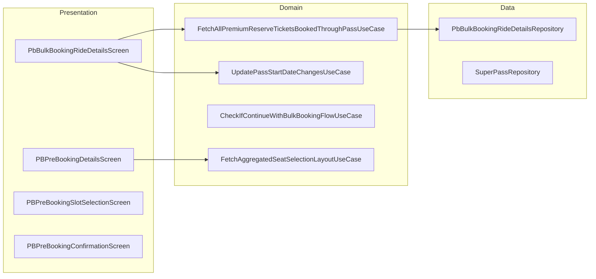

# Premium Bus — Bulk Booking — High-Level Design

## Overview

The Premium Bus Bulk Booking feature enables users to book multiple rides in advance using a SuperPass subscription. Users can manage booked rides, view upcoming/past trips, reschedule rides, update pass start dates, and handle pass eligibility and ride rollovers. The feature provides a comprehensive multi-ride management experience.

## User Journey

1. **Entry Points**:
   - Pass purchase → Ride management
   - Home → My passes
   - Notifications → Pass updates

2. **Core Flow**:
   - View pass details and remaining trips
   - Book single or multiple rides
   - Select slots across multiple days
   - Select seats with aggregated availability
   - Manage upcoming and past rides
   - Reschedule or cancel rides

3. **Exit Points**:
   - Rides booked → Activation screens
   - Pass expired → Renewal prompt
   - All rides completed → History

## Architecture Diagram



## Key Components

| Component | Platform | File Path | Responsibility |
|-----------|----------|-----------|----------------|
| `PbBulkBookingRideDetailsComponent` | Shared | `shared/home/.../premiumbus/bulkbookingridedetails/ui/PbBulkBookingRideDetailsComponent.kt` | Ride management |
| `PBPreBookingDetailsComponent` | Shared | `shared/productbooking/.../premiumbus/ui/pbprebooking/PBPreBookingDetailsComponent.kt` | Multi-ride selection |
| `PBPreBookingSlotSelectionComponent` | Shared | `shared/productbooking/.../premiumbus/ui/pbprebooking/slotselection/PBPreBookingSlotSelectionComponent.kt` | Multi-day slots |
| `FetchAggregatedSeatSelectionLayoutUseCase` | Shared | `shared/productbooking/.../premiumbus/domain/FetchAggregatedSeatSelectionLayoutUseCase.kt` | Bulk seat layout |
| `PbBulkBookingRideDetailsRepository` | Shared | `shared/home/.../premiumbus/bulkbookingridedetails/data/remote/PbBulkBookingRideDetailsRepository.kt` | Pass/ride data |

## Data Flow

### Ride Management Display
1. `PbBulkBookingRideDetailsComponent` initializes with pass ID
2. `FetchAllPremiumReserveTicketsBookedThroughPassUseCase` streams linked tickets
3. Tickets separated into upcoming/past based on status
4. Real-time polling for active ticket ETA
5. Display tabs with ride cards

### Multi-Ride Booking
1. User selects "Book Multiple Rides"
2. `PBPreBookingDetailsComponent` shows week calendar
3. User selects days and trip count
4. Navigate to slot selection for each day
5. `FetchAggregatedSeatSelectionLayoutUseCase` fetches combined availability
6. User selects seats across all days
7. Confirm and create orders

### Pass Start Date Change
1. User selects "Change Start Date"
2. Date picker shows available dates
3. User confirms new start date
4. `UpdatePassStartDateChangesUseCase` updates pass
5. Linked bookings adjusted accordingly

## Platform Differences

### Android-Specific
- Native Compose UI for ride cards
- Android-specific date picker
- Background sync worker

### iOS-Specific
- Compose Multiplatform UI
- iOS date picker integration
- Background fetch support

## Integration Points

### Analytics Events
- See [Analytics: premium-bus-bulk-booking](/analytics/flows/premium-bus-bulk-booking) for event documentation
- Key events:
  - `pb_bulk_booking_manage_rides_screen_opened`
  - `pb_bulk_booking_book_single_ride_click`
  - `pb_bulk_booking_book_multiple_ride_click`
  - `pb_bulk_booking_book_again_cta_click`
  - `pb_bulk_booking_pass_date_change_confirmed`

### Shared Services
- **Super Pass**: Pass details and management
- **Live Tracking**: Active ride tracking
- **Checkout**: Payment for additional rides

### Navigation
- **Navigates to**: Slot selection, Seat selection, Activation, Receipt
- **Navigated from**: Pass purchase, Home, Notifications

## Pass Types

### SuperPassSubTypes
```kotlin
enum class SuperPassSubTypes {
    MAGIC_SUPER_PASS,      // Unlimited rides
    RIDE_BASED_SUPER_PASS  // Limited trip count
}
```

### Pass Features
- **Magic Pass**: Unlimited rides during validity
- **Ride-Based Pass**: Fixed number of trips
- **Bulk Booking**: Book multiple days at once
- **Date Change**: Shift pass start date
- **Rollover**: Unused rides carry forward

## View State

### PbBulkBookingRideDetailsViewState
```kotlin
data class PbBulkBookingRideDetailsViewState(
    val toolbarTitle: String,
    val upcomingRideList: List<UpcomingRideCardData>,
    val pastRideList: List<PastRideCardData>,
    val superPassResponse: SuperPassResponseAppModel,
    val passStartTime: String,
    val passExpiryTime: String,
    val remainingTrips: Int?,
    val passType: SuperPassSubTypes,
    val isBulkBookingPass: Boolean,
    val isPassRollOverEligible: Boolean,
    val currentlySelectedTab: TabType
)
```

## Ride Card Data

### UpcomingRideCardData
```kotlin
data class PremiumBusBulkBookingUpcomingRidesCardData(
    val bookingId: String,
    val vehicleInfo: VehicleInfoState,
    val pickupStopScheduledTime: StopSchedule,
    val dropStopScheduledTime: StopSchedule,
    val tripTimeInfo: TripTimeInfoState,
    val ticketStatus: PremiumReserveTicketStatus,
    val tripStatus: PremiumBusTripStatus?,
    val fromStopName: String?,
    val toStopName: String?,
    val routeName: String?
)
```

### PastRideCardData
```kotlin
data class PremiumBusBulkBookingPastRidesCardData(
    val configurationId: String,
    val bookingId: String,
    val routeInfo: RouteInfo?,
    val ticketStatus: PremiumReserveTicketStatus,
    val validOrExpiryTime: String,
    val tripSlotStartTime: Long,
    val expiryTime: Long,
    val bookingTime: Long
)
```

## Aggregated Seat Selection

### Request Model
```kotlin
data class AggregatedSeatLayoutRequest(
    val routeId: String,
    val fromStopId: String,
    val toStopId: String,
    val startTimeInMillis: Long,
    val endTimeInMillis: Long,
    val days: List<Int>,
    val slotFromStopTime: Long,
    val slotTripStartTime: Long
)
```

### Response Handling
- Fetches seat layout aggregated across date range
- Shows availability considering all selected days
- Prevents booking if any day has conflicts

## Edge Cases & Error Handling

| Scenario | Handling |
|----------|----------|
| Pass expired | Shows renewal prompt |
| No remaining trips | Disables booking |
| Date change window closed | Shows message |
| Booking failed | Shows retry with reason |
| Network offline | Shows cached rides |
| Ride in progress | Shows live tracking |

## Real-Time Features

### Live Polling System
- Polls up to 3 active tickets simultaneously
- Updates every second during active rides
- Fetches vehicle info, ETA, stop directions
- Uses `ActivePremiumBusTicketsHelper`
- Mutex-protected for thread safety

### Polling Lifecycle
```kotlin
// On screen start
startPollingForActiveTickets()

// During active view
pollCardListAndUpdateState()

// On screen stop
clearPollingResources()
```

## Dependencies

### Internal
- `shared:home` — Bulk booking module
- `shared:productbooking` — Booking flow
- `shared:livetracking` — Active ride tracking
- `shared:superpass` — Pass management

### External
- SQLDelight — Local ticket storage
- DataStore — Pass preferences
- Compose — Ride card UI
