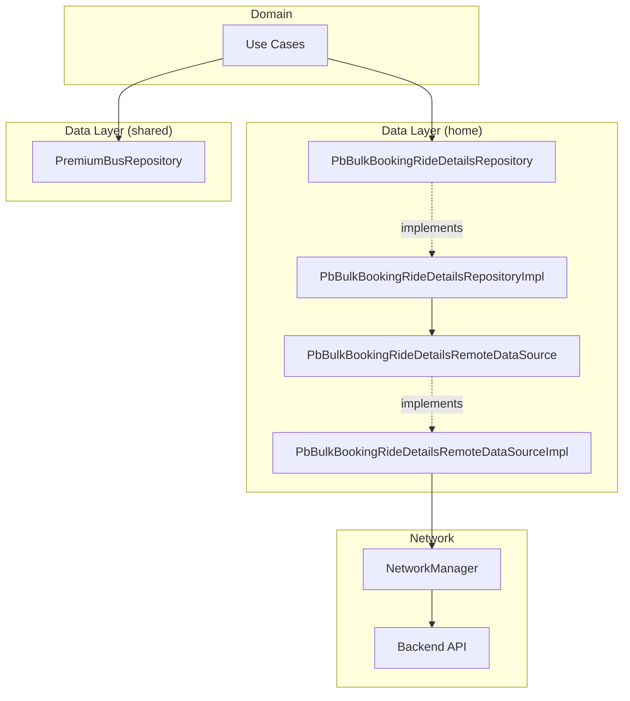
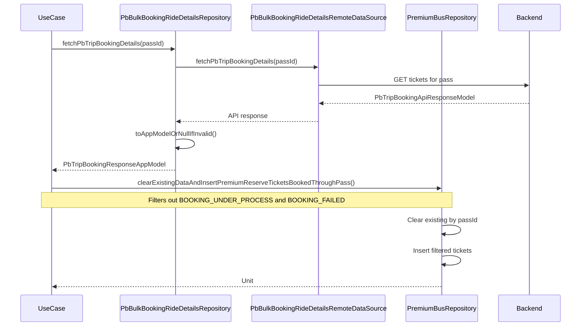
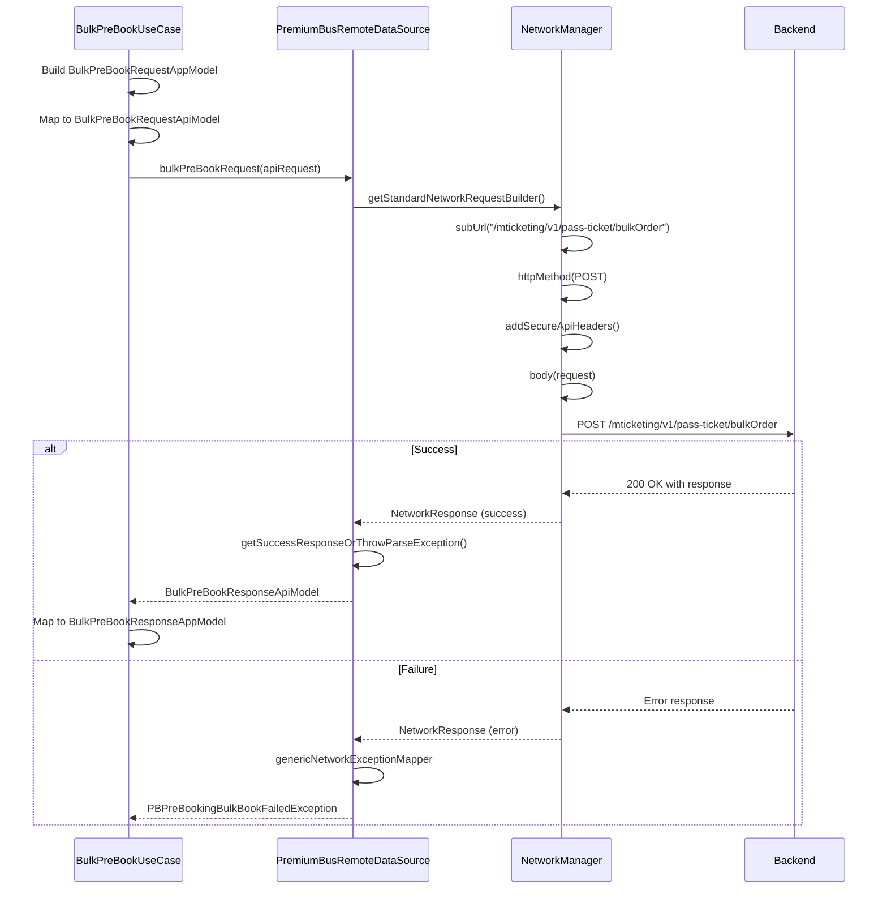
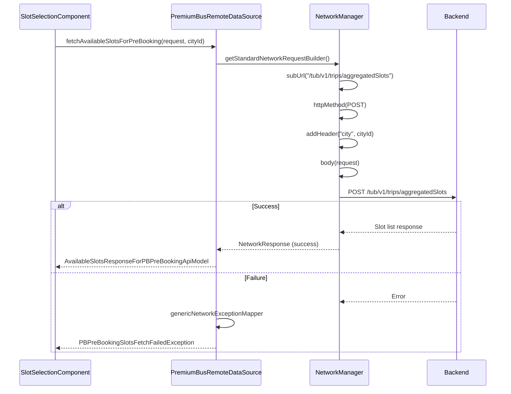
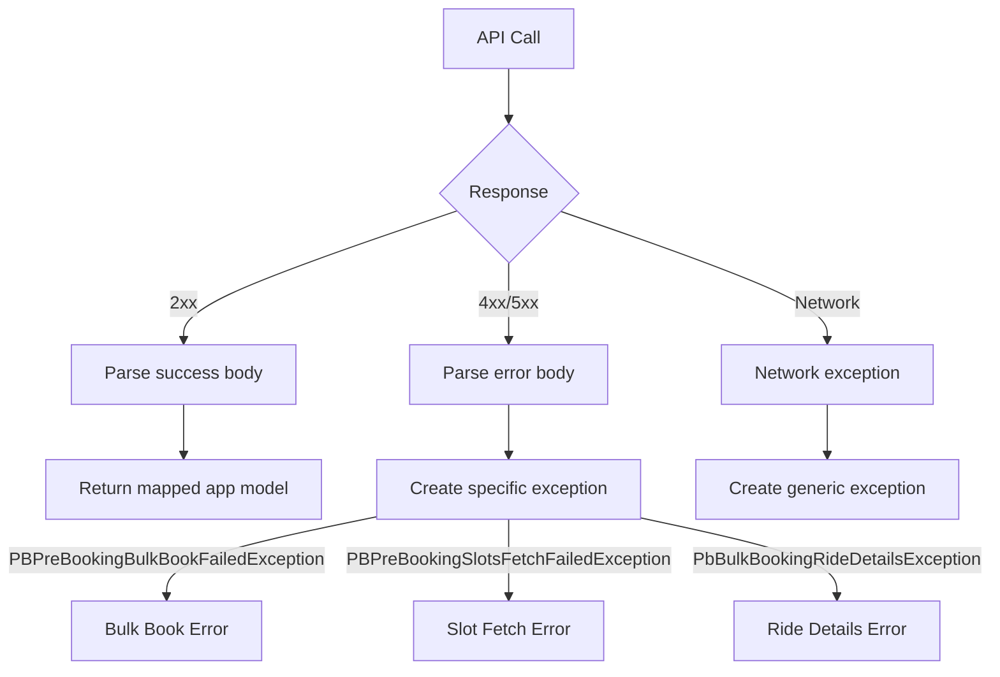
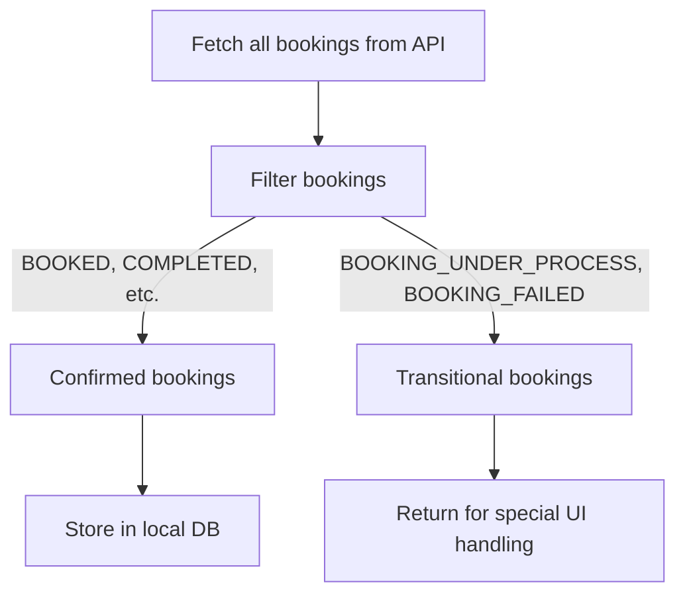

# Premium Bus Bulk Booking - Repository Documentation

This document describes the data layer repositories that manage pass-linked ticket storage, remote API communication for booking operations, and real-time data synchronization for the Premium Bus Bulk Booking feature.

## Data Layer Overview

The Premium Bus Bulk Booking data layer coordinates between two primary repository implementations: `PbBulkBookingRideDetailsRepository` in the home module for ticket management and pass operations, and `PremiumBusRepository` for local ticket storage. Remote data sources handle slot fetching and bulk booking submission through the backend APIs.



---

## Repository Interfaces

### PbBulkBookingRideDetailsRepository

The primary repository for managing bulk booking ride details in the home module. Handles ticket fetching from remote API and pass date modifications.

#### Source Location

```
shared/home/src/commonMain/kotlin/app/chalo/premiumbus/bulkbookingridedetails/data/remote/
├── PbBulkBookingRideDetailsRepository.kt
└── PbBulkBookingRideDetailsRepositoryImpl.kt
```

#### Interface Methods

| Method | Purpose | Returns |
|--------|---------|---------|
| fetchPbTripBookingDetails(passId) | Fetch all tickets for a pass from remote | PbTripBookingResponseAppModel |
| updatePassStartDate(passId, cityName, request) | Change pass start date | JsonObject? |

### PbBulkBookingRideDetailsRemoteDataSource

Remote data source interface for bulk booking API operations.

#### Source Location

```
shared/home/src/commonMain/kotlin/app/chalo/premiumbus/bulkbookingridedetails/data/remote/
├── PbBulkBookingRideDetailsRemoteDataSource.kt
└── PbBulkBookingRideDetailsRemoteDataSourceImpl.kt
```

#### Interface Methods

| Method | Purpose | Returns |
|--------|---------|---------|
| fetchPbTripBookingDetails(passId) | GET tickets for pass | PbTripBookingApiResponseModel |
| updatePassStartDate(passId, cityName, request) | PUT pass start date | JsonObject? |

### PremiumBusRepository

Shared repository for premium bus ticket local storage operations.

#### Methods Relevant to Bulk Booking

| Method | Purpose | Returns |
|--------|---------|---------|
| clearExistingDataAndInsertPremiumReserveTicketsBookedThroughPass(passId, tickets) | Sync tickets to local DB | Unit |
| observeTicketsForPass(passId) | Stream tickets from local DB | Flow<List<PremiumReserveTicketAppModel>> |

---

## API Endpoints

### Fetch Trip Booking Details

Retrieves all premium reserve tickets booked through a specific SuperPass.

| Property | Value |
|----------|-------|
| Method | GET |
| Auth | Required |
| Module | home |

#### Response: PbTripBookingApiResponseModel

| Field | Type | Description |
|-------|------|-------------|
| passDetails | SuperPassApiResponseModel | Pass information |
| linkedBookings | List<PremiumReserveTicketApiModel?> | List of booked tickets |

#### SuperPassApiResponseModel Fields

| Field | Type | Description |
|-------|------|-------------|
| passId | String | Unique pass identifier |
| productName | String | Product name |
| userProfile | UserProfileApiModel | User information |
| startTime | Long | Pass start timestamp |
| expiryTime | Long | Pass expiry timestamp |
| numOfDays | Int | Pass validity in days |
| numOfTrips | Int? | Total trip allowance |
| remainingTrips | Int? | Remaining trips |
| tripPreferences | TripPreferencesApiResponseModel? | Saved route preferences |
| productType | String | Product category |
| productSubType | String | Product subcategory |
| punches | List<PunchApiModel>? | Historical ride records |

---

### Update Pass Start Date

Changes the start date of a SuperPass.

| Property | Value |
|----------|-------|
| Method | PUT |
| Auth | Required |
| Module | home |

#### Request: UpdatePassStartDateRequestApiModel

| Field | Type | Description |
|-------|------|-------------|
| newStartDate | Long | New start timestamp in milliseconds |

#### Parameters

| Parameter | Type | Description |
|-----------|------|-------------|
| passId | String | SuperPass identifier |
| cityName | String | City for API routing |

#### Response

JsonObject (flexible server response)

---

### Fetch Aggregated Slots for Pre-Booking

Fetches time slot availability aggregated across multiple days for bulk pre-booking.

| Property | Value |
|----------|-------|
| Endpoint | POST /tub/v1/trips/aggregatedSlots |
| Auth | Required |
| Header | city = {cityId} |
| Module | productbooking |

#### Request: AvailableSlotsRequestForPBPreBookingApiModel

| Field | Type | Description |
|-------|------|-------------|
| routeIds | List<String> | Route identifiers |
| fromStopId | String | Pickup stop ID |
| toStopId | String | Drop stop ID |
| startDateInMillis | Long | Date range start |
| endDateInMillis | Long | Date range end |
| days | List<String> | Weekday names |

#### Response: AvailableSlotsResponseForPBPreBookingApiModel

| Field | Type | Description |
|-------|------|-------------|
| slotList | List<SlotApiModel> | Available time slots |

#### SlotApiModel Fields

| Field | Type | Description |
|-------|------|-------------|
| fromStopTime | Long | Pickup time at from stop |
| toStopTime | Long | Arrival time at to stop |
| tripStartTime | Long | Trip departure time |
| routeId | String | Route identifier |
| message | String? | Availability warning |
| specialFeatures | List<String> | Special features |
| seatAssignmentType | String | AUTO or SELECTION |

---

### Bulk Pre-Book Request

Creates bulk booking for multiple trips across selected days.

| Property | Value |
|----------|-------|
| Endpoint | POST /mticketing/v1/pass-ticket/bulkOrder |
| Auth | Required (Secure API) |
| Module | productbooking |

#### Request: BulkPreBookRequestApiModel

| Field | Type | Description |
|-------|------|-------------|
| city | String | City identifier |
| passId | String | SuperPass ID |
| startDateInMillis | Long | Date range start |
| endDateInMillis | Long | Date range end |
| requestedTrips | List<RequestedTripApiModel> | Trip configurations |
| days | List<String> | Weekday names (MONDAY, TUESDAY, etc.) |

#### RequestedTripApiModel

| Field | Type | Description |
|-------|------|-------------|
| startStopId | String | Pickup stop ID |
| endStopId | String | Drop stop ID |
| routeId | String | Route identifier |
| slotInfo | SlotInfoApiModel | Time slot details |
| seatPreference | List<SeatInfoApiModel> | Selected seats |

#### SlotInfoApiModel

| Field | Type | Description |
|-------|------|-------------|
| fromStopTime | Long | Pickup time at from stop |
| tripStartTime | Long | Trip start time |

#### Response: BulkPreBookResponseApiModel

| Field | Type | Description |
|-------|------|-------------|
| bulkPrebookingRequestId | String | Unique request ID |
| status | String | Request status |

---

### Fetch Aggregated Seat Selection Layout

Fetches seat availability aggregated across multiple days for consistent seat selection in bulk booking.

| Property | Value |
|----------|-------|
| Endpoint | POST /tub/v1/aggregatedSeatsWithLayout |
| Auth | Required |
| Module | productbooking |

#### Request Fields

| Field | Type | Description |
|-------|------|-------------|
| routeId | String | Route identifier |
| fromStopId | String | Pickup stop ID |
| toStopId | String | Drop stop ID |
| startTimeInMillis | Long | Date range start |
| endTimeInMillis | Long | Date range end |
| days | List<String> | Weekday names |
| slotFromStopTime | Long | Selected slot pickup time |
| slotTripStartTime | Long | Selected slot trip start |

#### Response: List<SeatInfoApiModel>

| Field | Type | Description |
|-------|------|-------------|
| seatId | Int | Unique seat identifier |
| seatNumber | String | Display label (1A, 2B) |
| seatType | String | WINDOW, AISLE, MIDDLE |
| status | String | AVAILABLE, UNAVAILABLE |
| reservationType | String | GENERAL, FEMALE |
| x, y, z | Int | 3D grid coordinates |

---

## Data Flow Diagrams

### Ticket Synchronization Flow



### Bulk Booking Creation Flow



### Aggregated Slot Fetching Flow



---

## Local Storage

### Database Operations

The premium bus bulk booking feature uses `PremiumBusRepository` for ticket persistence via SQLDelight.

#### Local Operations

| Operation | Method | Description |
|-----------|--------|-------------|
| Clear and insert tickets | clearExistingDataAndInsertPremiumReserveTicketsBookedThroughPass | Atomic clear and insert for pass |
| Observe by pass | Flow query | Reactive stream of tickets |

### Data Transformation

#### API to App Model Mapping

**PbTripBookingApiResponseModel to PbTripBookingResponseAppModel:**

The transformation is performed via the `toAppModelOrNullIfInvalid()` extension function.

| API Field | App Field | Transform |
|-----------|-----------|-----------|
| passDetails | superPassResponseAppModel | toSuperPassResponseAppModel() |
| linkedBookings | linkedBookings | mapNotNull { toPremiumReserveTicketAppModelOrNullIfInvalid() } |

**SuperPassApiResponseModel to SuperPassResponseAppModel:**

| API Field | App Field | Transform |
|-----------|-----------|-----------|
| passId | passId | Direct |
| productName | passName | Direct |
| userProfile.firstName + lastName | userName | Concatenated |
| startTime | startTime | Direct |
| expiryTime | expiryTime | Direct |
| numOfDays | numOfDays | Direct |
| numOfTrips | totalTrips | Direct |
| remainingTrips | remainingTrips | Direct |
| tripPreferences | tripPreferences | toSuperPassTripPreferences() |
| productType | productType | Direct |
| productSubType | productSubType | Direct |
| punches | previousRideTimeStampsList | map { it.punchingTime } |

**TripPreferencesApiResponseModel to SuperPassTripPreferences:**

| API Field | App Field |
|-----------|-----------|
| routeId | routeId |
| startStopId | startStopId |
| startStopName | startStopName |
| endStopId | endStopId |
| endStopName | endStopName |

---

## Exception Handling

### Exception Types

| Exception | Module | Cause |
|-----------|--------|-------|
| PbBulkBookingRideDetailsException | home | General API error |
| PbBulkBookingRideDetailsInvalidDataException | home | Invalid response data |
| PbUpdatePassStartDateException | home | Pass date update failed |
| PbUpdatePassStartDateInvalidDataException | home | Invalid date update data |
| PBPreBookingSlotsFetchFailedException | productbooking | Slot fetch failed |
| PBPreBookingBulkBookFailedException | productbooking | Bulk booking failed |
| PremiumBusSeatSelectionLayoutFetchFailureException | productbooking | Seat layout fetch failed |

### Exception Flow



### Error Code Handling

| HTTP Code | Exception Created | User Impact |
|-----------|-------------------|-------------|
| 200 | None (success) | Continue flow |
| 400 | Specific exception with message | Show validation error |
| 401/403 | Auth exception | Re-authenticate |
| 404 | Not found exception | Show not found message |
| 500 | Server exception | Show retry option |
| Network | Generic exception | Show connectivity error |

---

## Network Configuration

### Headers

All bulk booking API calls include standard headers:

| Header | Value | Description |
|--------|-------|-------------|
| Authorization | Bearer {token} | Auth token |
| Content-Type | application/json | Request body type |
| city | {cityId} | City context (for some endpoints) |

### Secure API Headers

For sensitive endpoints like bulk booking creation, additional security headers are required:

| Header | Description |
|--------|-------------|
| X-Secure-Token | Generated security token |
| X-Timestamp | Request timestamp |
| X-Signature | HMAC signature |

### Endpoint Constants

| Constant | Value | Purpose |
|----------|-------|---------|
| PB_PRE_BOOKING_FETCH_SLOTS_SUB_URL | tub/v1/trips/aggregatedSlots | Aggregated slots |
| PB_PRE_BOOKING_REQUEST_SUB_URL | mticketing/v1/pass-ticket/bulkOrder | Bulk booking |
| PB_BULK_BOOKING_SEAT_SELECTION_LAYOUT_SUB_URL | tub/v1/aggregatedSeatsWithLayout | Aggregated seats |

---

## Dependency Injection

### Module Bindings

| Interface | Implementation | Module |
|-----------|----------------|--------|
| PbBulkBookingRideDetailsRepository | PbBulkBookingRideDetailsRepositoryImpl | home |
| PbBulkBookingRideDetailsRemoteDataSource | PbBulkBookingRideDetailsRemoteDataSourceImpl | home |
| PremiumBusRemoteDataSource | PremiumBusRemoteDataSourceImpl | productbooking |
| PremiumBusRepository | Implementation | shared |

### Repository Dependencies

**PbBulkBookingRideDetailsRepositoryImpl:**

| Dependency | Purpose |
|------------|---------|
| PbBulkBookingRideDetailsRemoteDataSource | Remote API calls |
| Data mappers | Model transformation |

**PbBulkBookingRideDetailsRemoteDataSourceImpl:**

| Dependency | Purpose |
|------------|---------|
| NetworkManager | HTTP request execution |
| GenericNetworkExceptionMapper | Error mapping |
| CityProvider | Current city context |

---

## Caching Strategy

### Ticket Cache

| Property | Value |
|----------|-------|
| Cache level | SQLDelight database via PremiumBusRepository |
| Strategy | Network-first with local persistence |
| Sync trigger | Screen load via FetchFailedAndUnderProcessBookingsUseCase |
| Invalidation | After booking operations |

### Slot Cache

| Property | Value |
|----------|-------|
| Cache level | None (always fresh) |
| Reason | Seat availability changes frequently |
| Strategy | Network-only |

---

## Error Recovery

### Booking Failure Recovery

When bulk booking fails:

1. Parse error response for specific reason
2. Map to `BulkPreBookRequestFailedReason`
3. Return failure result to use case
4. Component shows appropriate error UI
5. User can retry or navigate back

### Network Failure Recovery

When network calls fail:

1. Check connectivity status
2. If timeout, allow retry
3. If offline, show offline message
4. For ticket viewing, fall back to cached data in local DB

### Data Consistency

| Scenario | Resolution |
|----------|------------|
| API success, local write fails | Retry local write |
| API fails mid-operation | No partial state persisted |
| Stale local data | Fresh fetch on screen load |
| Transitional booking status | Filter out from local storage, show in separate UI |

---

## Booking Status Management

The data layer implements special handling for transitional booking statuses:

### Status Categories

| Status | Storage | Display |
|--------|---------|---------|
| BOOKED | Local DB | Upcoming rides list |
| COMPLETED | Local DB | Past rides list |
| CANCELLED | Local DB | Past rides list |
| EXPIRED | Local DB | Past rides list |
| BOOKING_UNDER_PROCESS | Not stored | Special processing indicator |
| BOOKING_FAILED | Not stored | Special failed indicator |

### Filtering Logic



The `FetchFailedAndUnderProcessBookingsAndUpdateAllBookingsInDBUseCase` performs this filtering, storing confirmed bookings while returning transitional ones for the UI to display special status indicators.
