# Premium Bus Bulk Booking - UseCase Documentation

This document describes the domain layer use cases that orchestrate multi-ride booking operations, pass management, and ticket synchronization for the Premium Bus Bulk Booking feature.

## Domain Layer Overview

The Premium Bus Bulk Booking domain layer implements clean architecture principles with well-defined input/output contracts and comprehensive error handling. Use cases coordinate between presentation components and data repositories to validate booking eligibility, fetch aggregated slot and seat availability, process pass date changes, and submit bulk pre-booking requests.

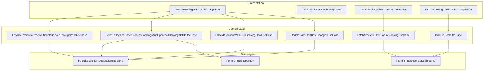

## UseCase Inventory

| UseCase | Module | Purpose |
|---------|--------|---------|
| FetchAllPremiumReserveTicketsBookedThroughPassUseCase | home | Stream all tickets linked to a pass from local DB |
| FetchFailedAndUnderProcessBookingsAndUpdateAllBookingsInDBUseCase | home | Sync remote tickets to local DB, filter transitional statuses |
| CheckIfContinueWithBulkBookingFlowUseCase | home | Validate eligibility for multi-ride booking |
| UpdatePassStartDateChangesUseCase | home | Modify pass start date via API |
| FetchAvailableSlotsForPreBookingUseCase | productbooking | Fetch aggregated slot availability |
| BulkPreBookUseCase | productbooking | Submit bulk pre-booking request |

---

## FetchAllPremiumReserveTicketsBookedThroughPassUseCase

Streams all premium reserve tickets that were booked using a specific SuperPass from the local database, providing reactive updates as ticket data changes.

### Source Location

```
shared/home/src/commonMain/kotlin/app/chalo/premiumbus/bulkbookingridedetails/domain/
└── FetchAllPremiumReserveTicketsBookedThroughPassUseCase.kt
```

### Responsibility

Observes the local ticket database for all tickets linked to a pass ID. Returns a Flow that emits updates whenever the local data changes, enabling real-time UI updates on the ride management screen without requiring explicit refresh calls.

### Flow Diagram

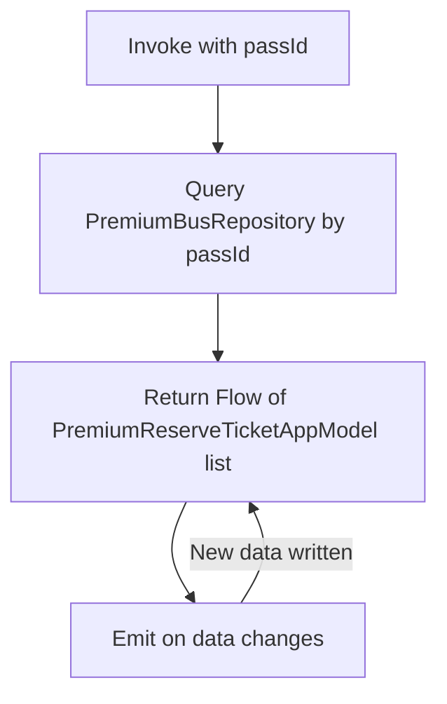

### Input Parameters

| Parameter | Type | Description |
|-----------|------|-------------|
| passId | String | SuperPass identifier to filter tickets |

### Output

| Type | Description |
|------|-------------|
| Flow<List<PremiumReserveTicketAppModel>> | Observable stream of tickets linked to the pass |

### Implementation Details

The use case queries the `PremiumBusRepository` which wraps the local SQLDelight database. The repository returns a Flow that automatically emits when the underlying data changes, providing reactive updates to the UI layer.

---

## FetchFailedAndUnderProcessBookingsAndUpdateAllBookingsInDBUseCase

Fetches trip booking details from the remote API and synchronizes them to the local database, filtering for failed and under-process bookings to display their transitional statuses.

### Source Location

```
shared/home/src/commonMain/kotlin/app/chalo/premiumbus/bulkbookingridedetails/domain/
└── FetchFailedAndUnderProcessBookingsAndUpdateAllBookingsInDBUseCase.kt
```

### Responsibility

Queries the remote API for all bookings associated with a pass, identifies bookings with transitional statuses (BOOKING_FAILED, BOOKING_UNDER_PROCESS), and updates the local database with all confirmed bookings. This ensures the local cache reflects the latest server state while separately returning transitional bookings for special UI handling.

### Flow Diagram

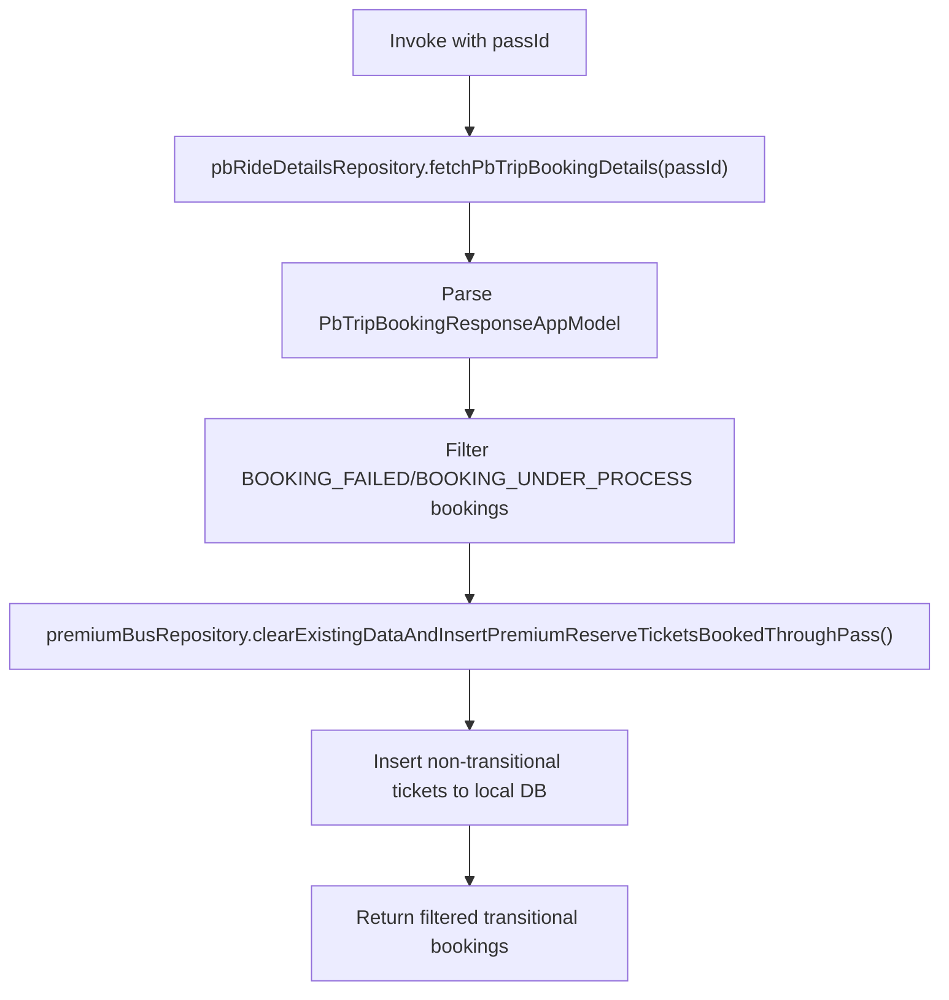

### Input Parameters

| Parameter | Type | Description |
|-----------|------|-------------|
| passId | String | SuperPass identifier |

### Output

| Type | Description |
|------|-------------|
| ChaloUseCaseResult<PbTripBookingResponseAppModel, PbRideDetailsFetchError> | Filtered list of transitional bookings or error |

### Booking Status Filtering

The use case filters linked bookings into two categories:

| Status | Stored in Local DB | Returned in Response |
|--------|-------------------|---------------------|
| BOOKED | Yes | No |
| COMPLETED | Yes | No |
| CANCELLED | Yes | No |
| EXPIRED | Yes | No |
| BOOKING_FAILED | No | Yes |
| BOOKING_UNDER_PROCESS | No | Yes |

Tickets with empty booking IDs are filtered out during processing.

### Error Handling

| Exception | Error Result | Description |
|-----------|--------------|-------------|
| PbBulkBookingRideDetailsInvalidDataException | PARSE_ERROR | Invalid response data |
| PbBulkBookingRideDetailsException | SERVER_ERROR | API returned error |
| NetworkSuccessResponseParseException | PARSE_ERROR | Response parsing failed |
| ChaloLocalException | LOCAL_ERROR | Local database error |
| Exception | UNKNOWN_ERROR | Unexpected exception |

---

## CheckIfContinueWithBulkBookingFlowUseCase

Validates whether a user can proceed with booking additional rides through their SuperPass, performing comprehensive eligibility checks.

### Source Location

```
shared/home/src/commonMain/kotlin/app/chalo/premiumbus/domains/
└── CheckIfContinueWithBulkBookingFlowUseCase.kt
```

### Responsibility

Performs comprehensive eligibility validation before allowing users to enter the multi-ride booking flow. Checks pass validity status, remaining trip balance, route availability, and any blocking conditions. Returns a detailed eligibility result with reason for denial if not eligible.

### Flow Diagram

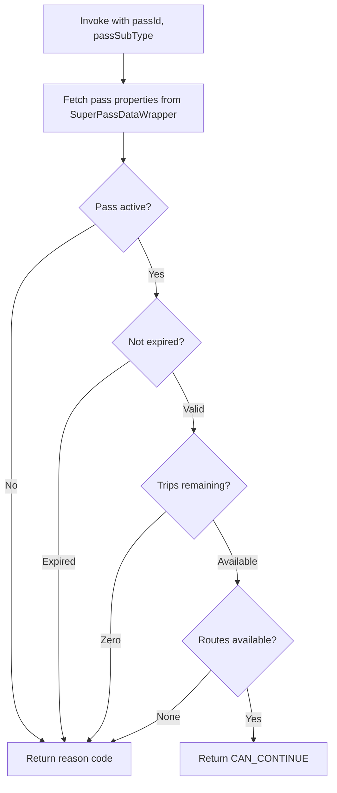

### Input Parameters

| Parameter | Type | Description |
|-----------|------|-------------|
| passId | String | SuperPass identifier |
| passSubType | SuperPassSubTypes | Pass type for specific rules |

### Output

| Type | Description |
|------|-------------|
| BulkBookingFlowEligibilityResult | Eligibility status with reason |

### Eligibility Result Values

| Result | Description | UI Action |
|--------|-------------|-----------|
| CAN_CONTINUE | User may proceed with booking | Navigate to pre-booking details |
| PASS_EXPIRED | Pass validity has ended | Show renewal prompt |
| PASS_NOT_ACTIVE | Pass not yet started | Show activation info |
| NO_TRIPS_REMAINING | Trip balance exhausted | Show purchase prompt |
| NO_ROUTES_AVAILABLE | No bookable routes configured | Show error message |

### Pass Type Specific Logic

| Pass Type | Specific Checks |
|-----------|-----------------|
| MAGIC_SUPER_PASS | Unlimited trips, only validity check |
| RIDE_BASED_SUPER_PASS | Trip count validation required |

---

## UpdatePassStartDateChangesUseCase

Updates the start date of a SuperPass, adjusting the validity period through the backend API with validation and cancellation of conflicting bookings.

### Source Location

```
shared/home/src/commonMain/kotlin/app/chalo/premiumbus/bulkbookingridedetails/domain/
└── UpdatePassStartDateChangesUseCase.kt
```

### Responsibility

Validates the new start date against constraints, submits the update request to the server, and handles the response. The backend may cancel conflicting bookings as part of the date change process. The use case handles the complete flow including error mapping and local state updates.

### Flow Diagram

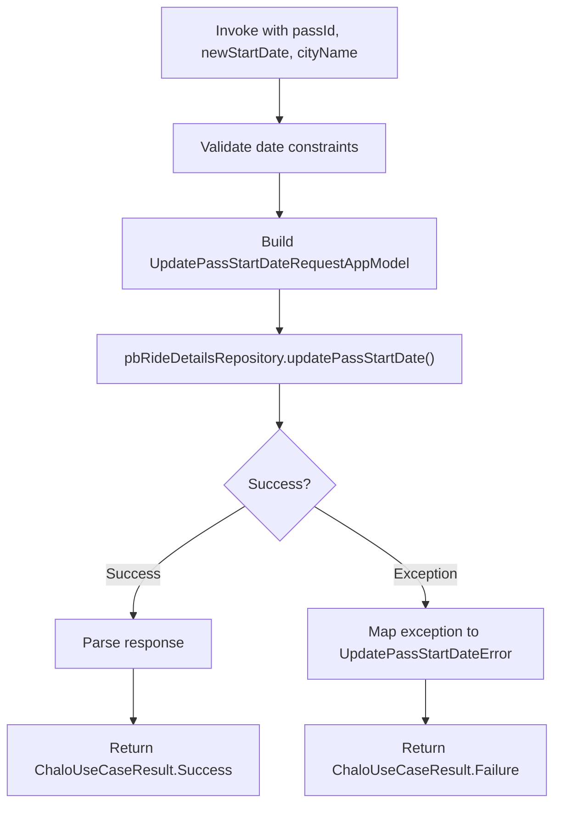

### Input Parameters

| Parameter | Type | Description |
|-----------|------|-------------|
| passId | String | SuperPass identifier |
| newStartDate | Long | New start date timestamp in milliseconds |
| cityName | String | City for API routing |
| isPremiumBusFeatureEnabled | Boolean | Feature flag check |

### Output

| Type | Description |
|------|-------------|
| ChaloUseCaseResult<Unit, UpdatePassStartDateError> | Success or failure with error type |

### Request Model

| Field | Type | Description |
|-------|------|-------------|
| newStartDate | Long | New start timestamp in milliseconds |

### Error Handling

| Exception | Error Type | Description |
|-----------|------------|-------------|
| PbUpdatePassStartDateException | SERVER_ERROR | Server rejected update |
| PbUpdatePassStartDateInvalidDataException | INVALID_DATA | Invalid request data |
| NetworkSuccessResponseParseException | PARSE_ERROR | Response parsing failed |
| ChaloLocalException | LOCAL_ERROR | Local processing error |
| Exception | UNKNOWN_ERROR | Unexpected exception |

---

## FetchAvailableSlotsForPreBookingUseCase

Fetches aggregated slot availability for pre-booking across the selected date range and weekdays.

### Source Location

```
shared/productbooking/src/commonMain/kotlin/app/chalo/productbooking/common/domain/
└── FetchAvailableSlotsForPreBookingUseCase.kt
```

### Responsibility

Queries the backend for time slot availability aggregated across multiple days matching the user's weekday selection. Returns slots that have capacity on all selected days, enabling consistent multi-day bookings. The aggregation ensures that a selected slot will be available across the entire booking range.

### Flow Diagram

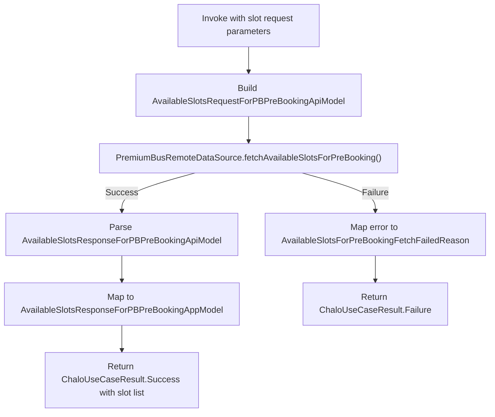

### Input Parameters

| Parameter | Type | Description |
|-----------|------|-------------|
| passId | String | SuperPass identifier |
| routeIds | List<String> | Routes to query slots for |
| fromStopId | String | Pickup stop ID |
| toStopId | String | Drop stop ID |
| startDateInLong | Long | Date range start in milliseconds |
| endDateInLong | Long | Date range end in milliseconds |
| selectedDays | List<WeekDays> | Selected weekday enums |

### Output

| Type | Description |
|------|-------------|
| ChaloUseCaseResult<AvailableSlotsResponseForPBPreBookingAppModel, AvailableSlotsForPreBookingFetchFailedReason> | Aggregated slot availability or error |

### Response Model

| Field | Type | Description |
|-------|------|-------------|
| slotList | List<SlotAppModel> | Available time slots |

### SlotAppModel Structure

| Field | Type | Description |
|-------|------|-------------|
| fromStopTime | Long | Pickup time at from stop |
| toStopTime | Long | Arrival time at to stop |
| tripStartTime | Long | Trip departure time |
| routeId | String | Route identifier |
| message | String? | Availability warning message |
| specialFeatures | List<String> | Special features (AC, etc.) |
| seatAssignmentType | PremiumBusSeatAssignmentType | AUTO or SELECTION |

### Error Handling

| Error Reason | Description | UI Handling |
|--------------|-------------|-------------|
| NO_SLOTS | No slots available for selection | Show change dates prompt |
| CITY_NOT_FOUND | Invalid city configuration | Show error message |
| INTERNAL_SERVER_ERROR | Backend processing error | Show retry option |
| UNKNOWN_SERVER_ERROR | Unrecognized server error | Show generic error |
| UNKNOWN_ERROR | Unexpected exception | Show generic error |

---

## BulkPreBookUseCase

Submits the bulk pre-booking request to create reservations for multiple trips across the selected date range.

### Source Location

```
shared/productbooking/src/commonMain/kotlin/app/chalo/productbooking/common/domain/
└── BulkPreBookUseCase.kt
```

### Responsibility

Transforms the user's trip selections into the API request format, submits the bulk booking request, and handles success/failure responses. On success, the backend creates individual bookings for each day in the selected range matching the weekday criteria.

### Flow Diagram

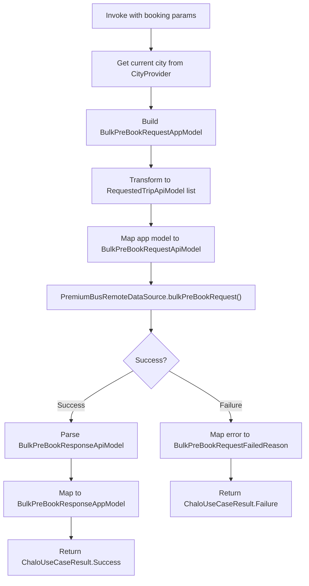

### Input Parameters

| Parameter | Type | Description |
|-----------|------|-------------|
| passId | String | SuperPass identifier |
| startDateInLong | Long | Booking range start timestamp |
| endDateInLong | Long | Booking range end timestamp |
| selectedDays | List<WeekDays> | Selected weekdays |
| requestedTrips | List<RequestedTripAppModel> | Trip configurations |

### RequestedTripAppModel Structure

| Field | Type | Description |
|-------|------|-------------|
| startStopId | String | Pickup stop ID |
| endStopId | String | Drop stop ID |
| routeId | String | Route identifier |
| slotInfo | SlotInfoAppModel | Time slot details |
| seatPreference | List<SeatInfoAppModel> | Selected seats (if applicable) |

### SlotInfoAppModel Structure

| Field | Type | Description |
|-------|------|-------------|
| fromStopTime | Long | Pickup time at from stop |
| tripStartTime | Long | Trip departure time |

### Output

| Type | Description |
|------|-------------|
| ChaloUseCaseResult<BulkPreBookResponseAppModel, UseCaseOperationError<BulkPreBookRequestFailedReason>> | Success with booking ID or failure with detailed error |

### Response Model

| Field | Type | Description |
|-------|------|-------------|
| bulkPrebookingRequestId | String | Unique request identifier |
| status | String | Request status |

### Error Handling

The use case implements comprehensive error mapping through `UseCaseOperationError`:

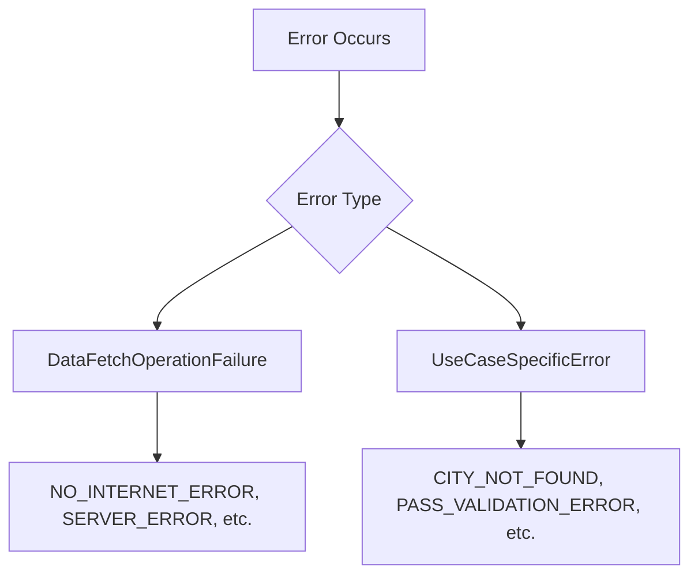

| Error Reason | Category | Description |
|--------------|----------|-------------|
| NO_INTERNET_ERROR | DataFetch | Network connectivity issue |
| SERVER_ERROR | DataFetch | HTTP 5xx response |
| REQUEST_CANCELLATION_ERROR | DataFetch | Request cancelled |
| API_CALL_AUTHORISATION_ERROR | DataFetch | Authentication failed |
| CITY_NOT_FOUND | UseCaseSpecific | Invalid city configuration |
| INTERNAL_SERVER_ERROR | UseCaseSpecific | Backend processing error |
| PRODUCT_DISABLED_ERROR | UseCaseSpecific | Feature disabled for city |
| PASS_VALIDATION_ERROR | UseCaseSpecific | Pass invalid or expired |
| UNKNOWN_ERROR | UseCaseSpecific | Unrecognized error |

---

## Sequence Diagrams

### Complete Bulk Booking Flow

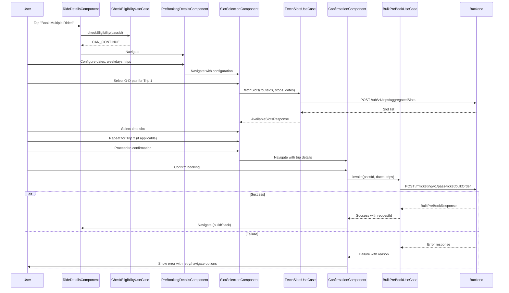

### Ticket Synchronization Flow

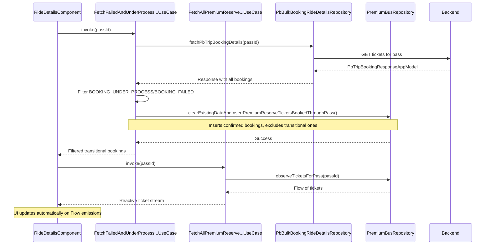

### Pass Date Change Flow

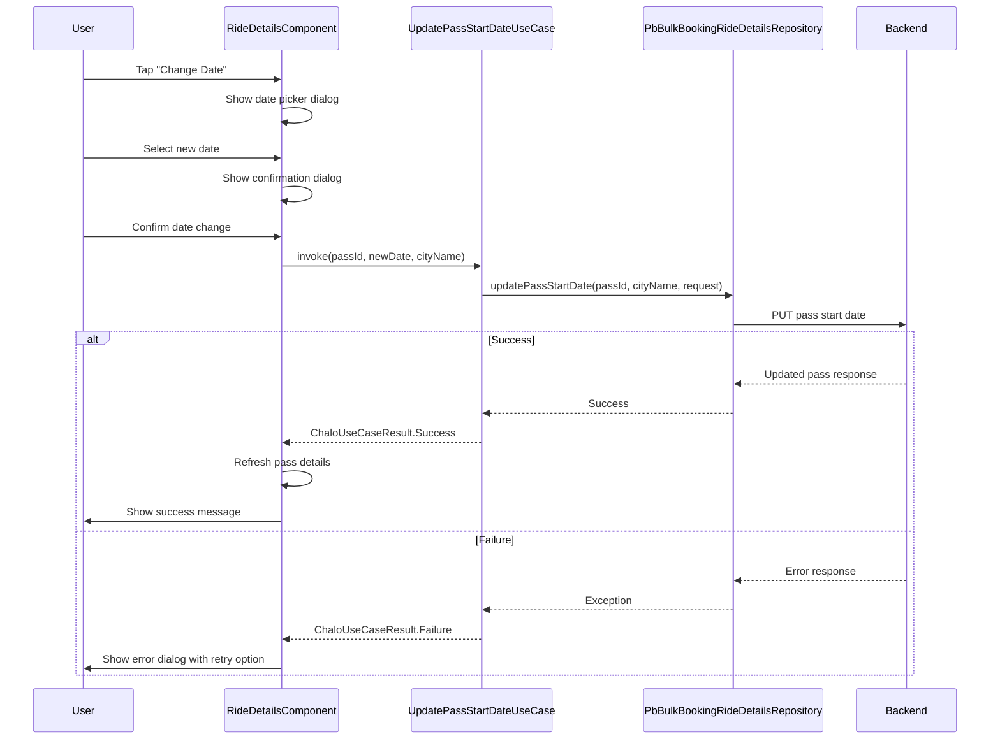

---

## Domain Models

### PbTripBookingResponseAppModel

| Field | Type | Description |
|-------|------|-------------|
| superPassResponseAppModel | SuperPassResponseAppModel | Pass details |
| linkedBookings | List<PremiumReserveTicketAppModel?> | List of bookings |

### SuperPassResponseAppModel

| Field | Type | Description |
|-------|------|-------------|
| passId | String | Unique pass identifier |
| passName | String | Product name |
| userName | String | User's full name |
| startTime | Long | Pass start timestamp |
| expiryTime | Long | Pass expiry timestamp |
| numOfDays | Int | Pass validity in days |
| totalTrips | Int? | Total trip allowance |
| remainingTrips | Int? | Remaining trips |
| tripPreferences | SuperPassTripPreferences? | Saved route preferences |
| productType | String | Product category |
| productSubType | String | Product subcategory |
| previousRideTimeStampsList | List<Long> | Historical punch timestamps |

### BulkPreBookRequestAppModel

| Field | Type | Description |
|-------|------|-------------|
| city | String | City identifier |
| passId | String | SuperPass ID |
| startDateInMillis | Long | Range start |
| endDateInMillis | Long | Range end |
| requestedTrips | List<RequestedTripAppModel> | Trip configurations |
| days | List<String> | Selected weekdays |

### BulkPreBookResponseAppModel

| Field | Type | Description |
|-------|------|-------------|
| bulkPrebookingRequestId | String | Request tracking ID |
| status | String | Request processing status |

---

## Business Rules

| Rule | Description | Enforced In |
|------|-------------|-------------|
| Eligibility check | Must pass eligibility before booking | CheckIfContinueWithBulkBookingFlowUseCase |
| Trip balance | Cannot exceed remaining trips | PreBookingDetailsComponent |
| Date range | Must be within pass validity | PreBookingDetailsComponent |
| Weekday selection | At least one weekday required | PreBookingDetailsComponent |
| Trips per day | Maximum 2 trips per day | PreBookingDetailsComponent |
| Sequential trips | Trip 2 enabled only after Trip 1 complete | SlotSelectionComponent |
| Seat consistency | Same seats must be available all days | Aggregated seat layout API |
| Status filtering | Transitional bookings handled separately | FetchFailedAndUnderProcessBookings UseCase |

---

## Error Mapping

| API Error | Domain Error | User Message |
|-----------|--------------|--------------|
| Network timeout | NO_INTERNET_ERROR | "Check your connection" |
| 500 Internal | INTERNAL_SERVER_ERROR | "Something went wrong" |
| City not found | CITY_NOT_FOUND | "Service not available in this city" |
| Product disabled | PRODUCT_DISABLED_ERROR | Server message displayed |
| Pass validation | PASS_VALIDATION_ERROR | Server message displayed |
| Parse error | PARSE_ERROR | "Something went wrong" |
| Unknown | UNKNOWN_ERROR | "Something went wrong" |
