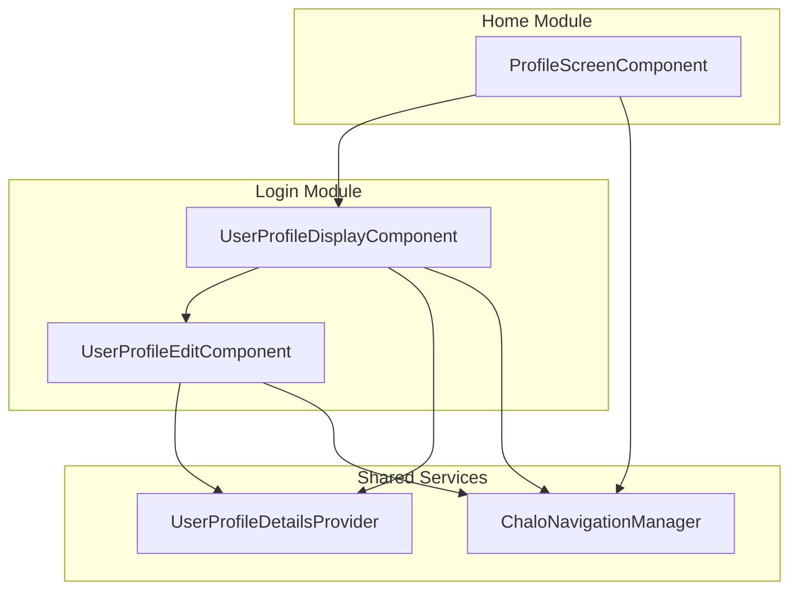
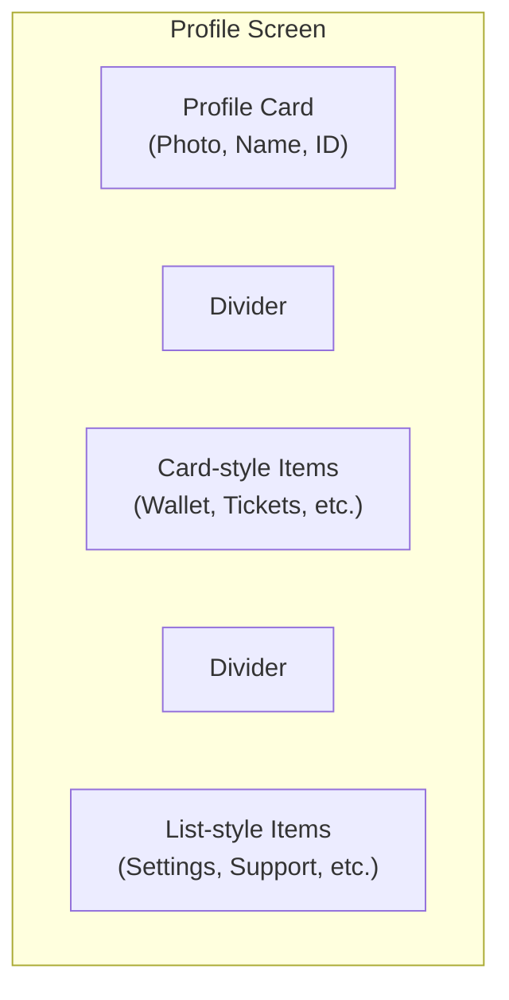
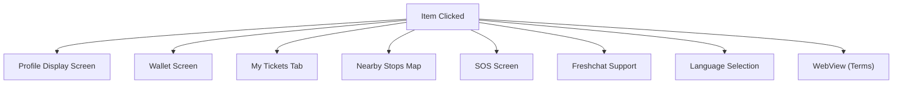
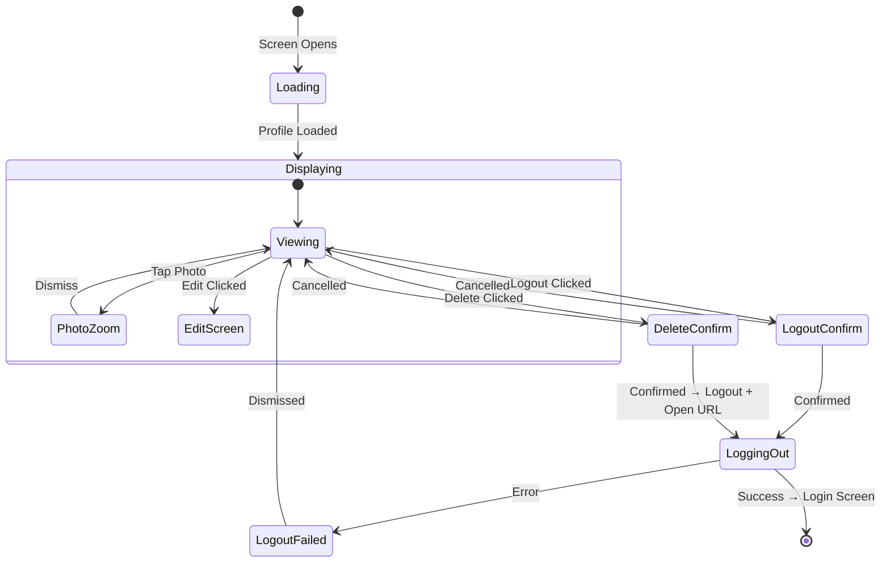
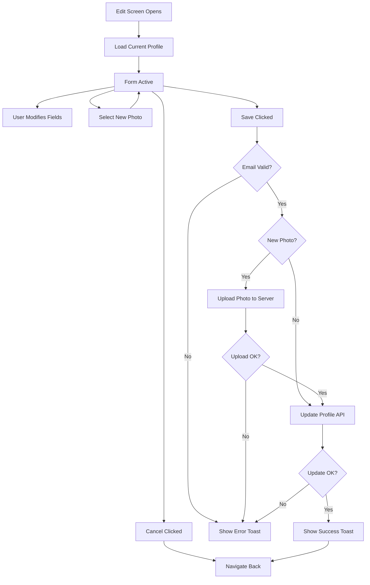
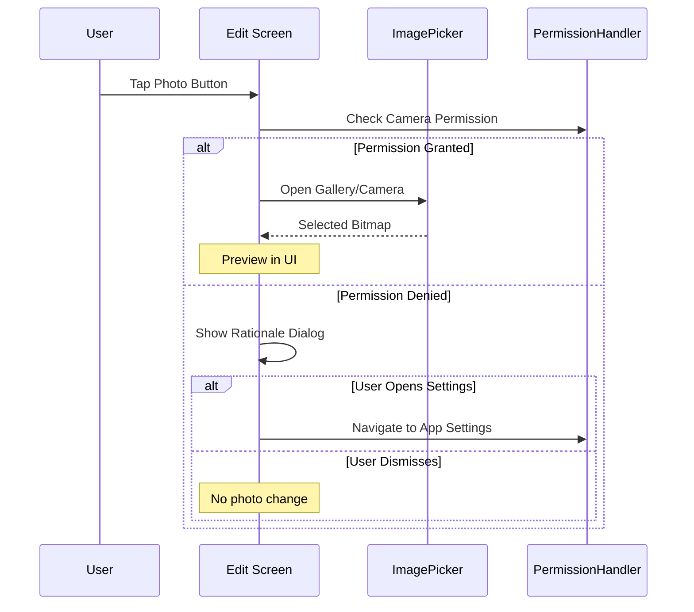

# Profile — Component Documentation

## Architecture Overview

The Profile feature follows the **Decompose + MVI** pattern across three main screens: Profile Menu (home tab), Profile Display (read-only view), and Profile Edit (editable form). The feature spans the `shared/home` and `shared/login` modules.

---

## Screen Inventory

| Screen | Module | Purpose | Entry From |
|--------|--------|---------|------------|
| **Profile Menu** | Home | Navigation drawer with profile card and menu items | Home tab |
| **Profile Display** | Login | Read-only view of profile details | Profile Menu |
| **Profile Edit** | Login | Editable form for profile fields | Profile Display |

---

## Profile Menu Screen

**Purpose:** Displays the user's profile card and menu items for navigating to various app features (wallet, tickets, settings, etc.).

### User Journey

1. User opens profile tab from home screen
2. Profile card shows photo, name, and user ID
3. Menu items displayed for various features
4. Tapping items navigates to respective screens

### Screen Layout

### Profile Page Items

| Item Type | Display Style | Examples |
|-----------|---------------|----------|
| **Profile** | Card | User photo, name, user ID |
| **Chalo Wallet** | Card | Balance display |
| **Tickets & Passes** | Card | Quick access |
| **Bus Stops Near Me** | List | Location feature |
| **SOS** | List | Emergency contact |
| **Customer Support** | List | Help/chat |
| **Change Language** | List | Language settings |

### Item Click Navigation

---

## Profile Display Screen

**Purpose:** Shows complete user profile information in read-only mode with options to edit, logout, or delete account.

### User Journey

1. User navigates from profile menu
2. Screen shows profile photo, name, contact info, DOB, gender
3. Edit button available in header
4. Menu provides logout and delete account options
5. Photo can be tapped to zoom

### Display Layout

| Section | Content |
|---------|---------|
| **Header** | Profile photo (zoomable), Edit button |
| **Identity** | First name, Last name |
| **Contact** | Phone number, Email |
| **Personal** | Date of birth, Gender |
| **Menu** | Logout, Delete Account |

### State Flow

### Profile Photo Zoom

When user taps profile photo:
1. Photo expands to full-screen overlay
2. Tap anywhere to dismiss
3. State tracked via `shouldZoomProfilePhoto`

---

## Profile Edit Screen

**Purpose:** Provides editable form for user profile fields with photo upload capability.

### User Journey

1. User taps Edit from display screen
2. Form pre-populated with current values
3. User can modify name, email, DOB, gender
4. User can select new profile photo
5. Save validates and updates profile
6. Cancel returns without changes

### Form Fields

| Field | Type | Validation |
|-------|------|------------|
| **First Name** | Text input | Required |
| **Last Name** | Text input | Required |
| **Email** | Text input | Format validation |
| **Phone** | Display only | Non-editable |
| **Date of Birth** | Date picker | Max: today, selectable range |
| **Gender** | Selection | Male, Female, Other |
| **Profile Photo** | Image picker | Optional |

### Edit Flow

### Dialog Types

| Dialog | Purpose | Trigger |
|--------|---------|---------|
| **Gender Selection** | Pick male/female/other | Tap gender field |
| **Date Picker** | Select date of birth | Tap DOB field |
| **Permission Rationale** | Explain camera permission need | Permission denied |

### Photo Selection Flow

---

## State Management

All screens follow the MVI pattern with DataState → ViewState transformation.

### Profile Display State

| State Field | Description |
|-------------|-------------|
| **firstName, lastName** | User's name |
| **profilePhotoUrl** | Photo URL |
| **gender** | Gender enum |
| **mobileNumber, emailId** | Contact info |
| **dobInMillis** | Date of birth (raw) |
| **dobString** | Date of birth (formatted) |
| **isLoading** | Operation in progress |
| **shouldShowLogoutFailedDialog** | Error state |
| **shouldZoomProfilePhoto** | Photo zoom state |
| **profileMenuItems** | Available menu actions |

### Profile Edit State

| State Field | Description |
|-------------|-------------|
| **firstName, lastName, emailId** | Editable text fields |
| **phoneNumber** | Display-only |
| **gender** | Selected gender |
| **dobInMillis** | Selected date |
| **profilePhotoUrl** | Existing photo URL |
| **newSelectedPhotoBitmap** | New photo (if selected) |
| **isLoading** | Save in progress |
| **dialogType** | Active dialog (gender/DOB/permission) |

### Intent Types

| Screen | Key Intents |
|--------|-------------|
| **Display** | EditClicked, LogoutClicked, DeleteClicked, PhotoClicked |
| **Edit** | FieldEntered (name, email), GenderSelected, DOBSelected, PhotoSelected, SaveClicked, CancelClicked |

---

## Navigation

### Entry Points

| Source | Destination | Args |
|--------|-------------|------|
| Home Profile Tab | Profile Display | UserProfileDisplayArgs |
| Profile Display | Profile Edit | UserProfileEditArgs |

### Exit Points

| Action | Destination | Nav Options |
|--------|-------------|-------------|
| Cancel Edit | Back to Display | GoBack() |
| Save Edit Success | Back to Display | GoBack() |
| Logout Success | Login Screen | ClearAll() |
| Delete Account | External WebView | After logout |

---

## Analytics Events

### Profile Display Events

| Event | Trigger |
|-------|---------|
| `user_profile_screen_refreshed` | Screen data loaded |
| `user_profile_edit_clicked` | Edit button tapped |
| `user_profile_logout_clicked` | Logout menu tapped |
| `user_profile_logout_result` | Logout completed |
| `user_profile_delete_clicked` | Delete confirmed |

### Profile Edit Events

| Event | Trigger |
|-------|---------|
| `user_profile_edit_screen_displayed` | Screen opened |
| `user_profile_edit_save_clicked` | Save tapped |
| `user_profile_edit_successful` | Update succeeded |
| `user_profile_edit_error` | Update failed |
| `user_profile_photo_clicked` | Photo button tapped |
| `user_profile_photo_uploaded_successfully` | Photo uploaded |
| `user_profile_gender_changed` | Gender selected |
| `user_profile_dob_changed` | DOB selected |

---

## Error Handling

| Scenario | UI Response |
|----------|-------------|
| **Invalid email format** | Validation error, blocks save |
| **Photo upload failed** | Toast error, allows retry |
| **Profile update failed** | Toast with error code |
| **Logout failed** | Error dialog with dismiss |
| **Session expired** | Force re-login |
