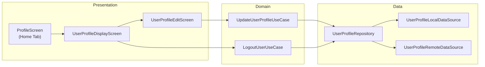

# Profile — High-Level Design

## Overview

The Profile feature enables users to view and manage their account information in the Chalo app. Users can view their profile details (name, photo, phone, email, DOB, gender), edit their information, manage profile photo, and perform account actions like logout and account deletion. The feature spans the `shared/login` and `shared/home` modules.

## User Journey

1. **Entry Points**:
   - Home screen → Profile tab
   - Navigation drawer → Profile menu item
   - Settings → Account section

2. **Core Flow**:
   - View profile information (display screen)
   - Edit profile details (edit screen)
   - Upload/change profile photo
   - Select gender and date of birth
   - Save changes to server
   - Logout or delete account

3. **Exit Points**:
   - Save → Returns to profile display with updated info
   - Cancel → Returns to profile display unchanged
   - Logout → Navigates to login screen
   - Delete account → Opens external URL for account deletion

## Architecture Diagram



## Key Components

| Component | Platform | File Path | Responsibility |
|-----------|----------|-----------|----------------|
| `ProfileScreenComponent` | Shared | `shared/home/.../home/ui/profile/ProfileScreenComponent.kt` | Home tab profile menu |
| `UserProfileDisplayComponent` | Shared | `shared/login/.../userprofile/ui/display/UserProfileDisplayComponent.kt` | Profile view screen |
| `UserProfileEditComponent` | Shared | `shared/login/.../userprofile/ui/edit/UserProfileEditComponent.kt` | Profile edit screen |
| `UpdateUserProfileUseCase` | Shared | `shared/login/.../userprofile/domain/UpdateUserProfileUseCase.kt` | Update profile business logic |
| `LogoutUserUseCase` | Shared | `shared/login/.../userprofile/domain/LogoutUserUseCase.kt` | Logout flow orchestration |
| `UserProfileRepository` | Shared | `shared/login/.../userprofile/data/repository/UserProfileRepository.kt` | Profile data access |

## Data Flow

### View Profile
1. `UserProfileDisplayComponent` initializes
2. Repository fetches profile from local storage
3. State populated with user info
4. UI displays profile card with photo, name, details

### Edit Profile
1. User taps "Edit" button
2. Navigation to `UserProfileEditScreen`
3. User modifies fields (name, gender, DOB, email)
4. User optionally selects new profile photo
5. "Save" triggers `UpdateUserProfileUseCase`
6. UseCase validates fields (DOB, required fields)
7. Repository updates server then local storage
8. Success → Navigate back with updated profile

### Logout
1. User taps "Logout" menu item
2. Confirmation dialog shown
3. `LogoutUserUseCase` orchestrates:
   - Sync wallet balance
   - Clear FCM tokens
   - Clear local database
   - Call logout API
   - Raise analytics event
4. Navigate to login screen

## Platform Differences

### Android-Specific
- `ConvertBitmapImageToByteArrayUseCase` — Handles bitmap conversion for photo upload
- Uses Android `ContentResolver` for gallery image selection
- Material3 dialogs for date picker and gender selection

### iOS-Specific
- Uses SwiftUI photo picker via SKIE interop
- Native iOS date picker
- Platform-specific image handling

## Integration Points

### Analytics Events
- `user_profile_screen_refreshed`
- `user_profile_edit_clicked`
- `user_profile_logout_clicked` / `user_profile_logout_result`
- `user_profile_edit_save_clicked` / `user_profile_edit_successful`
- `user_profile_photo_changed`
- `user_profile_gender_changed`
- `user_profile_dob_changed`
- `user_profile_delete_clicked`

### Shared Services
- **Auth**: Token management during logout
- **Storage**: DataStore for local profile persistence
- **FCM**: Token cleanup on logout
- **Wallet**: Balance sync before logout

### Navigation
- **Navigates to**: Edit profile, WebView (delete account URL)
- **Navigated from**: Home screen, Settings

## Edge Cases & Error Handling

| Scenario | Handling |
|----------|----------|
| Invalid DOB | Shows validation error, blocks save |
| Photo upload failed | Shows toast, profile saved without photo |
| Server error on save | Shows error dialog, retains local changes |
| Logout failed | Shows retry dialog |
| Session expired | Forces re-login |

## Data Models

### UserProfileAppModel
```kotlin
data class UserProfileAppModel(
    val firstName: String,
    val lastName: String,
    val profilePhoto: String,
    val gender: Gender,
    val mobileNumber: String,
    val countryCode: String,
    val dobInMillis: Long?,
    val emailId: String,
    val userId: String
)
```

### Gender Enum
```kotlin
enum class Gender {
    MALE, FEMALE, OTHER, NULL
}
```

## Dependencies

### Internal
- `shared:chalo-base` — Base models, Gender enum, profile storage
- `shared:network` — API calls
- `shared:vault` — Secure token storage

### External
- DataStore — Local profile persistence
- Coil — Profile photo loading
