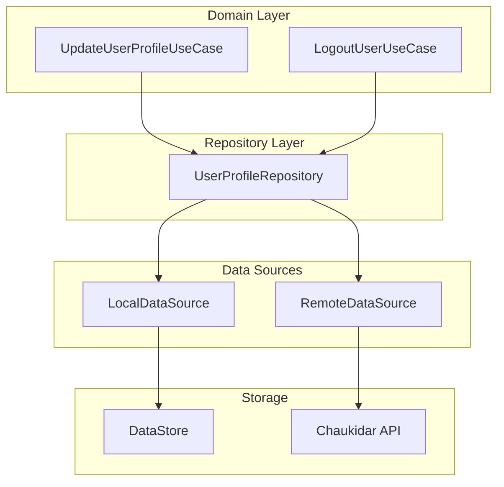
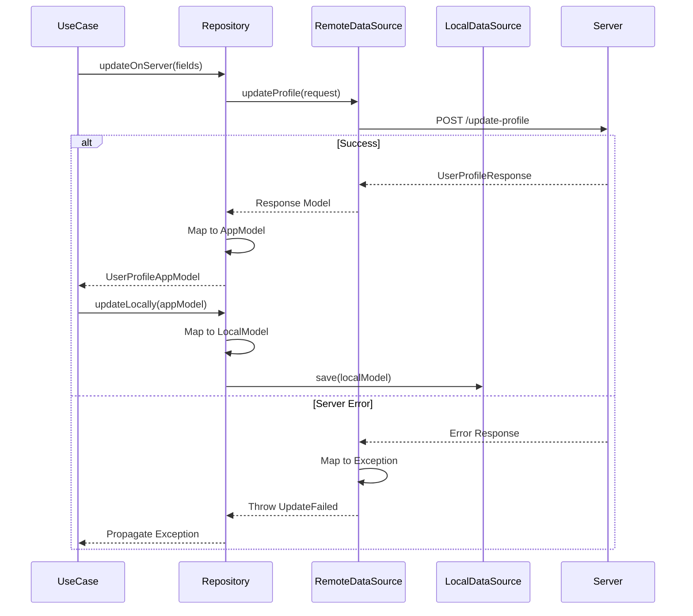
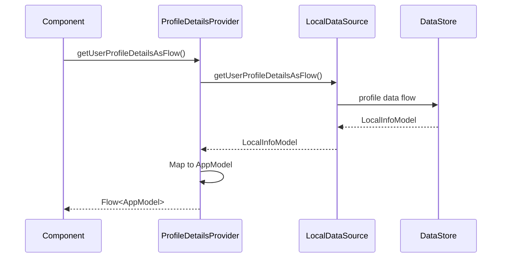
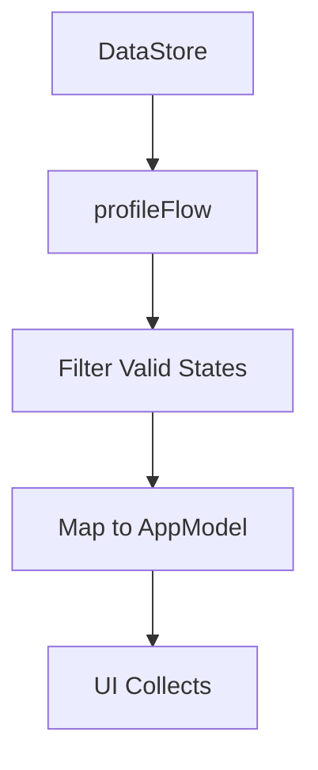
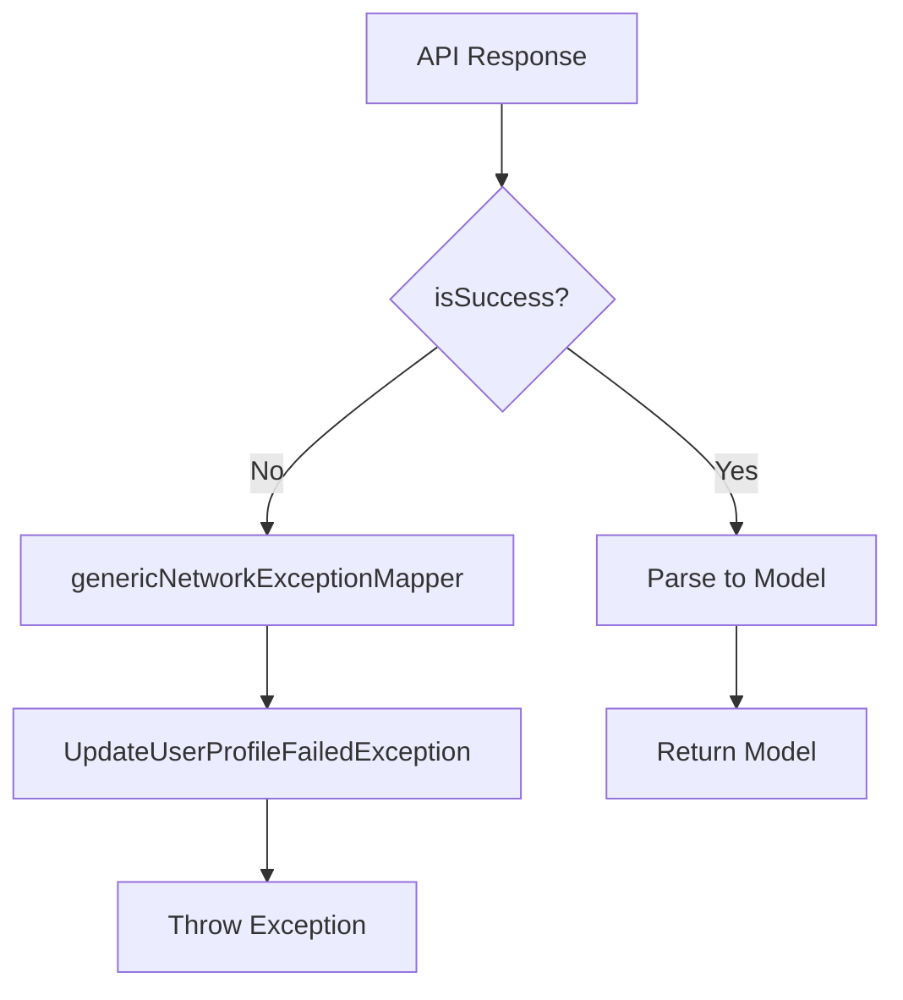
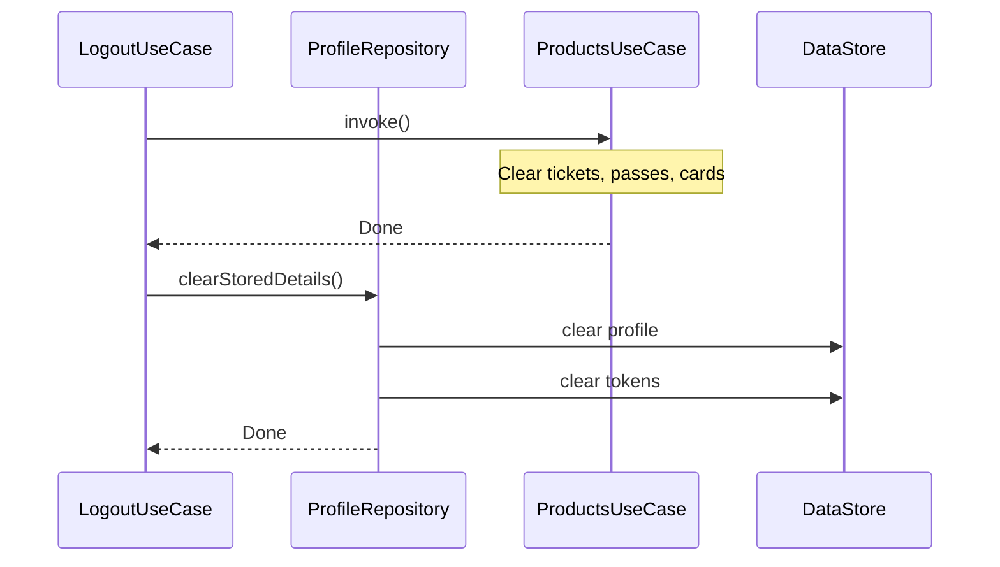
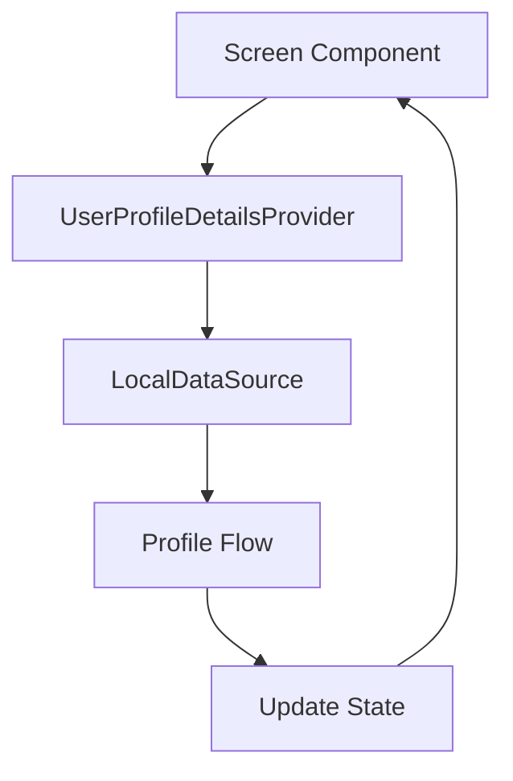
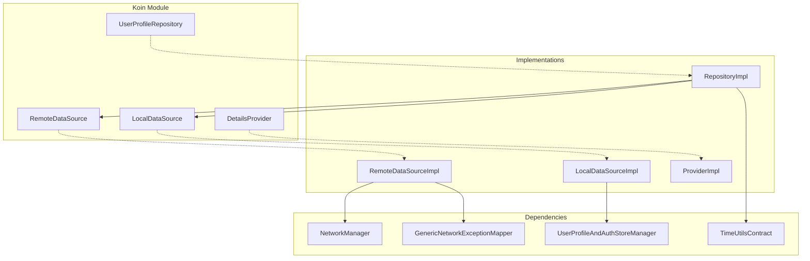

# Profile — Repository Documentation

## Data Layer Overview

The data layer handles profile data persistence and synchronization. It follows the **Repository Pattern** with separate remote and local data sources.

---

## Repository Operations

| Operation | Description | Data Flow |
|-----------|-------------|-----------|
| **updateUserProfileOnServer** | Sync profile changes to server | Remote → Transform → Return |
| **updateUserProfileLocally** | Persist profile to local storage | Transform → Local |
| **getUserProfileDetails** | Read profile from local storage | Local → Transform → Return |
| **clearStoredUserProfileAndAuthTokensDetails** | Wipe all auth data | Local |
| **isUserLoggedIn** | Stream login state | Local → Flow |

---

## API Endpoints

### Update Profile

Updates user profile on the server.

| Property | Value |
|----------|-------|
| **Endpoint** | `chaukidar/v1/app/user/update-profile` |
| **Method** | POST |
| **Auth** | Required (Secure API Headers) |
| **Content-Type** | application/json |

**Request Body:**

| Field | Type | Required | Description |
|-------|------|----------|-------------|
| **userId** | String | Yes | User identifier |
| **firstName** | String | Yes | First name |
| **lastName** | String | Yes | Last name |
| **profilePhoto** | String | No | Photo URL |
| **gender** | String | No | "male", "female", "other" |
| **dateOfBirth** | Long | No | Epoch milliseconds |
| **emailId** | String | No | Email address |

**Response:**

| Field | Type | Description |
|-------|------|-------------|
| **firstName** | String? | Updated first name |
| **lastName** | String? | Updated last name |
| **profilePhoto** | String? | Photo URL |
| **gender** | String? | Gender string |
| **mobileNumber** | String? | Phone number |
| **countryCode** | String? | Country code |
| **dateOfBirth** | Long? | DOB in milliseconds |
| **emailId** | String? | Email address |
| **userId** | String? | User identifier |

---

## Data Flow

### Update Profile Flow

### Read Profile Flow

---

## Data Transformations

### API Response → App Model

| API Field | App Field | Transformation |
|-----------|-----------|----------------|
| `firstName` | firstName | Direct (empty if null) |
| `lastName` | lastName | Direct (empty if null) |
| `profilePhoto` | profilePhoto | Direct (empty if null) |
| `gender` | gender | Parse string to Gender enum |
| `mobileNumber` | mobileNumber | Direct (empty if null) |
| `countryCode` | countryCode | Direct (empty if null) |
| `dateOfBirth` | dobInMillis | Direct |
| `emailId` | emailId | Direct (empty if null) |
| `userId` | userId | Direct (empty if null) |

### App Model → Local Model

| App Field | Local Field | Transformation |
|-----------|-------------|----------------|
| userId | userId | Direct |
| firstName | firstName | Direct |
| lastName | lastName | Direct |
| gender | gender | Gender.value string |
| dobInMillis | dobInMillis | Direct |
| dobInMillis | dateOfBirth | Format via TimeUtilsContract |
| emailId | mailId | Direct |
| mobileNumber | mobileNumber | Direct |
| profilePhoto | profilePhoto | Direct |
| countryCode | countryCallingCode | Direct |

### Local Model → App Model

| Local Field | App Field | Transformation |
|-------------|-----------|----------------|
| userId | userId | Direct |
| firstName | firstName | Null coalesce to empty |
| lastName | lastName | Null coalesce to empty |
| gender | gender | Parse via Gender.fromString() |
| dobInMillis | dobInMillis | Direct |
| mailId | emailId | Null coalesce to empty |
| mobileNumber | mobileNumber | Direct |
| profilePhoto | profilePhoto | Null coalesce to empty |
| countryCallingCode | countryCode | Null coalesce to empty |

---

## Local Storage

### Storage Mechanism

Profile data is stored using Android DataStore (key-value) wrapped by `UserProfileAndAuthStoreManager`.

### Stored Data

| Data | Description |
|------|-------------|
| **User Profile** | All profile fields |
| **Auth Tokens** | Access and refresh tokens |
| **Country Config** | Phone number format config |

### Reactive Access

Local storage provides Flow-based access:

### Login State

Login state is derived from stored profile:

| Check | Result |
|-------|--------|
| userId != null | Logged in |
| userId == null | Logged out |

---

## Exception Handling

### Error Mapping Flow

### Exception Types

| Exception | Cause | Contains |
|-----------|-------|----------|
| **UpdateUserProfileFailedException** | Server returned error | Error code + message |
| **ChaloLocalException** | Local storage error | Exception details |
| **NetworkSuccessResponseParseException** | Invalid JSON | Parse error |
| **InvalidProfileDetails** | Response missing required fields | — |

### Server Error Codes

| Code | Meaning |
|------|---------|
| 1004 | Invalid date of birth |
| 3000 | User does not exist |
| 3105 | User ID mismatch |

---

## Logout Cleanup

### Data Cleared on Logout

| Data | Method |
|------|--------|
| User profile | clearStoredUserProfileAndAuthTokensDetails() |
| Auth tokens | Same method |
| FCM tokens | Separate FCM feature |
| Product data | ClearProductStoresAndDatabaseUseCase |

### Cleanup Sequence

---

## User Profile Details Provider

A shared provider gives reactive access to profile data across the app.

### Provider Interface

| Method | Return | Description |
|--------|--------|-------------|
| **getUserProfileDetailsAsFlow** | Flow<Pair<AppModel?, Boolean>> | Profile with validity flag |
| **getUserIdAsync** | String? | Synchronous user ID |
| **isLoggedIn** | StateFlow<Boolean> | Login state stream |

### Usage Pattern

---

## Dependency Injection

### Koin Bindings

| Interface | Implementation |
|-----------|----------------|
| UserProfileRepository | UserProfileRepositoryImpl |
| UserProfileRemoteDataSource | UserProfileRemoteDataSourceImpl |
| UserProfileLocalDataSource | UserProfileLocalDataSourceImpl |
| UserProfileDetailsProvider | UserProfileDetailsProviderImpl |

### Dependency Graph

---

## Security

### Data Protection

| Aspect | Implementation |
|--------|----------------|
| **Token Storage** | Encrypted via Vault |
| **Profile Storage** | DataStore with encryption |
| **Transport** | HTTPS only |
| **Headers** | Secure API headers on all requests |

### Logout Security

- All auth tokens cleared
- Profile data wiped
- FCM tokens invalidated
- Server notified (best effort)

---

## Error Handling Summary

| Scenario | Exception | User Impact |
|----------|-----------|-------------|
| Network failure | ChaloLocalException | "Check connection" |
| Server error (4xx/5xx) | UpdateUserProfileFailedException | Error message shown |
| Invalid JSON | NetworkSuccessResponseParseException | "Something went wrong" |
| Invalid profile response | InvalidProfileDetails | "Something went wrong" |
| Storage failure | ChaloLocalException | Retry or re-login |
