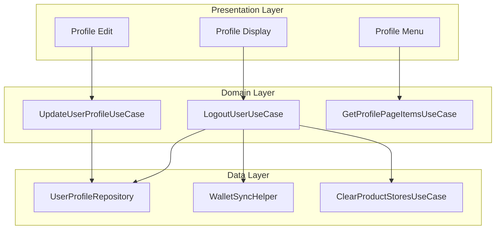
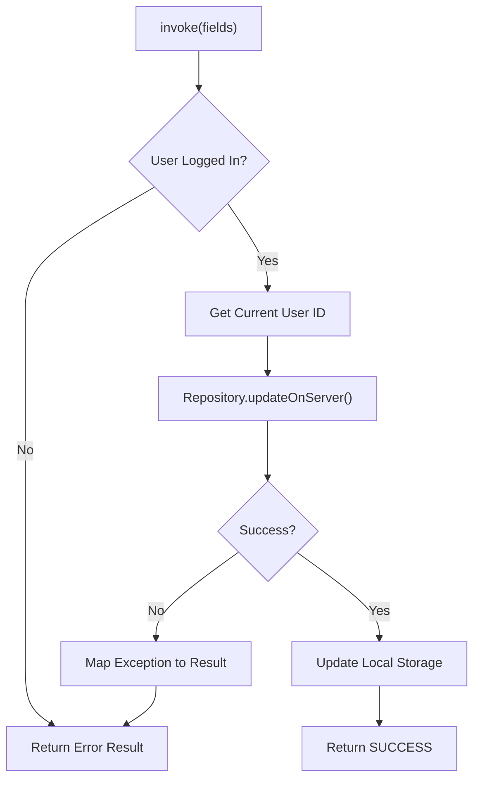
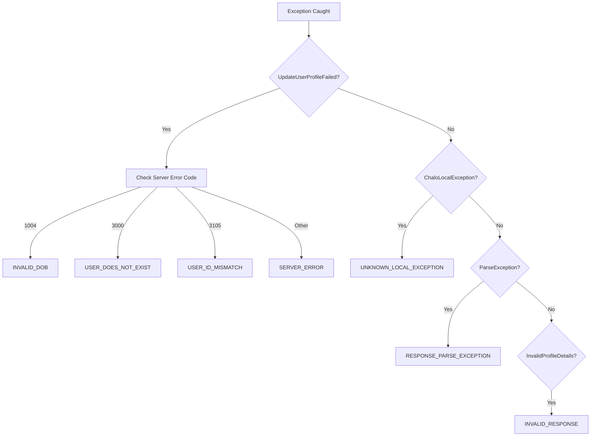
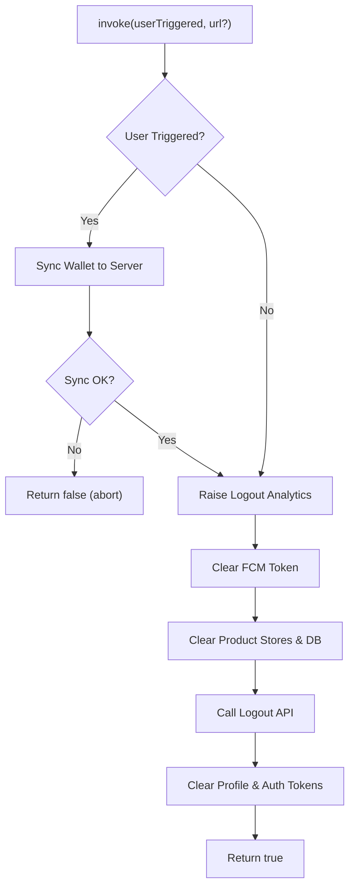
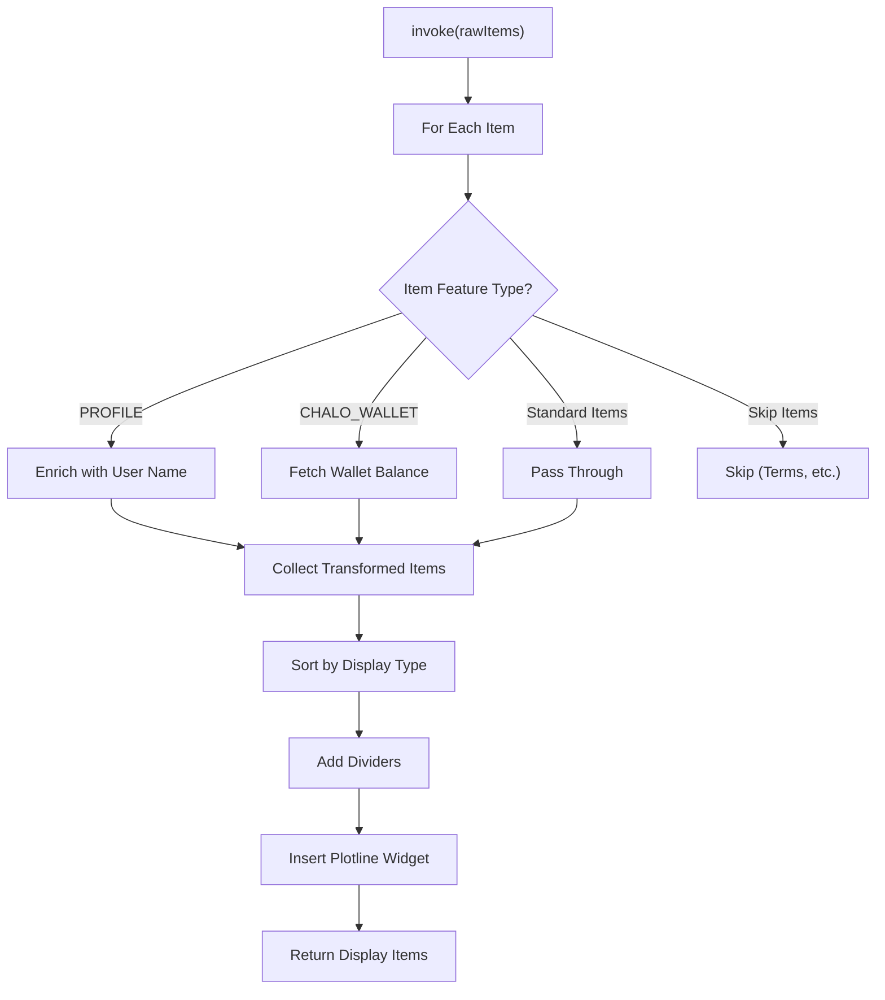
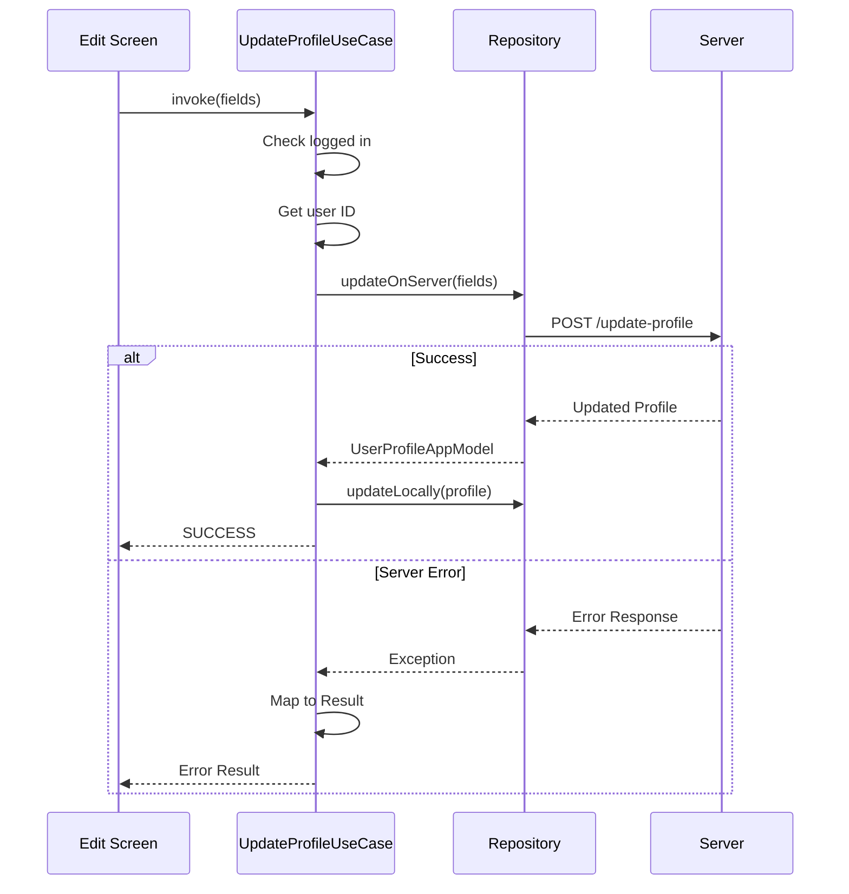
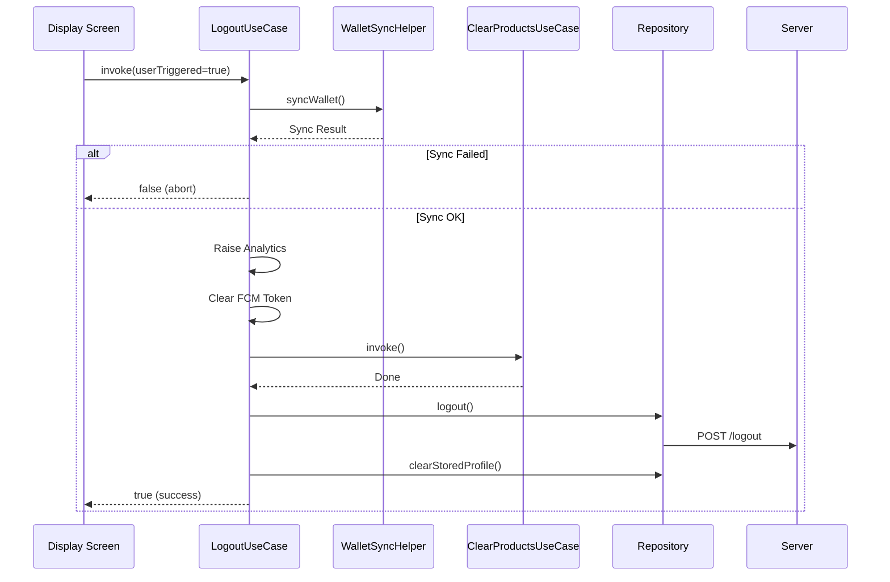

# Profile — UseCase Documentation

## Domain Layer Overview

The domain layer handles profile update logic, logout orchestration, and profile page item transformation. Use cases validate inputs, coordinate data operations, and map errors to user-friendly results.

---

## Use Case Inventory

| Use Case | Purpose | Called From |
|----------|---------|-------------|
| **UpdateUserProfile** | Validate and save profile changes | Edit Screen |
| **LogoutUser** | Orchestrate logout cleanup | Display Screen |
| **GetProfilePageItems** | Transform and enrich menu items | Profile Menu |

---

## Update User Profile

**Responsibility:** Validates profile fields, coordinates server update, and handles error mapping.

### Update Flow

### Input Parameters

| Parameter | Type | Required | Validation |
|-----------|------|----------|------------|
| **firstName** | String | Yes | Non-empty |
| **lastName** | String | Yes | Non-empty |
| **profilePhotoUrl** | String? | No | Valid URL if present |
| **gender** | Gender? | No | MALE, FEMALE, OTHER, or null |
| **dateOfBirthInMillis** | Long? | No | Not in future |
| **emailId** | String? | No | Email format if present |

### Result Types

| Result | Meaning | Error Code |
|--------|---------|------------|
| **PROFILE_UPDATED_SUCCESSFULLY** | Update complete | — |
| **USER_NOT_LOGGED_IN** | No active session | 200 |
| **INVALID_DOB** | Date of birth invalid | 201 |
| **USER_DOES_NOT_EXIST** | User ID not found | 202 |
| **USER_ID_MISMATCH** | Token user != request user | 203 |
| **UNKNOWN_LOCAL_EXCEPTION** | Local storage error | 204 |
| **SERVER_ERROR** | Generic server failure | 205 |
| **RESPONSE_PARSE_EXCEPTION** | Response parsing failed | 206 |
| **INVALID_RESPONSE** | Missing required fields | 207 |

### Error Mapping

---

## Logout User

**Responsibility:** Orchestrates complete logout including wallet sync, product cleanup, token clearing, and analytics.

### Logout Flow

### Parameters

| Parameter | Type | Purpose |
|-----------|------|---------|
| **userTriggeredLogout** | Boolean | Distinguishes manual from auto-logout |
| **url** | String? | Account deletion URL for analytics |

### User-Triggered vs Auto-Logout

| Aspect | User-Triggered | Auto-Logout |
|--------|---------------|-------------|
| **Wallet sync** | Required (blocks if fails) | Skipped |
| **Trigger example** | Logout menu | Token refresh failure |
| **Failure behavior** | Abort logout | Continue anyway |

### Cleanup Operations

| Step | Operation | Failure Handling |
|------|-----------|------------------|
| 1 | Sync wallet balance | Blocks logout if fails |
| 2 | Clear FCM token | Best effort |
| 3 | Clear product stores | Best effort |
| 4 | Call logout API | Logged to Crashlytics |
| 5 | Clear local profile | Always executes |

### Analytics Event

Logout event includes:

| Property | Description |
|----------|-------------|
| **user_id** | User being logged out |
| **session_logout** | Whether user-triggered |
| **url** | Deletion URL (if applicable) |

---

## Get Profile Page Items

**Responsibility:** Transforms raw profile page items into display-ready data with enrichment (user info, wallet balance, sorting).

### Transformation Flow

### Item Types and Handling

| Feature Type | Handling |
|--------------|----------|
| **PROFILE** | Fetch user name from provider, set as title |
| **CHALO_WALLET** | Fetch balance, format currency string |
| **TICKETS_PASSES** | Pass through with icon |
| **BUS_STOPS_NEAR_ME** | Pass through with icon |
| **SOS** | Pass through with icon |
| **CUSTOMER_SUPPORT** | Pass through with icon |
| **CHANGE_LANGUAGE** | Pass through with icon |
| **TERMS_CONDITIONS** | Skipped |
| **UNKNOWN** | Skipped |

### Sorting Order

Items are sorted by display type:

1. All CARD items first (Profile, Wallet, Tickets)
2. DIVIDER
3. All LIST items (Settings, Support, etc.)
4. DIVIDER

### Plotline Widget Integration

If a Plotline widget is configured:
1. Extract from raw items as metadata
2. Insert at specified position index
3. Widget renders as a promotional card

---

## Domain Models

### User Profile Model

| Field | Type | Description |
|-------|------|-------------|
| **firstName** | String | First name |
| **lastName** | String | Last name |
| **profilePhoto** | String | Photo URL |
| **gender** | Gender | MALE, FEMALE, OTHER, NULL |
| **mobileNumber** | String | Phone number |
| **countryCode** | String | Country code |
| **dobInMillis** | Long? | Date of birth (epoch ms) |
| **emailId** | String | Email address |
| **userId** | String | Unique user identifier |

### Gender Enum

| Value | Display | API Value |
|-------|---------|-----------|
| **MALE** | "Male" | "male" |
| **FEMALE** | "Female" | "female" |
| **OTHER** | "Other" | "other" |
| **NULL** | — | "" |

### Profile Display Item

| Field | Type | Description |
|-------|------|-------------|
| **title** | String | Display text |
| **description** | String? | Subtitle text |
| **icon** | ImageResource | Leading icon |
| **displayType** | Enum | CARD or LIST |
| **featureType** | Enum | Feature identifier |

---

## Business Rules

| Rule | Description | Enforced By |
|------|-------------|-------------|
| **Login required** | Profile operations need active session | Update UseCase |
| **Wallet sync before logout** | User-triggered logout syncs wallet first | Logout UseCase |
| **DOB validation** | Server validates DOB is reasonable | Server (code 1004) |
| **User ID match** | Token user must match request user | Server (code 3105) |
| **Graceful cleanup** | Logout continues despite API failures | Logout UseCase |

---

## Sequence Diagrams

### Profile Update Sequence

### Logout Sequence

---

## Error Handling

### Server Error Codes

| Code | Meaning | Mapped To |
|------|---------|-----------|
| 1004 | Invalid date of birth | INVALID_DOB |
| 3000 | User does not exist | USER_DOES_NOT_EXIST |
| 3105 | User ID mismatch | USER_ID_MISMATCH |

### Client Error Codes

| Code | Meaning | Cause |
|------|---------|-------|
| 200 | Not logged in | Session expired |
| 204 | Local exception | Storage failure |
| 206 | Parse exception | Bad response JSON |
| 207 | Invalid response | Missing required fields |
