# Report Problem — Component Documentation

## Architecture Overview

The Report Problem presentation layer implements an MVI (Model-View-Intent) architecture using Decompose's `ChaloBaseStateMviComponent`. The feature provides a unified customer support experience through a categorized problem list that routes users to Freshchat FAQ articles, categories, or live chat. The component manages state transformations, Freshchat integration, pass reclamation dialogs, and network connectivity monitoring.

The actual implementation resides in `shared/home/src/commonMain/kotlin/app/chalo/reportproblem/` with the following key files:

| File | Path | Purpose |
|------|------|---------|
| ReportProblemComponent.kt | shared/home/.../reportproblem/ | MVI component with state management |
| ReportProblemContract.kt | shared/home/.../reportproblem/ | Data state, view state, intents, side effects |
| ReportProblemScreen.kt | shared/home/.../reportproblem/ | Composable UI rendering |

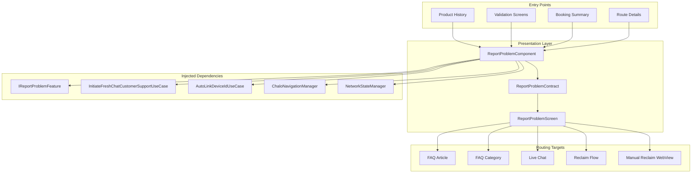

---

## ReportProblemComponent

The component extends `ChaloBaseStateMviComponent` and manages the complete report problem flow. It receives `ReportProblemArgs` containing problem collection data, user properties for Freshchat context, and optional support contact numbers.

### Constructor Dependencies

The component receives twelve dependencies through constructor injection, reflecting its role as an orchestrator across multiple subsystems:

| Dependency | Type | Purpose |
|------------|------|---------|
| componentContext | ComponentContext | Decompose lifecycle management |
| args | ReportProblemArgs | Navigation arguments with problem data |
| reportProblemFeature | IReportProblemFeature | Problem data management |
| autoLinkDeviceIdUseCase | AutoLinkDeviceIdUseCase | Pass reclamation API |
| stringProvider | StringProvider | Localized string resolution |
| navigationManager | ChaloNavigationManager | Screen navigation |
| toastManager | KotlinToastManager | Toast message display |
| analyticsContract | AnalyticsContract | Analytics event tracking |
| initiateProductHistorySyncCallUseCase | InitiateProductHistorySyncCallUseCase | Product refresh after reclaim |
| chaloConfigFeature | ChaloConfigFeature | Remote config access |
| userProfileDetails | UserProfileDetailsProvider | User profile data |
| systemHelper | SystemHelper | Platform utilities (dialer) |
| networkStateManager | NetworkStateManager | Network connectivity state |
| initiateFreshChatCustomerSupportUseCase | InitiateFreshChatCustomerSupportUseCase | Freshchat routing |

### Initialization Flow

On component creation, two operations occur immediately:

1. **InitFreshChat Intent**: Processes navigation arguments, extracts problem collection, and initializes state
2. **Network Monitoring**: Subscribes to `NetworkStateManager.networkState` flow to track connectivity

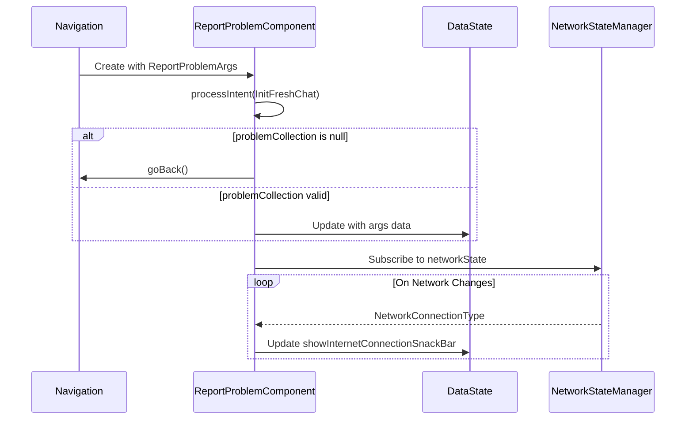

### State Management

The component uses two distinct state classes defined in `ReportProblemContract.kt`:

**ReportProblemDataState** holds the raw business data:

| Field | Type | Default | Description |
|-------|------|---------|-------------|
| isLoading | Boolean | false | Loading indicator visibility |
| problemCollection | ReportProblemCollection? | null | Current problem collection |
| userPropertiesMap | MutableMap<String, String> | empty | Freshchat user context |
| additionalProblemCategoryList | List<ReportProblemFeatureCategory>? | null | Source-specific extra categories |
| supportContactNumber | String? | null | Phone support number |
| showReclaimRequestDialog | Boolean | false | Reclaim confirmation dialog |
| showReclaimResponseDialog | Boolean | false | Reclaim result dialog |
| isAutolinkSuccessful | Boolean | false | Auto-link API result |
| showInternetConnectionSnackBar | Boolean | false | Offline indicator |

**ReportProblemViewState** is derived from DataState through `convertToUiState()`:

| Field | Type | Description |
|-------|------|-------------|
| loader | LoadingDialogUIState? | Loading overlay |
| toolbar | ToolbarUIState? | App bar with title and actions |
| problemCollection | List<ProblemListUIState> | Rendered problem categories |
| reclaimRequestDialog | ConfirmationDialogUiState? | Reclaim confirmation |
| reclaimResponseDialog | ConfirmationDialogUiState? | Reclaim result |
| snackbarUIState | SnackbarUIState? | Network error snackbar |
| backPressedEventHandler | UiEventHandler | Back navigation handler |

---

## Intent Processing

The component processes ten distinct intents through its `processIntent()` method. Each intent maps to a dedicated handler method:

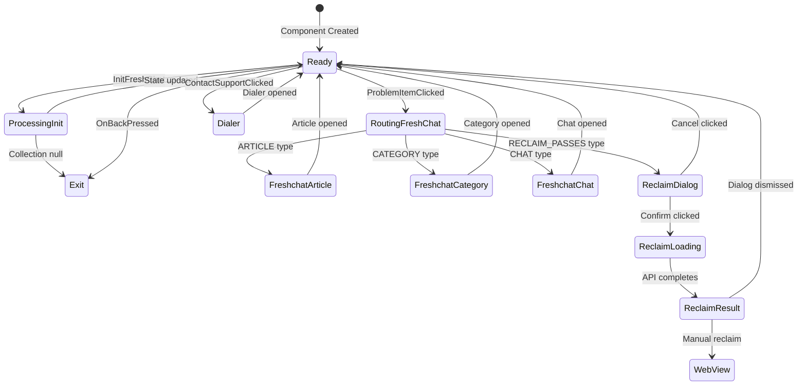

### Intent Details

| Intent | Parameters | Handler Action |
|--------|------------|----------------|
| InitFreshChat | args: ReportProblemArgs | Validate collection, update state or navigate back |
| ProblemItemClicked | problem: ReportProblemFeatureProblem | Route based on ctaType, track analytics |
| ReclaimRequestDialogPositiveBtnClicked | none | Start auto-link flow |
| ReclaimRequestDialogNegativeBtnClicked | none | Dismiss reclaim request dialog |
| ReclaimResponseDialogPositiveBtnClickedWithAutoLink | none | Dismiss dialog, navigate back |
| ReclaimResponseDialogPositiveBtnClickedWithoutAutoLink | none | Open manual reclaim WebView |
| ReclaimResponseDialogNegativeBtnClicked | none | Dismiss reclaim response dialog |
| ContactSupportClicked | contact: String | Open phone dialer |
| OnBackPressed | none | Navigate back |
| InternetConnectionIntent | currentNetworkConnectionType | Update snackbar visibility |

### Problem Item Click Handling

When a user taps a problem item, the `handleProblemItemClicked` method routes based on the problem's `ctaType`:

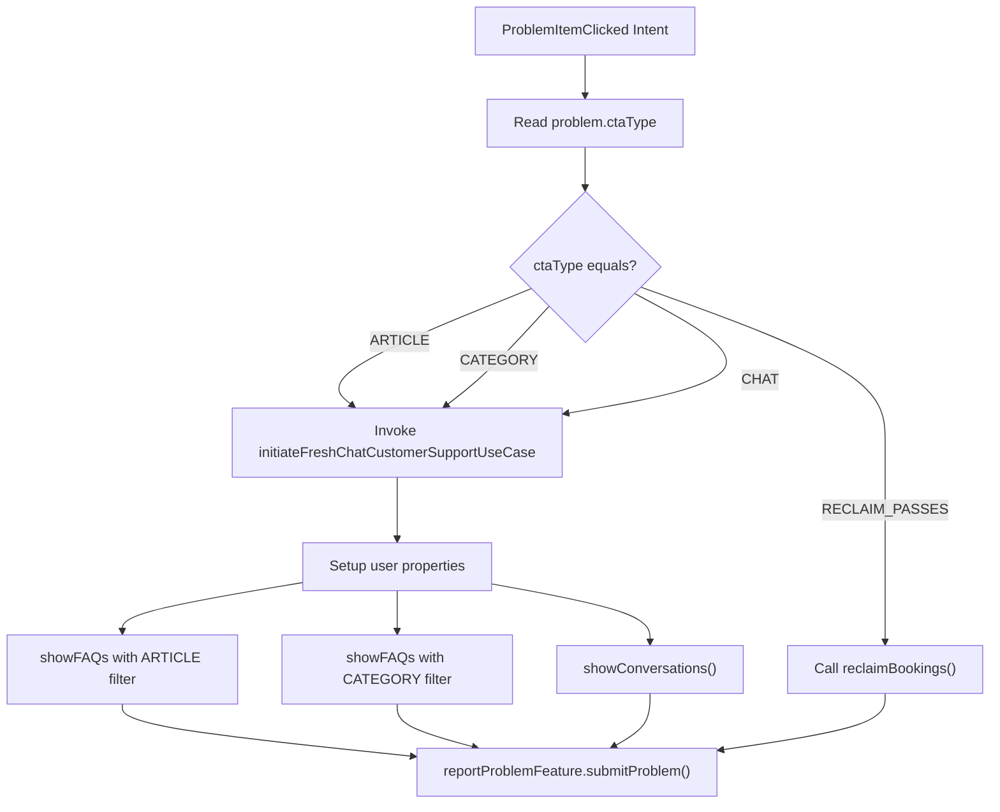

The `InitiateFreshChatCustomerSupportUseCase` is invoked with four parameters:
- `faqTitle`: The problem collection title
- `isChatEnabled`: Whether chat is available (based on chatGroupTag presence)
- `problem`: The selected problem definition
- `userPropertiesMap`: Context properties for Freshchat

---

## Pass Reclamation Flow

The reclaim flow handles pass recovery when users switch devices. It involves multiple dialog states and an auto-link API call.

### Reclaim State Machine

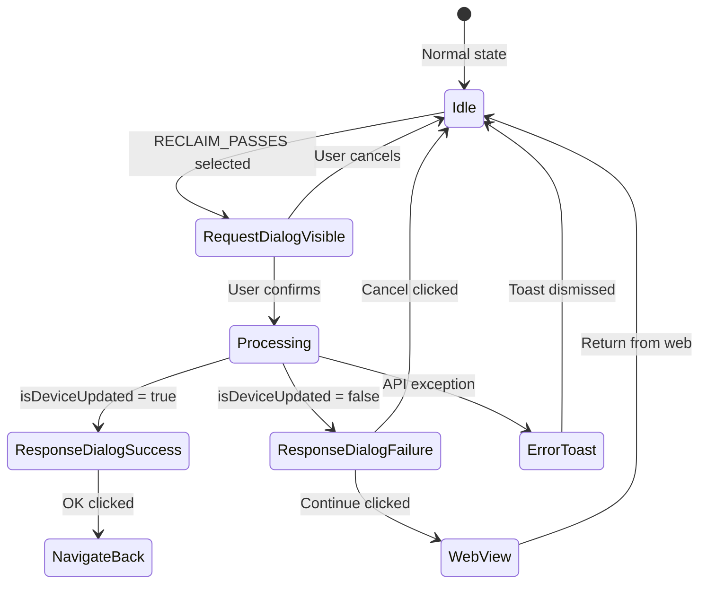

### Auto-Link API Call

The `handleReclaimRequestDialogPositiveBtnClicked` method orchestrates the reclaim flow:

1. **Hide dialog, show loader**: State updated with `showReclaimRequestDialog = false`, `isLoading = true`
2. **Call auto-link API**: `autoLinkDeviceIdUseCase.invoke()` returns `ChaloUseCaseResult`
3. **Handle success**: If `isDeviceUpdated` is true, trigger product sync via `initiateProductHistorySyncCallUseCase`
4. **Update state**: Set `isAutolinkSuccessful`, show response dialog
5. **Track analytics**: Fire `auto reclaim passes response` event

### Manual Reclaim WebView

When auto-link fails or indicates device was not updated, users can opt for manual reclaim through a web form. The `reclaimMagicPassesHandler` method constructs the URL:

```
{remote_config_reclaim_url}?userName={fullName}&mobileNo={phoneNumber}
```

The URL is fetched from Firebase Remote Config using key `REMOTE_CONFIG_RECLAIM_REQUEST_URL_KEY`.

---

## ReportProblemScreen

The screen is a Composable function that subscribes to the component's view state and renders the UI. It uses the standard Chalo design system components.

### UI Structure

```mermaid
flowchart TD
    subgraph Screen["ReportProblemScreen"]
        BackHandler["BackHandler"]
        Content["ReportProblemScreenContent"]
    end

    subgraph Content
        Loader["ChaloLoadingDialog (conditional)"]
        Column["Column Layout"]
        Snackbar["ReportProblemSnackBar (conditional)"]
        ReclaimReqDialog["ChaloConfirmationDialog (conditional)"]
        ReclaimRespDialog["ChaloConfirmationDialog (conditional)"]
    end

    subgraph Column
        Toolbar["ChaloToolBar"]
        List["LazyColumn"]
    end

    subgraph List
        CategorySection["Category Section (repeated)"]
    end

    subgraph CategorySection
        CategoryTitle["ChaloTextView (category name)"]
        ProblemItems["Problem Items (repeated)"]
    end

    subgraph ProblemItems
        ProblemText["ChaloTextView (clickable)"]
        Divider["Divider"]
    end

    Screen --> BackHandler
    Screen --> Content
```

### Problem List Rendering

The `setupProblemsView()` method in the component transforms data state into UI state:

1. Merge additional categories with base categories (additional first)
2. Map each category to `ProblemListUIState`
3. Map each problem to `ProblemUIState` with click handler

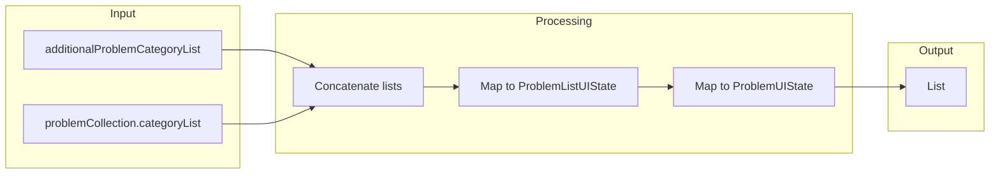

### UI State Classes

**ProblemListUIState** represents a category section:

| Field | Type | Description |
|-------|------|-------------|
| specs | ProblemListUISpecs | Padding and background styling |
| categoryTitle | ChaloTextUIState | Category header text |
| problemList | List<ProblemUIState> | Problems in this category |
| itemDivider | DividerUIState | Divider between problems |

**ProblemUIState** represents a single problem item:

| Field | Type | Description |
|-------|------|-------------|
| description | ChaloTextUIState | Problem display text |
| clickHandler | UiEventHandler | Tap action dispatcher |

### Toolbar Actions

The toolbar displays a phone icon when `supportContactNumber` is provided. The action is configured in `getToolBarActionState()`:

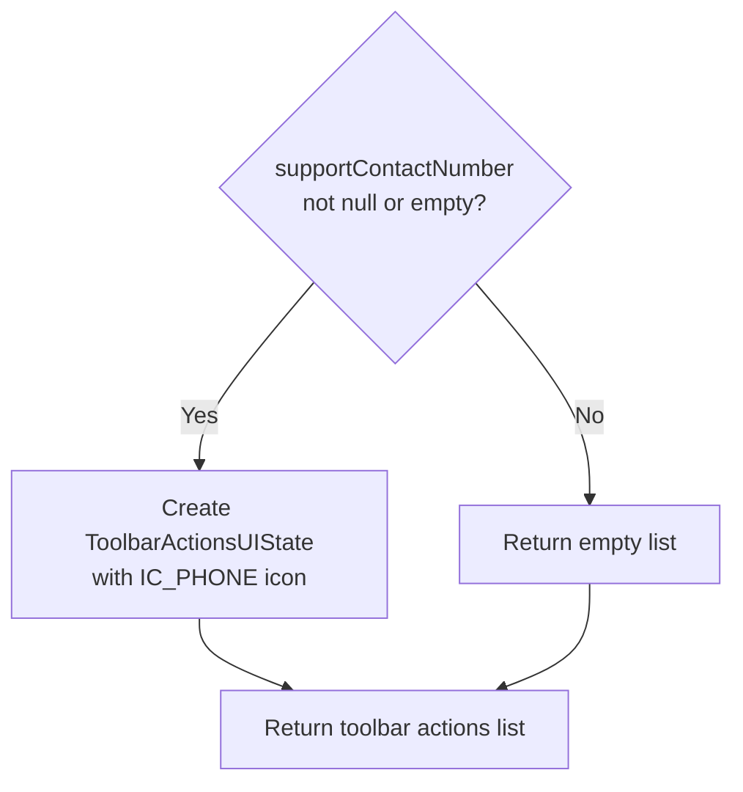

---

## Navigation Arguments

The `ReportProblemArgs` data class carries all context needed to display the report problem screen:

| Field | Type | Required | Description |
|-------|------|----------|-------------|
| problemCollection | ReportProblemCollection? | No* | Pre-configured problem set |
| source | String | Yes | Source screen identifier |
| userPropertiesMap | MutableMap<String, String> | Yes | Freshchat user context |
| additionalProblemCategoryList | List<ReportProblemFeatureCategory>? | No | Extra categories for source |
| supportContactNumber | String? | No | Phone support number |

*Note: If `problemCollection` is null, the component navigates back immediately.

### Source Constants

Problem sources are defined in `ReportProblemFeatureConstants`:

| Constant | Value | Origin Screen |
|----------|-------|---------------|
| SRC_ACTIVE_MTICKET_SCREEN | "activeMticketScreen" | Active M-Ticket display |
| SRC_VALIDATION_SCREEN | "validationScreen" | Ticket validation |
| SRC_BLE_SCREEN | "bleScreen" | BLE connection |
| SRC_PRODUCT_HISTORY_SCREEN | "activatePassScreen" | Product history |
| SRC_MTICKET_BOOKING_SUMMARY_SCREEN | "mticketBookingSummaryScreen" | M-Ticket summary |
| SRC_PREMIUM_BOOKING_SUMMARY_SCREEN | "premiumBookingSummaryScreen" | Premium bus summary |

---

## Validation Report Problem Managers

Multiple product types implement `ProductValidationReportProblemManager` to provide context-specific problem data. These managers are used during ticket validation flows.

### Interface Definition

```kotlin
interface ProductValidationReportProblemManager {
    fun getValidationReportProblemData(
        productValidationData: ProductValidationData,
        regularBusValidationScreen: RegularBusValidationScreen
    ): ReportProblemFeatureData
}
```

### Implementations

| Manager | Module | Product Type |
|---------|--------|--------------|
| MTicketValidationReportProblemManager | shared/home | M-Ticket |
| MetroTicketValidationReportProblemManager | shared/home | Metro tickets |
| SuperPassProductValidationReportProblemManager | shared/home | Super Pass |
| QuickPayTicketProductValidationReportProblemManager | shared/wallet | Quick Pay |
| InstantTicketValidationReportProblemManager | shared/productbooking | Instant tickets |
| OndcTicketValidationReportProblemManager | shared/home | ONDC tickets |
| OndcMetroTicketValidationReportProblemManager | shared/home | ONDC Metro |
| PremiumReserveTicketValidationReportProblemManager | shared/home | Premium reserved |

All implementations return `ReportProblemFeatureData` with:
- `collectionId`: Usually `TRANSACTION_RELATED_SCREEN`
- `source`: From validation screen context
- `userPropertiesMap`: Product-specific properties
- `areAdditionalProblemsRequired`: false for validation screens

---

## Route Details Report Problem UI

The live tracking module contains its own report problem UI components in `shared/livetracking/src/commonMain/kotlin/app/chalo/livetracking/routedetails/ui/routedetailsscreen/compose/ReportProblem.kt`. This provides an in-context problem reporting dialog for route ETA issues.

### Components

| Component | Purpose |
|-----------|---------|
| ReportProblemCTA | Clickable row with icon and text to trigger report dialog |
| ReportProblemDialogue | Modal dialog for problem selection and feedback |
| ReportProblemDialog | State-driven dialog variant using UI state objects |
| ReportProblemTag | Selectable tag chip for problem categorization |
| ReportProblemCta | Submit/Cancel button row |
| ReportProblemAck | Acknowledgment view shown after submission |

### UI Component Hierarchy

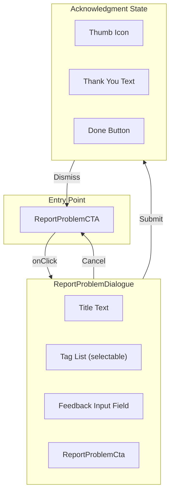

### ReportProblemCTA Variants

The CTA component has two overloaded implementations:

1. **Simple variant**: Takes an `onReportProblemClicked` lambda
2. **State-driven variant**: Takes a `RouteReportProblemCTAUIState` object

Both render a row with:
- Report problem icon (IC_ROUTE_REPORT_PROBLEM)
- "Report a problem" text (TV_REPORT_PROBLEM_HOOK)

### Dialog State Machine

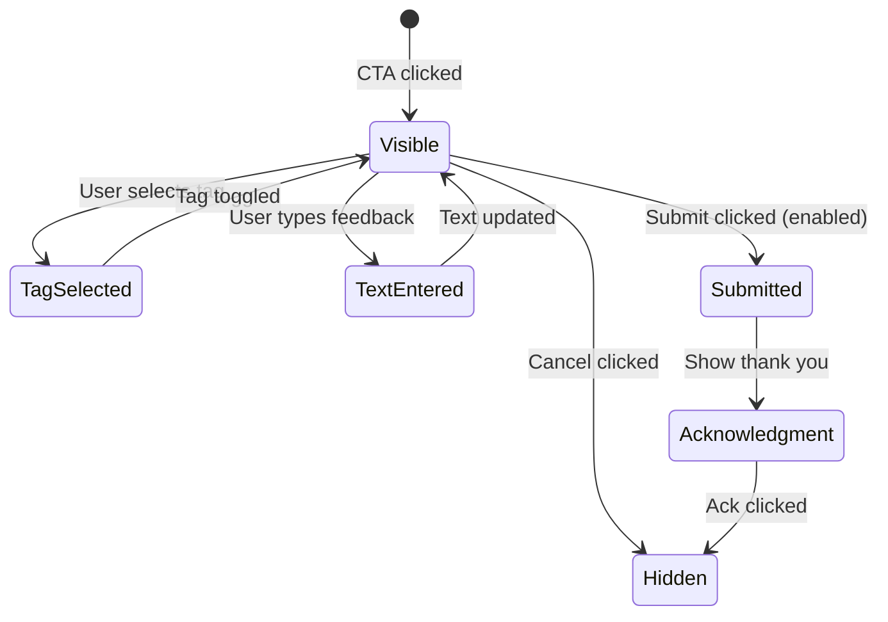

### Tag Selection Logic

The dialog maintains a `selectedTagIdList` that tracks selected problem tags:

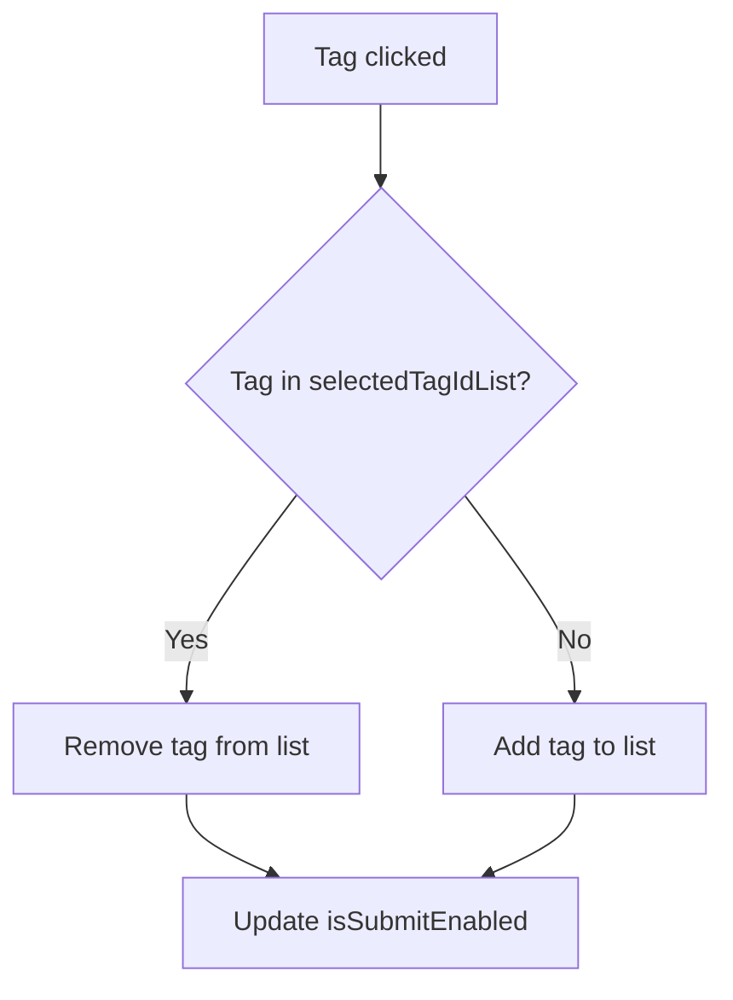

The submit button is enabled when either:
- At least one tag is selected, OR
- User has entered feedback text

### Dialog Styling

The dialog uses Chalo theme tokens:

| Element | Style |
|---------|-------|
| Title | headlineMedium, Black_87 |
| Tags (unselected) | bodyMedium, Black_87, shimmerBackground |
| Tags (selected) | bodyMedium, White, OrangePrimary |
| Submit (enabled) | titleLarge, OrangePrimary |
| Submit (disabled) | titleLarge, DarkGreyColor |
| Cancel | titleLarge, Black |

### ReportProblemMetaData

The dialog receives configuration through `ReportProblemMetaData`:

| Field | Type | Description |
|-------|------|-------------|
| title | String? | Dialog header text |
| tagDetails | List<TagDetail> | Available problem tags |
| hintTextForInput | String? | Placeholder for feedback field |

Each `TagDetail` contains:
- `tagId`: Unique identifier for analytics
- `title`: Display text for the tag

---

## Analytics Events

The component tracks the following analytics events:

| Event Name | Source | Properties | Trigger |
|------------|--------|------------|---------|
| RECLAIM_PASS | ReportProblemFeature | none | Reclaim flow initiated |
| "auto reclaim passes response" | ReportProblemFeature | isDeviceAutoLinked | Auto-link API completes |
| REPORT_PROBLEM_FEATURE_PROBLEM_CLICKED | ReportProblemFeature | problemId, problemCopy, problemCtaType, cityName | Problem item selected |

---

## Network Handling

The component monitors network state through `NetworkStateManager` and updates UI accordingly:

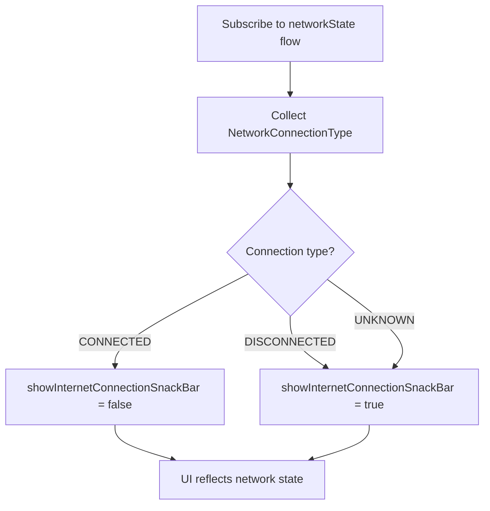

The snackbar shows "No Internet" message with an "OKAY" action button that dismisses it.

---

## Platform Differences

### Android-Specific

| Component | Implementation |
|-----------|----------------|
| Phone dialer | `systemHelper.openDialer()` uses ACTION_DIAL intent |
| Freshchat SDK | Direct native SDK integration |
| Restore ID | `FreshChatRestoreIdReceiver` BroadcastReceiver |

### iOS-Specific

| Component | Implementation |
|-----------|----------------|
| Phone dialer | tel: URL scheme |
| Freshchat SDK | Swift wrapper around native SDK |
| Restore ID | Freshchat delegate callbacks |

---

## Error Handling

| Scenario | Detection | User Experience |
|----------|-----------|-----------------|
| Null problem collection | Check in InitFreshChat | Navigate back silently |
| Auto-link API failure | ChaloUseCaseResult.Failure | Toast with generic error |
| Auto-link returns not updated | isDeviceUpdated = false | Dialog with manual reclaim option |
| Reclaim URL unavailable | getReclaimWebLinkUri returns null | Toast with generic error |
| Network unavailable | NetworkStateManager flow | Snackbar with offline message |
