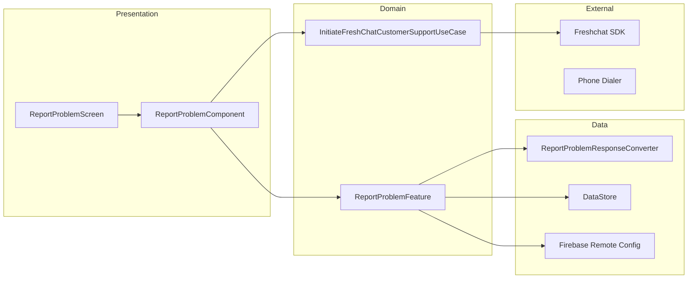

# Report Problem — High-Level Design

## Overview

The Report Problem feature enables users to report issues and get help within the Chalo app. It integrates with Freshchat for customer support, providing categorized problem lists, FAQ routing, and live chat options. The feature also supports pass reclamation (auto-linking device to recover passes) and analytics tracking for problem submissions.

## User Journey

1. **Entry Points**:
   - Product history screen → "Report a Problem"
   - Booking summary → Help/Report issue
   - Validation screen → Report failed validation
   - BLE screen → Report connection issues
   - Settings → Help & Support

2. **Core Flow**:
   - View categorized problem list
   - Select specific problem
   - Route to FAQ article, category, or live chat
   - Optional: Initiate pass reclamation flow
   - Contact support via phone call

3. **Exit Points**:
   - FAQ article viewed → Back to problem list
   - Chat initiated → Freshchat conversation
   - Pass reclaimed → Back to original screen
   - Phone call → Dialer app

## Architecture Diagram



## Key Components

| Component | Platform | File Path | Responsibility |
|-----------|----------|-----------|----------------|
| `ReportProblemComponent` | Shared | `shared/home/.../reportproblem/ReportProblemComponent.kt` | MVI component managing state |
| `ReportProblemScreen` | Shared | `shared/home/.../reportproblem/ReportProblemScreen.kt` | Composable UI |
| `InitiateFreshChatCustomerSupportUseCase` | Shared | `shared/home/.../reportproblem/InitiateFreshChatCustomerSupportUseCase.kt` | Freshchat routing logic |
| `ReportProblemFeature` | Shared | `shared/chalo-base/.../features/reportproblem/ReportProblemFeature.kt` | Problem data management |
| `ReportProblemResponseConverter` | Shared | `shared/chalo-base/.../features/reportproblem/ReportProblemResponseConverter.kt` | JSON to model parsing |

## Data Flow

### Display Problem List
1. `ReportProblemArgs` passed with problem collection and source
2. `ReportProblemComponent` initializes with `InitFreshChat` intent
3. Feature fetches problem collection from cache or remote config
4. `ReportProblemResponseConverter` parses JSON into collections
5. UI renders categorized problem list

### Handle Problem Selection
1. User taps problem item
2. `ProblemItemClicked` intent dispatched
3. Based on `ctaType`:
   - `ARTICLE` → Opens specific FAQ article
   - `CATEGORY` → Opens FAQ category
   - `CHAT` → Opens Freshchat conversation
   - `RECLAIM_PASSES` → Initiates reclaim flow
4. `InitiateFreshChatCustomerSupportUseCase` routes appropriately
5. Analytics event logged

### Pass Reclamation
1. User selects "Reclaim Passes" problem
2. Confirmation dialog shown
3. Auto-link API called to associate device
4. Success → Passes restored to device
5. Failure → Manual reclaim via web link

## Platform Differences

### Android-Specific
- `FreshChatRestoreIdReceiver` — BroadcastReceiver for Freshchat restore ID
- Native dialer intent for phone calls
- Freshchat SDK direct integration

### iOS-Specific
- SwiftUI views for Report Problem dialogs
- Freshchat SDK via Swift wrapper
- Native phone URL scheme for calls

## Integration Points

### Freshchat Integration
- **FAQ Articles**: Routes to specific knowledge base articles
- **FAQ Categories**: Opens category with multiple articles
- **Live Chat**: Initiates conversation with support agent
- **User Properties**: Sets context (city, phone, user ID, booking details)

### Analytics Events
- Problem selected (with problem ID and category)
- Reclaim initiated
- Reclaim success/failure
- Support call initiated

### Shared Services
- **Remote Config**: Problem definitions fetched from Firebase
- **DataStore**: Local caching of problem collections
- **Navigation**: `ChaloNavigationManager` for screen transitions
- **Network**: Internet state monitoring for offline handling

### Navigation
- **Navigates to**: Freshchat (external), Dialer (external), WebView (reclaim)
- **Navigated from**: History, Booking summary, Validation, BLE

## Edge Cases & Error Handling

| Scenario | Handling |
|----------|----------|
| No internet | Shows snackbar, disables chat options |
| Freshchat unavailable | Falls back to phone support |
| Reclaim failed | Shows error dialog with manual link |
| Empty problem list | Shows "No issues found" message |
| Remote config fetch failed | Uses cached data or defaults |

## Data Models

### ReportProblemCollection
```kotlin
data class ReportProblemCollection(
    val problemCollectionId: String,
    val title: String,
    val categoryList: List<ReportProblemFeatureCategory>
)
```

### ReportProblemFeatureCategory
```kotlin
data class ReportProblemFeatureCategory(
    val categoryId: String,
    val categoryName: String,
    val problemList: List<ReportProblemFeatureProblem>
)
```

### ReportProblemFeatureProblem
```kotlin
data class ReportProblemFeatureProblem(
    val problemId: String,
    val problemCopy: String,
    val ctaTagList: List<String>,
    val chatGroupTag: String,
    val ctaType: String  // ARTICLE, CATEGORY, CHAT, RECLAIM_PASSES
)
```

### ReportProblemArgs
```kotlin
@Serializable
data class ReportProblemArgs(
    val problemCollection: ReportProblemCollection?,
    val source: String,
    val userPropertiesMap: MutableMap<String, String>,
    val additionalProblemCategoryList: List<ReportProblemFeatureCategory>?,
    val supportContactNumber: String?
) : SceneArgs
```

## CTA Types

| Type | Action |
|------|--------|
| `ARTICLE` | Opens specific FAQ article by ID |
| `CATEGORY` | Opens FAQ category with articles |
| `CHAT` | Initiates Freshchat conversation |
| `RECLAIM_PASSES` | Triggers pass reclamation flow |

## Problem Sources

| Source | Screen |
|--------|--------|
| `SRC_PRODUCT_HISTORY_SCREEN` | Product history list |
| `SRC_VALIDATION_SCREEN` | Ticket validation |
| `SRC_BLE_SCREEN` | BLE connection |
| `SRC_MTICKET_BOOKING_SUMMARY_SCREEN` | M-Ticket summary |
| `SRC_METRO_BOOKING_SUMMARY_SCREEN` | Metro booking |

## Dependencies

### Internal
- `shared:chalo-base` — Feature interface, data models, constants
- `shared:home` — Component and UI
- `shared:network` — Network state monitoring

### External
- Freshchat SDK — Customer support chat
- Firebase Remote Config — Problem definitions
- DataStore — Local persistence
