# Report Problem — Repository Documentation

## Data Layer Overview

The Report Problem data layer manages problem collection retrieval from Firebase Remote Config, JSON-to-model transformation, local caching via DataStore, and Freshchat SDK integration. The layer also handles device auto-linking through the `IProductDataSyncRepository`. Platform-specific implementations provide the actual Freshchat SDK interactions.

The data layer files are distributed across the shared modules:

| File | Module | Path | Purpose |
|------|--------|------|---------|
| ReportProblemResponseConverter.kt | shared/chalo-base | .../features/reportproblem/ | JSON parsing |
| FreshChatInitManager.kt | shared/chalo-base | .../features/freshchat/ | SDK initialization |
| FreshChatInitManager.android.kt | shared/chalo-base | .../features/freshchat/ | Android SDK impl |
| FreshchatUserContract.android.kt | shared/chalo-base | .../features/freshchat/ | Android user operations |
| FreshchatUserDataHandler.kt | shared/chalo-base | .../features/freshchat/ | Restore ID management |
| FreshChatRestoreIdReceiver.kt | shared/home | .../reportproblem/ | Android broadcast receiver |

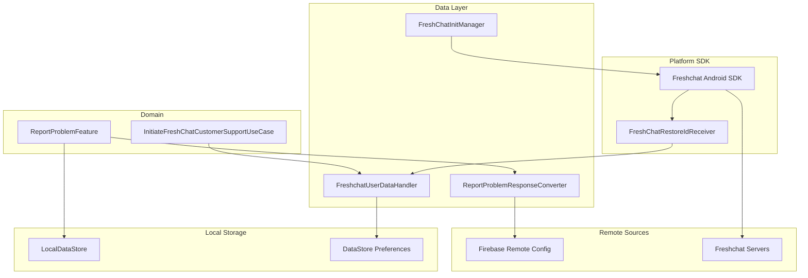

---

## ReportProblemResponseConverter

Transforms JSON problem definitions from Remote Config into strongly-typed domain models.

### Location

`shared/chalo-base/src/commonMain/kotlin/app/chalo/features/reportproblem/ReportProblemResponseConverter.kt`

### Constructor Dependencies

| Dependency | Type | Purpose |
|------------|------|---------|
| crashlyticsLogger | CrashlyticsLogger | Error reporting |

### Responsibility

The converter implements a three-phase parsing strategy to handle the nested JSON structure from Remote Config. It parses problems first, then categories (referencing problems), then collections (referencing categories). This approach allows for data reuse across collections and categories.

### JSON Structure

Remote Config stores problem data in a normalized format with three pools:

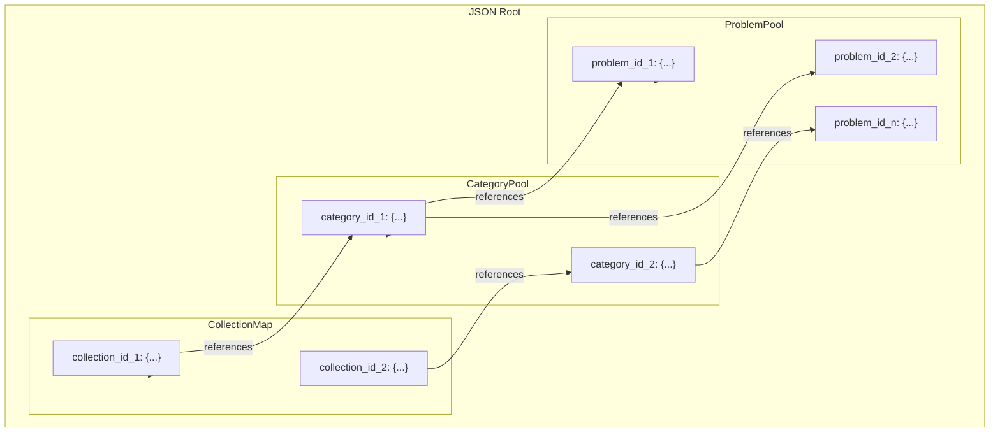

### Parsing Flow

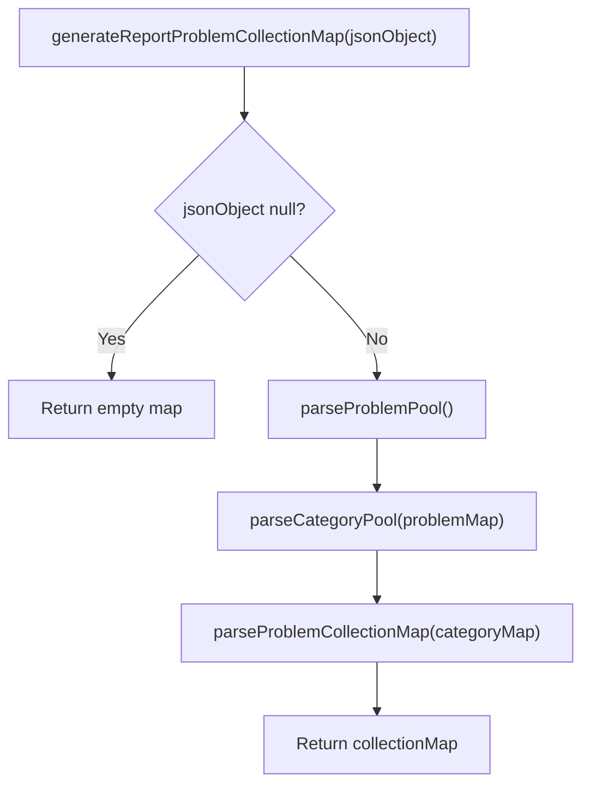

### Problem Parsing

The `parseProblemPool` method extracts individual problems:

| JSON Field | Domain Field | Required | Default |
|------------|--------------|----------|---------|
| problemText | problemCopy | No | "" |
| ctaType | ctaType | No | "" |
| ctaTagList | ctaTagList | No | [] |
| chatGroupTag | chatGroupTag | No | "" |

### Category Parsing

The `parseCategoryPool` method builds categories from the problem map:

| JSON Field | Domain Field | Required |
|------------|--------------|----------|
| categoryName | categoryName | No (default: "") |
| problemList | problemList | No (references problem pool) |

Categories reference problems by ID. If a referenced problem doesn't exist, it's skipped.

### Collection Parsing

The `parseProblemCollectionMap` method assembles final collections:

| JSON Field | Domain Field | Default |
|------------|--------------|---------|
| title | title | "Help and Support" |
| categoryList | categoryList | [] (references category pool) |

### Error Handling

| Error Type | Handling |
|------------|----------|
| Null JSON object | Return empty map |
| Invalid problem ID reference | Skip problem, log warning |
| Invalid category ID reference | Skip category, log warning |
| JSON parsing exception | Log via Crashlytics, continue with partial data |

---

## Freshchat Integration Layer

The Freshchat integration consists of multiple components that handle SDK initialization, user management, and conversation restoration.

### FreshChatInitManager

Interface for platform-specific SDK initialization.

#### Location

- Interface: `shared/chalo-base/src/commonMain/kotlin/app/chalo/features/freshchat/FreshChatInitManager.kt`
- Android impl: `shared/chalo-base/src/androidMain/kotlin/app/chalo/features/freshchat/FreshChatInitManager.android.kt`

#### Interface Definition

```kotlin
interface FreshChatInitManager {
    suspend fun initFreshChat()
    fun setupPushNotifications(token: String)
    fun handleFaqMessageIfPossible(data: PayloadData): Boolean
}
```

#### Android Implementation

The `FreshChatInitManagerAndroid` class initializes the Freshchat SDK:

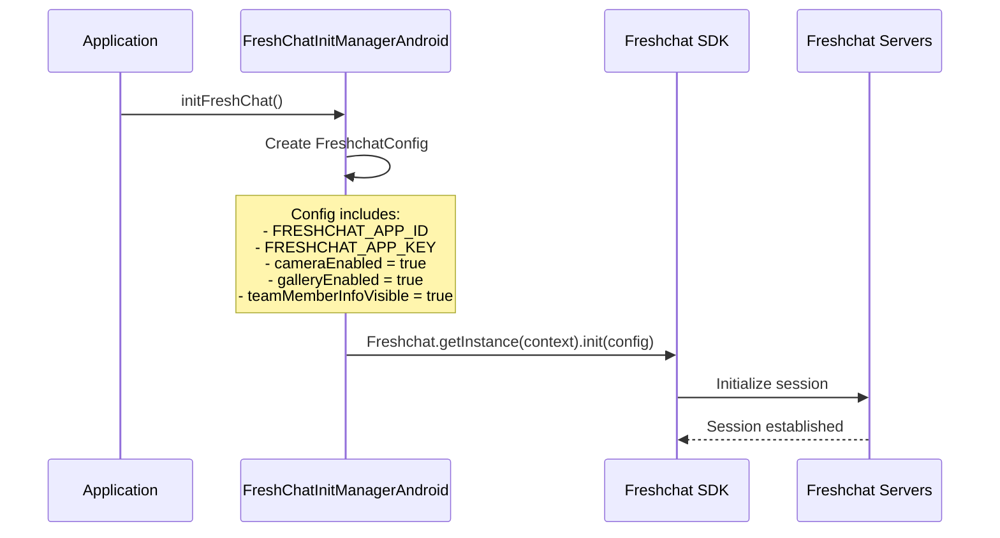

#### Push Notification Setup

```kotlin
override fun setupPushNotifications(token: String) {
    Freshchat.getInstance(context).setPushRegistrationToken(token)
}
```

#### FAQ Message Handling

The manager checks if incoming push notifications are Freshchat messages:

```mermaid
flowchart TD
    Start["handleFaqMessageIfPossible(data)"]
    MakeBundle["Convert PayloadData to Bundle"]
    CheckFreshchat{Freshchat.isFreshchatNotification(bundle)?}

    HandleMessage["Freshchat.handleFcmMessage(context, bundle)"]
    ReturnTrue["Return true"]
    ReturnFalse["Return false"]

    Start --> MakeBundle
    MakeBundle --> CheckFreshchat

    CheckFreshchat -->|Yes| HandleMessage
    CheckFreshchat -->|No| ReturnFalse

    HandleMessage --> ReturnTrue
```

---

### FreshchatUserInteractionContract (Android)

Implements the platform contract for user-facing Freshchat operations.

#### Location

`shared/chalo-base/src/androidMain/kotlin/app/chalo/features/freshchat/FreshchatUserContract.android.kt`

#### Constructor Dependencies

| Dependency | Type | Purpose |
|------------|------|---------|
| context | Context | Android context |
| getDistinctIdUseCase | GetDistinctIdUseCase | User ID retrieval |
| freshchatUserDataHandler | FreshchatUserDataHandler | Restore ID management |
| freshchatRestoreIdDataMigration | FreshchatRestoreIdDataMigration | Legacy data migration |

#### User Identification Flow

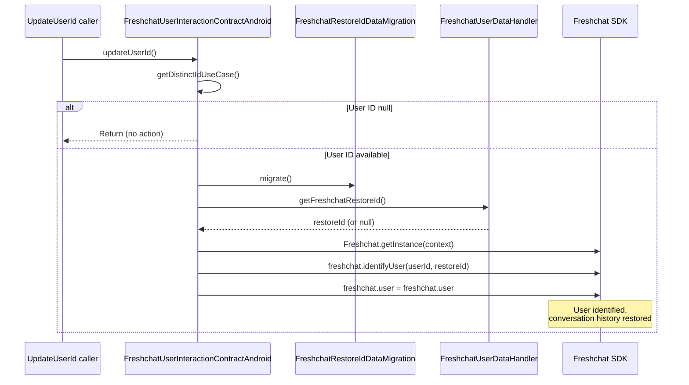

#### FAQ Display

The `showFAQs` method configures and displays FAQ views:

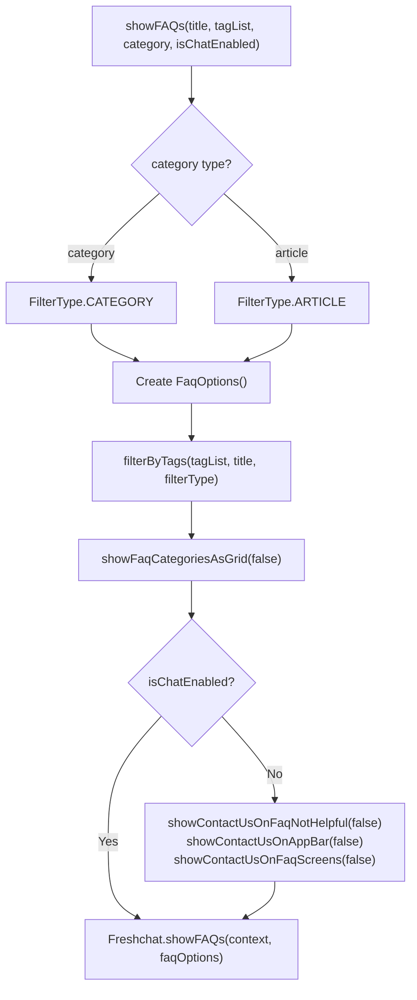

The `showContactUs` flags control whether users can initiate live chat from FAQ screens.

#### User Properties

```kotlin
override fun setUserProperties(properties: Map<String, String>) {
    Freshchat.getInstance(context).setUserProperties(properties)
}
```

#### Conversations

```kotlin
override fun showConversations() {
    val options = ConversationOptions()
    Freshchat.showConversations(context, options)
}
```

---

### FreshchatUserDataHandler

Manages Freshchat restore IDs for conversation continuity across app reinstalls.

#### Location

`shared/chalo-base/src/commonMain/kotlin/app/chalo/features/freshchat/FreshchatUserDataHandler.kt`

#### Constructor Dependencies

| Dependency | Type | Purpose |
|------------|------|---------|
| getDistinctIdUseCase | GetDistinctIdUseCase | User ID for key generation |
| dataStore | LocalDataStore | Persistent storage |

#### Responsibility

The handler persists Freshchat restore IDs keyed by user ID, enabling conversation restoration when users reinstall the app or switch devices.

#### Key Generation

Restore IDs are stored with user-specific keys:

```kotlin
fun getFreshChatRestoreKeyFromUserId(): String? {
    val userId = getDistinctIdUseCase.invoke() ?: return null
    return "${userId}_${AppConstants.KEY_FRESHCHAT_RESTORE_ID}"
}
```

#### Store Flow

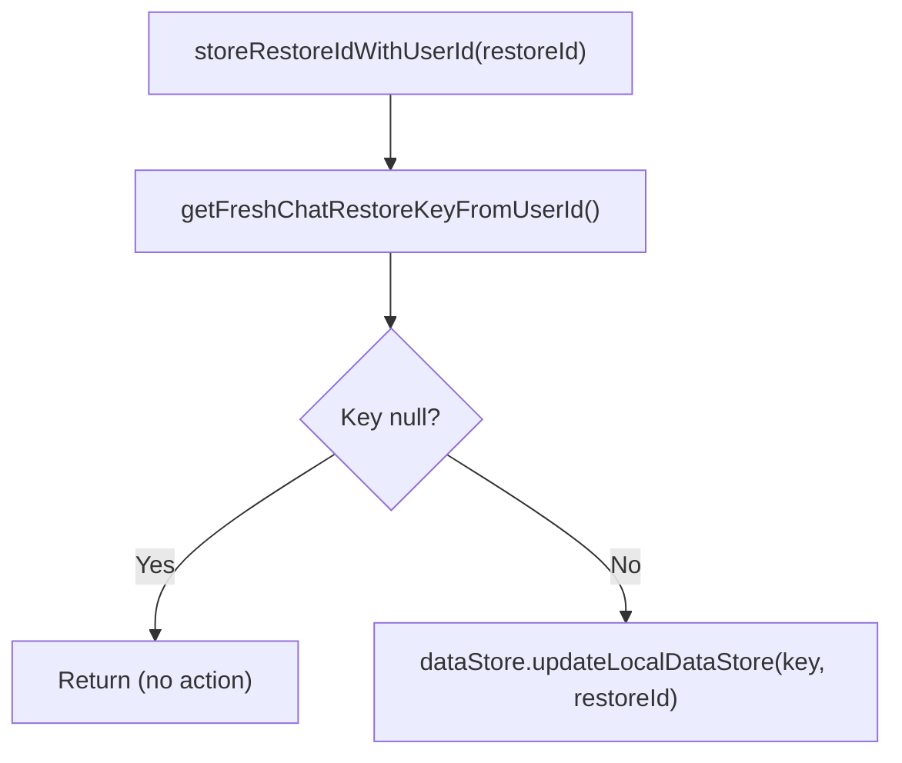

#### Retrieve Flow

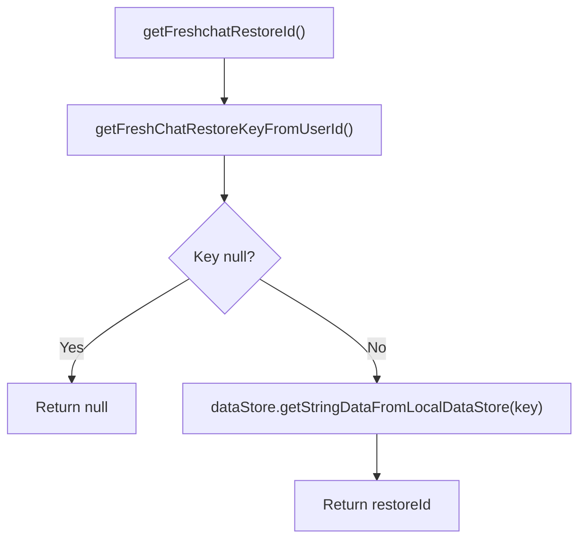

#### Singleton Helper

A KoinComponent singleton provides global access:

```kotlin
object FreshchatUserDataHelper : KoinComponent {
    val helper: FreshchatUserDataHandler by inject()
}
```

---

### FreshChatRestoreIdReceiver

Android BroadcastReceiver that captures Freshchat restore IDs for persistence.

#### Location

`shared/home/src/androidMain/kotlin/app/chalo/reportproblem/FreshChatRestoreIdReceiver.kt`

#### Registration

The receiver is registered in the Android manifest to listen for Freshchat restore ID broadcasts.

#### Receive Flow

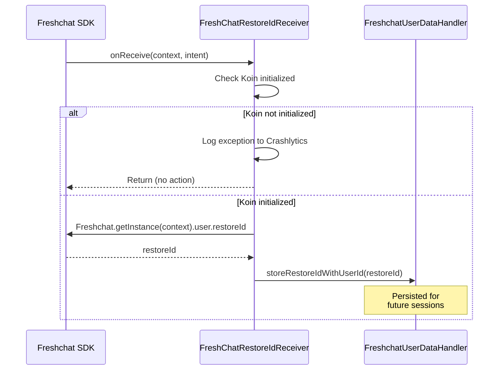

#### Koin Safety Check

The receiver verifies Koin initialization before accessing dependencies:

```kotlin
private fun hasKoinInitialised(): Boolean {
    return try {
        coroutineContextProvider  // Attempt to access injected dependency
        true
    } catch (e: Exception) {
        CrashlyticsKotlin.sendHandledException(e)
        false
    }
}
```

---

## Product Data Sync Repository

The `IProductDataSyncRepository` interface provides access to both product history synchronization and device auto-linking functionality.

### Location

| File | Module | Path |
|------|--------|------|
| IProductDataSyncRepository.kt | shared/home | .../productdatasync/repository/ |
| ProductDataSyncRepository.kt | shared/home | .../productdatasync/repository/ |
| IProductDataSyncRemoteDataSource.kt | shared/home | .../productdatasync/repository/remote/ |
| ProductDataSyncRemoteDataSource.kt | shared/home | .../productdatasync/repository/remote/ |

### Interface Definition

```kotlin
interface IProductDataSyncRepository {
    suspend fun initiateProductDataSyncCall(
        cityName: String,
        isPremiumBusFeatureEnabled: Boolean
    ): HistoryResponseAppModel

    suspend fun autoLinkDeviceId(
        autoLinkDeviceIdRequestAppModel: AutoLinkDeviceIdRequestAppModel
    ): AutoLinkDeviceIdResponseAppModel
}
```

### Repository Implementation

The `ProductDataSyncRepository` delegates to a remote data source:

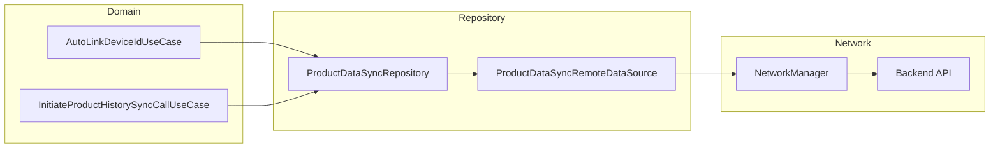

### Remote Data Source

The `ProductDataSyncRemoteDataSource` handles the actual network calls:

| Dependency | Type | Purpose |
|------------|------|---------|
| networkManager | NetworkManager | HTTP request building and execution |
| genericNetworkExceptionMapper | GenericNetworkExceptionMapper | Error transformation |
| stringProvider | StringProvider | Error message localization |

---

## Local Storage

### DataStore Keys

Problem data is stored using Jetpack DataStore with string preference keys:

| Key Constant | Value | Storage |
|--------------|-------|---------|
| KEY_REPORT_PROBLEM_FEATURE_DATA | "keyReportProblemFeatureData" | Problem JSON cache |
| KEY_REPORT_PROBLEM_FEATURE_VERSION_CODE | "keyReportProblemFeatureVersionCode" | Data version |
| KEY_REPORT_PROBLEM_FEATURE_CACHED_RESPONSE_CITY | "keyReportProblemFeatureCachedResponseCity" | City context |

### DataStore File

The ReportProblemFeature uses a dedicated DataStore file:

```kotlin
const val REPORT_PROBLEM_DATA_STORE = "reportProblemFeature.preferences_pb"
```

### Cache Operations

**Store Problem Data**:

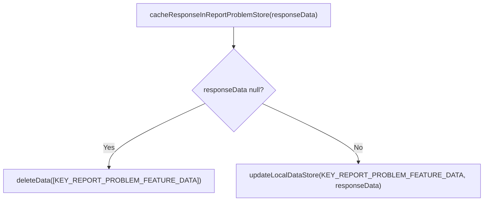

**Clear Cache**:

```kotlin
override suspend fun clearReportProblemStore() {
    reportProblemDataStore.deleteAll()
}
```

---

## Remote Config Integration

### Config Keys

| Key | Environment | Purpose |
|-----|-------------|---------|
| REPORT_PROBLEM_METADATA_KEY_PROD | Production | City-specific problem metadata |
| REPORT_PROBLEM_METADATA_KEY_DEBUG | Dev/Staging | Debug problem metadata |
| REMOTE_CONFIG_RECLAIM_REQUEST_URL_KEY | All | Manual reclaim web URL |

### Problem Data Structure

The remote config value is a JSON string with this structure:

```json
{
  "versionCode": "1",
  "data": {
    "problemPool": {
      "p1": {
        "problemText": "I can't see my pass",
        "ctaType": "article",
        "ctaTagList": ["pass_issues"],
        "chatGroupTag": "pass_support"
      }
    },
    "categoryPool": {
      "c1": {
        "categoryName": "Pass Issues",
        "problemList": ["p1"]
      }
    },
    "problemCollectionMap": {
      "historyScreen": {
        "title": "Help",
        "categoryList": ["c1"]
      }
    }
  }
}
```

### Metadata Structure

The metadata config provides city-specific problem configurations:

```json
{
  "tags": {
    "tag1": "ETA is incorrect",
    "tag2": "Bus didn't arrive"
  },
  "reportProblemMetadata": {
    "stopEta": {
      "mumbai": {
        "title": "Report ETA Issue",
        "hint": "Tell us more...",
        "tags": ["tag1", "tag2"]
      },
      "default": {
        "title": "Report Issue",
        "hint": "Describe the problem",
        "tags": ["tag1"]
      }
    }
  }
}
```

---

## API Endpoints

### Auto-Link Device

The auto-link API is accessed through `IProductDataSyncRepository.autoLinkDeviceId()` which delegates to `ProductDataSyncRemoteDataSource`.

| Property | Value |
|----------|-------|
| Endpoint | POST /mticketing/users/{USER_ID}/device |
| Auth | Required (secure API headers) |

The actual implementation in `ProductDataSyncRemoteDataSource.kt`:

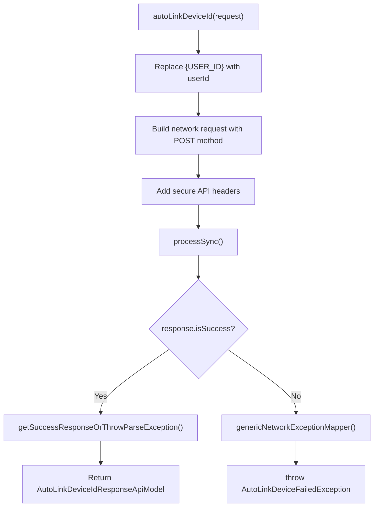

**Request Body**:

| Field | Type | Required | Description |
|-------|------|----------|-------------|
| deviceId | String | Yes | Current device identifier |
| userId | String | Yes | Authenticated user ID |

**Response**: `AutoLinkDeviceIdResponseAppModel`

| Field | Type | Description |
|-------|------|-------------|
| isDeviceUpdated | Boolean | Whether device was linked |
| message | String? | Server message |

**Error Handling**:

| Exception | Cause |
|-----------|-------|
| AutoLinkDeviceFailedException | Server returned error response |
| NetworkException | Network unreachable |
| AuthException | Token invalid/expired |

### Product History Sync

The history sync endpoint is used to refresh product data after successful device linking.

| Property | Value |
|----------|-------|
| Endpoint | GET /mticketing/v2/user-purchase-history |
| Auth | Required (secure API headers) |
| Headers | city (lowercase), isPremiumBusFeatureEnabled (boolean) |

**Response**: `HistoryResponseApiModel` containing all user products including passes, tickets, and bookings.

---

## Data Flow Diagrams

### Problem Data Fetch and Cache

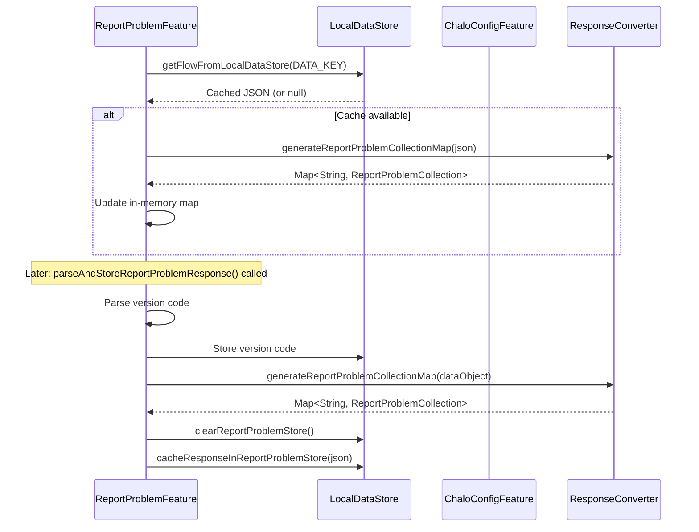

### Freshchat User Session

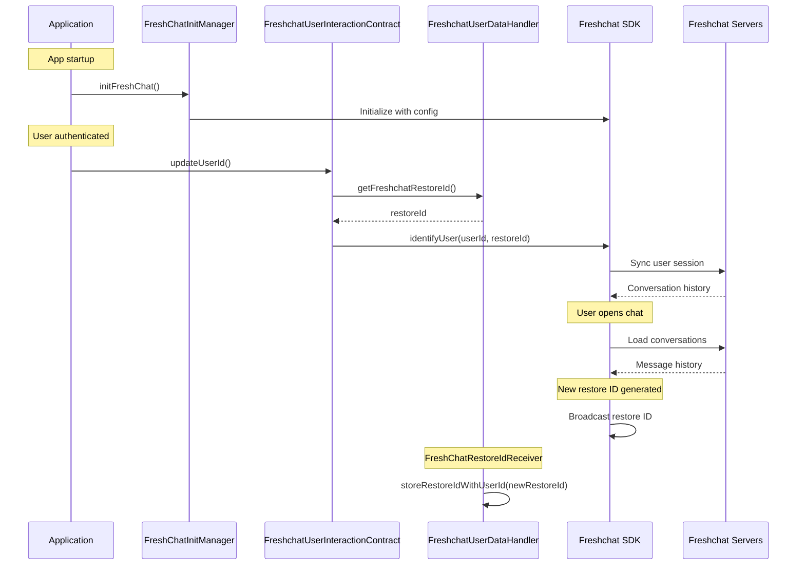

---

## Problem Collection Constants

### Collection IDs

| Constant | Value | Usage |
|----------|-------|-------|
| TRANSACTION_RELATED_SCREEN | "transactionRelatedScreen" | Booking/purchase issues |
| HISTORY_SCREEN_PROBLEMS | "historyScreen" | Product history |
| PASS_VERIFICATION_SCREEN_PROBLEMS | "verificationScreen" | Validation issues |
| CARD_RECHARGE_PROBLEMS | "cardRelatedProblems" | Card recharge |
| PREMIUM_STOP_SELECTION_SCREEN | "premiumStopSelectionScreen" | Premium bus stop |
| PREMIUM_SLOT_SELECTION_SCREEN | "premiumSlotSelectionScreen" | Premium bus slot |
| PREMIUM_PRODUCT_SELECTION_SCREEN | "premiumProductSelectionScreen" | Premium product |
| PREMIUM_RESERVATION_ACTIVATION_SCREEN | "premiumReservationActivationScreen" | Premium activation |
| PREMIUM_BOOKING_SUMMARY_SCREEN | "premiumBookingSummaryScreen" | Premium summary |

### CTA Type Constants

| Constant | Value | Action |
|----------|-------|--------|
| ARTICLE | "article" | Show FAQ article |
| CATEGORY | "category" | Show FAQ category |
| CHAT | "chat" | Open live chat |
| PROBLEM_CTA_RECLAIM_PASSES | "reclaimPasses" | Trigger reclaim flow |

### Static Problem Values

The reclaim passes problem is generated statically:

| Constant | Value |
|----------|-------|
| CATEGORY_ID_RECLAIM_PASSES | "reclaimPassesCategory" |
| CATEGORY_NAME_RECALIM_PASSES | "Don't see my active pass" |
| PROBLEM_ID_RECLAIM_PASSES | "reclaimPassesProblem" |
| PROBLEM_COPY_RECLAIM_PASSES | "Cant find my pass after I changed/reset my mobile device." |

---

## Error Handling

### Converter Errors

| Error | Handling |
|-------|----------|
| Null input | Return empty map |
| Invalid JSON structure | Log via Crashlytics, return partial data |
| Missing problem reference | Skip entry, continue parsing |
| Missing category reference | Skip entry, continue parsing |
| Array index exception | Log via Crashlytics, skip entry |

### Freshchat Errors

| Error | Handling |
|-------|----------|
| SDK not initialized | Operations silently fail |
| Invalid user ID | Return without action |
| Restore ID not found | Identify without restore (new conversation) |
| MethodNotAllowedException | Print stack trace, continue |

### DataStore Errors

| Error | Handling |
|-------|----------|
| Read failure | Return null, use empty data |
| Write failure | Log error, retry on next operation |
| Corruption | Clear store, refetch from remote |

---

## Platform Implementations

### Android

| Component | Class |
|-----------|-------|
| SDK Initialization | FreshChatInitManagerAndroid |
| User Operations | FreshchatUserInteractionContractAndroid |
| Restore ID Capture | FreshChatRestoreIdReceiver |
| DataStore | Jetpack DataStore |

### iOS

| Component | Implementation |
|-----------|----------------|
| SDK Initialization | FreshChatInitManager (iOS source set) |
| User Operations | FreshchatUserInteractionContract (iOS source set) |
| Restore ID Capture | Freshchat delegate callbacks |
| DataStore | UserDefaults wrapper |

---

## Dependency Injection

### Module Bindings

| Interface | Implementation | Scope |
|-----------|----------------|-------|
| FreshChatInitManager | FreshChatInitManagerAndroid | Singleton |
| FreshchatUserInteractionContract | FreshchatUserInteractionContractAndroid | Singleton |
| FreshchatUserDataHandler | FreshchatUserDataHandler | Singleton |
| ReportProblemResponseConverter | ReportProblemResponseConverter | Factory |

### Koin Definitions

The Freshchat components are registered in the application's Koin modules:

```kotlin
single { FreshChatInitManagerAndroid(get()) }
single<FreshChatInitManager> { get<FreshChatInitManagerAndroid>() }

single {
    FreshchatUserInteractionContractAndroid(
        context = get(),
        getDistinctIdUseCase = get(),
        freshchatUserDataHandler = get(),
        freshchatRestoreIdDataMigration = get()
    )
}
single<FreshchatUserInteractionContract> { get<FreshchatUserInteractionContractAndroid>() }

single { FreshchatUserDataHandler(get(), get()) }
```
