# Report Problem — UseCase Documentation

## Domain Layer Overview

The Report Problem domain layer orchestrates customer support routing through Freshchat and pass reclamation through device auto-linking. The layer consists of two primary use cases: `InitiateFreshChatCustomerSupportUseCase` for routing users to appropriate support channels, and `AutoLinkDeviceIdUseCase` for handling pass recovery. Supporting these is the `ReportProblemFeature` class that manages problem collection data retrieval and transformation.

The actual implementations reside across two modules:

| File | Module | Path |
|------|--------|------|
| InitiateFreshChatCustomerSupportUseCase.kt | shared/home | .../reportproblem/ |
| AutoLinkDeviceIdUseCase.kt | shared/home | .../home/domain/ |
| ReportProblemFeature.kt | shared/chalo-base | .../features/reportproblem/ |
| IReportProblemFeature.kt | shared/chalo-base | .../features/reportproblem/ |

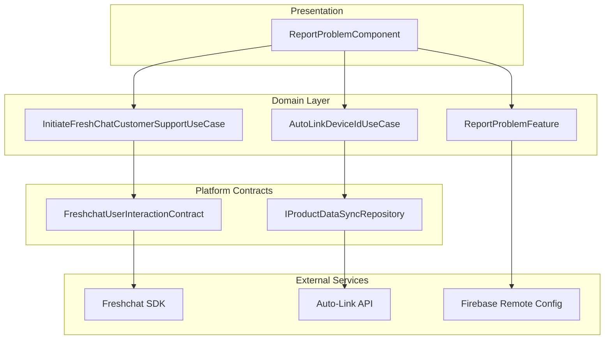

---

## UseCase Inventory

| UseCase | Module | Purpose |
|---------|--------|---------|
| **InitiateFreshChatCustomerSupportUseCase** | shared/home | Route users to Freshchat articles, categories, or chat |
| **AutoLinkDeviceIdUseCase** | shared/home | Handle pass reclamation via device auto-linking |
| **ReportProblemFeature** | shared/chalo-base | Manage problem collection data and launch navigation |

---

## InitiateFreshChatCustomerSupportUseCase

Routes users to appropriate Freshchat support channels based on the selected problem's CTA type. This use case serves as the bridge between domain logic and the platform-specific Freshchat SDK integration.

### Location

`shared/home/src/commonMain/kotlin/app/chalo/reportproblem/InitiateFreshChatCustomerSupportUseCase.kt`

### Responsibility

The use case handles three distinct routing scenarios:
1. **FAQ Articles**: Opens a specific FAQ article filtered by tags
2. **FAQ Categories**: Opens a category view showing multiple articles
3. **Live Chat**: Initiates a conversation with support agents

Before routing, it always sets user properties on Freshchat to provide context to support agents.

### Constructor Dependencies

| Dependency | Type | Purpose |
|------------|------|---------|
| freshchatUserInteractionContract | FreshchatUserInteractionContract | Platform abstraction for Freshchat SDK |

### Invocation Flow

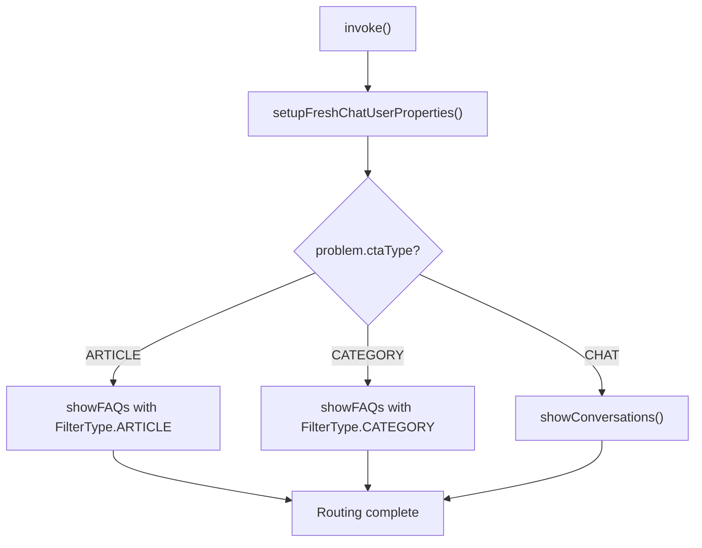

### Input Parameters

| Parameter | Type | Description |
|-----------|------|-------------|
| faqTitle | String? | Title displayed in Freshchat UI |
| isChatEnabled | Boolean | Whether chat button should be visible in FAQ views |
| problem | ReportProblemFeatureProblem | Selected problem with routing data |
| userPropertiesMap | Map<String, String> | Context properties for Freshchat |

### CTA Type Routing

The use case performs case-insensitive comparison on `ctaType`:

| CTA Type | Method Called | Tag Source |
|----------|---------------|------------|
| ARTICLE | `showFAQs(category = "article")` | `problem.ctaTagList` |
| CATEGORY | `showFAQs(category = "category")` | `problem.ctaTagList` |
| CHAT | `showConversations()` | N/A |

### User Properties Setup

The private `setupFreshChatUserProperties` method builds and sets conversation context:

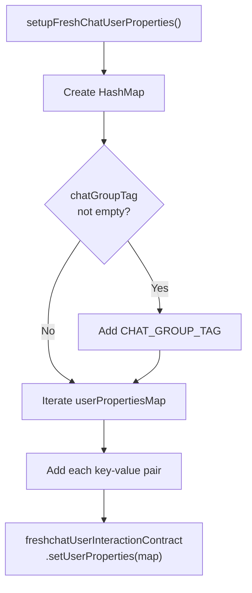

The `chatGroupTag` from the problem definition is used for routing conversations to specific support groups.

### FreshchatUserInteractionContract

This interface abstracts platform-specific Freshchat SDK operations:

```kotlin
interface FreshchatUserInteractionContract {
    suspend fun updateUserId()
    fun setUserProperties(properties: Map<String, String>)
    fun showFAQs(title: String?, tagList: List<String>, category: String, isChatEnabled: Boolean)
    fun showConversations()
}
```

The interface has platform-specific implementations:
- **Android**: `FreshchatUserInteractionContractAndroid` in `shared/chalo-base/src/androidMain/`
- **iOS**: Equivalent implementation in iOS source set

---

## AutoLinkDeviceIdUseCase

Handles pass reclamation by linking the current device to the user's account, enabling recovery of passes that were on a previous device.

### Location

`shared/home/src/commonMain/kotlin/app/chalo/home/domain/AutoLinkDeviceIdUseCase.kt`

### Responsibility

The use case coordinates between device identification, user authentication validation, and the backend auto-link API. It returns a structured result that indicates whether the device was successfully linked and passes were transferred.

### Constructor Dependencies

| Dependency | Type | Purpose |
|------------|------|---------|
| basicInfoContract | BasicInfoContract | Device identification |
| userProfileDetailsProvider | UserProfileDetailsProvider | User authentication state |
| stringProvider | StringProvider | Error message localization |
| productDataSyncRepository | IProductDataSyncRepository | Auto-link API access |

### Invocation Flow

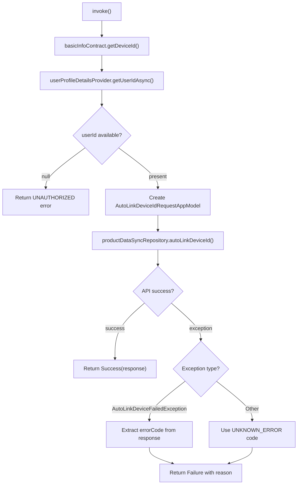

### Input Parameters

The use case takes no parameters. It derives all necessary data from injected providers.

### Output Type

Returns `ChaloUseCaseResult<AutoLinkDeviceIdResponseAppModel, UseCaseOperationError<AutoLinkDeviceIdFailureReason>>`

**Success Response Fields**:

| Field | Type | Description |
|-------|------|-------------|
| isDeviceUpdated | Boolean | Whether device was successfully linked |
| message | String? | Server message |

**Failure Reasons**:

| Reason | Error Code | Description |
|--------|------------|-------------|
| UNKNOWN_ERROR | 0 | Generic/unhandled error |
| UNAUTHORIZED | 1 | User not logged in |

### Error Handling

The use case distinguishes between two exception types:

1. **AutoLinkDeviceFailedException**: Server returned a structured error response
   - Error code extracted from `exception.errorResponse?.errorCode`
   - Message preserved from server response

2. **Other Exceptions**: Unexpected errors
   - Defaults to `UNKNOWN_ERROR` reason
   - Exception message preserved

### Request Model

```kotlin
data class AutoLinkDeviceIdRequestAppModel(
    val deviceId: String,
    val userId: String
)
```

---

## ReportProblemFeature

The feature class serves as a facade for problem data management, handling retrieval from remote config, local caching, and launching the report problem screen.

### Location

`shared/chalo-base/src/commonMain/kotlin/app/chalo/features/reportproblem/ReportProblemFeature.kt`

### Interface

The feature implements `IReportProblemFeature`:

```kotlin
interface IReportProblemFeature {
    fun launchReportProblemFeature(
        collectionId: String,
        source: String,
        userPropertiesMap: MutableMap<String, String>,
        areAdditionalProblemsRequired: Boolean,
        supportContactNumber: String? = null
    )

    suspend fun parseAndStoreReportProblemResponse(jsonObject: JsonObject)
    suspend fun getStoredVersionCode(): String?
    suspend fun cacheCityName(cityName: String)
    suspend fun getCacheCityName(): String?
    suspend fun getReportProblemMetadata(problemType: String, cityName: String): ReportProblemMetadata?
    suspend fun clearReportProblemStore()
    suspend fun getBasicUserDetailsMapForReportProblem(): MutableMap<String, String>
    fun submitProblem(problemId: String, problemCopy: String, problemCtaType: String)
}
```

### Constructor Dependencies

| Dependency | Type | Purpose |
|------------|------|---------|
| reportProblemResponseConverter | ReportProblemResponseConverter | JSON to model parsing |
| reportProblemDataStore | LocalDataStore | Problem data cache |
| configDataStore | LocalDataStore | Version code storage |
| foregroundManager | ApplicationForegroundManager | App state tracking |
| analyticsContract | AnalyticsContract | Event tracking |
| cityProvider | CityProvider | Current city context |
| userProfileDetailsProvider | UserProfileDetailsProvider | User data access |
| chaloNavigationManager | ChaloNavigationManager | Screen navigation |
| chaloConfigFeature | ChaloConfigFeature | Remote config access |
| chaloBuildConfig | ChaloBuildConfig | Environment detection |
| crashlyticsLogger | CrashlyticsLogger | Error reporting |
| coroutineContextProvider | CoroutineContextProvider | Coroutine dispatchers |

### Initialization

On construction, the feature loads cached problem data from DataStore:

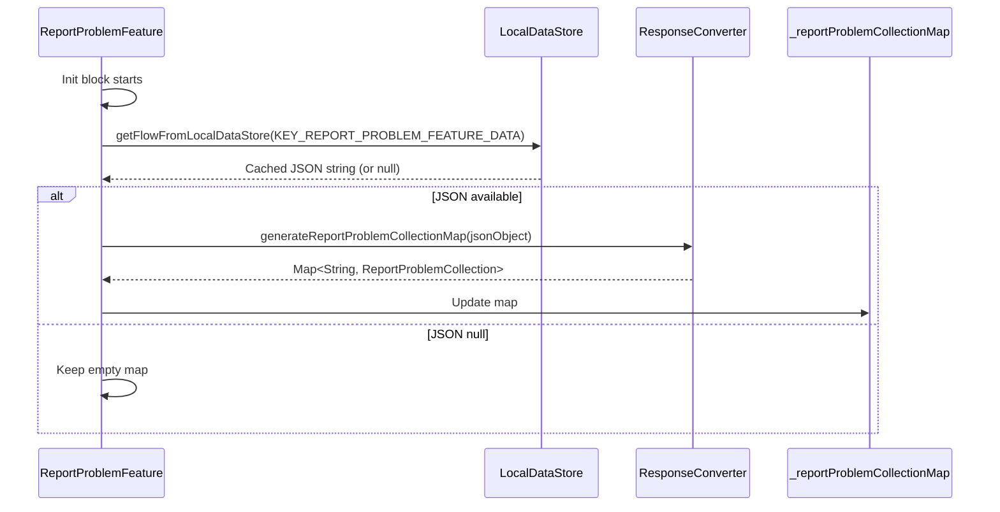

### Launch Flow

The `launchReportProblemFeature` method orchestrates screen navigation:

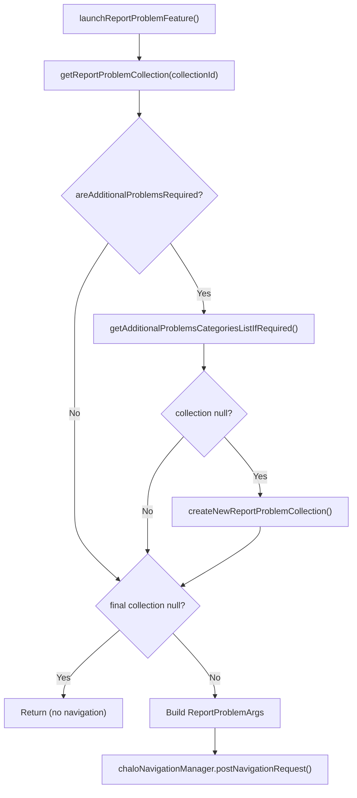

### Additional Problems Logic

When `areAdditionalProblemsRequired` is true and source is `SRC_PRODUCT_HISTORY_SCREEN`, the feature adds a "Reclaim Passes" category:

| Field | Value |
|-------|-------|
| categoryId | "reclaimPassesCategory" |
| categoryName | "Don't see my active pass" |
| problemId | "reclaimPassesProblem" |
| problemCopy | "Cant find my pass after I changed/reset my mobile device." |
| ctaType | "reclaimPasses" |

### Problem Metadata Retrieval

The `getReportProblemMetadata` method fetches city-specific problem configurations from remote config:

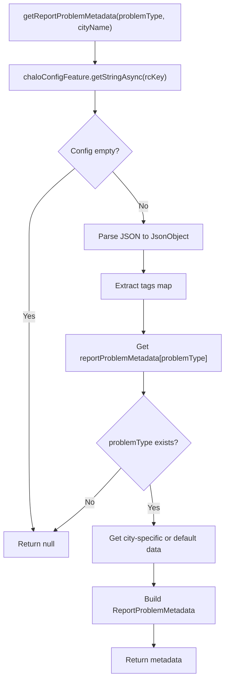

The remote config key varies by environment:
- **Production**: `REPORT_PROBLEM_METADATA_KEY_PROD`
- **Development/Staging**: `REPORT_PROBLEM_METADATA_KEY_DEBUG`

### Problem Types

The feature supports multiple problem contexts defined as constants:

| Constant | Value | Usage |
|----------|-------|-------|
| PROBLEM_TYPE_STOP_ETA | "stopEta" | Route ETA issues |
| PROBLEM_TYPE_GENERAL_PROBLEMS | "generalProblems" | General support |
| PROBLEM_TYPE_QRCODE_TICKETING_PROBLEMS | "qrCodeScreenTicketingProblems" | QR validation issues |
| PROBLEM_TYPE_ACTIVATION_SCREEN_TICKETING_PROBLEMS | "activationScreenTicketingProblems" | Pass activation issues |
| PROBLEM_TYPE_TICKETING_PROBLEMS | "otherTicketingProblems" | Other ticket issues |

### Analytics Submission

The `submitProblem` method tracks problem selections:

```kotlin
fun submitProblem(problemId: String, problemCopy: String, problemCtaType: String) {
    val props = mapOf(
        PROBLEM_ID to problemId,
        PROBLEM_COPY to problemCopy,
        PROBLEM_CTA_TYPE to problemCtaType,
        CITY_NAME to cityProvider.getCurrentCityName()
    )

    analyticsContract.raiseAnalyticsEvent(
        name = REPORT_PROBLEM_FEATURE_PROBLEM_CLICKED,
        source = "ReportProblemFeature",
        eventProperties = props
    )
}
```

### Basic User Details

The `getBasicUserDetailsMapForReportProblem` method builds the standard user context map:

| Key | Value Source | Purpose |
|-----|--------------|---------|
| USER_PROPERTY_CITY | cityProvider.getCurrentCityName() | City context |
| USER_PROPERTY_USER_NAME | profile.getFullName() | User identification |
| USER_PROPERTY_PHONE_NO | profile.mobileNumber | Contact info |
| USER_PROPERTY_USER_ID | profile.userId | Unique user ID |

---

## FreshchatSupportLauncher

A utility class for launching Freshchat from deeplinks, providing a simpler interface than the full use case.

### Location

`shared/chalo-base/src/commonMain/kotlin/app/chalo/features/freshchat/FreshchatSupportLauncher.kt`

### Responsibility

Handles Freshchat launches triggered by deeplinks (e.g., `chalo://support`), automatically building user context from current app state.

### Constructor Dependencies

| Dependency | Type | Purpose |
|------------|------|---------|
| freshchatUserInteractionContract | FreshchatUserInteractionContract | Freshchat SDK access |
| cityProvider | CityProvider | City context |
| userProfileDetailsProvider | UserProfileDetailsProvider | User data |
| analyticsContract | AnalyticsContract | Event tracking |

### Launch Flow

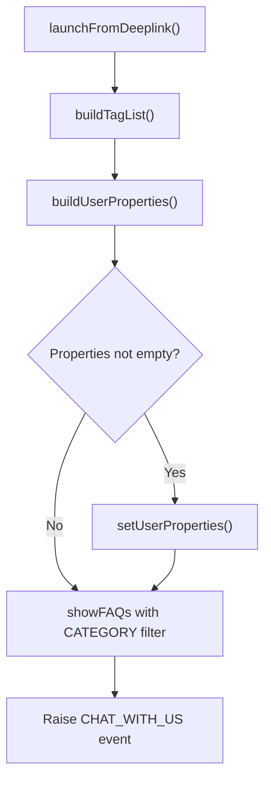

### Tag Building

Tags are built dynamically based on city:

1. Add current city name (lowercase)
2. Add common tag: `FRESHCHAT_COMMON_TAG`

### User Property Keys

| Key | Constant | Source |
|-----|----------|--------|
| City | USER_PROPERTY_CITY | cityProvider.getCurrentCityName() |
| Phone | USER_PROPERTY_PHONE_NO | profile.mobileNumber |
| User ID | USER_PROPERTY_USER_ID | profile.userId |
| User Name | USER_PROPERTY_USER_NAME | profile.getFullName() |

---

## InitiateProductHistorySyncCallUseCase

While not exclusively a Report Problem use case, this is invoked after successful device auto-linking to refresh the user's product data.

### Location

`shared/home/src/commonMain/kotlin/app/chalo/usecase/InitiateProductHistorySyncCallUseCase.kt`

### Responsibility

The use case synchronizes all product data (passes, tickets, bookings) from the backend after device changes. It processes multiple product types in sections and tracks success/failure for each.

### Constructor Dependencies

The use case has many dependencies reflecting its role as a central product sync orchestrator:

| Dependency | Type | Purpose |
|------------|------|---------|
| productDataSyncRepository | IProductDataSyncRepository | Backend API access |
| stringProvider | StringProvider | Error messages |
| basicInfoContract | BasicInfoContract | App version info |
| deviceInfo | Device | Device platform |
| cityProvider | CityProvider | Current city |
| coroutineContextProvider | CoroutineContextProvider | Thread dispatchers |
| reclaimDataStoreWrapper | ReclaimDataStoreWrapper | Reclaim state |
| userProfileDetailsProvider | UserProfileDetailsProvider | User ID |
| crashlyticsLogger | CrashlyticsLogger | Error reporting |
| superPassHistoryCallHelper | SuperPassHistoryCallHelper | Pass updates |
| mobileTicketingConverter | MobileTicketingConverters | Data transformation |
| proofDocumentPropsStore | LocalDataStore | Document config |
| productConfigStore | LocalDataStore | Product config |
| getPremiumBusCurrentCityConfigUseCase | GetPremiumBusCurrentCityConfigUseCase | Premium bus config |
| instantTicketRepository | InstantTicketRepository | Instant tickets |
| premiumBusRepository | PremiumBusRepository | Premium bus tickets |
| ondcRepository | OndcRepository | ONDC tickets |
| metroTicketRepository | MetroRepository | Metro tickets |
| analyticsContract | AnalyticsContract | Event tracking |
| ticketRepository | TicketRepository | M-Tickets |
| mTicketHelper | MTicketUtilsHelper | Ticket utilities |
| mandatoryFirstHistoryCallGuard | MandatoryFirstHistoryCallGuard | Sync state |

### Invocation Flow

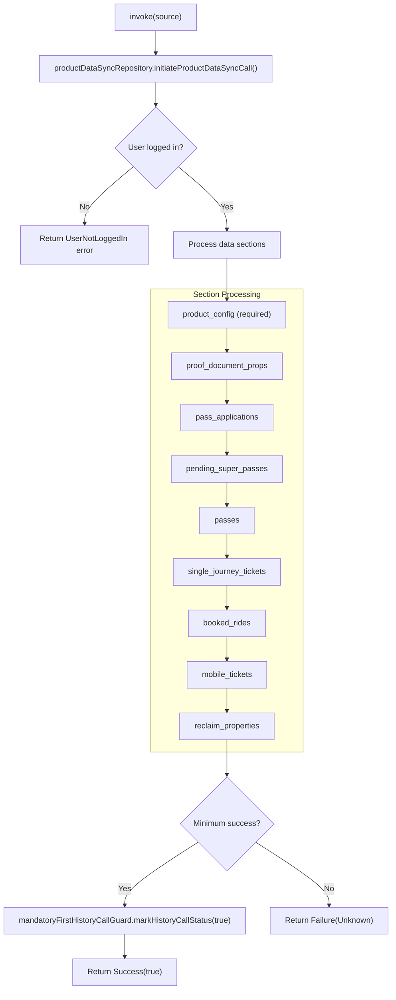

### Section Processing

Each section is processed independently with error isolation:

| Section | Required | Data Updated |
|---------|----------|--------------|
| product_config | Yes | Product configuration store |
| proof_document_props | No | Document verification props |
| pass_applications | No | Super Pass applications |
| pending_super_passes | No | Pending Super Passes |
| passes | No | Active passes |
| single_journey_tickets | No | M-Tickets |
| booked_rides | No | Super Pass bookings |
| mobile_tickets | No | Instant, Premium, ONDC, Metro tickets |
| reclaim_properties | No | Multi-device indicator |

### Minimum Success Criteria

The sync is considered successful if:
1. `product_config` section succeeded AND
2. At least one "core" section succeeded (passes, pass_applications, pending_super_passes, single_journey_tickets, mobile_tickets, booked_rides)

### Error Types

```kotlin
sealed class ProductHistorySyncErrorType(val description: String) {
    data object ProductConfigNotAvailable : ProductHistorySyncErrorType("product config not available")
    data object MTicketDetailsNotAvailable : ProductHistorySyncErrorType("m-ticket details not available")
    data class ResponseParsing(val desc: String) : ProductHistorySyncErrorType(desc)
    data class API(val desc: String) : ProductHistorySyncErrorType(desc)
    data class Unknown(val desc: String) : ProductHistorySyncErrorType(desc)
    data class UserNotLoggedIn(val desc: String) : ProductHistorySyncErrorType(desc)
}
```

---

## Domain Models

### ReportProblemCollection

Represents a complete collection of categorized problems:

| Field | Type | Description |
|-------|------|-------------|
| problemCollectionId | String | Unique identifier |
| title | String | Display title |
| categoryList | List<ReportProblemFeatureCategory> | Problem categories |

### ReportProblemFeatureCategory

Groups related problems under a category:

| Field | Type | Description |
|-------|------|-------------|
| categoryId | String | Unique identifier |
| categoryName | String | Display name |
| problemList | List<ReportProblemFeatureProblem> | Problems in category |

### ReportProblemFeatureProblem

Individual problem definition with routing data:

| Field | Type | Default | Description |
|-------|------|---------|-------------|
| problemId | String | - | Unique identifier |
| problemCopy | String | - | User-facing text |
| ctaTagList | List<String> | - | Routing tags |
| chatGroupTag | String | "" | Chat routing group |
| ctaType | String | - | Action type |

### ReportProblemFeatureData

Launch parameter bundle:

| Field | Type | Description |
|-------|------|-------------|
| collectionId | String | Problem collection to display |
| source | String | Source screen identifier |
| userPropertiesMap | MutableMap<String, String> | Freshchat context |
| areAdditionalProblemsRequired | Boolean | Include reclaim category |
| supportContactNumber | String? | Phone support number |

### ReportProblemMetadata

City-specific problem configuration:

| Field | Type | Description |
|-------|------|-------------|
| tagDetailsMap | Map<String, String> | Tag ID to display name |
| title | String | Dialog title |
| hint | String | Input field hint |
| tagList | List<String> | Available problem tags |

---

## Sequence Diagrams

### Complete Freshchat Article Flow

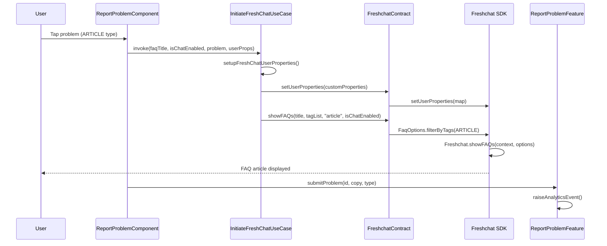

### Complete Pass Reclamation Flow

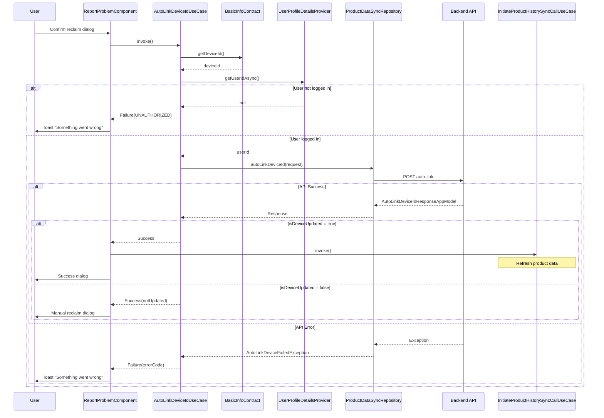

---

## Error Handling Summary

| Use Case | Error Type | Handling |
|----------|------------|----------|
| InitiateFreshChatUseCase | Invalid CTA type | Silently skipped (no action) |
| InitiateFreshChatUseCase | Empty tagList | Falls through to routing |
| AutoLinkDeviceIdUseCase | Not logged in | Return UNAUTHORIZED error |
| AutoLinkDeviceIdUseCase | API exception | Extract error code, return failure |
| ReportProblemFeature | JSON parse error | Log via Crashlytics, use empty data |
| ReportProblemFeature | Collection not found | Return null, skip navigation |

---

## User Property Constants

All user property keys are defined in `ReportProblemFeatureConstants`:

| Constant | String Value | Description |
|----------|--------------|-------------|
| USER_PROPERTY_ORDER_ID | "userPropertyOrderId" | Order reference |
| USER_PROPERTY_BOOKING_ID | "userPropertyBookingId" | Booking reference |
| USER_PROPERTY_MTICKET_ID | "userPropertyMTicketId" | M-Ticket reference |
| USER_PROPERTY_MPASS_ID | "userPropertyMPassId" | M-Pass reference |
| USER_PROPERTY_ROUTE_ID | "userPropertyRouteId" | Route context |
| USER_PROPERTY_ROUTE_NAME | "userPropertyRouteName" | Route display name |
| USER_PROPERTY_CITY | "userPropertyCity" | City context |
| USER_PROPERTY_PHONE_NO | "userPropertyPhoneNo" | Contact number |
| USER_PROPERTY_USER_NAME | "userPropertyUserName" | User display name |
| USER_PROPERTY_USER_ID | "userPropertyUserID" | Unique user ID |
| USER_PROPERTY_AGENCY_NAME | "userPropertyAgencyName" | Transit agency |
| USER_PROPERTY_PASSES_ON_MULTIPLE_DEVICES | "userPropertyPassesOnMultipleDevices" | Multi-device indicator |
| USER_PROPERTY_IS_USER_LOGGED_IN | "userPropertyIsUserLoggedId" | Auth state |
