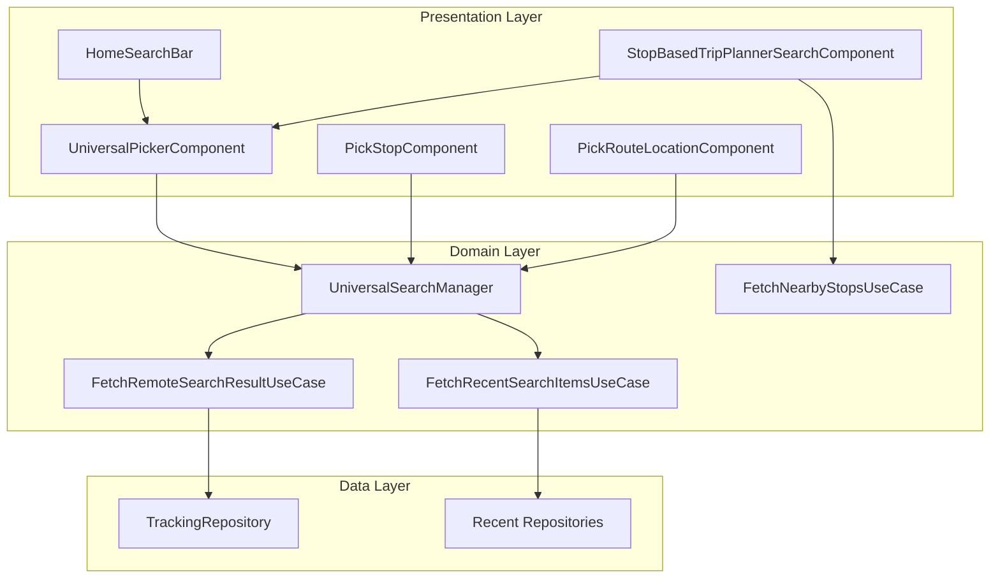
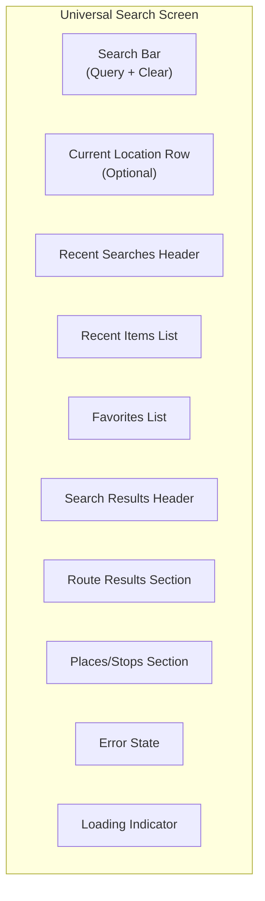
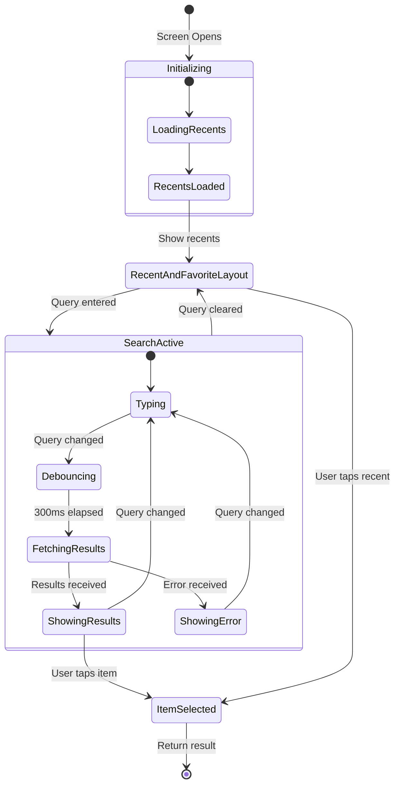
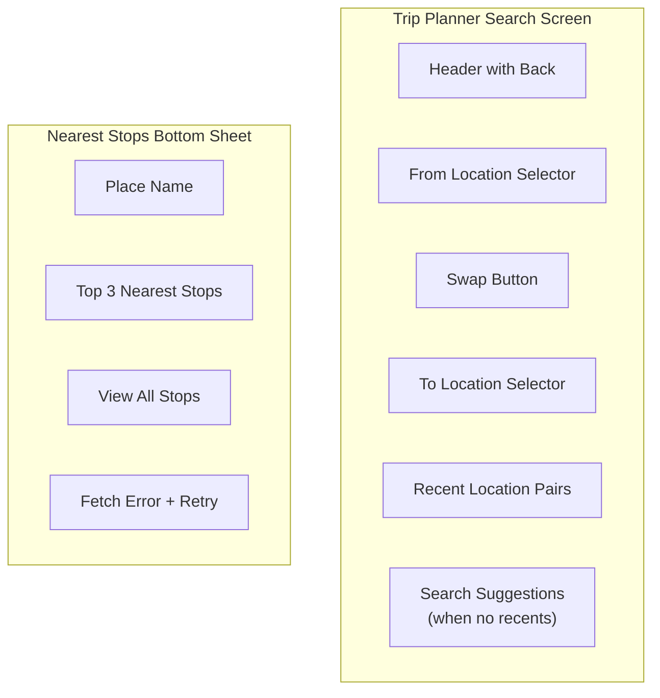
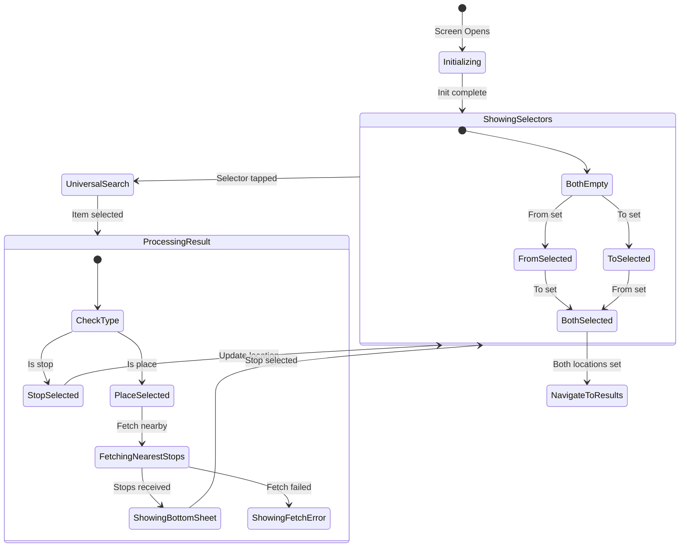
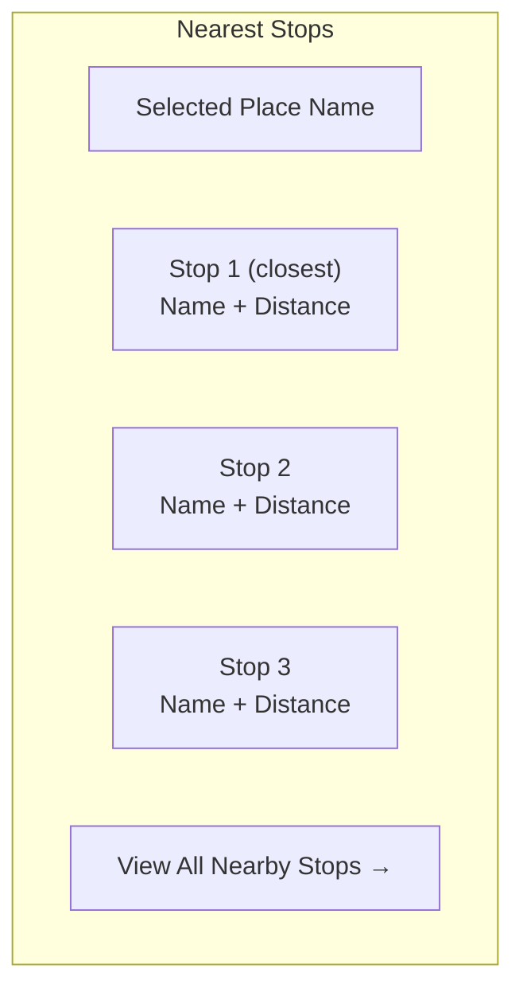
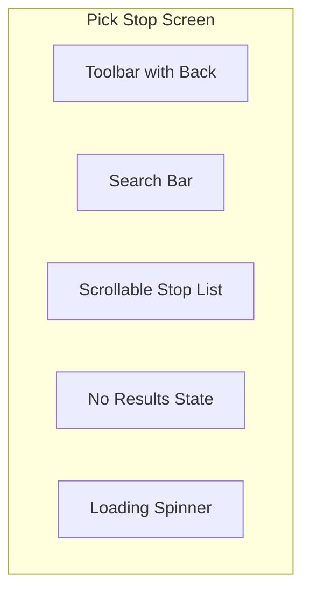
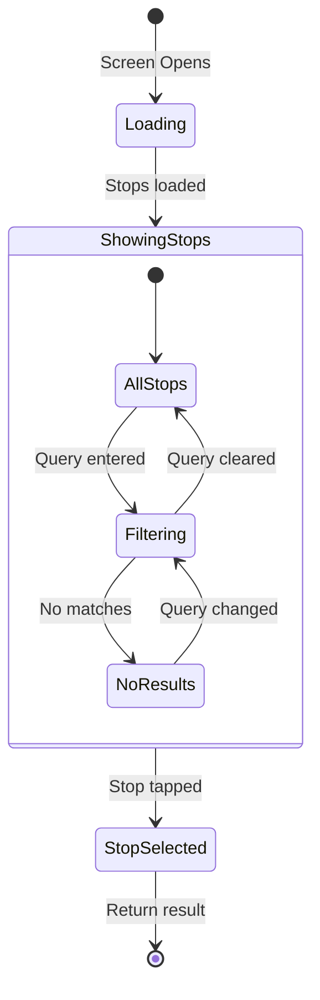
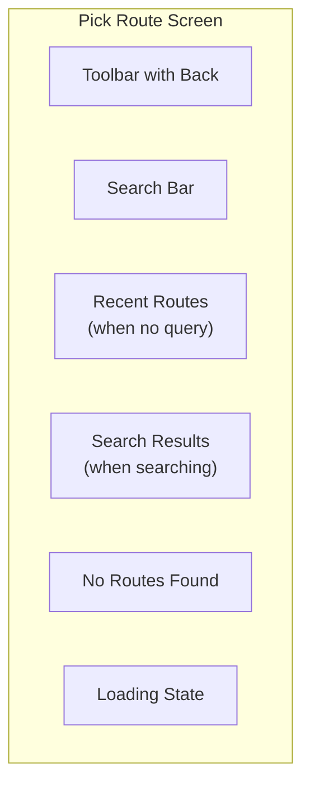
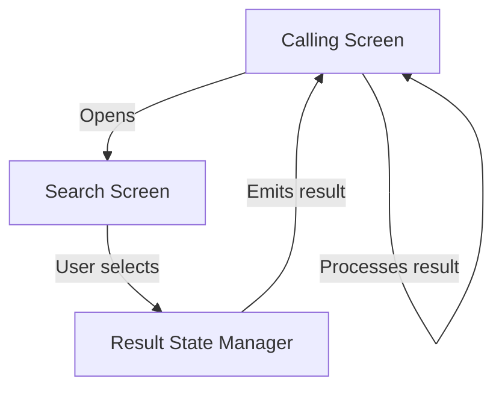

# Search — Component Documentation

## Architecture Overview

The Search feature follows the **Decompose + MVI** pattern with multiple specialized search components. The universal picker handles general search across stops, places, and routes, while dedicated components serve specific flows like trip planning and product booking.

---

## Screen Inventory

| Screen | Component | Purpose | Entry From |
|--------|-----------|---------|------------|
| **Universal Search** | UniversalPickerComponent | Multi-type search (stops, places, routes) | Home, Trip Planner, Booking |
| **Trip Planner Search** | StopBasedTripPlannerSearchComponent | Origin/destination selection | Trip Planner |
| **Pick Stop** | PickStopComponent | Stop selection for booking | Product Booking |
| **Pick Route** | PickRouteLocationComponent | Route selection for booking | Product Booking |
| **Home Search Bar** | HomeSearchBarCard | Search entry point | Home Screen |

---

## Universal Search Picker

**Purpose:** Multi-type search component that supports stops, places, routes, and trips with autocomplete and recent searches.

### User Journey

1. User taps search bar or location selector
2. Initial screen shows recent searches and favorites
3. User types query in search field
4. Results populate with debounced autocomplete
5. Results grouped by type (routes, places, stops)
6. User selects an item
7. Result returned to calling screen

### Screen Layout

### Layout Types

| Type | Display When | Content |
|------|--------------|---------|
| **RECENT_AND_FAVORITE_SCREEN** | Empty query | Favorites + recent searches |
| **REMOTE_SEARCHED_ITEM_SCREEN** | Has query + results | API search results |
| **RECENT_RESULT_SCREEN** | Query matches recents | Filtered recent items |
| **ERROR_SCREEN** | Search failed | Error message + retry |

### State Flow

### Search Options Configuration

The search behavior is configured via `UniversalSearchOptions`:

| Option | Parameters | Usage |
|--------|------------|-------|
| **PLACES** | showRecent, showFavorites, shouldShowHeader | Places autocomplete |
| **ROUTES** | showRecent, showFavorites | Route search |
| **STOPS** | showRecent, showFavorites | Stop search |
| **TRIPS** | showRecent, shouldShowStopBasedTrips, shouldShowPlacesBasedTrips | Trip history |
| **ALL** | — | Combined search |

### Search Filter Types

| Filter | API Parameter | Results |
|--------|---------------|---------|
| **STOPS** | "stops" | Bus/metro stops only |
| **PLACES** | "places" | Addresses and landmarks |
| **ROUTES** | "routes" | Bus routes by number/name |
| **TRIPS** | "trips" | Saved trips |
| **ALL** | null | All types |

### Result Item Display

**Route Result:**

| Element | Content |
|---------|---------|
| **Icon** | Transit mode icon |
| **Primary** | Route name/number |
| **Secondary** | "From X to Y" or via text |
| **Tags** | AC, Free Ride, Agency |

**Stop/Place Result:**

| Element | Content |
|---------|---------|
| **Icon** | Stop or place marker |
| **Primary** | Stop/place name |
| **Secondary** | Address or description |
| **Badge** | Transit mode (for stops) |

---

## Stop-Based Trip Planner Search

**Purpose:** Dedicated search component for selecting origin and destination with support for place-to-nearest-stop resolution.

### User Journey

1. User opens trip planner
2. From/To selectors displayed
3. Recent location pairs shown (if available)
4. User taps From or To selector
5. Universal search opens for stop/place selection
6. If place selected, nearest stops fetched
7. User picks specific stop or "all nearby"
8. Process repeats for other location
9. Both selected → navigate to results

### Screen Layout

### State Flow

### Selected Location Types

| Type | Scenario | Contains |
|------|----------|----------|
| **StopSelected** | User picked a stop directly | StopAppModel |
| **PlaceSelected** | User picked a place (no stop) | RecentPlaceAppModel |
| **NearestStopToPlaceSelected** | User picked nearest stop to place | Stop + Place + distance |
| **AllNearbyStopSelected** | User wants all nearby stops | Place reference |

### Bottom Sheet States

| State | Display |
|-------|---------|
| **NearestStops** | Top 3 stops + "View all" button |
| **NearestStopFetchError** | Error message + retry button |
| **None** | Bottom sheet hidden |

### Nearest Stops Display

---

## Pick Stop Component

**Purpose:** Simple stop picker for product booking flows with search and filtering.

### User Journey

1. Booking flow needs stop selection
2. Screen shows all available stops
3. User can search/filter by name
4. User selects a stop
5. Result returned to booking flow

### Screen Layout

### State Flow

### Stop List Item

| Element | Content |
|---------|---------|
| **Icon** | Transit mode icon |
| **Primary** | Stop name |
| **Secondary** | Stop address |
| **Trailing** | Selection indicator |

---

## Pick Route Location Component

**Purpose:** Route picker for booking flows with recent routes and search.

### User Journey

1. Booking flow needs route selection
2. Screen shows recent routes (if available)
3. User can search routes by name/number
4. Search results show route details
5. User selects a route
6. Result returned to booking flow

### Screen Layout

### Layout Types

| Type | Display When | Content |
|------|--------------|---------|
| **RecentRouteSearches** | No query | Recent route list |
| **RemoteSearchItems** | Has query + results | Search results |
| **RemoteSearchEmptyResult** | Has query + no results | Empty state |

### Route Item Display

| Element | Content |
|---------|---------|
| **Icon** | Transit mode icon (bus, metro) |
| **Route Number** | Route name/number |
| **Details** | "From X to Y" |
| **Tags** | AC, Free Ride, Agency name |
| **Via** | Via text (if applicable) |

---

## Home Search Bar

**Purpose:** Non-editable search bar entry point on home screen.

### Component Behavior

| Aspect | Implementation |
|--------|----------------|
| **Display** | Search icon + placeholder text |
| **Interaction** | Single tap opens universal search |
| **Style** | Card with rounded corners |
| **Position** | Below header on home screen |

### Tap Behavior

When tapped, opens UniversalPicker with:
- Source: HOME_SCREEN
- Options: ALL (stops, places, routes)
- Destination: Based on feature config

---

## State Management

All screens follow the MVI pattern with DataState to ViewState transformation.

### Universal Picker State

| State Field | Description |
|-------------|-------------|
| **recentSearchUiData** | Formatted recent search items |
| **universalSearchItem** | Current search results |
| **searchBarPlaceHolderString** | Search bar hint text |
| **isRouteItemExpanded** | Route details expanded |
| **shouldShowAgencyTag** | Show agency on routes |
| **layoutType** | Current layout variant |
| **errorLayout** | Error screen type |
| **isLoading** | Loading indicator |
| **currentQuery** | Current search text |
| **source** | Search flow source |
| **universalSearchOptions** | Search configuration |
| **destinationAfterUniversalSearch** | Where to navigate after selection |
| **currentLocation** | User's current location |

### Trip Planner Search State

| State Field | Description |
|-------------|-------------|
| **fromLocation** | Selected origin |
| **toLocation** | Selected destination |
| **currentLocation** | User's GPS location |
| **recentList** | Recent location pairs |
| **nearestStopsForFromPlace** | Nearby stops for origin place |
| **nearestStopsForToPlace** | Nearby stops for destination place |
| **showLoadingDialog** | Loading overlay |
| **bottomSheetState** | Current bottom sheet |
| **searchTarget** | FROM, TO, or NONE |

### Pick Stop State

| State Field | Description |
|-------------|-------------|
| **transitMode** | Filter by transit mode |
| **showLoader** | Loading state |
| **currentStopList** | Available stops |
| **currentQuery** | Filter query |
| **shouldShowNoInternetSnackbar** | Offline indicator |

### Intent Types

| Screen | Key Intents |
|--------|-------------|
| **Universal Picker** | ViewCreatedIntent, SearchBarTextChangeIntent, StopItemClickIntent, PlaceItemClickIntent, RouteItemClick, RecentItemClick, SaveToFavorite |
| **Trip Planner** | InitialisationIntent, OnFromLocationClick, OnToLocationClick, OnSwapButtonClick, OnRecentTripClicked, OnNearestStopSelected |
| **Pick Stop** | InitialIntent, SearchAndLoadStopListIntent, SelectStopIntent, ClearSearchTextFieldIntent |
| **Pick Route** | InitializationIntent, SearchTextEnteredIntent, RouteSelectedIntent, RecentRouteSelectedIntent |

---

## Navigation

### Entry Points

| Source | Destination | Search Options |
|--------|-------------|----------------|
| Home screen | Universal Picker | ALL |
| Trip planner from/to | Universal Picker | STOPS, PLACES |
| Product booking stop | Pick Stop | Transit-specific stops |
| Product booking route | Pick Route | Transit-specific routes |
| Chalo bus origin/dest | Universal Picker | STOPS, PLACES |

### Result Flow

### Result Types by Context

| Context | Expected Result |
|---------|-----------------|
| **Home search** | Stop/Route/Place → Navigate to detail |
| **Trip planner** | Stop/Place → Set as origin/destination |
| **Product booking** | Stop → Set as boarding/alighting |
| **Route selection** | Route → Set for booking |

---

## Analytics Events

### Universal Search Events

| Event | Properties | Trigger |
|-------|------------|---------|
| `search_screen_opened` | source | Screen displayed |
| `search_query_entered` | query, source | Query typed |
| `search_result_item_clicked` | item_type, item_id | Result selected |
| `search_recent_item_clicked` | item_type, item_id | Recent selected |
| `search_favorite_item_clicked` | item_type, item_id | Favorite selected |
| `search_current_location_clicked` | source | Current location tapped |

### Trip Planner Events

| Event | Properties | Trigger |
|-------|------------|---------|
| `trip_planner_search_opened` | source | Screen displayed |
| `trip_planner_from_selected` | location_type | Origin set |
| `trip_planner_to_selected` | location_type | Destination set |
| `trip_planner_swap_clicked` | — | Swap button tapped |
| `trip_planner_recent_clicked` | — | Recent pair selected |
| `nearest_stop_selected` | distance, place_name | Stop from sheet selected |

---

## Platform Differences

### Android-Specific

| Feature | Implementation |
|---------|----------------|
| **Places Autocomplete** | Google Maps Places API |
| **Current Location** | FusedLocationProviderClient |
| **Keyboard** | Standard Android IME |

### iOS-Specific

| Feature | Implementation |
|---------|----------------|
| **Places Autocomplete** | Apple MapKit |
| **Current Location** | CoreLocation |
| **Keyboard** | iOS keyboard |

---

## Error Handling

| Scenario | UI Response |
|----------|-------------|
| **No results found** | Empty state with message |
| **API timeout** | Error screen with retry |
| **Network offline** | Falls back to offline search |
| **Invalid place** | Shows error, disables selection |
| **Nearest stops fetch failed** | Error bottom sheet with retry |
| **Current location unavailable** | Hide current location option |
