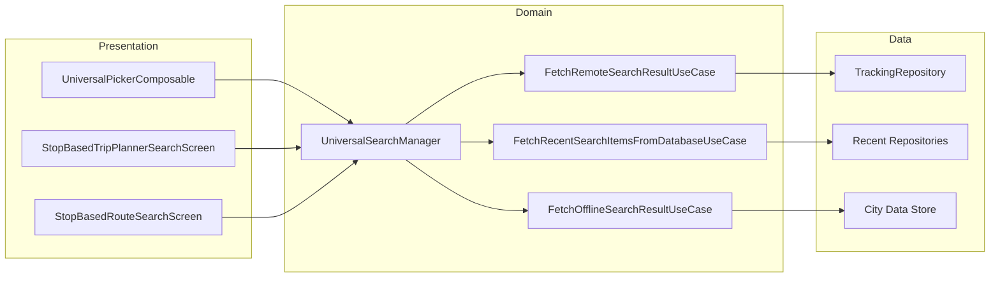

# Search — High-Level Design

## Overview

The Search feature provides universal search functionality across the Chalo app. Users can search for stops, places, routes, and trips with autocomplete suggestions. The feature supports both online (API-based) and offline (local city data) search modes, with recent searches and favorites management.

## User Journey

1. **Entry Points**:
   - Home screen search bar
   - Trip planner from/to selection
   - Route selection for product purchase
   - Chalo bus origin/destination selection

2. **Core Flow**:
   - Tap search field or location selector
   - View recent searches and favorites
   - Type query for autocomplete results
   - Select stop, place, route, or trip
   - Return result to calling screen

3. **Exit Points**:
   - Item selected → Returns to caller with result
   - Back navigation → Returns unchanged
   - Current location selected → Returns GPS coordinates

## Architecture Diagram



## Key Components

| Component | Platform | File Path | Responsibility |
|-----------|----------|-----------|----------------|
| `UniversalPickerComponent` | Shared | `shared/livetracking/.../universalsearch/ui/UniversalPickerComponent.kt` | Main search MVI component |
| `StopBasedTripPlannerSearchComponent` | Shared | `shared/livetracking/.../search/StopBasedTripPlannerSearchComponent.kt` | Trip planner search |
| `StopBasedRouteSearchForProductPurchaseComponent` | Shared | `shared/productbooking/.../routeselection/ui/StopBasedRouteSearchForProductPurchaseComponent.kt` | Product purchase route search |
| `UniversalSearchManager` | Shared | `shared/livetracking/.../universalsearch/UniversalSearchManagerImpl.kt` | Search orchestration |
| `FetchRemoteSearchResultUseCase` | Shared | `shared/livetracking/.../universalsearch/domain/FetchRemoteSearchResultUseCase.kt` | API autocomplete search |
| `FetchOfflineSearchResultUseCase` | Shared | `shared/livetracking/.../universalsearch/domain/FetchOfflineSearchResultUseCase.kt` | Local offline search |
| `TrackingRepository` | Shared | `shared/livetracking/.../universalsearch/data/repository/TrackingRepository.kt` | Search API abstraction |

## Data Flow

### Universal Search (Online)
1. User types in search field
2. `UniversalSearchManager` debounces input (300ms)
3. `FetchRemoteSearchResultUseCase` calls autocomplete API
4. Results converted via `ConvertSearchedResultItemsAppModelToUiModelUseCase`
5. UI renders grouped results (stops, places, routes)
6. User selects item
7. Result returned to caller via `UniversalSearchResultStateManager`

### Offline Search
1. Network unavailable detected
2. `FetchOfflineSearchResultUseCase` queries local city data
3. Prefix matching → substring matching
4. Results limited and displayed
5. Same selection flow as online

### Recent Searches & Favorites
1. `FetchRecentSearchItemsFromDatabaseUseCase` queries 4 repositories
2. Place, Stop, Route, Trip recent items combined
3. Sorted by access time (most recent first)
4. Favorites filtered via `FilterFavoriteMarkedStopsAndPlacesFromRecentItemsUseCase`

## Platform Differences

### Android-Specific
- Google Maps integration for places autocomplete
- Current location via `FusedLocationProviderClient`

### iOS-Specific
- Apple Maps places integration
- Current location via CoreLocation

## Integration Points

### Analytics Events
- `search_screen_opened`
- `search_query_entered`
- `search_result_item_clicked` (with item type)
- `search_recent_item_clicked`
- `search_favorite_item_clicked`
- `search_current_location_clicked`

### Shared Services
- **Location**: `ChaloLocationManager` for current location
- **City Data**: Local stop and route data
- **Network State**: Online/offline mode detection

### Navigation
- **Navigates to**: None (returns result)
- **Navigated from**: Home, Trip planner, Product booking, Chalo bus

## Search Types

| Type | Description | Data Source |
|------|-------------|-------------|
| `STOPS` | Bus stops with IDs | API + Local |
| `PLACES` | Addresses, landmarks | API (Google/Apple) |
| `ROUTES` | Bus routes by number/name | API + Local |
| `TRIPS` | Saved trips | Local database |

## Edge Cases & Error Handling

| Scenario | Handling |
|----------|----------|
| Network offline | Falls back to offline search |
| No results found | Shows empty state message |
| API timeout | Falls back to offline + shows message |
| Invalid place coordinates | Shows error, disables selection |
| Unsupported aspect ratio | Filters out from results |

## Search Configuration

### UniversalSearchOptions
```kotlin
sealed class UniversalSearchOption {
    data class PLACES(
        val showRecent: Boolean,
        val showFavorites: Boolean,
        val shouldShowHeader: Boolean
    )
    data class ROUTES(val showRecent: Boolean, val showFavorites: Boolean)
    data class STOPS(val showRecent: Boolean, val showFavorites: Boolean)
    data class TRIPS(
        val showRecent: Boolean,
        val shouldShowStopBasedTrips: Boolean,
        val shouldShowPlacesBasedTrips: Boolean
    )
    object ALL
}
```

### AutoCompleteSearchFilter
```kotlin
enum class AutoCompleteSearchFilter {
    STOPS,
    PLACES,
    ROUTES,
    TRIPS,
    ALL
}
```

## Data Models

### UniversalSearchResultType
```kotlin
enum class UniversalSearchResultType {
    PLACE,
    STOP,
    ROUTE,
    TRIP
}
```

### UniversalSearchRecentSearchItem
```kotlin
sealed class UniversalSearchRecentSearchItem {
    data class Place(val placeInfo: PlacesInfoDataAppModel)
    data class Stop(val stopInfo: StopInfoAppModel)
    data class Route(val routeInfo: UniversalSearchRouteAppModel)
    data class Trip(val tripInfo: TripAppModel)
}
```

### SearchedResultItemsAppModel
```kotlin
data class SearchedResultItemsAppModel(
    val routes: List<UniversalSearchRouteAppModel>,
    val placesAndStops: List<PlaceAndStopInfoAppModel>
)
```

## API Endpoints

| Endpoint | Method | Purpose |
|----------|--------|---------|
| `search/v1/autocomplete` | GET | Standard autocomplete |
| `search/v1/autocomplete/places` | GET | City-independent places |
| `search/v1/place/details` | GET | Get lat/lng for place ID |
| `search/v1/ondc/autocomplete` | GET | ONDC-specific search |

## Dependencies

### Internal
- `shared:livetracking` — Universal search module
- `shared:productbooking` — Route selection components
- `shared:framework-city-data` — Local city data
- `shared:chalo-base` — Recent repositories, state managers

### External
- Google Maps Places API (Android)
- Apple MapKit (iOS)
- DataStore — Recent searches persistence
