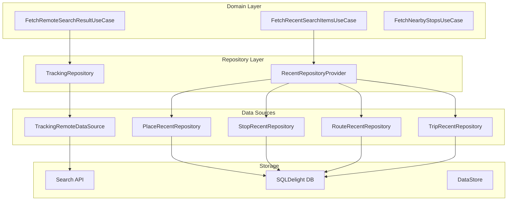
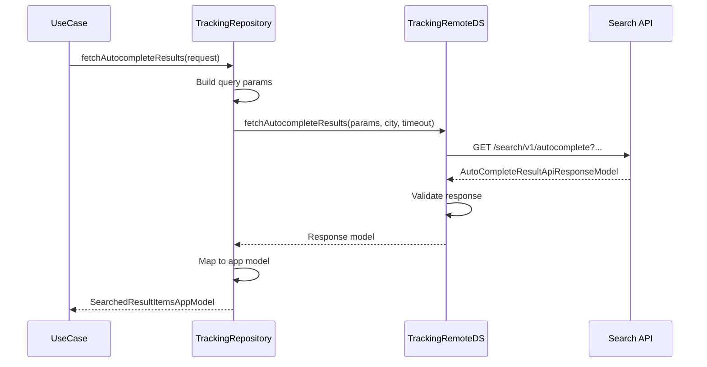
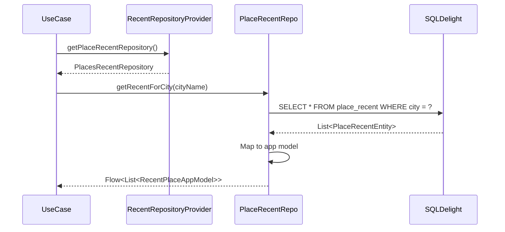
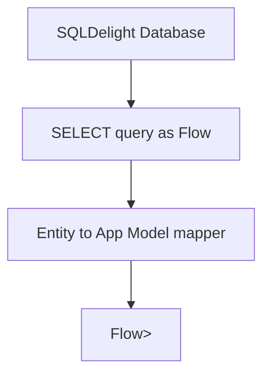
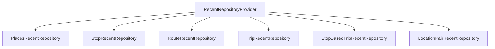
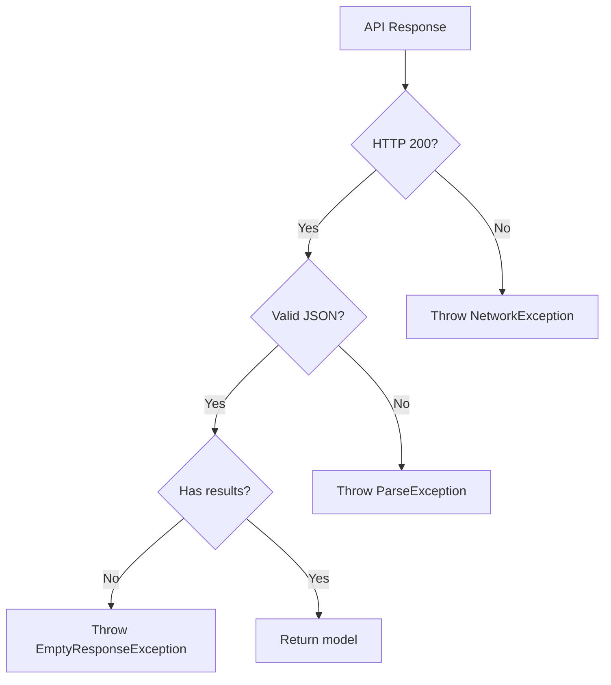
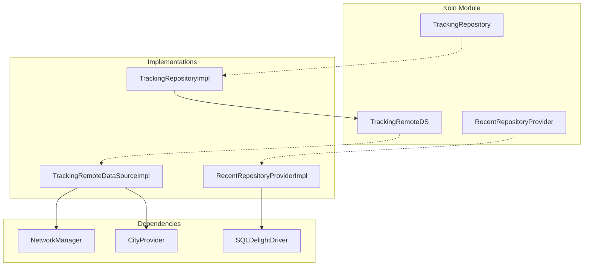

# Search — Repository Documentation

## Data Layer Overview

The data layer handles search API calls and recent item persistence. It follows the **Repository Pattern** with a tracking repository for search and multiple recent repositories for different item types.

---

## Repository Operations

### Tracking Repository

| Operation | Description | Data Flow |
|-----------|-------------|-----------|
| **fetchAutocompleteResults** | Search stops, places, routes | Remote → Transform → Return |
| **fetchCityIndependentAutocompleteResults** | Search places across all cities | Remote → Transform → Return |
| **fetchLatLngForPlaceWithPlaceID** | Get coordinates for place ID | Remote → Return |
| **fetchOndcAutoCompleteResults** | ONDC-specific search | Remote → Transform → Return |

### Recent Repositories

| Operation | Description | Data Flow |
|-----------|-------------|-----------|
| **getRecentForCity** | Get recents for current city | Local → Flow |
| **addRecent** | Save new recent item | Transform → Local |
| **updateAccessTime** | Update item access timestamp | Local |
| **markAsFavorite** | Set favorite status | Local |
| **removeRecent** | Delete recent item | Local |

---

## API Endpoints

### Autocomplete Search

Standard search for stops, places, and routes.

| Property | Value |
|----------|-------|
| **Endpoint** | `search/v1/autocomplete` |
| **Method** | GET |
| **Auth** | Required |
| **Base URL** | ChaloBaseUrl from city config |

**Query Parameters:**

| Param | Type | Required | Description |
|-------|------|----------|-------------|
| **q** | String | Yes | Search query |
| **source** | String | Yes | Flow source for analytics |
| **filters** | String | No | Comma-separated filters (stops,places,routes) |
| **city** | String | Yes | City identifier |
| **userId** | String | Yes | User ID |
| **lang** | String | Yes | Language code |
| **lat** | Double | Yes | User latitude |
| **lng** | Double | Yes | User longitude |
| **tz** | String | Yes | Timezone ID |
| **isForMTicket** | Boolean | No | M-Ticket context flag |

**Response:**

| Field | Type | Description |
|-------|------|-------------|
| **data** | Object | Search results container |
| **data.routes** | List | Route results |
| **data.placesAndStops** | List | Place/stop results |

---

### City-Independent Places Search

Search places across all cities (used for trip planning).

| Property | Value |
|----------|-------|
| **Endpoint** | `search/v1/autocomplete/places` |
| **Method** | GET |
| **Auth** | Required |

**Query Parameters:**

| Param | Type | Required | Description |
|-------|------|----------|-------------|
| **q** | String | Yes | Search query |
| **countryId** | String | Yes | Country filter |
| **userId** | String | Yes | User ID |
| **lang** | String | Yes | Language code |
| **lat** | Double | Yes | User latitude |
| **lng** | Double | Yes | User longitude |

**Response:** Same structure as autocomplete

---

### Place Details

Get coordinates for a place ID.

| Property | Value |
|----------|-------|
| **Endpoint** | `search/v1/place/details` |
| **Method** | GET |
| **Auth** | Required |

**Query Parameters:**

| Param | Type | Required | Description |
|-------|------|----------|-------------|
| **placeId** | String | Yes | Place identifier from search |
| **searchPartner** | String | Yes | API partner (google, apple) |
| **userId** | String | Yes | User ID |
| **deviceId** | String | No | Device identifier |

**Response:**

| Field | Type | Description |
|-------|------|-------------|
| **lat** | Double | Place latitude |
| **lng** | Double | Place longitude |
| **formattedAddress** | String | Full address |

---

### ONDC Autocomplete

ONDC protocol-specific search.

| Property | Value |
|----------|-------|
| **Endpoint** | `search/v1/ondc/autocomplete` |
| **Method** | GET |
| **Auth** | Required |

**Additional Parameters:**

| Param | Type | Required | Description |
|-------|------|----------|-------------|
| **category** | String | Yes | Transit mode (bus, metro) |

**Response:** Same structure as standard autocomplete

---

## Data Flow

### Search Request Flow

### Recent Items Flow

---

## Data Transformations

### API Response to App Model

**Route Result:**

| API Field | App Field | Transformation |
|-----------|-----------|----------------|
| routeId | routeId | Direct |
| routeName | routeName | Direct |
| transportType | transportType | Direct |
| firstStopName | firstStopName | Null coalesce to "" |
| lastStopName | lastStopName | Null coalesce to "" |
| agencyName | agencyName | Null coalesce to "" |
| trackingSpecialFeature | trackingSpecialFeature | List mapping |
| isFreeRide | isFreeRide | Direct |
| via | via | Direct |
| routeNamingScheme | routeNamingScheme | Parse to enum |

**Place/Stop Result:**

| API Field | App Field | Transformation |
|-----------|-----------|----------------|
| resultType | resultType | Parse "place"/"stop" to enum |
| description | description | Null coalesce to "" |
| placeId | placeId | Null coalesce to "" |
| stopId | stopId | Null coalesce to "" |
| stopName | stopName | Null coalesce to "" |
| stopLat, stopLon | stopLocation | Convert to LatLng |
| stationType | transitMode | Parse via ChaloTransitMode.fromString() |
| stopAddress | stopAddress | Direct |
| searchPartner | searchPartner | Null coalesce to "" |

### Recent Entity to App Model

**Place Recent:**

| Entity Field | App Field | Transformation |
|--------------|-----------|----------------|
| place_id | placeId | Direct |
| search_partner | searchPartner | Direct |
| location_title | locationTitle | Direct |
| location_description | locationDescription | Direct |
| lat, lng | latLng | Convert to LatLng |
| label | label | Direct |
| access_time | accessTime | Direct |
| special_status | specialStatus | Parse to enum |

**Stop Recent:**

| Entity Field | App Field | Transformation |
|--------------|-----------|----------------|
| stop_id | stopId | Direct |
| stop_json | stop | Parse JSON to StopAppModel |
| access_time | accessTime | Direct |
| access_count | accessCount | Direct |
| label | label | Direct |
| special_status | specialStatus | Parse to enum |

---

## Local Storage

### Database Tables

The feature uses SQLDelight for recent items persistence.

**place_recent Table:**

| Column | Type | Description |
|--------|------|-------------|
| **place_id** | TEXT | Primary key |
| **city** | TEXT | City identifier |
| **search_partner** | TEXT | API partner |
| **location_title** | TEXT | Place name |
| **location_description** | TEXT | Address |
| **lat** | REAL | Latitude |
| **lng** | REAL | Longitude |
| **label** | TEXT | Custom label |
| **access_time** | INTEGER | Last access (epoch ms) |
| **special_status** | TEXT | FAVOURITE, RECENT, NONE |

**stop_recent Table:**

| Column | Type | Description |
|--------|------|-------------|
| **stop_id** | TEXT | Primary key |
| **city** | TEXT | City identifier |
| **stop_json** | TEXT | Serialized StopAppModel |
| **access_time** | INTEGER | Last access (epoch ms) |
| **access_count** | INTEGER | Access count |
| **label** | TEXT | Custom label |
| **special_status** | TEXT | FAVOURITE, RECENT, NONE |

**route_recent Table:**

| Column | Type | Description |
|--------|------|-------------|
| **route_id** | TEXT | Primary key |
| **city** | TEXT | City identifier |
| **route_name** | TEXT | Route name |
| **start_stop** | TEXT | First stop name |
| **end_stop** | TEXT | Last stop name |
| **agency** | TEXT | Agency name |
| **transit_mode** | TEXT | Transit type |
| **access_time** | INTEGER | Last access (epoch ms) |
| **access_count** | INTEGER | Access count |
| **via** | TEXT | Via text |
| **route_scheme** | TEXT | Naming scheme |

**trip_recent Table:**

| Column | Type | Description |
|--------|------|-------------|
| **trip_id** | TEXT | Primary key |
| **city** | TEXT | City identifier |
| **from_location_json** | TEXT | Origin location JSON |
| **to_location_json** | TEXT | Destination location JSON |
| **transit_mode** | TEXT | Transit type |
| **access_time** | INTEGER | Last access (epoch ms) |

### Reactive Queries

All recent repositories expose data as Flows:

### Cache Strategy

| Data | Strategy | Invalidation |
|------|----------|--------------|
| **Recent Places** | SQLite persist | Manual delete or city change |
| **Recent Stops** | SQLite persist | Manual delete or city change |
| **Recent Routes** | SQLite persist | Manual delete or city change |
| **Recent Trips** | SQLite persist | Manual delete or city change |
| **Search Results** | No cache | Always fresh |

---

## Recent Repository Provider

The provider gives centralized access to all recent repositories.

### Provider Interface

| Method | Returns | Purpose |
|--------|---------|---------|
| **getRouteRecentRepository** | RouteRecentRepository | Route history |
| **getStopRecentRepository** | StopRecentRepository | Stop history |
| **getStopBasedTripRecentRepository** | StopBasedTripRecentRepository | Stop-based trips |
| **getPlaceRecentRepository** | PlacesRecentRepository | Place history |
| **getTripRecentRepository** | TripRecentRepository | Trip history |
| **getStopAndRouteBasedRecentRepository** | StopAndRouteBasedRecentRepository | Combined |
| **getLocationPairRecentRepository** | RecentLocationPairRepository | Location pairs |

### Repository Graph

---

## Exception Handling

### Remote Exceptions

| Exception | Cause | Contains |
|-----------|-------|----------|
| **NetworkTimeoutException** | Request timed out | Timeout duration |
| **SearchApiException** | API returned error | Error code, message |
| **ParseException** | JSON parsing failed | Parse error details |
| **NetworkException** | Network failure | Error message |

### Error Mapping Flow

### Timeout Handling

| Context | Default Timeout | Config Source |
|---------|-----------------|---------------|
| **Standard search** | 5000ms | Remote config |
| **Place details** | 3000ms | Hardcoded |
| **ONDC search** | 5000ms | Remote config |

---

## Dependency Injection

### Koin Bindings

| Interface | Implementation | Scope |
|-----------|----------------|-------|
| TrackingRepository | TrackingRepositoryImpl | Factory |
| TrackingRemoteDataSource | TrackingRemoteDataSourceImpl | Factory |
| RecentRepositoryProvider | RecentRepositoryProviderImpl | Singleton |
| PlacesRecentRepository | PlacesRecentRepositoryImpl | Singleton |
| StopRecentRepository | StopRecentRepositoryImpl | Singleton |
| RouteRecentRepository | RouteRecentRepositoryImpl | Singleton |
| TripRecentRepository | TripRecentRepositoryImpl | Singleton |

### Dependency Graph

---

## Platform Implementations

### Android

| Component | Implementation |
|-----------|----------------|
| **Network** | Ktor with OkHttp engine |
| **Database** | SQLDelight with Android driver |
| **Places API** | Google Maps Places SDK |

### iOS

| Component | Implementation |
|-----------|----------------|
| **Network** | Ktor with Darwin engine |
| **Database** | SQLDelight with Native driver |
| **Places API** | Apple MapKit |

### Search Partner Handling

| Partner | Android | iOS |
|---------|---------|-----|
| **Google** | Google Places API | Proxied through backend |
| **Apple** | Not used | Apple MapKit |
| **Internal** | Backend stops/routes | Backend stops/routes |

---

## Security

### Data Protection

| Data | Protection |
|------|------------|
| **Search queries** | Not stored |
| **Search results** | Not cached |
| **Recent items** | Plain SQLite (non-sensitive) |
| **Location data** | Transient (not persisted) |

### API Security

| Aspect | Implementation |
|--------|----------------|
| **Transport** | HTTPS only |
| **Authentication** | Bearer token |
| **Rate Limiting** | Server-side |

---

## Error Handling Summary

| Scenario | Exception | User Impact |
|----------|-----------|-------------|
| Network offline | NetworkException | Show offline message |
| Search timeout | NetworkTimeoutException | Show timeout + retry |
| Invalid response | ParseException | Show generic error |
| No results | EmptyResponseException | Show empty state |
| API error | SearchApiException | Show server message |
| Database error | SQLiteException | Show generic error |
