# Search — UseCase Documentation

## Domain Layer Overview

The domain layer orchestrates search operations including API autocomplete, offline search, recent items management, and result transformation. Use cases coordinate repository calls, apply business rules, and format results for presentation.

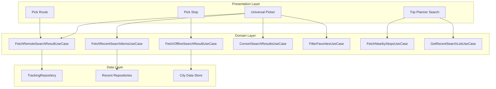

---

## Use Case Inventory

| Use Case | Purpose | Called From |
|----------|---------|-------------|
| **FetchRemoteSearchResult** | API autocomplete search | Universal Picker, Pick Route |
| **FetchOfflineSearchResult** | Local offline search | Universal Picker (offline mode) |
| **FetchRecentSearchItemsFromDatabase** | Load recent searches | Universal Picker |
| **ConvertSearchedResultItemsAppModelToUiModel** | Transform results for UI | Universal Picker |
| **FilterFavoriteMarkedStopsAndPlaces** | Extract favorites from recents | Universal Picker |
| **FetchNearbyStops** | Find stops near coordinates | Trip Planner Search |
| **GetRecentSearchList** | Format recents for home display | Home Screen |

---

## Fetch Remote Search Result

**Responsibility:** Executes API autocomplete search with location context, timeout handling, and error mapping.

### Search Flow

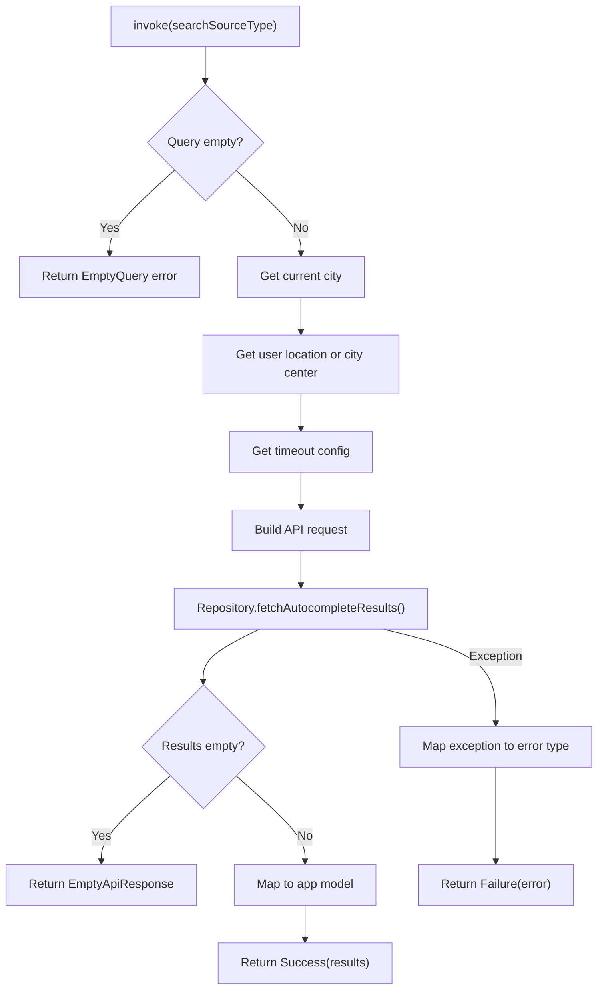

### Input: Search Source Type

| Source Type | Parameters | Usage |
|-------------|------------|-------|
| **Default** | query, source, searchFilters | Standard search |
| **Ondc** | query, source, searchFilters, mode | ONDC-specific search |

### Search Filters

| Filter | API Value | Results Included |
|--------|-----------|------------------|
| **STOPS** | "stops" | Bus/metro stops |
| **PLACES** | "places" | Addresses, landmarks |
| **ROUTES** | "routes" | Bus routes |
| **TRIPS** | "trips" | Saved trips |
| **ALL** | null | All types combined |

### Request Building

The request includes contextual information:

| Field | Source | Purpose |
|-------|--------|---------|
| **query** | User input | Search term |
| **source** | Flow source | Analytics context |
| **searchFilter** | Options | Filter results |
| **cityName** | CityProvider | City-specific results |
| **userId** | Session | Personalization |
| **currentLanguage** | LanguageFeature | Localization |
| **latLng** | Location or city center | Proximity sorting |
| **timeZoneId** | City config | Time context |
| **timeoutInMilliSec** | Config | Request timeout |

### Error Types

| Error | Cause | User Message |
|-------|-------|--------------|
| **EmptyQuery** | Query was blank | N/A (validation) |
| **InvalidRequestData** | Bad request format | "Invalid search" |
| **Timeout** | Request timed out | "Search timed out" |
| **API** | Server error | Server message |
| **Local** | Local storage error | "Something went wrong" |
| **ResponseParsing** | JSON parse failed | "Something went wrong" |
| **InvalidResponse** | Missing required fields | "Something went wrong" |
| **EmptyApiResponse** | No results returned | "No results found" |
| **UNKNOWN** | Unexpected error | "Something went wrong" |

### Error Mapping

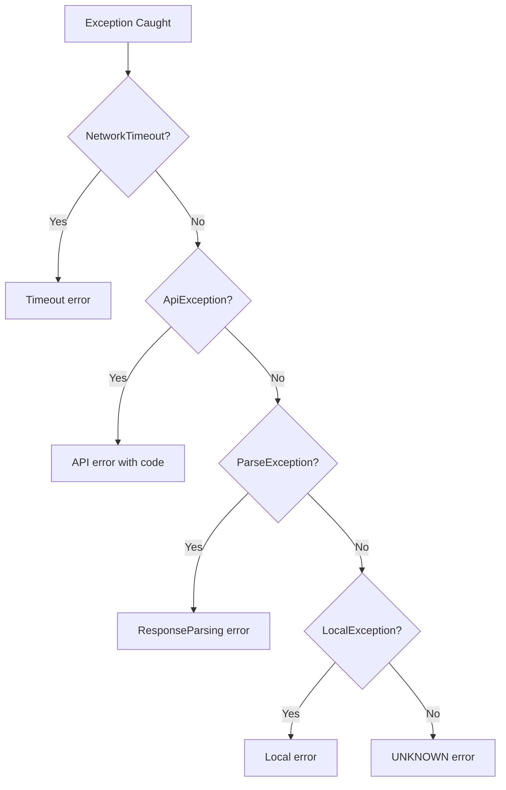

---

## Fetch Offline Search Result

**Responsibility:** Searches local city data when network is unavailable, using prefix and substring matching.

### Offline Search Flow

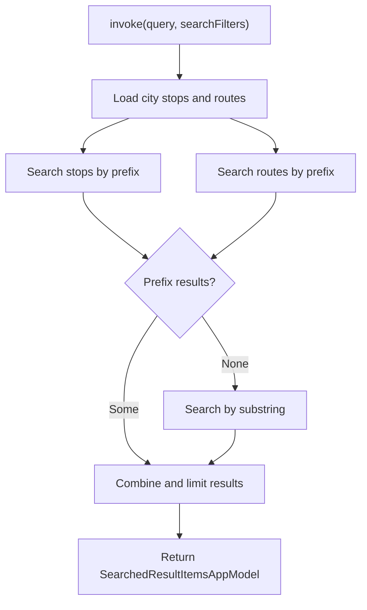

### Search Algorithm

| Phase | Method | Priority |
|-------|--------|----------|
| **Prefix Match** | Starts with query | High (shown first) |
| **Substring Match** | Contains query | Lower (fallback) |

### Result Limits

| Type | Limit | Reason |
|------|-------|--------|
| **Stops** | 10 | Manageable list size |
| **Routes** | 10 | Manageable list size |
| **Total** | 20 | Screen real estate |

---

## Fetch Recent Search Items From Database

**Responsibility:** Combines recent searches from multiple repositories and sorts by access time.

### Recent Fetch Flow

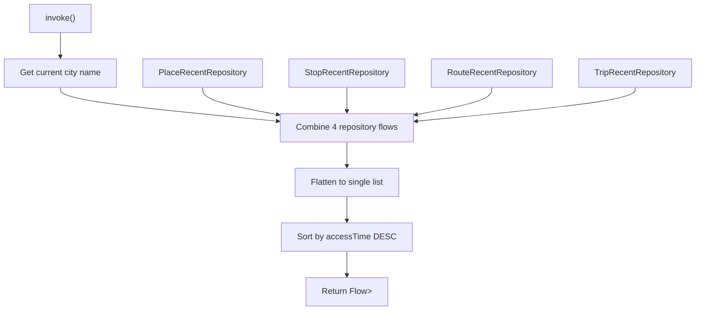

### Recent Item Types

| Type | Contains | Source |
|------|----------|--------|
| **Place** | RecentPlaceAppModel | PlaceRecentRepository |
| **Stop** | RecentStopAppModel | StopRecentRepository |
| **Route** | RecentRouteAppModel | RouteRecentRepository |
| **Trip** | RecentTripAppModel | TripRecentRepository |

### Sorting Logic

All recents sorted by `accessTime` (most recent first):

```
Combined List → Sort by accessTime DESC → Return Flow
```

---

## Convert Searched Result Items to UI Model

**Responsibility:** Transforms domain search results into UI-ready view states.

### Conversion Flow

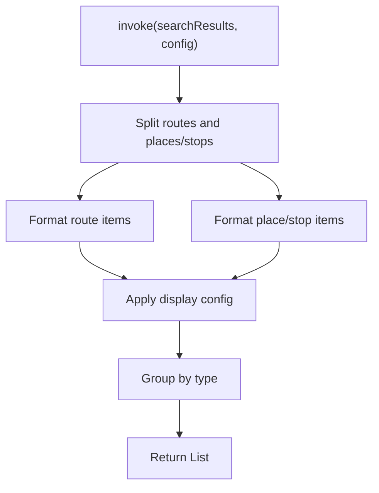

### Route Formatting

| App Field | UI Field | Transform |
|-----------|----------|-----------|
| routeId | id | Direct |
| routeName | primaryText | Direct |
| firstStopName + lastStopName | secondaryText | "From X to Y" |
| transportType | icon | Transit mode icon |
| agencyName | tagText | If config.showAgency |
| isFreeRide | freeRideTag | Show badge |

### Place/Stop Formatting

| App Field | UI Field | Transform |
|-----------|----------|-----------|
| description | primaryText | Direct |
| stopAddress | secondaryText | Direct |
| resultType | itemType | PLACE or STOP |
| transitMode | icon | Mode-specific icon |
| placeId/stopId | id | Identifier |

---

## Filter Favorite Marked Stops and Places

**Responsibility:** Extracts items with favorite status from recent search list.

### Filter Flow

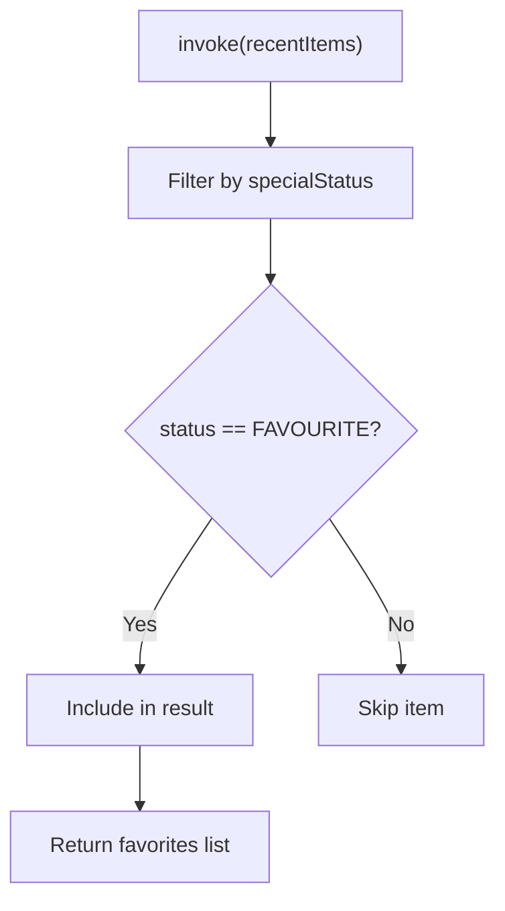

### Favorite Status

| Status | Meaning | Shown In |
|--------|---------|----------|
| **FAVOURITE** | User marked as favorite | Favorites section |
| **RECENT** | Recently accessed | Recents section |
| **NONE** | No special status | Recents section |

---

## Fetch Nearby Stops

**Responsibility:** Finds stops near a given location, sorted by distance.

### Nearby Fetch Flow

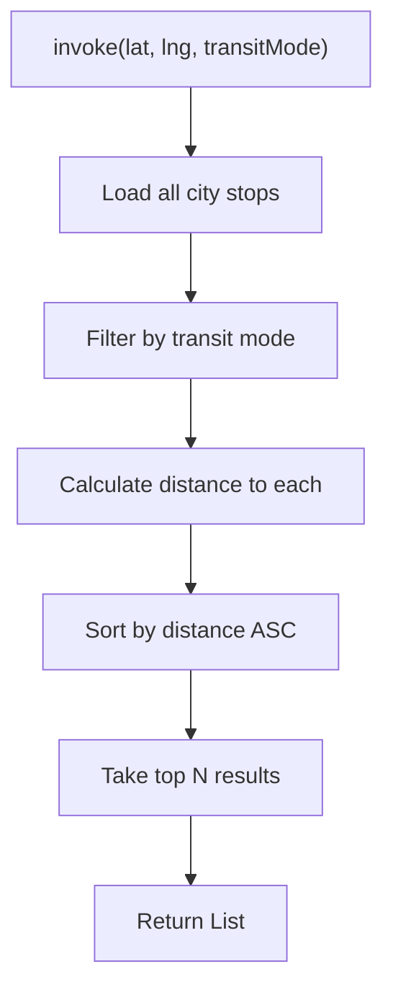

### Distance Calculation

| Input | Output | Method |
|-------|--------|--------|
| User lat/lng | Distance in meters | Haversine formula |
| Stop lat/lng | | |

### Result Model

| Field | Type | Description |
|-------|------|-------------|
| **stop** | StopAppModel | Stop details |
| **distanceMeters** | Long | Distance from location |
| **formattedDistance** | String | "500m" or "1.2 km" |

---

## Get Recent Search List

**Responsibility:** Formats recent searches for home tab display with simplified structure.

### Format Flow

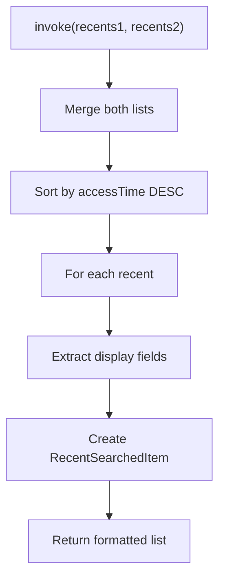

### Output Format

| Field | Source | Example |
|-------|--------|---------|
| **busNumberOrDestination** | Route name or destination | "Route 123" or "Mumbai Central" |
| **destinationOrStarting** | Starting point or route dest | "From Andheri" or "to Churchgate" |
| **recentsType** | Original model | RecentsType reference |

### Type-Specific Extraction

| Recent Type | Primary Text | Secondary Text |
|-------------|--------------|----------------|
| **Route** | Route name | "From X to Y" |
| **Stop-based Trip** | Destination stop | "From origin stop" |
| **Place-based Trip** | Destination place | "From origin place" |
| **Location Pair** | To location | "From X" |
| **Stop** | Stop name | — |
| **Place** | Place name | — |

---

## Domain Models

### Search Results App Model

| Field | Type | Description |
|-------|------|-------------|
| **routes** | List<UniversalSearchRouteAppModel> | Route results |
| **placesAndStops** | List<PlaceAndStopInfoAppModel> | Place/stop results |

### Universal Search Route App Model

| Field | Type | Description |
|-------|------|-------------|
| **routeId** | String | Route identifier |
| **routeName** | String | Route name/number |
| **transportType** | String? | Transit mode |
| **firstStopName** | String | Origin stop |
| **lastStopName** | String | Destination stop |
| **agencyName** | String | Operating agency |
| **trackingSpecialFeature** | List | Special features |
| **isFreeRide** | Boolean | Free ride flag |
| **resultType** | UniversalSearchResultType | ROUTE |
| **via** | String? | Via text |
| **routeNamingScheme** | RouteNamingSchemeType | Naming convention |

### Place and Stop Info App Model

| Field | Type | Description |
|-------|------|-------------|
| **resultType** | UniversalSearchResultType | PLACE or STOP |
| **description** | String | Display name |
| **placeId** | String | Place API ID |
| **stopId** | String | Stop ID |
| **stopName** | String | Stop name |
| **stopLocation** | LatLng | Coordinates |
| **transitMode** | ChaloTransitMode | Transit type |
| **stopAddress** | String? | Address |
| **searchPartner** | String | API partner (Google, etc.) |

### Recent Place App Model

| Field | Type | Description |
|-------|------|-------------|
| **placeId** | String | Place API ID |
| **searchPartner** | String | API source |
| **locationTitle** | String | Place name |
| **locationDescription** | String? | Address |
| **latLng** | LatLng | Coordinates |
| **label** | String? | Custom label |
| **accessTime** | Long | Last access timestamp |

### Recent Stop App Model

| Field | Type | Description |
|-------|------|-------------|
| **stopId** | String | Stop identifier |
| **stop** | StopAppModel | Full stop model |
| **accessTime** | Long | Last access timestamp |
| **accessCount** | Int | Access count |
| **label** | String? | Custom label |

---

## Business Rules

| Rule | Description | Enforced By |
|------|-------------|-------------|
| **Debounce queries** | 300ms delay before API call | UniversalPickerComponent |
| **City-scoped recents** | Only show recents for current city | FetchRecentSearchItems |
| **Fallback to offline** | Use local data when offline | UniversalSearchManager |
| **Result limits** | Cap results for performance | All fetch use cases |
| **Favorites first** | Show favorites before recents | Universal Picker |
| **Proximity sorting** | Sort by distance to user | FetchRemoteSearchResult |

---

## Sequence Diagrams

### Remote Search Sequence

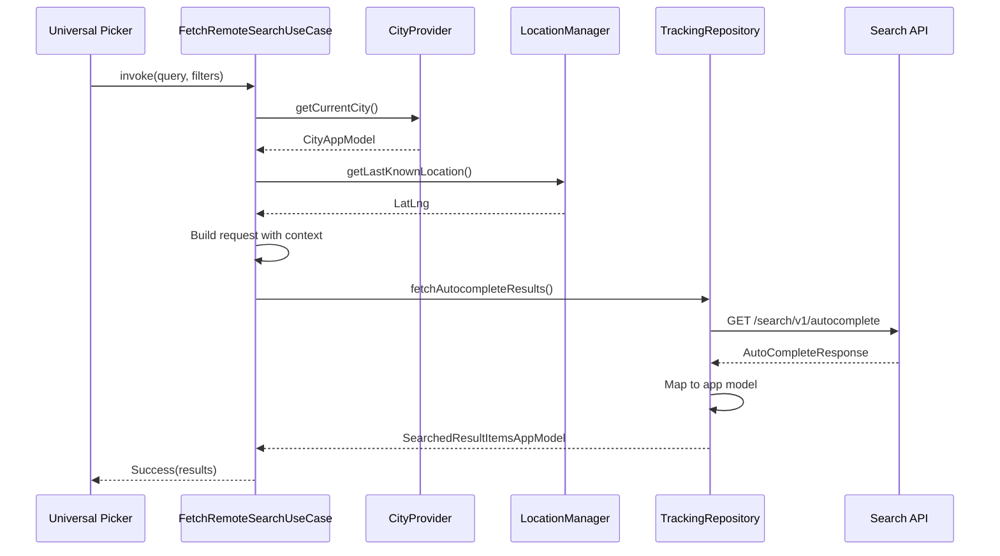

### Recent Items Flow

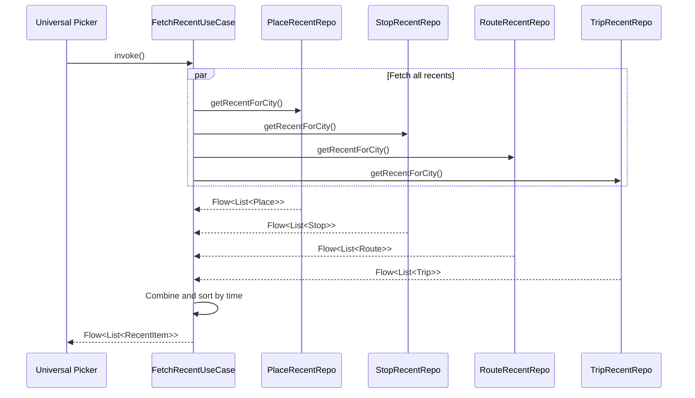

---

## Error Handling

### Search Errors

| Error Code | Error Type | Recovery |
|------------|------------|----------|
| 400 | InvalidRequestData | Show validation error |
| 408 | Timeout | Show timeout + retry |
| 500 | API | Show server error + retry |
| — | Local | Show generic error |
| — | ResponseParsing | Show generic error |

### Fallback Strategy

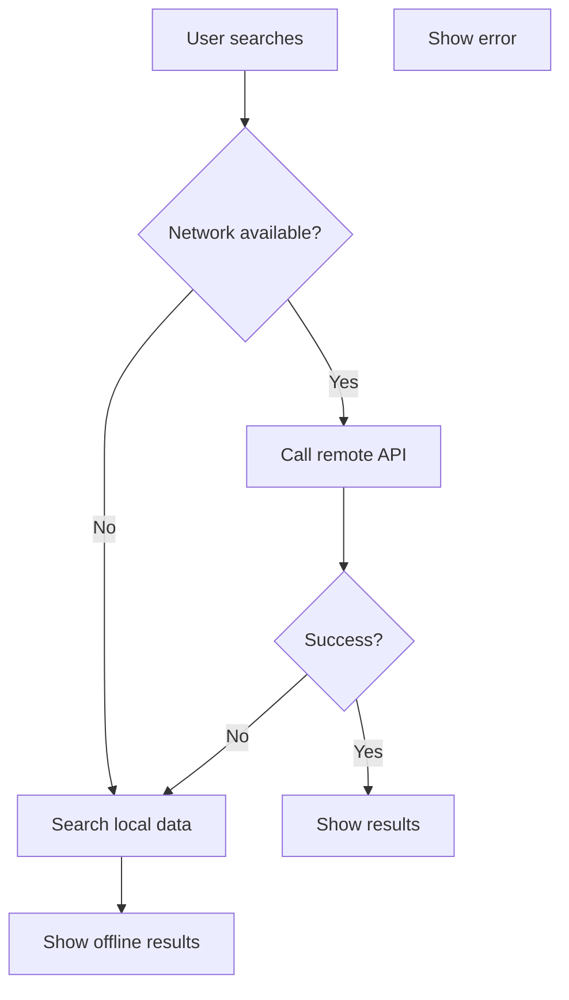
