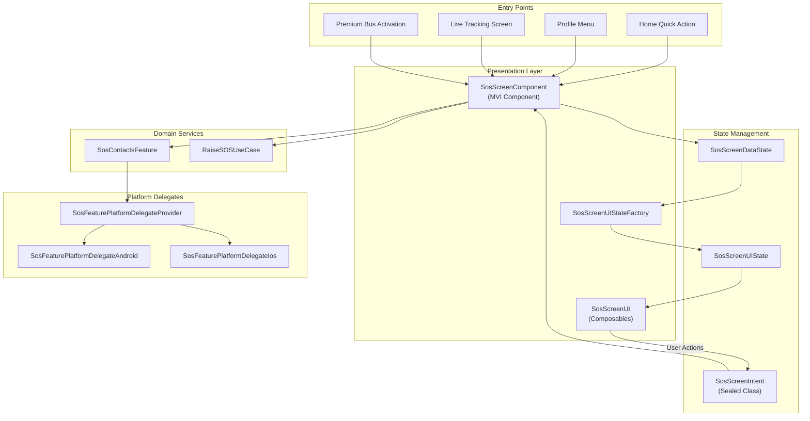
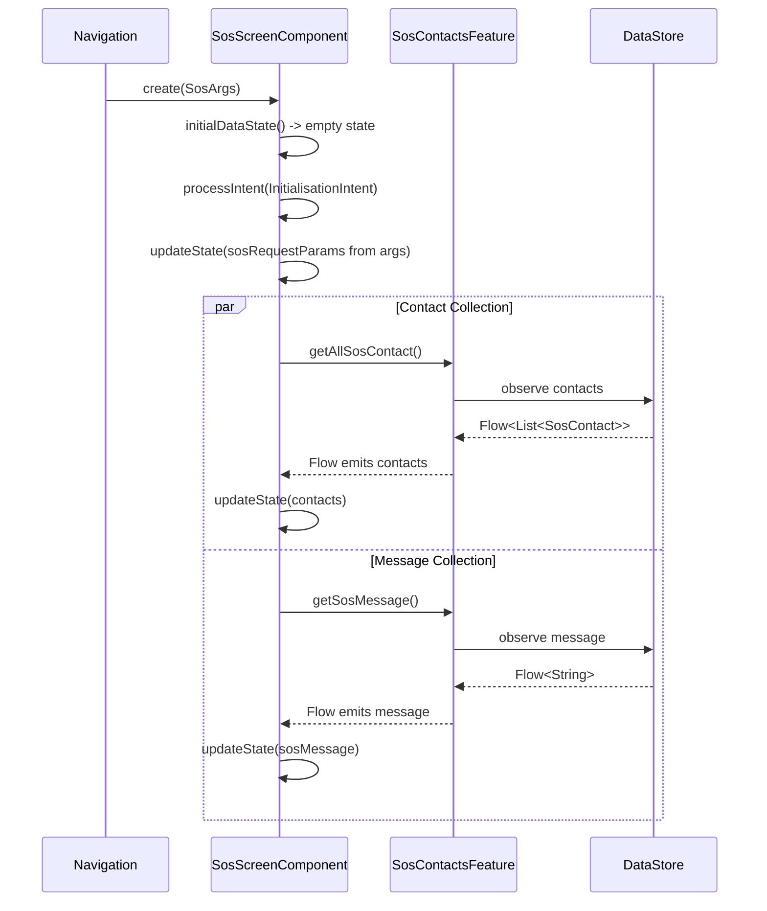
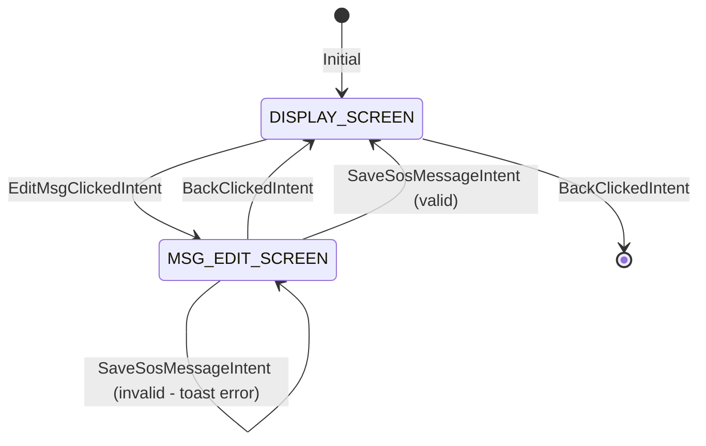
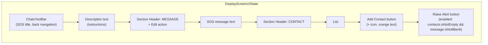
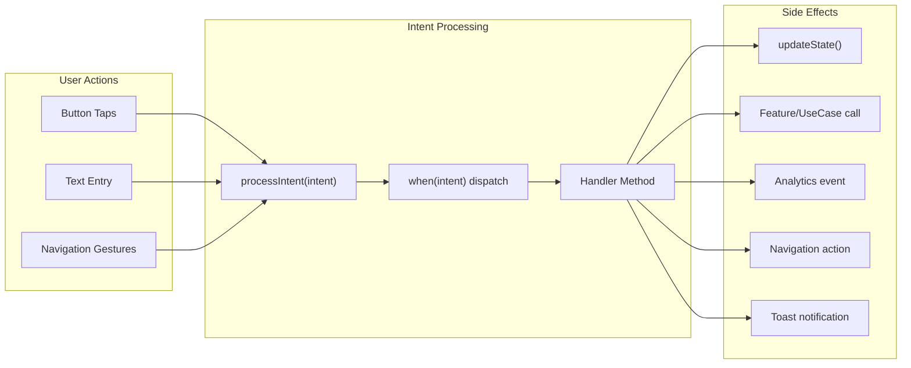
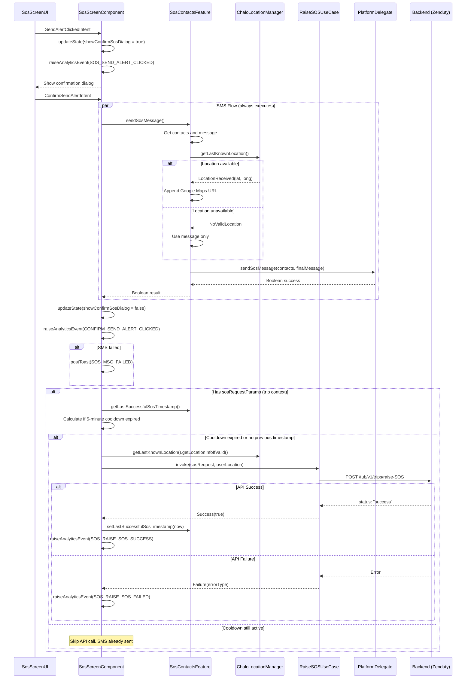
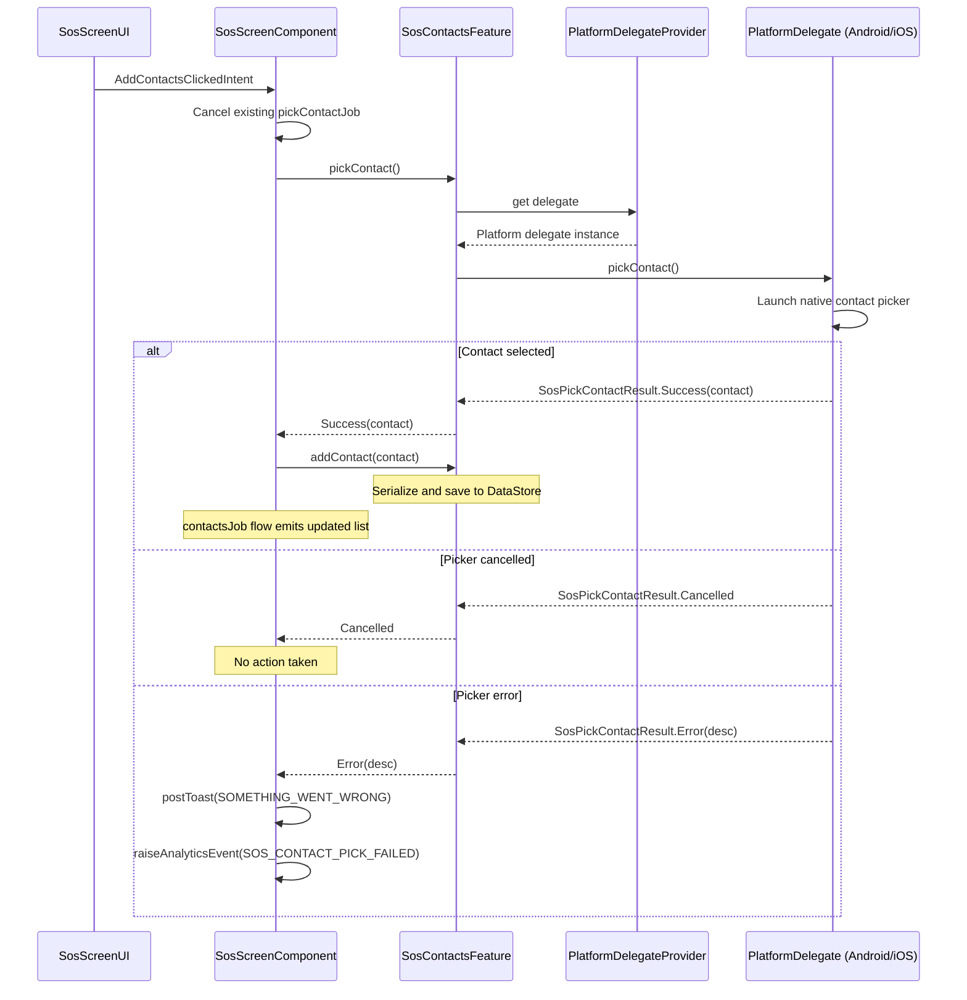
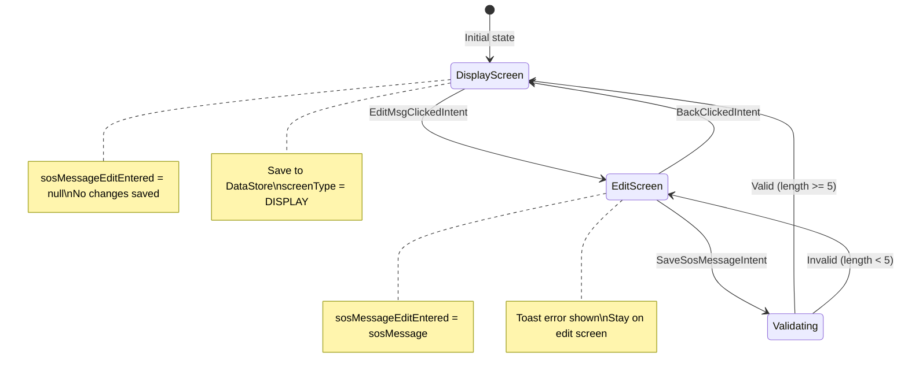
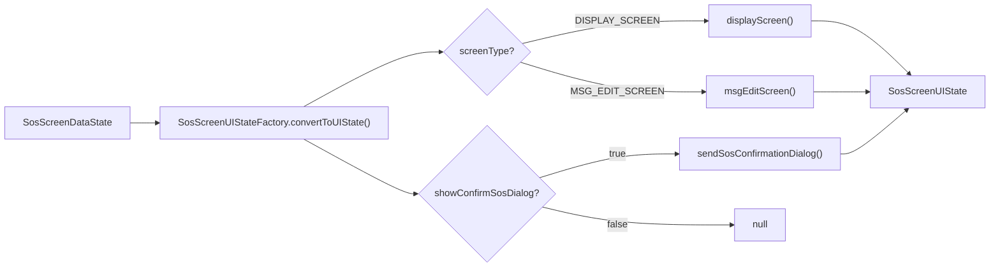

# SOS Feature - Components (LLD)

## Architecture Overview

The SOS presentation layer implements emergency assistance functionality using Decompose-based MVI architecture. The core component (`SosScreenComponent`) manages two distinct view states: a display screen for viewing contacts and the configured message, and an edit screen for customizing the SOS message. Platform-specific delegates handle SMS composition and contact picking through an abstraction layer, while the shared component orchestrates state transitions, analytics tracking, and coordination with the domain layer.



---

## Screen Inventory

| Screen | State Type | Purpose |
|--------|------------|---------|
| Display Screen | `DisplayScreenUIState` | Shows contact list, SOS message preview, and alert button |
| Message Edit Screen | `EditMsgUIState` | Text field for editing the emergency message |
| Confirmation Dialog | `SendSosConfirmationDialog` | Modal requiring user confirmation before sending |
| Contact Picker | Platform-native | System contact selector (delegated to platform) |
| SMS Composer | Platform-native | Pre-filled SMS app (delegated to platform) |

---

## SosScreenComponent

The central MVI component extends `ChaloBaseStateMviComponent<SosScreenIntent, SosScreenDataState, SosScreenUIState, SosScreenEffect>` and serves as the orchestrator for all SOS screen functionality. It coordinates between the UI layer, contact feature, backend use case, and platform services while managing navigation and analytics.

### Dependencies

| Dependency | Type | Purpose |
|------------|------|---------|
| `args` | `SosArgs` | Navigation arguments containing optional trip context |
| `componentContext` | `ComponentContext` | Decompose lifecycle context |
| `sosContactsFeature` | `SosContactsFeature` | Contact and message management |
| `chaloNavigationManager` | `ChaloNavigationManager` | Screen navigation control |
| `toastManager` | `KotlinToastManager` | Toast notification display |
| `stringProvider` | `StringProvider` | Localized string resources |
| `sosScreenUIStateFactory` | `SosScreenUIStateFactory` | Data-to-UI state transformation |
| `analyticsContract` | `AnalyticsContract` | Analytics event tracking |
| `userProfileDetailsProvider` | `UserProfileDetailsProvider` | User identity for analytics |
| `chaloTimeProvider` | `ChaloTimeProvider` | Timestamp generation |
| `chaloLocationManager` | `ChaloLocationManager` | GPS coordinates retrieval |
| `raiseSOSUseCase` | `RaiseSOSUseCase` | Backend SOS reporting |

### Coroutine Job Management

The component maintains three coroutine jobs for asynchronous operations:

| Job | Purpose | Lifecycle |
|-----|---------|-----------|
| `contactsJob` | Collects contact list flow from DataStore | Active during component lifetime |
| `messageContentJob` | Collects SOS message flow from DataStore | Active during component lifetime |
| `pickContactJob` | Manages platform contact picker operation | Cancelled when new pick starts |

### Initialization Sequence



---

## Data State

The `SosScreenDataState` holds the component's internal state before UI transformation. It is a simple data class without UI-specific formatting.

| Field | Type | Default | Description |
|-------|------|---------|-------------|
| `sosMessage` | `String` | `""` | Current SOS message text from DataStore |
| `contacts` | `List<SosContact>` | `[]` | List of saved emergency contacts |
| `sosMessageEditEntered` | `String?` | `null` | Text entered during message editing |
| `screenType` | `SosScreenType` | `DISPLAY_SCREEN` | Current sub-screen mode |
| `showConfirmSosDialog` | `Boolean` | `false` | Whether confirmation dialog is visible |
| `sosRequestParams` | `Map<String, String>?` | `null` | Trip context for API (tripId, routeId, vehicleNo) |

### Screen Type Enum

| Value | Description |
|-------|-------------|
| `DISPLAY_SCREEN` | Main screen showing contacts, message, and send button |
| `MSG_EDIT_SCREEN` | Message editing screen with save action |



---

## UI State

The `SosScreenUIState` is an immutable data class representing the rendered view state. It contains pre-formatted, ready-to-render data including styled text, button states, and event handlers.

| Field | Type | Description |
|-------|------|-------------|
| `screen` | `SosScreenTypeUIState` | Display or edit screen state (sealed class) |
| `sendSosConfirmationDialog` | `SendSosConfirmationDialog?` | Dialog state when visible, null otherwise |

### Display Screen UI State



### Contact Item UI State

Each contact in the list is rendered using `SosContactItemUIState`:

| Field | Type | Description |
|-------|------|-------------|
| `contactPhoto` | `ImageUIState` | Placeholder icon (IC_NO_PHOTO) |
| `contactName` | `TextUIState` | Name styled with BodyMedium, Black_60 |
| `phoneNumber` | `TextUIState` | Number styled with DisplaySmall, Black_87 |
| `removeMenu` | `DropDownMenuUIState` | Dropdown with "Remove" option |
| `dropDownIcon` | `ImageUIState` | Three-dot menu trigger (ROUTE_SCREEN_MENU) |
| `bottomDivider` | `DividerUIState` | Item separator line |

### Edit Message UI State

| Field | Type | Description |
|-------|------|-------------|
| `toolbar` | `ToolbarUIState` | "Edit Message" title with Save action |
| `msgTextField` | `BaseTextFieldUIState` | Text input bound to `sosMessageEditEntered` |
| `paddingAroundTextField` | `ChaloPadding` | Layout spacing |

---

## Intent Processing

User actions flow through a sealed class hierarchy of intents. The component processes each intent via the `processIntent` method, which dispatches to specific handler functions.

### Intent Catalog

| Intent | Trigger | Handler | Effect |
|--------|---------|---------|--------|
| `InitialisationIntent` | Component creation | `handleInitialisationIntent` | Store params, start flow collection |
| `BackClickedIntent` | Back button/gesture | `handleBackClickedIntent` | Navigate back or switch to display |
| `EditMsgClickedIntent` | "Edit" action tap | `handleEditMsgClickedIntent` | Switch to edit screen |
| `RemoveContactIntent` | Remove menu tap | `handleRemoveContactIntent` | Delete contact from storage |
| `SosMessageEnteredIntent` | Text field change | `handleSosMessageEnteredIntent` | Update edit buffer in state |
| `SaveSosMessageIntent` | "Save" toolbar action | `handleSaveSosMessageIntent` | Validate and persist message |
| `AddContactsClickedIntent` | "Add Contact" tap | `handleAddContactsClickedIntent` | Launch platform picker |
| `SendAlertClickedIntent` | "Raise Alert" tap | `handleSendAlertClickedIntent` | Show confirmation dialog |
| `ConfirmSendAlertIntent` | Dialog confirm tap | `handleConfirmSendAlertIntent` | Execute SMS + API flow |
| `DismissDialogIntent` | Dialog dismiss | `handleDismissDialogIntent` | Hide confirmation dialog |

### Intent Processing Flow



---

## Send Alert Flow

The most critical user flow combines SMS composition with backend API reporting. The design ensures SMS is always sent regardless of API success.

### Complete Flow Diagram



### Cooldown Logic

The 5-minute cooldown prevents API spam while allowing unlimited SMS sending:

| Property | Value |
|----------|-------|
| Duration | 5 minutes (5 * 60 * 1000 = 300,000 ms) |
| Scope | API calls only (SMS unaffected) |
| Check timing | Before `RaiseSOSUseCase` invocation |
| Storage | `last_successful_sos_timestamp` in DataStore |
| Condition | `(currentTime - lastTimestamp) < fiveMinutesInMillis` |

---

## Contact Management

### Add Contact Flow



### Remove Contact Flow

| Step | Action |
|------|--------|
| 1 | User taps three-dot menu icon on contact row |
| 2 | Dropdown menu appears with "Remove" option |
| 3 | User taps "Remove" |
| 4 | `RemoveContactIntent(contact)` dispatched |
| 5 | `sosContactsFeature.removeContact(contact)` called |
| 6 | Contact key deleted from DataStore |
| 7 | `contactsJob` flow emits updated list |
| 8 | UI refreshes automatically via state update |

---

## Message Editing

### Edit Flow State Machine



### Validation Rules

| Rule | Threshold | Error Message |
|------|-----------|---------------|
| Minimum length | 5 characters | `EMERGENCY_MSG_CANNOT_BE_TOO_SHORT` |
| Empty check | Not null/empty | Same as above |

Constant: `SosScreenComponent.SOS_MESSAGE_LENGTH = 5`

---

## Confirmation Dialog

The `SendSosConfirmationDialog` modal prevents accidental SOS alerts by requiring explicit user confirmation.

### Dialog Structure

| Element | Component | Value |
|---------|-----------|-------|
| Image | `ImageUIState` | `IC_ALERT_TRIANGLE` (warning icon) |
| Title | `TextUIState` | `SOS_ALERT` localized string |
| Message | `TextUIState` | Current SOS message (from state) |
| Close Button | `ImageUIState` | `IC_CLOSE` with click handler |
| Send Button | `ButtonUIState` | Orange, `SEND_ALERT_RUNNING_CASE` |
| Cancel Button | `ButtonUIState` | Grey, `CANCEL` |

### Dialog Dismissal

| Trigger | Intent | Effect |
|---------|--------|--------|
| Close icon tap | `DismissDialogIntent` | Hide dialog |
| Cancel button tap | `DismissDialogIntent` | Hide dialog |
| Send button tap | `ConfirmSendAlertIntent` | Execute flow, then hide |
| Outside tap | `DismissDialogIntent` | Hide dialog |

---

## Platform Delegates

### Android Implementation (`SosFeaturePlatformDelegateAndroid`)

**Contact Picker:**

| Component | Value |
|-----------|-------|
| Intent action | `Intent.ACTION_PICK` |
| Data URI | `ContactsContract.CommonDataKinds.Phone.CONTENT_URI` |
| MIME type | `ContactsContract.CommonDataKinds.Phone.CONTENT_TYPE` |
| Result handling | `ActivityResult` via launcher callback |

**Projection fields queried:**

| Field | Purpose |
|-------|---------|
| `CONTACT_ID` | Unique identifier for storage key |
| `DISPLAY_NAME` | Contact name for display |
| `NUMBER` | Phone number for SMS |

**SMS Sending:**

| Property | Value |
|----------|-------|
| Action | `Intent.ACTION_SENDTO` |
| URI scheme | `smsto:{comma-separated-phones}` |
| Extra | `sms_body` = composed message |
| Flag | `FLAG_ACTIVITY_NEW_TASK` |
| Fallback | Returns `false` if no SMS app resolves |

### iOS Implementation (`SosFeaturePlatformDelegateIos`)

**Contact Picker:**

| Component | Purpose |
|-----------|---------|
| `CNContactPickerViewController` | Native picker UI |
| `CNContactPickerDelegateProtocol` | Selection callbacks |
| `contactPicker:didSelectContact:` | Extract contact data |
| `contactPickerDidCancel:` | Handle cancellation |

**Contact name resolution order:**

1. `givenName + familyName` (if both present)
2. `givenName` only
3. `familyName` only
4. `organizationName`
5. `"Unknown"` fallback

**Phone number cleaning:** Regex removes all non-numeric characters except `+` for international format.

**SMS Sending:**

| Method | Condition |
|--------|-----------|
| `MFMessageComposeViewController` | When `canSendText()` returns `true` |
| `sms:` URL scheme | Fallback when compose unavailable |

---

## UI State Factory

The `SosScreenUIStateFactory` transforms `SosScreenDataState` into `SosScreenUIState`, encapsulating all UI formatting and styling logic.

### Transformation Flow



### Send Button Enablement Logic

The "Raise Alert" button is enabled only when both conditions are met:

```
enabled = state.contacts.isNotEmpty() && state.sosMessage.isNotBlank()
```

| State | Button |
|-------|--------|
| No contacts, any message | Disabled |
| Has contacts, blank message | Disabled |
| Has contacts, non-blank message | Enabled |

---

## Analytics Events

| Event Constant | Trigger | Properties |
|----------------|---------|------------|
| `SOS_SEND_ALERT_CLICKED` | Raise Alert button tapped | user_mobile, latitude, longitude, timestamp |
| `SOS_CONFIRM_SEND_ALERT_CLICKED` | Confirm in dialog tapped | user_mobile, latitude, longitude, timestamp, sos_sent_successfully |
| `SOS_RAISE_SOS_SUCCESS` | API call succeeded | source = SOS_SCREEN |
| `SOS_RAISE_SOS_FAILED` | API call failed | error_type (from `RaiseSOSExceptionType`) |
| `SOS_CONTACT_PICK_FAILED` | Contact picker error | error_message |

---

## Navigation

### Entry Points

| Source | Context | `sosRequestParams` Content |
|--------|---------|----------------------------|
| Home screen | Quick action | `null` |
| Profile menu | Emergency SOS setting | `null` |
| Live tracking | SOS during active trip | `tripId`, `routeId`, `vehicleNo` |
| Premium bus activation | SOS during ride | `tripId`, `routeId`, `vehicleNo` |

### SosArgs

The `SosArgs` navigation argument class (from `shared/chalo-base`) resolves to `ChaloScenes.Sos`:

| Field | Type | Description |
|-------|------|-------------|
| `sosRequestParams` | `Map<String, String>?` | Trip context for Zenduty API |

### Back Navigation Behavior

| Current Screen | Action |
|----------------|--------|
| `DISPLAY_SCREEN` | `chaloNavigationManager.goBack()` to previous screen |
| `MSG_EDIT_SCREEN` | Switch to `DISPLAY_SCREEN`, clear edit buffer |

---

## Error Handling

| Scenario | Response |
|----------|----------|
| No contacts saved | Send button disabled |
| Message too short (< 5 chars) | Toast error, stay on edit screen |
| Contact picker cancelled | No action |
| Contact picker error | Toast + analytics event |
| SMS app unavailable | `sendSosMessage()` returns false, toast shown |
| Location unavailable | SMS sent without Maps link |
| API failure | SMS already sent, error logged to analytics |
| Cooldown active | API skipped, SMS still sent |

---

## File Locations

| File | Path |
|------|------|
| `SosScreenComponent.kt` | `shared/home/src/commonMain/kotlin/app/chalo/sos/` |
| `SosScreenUI.kt` | `shared/home/src/commonMain/kotlin/app/chalo/sos/` |
| `SosScreenContract.kt` | `shared/home/src/commonMain/kotlin/app/chalo/sos/` |
| `SosScreenUIState.kt` | `shared/home/src/commonMain/kotlin/app/chalo/sos/` |
| `SosScreenUIStateFactory.kt` | `shared/home/src/commonMain/kotlin/app/chalo/sos/` |
| `SosFeaturePlatformDelegateAndroid` | `shared/home/src/androidMain/kotlin/app/chalo/sos/feature/` |
| `SosFeaturePlatformDelegateIos` | `shared/home/src/iosMain/kotlin/app/chalo/sos/feature/` |
