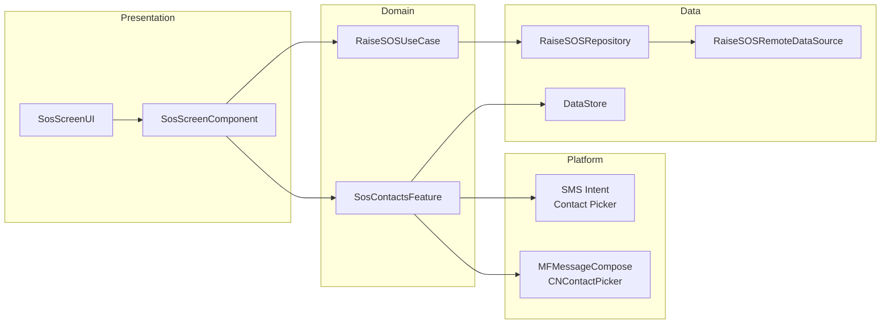

# SOS — High-Level Design

## Overview

The SOS feature provides emergency assistance functionality within the Chalo app. Users can configure emergency contacts, customize an SOS message, and quickly send alerts to their contacts via SMS. The feature also reports emergencies to Chalo's backend (Zenduty) for operational response. Platform-specific implementations handle SMS sending and contact picking.

## User Journey

1. **Entry Points**:
   - Home screen → SOS quick action
   - Profile menu → Emergency SOS
   - Live tracking screen → SOS button (with trip context)
   - Premium bus activation → SOS button

2. **Core Flow**:
   - Configure emergency contacts (up to N contacts)
   - Edit custom SOS message (min 5 characters)
   - Tap "Send Alert" to initiate SOS
   - Confirm via dialog
   - SMS sent to all contacts with location link
   - API call to Zenduty for incident reporting

3. **Exit Points**:
   - Back navigation to previous screen
   - Alert sent successfully → Confirmation shown
   - Settings navigation after setup

## Architecture Diagram



## Key Components

| Component | Platform | File Path | Responsibility |
|-----------|----------|-----------|----------------|
| `SosScreenComponent` | Shared | `shared/home/.../sos/SosScreenComponent.kt` | MVI component managing SOS state |
| `SosScreenUI` | Shared | `shared/home/.../sos/SosScreenUI.kt` | Composable UI screens |
| `SosContactsFeature` | Shared | `shared/home/.../sos/feature/SosContactsFeature.kt` | Contact management interface |
| `SosContactsFeatureImpl` | Shared | `shared/home/.../sos/feature/SosContactsFeatureImpl.kt` | Contact storage implementation |
| `RaiseSOSUseCase` | Shared | `shared/home/.../usecase/RaiseSOSUseCase.kt` | Backend SOS reporting |
| `RaiseSOSRepository` | Shared | `shared/home/.../sos/data/repository/RaiseSOSRepository.kt` | API abstraction |

## Data Flow

### Configure Contacts
1. User taps "Add Contact"
2. Platform contact picker launched
3. Selected contact saved to DataStore
4. UI updates with new contact in list

### Send SOS Alert
1. User taps "Send Alert"
2. Confirmation dialog displayed
3. User confirms → SMS composed with:
   - Custom SOS message
   - Google Maps location link (if available)
4. SMS app opens with pre-filled recipients
5. Simultaneously, `RaiseSOSUseCase` called
6. API posts to `tub/v1/trips/raise-SOS`
7. Success → Timestamp saved for cooldown
8. Toast shown confirming alert sent

## Platform Differences

### Android-Specific
- **Contact Picker**: Uses `ContactsContract.CommonDataKinds.Phone`
- **SMS Sending**: `Intent.ACTION_SENDTO` with `smsto:` scheme
- **File**: `shared/home/src/androidMain/kotlin/app/chalo/sos/feature/SosContactsFeature.android.kt`

```kotlin
class SosFeaturePlatformDelegateAndroid {
    fun sendSosMessage(contacts: List<SosContact>, message: String)
    fun pickContact(): SosPickContactResult
}
```

### iOS-Specific
- **Contact Picker**: `CNContactPickerViewController` with `CNContactPickerDelegateProtocol`
- **SMS Sending**: `MFMessageComposeViewController` or `sms:` URL scheme fallback
- **File**: `shared/home/src/iosMain/kotlin/app/chalo/sos/feature/SosContactsFeature.ios.kt`

```kotlin
class SosFeaturePlatformDelegateIos {
    fun sendSosMessage(contacts: List<SosContact>, message: String)
    fun pickContact(): SosPickContactResult
}
```

## Integration Points

### Analytics Events
- `sos_send_alert_clicked`
- `sos_confirm_send_alert_clicked`
- `sos_raise_sos_success`
- `sos_raise_sos_failed` (with error type)
- `sos_contact_pick_failed`

### Shared Services
- **Location**: `ChaloLocationManager` for GPS coordinates
- **User Info**: `UserProfileDetailsProvider` for user mobile
- **Time**: `ChaloTimeProvider` for timestamps
- **Toast**: `KotlinToastManager` for notifications

### Navigation
- **Navigates to**: Settings (for permissions)
- **Navigated from**: Home, Live tracking, Premium bus

## Edge Cases & Error Handling

| Scenario | Handling |
|----------|----------|
| No contacts configured | Shows "Add Contact" prompt, blocks send |
| Location unavailable | SMS sent without Maps link |
| SMS app not available | Shows error toast |
| API call fails | SMS still sent, error logged |
| Cooldown active (5 min) | API skipped, SMS still sent |
| Contact picker cancelled | Returns to SOS screen unchanged |
| Message too short | Validation error, min 5 characters |

## API Endpoints

| Endpoint | Method | Purpose |
|----------|--------|---------|
| `tub/v1/trips/raise-SOS` | POST | Report SOS to Zenduty |

### Request Payload
```json
{
  "userMobile": "9899402488",
  "gpsLat": 12.9715987,
  "gpsLong": 77.594566,
  "timestamp": "2025-12-17T14:30:00Z",
  "tripId": "TRIP12345",
  "routeId": "S-101",
  "vehicleNo": "KA01AB1234"
}
```

## Data Models

### SosContact
```kotlin
@Serializable
data class SosContact(
    val contactId: String,
    val phoneNumber: String,
    val contactName: String
)
```

### SosPickContactResult
```kotlin
sealed class SosPickContactResult {
    data class Success(val contact: SosContact)
    data class Error(val desc: String?)
    data object Cancelled
}
```

### RaiseSOSExceptionType
```kotlin
enum class RaiseSOSExceptionType {
    USER_MOBILE_NUMBER_NOT_FOUND,
    INVALID_REQUEST,
    SERVER_ERROR,
    LOCAL_ERROR,
    UNKNOWN_ERROR,
    PARSE_ERROR
}
```

## Dependencies

### Internal
- `shared:chalo-base` — DataStore, location manager
- `shared:network` — API calls

### External
- DataStore — Contact and message persistence
- Platform SMS APIs — Android Intent / iOS MFMessageCompose
- Platform Contact APIs — Android ContentProvider / iOS Contacts framework
