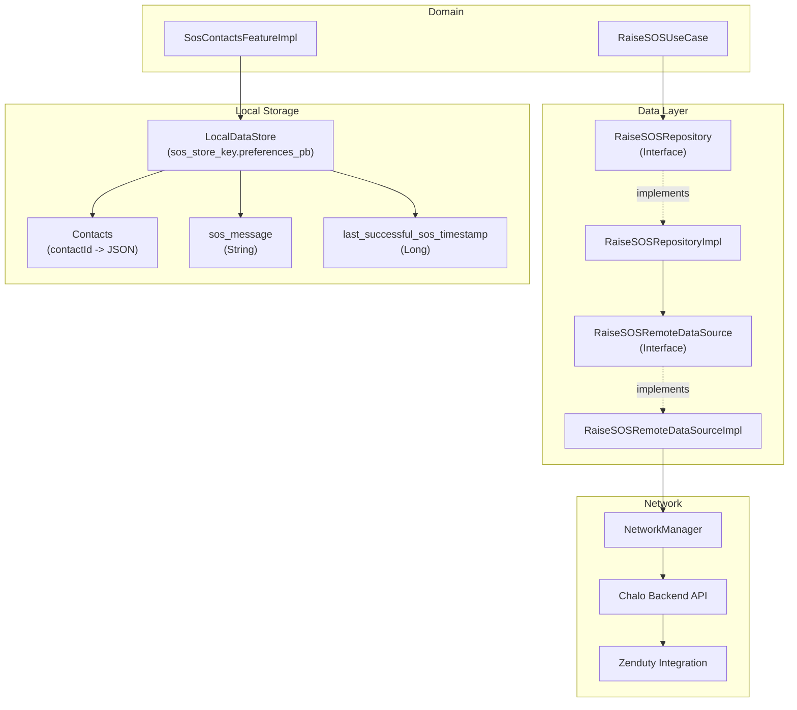
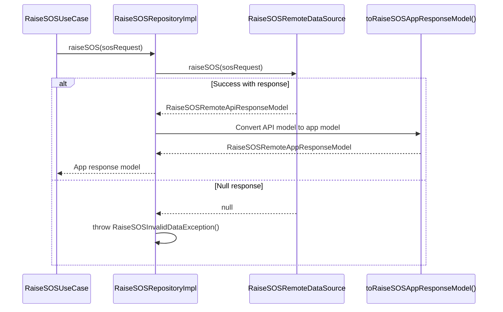
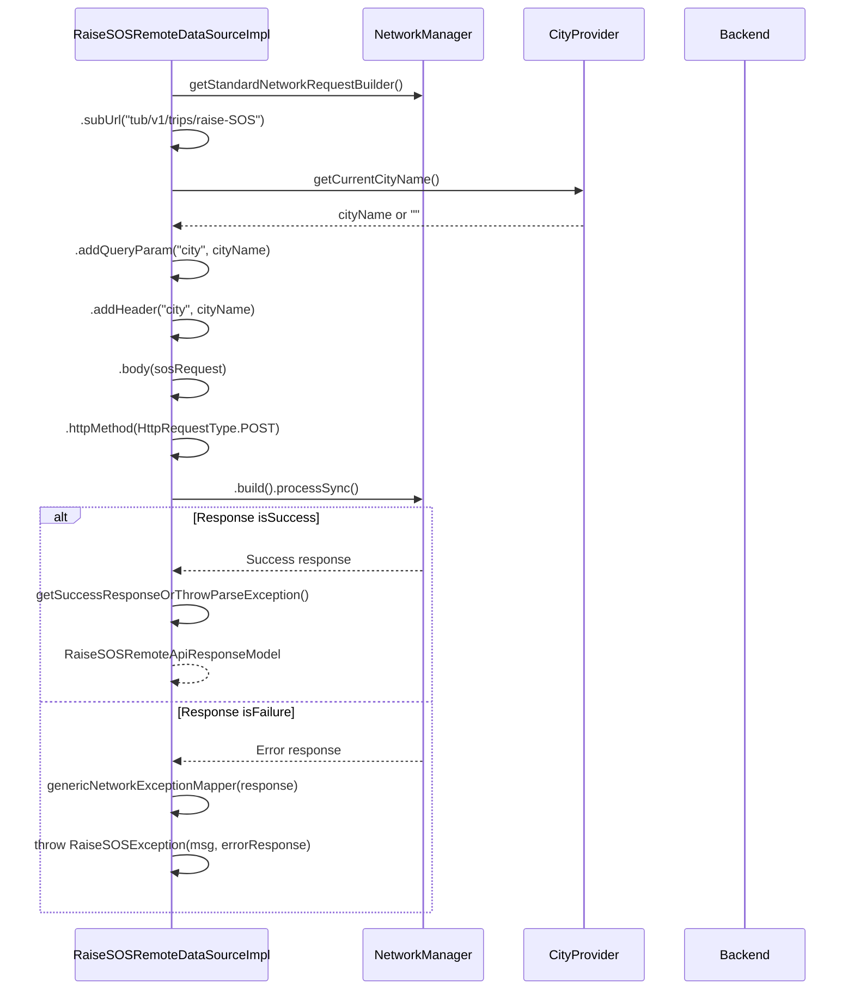
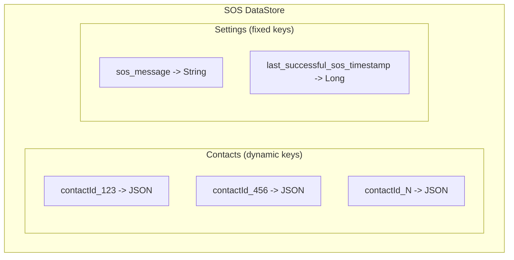
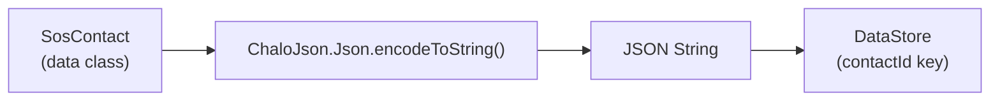
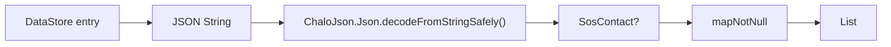
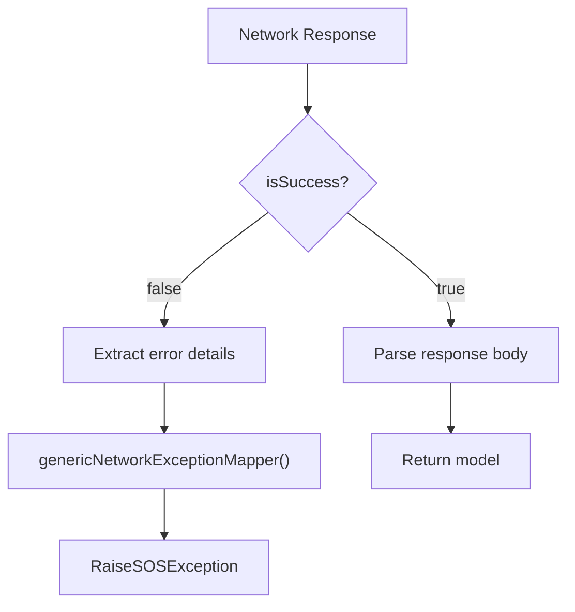
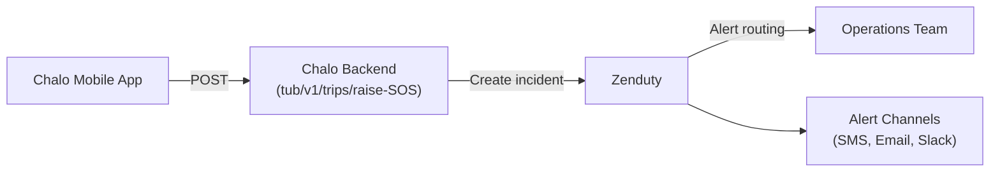
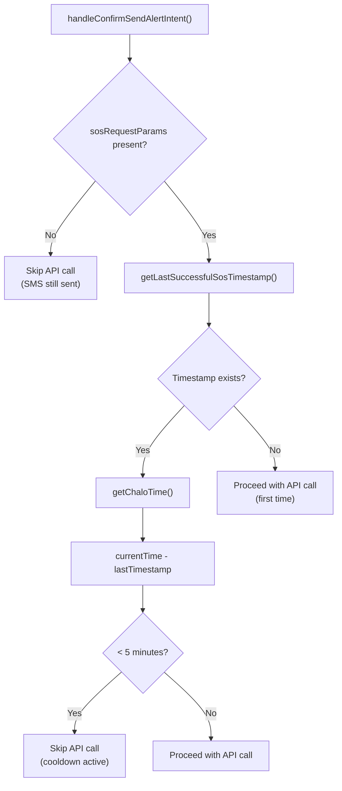

# SOS Feature - Repositories (LLD)

## Data Layer Overview

The SOS data layer manages two distinct concerns: emergency alert reporting to the backend (via `RaiseSOSRepository`) and local persistence of contacts, messages, and cooldown state (via `LocalDataStore`). The remote data source communicates with Chalo's backend, which routes incidents to Zenduty for operational response. Local storage uses DataStore with JSON serialization for contacts and primitive types for settings.



---

## Repository Interfaces

### RaiseSOSRepository

The repository interface abstracts SOS reporting, providing a clean contract for domain layer consumption.

```kotlin
interface RaiseSOSRepository {
    suspend fun raiseSOS(sosRequest: Map<String, String>): RaiseSOSRemoteAppResponseModel?
}
```

| Method | Parameters | Return | Purpose |
|--------|------------|--------|---------|
| `raiseSOS` | `sosRequest: Map<String, String>` | `RaiseSOSRemoteAppResponseModel?` | Submit emergency report to backend |

### RaiseSOSRemoteDataSource

The data source interface handles direct network communication with the API endpoint.

```kotlin
interface RaiseSOSRemoteDataSource {
    suspend fun raiseSOS(sosRequest: Map<String, String>): RaiseSOSRemoteApiResponseModel?
}
```

| Method | Parameters | Return | Purpose |
|--------|------------|--------|---------|
| `raiseSOS` | `sosRequest: Map<String, String>` | `RaiseSOSRemoteApiResponseModel?` | POST request to API endpoint |

---

## RaiseSOSRepositoryImpl

The repository implementation coordinates between the domain layer and remote data source, handling response mapping and error propagation.

### Dependencies

| Dependency | Type | Purpose |
|------------|------|---------|
| `raiseSOSRemoteDataSource` | `RaiseSOSRemoteDataSource` | Network communication |

### Implementation Logic



The repository performs a simple pass-through to the remote data source, with one key responsibility: if the remote returns `null`, it throws `RaiseSOSInvalidDataException` to signal invalid data to the use case layer.

### Response Mapping

The API response model is mapped to an app response model using an extension function:

| Source | Target | Mapping |
|--------|--------|---------|
| `RaiseSOSRemoteApiResponseModel` | `RaiseSOSRemoteAppResponseModel` | `toRaiseSOSAppResponseModel()` extension |

---

## RaiseSOSRemoteDataSourceImpl

The remote data source implementation handles HTTP communication using Chalo's `NetworkManager` infrastructure.

### Dependencies

| Dependency | Type | Purpose |
|------------|------|---------|
| `networkManager` | `NetworkManager` | HTTP request construction and execution |
| `genericNetworkExceptionMapper` | `GenericNetworkExceptionMapper` | Error response mapping |
| `cityProvider` | `CityProvider` | Current city for headers/params |

### API Configuration

| Property | Value |
|----------|-------|
| Endpoint | `tub/v1/trips/raise-SOS` |
| HTTP Method | POST |
| Content-Type | application/json |
| City Header | Current city name from `CityProvider` |
| City Query Param | Current city name from `CityProvider` |

### Request Building Flow



### Request Payload Structure

The `sosRequest` map is sent directly as the JSON body. Fields are assembled by the use case:

| Field | Type | Source | Required |
|-------|------|--------|----------|
| `userMobile` | String | `UserProfileDetailsProvider` | Yes |
| `gpsLat` | String | Location parameter | No |
| `gpsLong` | String | Location parameter | No |
| `timestamp` | String | `ChaloTimeProvider` + `TimeUtilsContract` | Yes |
| `tripId` | String | `sosRequestParams` from navigation | No |
| `routeId` | String | `sosRequestParams` from navigation | No |
| `vehicleNo` | String | `sosRequestParams` from navigation | No |

### Example Request

```json
{
  "userMobile": "9899402488",
  "gpsLat": "12.9715987",
  "gpsLong": "77.594566",
  "timestamp": "2025-12-17 14:30",
  "tripId": "TRIP12345",
  "routeId": "S-101",
  "vehicleNo": "KA01AB1234"
}
```

### Example cURL

```bash
curl --location 'https://dev-api.chalo.com/tub/v1/trips/raise-SOS' \
  --header 'Content-Type: application/json' \
  --header 'city: mumbai' \
  --data '{
    "userMobile": "9899402488",
    "gpsLat": 12.9715987,
    "gpsLong": 77.594566,
    "timestamp": "2025-12-17T14:30:00Z",
    "tripId": "TRIP12345",
    "routeId": "S-101",
    "vehicleNo": "KA01AB1234"
  }'
```

---

## API Response

### Success Response

```json
{
  "status": "success"
}
```

| Field | Type | Value |
|-------|------|-------|
| `status` | String | `"success"` |

### Error Handling Matrix

| HTTP Status | Internal Handling | Exception Thrown |
|-------------|-------------------|------------------|
| 200 OK | Parse response body | None (return model) |
| 4xx Client Error | Map via `genericNetworkExceptionMapper` | `RaiseSOSException` |
| 5xx Server Error | Map via `genericNetworkExceptionMapper` | `RaiseSOSException` |
| Parse failure | Throw parse exception | `NetworkSuccessResponseParseException` |

---

## Data Models

### RaiseSOSRemoteApiResponseModel

The API-level response model with kotlinx.serialization annotation for JSON parsing.

```kotlin
@Serializable
data class RaiseSOSRemoteApiResponseModel(
    val status: String
)
```

| Field | Type | Annotation | Description |
|-------|------|------------|-------------|
| `status` | String | `@Serializable` | Response status from backend |

### RaiseSOSRemoteAppResponseModel

The domain-friendly response model used by the use case layer.

```kotlin
data class RaiseSOSRemoteAppResponseModel(
    val status: String
)
```

| Field | Type | Description |
|-------|------|-------------|
| `status` | String | Response status (`"success"` or error) |

### Mapping Extension Function

```kotlin
fun RaiseSOSRemoteApiResponseModel.toRaiseSOSAppResponseModel(): RaiseSOSRemoteAppResponseModel {
    return RaiseSOSRemoteAppResponseModel(
        status = this.status
    )
}
```

### RaiseSOSException

Custom exception for SOS API errors, wrapping the server error response.

```kotlin
class RaiseSOSException(
    msg: String?,
    val genericChaloErrorResponse: GenericChaloErrorResponse?,
) : Exception(msg)
```

| Field | Type | Description |
|-------|------|-------------|
| `msg` | String? | Error message for logging |
| `genericChaloErrorResponse` | GenericChaloErrorResponse? | Parsed error body |

### RaiseSOSInvalidDataException

Exception thrown when the API returns null or unparseable data.

```kotlin
class RaiseSOSInvalidDataException() : Exception()
```

| Property | Value |
|----------|-------|
| Cause | Null response from remote data source |
| Mapped to | `PARSE_ERROR` in `RaiseSOSUseCase` |

---

## Local Storage

The SOS feature uses a dedicated `LocalDataStore` instance for persisting contacts, the custom message, and cooldown timestamps.

### DataStore Configuration

| Property | Value |
|----------|-------|
| Store name | `sos_store_key.preferences_pb` |
| Constant | `SosContactsFeatureImpl.SOS_STORE_PREFS_KEY` |
| Injection | `named(SOS_STORE_PREFS_KEY)` |
| Scope | Singleton (single instance per app) |

### Storage Schema



### Contact Storage

Each contact is stored as a separate key-value pair using the contact's device ID as the key.

| Storage Key | Value Type | Format |
|-------------|------------|--------|
| `{contactId}` | String | JSON-serialized `SosContact` |

### SosContact JSON Structure

```json
{
  "contactId": "123",
  "phoneNumber": "+919876543210",
  "contactName": "Emergency Contact"
}
```

| Field | Type | Description |
|-------|------|-------------|
| `contactId` | String | Unique device identifier |
| `phoneNumber` | String | Phone number for SMS |
| `contactName` | String | Display name |

### Message Storage

| Key | Type | Default |
|-----|------|---------|
| `sos_message` | String | `DEFAULT_SOS_MSG` from `StringProvider` |
| Constant | `SOS_MSG_KEY` | `"sos_message"` |

### Cooldown Timestamp Storage

| Key | Type | Description |
|-----|------|-------------|
| `last_successful_sos_timestamp` | Long | Epoch milliseconds of last successful API call |
| Constant | `LAST_SUCCESSFUL_SOS_TIMESTAMP_KEY` | `"last_successful_sos_timestamp"` |

---

## Contact Serialization

### Encoding Flow



### Decoding Flow



### Safe Decoding

The `decodeFromStringSafely<SosContact>` extension function handles malformed JSON gracefully:

| Scenario | Result |
|----------|--------|
| Valid SosContact JSON | `SosContact` object |
| Invalid JSON syntax | `null` |
| Valid JSON but wrong schema | `null` |
| Non-contact entry (e.g., message key) | `null` |

This allows the `getAllSosContact()` method to filter out non-contact entries from the DataStore.

---

## Network Configuration

### Headers

| Header | Value | Source |
|--------|-------|--------|
| `city` | Current city name | `CityProvider.getCurrentCityName()` |
| `Authorization` | Bearer token | `NetworkManager` default |
| `Content-Type` | `application/json` | `NetworkManager` default |

### Query Parameters

| Parameter | Value | Source |
|-----------|-------|--------|
| `city` | Current city name | `CityProvider.getCurrentCityName()` |

### Request Execution

| Property | Value |
|----------|-------|
| Method | `processSync()` (synchronous HTTP call) |
| Timeout | `NetworkManager` default configuration |
| Retry | No automatic retry |

---

## Error Mapping

### GenericNetworkExceptionMapper

The mapper converts network errors to domain-specific exceptions:



### Exception Hierarchy

| Exception | Cause | UseCase Mapping |
|-----------|-------|-----------------|
| `RaiseSOSException` | Network/server error | `SERVER_ERROR` |
| `RaiseSOSInvalidDataException` | Null response | `PARSE_ERROR` |
| `NetworkSuccessResponseParseException` | JSON parse failure | `PARSE_ERROR` |
| `ChaloLocalException` | Local processing error | `LOCAL_ERROR` |

---

## Zenduty Integration

The backend routes SOS reports to Zenduty for incident management and operational team alerting.

### Integration Architecture



### Incident Data Mapping

| Request Field | Zenduty Usage |
|---------------|---------------|
| `userMobile` | Contact information for user callback |
| `gpsLat`, `gpsLong` | Location for responder dispatch |
| `tripId` | Correlate with active trip data |
| `routeId` | Identify route for context |
| `vehicleNo` | Vehicle identification for verification |
| `timestamp` | Incident timing for SLA tracking |
| `city` (header) | Regional routing and escalation |

---

## Dependency Injection

### Module Registration

The `sosFeature()` function in `SharedHomeModule.kt` registers all SOS data layer components:

```kotlin
private fun Module.sosFeature() {
    singleOf(::SosFeaturePlatformDelegateProviderImpl) { bind<SosFeaturePlatformDelegateProvider>() }
    single<SosContactsFeature> {
        SosContactsFeatureImpl(
            localDataStore = get(named(SosContactsFeatureImpl.SOS_STORE_PREFS_KEY)),
            errorReporterContract = get(),
            stringProvider = get(),
            sosFeaturePlatformDelegateProvider = get(),
            chaloLocationManager = get()
        )
    }
    factoryOf(::SosScreenComponent)
    factoryOf(::SosScreenUIStateFactory)
    factoryOf(::RaiseSOSUseCase)
    factoryOf(::RaiseSOSRepositoryImpl) { bind<RaiseSOSRepository>() }
    factoryOf(::RaiseSOSRemoteDataSourceImpl) { bind<RaiseSOSRemoteDataSource>() }
}
```

### Binding Summary

| Interface | Implementation | Scope |
|-----------|----------------|-------|
| `SosFeaturePlatformDelegateProvider` | `SosFeaturePlatformDelegateProviderImpl` | Singleton |
| `SosContactsFeature` | `SosContactsFeatureImpl` | Singleton |
| `RaiseSOSRepository` | `RaiseSOSRepositoryImpl` | Factory |
| `RaiseSOSRemoteDataSource` | `RaiseSOSRemoteDataSourceImpl` | Factory |

### SosContactsFeatureImpl Configuration

| Parameter | Source | Description |
|-----------|--------|-------------|
| `localDataStore` | `named(SOS_STORE_PREFS_KEY)` | Dedicated SOS DataStore |
| `errorReporterContract` | Default injection | Crash reporting |
| `stringProvider` | Default injection | Localized strings |
| `sosFeaturePlatformDelegateProvider` | Default injection | Platform abstraction |
| `chaloLocationManager` | Default injection | GPS coordinates |

---

## Platform SMS Data Sources

### Android SMS Implementation

Android uses Intent-based SMS composition that opens the user's default SMS app.

| Property | Value |
|----------|-------|
| Intent Action | `Intent.ACTION_SENDTO` |
| URI Scheme | `smsto:` |
| Extra Key | `sms_body` |
| Flag | `FLAG_ACTIVITY_NEW_TASK` |

**URI Construction:**

The URI is formatted as `smsto:` followed by comma-separated phone numbers:

```
smsto:+919876543210,+919876543211,+919876543212
```

### Android Contact Data Source

Android reads contacts through the `ContentProvider` system.

| Component | Value |
|-----------|-------|
| Intent Action | `Intent.ACTION_PICK` |
| Content URI | `ContactsContract.CommonDataKinds.Phone.CONTENT_URI` |
| Content Type | `ContactsContract.CommonDataKinds.Phone.CONTENT_TYPE` |

**Projection Fields:**

| Field | Column Constant | Purpose |
|-------|-----------------|---------|
| Contact ID | `CONTACT_ID` | Unique identifier for storage |
| Display Name | `DISPLAY_NAME` | Contact name for UI |
| Phone Number | `NUMBER` | Number for SMS |

### iOS SMS Implementation

iOS uses `MFMessageComposeViewController` with fallback to URL scheme.

| Method | Condition |
|--------|-----------|
| `MFMessageComposeViewController` | `canSendText()` returns `true` |
| `sms:` URL scheme | Fallback when compose unavailable |

**SMS URL Construction:**

```
sms:+919876543210,+919876543211,+919876543212
```

### iOS Contact Data Source

iOS reads contacts through the Contacts framework.

| Component | Purpose |
|-----------|---------|
| `CNContactPickerViewController` | Native picker UI |
| `CNContactPickerDelegateProtocol` | Selection callbacks |
| `CNContact.phoneNumbers` | Phone number list |
| `CNLabeledValue` | Labeled phone entry |
| `CNPhoneNumber.stringValue` | Raw phone string |

**Contact Name Resolution Priority:**

| Priority | Source Field |
|----------|--------------|
| 1 | `givenName` + `familyName` (both present) |
| 2 | `givenName` only |
| 3 | `familyName` only |
| 4 | `organizationName` |
| 5 | `"Unknown"` fallback |

**Phone Number Cleaning:**

Regex pattern `[^0-9+]` removes all characters except digits and plus sign for international format.

---

## Cooldown Implementation

### Storage Details

| Property | Value |
|----------|-------|
| Key constant | `LAST_SUCCESSFUL_SOS_TIMESTAMP_KEY` |
| Key value | `"last_successful_sos_timestamp"` |
| Type | `longPreferencesKey` |

### Cooldown Check Flow



### Cooldown Parameters

| Parameter | Value |
|-----------|-------|
| Duration | 5 minutes |
| Milliseconds | `5 * 60 * 1000 = 300,000` |
| Check location | `SosScreenComponent.handleConfirmSendAlertIntent()` |
| Storage location | `SosContactsFeatureImpl` |

---

## Cache Behavior

### DataStore Properties

| Property | Value |
|----------|-------|
| Type | Preferences DataStore |
| Persistence | Disk-backed file |
| Encryption | Platform default (none by default) |
| Backup | Subject to Android/iOS app backup settings |

### Contact Cache

| Property | Value |
|----------|-------|
| Eviction | Manual delete only (via `removeContact`) |
| Limit | Not enforced at data layer (UI may limit) |
| Format | One JSON string per contact |

### Message Cache

| Property | Value |
|----------|-------|
| Default | `StringProvider.DEFAULT_SOS_MSG` |
| Validation | 5+ characters (enforced in component) |
| Persistence | Until manually changed |

---

## Error Recovery

### API Failure Recovery

The critical design principle ensures SMS sending is never blocked by API failures:

| Scenario | Recovery |
|----------|----------|
| Network timeout | SMS still sends (API call is parallel) |
| Server error (5xx) | SMS still sends |
| Parse error | SMS still sends |
| Cooldown active | SMS still sends, API skipped |
| Location unavailable | SMS sends without Maps link |

### Data Corruption Recovery

| Scenario | Recovery |
|----------|----------|
| Invalid contact JSON | Filtered out via `mapNotNull` |
| Missing message key | Falls back to `DEFAULT_SOS_MSG` |
| Missing cooldown timestamp | Treated as expired (API proceeds) |
| Corrupted DataStore | App may need clearing data |

---

## File Locations

| File | Path |
|------|------|
| `RaiseSOSRepository.kt` | `shared/home/src/commonMain/kotlin/app/chalo/sos/data/repository/` |
| `RaiseSOSRepositoryImpl.kt` | `shared/home/src/commonMain/kotlin/app/chalo/sos/data/repository/` |
| `RaiseSOSRemoteDataSource.kt` | `shared/home/src/commonMain/kotlin/app/chalo/sos/data/remote/` |
| `RaiseSOSRemoteDataSourceImpl.kt` | `shared/home/src/commonMain/kotlin/app/chalo/sos/data/remote/` |
| `RaiseSOSRemoteApiResponseModel.kt` | `shared/home/src/commonMain/kotlin/app/chalo/sos/data/model/` |
| `RaiseSOSRemoteAppResponseModel.kt` | `shared/home/src/commonMain/kotlin/app/chalo/sos/data/model/` |
| `RaiseSOSException.kt` | `shared/home/src/commonMain/kotlin/app/chalo/sos/data/model/` |
