# SOS Feature - Use Cases (LLD)

## Domain Layer Overview

The SOS domain layer orchestrates emergency alert functionality through two primary abstractions: `RaiseSOSUseCase` for backend incident reporting to Zenduty, and `SosContactsFeature` for contact management, message persistence, and SMS sending. The domain layer coordinates between presentation components and data repositories while encapsulating business rules around request construction, error handling, cooldown enforcement, and location enrichment.

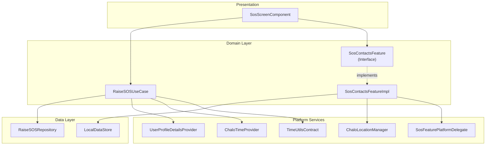

---

## Use Case Inventory

| Use Case | Location | Purpose |
|----------|----------|---------|
| `RaiseSOSUseCase` | `shared/home/.../usecase/` | Report emergency to backend via Zenduty integration |
| `SosContactsFeature` | `shared/home/.../sos/feature/` | Contact management interface (abstraction) |
| `SosContactsFeatureImpl` | `shared/home/.../sos/feature/` | Contact persistence, SMS composition, cooldown management |

---

## RaiseSOSUseCase

The `RaiseSOSUseCase` reports an emergency situation to Chalo's backend, which routes the incident to Zenduty for operational response. It gathers user context, location data, and timestamp to build a comprehensive incident report.

### Class Signature

```kotlin
class RaiseSOSUseCase(
    private val raiseSOSRepository: RaiseSOSRepository,
    private val userProfileDetailsProvider: UserProfileDetailsProvider,
    private val chaloTimeProvider: ChaloTimeProvider,
    private val timeUtilsContract: TimeUtilsContract
)
```

### Dependencies

| Dependency | Type | Purpose |
|------------|------|---------|
| `raiseSOSRepository` | `RaiseSOSRepository` | API abstraction for SOS endpoint |
| `userProfileDetailsProvider` | `UserProfileDetailsProvider` | User mobile number retrieval |
| `chaloTimeProvider` | `ChaloTimeProvider` | Current timestamp generation |
| `timeUtilsContract` | `TimeUtilsContract` | Date/time formatting utilities |

### Invocation

The use case implements the `invoke` operator for clean call-site syntax.

```kotlin
suspend operator fun invoke(
    sosRequest: Map<String, String>?,
    userLocation: LocationAppModel?
): ChaloUseCaseResult<Boolean, RaiseSOSExceptionType>
```

| Parameter | Type | Description |
|-----------|------|-------------|
| `sosRequest` | `Map<String, String>?` | Optional trip context (tripId, routeId, vehicleNo) |
| `userLocation` | `LocationAppModel?` | GPS coordinates if available |
| Returns | `ChaloUseCaseResult<Boolean, RaiseSOSExceptionType>` | Success with `true` or typed failure |

### Execution Flow

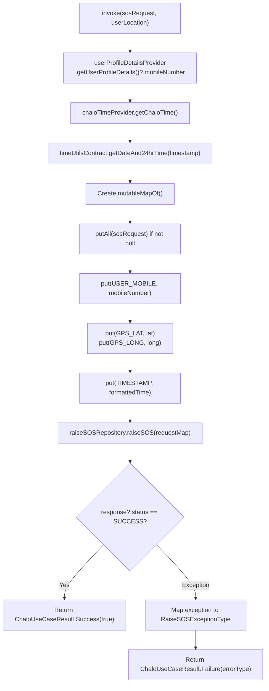

### Request Building

The use case constructs the API request by merging caller-provided context with automatically collected data.

| Field | Key Constant | Source | Required |
|-------|--------------|--------|----------|
| Trip context | Varies | `sosRequest` parameter | No |
| User phone | `USER_MOBILE` | `UserProfileDetailsProvider` | Yes |
| Latitude | `GPS_LAT` | `userLocation.latitude.toString()` | No |
| Longitude | `GPS_LONG` | `userLocation.longitude.toString()` | No |
| Timestamp | `TIMESTAMP` | `TimeUtilsContract.getDateAnd24hrTime()` | Yes |

### Request Map Construction Sequence

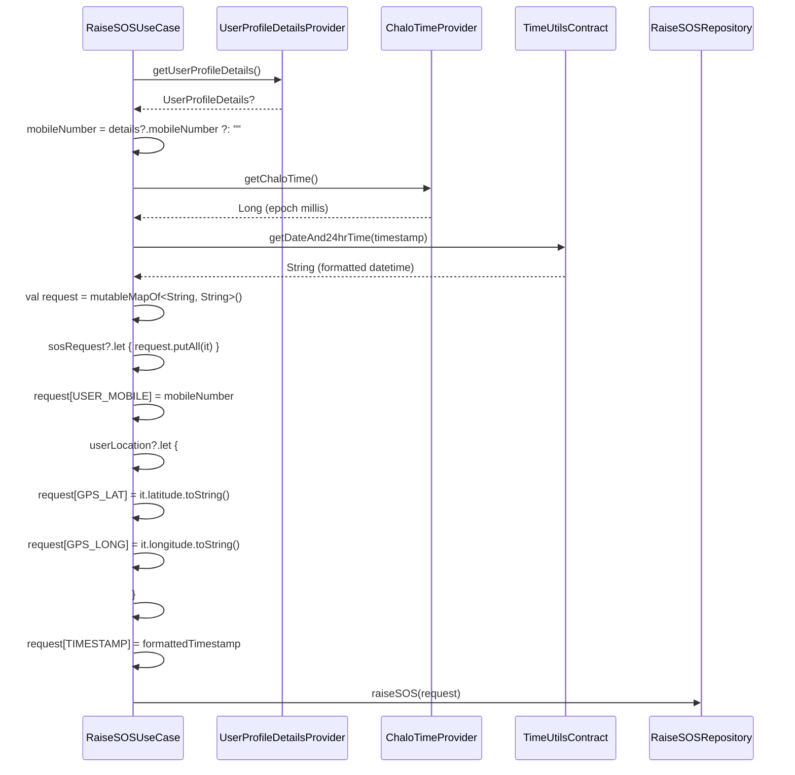

### Key Constants

| Constant | Value | Description |
|----------|-------|-------------|
| `USER_MOBILE` | `"userMobile"` | Request key for phone number |
| `GPS_LAT` | `"gpsLat"` | Request key for latitude |
| `GPS_LONG` | `"gpsLong"` | Request key for longitude |
| `TIMESTAMP` | `"timestamp"` | Request key for formatted time |
| `SUCCESS` | `"success"` | Expected success status value |

### Error Handling

The use case catches exceptions and maps them to typed error results:

```kotlin
try {
    val response = raiseSOSRepository.raiseSOS(request)
    if (response?.status == SUCCESS) {
        return ChaloUseCaseResult.Success(true)
    }
    return ChaloUseCaseResult.Failure(RaiseSOSExceptionType.PARSE_ERROR)
} catch (e: RaiseSOSInvalidDataException) {
    return ChaloUseCaseResult.Failure(RaiseSOSExceptionType.PARSE_ERROR)
} catch (e: RaiseSOSException) {
    return ChaloUseCaseResult.Failure(RaiseSOSExceptionType.SERVER_ERROR)
} catch (e: NetworkSuccessResponseParseException) {
    return ChaloUseCaseResult.Failure(RaiseSOSExceptionType.PARSE_ERROR)
} catch (e: ChaloLocalException) {
    return ChaloUseCaseResult.Failure(RaiseSOSExceptionType.LOCAL_ERROR)
} catch (e: Exception) {
    return ChaloUseCaseResult.Failure(RaiseSOSExceptionType.UNKNOWN_ERROR)
}
```

### Exception Mapping Table

| Exception | Mapped Result | Description |
|-----------|---------------|-------------|
| `RaiseSOSInvalidDataException` | `PARSE_ERROR` | Null or invalid API response |
| `RaiseSOSException` | `SERVER_ERROR` | Network or server failure |
| `NetworkSuccessResponseParseException` | `PARSE_ERROR` | JSON parsing failure |
| `ChaloLocalException` | `LOCAL_ERROR` | Local processing error |
| `Exception` (generic) | `UNKNOWN_ERROR` | Unexpected exception |

### RaiseSOSExceptionType Enum

| Value | Description | User Impact |
|-------|-------------|-------------|
| `USER_MOBILE_NUMBER_NOT_FOUND` | No phone number in user profile | May need re-login |
| `INVALID_REQUEST` | Malformed request payload | Log for debugging |
| `SERVER_ERROR` | Backend returned error | SMS still sends |
| `LOCAL_ERROR` | Local processing failed | SMS still sends |
| `UNKNOWN_ERROR` | Unexpected exception | SMS still sends |
| `PARSE_ERROR` | Response parsing failed | SMS still sends |

### Result Type

The use case returns `ChaloUseCaseResult<Boolean, RaiseSOSExceptionType>`:

| Variant | Meaning |
|---------|---------|
| `Success(true)` | API returned `status == "success"` |
| `Failure(type)` | Exception caught, mapped to error type |

---

## SosContactsFeature Interface

The `SosContactsFeature` interface defines the contract for managing emergency contacts, SOS messages, and sending alerts. It abstracts the implementation details behind a unified API consumed by the presentation layer.

### Interface Methods

```kotlin
interface SosContactsFeature {
    suspend fun addContact(sosContact: SosContact)
    suspend fun removeContact(sosContact: SosContact)
    suspend fun sendSosMessage(): Boolean
    fun getSosMessage(): Flow<String>
    suspend fun setSosMessage(message: String)
    suspend fun isSosContactsSaved(): Boolean
    fun getAllSosContact(): Flow<List<SosContact>>
    suspend fun pickContact(): SosPickContactResult
    suspend fun getLastSuccessfulSosTimestamp(): Long?
    suspend fun setLastSuccessfulSosTimestamp(timestamp: Long)
}
```

### Method Catalog

| Method | Signature | Purpose |
|--------|-----------|---------|
| `addContact` | `suspend fun addContact(sosContact: SosContact)` | Persist new contact |
| `removeContact` | `suspend fun removeContact(sosContact: SosContact)` | Delete contact |
| `sendSosMessage` | `suspend fun sendSosMessage(): Boolean` | Compose and send SMS |
| `getSosMessage` | `fun getSosMessage(): Flow<String>` | Observe message as Flow |
| `setSosMessage` | `suspend fun setSosMessage(message: String)` | Update message |
| `isSosContactsSaved` | `suspend fun isSosContactsSaved(): Boolean` | Check if contacts exist |
| `getAllSosContact` | `fun getAllSosContact(): Flow<List<SosContact>>` | Observe contacts as Flow |
| `pickContact` | `suspend fun pickContact(): SosPickContactResult` | Launch platform picker |
| `getLastSuccessfulSosTimestamp` | `suspend fun getLastSuccessfulSosTimestamp(): Long?` | Get cooldown timestamp |
| `setLastSuccessfulSosTimestamp` | `suspend fun setLastSuccessfulSosTimestamp(timestamp: Long)` | Store cooldown timestamp |

### Reactive State Pattern

The feature exposes contacts and message as Kotlin Flows, enabling automatic UI updates when underlying data changes.

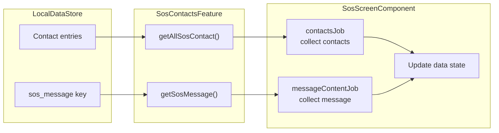

---

## SosContactsFeatureImpl

The implementation class coordinates between DataStore for persistence, ChaloLocationManager for GPS, and platform delegates for native contact/SMS operations.

### Class Signature

```kotlin
class SosContactsFeatureImpl(
    private val localDataStore: LocalDataStore,
    private val errorReporterContract: ErrorReporterContract,
    private val stringProvider: StringProvider,
    private val sosFeaturePlatformDelegateProvider: SosFeaturePlatformDelegateProvider,
    private val chaloLocationManager: ChaloLocationManager
) : SosContactsFeature
```

### Dependencies

| Dependency | Type | Purpose |
|------------|------|---------|
| `localDataStore` | `LocalDataStore` | Key-value persistence |
| `errorReporterContract` | `ErrorReporterContract` | Crash reporting |
| `stringProvider` | `StringProvider` | Localized strings |
| `sosFeaturePlatformDelegateProvider` | `SosFeaturePlatformDelegateProvider` | Platform abstraction |
| `chaloLocationManager` | `ChaloLocationManager` | GPS coordinates |

### Storage Key Constants

| Constant | Value | Purpose |
|----------|-------|---------|
| `SOS_STORE_PREFS_KEY` | `"sos_store_key.preferences_pb"` | DataStore file name |
| `SOS_MSG_KEY` | `"sos_message"` | Message storage key |
| `LAST_SUCCESSFUL_SOS_TIMESTAMP_KEY` | `"last_successful_sos_timestamp"` | Cooldown timestamp key |

---

## Contact Management Operations

### Add Contact

Serializes the contact to JSON and stores it in DataStore using the contactId as the key.

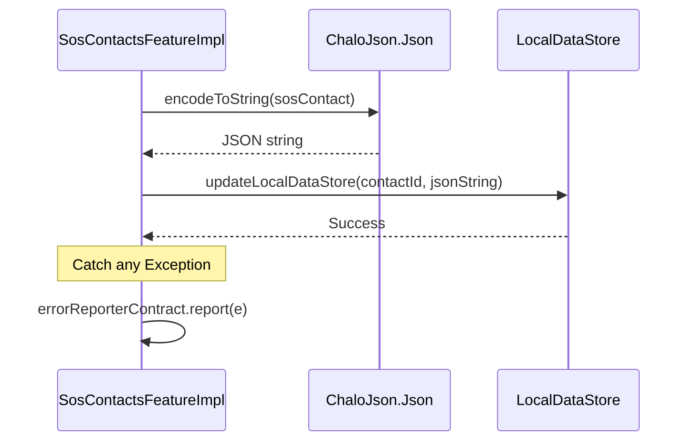

### Remove Contact

Deletes the contact entry from DataStore using its contactId.

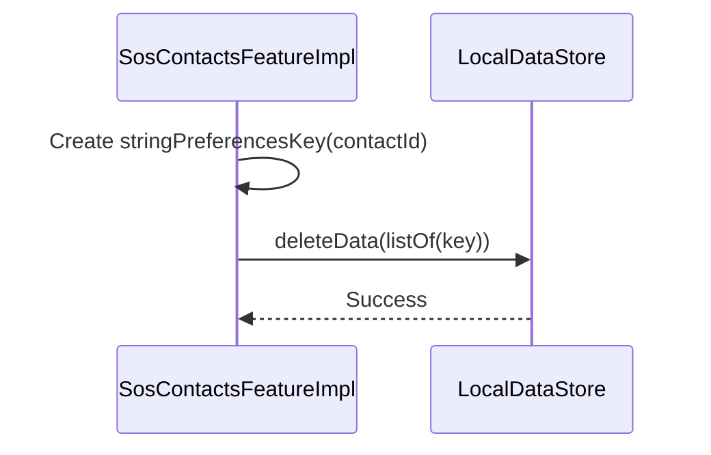

### Get All Contacts

Returns a Flow that emits the list of contacts whenever the DataStore changes.

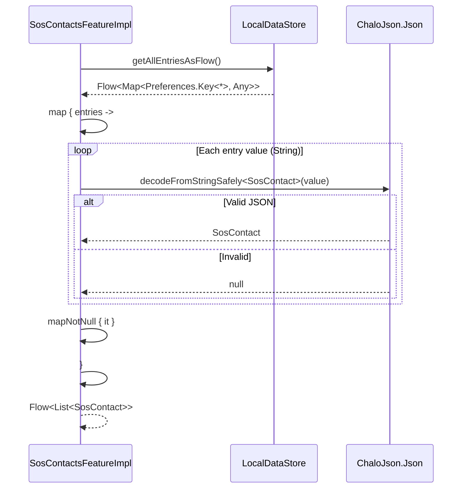

### Check Contacts Saved

Synchronously checks if any valid contacts exist in storage.

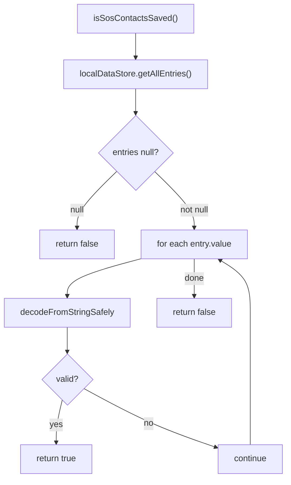

### Pick Contact

Delegates to the platform-specific contact picker and returns the result.

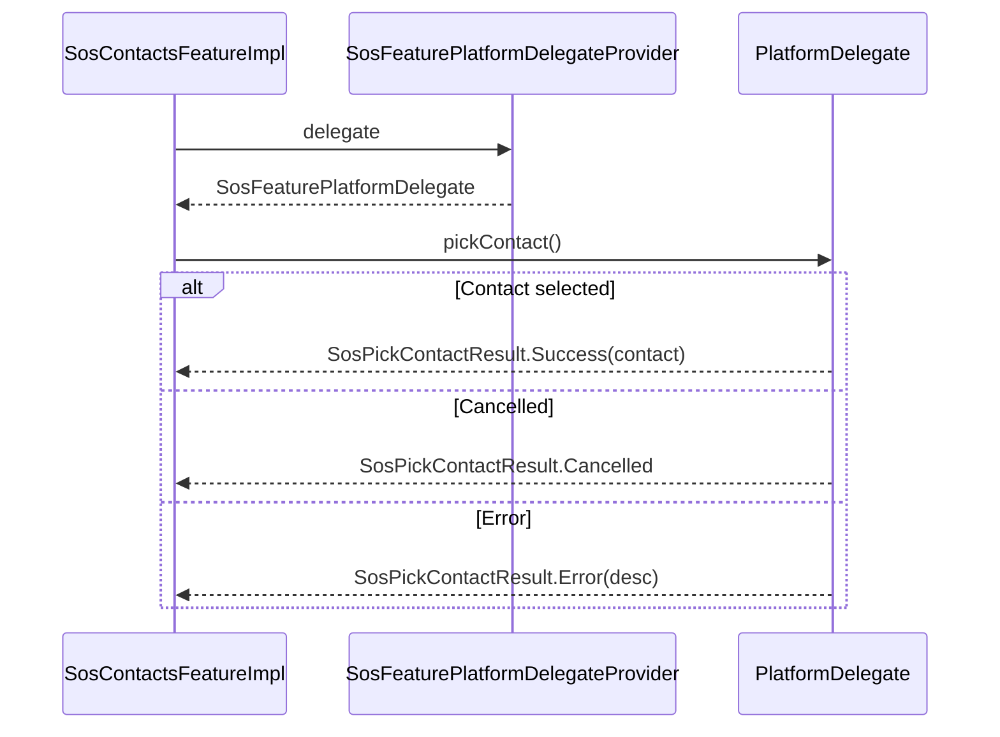

---

## Send SOS Message Flow

The `sendSosMessage()` method composes an SMS with the user's message, optionally appends a Google Maps location link, and opens the native SMS app with all contacts as recipients.

### Complete Sequence

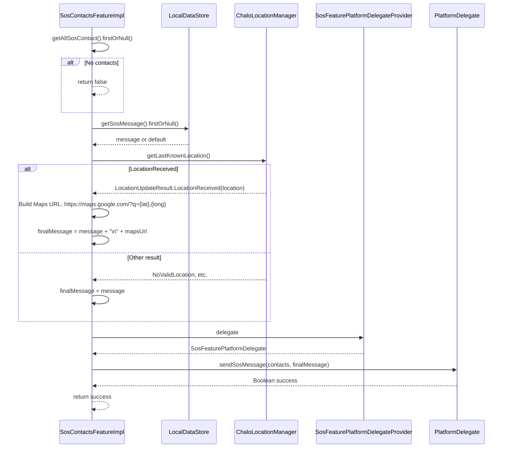

### Message Composition

| Component | Format |
|-----------|--------|
| Base message | User's custom message or `DEFAULT_SOS_MSG` |
| Location URL | `https://maps.google.com/?q={latitude},{longitude}` |
| Final message | `{message}\n{locationUrl}` (if location available) |

### LocationUpdateResult Handling

| Result Type | Action |
|-------------|--------|
| `LocationReceived` | Extract lat/long, build Maps URL, append to message |
| `GeneralException` | Use message without location |
| `Initiated` | Use message without location |
| `LocationFetchFailed` | Use message without location |
| `NoValidLocation` | Use message without location |
| `RequestLocationPermission` | Use message without location |
| `SettingsResolutionRequired` | Use message without location |
| `SettingsUnavailable` | Use message without location |

---

## Message Management

### Get SOS Message

Returns a Flow of the current SOS message, defaulting to localized default if none is saved.

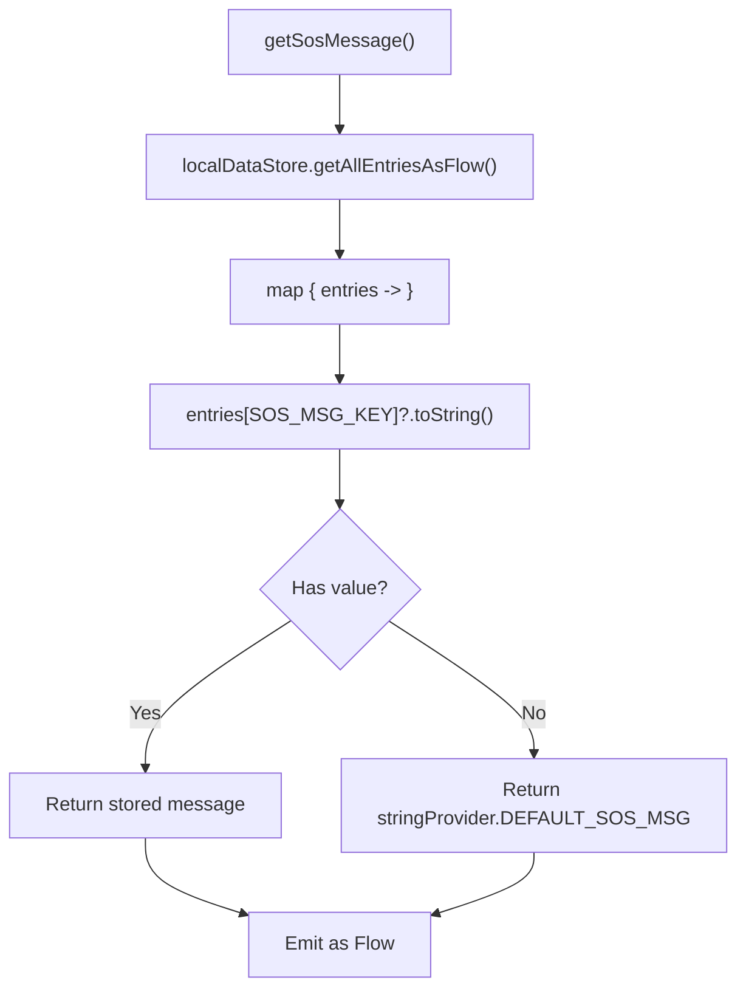

### Set SOS Message

Updates the stored message in DataStore.

| Step | Action |
|------|--------|
| 1 | Receive message string from component |
| 2 | Call `localDataStore.updateLocalDataStore(SOS_MSG_KEY, message)` |
| 3 | DataStore persists change to disk |
| 4 | `getSosMessage()` flow emits new value automatically |

---

## Cooldown Timestamp Management

The feature stores and retrieves the timestamp of the last successful API call for cooldown enforcement.

### Get Last Successful Timestamp

```kotlin
override suspend fun getLastSuccessfulSosTimestamp(): Long? {
    return localDataStore.getFlowFromLocalDataStore(
        longPreferencesKey(LAST_SUCCESSFUL_SOS_TIMESTAMP_KEY)
    ).firstOrNull()
}
```

| Step | Action |
|------|--------|
| 1 | Create `longPreferencesKey(LAST_SUCCESSFUL_SOS_TIMESTAMP_KEY)` |
| 2 | Call `getFlowFromLocalDataStore(key)` |
| 3 | Return `firstOrNull()` from the Flow |

### Set Last Successful Timestamp

```kotlin
override suspend fun setLastSuccessfulSosTimestamp(timestamp: Long) {
    localDataStore.updateLocalDataStore(
        longPreferencesKey(LAST_SUCCESSFUL_SOS_TIMESTAMP_KEY),
        timestamp
    )
}
```

| Step | Action |
|------|--------|
| 1 | Create `longPreferencesKey(LAST_SUCCESSFUL_SOS_TIMESTAMP_KEY)` |
| 2 | Call `updateLocalDataStore(key, timestamp)` |
| 3 | DataStore persists value |

### Cooldown Check (in SosScreenComponent)

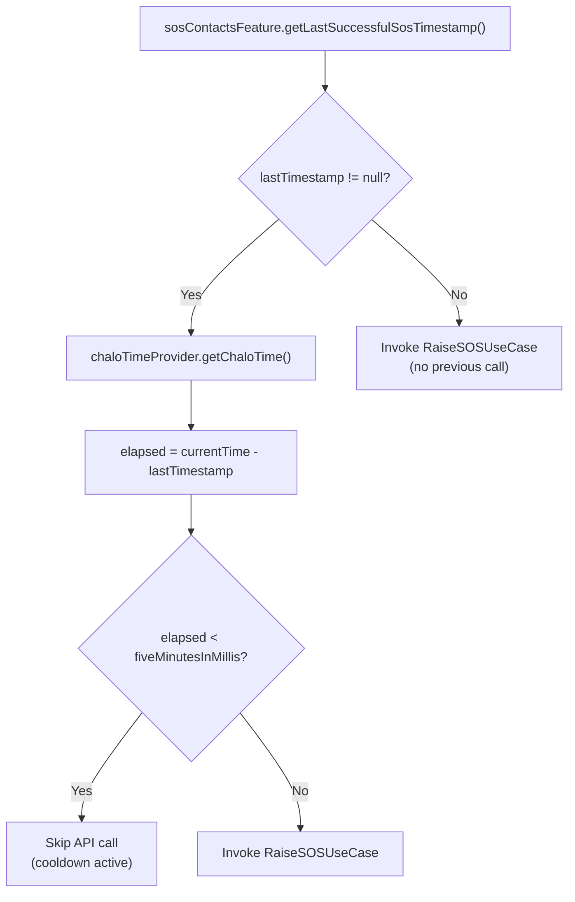

---

## Platform Delegate Provider

The `SosFeaturePlatformDelegateProvider` pattern enables lazy initialization of platform-specific delegates, allowing the shared code to work without direct platform dependencies.

### Provider Interface

```kotlin
interface SosFeaturePlatformDelegateProvider {
    val delegate: SosFeaturePlatformDelegate
    fun setDelegate(delegate: Lazy<SosFeaturePlatformDelegate>?)
}
```

| Property/Method | Type | Description |
|-----------------|------|-------------|
| `delegate` | `SosFeaturePlatformDelegate` | Current platform delegate instance |
| `setDelegate` | `fun setDelegate(Lazy?)` | Set delegate lazily from platform |

### Provider Implementation

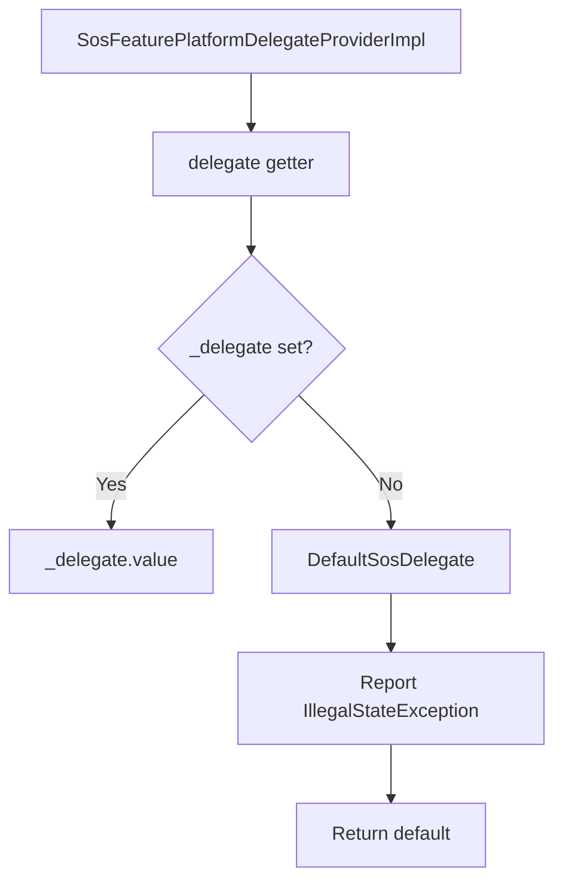

### DefaultSosDelegate

When no platform delegate is set (edge case), the default delegate handles calls with error reporting:

| Method | Behavior |
|--------|----------|
| `pickContact()` | Reports `IllegalStateException`, returns `Error` |
| `sendSosMessage()` | Reports `IllegalStateException`, returns `false` |

---

## Domain Models

### SosContact

Represents an emergency contact saved by the user.

```kotlin
@Serializable
data class SosContact(
    val contactId: String,
    val phoneNumber: String,
    val contactName: String
)
```

| Field | Type | Description |
|-------|------|-------------|
| `contactId` | String | Unique device identifier |
| `phoneNumber` | String | Phone number for SMS |
| `contactName` | String | Display name |

### SosPickContactResult

Sealed result type from platform contact picker.

```kotlin
sealed class SosPickContactResult {
    data class Success(val contact: SosContact) : SosPickContactResult()
    data class Error(val desc: String?) : SosPickContactResult()
    object Cancelled : SosPickContactResult()
}
```

| Variant | Fields | Description |
|---------|--------|-------------|
| `Success` | `contact: SosContact` | Contact successfully selected |
| `Error` | `desc: String?` | Picker encountered error |
| `Cancelled` | None | User dismissed picker |

### RaiseSOSRemoteAppResponseModel

Response model from the backend API.

```kotlin
data class RaiseSOSRemoteAppResponseModel(
    val status: String
)
```

| Field | Type | Description |
|-------|------|-------------|
| `status` | String | `"success"` or error status |

---

## Business Rules

| Rule | Location | Implementation |
|------|----------|----------------|
| Minimum message length | `SosScreenComponent` | 5 characters (`SOS_MESSAGE_LENGTH`) |
| Cooldown enforcement | `SosScreenComponent` | 5-minute gap between API calls |
| SMS always sends | `SosScreenComponent` | `sendSosMessage()` called before API check |
| Location optional | `SosContactsFeatureImpl` | Falls back to message-only if unavailable |
| Contact limit | Presentation layer | May be enforced in UI state factory |
| Default message | `SosContactsFeatureImpl` | `StringProvider.DEFAULT_SOS_MSG` fallback |

---

## Complete SOS Alert Flow

End-to-end sequence showing all domain layer interactions:

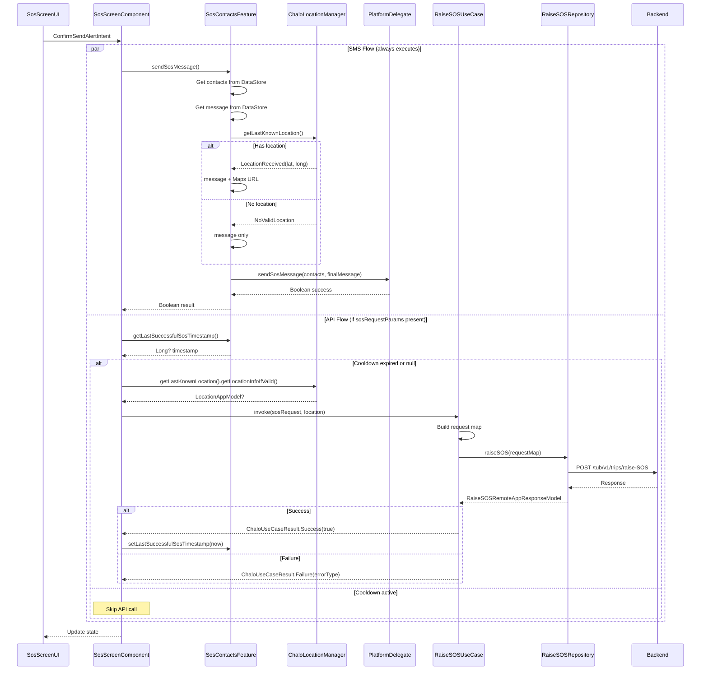

---

## Contact Lifecycle

Complete lifecycle of a contact from selection to deletion:

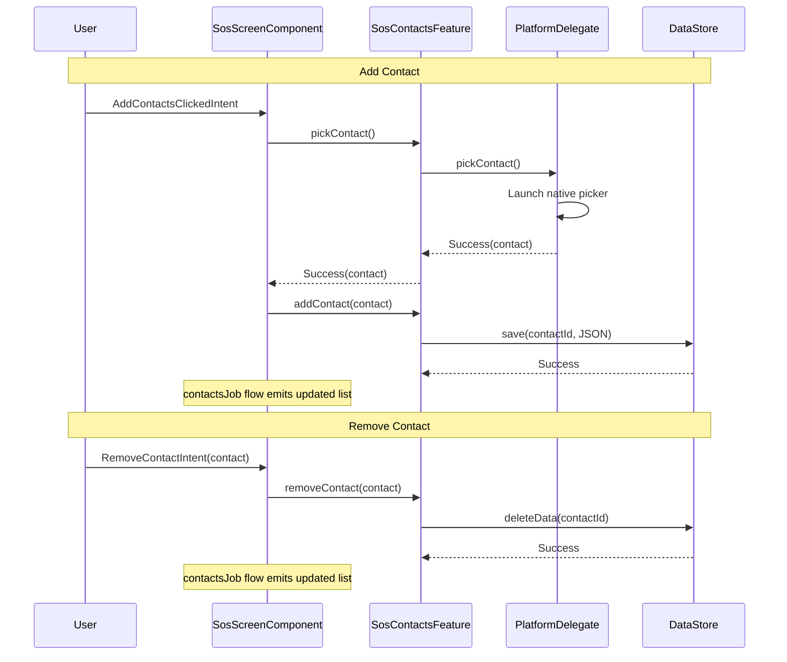

---

## Error Handling Summary

| Error | Layer | Handling |
|-------|-------|----------|
| Contact serialization failure | `SosContactsFeatureImpl` | Report exception, operation fails silently |
| DataStore read failure | `SosContactsFeatureImpl` | Return empty list or default message |
| Platform delegate not set | `DefaultSosDelegate` | Report error, return false/Error |
| Location unavailable | `SosContactsFeatureImpl` | Proceed without location in SMS |
| SMS app unavailable | Platform delegate | Return `false` |
| API failure | `RaiseSOSUseCase` | Map to exception type, return Failure |
| Parse failure | `RaiseSOSUseCase` | Return `PARSE_ERROR` |

---

## Dependency Injection

The SOS domain components are registered in `SharedHomeModule.kt`:

```kotlin
private fun Module.sosFeature() {
    single<SosContactsFeature> {
        SosContactsFeatureImpl(
            localDataStore = get(named(SosContactsFeatureImpl.SOS_STORE_PREFS_KEY)),
            errorReporterContract = get(),
            stringProvider = get(),
            sosFeaturePlatformDelegateProvider = get(),
            chaloLocationManager = get()
        )
    }
    factoryOf(::RaiseSOSUseCase)
}
```

| Component | Scope | Notes |
|-----------|-------|-------|
| `SosContactsFeature` | Singleton | Single instance shared across app |
| `RaiseSOSUseCase` | Factory | New instance per invocation |

---

## File Locations

| File | Path |
|------|------|
| `RaiseSOSUseCase.kt` | `shared/home/src/commonMain/kotlin/app/chalo/usecase/` |
| `SosContactsFeature.kt` | `shared/home/src/commonMain/kotlin/app/chalo/sos/feature/` |
| `SosContactsFeatureImpl.kt` | `shared/home/src/commonMain/kotlin/app/chalo/sos/feature/` |
| `SosContact.kt` | `shared/home/src/commonMain/kotlin/app/chalo/sos/feature/` |
| `SosPickContactResult.kt` | `shared/home/src/commonMain/kotlin/app/chalo/sos/feature/` |
| `SosFeaturePlatformDelegateProvider.kt` | `shared/home/src/commonMain/kotlin/app/chalo/sos/feature/` |
