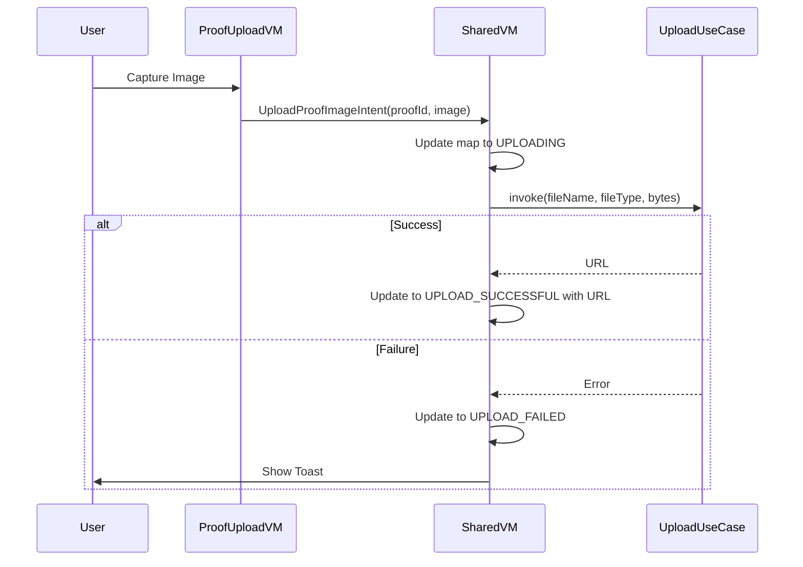
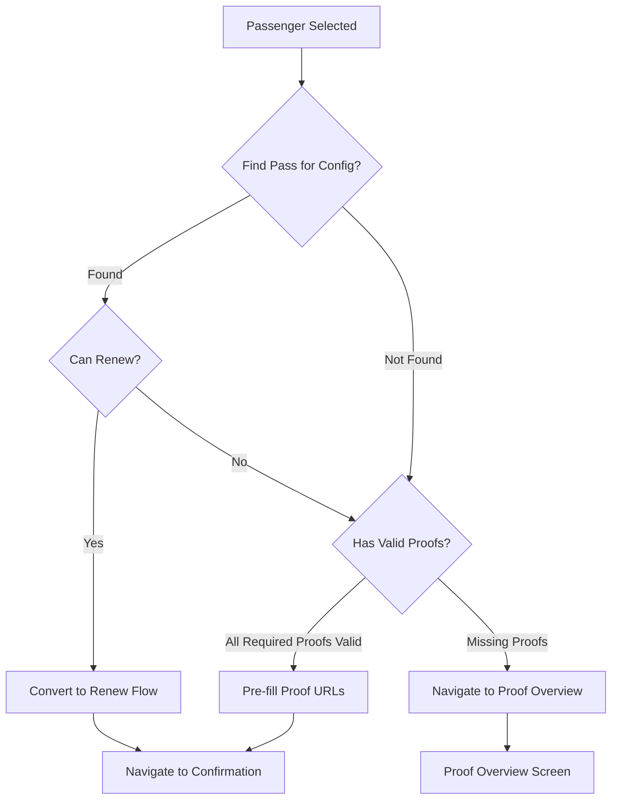
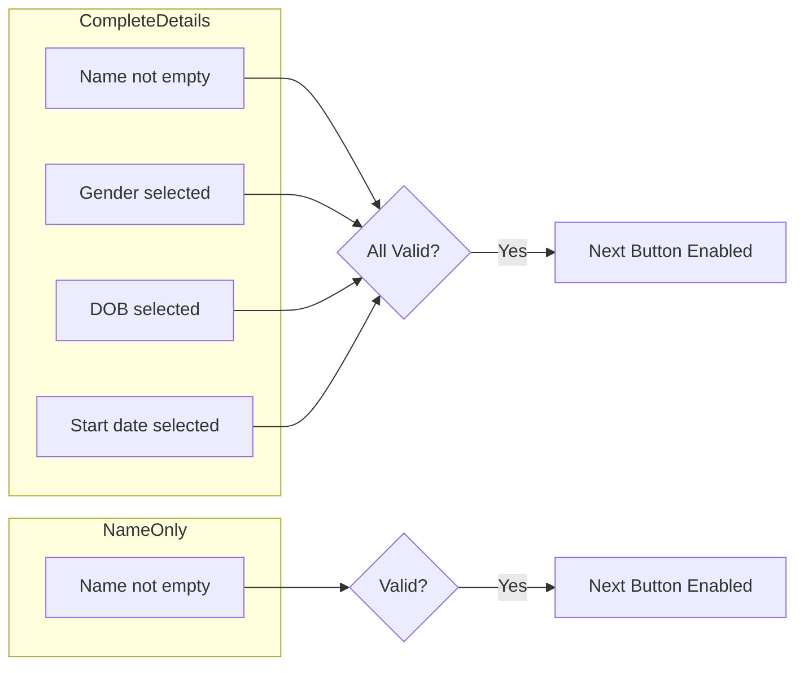
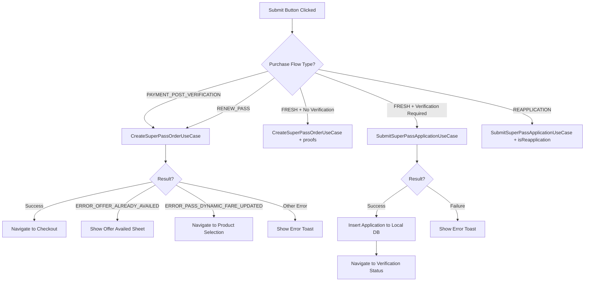
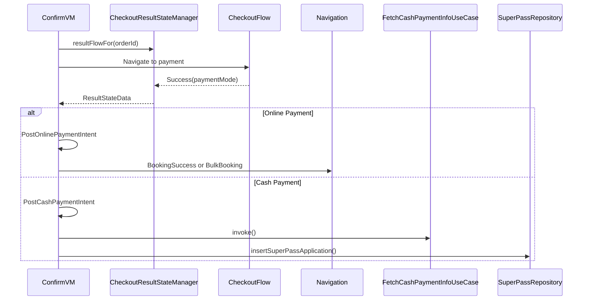
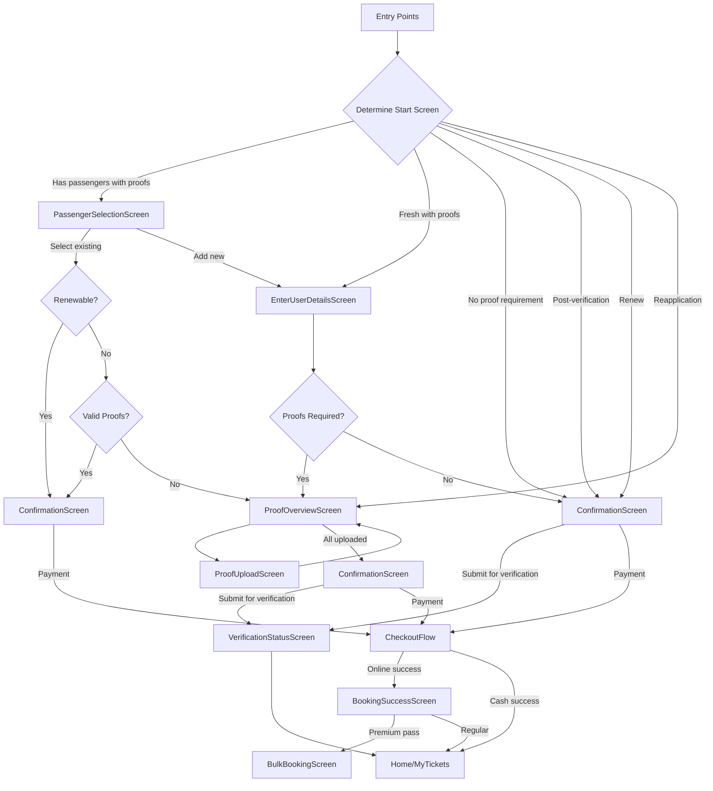
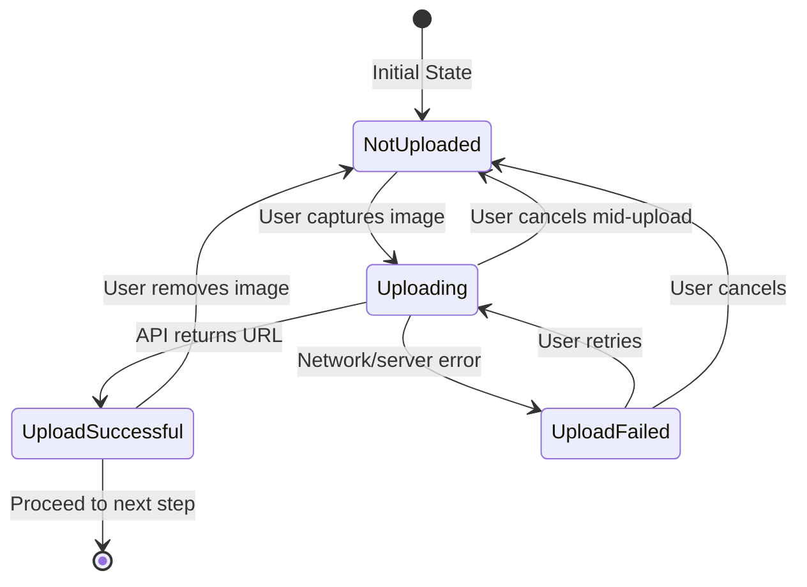

# Super Pass — Component Documentation

## Overview

The Super Pass feature uses a Decompose-based architecture with a shared ViewModel pattern to orchestrate a multi-step purchase flow. The `SuperPassPurchaseSharedViewModel` acts as the central state holder, implementing multiple manager interfaces that child screen components consume for coordinated state management. Each screen follows the MVI (Model-View-Intent) pattern with strict separation between data state, UI state, intents, and effects.

## Component Architecture

```mermaid
flowchart TB
    subgraph Parent["SuperPassParentComponent"]
        SharedVM["SuperPassPurchaseSharedViewModel"]
    end

    subgraph Screens["Screen Components"]
        PassengerSel["SuperPassPassengerSelectionViewModel"]
        EnterDetails["SuperPassEnterUserDetailsViewModel"]
        ProofOverview["SuperPassProofOverviewViewModel"]
        ProofUpload["SuperPassUserProofUploadViewModel"]
        Confirmation["ConfirmSuperPassPurchaseViewModel"]
        VerifStatus["SuperPassVerificationStatusComponent"]
        BookingSuccess["SuperPassBookingSuccessComponent"]
    end

    subgraph Managers["Manager Interfaces"]
        BaseManager["SuperPassPurchaseBaseManager"]
        UserDetailsManager["SuperPassUserDetailsManager"]
        PassengerManager["SuperPassPassengerSelectionManager"]
        ProofManager["SuperPassProofUploadManager"]
        ConfirmManager["SuperPassConfirmationManager"]
    end

    SharedVM -->|implements| BaseManager
    SharedVM -->|implements| UserDetailsManager
    SharedVM -->|implements| PassengerManager
    SharedVM -->|implements| ProofManager
    SharedVM -->|implements| ConfirmManager

    PassengerSel -->|uses| PassengerManager
    EnterDetails -->|uses| UserDetailsManager
    ProofOverview -->|uses| ProofManager
    ProofUpload -->|uses| ProofManager
    Confirmation -->|uses| ConfirmManager
```

---

## Screen Inventory

| Screen | Component | File Path | Purpose |
|--------|-----------|-----------|---------|
| Passenger Selection | `SuperPassPassengerSelectionViewModel` | `shared/home/.../passpurchase/ui/passengerselection/` | Select from existing passengers or add new |
| Enter User Details | `SuperPassEnterUserDetailsViewModel` | `shared/home/.../passpurchase/ui/enteruserdetails/` | Collect passenger name, DOB, gender |
| Proof Upload | `SuperPassUserProofUploadViewModel` | `shared/home/.../passpurchase/ui/proofupload/` | Upload individual proof documents |
| Proof Overview | `SuperPassProofOverviewViewModel` | `shared/home/.../passpurchase/ui/proofoverview/` | Review all uploaded proofs |
| Confirmation | `ConfirmSuperPassPurchaseViewModel` | `shared/home/.../passpurchase/ui/confirmation/` | Final purchase summary |
| Booking Success | `SuperPassBookingSuccessComponent` | `shared/home/.../passpurchase/ui/passbookingsuccess/` | Post-payment success display |
| Verification Status | `SuperPassVerificationStatusComponent` | `shared/home/.../passpurchase/ui/verificationstatus/` | Track verification progress |

---

## SuperPassPurchaseSharedViewModel

The central state holder for the entire Super Pass purchase flow. It maintains the global purchase state and implements multiple manager interfaces to expose specific functionality to child components.

### Shared State Structure

The `SuperPassPurchaseSharedState` holds all data needed across screens:

| Field | Type | Description |
|-------|------|-------------|
| `source` | `Source` | Entry point that initiated the flow |
| `purchaseFlowType` | `String?` | Flow variant identifier |
| `userDetails` | `SuperPassUserDetails` | Passenger information being collected |
| `bookableSuperPassConfiguration` | `BookableSuperPassConfiguration?` | Selected pass configuration with category and fare mapping |
| `passStartTime` | `Long?` | User-selected pass start date |
| `passVerificationExpiryTime` | `Long` | Deadline for verification completion |
| `proofDocumentPropsList` | `List<ProofDocumentProps>` | Required proof documents |
| `proofUploadDetailsMap` | `Map<String, ProofUploadDetails>?` | Upload status for each proof |
| `passApplicationActionRequired` | `PassApplicationActionRequired` | Action required for rejected applications |
| `passIdForRenew` | `String?` | Pass ID when renewing existing pass |

### Purchase Flow Types

The `purchaseFlowType` determines the navigation path and confirmation behavior:

| Flow Type | Description | Start Screen |
|-----------|-------------|--------------|
| `FLOW_FRESH_PURCHASE` | New purchase with verification | Enter Details or Passenger Selection |
| `FLOW_FRESH_PURCHASE_WITHOUT_PROOF_REQUIREMENT` | New purchase, no proofs needed | Enter Details (name only) |
| `FLOW_PAYMENT_POST_VERIFICATION` | Payment after admin verification | Confirmation |
| `FLOW_RENEW_PASS` | Renewing existing pass | Confirmation |
| `FLOW_REAPPLICATION` | Resubmitting rejected application | Proof Overview |

### Key Intents

| Intent | Purpose |
|--------|---------|
| `InitializationIntent` | Initialize state from navigation args via `SuperPassPurchaseInitialStateFactory` |
| `UpdateUserDetailsAndStartTime` | Save user-entered passenger details |
| `UploadProofImageIntent` | Begin proof document upload to server |
| `CancelProofUploadIntent` | Cancel ongoing upload and reset state |
| `ConvertFreshBookingToRenewFlowOnSmartPassengerSelectionIntent` | Convert flow type when eligible renewable pass found |
| `UpdatePassStartTimeIntent` | Update selected pass start date |

### Proof Upload Flow

### State Restoration

The component uses `StateKeeper` with `SuperPassPurchaseSharedRestoredState` for process death recovery. Proof images are serialized as byte arrays in `ProofUploadDetailsSerializable` since `BitmapImage` is not directly serializable.

---

## SuperPassPassengerSelectionViewModel

Displays up to 5 previously used passenger profiles for quick re-selection. Appears when the user has booking history with valid proofs.

### State Structure

| Field | Type | Description |
|-------|------|-------------|
| `passengersList` | `List<SuperPassUserDetails>` | Previously used passengers sorted by booking time |

### Selection Logic

When a passenger is selected, the component evaluates the optimal path forward:

The `SmartSuperPassPassengerSelectionHelper` performs the lookup in the repository to find matching passes and valid proofs.

### Intents

| Intent | Trigger | Action |
|--------|---------|--------|
| `InitializationIntent` | Component created | Load passenger list via `getAllUniquelyNamedSuperPassUserDetailsSortedByDateForCurrentCity()` |
| `PassengerSelectedIntent` | Passenger card tapped | Evaluate renewal eligibility, navigate accordingly |
| `AddNewPassengerIntent` | Add new button tapped | Reset user details, navigate to Enter Details |

---

## SuperPassEnterUserDetailsViewModel

Collects passenger basic information. Supports three modes based on `SuperPassBasicUserPurpose`:

| Purpose | Fields Collected | Use Case |
|---------|------------------|----------|
| `COMPLETE_DETAILS` | Name, Gender, DOB, Pass Start Date | Fresh purchase with proofs |
| `ONLY_NAME` | Name only | Fresh purchase without proofs |
| `EDIT_NAME` | Name only | Edit name from confirmation screen |

### Data State

| Field | Type | Description |
|-------|------|-------------|
| `fullName` | `String` | Passenger name |
| `gender` | `Gender` | MALE, FEMALE, or OTHER |
| `dobInMillis` | `Long?` | Date of birth timestamp |
| `passStartTime` | `Long?` | Selected start date |
| `areAllRequiredFieldsSet` | `Boolean` | Form validation state |
| `dialogType` | `SuperPassBasicDetailsDialogType?` | Active dialog |

### Dialog Types

| Dialog | Purpose | Date Range |
|--------|---------|------------|
| `GenderSelection` | Gender picker with MALE, FEMALE, OTHER | N/A |
| `DobDatePicker` | Date of birth | Past 100 years to today |
| `PassStartTimeDatePicker` | Pass start date | Today to 30 days ahead |

### Form Validation

### Intents

| Intent | Trigger | Action |
|--------|---------|--------|
| `InitializationIntent` | Component created | Pre-fill from user profile via `getSuperPassUserDetailsFromUserProfile()` |
| `FieldUpdatedIntent` | Any field changed | Update state, re-validate |
| `GenderSelectionDialogClickedIntent` | Gender field tapped | Show gender dialog |
| `DobFieldClickedIntent` | DOB field tapped | Show date picker with bounds |
| `PassStartTimeFieldClickedIntent` | Start date tapped | Show date picker |
| `NextBtnClickIntent` | Continue tapped | Save to shared state, navigate |

---

## SuperPassUserProofUploadViewModel

Handles individual proof document capture and upload with camera or gallery selection.

### Data State

| Field | Type | Description |
|-------|------|-------------|
| `proofDocProps` | `ProofDocumentProps?` | Current proof requirements including name, description, placeholder URL |
| `shouldShowPermissionRationale` | `Boolean` | Camera permission dialog state |
| `shouldZoomPlaceholderImage` | `Boolean` | Sample image zoom state |

### ProofDocumentProps Structure

| Field | Type | Description |
|-------|------|-------------|
| `proofId` | `String` | Unique identifier for this proof type |
| `proofName` | `String` | Display name (e.g., "Student ID Card") |
| `proofDesc` | `String?` | Instructions for capturing |
| `placeholderImageUrl` | `String?` | Sample document image |
| `tutorialVideoUrl` | `String?` | Help video URL |

### Intents

| Intent | Trigger | Action |
|--------|---------|--------|
| `InitializationIntent` | Component created | Load proof requirements from args |
| `NextBtnClickedIntent` | Upload button tapped | Launch camera/gallery picker |
| `WatchTutorialClickedIntent` | Tutorial link tapped | Open video URL |
| `ZoomPlaceholderImageIntent` | Sample image tapped | Show enlarged view |
| `DismissZoomedImageIntent` | Close zoom | Return to normal view |

---

## ConfirmSuperPassPurchaseViewModel

Final confirmation screen handling order creation and checkout navigation.

### Data State

| Field | Type | Description |
|-------|------|-------------|
| `isFareLayoutExpanded` | `Boolean` | Fare breakdown visibility |
| `isProfileSubmittedForVerification` | `Boolean` | Submission in progress flag |
| `dialog` | `PassConfirmationDialogType?` | Loading or date picker dialog |
| `bottomSheet` | `PassConfirmationBottomSheetType?` | TnC or error bottom sheet |
| `passValidityInfo` | `PassValidityInfo?` | Computed start and expiry dates |
| `brandingUrl` | `String?` | Agency branding image URL |

### Dialog and Bottom Sheet Types

**Dialogs:**
| Type | Purpose |
|------|---------|
| `Loading` | Order creation in progress |
| `PassStartTimeChangeDialog` | Date picker for changing start date |

**Bottom Sheets:**
| Type | Purpose |
|------|---------|
| `TermsAndConditions` | Full T&C display |
| `PassAlreadyAvailed` | Duplicate pass blocking message (error code 6000) |

### Purchase Flow Branches

### Checkout Result Handling

The component uses `CheckoutResultStateManager` to receive payment results asynchronously:

### Intents

| Intent | Trigger | Action |
|--------|---------|--------|
| `InitializationIntent` | Component created | Build confirmation summary, update eligibility |
| `EditPassStartDateIntent` | Change date tapped | Show date picker |
| `FareDetailsLayoutClickedIntent` | Fare section tapped | Toggle expansion |
| `SubmitBtnClickedIntent` | Pay button tapped | Create order or submit application |
| `PostOnlinePaymentIntent` | Online payment success | Navigate to booking success |
| `PostCashPaymentIntent` | Cash payment selected | Fetch cash info, insert application |
| `DateSelectedIntent` | Date picked | Update start date via manager |

---

## SuperPassVerificationStatusComponent

Displays verification pending status after proof submission.

### Data State

| Field | Type | Description |
|-------|------|-------------|
| `passApplication` | `SuperPassApplication?` | Submitted application details |
| `timingDetails` | `MPassVerificationTimingDetails` | Expected verification time window |
| `source` | `String` | Screen that initiated this flow |

### MPassVerificationTimingDetails

| Field | Type | Description |
|-------|------|-------------|
| `verificationTimeRequired` | `String` | Expected duration (e.g., "24-48 hours") |
| `verificationOfficeTimings` | `String` | Office hours when verification happens |

---

## Manager Interfaces

Manager interfaces decouple child components from the shared ViewModel implementation:

### SuperPassPurchaseBaseManager

| Method | Purpose |
|--------|---------|
| `reportProblem()` | Launch report problem feature |
| `state: StateFlow<SuperPassPurchaseSharedState>` | Access shared state |

### SuperPassUserDetailsManager

| Method | Purpose |
|--------|---------|
| `submitCompleteDetailsEntered(fullName, gender, dateOfBirth, dobInMillis, startTime)` | Save user details form |

### SuperPassPassengerSelectionManager

| Method | Purpose |
|--------|---------|
| `setupNewPassenger()` | Reset user details for new passenger |
| `updateUserDetailsFromSmartPassengerSelection(user)` | Set selected passenger details |
| `convertFreshBookingToRenewFlowOnSmartPassengerSelection(passId, verificationExpiryTime, user)` | Switch to renew flow |

### SuperPassProofUploadManager

| Method | Purpose |
|--------|---------|
| `uploadProof(id, image, uploadRequestId)` | Start image upload |
| `cancelProofUpload(proofId)` | Cancel ongoing upload |
| `updateProofsFromPreviouslyValidUploadsForUser(map)` | Pre-fill valid proofs |

### SuperPassConfirmationManager

| Method | Purpose |
|--------|---------|
| `updatePassStartTime(time)` | Update selected start date |
| `updateUserName(name)` | Update passenger name |

---

## Navigation Flow

---

## State Restoration

All components implement process death recovery via StateKeeper:

| Component | StateKeeper Key | Serializable Class |
|-----------|-----------------|-------------------|
| SharedViewModel | `super_pass_purchase_shared_state_keeper_key` | `SuperPassPurchaseSharedRestoredState` |
| EnterUserDetails | `superPassEnterUserDetailsStateKeeperKey` | `SuperPassEnterUserDetailsRestoredState` |
| ProofUpload | Per-screen key | `SuperPassUserProofUploadRestoredState` |
| Confirmation | `confirm_pass_purchase_sk_key` | `ConfirmPassPurchaseStateKeeperMeta` |

---

## Analytics Events

| Event | Screen | Key Properties |
|-------|--------|----------------|
| `SUPER_PASS_PURCHASE_ACTIVITY_OPEN` | Shared | flow, source |
| `BASIC_USER_DETAILS_SCREEN_OPEN` | Enter Details | source |
| `BASIC_USER_DETAILS_NEXT_CLICKED` | Enter Details | fullName, dob, gender, passStartDate |
| `CONFIRM_PAYMENT_SCREEN_OPEN` | Confirmation | flow, productId |
| `CONFIRM_MPASS_PURCHASE_PAY_BTN_CLICKED` | Confirmation | productId, passFare, payableFare |
| `MPASS_ORDER_CREATED` | Confirmation | orderId, chaloOrderId |
| `APPLICATION_SUBMISSION_FOR_VERIFICATION_SUCCESS` | Confirmation | productId, productType |
| `REPORT_PROBLEM_CLICKED_V2` | Any | problemType, problemSource |

---

## Navigation Constants

The `SuperPassPurchaseNavigationConstants` object defines source identifiers for analytics tracking and flow determination.

### Source Identifiers

| Constant | Value | Entry Point |
|----------|-------|-------------|
| `SOURCE_RENEW_SUPER_PASS_ACTIVITY` | "sourceRenewSuperPassActivity" | Renew button on active pass |
| `SOURCE_SUPER_PASS_SELECTION_ACTIVITY` | "sourceSuperPassSelectionActivity" | Pass selection screen |
| `SOURCE_VERIFICATION_PENDING_STATUS_CARD` | "sourceVerificationPendingStatusCard" | Pending application card |
| `SOURCE_PASS_STATUS_CARD` | "sourcePassStatusCard" | Pass status card on home |
| `SOURCE_HISTORY_SCREEN_CARD_HOOK` | "sourceHistoryScreenCardHook" | History screen pass entry |
| `SOURCE_NOTIFICATION` | "sourceNotification" | Push notification deep link |
| `SOURCE_YOUR_PLANS_CARD` | "sourceYourPlansCard" | Your Plans section card |
| `SOURCE_YOUR_PLANS_CARD_HOME_SCREEN` | "sourceHomeScreenYourPlansCard" | Home screen Your Plans |
| `SOURCE_YOUR_PLANS_CARD_HISTORY_SCREEN` | "sourceHistoryScreenYourPlansCard" | History screen Your Plans |

### Flow Type Identifiers

| Constant | Value | Description |
|----------|-------|-------------|
| `FLOW_FRESH_PURCHASE_WITHOUT_PROOF_REQUIREMENT` | "flowFreshPurchaseWithoutProofRequirement" | Direct purchase, no verification |
| `FLOW_FRESH_PURCHASE` | "flowFreshPurchase" | New purchase with verification |
| `FLOW_PAYMENT_POST_VERIFICATION` | "flowPaymentPostVerification" | Payment after admin approval |
| `FLOW_REAPPLICATION` | "flowReapplication" | Resubmission after rejection |
| `FLOW_RENEW_PASS` | "flowRenewPass" | Renewal of existing pass |
| `FLOW_PAYMENT_MODE_CHANGED_NO_VERIFICATION` | "flowPaymentModeChangedNoVerification" | Payment mode change flow |

---

## Activation Flow Screens

Beyond the purchase flow, the feature includes activation screens for using purchased passes.

### Activation Source Identifiers

| Constant | Value | Screen |
|----------|-------|--------|
| `SOURCE_SUPER_PASS_VALIDATION_SCREEN` | "sourceSuperPassValidationScreen" | Validation entry |
| `SOURCE_ACTIVATE_SUPER_PASS_SCREEN` | "sourceActivateSuperPassScreen" | Activation trigger |
| `SOURCE_ACTIVE_SUPER_PASS_QR_SCREEN` | "sourceActiveSuperPassQRScreen" | QR code display |
| `SOURCE_ACTIVE_SUPER_PASS_ZOOMED_QR_SCREEN` | "sourceActiveSuperPassZoomedQRScreen" | Enlarged QR view |
| `SOURCE_ACTIVE_SUPER_PASS_SOUND_SCREEN` | "sourceActiveSuperPassSoundScreen" | Audio validation |
| `SOURCE_ACTIVE_SUPER_PASS_VISUAL_VALIDATION_SCREEN` | "sourceActiveSuperPassVisualValidationScreen" | Visual validation display |

---

## Proof Upload State Machine

The proof upload process follows a well-defined state machine managed in `ProofUploadDetails`.

### ProofUploadDetails States

| State | UI Representation | Actions Available |
|-------|-------------------|-------------------|
| `NOT_UPLOADED` | Add Image placeholder | Tap to capture |
| `UPLOADING` | Progress indicator | Cancel upload |
| `UPLOAD_SUCCESSFUL` | Thumbnail with X button | Remove, view enlarged |
| `UPLOAD_FAILED` | Error state | Retry, cancel |
