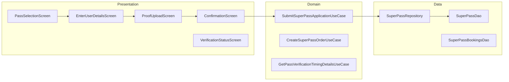
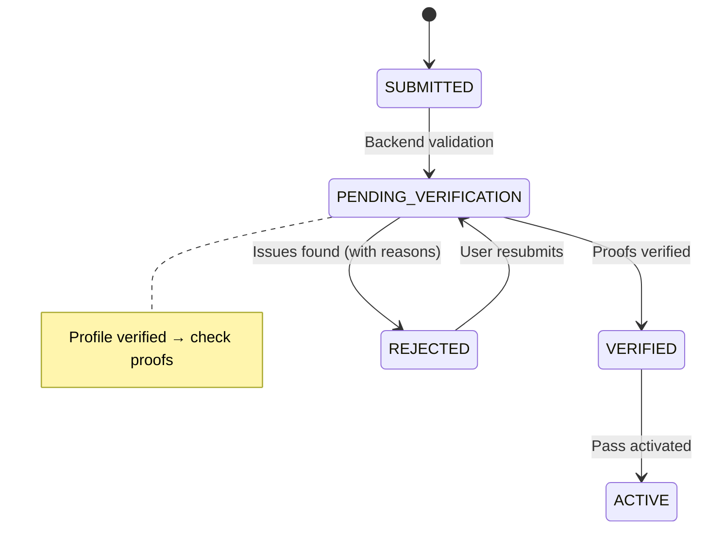

# Super Pass — High-Level Design

## Overview

The Super Pass feature enables users to purchase monthly/weekly bus passes within the Chalo app. It supports multiple pass types (Magic Pass for unlimited rides, Ride-based Pass for limited trips), passenger details collection, proof document submission, and a verification workflow. Passes require admin approval before activation.

## User Journey

1. **Entry Points**:
   - Home screen → Super Pass card
   - Profile → My Passes
   - History → Renew pass

2. **Core Flow**:
   - Select pass configuration
   - Enter passenger details (name, DOB, gender, photo)
   - Upload proof documents (if required)
   - Review and confirm purchase
   - Pay for pass
   - Wait for verification
   - Receive activated pass

3. **Exit Points**:
   - Pending verification → Verification status screen
   - Approved → Pass display with trips
   - Rejected → Resubmission flow

## Architecture Diagram



## Key Components

| Component | Platform | File Path | Responsibility |
|-----------|----------|-----------|----------------|
| `PassSelectionComponent` | Shared | `shared/home/.../productpurchase/passselection/ui/PassSelectionComponent.kt` | Pass type selection |
| `SuperPassEnterUserDetailsComponent` | Shared | `shared/home/.../productpurchase/passpurchase/ui/enteruserdetails/SuperPassEnterUserDetailsComponent.kt` | User details collection |
| `SuperPassUserProofUploadComponent` | Shared | `shared/home/.../productpurchase/passpurchase/ui/proofupload/SuperPassUserProofUploadComponent.kt` | Document upload |
| `ConfirmSuperPassPurchaseComponent` | Shared | `shared/home/.../productpurchase/passpurchase/ui/confirmation/ConfirmSuperPassPurchaseComponent.kt` | Final confirmation |
| `SubmitSuperPassApplicationUseCase` | Shared | `shared/home/.../productpurchase/passpurchase/domain/SubmitSuperPassApplicationUseCase.kt` | Submit application |
| `SuperPassRepository` | Shared | `shared/home/.../superpass/data/repository/SuperPassRepository.kt` | Pass data management |

## Data Flow

### Pass Selection
1. `PassSelectionComponent` fetches available pass configs
2. User selects pass type (Magic, Ride-based)
3. Pass details displayed (validity, price, routes)
4. Navigate to user details

### User Details and Proofs
1. `SuperPassEnterUserDetailsComponent` collects:
   - Full name
   - Date of birth
   - Gender
   - Profile photo
2. If proofs required, `SuperPassUserProofUploadComponent`:
   - Lists required document types
   - Allows photo upload
   - Validates document quality
3. `SuperPassProofOverviewComponent` shows all uploaded proofs

### Application and Verification
1. `ConfirmSuperPassPurchaseComponent` shows summary
2. `SubmitSuperPassApplicationUseCase` submits application
3. Backend validates documents
4. `GetPassVerificationTimingDetailsUseCase` shows timing
5. Application status: PENDING → VERIFIED or REJECTED

## Platform Differences

### Android-Specific
- Camera integration for document capture
- Image compression before upload
- Native date picker

### iOS-Specific
- PHPickerViewController for photos
- UIDatePicker integration
- SwiftUI proof upload UI

## Integration Points

### Analytics Events
- See [Analytics: super-pass](/analytics/flows/super-pass) for event documentation
- Key events:
  - `super_pass_selection_opened`
  - `super_pass_user_details_entered`
  - `super_pass_proof_uploaded`
  - `super_pass_application_submitted`
  - `super_pass_verification_completed`

### Shared Services
- **Payment**: Checkout for pass payment
- **Storage**: Image upload to cloud
- **User Profile**: Pre-fill user details

### Navigation
- **Navigates to**: User details, Proof upload, Checkout, Verification status
- **Navigated from**: Home, History, Profile

## Pass Types

### MagicSuperPass
- **Usage**: Unlimited rides within validity
- **Validity**: Weekly/Monthly
- **Routes**: All or specific routes

### RideBasedSuperPass
- **Usage**: Limited trip count
- **Validity**: Weekly/Monthly
- **Features**:
  - `getRemainingTotalTrips()` — Total remaining
  - `getRemainingTripsForToday()` — Daily limit
  - `hasExhaustedTotalTrips()` — Check exhaustion

### SuperPassApplication
- **Status**: PENDING_VERIFICATION, VERIFIED, REJECTED
- **Proofs**: Map of document type → upload URL
- **Rejection**: Reasons and required actions

## Edge Cases & Error Handling

| Scenario | Handling |
|----------|----------|
| Photo upload failed | Shows retry option |
| Invalid document | Shows specific error message |
| Application rejected | Shows rejection reasons with resubmit |
| Pass expired | Shows renew option |
| Verification timeout | Escalation to support |
| Duplicate pass | Blocks purchase with message |

## Verification Workflow



## Data Models

### SuperPass (Abstract Base)
```kotlin
abstract class SuperPass(
    val superPassProperties: SuperPassProperties,
    val superPassValidationProperties: SuperPassValidationProperties,
    val superPassUIProperties: SuperPassUIProperties,
    val superPassRepurchaseProperties: SuperPassRepurchaseProperties,
    val superPassTransactionDetails: SuperPassTransactionDetails,
    val superPassTripPreferences: SuperPassTripPreferences
) {
    abstract fun isExpired(currentTrueTime: Long): Boolean
    abstract fun canActivate(currentTrueTime: Long): Boolean
    abstract fun canBookAgain(): Boolean
    abstract fun canRenewSuperPass(): Boolean
}
```

### SuperPassApplication
```kotlin
data class SuperPassApplication(
    val userId: String,
    val configId: String,
    val passName: String,
    val superPassApplicationStatus: SuperPassApplicationStatus,
    val proofs: Map<String, SuperPassProofProperties>,
    val passApplicationRejectionReasons: PassApplicationRejectionReasons?,
    val passApplicationActionRequired: PassApplicationActionRequired?
)
```

### PassApplicationRejectionReasons
```kotlin
data class PassApplicationRejectionReasons(
    val profileRejectionReason: ProfileRejectionReason?,
    val proofRejectionReasons: List<ProofRejectionReason>?
)
```

## Dependencies

### Internal
- `shared:home` — Super pass module
- `shared:checkout` — Payment processing
- `shared:chalo-base` — Base models

### External
- SQLDelight — Local pass storage
- Cloud storage — Proof document uploads
- Image compression — Document optimization
