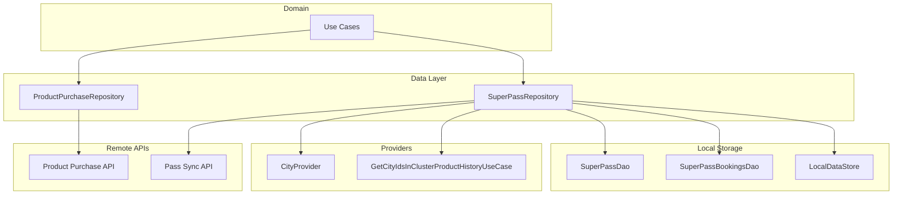
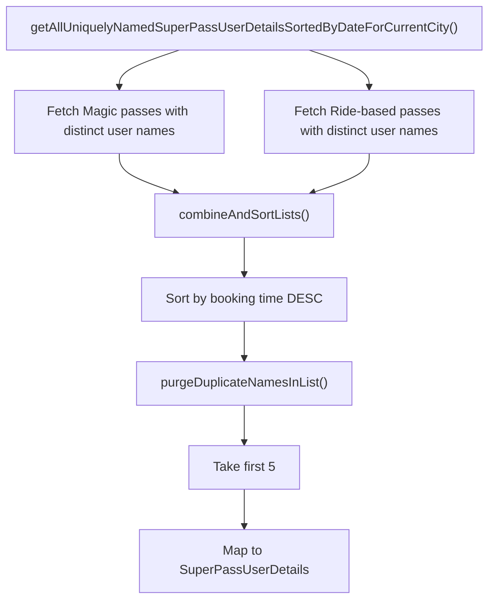
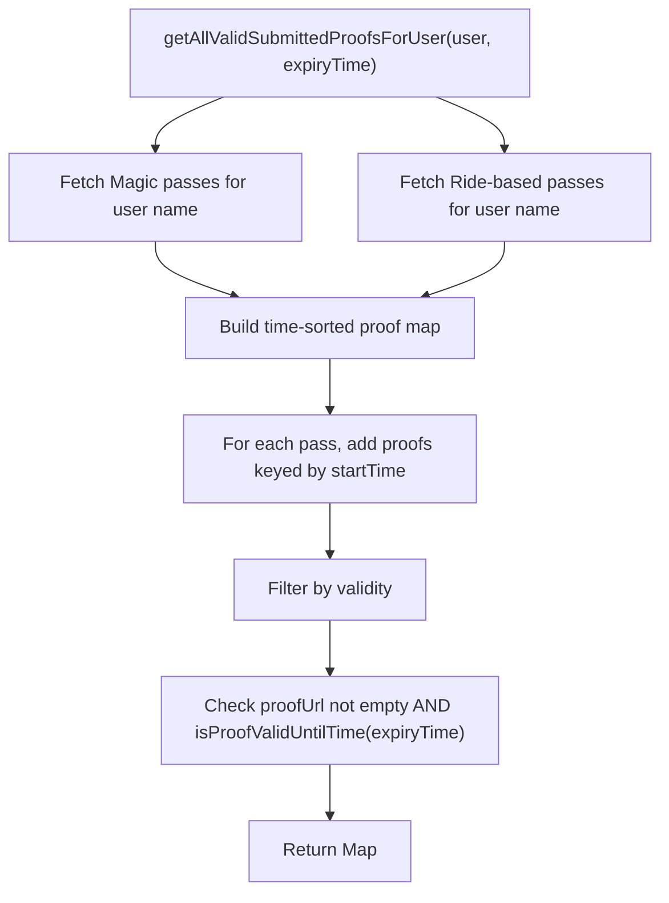
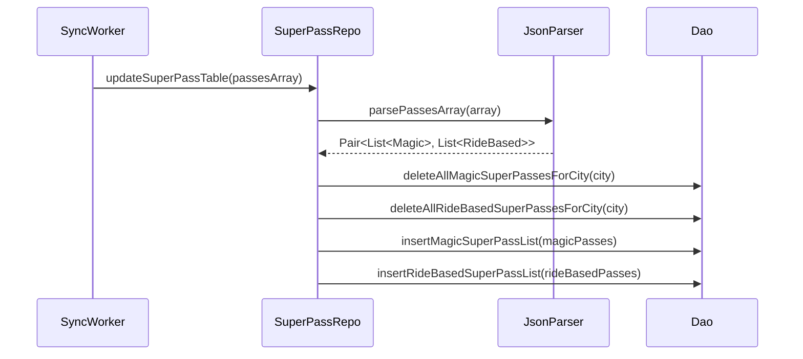
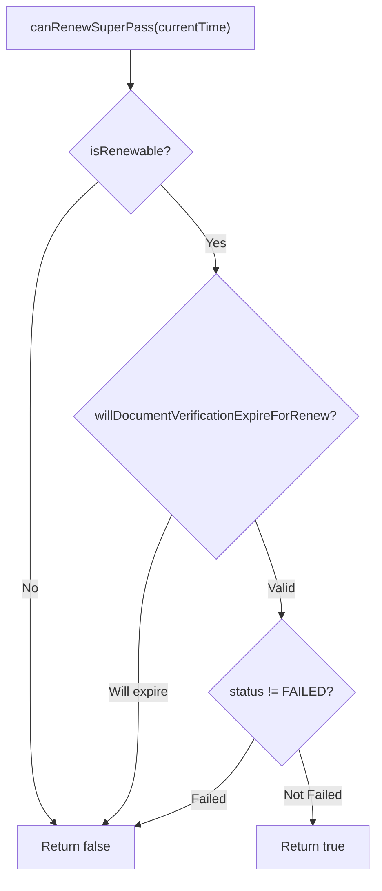

# Super Pass — Repository Documentation

## Overview

The Super Pass data layer manages pass storage, application persistence, proof document handling, and activation tracking. The layer coordinates between remote APIs and local Room/SQLDelight storage, maintaining offline support for active passes while ensuring data synchronization with the backend. Two primary repositories handle different concerns: `SuperPassRepository` manages local pass data and synchronization, while `ProductPurchaseRepository` handles API operations for pass purchase flows.

## Repository Architecture



---

## SuperPassRepository

The primary repository for all Super Pass local data operations, including pass storage, application management, and passenger history lookup.

**File:** `shared/home/src/commonMain/kotlin/app/chalo/superpass/data/repository/SuperPassRepository.kt`

### Constructor Dependencies

| Dependency | Type | Purpose |
|------------|------|---------|
| `passStatusStore` | `LocalDataStore` | Track shown pass update notifications |
| `superPassDao` | `SuperPassDao` | Pass and application persistence |
| `superPassBookingsDao` | `SuperPassBookingsDao` | Booked rides storage |
| `cityProvider` | `CityProvider` | Current city context |
| `systemHelper` | `SystemHelper` | Current time access |
| `coroutineContextProvider` | `CoroutineContextProvider` | Dispatcher management |
| `basicInfoContract` | `BasicInfoContract` | True time and device info |
| `getCityIdsInClusterProductHistoryUseCase` | `GetCityIdsInClusterProductHistoryUseCase` | Multi-city cluster support |

### Key Methods

#### Pass Data Synchronization

| Method | Parameters | Returns | Description |
|--------|------------|---------|-------------|
| `updateSuperPassTable` | `JsonArray?` | `Unit` | Parse and store passes from sync API |
| `updateSuperPassApplicationTable` | `JsonArray?` | `Unit` | Parse and store applications from sync API |
| `updatePendingSuperPassTable` | `JsonArray?` | `Unit` | Parse and store pending transactions |
| `updateSuperPassBookingsTableSynchronously` | `JsonArray?` | `Unit` | Store booked rides data |

#### Pass Retrieval

| Method | Parameters | Returns | Description |
|--------|------------|---------|-------------|
| `getAllMagicSuperPasses` | - | `Flow<List<MagicSuperPass>?>` | Stream of magic passes for current city |
| `getAllRideBasedSuperPasses` | - | `Flow<List<RideBasedSuperPass>?>` | Stream of ride-based passes for current city |
| `getMagicSuperPass` | `passId: String` | `Flow<MagicSuperPass>` | Stream of specific magic pass |
| `getRideBasedSuperPass` | `passId: String` | `Flow<RideBasedSuperPass>` | Stream of specific ride-based pass |
| `getRecentActiveMagicSuperPasses` | - | `Flow<List<MagicSuperPass>?>` | Active magic passes (unused/used, not expired) |
| `getRecentActiveRideBasedSuperPasses` | - | `Flow<List<RideBasedSuperPass>?>` | Active ride-based passes |

#### Pass Insertion

| Method | Parameters | Returns | Description |
|--------|------------|---------|-------------|
| `insertMagicSuperPass` | `MagicSuperPass` | `Unit` | Insert or replace magic pass |
| `insertRideBasedSuperPass` | `RideBasedSuperPass` | `Unit` | Insert or replace ride-based pass |
| `insertSuperPassApplication` | `SuperPassApplication` | `Unit` | Insert pending application |
| `insertOrUpdatePassInPassTable` | `JsonObject?` | `SuperPass?` | Parse JSON and insert appropriate type |

#### Passenger Selection Support

| Method | Description |
|--------|-------------|
| `getAllUniquelyNamedSuperPassUserDetailsSortedByDateForCurrentCity` | Get up to 5 unique passengers from booking history |
| `getAllValidSubmittedProofsForUser` | Get valid proof URLs for a passenger (not expired) |
| `findSuperPassInBookingHistoryFromSelectedConfiguration` | Find renewable pass matching config and user |

### Smart Passenger Selection Flow



The method queries both magic and ride-based pass tables with distinct user names, combines them, sorts by booking time (newest first), removes duplicate names keeping only the most recent, and limits to 5 passengers.

### Valid Proofs Retrieval



### City Cluster Support

The repository supports multi-city clusters where passes purchased in one city can be used in related cities:

```kotlin
private suspend fun getCityCluster(): List<String> {
    val clusterList = getCityIdsInClusterProductHistoryUseCase.invoke(city)
    return clusterList.ifEmpty { listOf(city) }
}
```

All retrieval methods that support history lookup use `getCityCluster()` to query across the cluster.

---

## SuperPassDao

Room/SQLDelight DAO interface for Super Pass database operations.

**File:** `shared/home/src/commonMain/kotlin/app/chalo/superpass/data/dao/SuperPassDao.kt`

### Table Operations

The DAO manages four main tables:

| Table | Entity | Purpose |
|-------|--------|---------|
| `magic_super_pass_table` | `MagicSuperPass` | Unlimited ride passes |
| `ride_based_super_pass_table` | `RideBasedSuperPass` | Limited ride passes |
| `super_pass_application_table` | `SuperPassApplication` | Pending verification applications |
| `pending_super_pass_table` | `PendingSuperPass` | Pending payment transactions |
| `ride_based_super_pass_ride_details_table` | `RideBasedSuperPassRideDetailsRoom` | Ride tracking for ride-based passes |

### Magic Super Pass Operations

| Method | Query Pattern | Description |
|--------|---------------|-------------|
| `insertMagicSuperPass` | `INSERT OR REPLACE` | Upsert magic pass |
| `insertMagicSuperPassList` | `INSERT OR REPLACE` batch | Bulk upsert |
| `getAllMagicSuperPasses` | `SELECT WHERE city ORDER BY booking_time DESC` | City-scoped retrieval |
| `getAllMagicSuperPassesAsFlow` | `SELECT WHERE city IN (:cityIdList)` | Cluster-scoped flow |
| `getMagicSuperPass` | `SELECT WHERE pass_id` | Single pass lookup |
| `getMagicSuperPassCount` | `COUNT(DISTINCT pass_id)` | Pass count for city |
| `getRecentActiveMagicSuperPasses` | Complex filter | Active, valid, limit 5 |
| `doesMagicSuperPassExist` | `EXISTS(SELECT WHERE pass_id)` | Existence check |
| `deleteAllMagicSuperPassesForCity` | `DELETE WHERE city` | City-scoped deletion |
| `deleteAllMagicSuperPasses` | `DELETE` | Clear all |

### Ride-Based Super Pass Operations

| Method | Query Pattern | Description |
|--------|---------------|-------------|
| `insertRideBasedSuperPass` | `INSERT OR REPLACE` | Upsert ride pass |
| `insertRideBasedSuperPassList` | `INSERT OR REPLACE` batch | Bulk upsert |
| `getRideBasedSuperPass` | `SELECT WHERE pass_id` | Single pass lookup |
| `updateRideBasedSuperPass` | `UPDATE SET ride_stamps, activation_ts WHERE pass_id` | Update ride details |
| `updatePremiumRideConsumedForRideBasedPass` | `UPDATE SET premium_rides_consumed WHERE pass_id` | Premium ride tracking |

### Application Operations

| Method | Query Pattern | Description |
|--------|---------------|-------------|
| `insertSuperPassApplication` | `INSERT OR REPLACE` | Upsert application |
| `insertSuperPassApplicationsList` | `INSERT OR REPLACE` batch | Bulk upsert |
| `getAllSuperPassApplications` | `SELECT WHERE city ORDER BY pass_start_date DESC` | Retrieve applications |
| `getAllSuperPassApplicationsAsFlow` | `SELECT WHERE city IN (:cityIdList)` | Cluster-scoped flow |
| `deleteAllSuperPassApplicationsForCity` | `DELETE WHERE city` | City-scoped deletion |

### Smart Selection Queries

| Method | Purpose |
|--------|---------|
| `getAllMagicSuperPassesBookedWithDistinctUserNames` | Get passes with unique passenger names |
| `getAllRideBasedSuperPassesBookedWithDistinctUserNames` | Same for ride-based |
| `getAllMagicSuperPassesBookedWithUserName` | Get all passes for a specific passenger |
| `findMagicSuperPassInBookingHistoryFromSelectedConfiguration` | Find renewable pass matching exact config |

---

## SuperPassBookingsDao

Manages booked ride records from pass activations.

**File:** `shared/home/src/commonMain/kotlin/app/chalo/superpass/data/dao/SuperPassBookingsDao.kt`

### Operations

| Method | Description |
|--------|-------------|
| `insertSuperPassBookings` | Insert batch of booking records |
| `deleteAllSuperPassBookings` | Clear all bookings |
| `updateSuperPassBookingsData` | Transaction: delete all + insert new |
| `getSuperPassBookingsAsFlow` | Stream of all bookings |

---

## Entity Models

### MagicSuperPass

Unlimited ride pass for a fixed duration.

| Property Group | Fields |
|----------------|--------|
| **superPassProperties** | passId, productType, productSubType, cityName, agencyName, qrCode, tone |
| **superPassValidationProperties** | startTime, expiryTime, superPassStatus, rideDetails |
| **superPassUIProperties** | superPassUserDetails, proofs, bookingTime, productName |
| **superPassRepurchaseProperties** | configId, categoryId, fareMappingId |
| **superPassTransactionDetails** | orderId, passPrice, userId, mobileNumber |
| **superPassTripPreferences** | routeIds, stopIds (for route-specific passes) |

### RideBasedSuperPass

Limited ride pass with ride counting.

Extends MagicSuperPass structure with additional:

| Field | Type | Description |
|-------|------|-------------|
| `totalTripsAllotted` | `Int` | Maximum rides allowed |
| `ridesConsumed` | `Int` | Rides used so far |
| `premiumRidesAllotted` | `Int` | Premium bus rides included |
| `premiumRidesConsumed` | `Int` | Premium rides used |

### SuperPassApplication

Pending verification application.

| Field | Type | Description |
|-------|------|-------------|
| `passId` | `String` | Application ID |
| `cityName` | `String` | City of application |
| `agencyName` | `String` | Agency |
| `applicationStatus` | `SuperPassApplicationStatus` | PENDING, APPROVED, REJECTED |
| `passStartDate` | `Long` | Requested start time |
| `passExpiryDate` | `Long` | Expected expiry |
| `actionRequired` | `PassApplicationActionRequired` | FRESH, REAPPLY, PAYMENT |
| `rejectionReasons` | `PassApplicationRejectionReasons?` | If rejected, details |
| **superPassUIProperties** | `SuperPassApplicationUIProperties` | Display data |
| **superPassRepurchaseProperties** | `SuperPassRepurchaseProperties` | Config for repurchase |

### SuperPassUserDetails

Passenger information.

| Field | Type | Description |
|-------|------|-------------|
| `userId` | `String` | User account ID |
| `mobileNumber` | `String` | Phone number |
| `fullName` | `String` | Passenger name |
| `gender` | `Gender` | MALE, FEMALE, OTHER |
| `dateOfBirth` | `String` | DOB string |
| `dobInMillis` | `Long` | DOB timestamp |
| `emailId` | `String` | Email |
| `profilePhoto` | `String` | Photo URL |

---

## Data Synchronization

### Sync Flow



### Synchronous vs Asynchronous Updates

The repository provides both synchronous and asynchronous versions of update methods:

| Async Method | Sync Method | Use Case |
|--------------|-------------|----------|
| `updateSuperPassTable` | `updateSuperPassTableSynchronously` | Background sync vs foreground refresh |
| `updateSuperPassApplicationTable` | `updateSuperPassApplicationTableSynchronously` | Same |
| `updatePendingSuperPassTable` | `updatePendingSuperPassTableSynchronously` | Same |

Async methods use `dispatcherWithExceptionHandler` which combines IO dispatcher with a coroutine exception handler for safe background execution.

---

## Activation Tracking

### Magic Pass Activation

| Method | Parameters | Description |
|--------|------------|-------------|
| `doesMagicSuperPassExist` | `passId` | Check if pass exists |
| `getMagicSuperPassLastActivationTimeStamp` | `passId` | Get last activation time |
| `updateMagicSuperPassLastActivationTimeStamp` | `passId, timestamp` | Record activation |

### Ride-Based Pass Activation

| Method | Parameters | Description |
|--------|------------|-------------|
| `doesRideBasedSuperPassRideDetailsExist` | `passId` | Check if ride details exist |
| `getRideBasedSuperPassRideDetails` | `passId` | Get ride tracking data |
| `createFreshEntryInRideBasedSuperPassRideDetailsRoomPostPurchase` | `passId` | Initialize ride details after purchase |
| `updateRideBasedSuperPassRideDetails` | `punches, isActivationAllowed, passId, activationTs, lastPunchTs` | Update ride state |
| `updatePremiumRideConsumedForRideBasedPass` | `passId, count` | Update premium ride count |

### RideBasedSuperPassRideDetails

| Field | Type | Description |
|-------|------|-------------|
| `previousRideTimeStamps` | `List<Long>` | All punch timestamps |
| `lastActivationTimeStamp` | `Long` | Most recent activation |
| `lastPunchTimeStamp` | `Long` | Most recent punch |
| `isActivationAllowedInCurrentSession` | `Boolean` | Session-level activation gate |

---

## Pass Status Tracking

The repository uses `LocalDataStore` to track which pass status updates have been shown to the user:

| Method | Description |
|--------|-------------|
| `isSuperPassApplicationUpdateShownToUser(passStartDate)` | Check if notification was shown |
| `setSuperPassApplicationUpdateShownToUser(passStartDate)` | Mark notification as shown |

This prevents duplicate notifications for the same application status change.

---

## ProductPurchaseRepository

Handles API operations for the pass purchase flow.

**File:** `shared/home/src/commonMain/kotlin/app/chalo/productpurchase/productselection/data/repository/ProductPurchaseRepository.kt`

### Key Methods for Super Pass

| Method | Parameters | Returns | Description |
|--------|------------|---------|-------------|
| `submitPassApplication` | Request model | `SubmitPassApplicationResponseAppModel` | Submit for verification |
| `createSuperPassOrder` | Request model | `CreateOrderResponseAppModel` | Create payment order |
| `fetchPassCashPaymentInfo` | `userId, passId` | `PassCashPaymentInfoResponseAppModel` | Get cash payment details |

---

## API Contracts

### Submit Pass Application

**Endpoint:** `POST /pass/v2/city/{cityName}/superpass/submission`

**Request Model:**

| Field | Type | Required | Description |
|-------|------|----------|-------------|
| `configId` | `String` | Yes | Pass configuration ID |
| `categoryId` | `String` | Yes | Selected category |
| `fareMappingId` | `Int` | Yes | Selected fare mapping |
| `fullName` | `String` | Yes | Passenger name |
| `dob` | `String` | Yes | Date of birth |
| `gender` | `String` | Yes | Gender |
| `passStartTime` | `Long` | Yes | Requested start timestamp |
| `proofs` | `Map<String, String>` | Yes | Proof ID to URL mapping |
| `isReapplication` | `Boolean?` | No | Resubmission flag |
| `stopsInfo` | `StopsInfoApiModel?` | No | Route stops for route passes |

**Response Model:**

| Field | Type | Description |
|-------|------|-------------|
| `status` | `String` | "true" or "false" |
| `message` | `String?` | Error message if failed |
| `userProfile` | `UserProfileApiModel?` | Updated profile on success |

### Create Super Pass Order

**Endpoint:** `POST /pass/v2/city/{cityName}/superpass/order`

**Request Model:**

| Field | Type | Description |
|-------|------|-------------|
| `city` | `String` | City name |
| `userDetails` | `UserDetailsApiModel` | Passenger info |
| `passProps` | `PassPropsApiModel` | Pass configuration |
| `paymentProps` | `PaymentPropsApiModel` | Payment mode |
| `proofs` | `Map<String, String>?` | Proof URLs if applicable |

**Response Model:**

| Field | Type | Description |
|-------|------|-------------|
| `orderId` | `String` | Created order ID |
| `chaloOrderId` | `String` | Chalo order ID |
| `amount` | `Double` | Total amount |
| `checkoutPayload` | `CheckoutPayloadApiModel` | Payment gateway data |

**Error Codes:**

| Code | Constant | Meaning |
|------|----------|---------|
| `6000` | `ERROR_TYPE_OFFER_ALREADY_AVAILED` | Duplicate pass purchase attempt |
| `8009` | `ERROR_TYPE_PASS_DYNAMIC_FARE_UPDATED` | Fare changed, refresh needed |

---

## Exception Types

| Exception | Source | Handling |
|-----------|--------|----------|
| `PassApplicationSubmissionFailedException` | API returns error | Show error message to user |
| `SuperPassOrderCreationFailedException` | Order API failure | Parse error code, show appropriate message |
| `PassAlreadyAvailedException` | Error code 6000 | Show bottom sheet about duplicate |
| `PassDynamicFareUpdatedException` | Error code 8009 | Navigate back to refresh config |
| `PassCashPaymentInfoFetchFailedException` | Cash payment info API | Show generic error |

---

## SuperPass Status Enums

### SuperPassStatus

**File:** `shared/chalo-base/.../productsync/constants/SuperPassStatus.kt`

Represents the lifecycle status of an issued Super Pass.

| Value | String Representation | Description |
|-------|----------------------|-------------|
| `PAYMENT_FAILED` | "payment_failed" | Payment unsuccessful |
| `PAYMENT_PROCESSING` | "payment_processing" | Payment in progress |
| `UNUSED` | "unused" | Issued but not yet used |
| `USED` | "used" | Has been activated at least once |
| `INACTIVE` | "inactive" | Temporarily deactivated |
| `EXPIRED` | "expired" | Past expiry time |
| `CANCELLED` | "cancelled" | Manually cancelled |
| `FAILED` | "failed" | Issuance failed |

### SuperPassApplicationStatus

**File:** `shared/chalo-base/.../productsync/constants/SuperPassApplicationStatus.kt`

Represents the verification status of a pass application.

| Value | Description | UI Action |
|-------|-------------|-----------|
| `UNVERIFIED` | Application submitted, awaiting review | Show pending status |
| `VERIFIED` | Application approved | Enable payment |
| `REJECTED` | Application rejected with reasons | Show reapply flow |
| `PAYMENT_PENDING` | Verified but payment incomplete | Resume payment flow |

---

## SuperPassValidationProperties

**File:** `shared/home/.../superpass/data/models/entities/SuperPassValidationProperties.kt`

Core validation properties for all Super Pass types.

| Property | Type | Description |
|----------|------|-------------|
| `startTime` | `Long` | Pass validity start timestamp |
| `expiryTime` | `Long` | Pass expiry timestamp |
| `status` | `SuperPassStatus` | Current lifecycle status |
| `activeDuration` | `Long` | Duration (ms) activation remains valid |
| `serviceType` | `List<ProductConfigServiceType>` | Supported service types (REGULAR, PREMIUM) |
| `superPassRideDetails` | `SuperPassRideDetails` | Ride tracking data |

### RideBasedSuperPassValidationProperties

Extended validation for ride-limited passes.

| Property | Type | Description |
|----------|------|-------------|
| `numOfTrips` | `Int` | Total trips allowed (-1 for unlimited) |
| `maxTripsPerDay` | `Int` | Daily trip limit (-1 for unlimited) |
| `premiumRidesConsumed` | `Int` | Premium bus rides used |

---

## SuperPassRepurchaseProperties

**File:** `shared/home/.../superpass/data/models/entities/SuperPassRepurchaseProperties.kt`

Properties for determining renewal eligibility.

| Property | Type | Description |
|----------|------|-------------|
| `configId` | `String` | Original configuration ID |
| `categoryId` | `String` | Original category ID |
| `fareMappingId` | `Int` | Original fare mapping ID |
| `isRenewable` | `Boolean` | Whether renewal is allowed |
| `verificationFlag` | `Boolean` | Whether verification is required |
| `documentVerificationExpiryTime` | `Long` | When proof documents expire |

### Renewal Eligibility Check



---

## JSON Parsing

### SuperPassJsonParser

Static utility for parsing pass JSON from sync responses.

| Method | Input | Output |
|--------|-------|--------|
| `parsePassesArray` | `JsonArray` | `Pair<List<MagicSuperPass>, List<RideBasedSuperPass>>` |
| `parseSinglePass` | `JsonObject` | `Pair<MagicSuperPass?, RideBasedSuperPass?>` |
| `parsePassApplicationsArray` | `JsonArray` | `List<SuperPassApplication>` |
| `parseRecentTransactionsArray` | `JsonArray` | `List<PendingSuperPass>` |
| `parseSuperPassBookedRidesArray` | `JsonArray` | `List<SuperPassRideBookingAppModel>?` |

The parser determines pass type from `productSubType`:
- `SUBTYPE_MAGIC_PASS` -> `MagicSuperPass`
- `SUBTYPE_RIDE_PASS` -> `RideBasedSuperPass`

---

## Offline Support

| Operation | Offline Support | Notes |
|-----------|-----------------|-------|
| View active passes | Full | Complete local access |
| View pass applications | Full | Local cache |
| Activate pass | Full | Local timestamp update |
| Count rides | Full | Local increment |
| Submit application | No | Requires connectivity |
| Create order | No | Requires connectivity |
| Sync pass data | No | Requires connectivity |

### Local Data Persistence

All pass data is persisted in Room/SQLDelight databases, allowing full offline access to:
- Active passes for display and activation
- Pending applications for status tracking
- Booking history for passenger selection
- Ride details for ride counting

---

## Dependency Injection

### Module Bindings (Koin)

| Interface/Class | Scope | Dependencies |
|-----------------|-------|--------------|
| `SuperPassDao` | Singleton | Database |
| `SuperPassBookingsDao` | Singleton | Database |
| `SuperPassRepository` | Singleton | DAOs, CityProvider, SystemHelper, etc. |
| `ProductPurchaseRepository` | Singleton | API service, NetworkClient |

### Repository Initialization

```kotlin
single {
    SuperPassRepository(
        passStatusStore = get(named(PASS_STATUS_STORE)),
        superPassDao = get(),
        superPassBookingsDao = get(),
        cityProvider = get(),
        systemHelper = get(),
        coroutineContextProvider = get(),
        basicInfoContract = get(),
        getCityIdsInClusterProductHistoryUseCase = get()
    )
}
```
