# Super Pass — UseCase Documentation

## Domain Layer Overview

The Super Pass domain layer orchestrates business logic for pass configuration lookup, application submission, order creation, verification tracking, and pass lifecycle management. Use cases coordinate between presentation components and data repositories, enforcing validation rules, managing pass state transitions, and handling the complex workflow from initial application through verification to final activation.

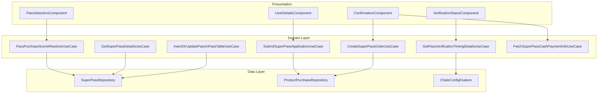

---

## UseCase Inventory

| UseCase | File Path | Purpose |
|---------|-----------|---------|
| **PassPurchaseSceneResolverUseCase** | `.../passpurchase/domain/PassPurchaseSceneResolverUseCase.kt` | Determine purchase flow navigation |
| **SubmitSuperPassApplicationUseCase** | `.../passpurchase/domain/SubmitSuperPassApplicationUseCase.kt` | Submit pass application for verification |
| **CreateSuperPassOrderUseCase** | `.../passpurchase/domain/CreateSuperPassOrderUseCase.kt` | Create payment order |
| **GetPassVerificationTimingDetailsUseCase** | `.../passpurchase/domain/GetPassVerificationTimingDetailsUseCase.kt` | Get verification timing info |
| **GetSuperPassDetailsUseCase** | `.../superpass/domain/GetSuperPassDetailsUseCase.kt` | Retrieve pass details |
| **InsertOrUpdatePassInPassTableUseCase** | `.../superpass/domain/InsertOrUpdatePassInPassTableUseCase.kt` | Persist pass data locally |
| **FetchSuperPassCashPaymentInfoUseCase** | `.../passpurchase/domain/FetchSuperPassCashPaymentInfoUseCase.kt` | Get cash payment details |

---

## PassPurchaseSceneResolverUseCase

Determines the correct entry point and navigation flow for Super Pass purchase based on user history, pass configuration, and proof requirements.

### Responsibility

Analyzes the selected pass configuration and user's existing pass history to determine whether to show passenger selection, user details entry, or direct confirmation. Handles multiple flow types including fresh purchase, renewal, reapplication after rejection, and post-verification payment.

### Flow Diagram

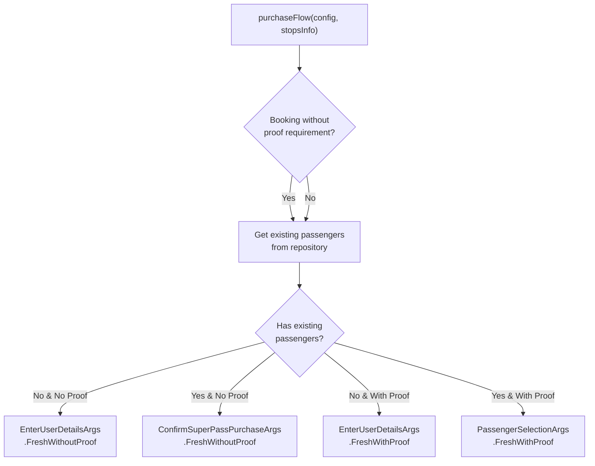

### Method Signatures

**purchaseFlow**

| Parameter | Type | Description |
|-----------|------|-------------|
| **lSource** | Source | Navigation source for analytics |
| **lBookableSuperPassConfiguration** | BookableSuperPassConfiguration | Selected pass config |
| **superPassPurchaseStopsInfo** | SuperPassPurchaseStopsInfo? | Route-specific stops |
| **postPurchaseSuccessFlowType** | PostPassPurchaseSuccessFlowType | Post-success behavior |
| **isPremiumPassLandingFlow** | Boolean | Premium pass flag |

**Returns:** `SuperPassPurchaseArgs` - Navigation args for the appropriate screen

### Flow Resolution Logic

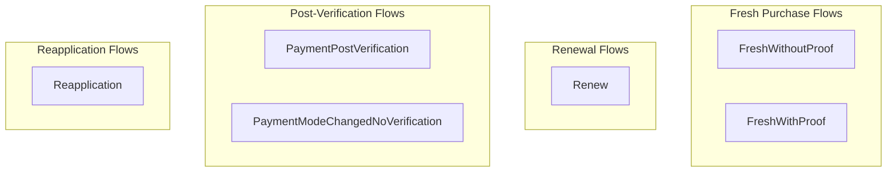

### Additional Methods

**paymentPostVerificationFlow**

Handles payment flow after application has been verified.

| Parameter | Type | Description |
|-----------|------|-------------|
| **lSource** | Source | Navigation source |
| **lBookableSuperPassConfiguration** | BookableSuperPassConfiguration | Pass config |
| **lSuperPassApplication** | SuperPassApplication | Verified application |

**launchReapplicationFlow**

Handles flow when user needs to resubmit after rejection.

| Parameter | Type | Description |
|-----------|------|-------------|
| **lSource** | Source | Navigation source |
| **lBookableSuperPassConfiguration** | BookableSuperPassConfiguration | Pass config |
| **lSuperPassApplication** | SuperPassApplication | Rejected application |

**launchRenewFlow**

Handles pass renewal for existing verified passes.

| Parameter | Type | Description |
|-----------|------|-------------|
| **lSource** | Source | Navigation source |
| **lBookableSuperPassConfiguration** | BookableSuperPassConfiguration | Pass config |
| **lSuperPass** | SuperPass | Pass to renew |

### Notification Handling

**fromPassApplicationUpdateNotification**

Processes push notifications about application status changes and returns appropriate navigation.

| Status | Notification ID | Screen |
|--------|-----------------|--------|
| **VERIFIED** | NOTIFICATION_ID_PASS_VERIFIED | PaymentPostVerification screen |
| **REJECTED** | NOTIFICATION_ID_PASS_REJECTED | Reapplication screen |
| **UNVERIFIED/PAYMENT_PENDING** | NOTIFICATION_ID_PASS_STATUS_UNKNOWN | Home screen |

---

## SubmitSuperPassApplicationUseCase

Submits a Super Pass application with user details and proof documents to the backend for verification.

### Responsibility

Validates and submits the complete application including user details, pass configuration, start time, and uploaded proof documents. Handles both fresh applications and reapplication flows.

### Flow Diagram

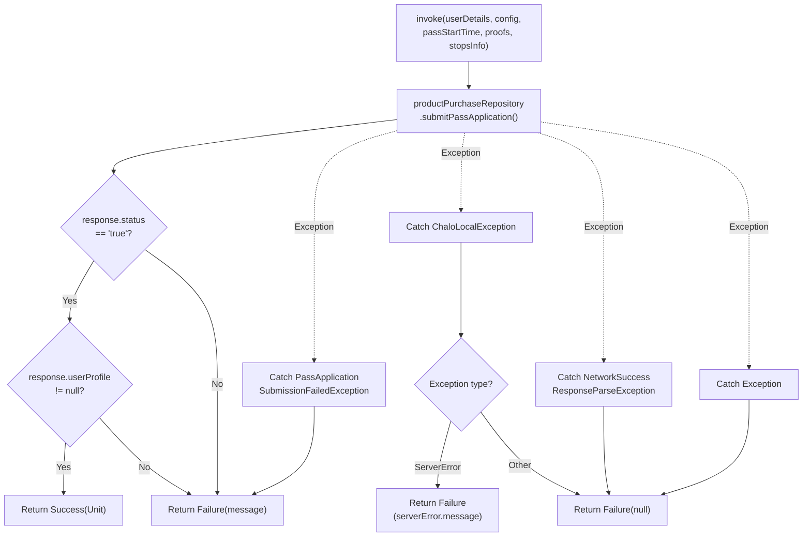

### Method Signature

| Parameter | Type | Description |
|-----------|------|-------------|
| **superPassUserDetails** | SuperPassUserDetails | User information |
| **bookableSuperPassConfiguration** | BookableSuperPassConfiguration | Selected pass |
| **passStartTime** | Long | Pass validity start timestamp |
| **uploadedProofsMap** | Map<String, String> | Proof ID to URL mapping |
| **superPassPurchaseStopsInfo** | SuperPassPurchaseStopsInfo? | Route stops |
| **isReapplicationFlow** | Boolean? | Resubmission flag |

**Returns:** `ChaloUseCaseResult<Unit, String?>` - Success or failure with optional error message

### Error Handling

| Exception | Resolution |
|-----------|------------|
| **PassApplicationSubmissionFailedException** | Return failure with exception message |
| **ChaloLocalException.ServerErrorException** | Return failure with server error message |
| **ChaloLocalException.NoInternetException** | Return failure with null |
| **NetworkSuccessResponseParseException** | Return failure with null |
| **Generic Exception** | Return failure with null |

---

## CreateSuperPassOrderUseCase

Creates a payment order for a Super Pass purchase, preparing the checkout payload with all necessary details.

### Responsibility

Builds the order request with user details, pass properties, payment information, and proof documents. Calculates pricing and creates the order through the repository.

### Flow Diagram

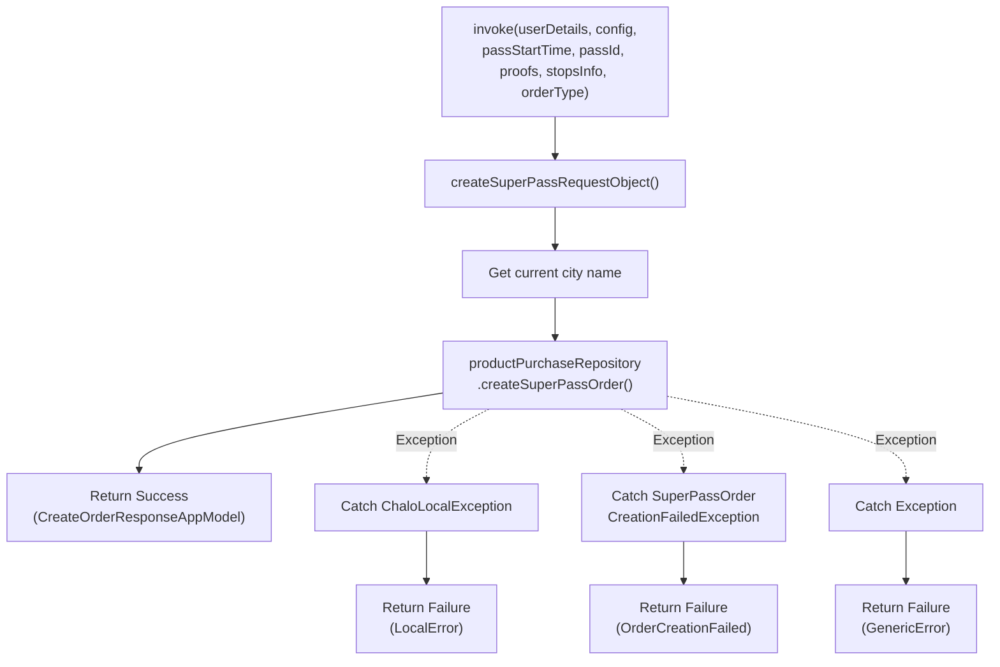

### Method Signature

| Parameter | Type | Description |
|-----------|------|-------------|
| **lSuperPassUserDetails** | SuperPassUserDetails | User information |
| **lBookableSuperPassConfiguration** | BookableSuperPassConfiguration | Selected pass |
| **lPassStartTime** | Long | Pass validity start |
| **lPassId** | String? | For renewals, existing pass ID |
| **lUploadedProofsMap** | Map<String, String>? | Proof URLs |
| **superPassPurchaseStopsInfo** | SuperPassPurchaseStopsInfo? | Route stops |
| **superPassOrderType** | SuperPassOrderType | Order type enum |

**Returns:** `ChaloUseCaseResult<CreateOrderResponseAppModel, SuperPassOrderCreationError>`

### Order Types

| Type | Description | Proofs Included |
|------|-------------|-----------------|
| **WITHOUT_VERIFICATION** | Fresh purchase with proofs | Yes |
| **POST_VERIFICATION** | Payment after verification | No |
| **RENEW** | Pass renewal | No |

### Request Structure

**CreateSuperPassOrderRequestApiModel**

| Field | Source |
|-------|--------|
| **city** | CityProvider.getCurrentCityName() |
| **userDetails** | SuperPassUserDetails conversion |
| **passProps** | BookableSuperPassConfiguration |
| **paymentProps** | Fixed "online" mode |
| **proofs** | Conditional based on order type |

### Error Types

| Error | Code | Description |
|-------|------|-------------|
| **LocalError** | - | Network or local issues |
| **OrderCreationFailed** | errorCode | Server rejected order |
| **GenericError** | - | Unexpected exceptions |

**Known Error Codes:**

| Code | Constant | Meaning |
|------|----------|---------|
| 6000 | ERROR_TYPE_OFFER_ALREADY_AVAILED | User already has this pass |
| 8009 | ERROR_TYPE_PASS_DYNAMIC_FARE_UPDATED | Price changed, refresh needed |

---

## GetPassVerificationTimingDetailsUseCase

Retrieves verification timing information from Firebase Remote Config based on the user's city.

### Responsibility

Fetches city-specific or default verification timing details including expected duration and office hours. Returns default values if configuration is unavailable.

### Flow Diagram

```mermaid
flowchart TD
    Start["invoke()"]

    GetConfig["chaloConfigFeature.getStringAsync<br/>(KEY_PASS_APPLICATION_VERIFICATION_TIMINGS)"]

    CheckEmpty{Config string<br/>empty?}
    ReturnDefault1["Return default<br/>MPassVerificationTimingDetails"]

    ParseConfig["Parse JSON to<br/>Map<String, TimingDetails>"]

    GetCity["Get current city name<br/>(lowercase)"]

    CheckCityConfig{City config<br/>exists?}
    ReturnCityConfig["Return city-specific config"]

    CheckAllConfig{\"all\" config<br/>exists?}
    ReturnAllConfig["Return \"all\" config"]
    ReturnDefault2["Return default<br/>MPassVerificationTimingDetails"]

    CatchException["Catch Exception"]
    ReturnDefault3["Return default<br/>MPassVerificationTimingDetails"]

    Start --> GetConfig
    GetConfig --> CheckEmpty
    CheckEmpty -->|Yes| ReturnDefault1
    CheckEmpty -->|No| ParseConfig

    ParseConfig --> GetCity
    GetCity --> CheckCityConfig
    CheckCityConfig -->|Yes| ReturnCityConfig
    CheckCityConfig -->|No| CheckAllConfig

    CheckAllConfig -->|Yes| ReturnAllConfig
    CheckAllConfig -->|No| ReturnDefault2

    GetConfig -.->|Exception| CatchException
    CatchException --> ReturnDefault3
```

### Method Signature

**Returns:** `MPassVerificationTimingDetails`

### Response Model

**MPassVerificationTimingDetails**

| Field | JSON Key | Type | Description |
|-------|----------|------|-------------|
| **verificationTimeRequired** | timeReq | String | "24-48 hours" text |
| **verificationOfficeTimings** | officeTimings | String | "9 AM - 6 PM" text |

### Config Structure

The Firebase Remote Config value is a JSON map keyed by city name:

```json
{
  "mumbai": {
    "timeReq": "24-48 hours",
    "officeTimings": "9 AM to 6 PM, Mon-Sat"
  },
  "all": {
    "timeReq": "48-72 hours",
    "officeTimings": "9 AM to 5 PM, Mon-Fri"
  }
}
```

---

## GetSuperPassDetailsUseCase

Retrieves detailed Super Pass information from the repository based on product type.

**File:** `shared/home/.../superpass/domain/GetSuperPassDetailsUseCase.kt`

### Responsibility

Routes the pass retrieval request to the appropriate repository method based on the checkout product type, returning the correct Super Pass subtype.

### Flow Diagram

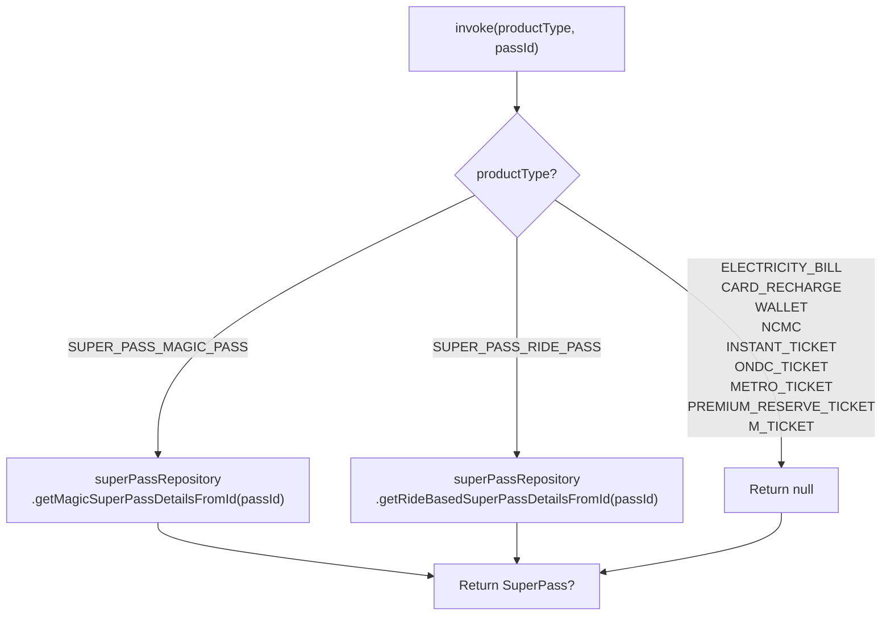

### Method Signature

| Parameter | Type | Description |
|-----------|------|-------------|
| **productType** | `CheckoutProductType` | Type of product to retrieve |
| **passId** | `String` | Unique pass identifier |

**Returns:** `SuperPass?` - The pass details or null if not found or not applicable

### Supported Product Types

| CheckoutProductType | Repository Method | Return Type |
|---------------------|-------------------|-------------|
| `SUPER_PASS_MAGIC_PASS` | `getMagicSuperPassDetailsFromId()` | `MagicSuperPass?` |
| `SUPER_PASS_RIDE_PASS` | `getRideBasedSuperPassDetailsFromId()` | `RideBasedSuperPass?` |
| All other types | N/A | `null` |

---

## FetchSuperPassCashPaymentInfoUseCase

Fetches cash payment details for a Super Pass order after cash payment is selected at checkout.

**File:** `shared/home/.../passpurchase/domain/FetchSuperPassCashPaymentInfoUseCase.kt`

### Responsibility

Retrieves cash payment instructions and details from the backend after a user selects cash as the payment mode. This information is used to display payment instructions and track the pending cash payment.

### Flow Diagram

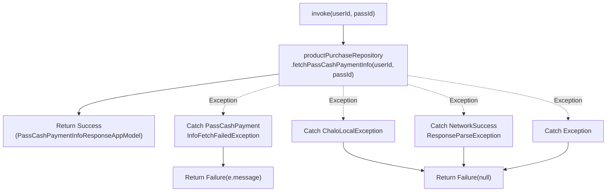

### Method Signature

| Parameter | Type | Description |
|-----------|------|-------------|
| **userId** | `String` | User identifier |
| **passId** | `String` | Pass order identifier |

**Returns:** `ChaloUseCaseResult<PassCashPaymentInfoResponseAppModel, String?>` - Cash payment info or failure

### Error Handling

| Exception | Resolution |
|-----------|------------|
| `PassCashPaymentInfoFetchFailedException` | Return failure with exception message |
| `ChaloLocalException` | Return failure with null |
| `NetworkSuccessResponseParseException` | Return failure with null |
| `Exception` | Return failure with null |

---

## InsertOrUpdatePassInPassTableUseCase

Persists Super Pass data to local storage after purchase or sync.

**File:** `shared/home/.../superpass/domain/InsertOrUpdatePassInPassTableUseCase.kt`

### Responsibility

Parses pass data from JSON and inserts or updates the appropriate pass table (MagicSuperPass or RideBasedSuperPass) based on pass subtype. Used after successful purchase to immediately persist the new pass locally.

---

## Domain Models

### SuperPass (Base Class)

The base class for all Super Pass types with core properties and behavior.

**File:** `shared/home/.../superpass/data/models/entities/SuperPass.kt`

| Property | Type | Description |
|----------|------|-------------|
| **superPassProperties** | SuperPassProperties | Core identifiers |
| **superPassValidationProperties** | SuperPassValidationProperties | Validity and activation |
| **superPassUIProperties** | SuperPassUIProperties | Display information |
| **superPassRepurchaseProperties** | SuperPassRepurchaseProperties | Renewal configuration |
| **superPassTransactionDetails** | SuperPassTransactionDetails | Payment info |
| **superPassTripPreferences** | SuperPassTripPreferences | Route preferences |

**Key Methods:**

| Method | Description |
|--------|-------------|
| **isExpired(currentTrueTime)** | Check if pass has expired |
| **canActivate(currentTrueTime)** | Check if pass can be activated |
| **isSuperPassActivationValid(currentTrueTime)** | Validate current activation |
| **canBookAgain(currentTrueTime)** | Check if user can purchase again |
| **canRenewSuperPass(currentTrueTime)** | Check renewal eligibility |
| **isPremiumBusPass()** | Check if premium bus service |
| **saveActivationTimeStamp(timestamp)** | Persist activation time to DataStore |
| **getLastActivationTimeStamp()** | Retrieve last activation time from DataStore |
| **removeActivationBecauseTITOTapInDetectedOnConductorValidationIfNeeded()** | Clear activation if TITO validation detected |

### Activation Timestamp Management

The `SuperPass` class uses a companion object `SuperPassActivationTimestampMapHelper` to manage activation timestamps in a dedicated DataStore.

**DataStore Name:** `superPassActivationTimestampsMap.preferences_pb`

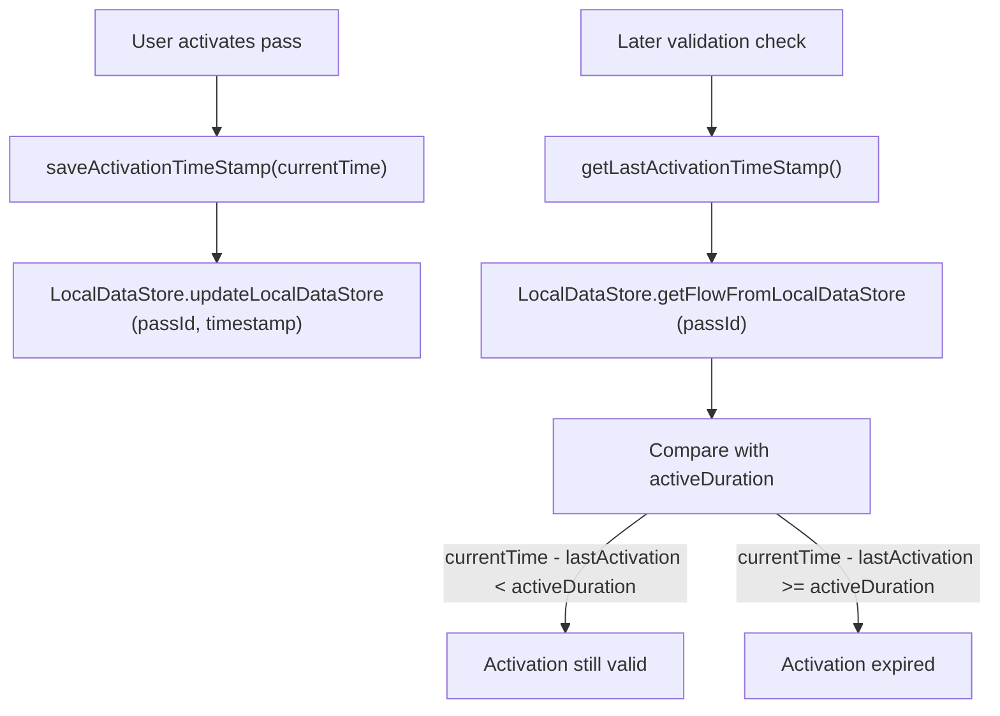

### MagicSuperPass

Unlimited ride pass with no trip counting.

**File:** `shared/home/.../superpass/data/models/entities/MagicSuperPass.kt`

Inherits all properties from SuperPass with no additional fields.

### RideBasedSuperPass

Limited trip pass with daily and total limits.

**File:** `shared/home/.../superpass/data/models/entities/RideBasedSuperPass.kt`

| Property | Type | Description |
|----------|------|-------------|
| **superPassValidationProperties** | RideBasedSuperPassValidationProperties | Extended with trip limits |
| **superPassUIProperties** | RideBasedSuperPassUIProperties | Extended UI props |

**Key Methods:**

| Method | Description |
|--------|-------------|
| **getRemainingTotalTrips()** | Calculate total remaining trips |
| **hasExhaustedTotalTrips()** | Check if all trips used |
| **getRemainingTripsForToday()** | Calculate today's remaining |
| **isRideAvailableToday()** | Check if can ride today |

### Ride Counting Logic

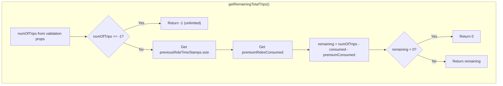

```mermaid
flowchart TD
    subgraph DailyTrips["getRemainingTripsForToday()"]
        GetMax["maxTripsPerDay from validation props"]
        CheckDailyUnlim{maxTripsPerDay == -1?}
        ReturnDailyUnlim["Return -1 (unlimited)"]

        InitRemain["remaining = maxTripsPerDay"]
        IterPunches["For each punch in previousRideTimeStamps"]
        CheckToday{isToday(punchTime)?}
        Decrement["remaining--"]
        CheckZero{remaining == 0?}
        Break["Break loop"]
        Continue["Continue loop"]
        ReturnDaily["Return remaining"]
    end

    GetMax --> CheckDailyUnlim
    CheckDailyUnlim -->|Yes| ReturnDailyUnlim
    CheckDailyUnlim -->|No| InitRemain
    InitRemain --> IterPunches
    IterPunches --> CheckToday
    CheckToday -->|Yes| Decrement
    CheckToday -->|No| Continue
    Decrement --> CheckZero
    CheckZero -->|Yes| Break
    CheckZero -->|No| Continue
    Continue --> IterPunches
    Break --> ReturnDaily
```

### SuperPassTripPreferences

Route-specific preferences for passes tied to specific routes/stops.

**File:** `shared/home/.../superpass/data/models/entities/RideBasedSuperPass.kt`

| Property | Type | Description |
|----------|------|-------------|
| **routeId** | `String?` | Specific route ID |
| **startStopId** | `String?` | Origin stop ID |
| **startStopName** | `String?` | Origin stop name |
| **endStopId** | `String?` | Destination stop ID |
| **endStopName** | `String?` | Destination stop name |

The `toPBOriginDestinationAppModel()` method converts these preferences to a format usable by Premium Bus booking flows.

### SuperPassApplication

Application in progress through verification workflow.

**File:** `shared/home/.../superpass/data/models/entities/SuperPassApplication.kt`

| Property | Type | Description |
|----------|------|-------------|
| **cityName** | String | Application city |
| **agencyName** | String | Transit agency |
| **configId** | String | Pass configuration |
| **categoryId** | String | Selected category |
| **fareMappingId** | Int | Selected fare mapping |
| **fareMappingDisplayName** | String | Duration display name |
| **passName** | String | Pass display name |
| **passStartDate** | Long | Requested start time |
| **verificationExpiryTime** | Long | When verification expires |
| **superPassUserDetails** | SuperPassUserDetails | User information |
| **superPassApplicationStatus** | SuperPassApplicationStatus | Current status |
| **proofs** | Map<String, SuperPassProofProperties> | Uploaded documents |
| **cashPaymentPendingTransactionDetails** | CashPaymentPendingTransactionDetails? | Cash payment info |
| **passApplicationRejectionReasons** | PassApplicationRejectionReasons? | If rejected |
| **passApplicationActionRequired** | PassApplicationActionRequired? | Required actions |
| **refundInfo** | RefundInfoEntityModel? | Refund details |

### SuperPassUserDetails

User information for pass application.

**File:** `shared/home/.../superpass/data/models/entities/SuperPassUserDetails.kt`

| Property | Type | Description |
|----------|------|-------------|
| **userId** | String | User identifier |
| **mobileNumber** | String | Phone number |
| **fullName** | String | Passenger name |
| **gender** | Gender | MALE, FEMALE, OTHER |
| **dateOfBirth** | String | DOB string format |
| **emailId** | String | Email address |
| **profilePhoto** | String | Photo URL |
| **dobInMillis** | Long | DOB timestamp |

### PassApplicationRejectionReasons

Details about why an application was rejected.

**File:** `shared/home/.../superpass/data/models/entities/PassApplicationRejectionReasons.kt`

| Property | Type | Description |
|----------|------|-------------|
| **profileRejectionReason** | ProfileRejectionReason? | Profile photo issues |
| **proofRejectionReasons** | List<ProofRejectionReason>? | Document issues |

### ProofRejectionReason

Specific document rejection details.

**File:** `shared/home/.../superpass/data/models/entities/ProofRejectionReason.kt`

| Property | Type | Description |
|----------|------|-------------|
| **proofId** | String | Which document |
| **proofName** | String | Document type name |
| **rejectionReason** | String | Why rejected |

### SuperPassProofProperties

Properties for a single uploaded proof document.

| Property | Type | Description |
|----------|------|-------------|
| **proofName** | String | Display name of proof type |
| **proofUrl** | String | Uploaded document URL |

### ProofDocumentProps

Configuration for a required proof document type.

**File:** `shared/home/.../superpass/data/models/app/ProofDocumentProps.kt`

| Property | Type | Description |
|----------|------|-------------|
| **proofId** | String | Unique identifier |
| **proofName** | String | Display name (e.g., "Student ID Card") |
| **proofDesc** | String? | Capture instructions |
| **placeholderUrl** | String? | Sample document image |
| **tutorialUrl** | String? | Help video URL |
| **validityInDays** | Int? | How long proof remains valid |

### CashPaymentPendingTransactionDetails

Details for pending cash payment transactions.

| Property | Type | Description |
|----------|------|-------------|
| **transactionId** | String | Transaction identifier |
| **amount** | Double | Amount to pay |
| **paymentInstructions** | String? | Instructions for user |

### PassApplicationActionRequired

Enum indicating required action on an application.

| Value | Description | UI Action |
|-------|-------------|-----------|
| `FRESH` | New application | Start fresh flow |
| `REAPPLY` | Resubmit after rejection | Show rejection reasons, allow edits |
| `PAYMENT` | Complete payment | Show payment options |

---

## Application Status Values

| Status | Description | UI Display |
|--------|-------------|------------|
| **UNVERIFIED** | Application submitted, pending review | "Under Review" |
| **VERIFIED** | Approved, ready for payment | "Verified - Pay Now" |
| **REJECTED** | Issues found, resubmission needed | "Action Required" |
| **PAYMENT_PENDING** | Verified but payment not complete | "Complete Payment" |

---

## Business Rules

| Rule | Enforcement | UseCase |
|------|-------------|---------|
| **One active pass per type** | Check existing passes before purchase | PassPurchaseSceneResolverUseCase |
| **Verification before activation** | Status must be VERIFIED | CreateSuperPassOrderUseCase |
| **Proof requirements** | Config determines required proofs | SubmitSuperPassApplicationUseCase |
| **Daily trip reset** | Reset at midnight local time | RideBasedSuperPass.getRemainingTripsForToday() |
| **Verification expiry** | Applications expire after deadline | SuperPassApplication.verificationExpiryTime |
| **Renewal eligibility** | Proofs must not expire for renewal | SuperPass.canRenewSuperPass() |

---

## Sequence Diagrams

### Pass Purchase Flow (With Proofs)

```mermaid
sequenceDiagram
    participant User
    participant Selection as PassSelectionComponent
    participant Resolver as PassPurchaseSceneResolverUseCase
    participant Details as UserDetailsComponent
    participant Proof as ProofOverviewComponent
    participant Submit as SubmitSuperPassApplicationUseCase
    participant Confirm as ConfirmationComponent
    participant Order as CreateSuperPassOrderUseCase
    participant Verify as VerificationStatusComponent

    User->>Selection: Select pass
    Selection->>Resolver: purchaseFlow(config)
    Resolver->>Resolver: Check existing passengers
    Resolver-->>Selection: EnterUserDetailsArgs.FreshWithProof

    Selection->>Details: Navigate
    User->>Details: Enter details
    Details->>Proof: Navigate with details

    User->>Proof: Upload proofs
    Proof->>Confirm: Navigate with proofs

    User->>Confirm: Tap Pay
    Confirm->>Submit: invoke(details, proofs)
    Submit-->>Confirm: Success

    Confirm->>Order: invoke(details, config)
    Order-->>Confirm: CreateOrderResponse

    Confirm->>Checkout: Initiate payment
    Checkout-->>Confirm: Payment success

    Confirm->>Verify: Navigate
    Verify->>User: Show verification status
```

### Renewal Flow

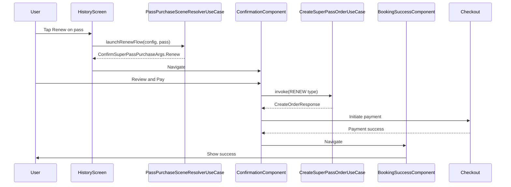

### Rejection and Reapplication Flow

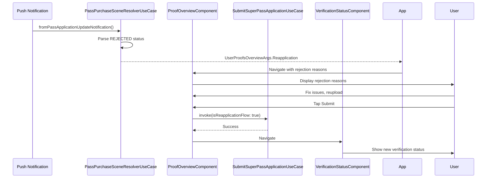

---

## Error Handling Summary

| Error | Source | UseCase | Recovery |
|-------|--------|---------|----------|
| **Network error** | API call | Any | Show error, allow retry |
| **Server error (500)** | Backend | SubmitSuperPassApplicationUseCase | Show server message |
| **Pass already availed** | Order creation | CreateSuperPassOrderUseCase | Show bottom sheet |
| **Fare updated** | Order creation | CreateSuperPassOrderUseCase | Refresh config, retry |
| **Config parse error** | Firebase | GetPassVerificationTimingDetailsUseCase | Use defaults |
| **Application expired** | Status check | - | Show expired message |
| **Cash payment info failure** | Cash payment API | FetchSuperPassCashPaymentInfoUseCase | Show generic error |
| **Pass not found** | Local DB | GetSuperPassDetailsUseCase | Return null, handle gracefully |

---

## ChaloUseCaseResult Pattern

All Super Pass use cases follow the `ChaloUseCaseResult` sealed class pattern for consistent error handling.

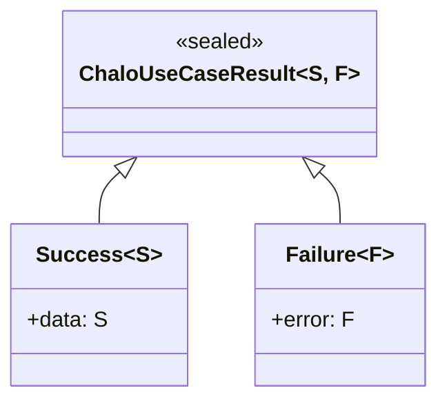

### Usage Pattern in ViewModels

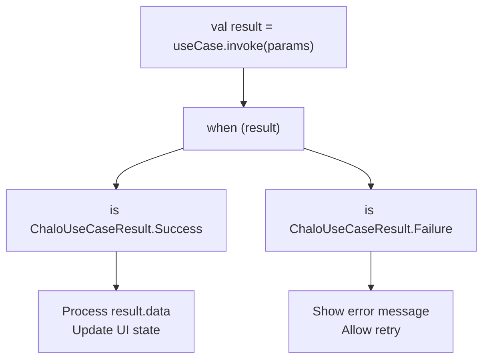

---

## SuperPassOrderCreationError

Sealed class for order creation error types.

| Type | Properties | Handling |
|------|------------|----------|
| `LocalError` | None | Show network error message |
| `OrderCreationFailed` | `errorCode: Int?`, `errorMessage: String?` | Parse code, show specific message |
| `GenericError` | None | Show generic error message |

### Error Code Handling

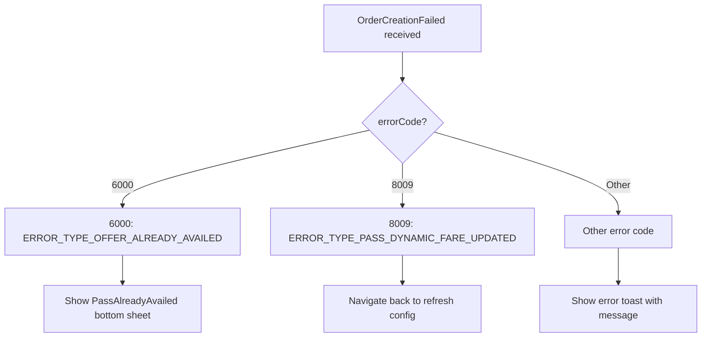
