# Trip Planner — Component Documentation

## Architecture Overview

The Trip Planner feature implements a comprehensive multi-modal journey planning system using the **Decompose + MVI** architectural pattern. The feature provides two distinct flows: a location-based trip planner accessed through the main results screen, and a stop-focused trip planner optimized for stop-to-stop searches with live arrival data.

The architecture separates concerns through dedicated components for each screen variant, with shared domain logic for processing itineraries and managing real-time ETA updates. Both flows integrate with the CRTS (Chalo Real-Time System) for live bus tracking.

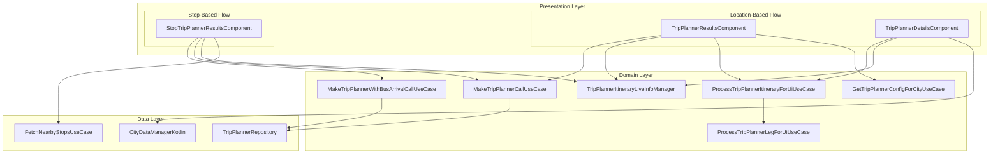

---

## Component Inventory

| Component | File Path | Purpose |
|-----------|-----------|---------|
| **TripPlannerResultsComponent** | `ui/result/TripPlannerResultsComponent.kt` | Location-based trip search and results display |
| **TripPlannerDetailsComponent** | `ui/details/TripPlannerDetailsComponent.kt` | Itinerary breakdown with map and leg details |
| **StopTripPlannerResultsComponent** | `stoptripplannerresult/StopTripPlannerResultsComponent.kt` | Stop-based trip search with live arrivals |

---

## TripPlannerResultsComponent

The primary component for location-based trip planning. It manages search state, tab filtering, recent trips, and coordinates with the `TripPlannerItineraryLiveInfoManager` for real-time updates.

### Component Dependencies

| Dependency | Type | Purpose |
|------------|------|---------|
| **MakeTripPlannerCallUseCase** | Use Case | Execute trip search API |
| **TripPlannerItineraryLiveInfoManager** | Manager | Real-time ETA and seat availability |
| **ProcessTripPlannerItineraryForUiUseCase** | Use Case | Transform API models to UI models |
| **GetTripPlannerConfigForCityUseCase** | Use Case | City-specific configuration |
| **AnalyticsContract** | Contract | Event tracking |
| **ChaloNavigationManager** | Navigation | Screen transitions |
| **BasicInfoContract** | Contract | Time and device info |

### State Model (TripPlannerResultsState)

| Field | Type | Description |
|-------|------|-------------|
| **fromName** | `String?` | Origin location display name |
| **toName** | `String?` | Destination location display name |
| **timeSelectedString** | `String?` | Formatted departure time |
| **dateSelectedString** | `String?` | Formatted departure date |
| **searchSectionType** | `SearchFieldSectionType?` | Current search section mode |
| **isProceedBtnEnabled** | `Boolean` | Proceed button enabled state |
| **resultSectionType** | `TripPlannerResultSectionType` | RECENT, LOADING, RESULT, or ERROR |
| **errorMsg** | `String?` | Error message for display |
| **itinerariesResult** | `List<TripPlannerItineraryUiModel>?` | Filtered search results |
| **recentTripsList** | `List<RecentTripAppModel>?` | Recent trip shortcuts |
| **dialogType** | `TripPlannerResultDialogType?` | Date/time picker dialog type |
| **tabsList** | `List<TripPlannerTabType>` | Available filter tabs |
| **currentlySelectedTab** | `TripPlannerTabType` | Active filter tab |
| **showChaloBusTabToolTip** | `Boolean` | Show premium bus tooltip |
| **selectedDateTimeInMillis** | `Long?` | Selected departure timestamp |
| **hopResultCallInProgress** | `Boolean` | HOP API call in progress |
| **shouldShowHopLoader** | `Boolean` | Show HOP loading indicator |
| **hasHopItineraryCallMadeOnce** | `Boolean` | HOP call has completed |
| **showHopApiFetchFailedSnackbar** | `Boolean` | Show HOP error snackbar |

### Intent Types

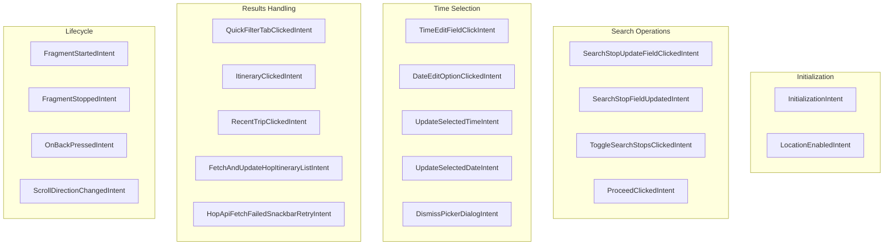

| Intent | Trigger | Effect |
|--------|---------|--------|
| **InitializationIntent** | Component init | Load config, recents, process initial locations |
| **SearchStopUpdateFieldClickedIntent** | Location field tap | Navigate to universal search |
| **SearchStopFieldUpdatedIntent** | Location selected | Update location, potentially trigger search |
| **ToggleSearchStopsClickedIntent** | Swap button tap | Swap from/to locations |
| **ProceedClickedIntent** | Manual or auto proceed | Execute trip planner search |
| **TimeEditFieldClickIntent** | Time field tap | Show time picker dialog |
| **DateEditOptionClickedIntent** | Date field tap | Show date picker dialog |
| **UpdateSelectedTimeIntent** | Time selected | Update departure time |
| **UpdateSelectedDateIntent** | Date selected | Update departure date |
| **QuickFilterTabClickedIntent** | Tab selected | Filter results or fetch new data |
| **ItineraryClickedIntent** | Itinerary card tap | Navigate to details or booking |
| **RecentTripClickedIntent** | Recent trip tap | Fill locations and search |
| **FetchAndUpdateHopItineraryListIntent** | Scroll or threshold | Fetch additional HOP results |
| **LocationEnabledIntent** | Permission granted | Auto-fill current location |
| **FragmentStartedIntent** | Lifecycle resume | Resume live updates |
| **FragmentStoppedIntent** | Lifecycle pause | Pause live updates |
| **OnBackPressedIntent** | Back navigation | Exit screen |

### Result Section Flow

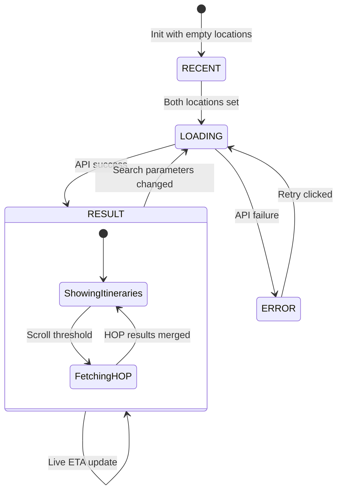

### Quick Filter Tab System

The tab system provides client-side filtering with optional server-side fetching for specific modes. Configuration comes from `TripPlannerCityConfigModel`:

| Tab Name | Mode | No of Legs | Service Type | Makes API Call |
|----------|------|------------|--------------|----------------|
| **All** | ALL | -1 (any) | ALL | Yes (initial fetch) |
| **Direct** | BUS | 1 | ALL | No (client filter) |
| **Bus** | BUS | -1 | ALL | Configurable |
| **Metro** | METRO | -1 | ALL | Configurable |
| **Chalo Bus** | BUS | 1 | PREMIUM | No (client filter) |

### Itinerary Click Routing

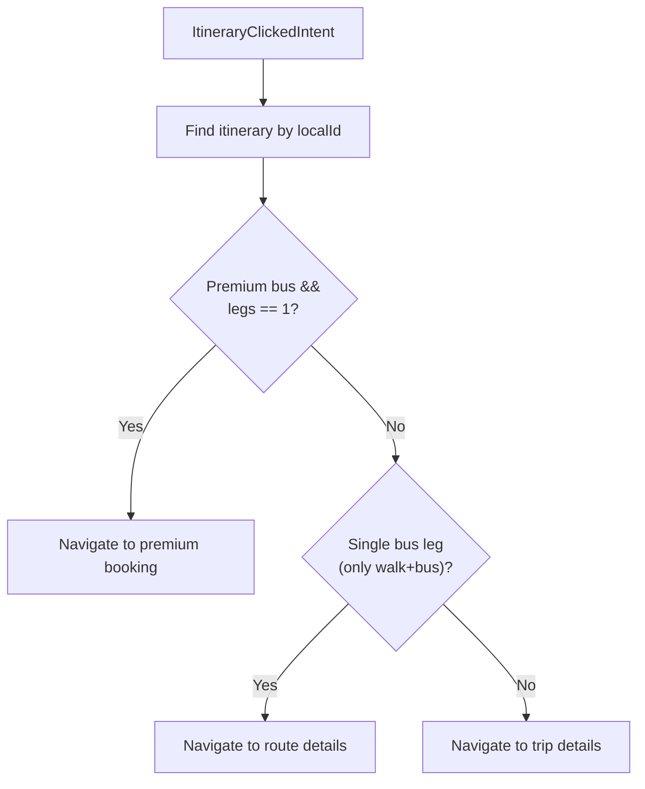

---

## TripPlannerDetailsComponent

Displays a selected itinerary with map visualization, leg-by-leg breakdown, live ETAs, and action buttons for tracking or purchasing tickets.

### Component Dependencies

| Dependency | Type | Purpose |
|------------|------|---------|
| **ProcessTripPlannerItineraryForUiUseCase** | Use Case | Transform itinerary to UI model |
| **TripPlannerItineraryLiveInfoManager** | Manager | Real-time ETA updates |
| **CityDataManagerKotlin** | Manager | Route info and polylines |
| **GetTrimmedPolylineUseCase** | Use Case | Trim polylines for leg segments |
| **ChaloMapMarkerIconProvider** | Provider | Map marker icons |
| **ProductBookingHelper** | Helper | Booking flow determination |
| **LiveTrackingNavigationContract** | Contract | Navigation to tracking/booking |

### State Model (TripPlannerDetailsState)

| Field | Type | Description |
|-------|------|-------------|
| **totalFareString** | `String?` | Combined fare display |
| **totalTravelTimeString** | `String?` | Total journey time |
| **totalChangeCount** | `Int?` | Number of transfers |
| **tripPlannerLegUiModelList** | `List<TripPlannerLegUiModel>?` | Leg cards data |
| **mapUiModel** | `TripPlannerDetailsMapUiModel` | Map configuration |
| **stopMarkerList** | `List<TripPlannerDetailsStopMarker>` | Map markers |
| **showLoadingDialog** | `Boolean` | Loading overlay visibility |
| **bottomSheetType** | `TripPlannerDetailsBottomSheetType?` | Metro purchase sheet |

### Intent Types

| Intent | Trigger | Effect |
|--------|---------|--------|
| **InitializationIntent** | Component init | Parse itinerary, setup map, fetch route info |
| **TrackBusClickedIntent** | Track button tap | Navigate to route details with boarding/alighting |
| **BuyTicketClickedIntent** | Buy button tap | Navigate to appropriate booking flow |
| **BuyMetroTicketClickedIntent** | Metro buy tap | Show sheet or direct navigate |
| **BuyMetroTicketBottomSheetClickedIntent** | Sheet confirm | Navigate to metro booking |
| **MetroTicketPurchaseBottomSheetCancelClickedIntent** | Sheet cancel | Dismiss sheet |
| **MetroTicketPurchaseBottomSheetDismissIntent** | Sheet swipe | Dismiss sheet |
| **OnMapLoaded** | Map ready | Update camera bounds, show polylines |
| **MapMarkerClickedIntent** | Marker tap | Track analytics |
| **FragmentStartedIntent** | Lifecycle resume | Resume live updates |
| **FragmentStoppedIntent** | Lifecycle pause | Pause live updates |
| **BackButtonClickedIntent** | Back navigation | Exit screen |

### Map Visualization

The component manages complex map state including polylines for each leg and markers for stops and transfer points.

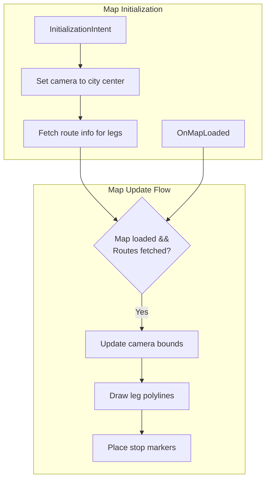

### Polyline Generation Strategy

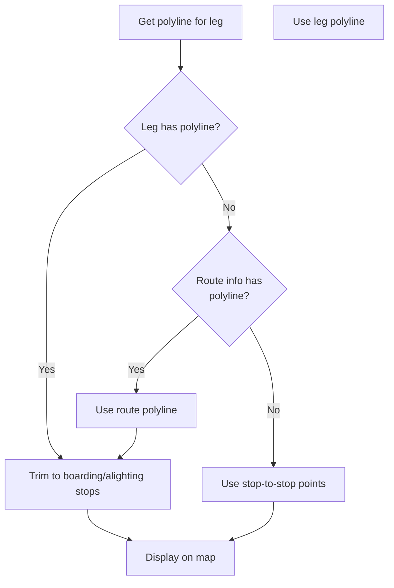

### Metro Ticket Purchase Handling

The component groups continuous metro legs for combined ticket purchase:

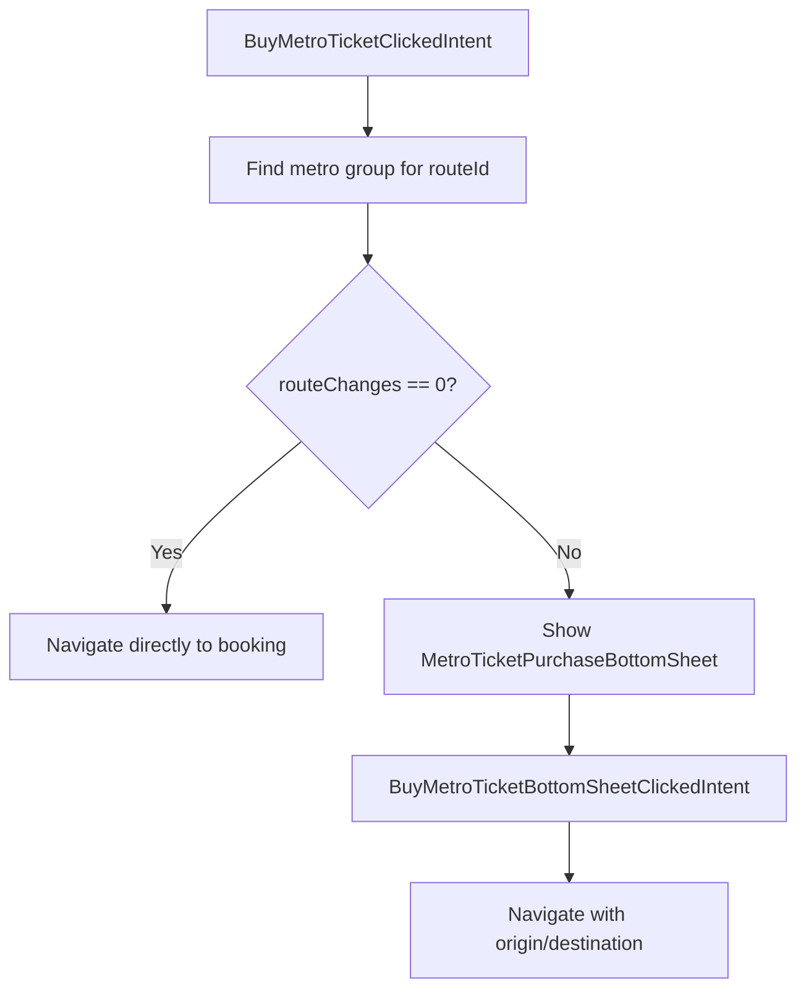

The `MetroGroupLegAppModel` captures:
- **firstStop**: Origin station for the continuous metro group
- **lastStop**: Final destination station
- **routeChanges**: Number of line changes within the group

---

## StopTripPlannerResultsComponent

A specialized component for stop-based trip planning that uses a different API endpoint returning itineraries with embedded live arrival times.

### Component Dependencies

| Dependency | Type | Purpose |
|------------|------|---------|
| **MakeTripPlannerCallUseCase** | Use Case | Connecting routes search |
| **MakeTripPlannerWithBusArrivalCallUseCase** | Use Case | Direct routes with live ETAs |
| **TripPlannerItineraryLiveInfoManager** | Manager | Real-time ETA updates |
| **FetchNearbyStopsUseCase** | Use Case | Find nearby stops for places |
| **StopTripPlannerResultStateManager** | Manager | Cross-screen state coordination |
| **StopTripPlannerResultUiStateFactory** | Factory | UI state generation |

### State Model (StopTripPlannerResultsDataState)

| Field | Type | Description |
|-------|------|-------------|
| **resultManagerId** | `String` | Cross-screen state identifier |
| **prevSource** | `Source` | Previous screen source for navigation |
| **fromLocation** | `StopTripPlannerLocationType` | Origin location type |
| **toLocation** | `StopTripPlannerLocationType` | Destination location type |
| **tripPlannerResultMap** | `Map<TabType, Map<String, InfoHolder>>?` | Results per tab |
| **tripPlannerItinerariesLiveInfoMap** | `Map<String, ItineraryLiveInfoResult>?` | Live ETA data |
| **nearbyStopsResultsMap** | `Map<TabType, Map<String, InfoHolder>>?` | Nearby alternatives |
| **resultSectionType** | `StopTripPlannerResultsectionType` | LOADING, RESULT, or ERROR |
| **error** | `StopTripPlannerResultErrorType` | Error type if any |
| **tabsList** | `List<StopTripPlannerTabType>` | Direct/Connecting tabs |
| **currentlySelectedTab** | `StopTripPlannerTabType` | Active tab |
| **bottomSheetState** | `StopBasedTripPlannerResultsBottomSheetType` | Bottom sheet type |
| **showLoadingDialog** | `Boolean` | Loading dialog visibility |
| **stopEditTarget** | `StopTripPlannerStopEditTarget` | Which stop is being edited |
| **isNearbyStopsResultContainerCollapsed** | `Boolean` | Nearby stops section state |
| **shouldShowRefreshNudge** | `Boolean` | Show refresh prompt |
| **lastRefreshNudgeShownTimestamp** | `Long?` | Last nudge time |

### Location Type Variants

The component supports multiple location input types via `StopTripPlannerLocationType`:

| Type | Description | Provides Stop ID |
|------|-------------|------------------|
| **Stop** | User selected a specific stop | Yes |
| **NearestStopToPlaceSelected** | Nearest stop to a place | Yes |
| **AllNearbyStopSelected** | All nearby stops to a place | No (uses lat/lng) |
| **None** | No location selected | No |

### Tab System

| Tab | API Used | Description |
|-----|----------|-------------|
| **DIRECT** | `makeTripPlannerWithBusArrivalCallUseCase` | Single-leg routes with embedded ETAs |
| **CONNECTING** | `makeTripPlannerCallUseCase` | Multi-leg routes (HOP itinerary type) |

### Search Flow

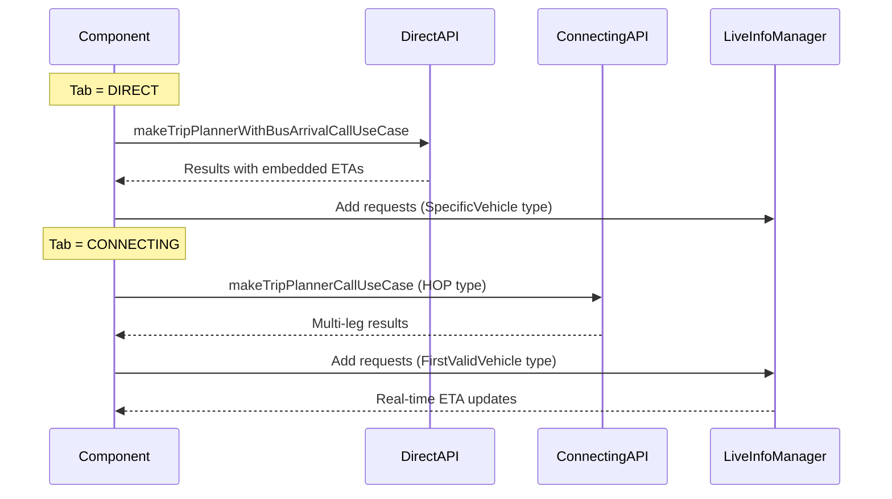

### Live Info Request Types

The component uses different request types based on the active tab:

| Tab | Request Type | Description |
|-----|--------------|-------------|
| **DIRECT** | `SpecificVehicle` | Track specific vehicle from API response |
| **CONNECTING** | `FirstValidVehicle` | Find first vehicle arriving after user reaches stop |

### Nearby Stops Flow

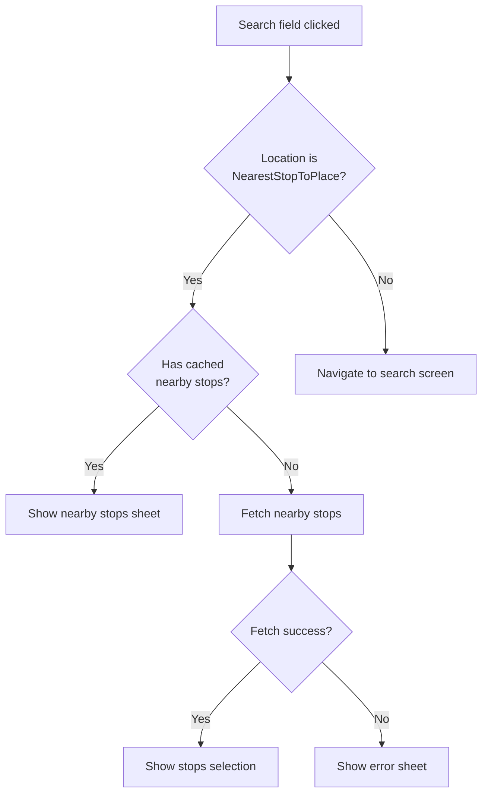

### Refresh Nudge

After 2 minutes of displaying results, the component shows a refresh nudge:

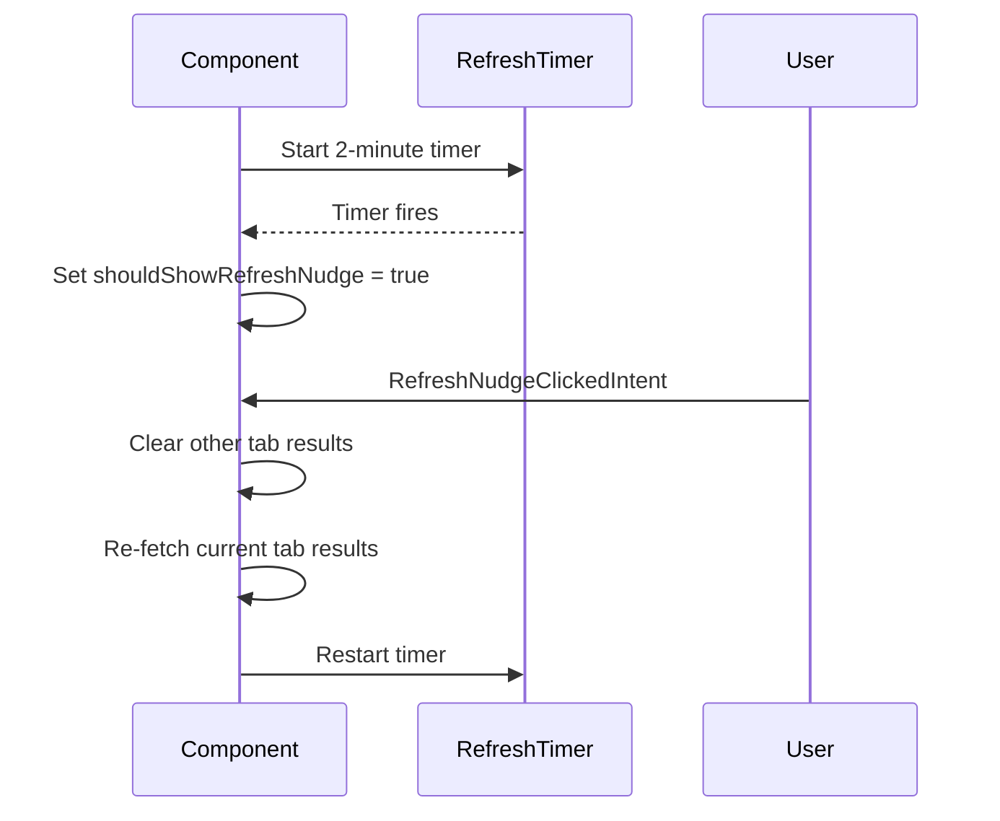

---

## UI Models

### TripPlannerItineraryUiModel

| Field | Type | Source | Updates |
|-------|------|--------|---------|
| **localId** | `String` | API response | Static |
| **travelTimeString** | `String` | Calculated from travelTimeInSeconds | Static |
| **changeCount** | `Int` | Count of relevant legs - 1 | Static |
| **fareString** | `String` | Currency symbol + totalFare | Static |
| **etaString** | `String?` | From LiveInfoManager | Real-time |
| **seatAvailabilityLevel** | `SeatAvailabilityLevel?` | From LiveInfoManager | Real-time |
| **legs** | `List<TripPlannerLegUiModel>` | Processed leg models | Static |
| **rank** | `Int` | API response | Static |
| **scheduledStringFromFirstLeg** | `String?` | First bus/metro leg | Static |
| **fromLegHeaderText** | `StringEnum?` | Based on mode and changes | Static |
| **firstModeFromStopName** | `String?` | First stop of first leg | Static |

### TripPlannerLegUiModel Variants

**Bus Leg:**

| Field | Description |
|-------|-------------|
| **routeId** | Route identifier |
| **routeName** | Display route number |
| **routeSchemeType** | Route badge formatting |
| **firstStopName** | Boarding stop name |
| **routeLastStopName** | Direction indicator |
| **via** | Via text if present |
| **tags** | Route tags (AC, EXPRESS) |
| **scheduledString** | Frequency or scheduled time |
| **intermediateStopsList** | Expandable stop names |
| **intermediateStopsCountExcludingStartAndLastStop** | Stop count |
| **fare** | Formatted fare |
| **travelTimeString** | Leg duration |
| **etaString** | Real-time ETA |
| **seatAvailabilityLevel** | Crowding indicator |
| **disclaimerText** | Timetable disclaimer |
| **routeType** | PREMIUM or REGULAR |
| **trackBusBtnString** | Track button label |
| **buyProductBtnString** | Buy button label |

**Metro Leg:**

Same structure as Bus leg plus:
- **routeColorName** - Metro line color name
- **routeColourHex** - Hex color for styling

---

## Live ETA Integration

Both results components integrate with `TripPlannerItineraryLiveInfoManager` for real-time updates:

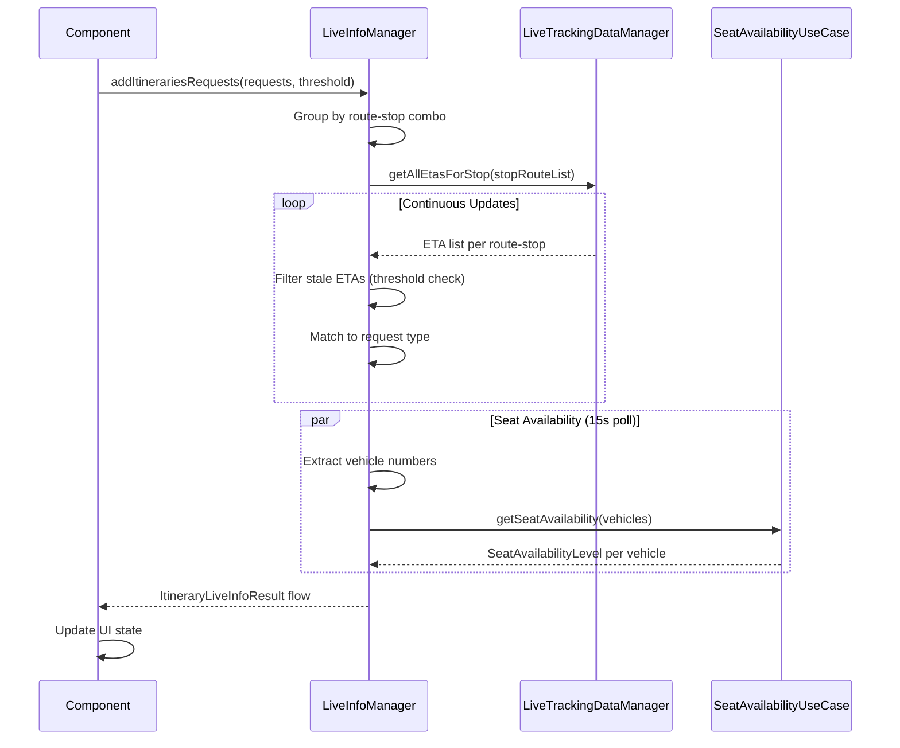

---

## Navigation

### Entry Points

| Source | Args Type | Pre-filled Data |
|--------|-----------|-----------------|
| **Home screen** | `TripPlannerArgs.ResultsScreen` | None |
| **Search result** | `TripPlannerArgs.ResultsScreen` | From/To location |
| **Stop selection** | `TripPlannerArgs.StopFocusedResultsScreen` | From/To stop types |
| **Deep link** | `TripPlannerArgs.ResultsScreen` | Location parameters |

### Exit Points

| Destination | Condition | Args |
|-------------|-----------|------|
| **Route Details** | Single bus leg | `RouteDetailsArgs` |
| **Trip Details** | Multi-leg itinerary | `TripPlannerArgs.DetailsScreen` |
| **Premium Booking** | Premium bus single leg | Product booking flow |
| **Metro Booking** | Metro leg buy ticket | Metro booking flow |
| **Universal Search** | Location field tap | `UniversalPickerArgs` |

---

## Analytics Events

### Results Screen Events

| Event | Properties | Trigger |
|-------|------------|---------|
| `trip_planner_opened` | origin, destination, selected_tab | Screen opens |
| `tp_location_entered` | type, location_name, lat, lng | Location selected |
| `tp_proceed_btn_clicked` | origin, dest, time_diff, is_user_action | Search initiated |
| `tp_swap_button_clicked` | origin, destination | Swap tapped |
| `tp_call_response_received` | itinerary counts, premium counts | API success |
| `tp_call_response_error` | error_message | API failure |
| `tp_result_clicked` | origin, dest, is_premium, analytics props | Card tapped |
| `tp_quick_filter_tab_clicked` | tab_type | Tab selected |
| `tp_back_button_clicked` | - | Back pressed |

### Details Screen Events

| Event | Properties | Trigger |
|-------|------------|---------|
| `trip_details_activity_opened` | - | Screen opens |
| `trip_planner_details_page_opened` | itinerary analytics | Screen initialized |
| `trip_details_buy_product_button_clicked` | route, stops, is_premium | Buy tapped |
| `trip_details_track_bus_button_clicked` | route, city, agency | Track tapped |
| `mticket_hook_trip_details_rendered` | route, city, user_logged_in | M-Ticket eligible |
| `tp_map_marker_clicked` | - | Marker tapped |

### Stop-Based Results Events

| Event | Properties | Trigger |
|-------|------------|---------|
| `stop_based_trip_planner_result_screen_opened` | from, to, selected_tab, prev_screen | Screen opens |
| `stop_based_trip_planner_response_success` | origin, dest, leg counts | API success |
| `stop_based_trip_planner_response_failure` | origin, dest, error_message | API failure |
| `stop_based_trip_planner_result_screen_tab_clicked` | selected_tab | Tab changed |
| `stop_based_trip_planner_result_screen_itinerary_leg_clicked` | route, stops, eta info | Leg tapped |
| `stop_based_trip_planner_result_screen_refresh_nudge_clicked` | selected_tab, last_timestamp | Refresh tapped |

---

## Error Handling

| Scenario | UI Response | Recovery |
|----------|-------------|----------|
| **Search API failure** | Error section with message | Retry button |
| **No results found** | Empty state display | Modify search |
| **Live ETA unavailable** | Show scheduled time | Automatic fallback |
| **HOP API failure** | Snackbar with retry | Retry or scroll |
| **Nearby stops fetch failed** | Error bottom sheet | Retry or search |
| **Route info fetch failed** | Stop-to-stop polyline | Graceful degradation |
| **Network offline** | Error message | Retry when online |
