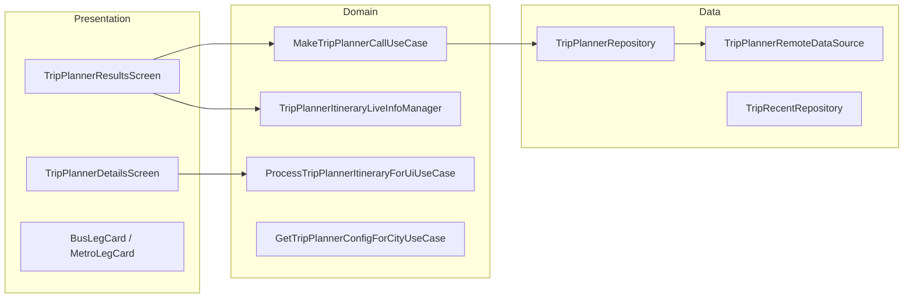

# Trip Planner — High-Level Design

## Overview

The Trip Planner feature provides multi-modal journey planning within the Chalo app. Users can search for routes between two locations using various transit modes (Bus, Metro, Auto, Taxi, Walk, Train, Ferry, MonoRail). The feature displays itineraries with fare estimates, travel times, live ETAs, and seat availability, with quick filter tabs for mode-specific results.

## User Journey

1. **Entry Points**:
   - Home screen → Plan trip
   - Search → Trip planning
   - Deep link with locations

2. **Core Flow**:
   - Enter from/to locations
   - Select date and time
   - Search for itineraries
   - Filter by transit mode
   - Select itinerary for details
   - View route on map
   - Purchase tickets or track buses

3. **Exit Points**:
   - Buy ticket → Booking flow
   - Track bus → Live tracking
   - Save trip → Recent trips

## Architecture Diagram



## Key Components

| Component | Platform | File Path | Responsibility |
|-----------|----------|-----------|----------------|
| `TripPlannerResultsComponent` | Shared | `shared/livetracking/.../tripplanner/ui/result/TripPlannerResultsComponent.kt` | Search and results |
| `TripPlannerDetailsComponent` | Shared | `shared/livetracking/.../tripplanner/ui/details/TripPlannerDetailsComponent.kt` | Itinerary details |
| `MakeTripPlannerCallUseCase` | Shared | `shared/livetracking/.../tripplanner/domain/MakeTripPlannerCallUseCase.kt` | API orchestration |
| `TripPlannerItineraryLiveInfoManager` | Shared | `shared/livetracking/.../tripplanner/domain/TripPlannerItineraryLiveInfoManager.kt` | Live ETA manager |
| `TripPlannerRepository` | Shared | `shared/livetracking/.../tripplanner/data/repository/TripPlannerRepository.kt` | Data access |

## Data Flow

### Search Flow
1. User enters from/to locations via universal search
2. Select date and time (up to 6 days ahead)
3. `MakeTripPlannerCallUseCase` constructs API request
4. `TripPlannerRepository` fetches itineraries
5. `ProcessTripPlannerItineraryForUiUseCase` transforms to UI models
6. Display itinerary cards with tabs

### Live ETA Integration
1. For itineraries with bus legs
2. `TripPlannerItineraryLiveInfoManager` subscribes to CRTS
3. Requests: `ItineraryLiveInfoRequest.FirstValidVehicle`
4. Updates ETA and seat availability
5. Refresh UI with live data

### Details Flow
1. User selects itinerary
2. Navigate to `TripPlannerDetailsComponent`
3. Fetch route info for polylines
4. Display map with route and markers
5. Show leg-by-leg breakdown
6. Start live tracking for bus legs

## Platform Differences

### Android-Specific
- Google Maps for route visualization
- Native location picker
- Android-specific date/time pickers

### iOS-Specific
- MapKit integration
- Compose Multiplatform UI
- iOS location services

## Integration Points

### Analytics Events
- See [Analytics: trip-planner](/analytics/flows/trip-planner) for event documentation
- Key events:
  - `trip_planner_opened`
  - `tp_location_entered`
  - `tp_proceed_btn_clicked`
  - `tp_call_response_received`
  - `tp_result_clicked`
  - `tp_quick_filter_tab_clicked`
  - `trip_details_buy_product_button_clicked`
  - `trip_details_track_bus_button_clicked`

### Shared Services
- **Live Tracking**: CRTS for bus ETAs
- **Booking**: Ticket purchase flows
- **Location**: GPS for current location
- **Recent Trips**: Trip history storage

### Navigation
- **Navigates to**: Route details, Booking, Metro purchase
- **Navigated from**: Home, Search, Deep links

## Transit Modes

### Supported Modes
```kotlin
sealed class TripPlannerLegAppModel {
    data class Bus(...) : TripPlannerLegAppModel
    data class Metro(...) : TripPlannerLegAppModel
    data class Auto(...) : TripPlannerLegAppModel
    data class Taxi(...) : TripPlannerLegAppModel
    data class Walk(...) : TripPlannerLegAppModel
    data class Railway(...) : TripPlannerLegAppModel
    data object Ferry : TripPlannerLegAppModel
    data object MonoRail : TripPlannerLegAppModel
}
```

### Leg Properties
- GPS coordinates (from/to)
- Travel time and distance
- Polyline for route visualization
- Fare information
- Stop details for transit modes

## Quick Filter Tabs

### TripPlannerTabType
- **ALL**: All transit modes
- **BUS**: Bus only results
- **METRO**: Metro only results
- **1 CHANGE**: Direct + 1 transfer only
- **CHALO BUS**: Premium buses (config-driven)

## View State

### TripPlannerResultsState
```kotlin
data class TripPlannerResultsState(
    val fromName: String?,
    val toName: String?,
    val timeSelectedString: String?,
    val dateSelectedString: String?,
    val resultSectionType: ResultSectionType,
    val itinerariesResult: List<TripPlannerItineraryUiModel>?,
    val recentTripsList: List<RecentTripAppModel>?,
    val tabsList: List<TripPlannerTabType>,
    val currentlySelectedTab: TripPlannerTabType,
    val selectedDateTimeInMillis: Long?
)

enum class ResultSectionType {
    RECENT,    // Show recent trips
    LOADING,   // Search in progress
    RESULT,    // Show itineraries
    ERROR      // Show error state
}
```

## Itinerary UI Model

### TripPlannerItineraryUiModel
```kotlin
data class TripPlannerItineraryUiModel(
    val localId: String,
    val travelTimeString: String,
    val changeCount: Int,
    val fareString: String,
    val etaString: String?,
    val seatAvailabilityLevel: SeatAvailabilityLevel?,
    val legs: List<TripPlannerLegUiModel>,
    val rank: Int,
    val scheduledStringFromFirstLeg: String?,
    val firstModeFromStopName: String?
)
```

## Live Info Manager

### Request Types
```kotlin
sealed class ItineraryLiveInfoRequest {
    data class FirstValidVehicle(
        val id: String,
        val routeId: String,
        val stopId: String,
        val minimumArrivalTimeInMillis: Long
    ) : ItineraryLiveInfoRequest()
}
```

### Result Model
```kotlin
data class ItineraryLiveInfoResult(
    val itineraryInfo: ItineraryInfo,
    val validEta: ValidEta?,
    val seatOccupancyStatus: SeatAvailabilityLevel?
)
```

## Edge Cases & Error Handling

| Scenario | Handling |
|----------|----------|
| No results found | Shows empty state message |
| API failure | Shows retry option |
| Location unavailable | Prompts for manual entry |
| Live ETA unavailable | Shows scheduled time |
| Incomplete fare | Shows "Fare incomplete" flag |
| Stale trip data | Filters by timestamp |

## HOP API Pagination

### Pagination Strategy
- Threshold: 3 results triggers HOP API
- Config-driven per city
- Automatic fallback if threshold exceeded
- Retry mechanism with snackbar feedback

## Map Features

### Route Visualization
- Polylines per leg (trimmed to origin-destination)
- Start/end markers with icons
- Intermediate stop markers
- Current location (if permitted)

### Marker Types
```kotlin
enum class MarkerStopType {
    FirstStop, LastStop, IntermediateStop,
    CurrentSelectedStopInStopList, DisabledStop,
    PremiumBusPickupStop, PremiumBusDropStop
}
```

## Dependencies

### Internal
- `shared:livetracking` — Trip planner module
- `shared:core` — Navigation and location
- `shared:productbooking` — Ticket purchase
- `shared:chalo-base` — Base models

### External
- Maps SDK — Route visualization
- CRTS — Live bus tracking
- Location Services — GPS integration
- DataStore — Recent trips storage
