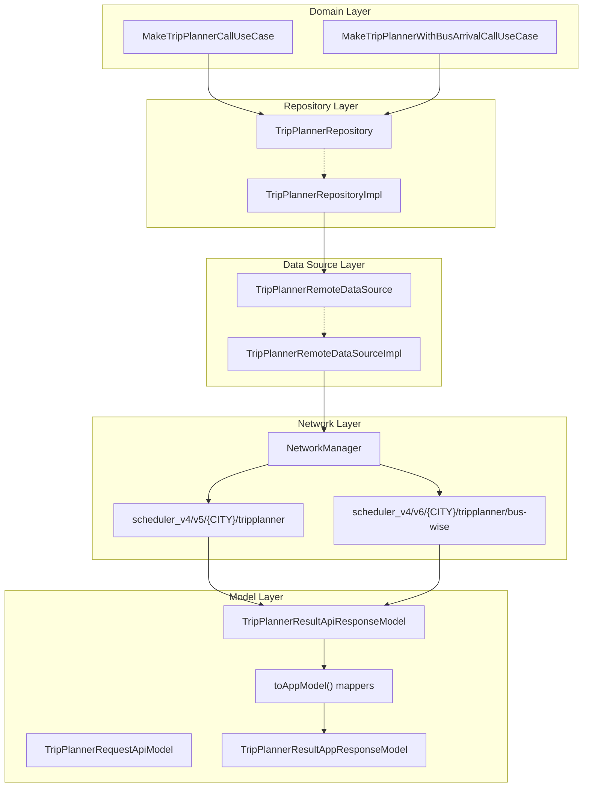
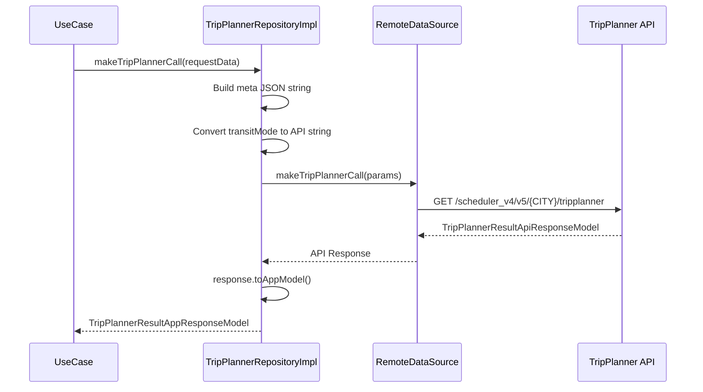
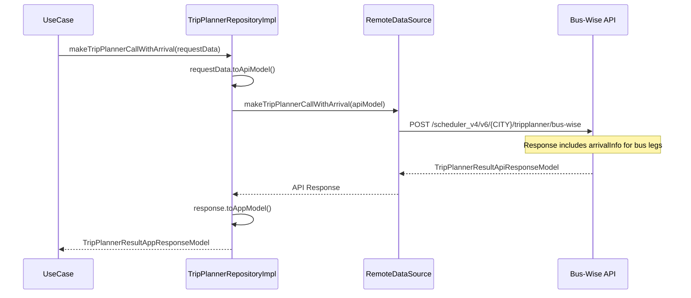
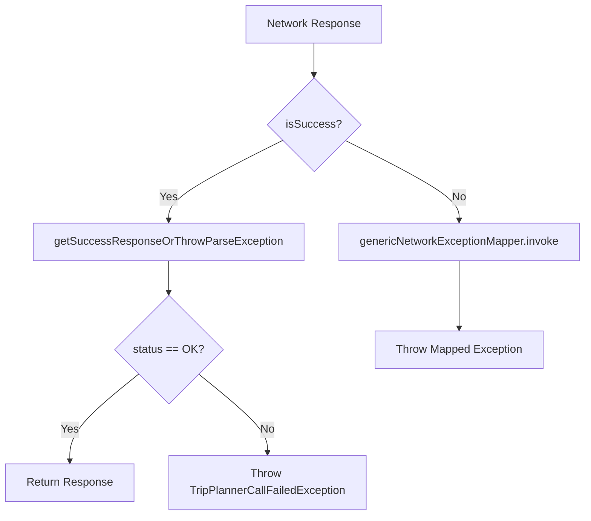
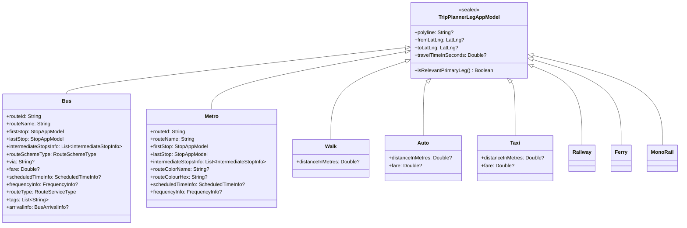
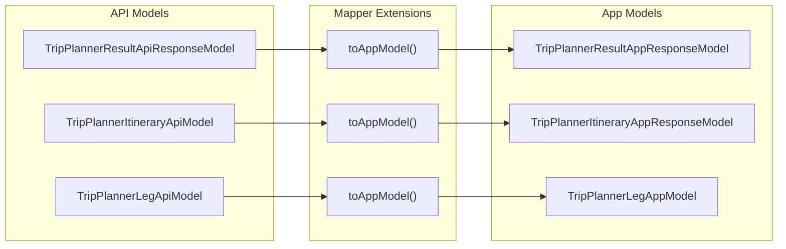
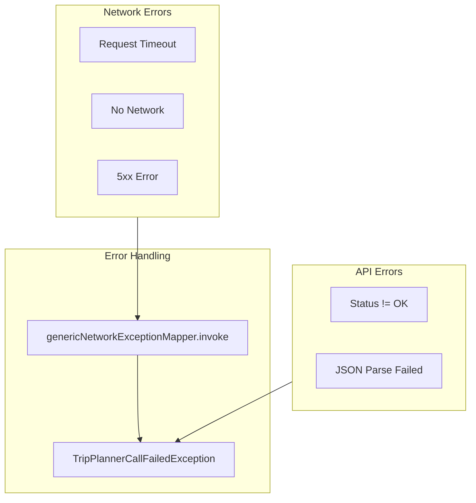
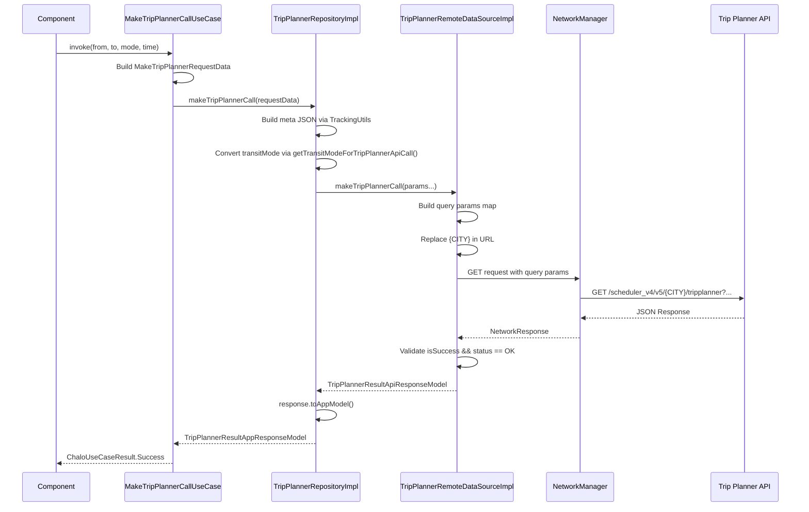
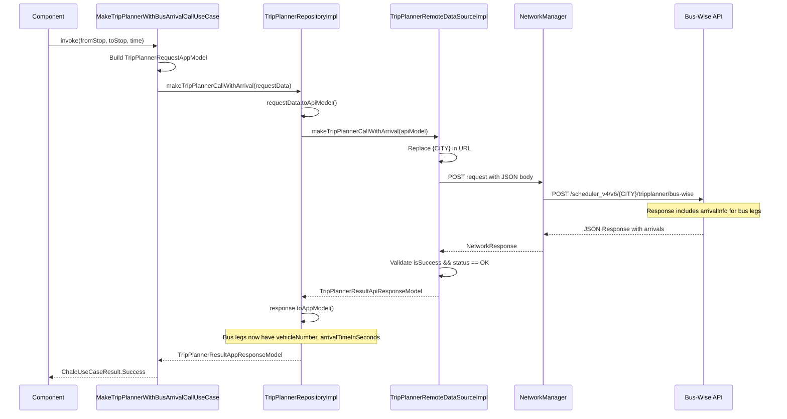

# Trip Planner — Repository Documentation

## Data Layer Overview

The Trip Planner feature follows a clean data layer architecture with clear separation between repository interfaces, implementations, remote data sources, and data models. The data flow supports two primary API endpoints: the standard trip planner API (v5) for location-based searches, and a bus-wise arrival API (v6) for stop-based searches with embedded live arrival information.

---

## Repository Interfaces

### TripPlannerRepository

The main repository interface defines two methods for trip planning searches, supporting both location-based and stop-based flows.

**File Path:** `tripplanner/data/repository/TripPlannerRepository.kt`

| Method | Parameters | Return Type | Throws |
|--------|------------|-------------|--------|
| **makeTripPlannerCall** | `MakeTripPlannerRequestData` | `TripPlannerResultAppResponseModel` | `TripPlannerCallFailedException`, `CancellationException` |
| **makeTripPlannerCallWithArrival** | `TripPlannerRequestAppModel` | `TripPlannerResultAppResponseModel` | `TripPlannerCallFailedException`, `CancellationException` |

The dual-method design supports:
1. **Location-based searches** via `makeTripPlannerCall` - Uses GET with query parameters (v5 endpoint)
2. **Stop-based searches with arrivals** via `makeTripPlannerCallWithArrival` - Uses POST with request body (v6 endpoint)

---

## Repository Implementation

### TripPlannerRepositoryImpl

**File Path:** `tripplanner/data/repository/TripPlannerRepositoryImpl.kt`

**Dependencies:**

| Dependency | Type | Purpose |
|------------|------|---------|
| **remoteDataSource** | `TripPlannerRemoteDataSource` | Network communication |
| **basicInfoContract** | `BasicInfoContract` | Device ID for meta information |

### Method: makeTripPlannerCall

Handles location-based trip planning with extensive query parameters.

**Meta String Construction:**

The repository constructs a JSON meta string using `TrackingUtils.userPropJsonObjectForTripPlanner()` containing:

| Field | Source |
|-------|--------|
| **userId** | Request data |
| **deviceId** | BasicInfoContract.getDeviceId() |
| **currentLanguage** | Request data |
| **versionCode** | Request data |
| **city** | Request data |
| **androidModel** | Request data |
| **osVersion** | Request data |

### Method: makeTripPlannerCallWithArrival

Handles stop-based searches with bus arrival information embedded in the response.

---

## Data Sources

### TripPlannerRemoteDataSource Interface

**File Path:** `tripplanner/data/remote/TripPlannerRemoteDataSource.kt`

| Method | HTTP Method | Parameters |
|--------|-------------|------------|
| **makeTripPlannerCall** | GET | Location coords, time, mode, meta, itinerary type, optional stop IDs |
| **makeTripPlannerCallWithArrival** | POST | Request API model |

### TripPlannerRemoteDataSourceImpl

**File Path:** `tripplanner/data/remote/TripPlannerRemoteDataSourceImpl.kt`

**Dependencies:**

| Dependency | Type | Purpose |
|------------|------|---------|
| **networkManager** | `NetworkManager` | HTTP request execution |
| **genericNetworkExceptionMapper** | `GenericNetworkExceptionMapper` | Error transformation |
| **cityProvider** | `CityProvider` | Current city name for URL path |

### API Endpoints

| Endpoint | Method | Description |
|----------|--------|-------------|
| `scheduler_v4/v5/{CITY}/tripplanner` | GET | Standard trip planner |
| `scheduler_v4/v6/{CITY}/tripplanner/bus-wise` | POST | Trip planner with bus arrivals |

The `{CITY}` placeholder is replaced with the uppercase city name from `CityProvider`.

### GET Endpoint Query Parameters

| Parameter | Query Key | Type | Description |
|-----------|-----------|------|-------------|
| **fromLatLng** | `from_lat`, `from_lon` | Double | Origin coordinates |
| **toLatLng** | `to_lat`, `to_lon` | Double | Destination coordinates |
| **mode** | `mode` | String | Transit mode (BUS, METRO, TRANSIT) |
| **startTimeElapsedFromMidnight** | `start_time` | Long | Departure time offset in seconds |
| **day** | `day` | String | Day of week identifier |
| **meta** | `meta` | String | JSON metadata string |
| **startTimeMillis** | `startTimeMillis` | Long | Absolute departure timestamp |
| **itineraryType** | `itinerary_type` | String | DIRECT, HOP, etc. |
| **startStopId** | `from_stop_id` | String? | Optional origin stop ID |
| **endStopId** | `to_stop_id` | String? | Optional destination stop ID |
| **skipWalkAndAutoLegs** | - | - | When true, sets `max_walk_distance=0` and `max_taxi_distance=0` |

### POST Endpoint Request Body

The `TripPlannerRequestApiModel` contains all parameters in a structured JSON body rather than query parameters, used for the bus-wise endpoint.

### Response Processing Flow

---

## Data Models

### Request Models

#### MakeTripPlannerRequestData

Used for location-based trip planner calls via the v5 GET endpoint.

| Field | Type | Description |
|-------|------|-------------|
| **fromLatLng** | `LatLng` | Origin coordinates |
| **toLatLng** | `LatLng` | Destination coordinates |
| **day** | `String` | Day of week identifier |
| **transitMode** | `ChaloTransitMode` | BUS, METRO, or ALL |
| **startTimeElapsedFromMidnight** | `Long` | Time offset in seconds from midnight |
| **startTimeMillis** | `Long` | Absolute timestamp for departure |
| **itineraryType** | `TripPlannerItineraryType` | DIRECT, HOP, BUS_WISE |
| **startStopId** | `String?` | Optional origin stop ID |
| **endStopId** | `String?` | Optional destination stop ID |
| **skipWalkAndAutoLegs** | `Boolean` | Exclude walk/auto segments |
| **userId** | `String?` | User identifier for tracking |
| **currentLanguage** | `String` | App language |
| **versionCode** | `Int` | App version code |
| **city** | `String` | City name |
| **androidModel** | `String` | Device model |
| **osVersion** | `String` | OS version string |

#### TripPlannerRequestAppModel

Used for POST requests to the bus-wise v6 endpoint. Contains similar fields structured for JSON body.

#### TripPlannerItineraryType Enum

| Value | API String | Description |
|-------|------------|-------------|
| `DIRECT` | `"direct"` | Single-leg routes only |
| `HOP` | `"hop"` | Multi-leg connecting routes |
| `BUS_WISE` | `"bus_wise"` | Routes with embedded arrival times |

### Response Models

#### TripPlannerResultAppResponseModel

| Field | Type | Description |
|-------|------|-------------|
| **itineraries** | `List<TripPlannerItineraryAppResponseModel>` | Primary search results |
| **nearbyStopsAvailable** | `Boolean?` | Indicates if nearby alternatives exist |
| **fromNearbyStopsResult** | `List<TripPlannerItineraryAppResponseModel>?` | Results from nearby origin stops |
| **toNearbyStopsResult** | `List<TripPlannerItineraryAppResponseModel>?` | Results from nearby destination stops |

#### TripPlannerItineraryAppResponseModel

| Field | Type | Description |
|-------|------|-------------|
| **localId** | `String` | Unique itinerary identifier |
| **legs** | `List<TripPlannerLegAppModel>` | Journey segments |
| **travelTimeInSeconds** | `Double?` | Total journey duration |
| **totalFare** | `Double?` | Combined fare in rupees |
| **incompleteFare** | `Boolean` | True if fare calculation is incomplete |
| **rank** | `Int` | Sorting rank from API |

### Leg Models

The `TripPlannerLegAppModel` is a sealed class with variants for each transport mode.

#### Bus Leg Details

| Field | Type | Description |
|-------|------|-------------|
| **routeId** | `String` | Unique route identifier |
| **routeName** | `String` | Display route number |
| **firstStop** | `StopAppModel` | Boarding stop details |
| **lastStop** | `StopAppModel` | Alighting stop details |
| **intermediateStopsInfo** | `List<IntermediateStopInfo>` | All stops on this leg |
| **routeSchemeType** | `RouteSchemeType` | Badge styling type |
| **via** | `String?` | Via location text |
| **fare** | `Double?` | Leg fare in rupees |
| **scheduledTimeInfo** | `ScheduledTimeInfo?` | Scheduled departure time |
| **frequencyInfo** | `FrequencyInfo?` | Service frequency |
| **routeType** | `RouteServiceType` | PREMIUM or REGULAR |
| **tags** | `List<String>` | Route tags (AC, EXPRESS) |
| **arrivalInfo** | `BusArrivalInfo?` | Live arrival data (v6 only) |

#### Bus Arrival Information

When using the bus-wise API (v6), bus legs include `BusArrivalInfo`:

| Field | Type | Description |
|-------|------|-------------|
| **vehicleNumber** | `String` | Bus identifier for tracking |
| **arrivalTimeInSeconds** | `Long` | ETA at boarding stop |
| **arrivalTimeStamp** | `Long` | Timestamp of ETA calculation |

#### Metro Leg Details

| Field | Type | Description |
|-------|------|-------------|
| **routeId** | `String` | Metro line route ID |
| **routeName** | `String` | Line display name |
| **firstStop** | `StopAppModel` | Boarding station |
| **lastStop** | `StopAppModel` | Alighting station |
| **intermediateStopsInfo** | `List<IntermediateStopInfo>` | All stations on leg |
| **routeColorName** | `String?` | Metro line color name |
| **routeColourHex** | `String?` | Hex color for UI styling |
| **scheduledTimeInfo** | `ScheduledTimeInfo?` | Scheduled time |
| **frequencyInfo** | `FrequencyInfo?` | Service frequency |

### Stop Information

#### StopAppModel

| Field | Type | Description |
|-------|------|-------------|
| **stopId** | `String` | Stop identifier |
| **stopName** | `String` | Display name |
| **stopLocation** | `LatLng` | Geographic coordinates |

#### IntermediateStopInfo

| Field | Type | Description |
|-------|------|-------------|
| **stopId** | `String` | Stop identifier |
| **stopName** | `String` | Display name |
| **stopLocation** | `LatLng` | Geographic coordinates |

### Schedule Information

#### ScheduledTimeInfo

| Field | Type | Description |
|-------|------|-------------|
| **scheduledTime** | `String` | Formatted departure time |
| **disclaimer** | `String?` | Timetable note/disclaimer |

#### FrequencyInfo

| Field | Type | Description |
|-------|------|-------------|
| **frequency** | `String` | Formatted frequency string (e.g., "Every 15 mins") |
| **disclaimer** | `String?` | Timetable note/disclaimer |

---

## Model Transformations

### API to App Model Mapping

The transformation layer uses extension functions (`toAppModel()`) to convert network response models to domain-friendly app models.

### Leg Type Resolution

The mapper resolves leg types based on the `mode` field in the API response:

| API Mode | App Model Type |
|----------|---------------|
| `BUS` | `TripPlannerLegAppModel.Bus` |
| `METRO` | `TripPlannerLegAppModel.Metro` |
| `WALK` | `TripPlannerLegAppModel.Walk` |
| `AUTO`, `AUTO_RICKSHAW` | `TripPlannerLegAppModel.Auto` |
| `TAXI`, `CAB` | `TripPlannerLegAppModel.Taxi` |
| `TRAIN`, `RAILWAY` | `TripPlannerLegAppModel.Railway` |
| `FERRY` | `TripPlannerLegAppModel.Ferry` |
| `MONORAIL` | `TripPlannerLegAppModel.MonoRail` |

### Transit Mode Conversion

The repository converts `ChaloTransitMode` to API string format via `getTransitModeForTripPlannerApiCall()`:

| ChaloTransitMode | API String |
|------------------|------------|
| `BUS` | `"BUS"` |
| `METRO` | `"METRO"` |
| `ALL` | `"TRANSIT"` |

---

## Configuration Models

### TripPlannerConfigModel

City-specific configuration retrieved via `GetTripPlannerConfigForCityUseCase` from city data.

| Field | Type | Description |
|-------|------|-------------|
| **isTripPlannerEnabled** | `Boolean` | Feature toggle for city |
| **enabledTabs** | `List<TripPlannerTabConfig>` | Available filter tabs |
| **defaultTab** | `TripPlannerTabType` | Initial selected tab |
| **hopThresholdForFetch** | `Int?` | Scroll threshold for HOP fetch |
| **showChaloBusTabTooltip** | `Boolean` | Show premium bus tooltip |

### TripPlannerTabConfig

| Field | Type | Description |
|-------|------|-------------|
| **type** | `TripPlannerTabType` | Tab identifier enum |
| **makesApiCall** | `Boolean` | Whether selecting tab triggers API |
| **mode** | `ChaloTransitMode` | Filter mode |
| **numberOfLegs** | `Int` | Leg count filter (-1 for any) |
| **serviceType** | `RouteServiceType` | REGULAR, PREMIUM, or ALL |

### TripPlannerTabType Enum

| Value | Description |
|-------|-------------|
| `ALL` | Show all results |
| `DIRECT` | Single-leg routes only |
| `BUS` | Bus mode only |
| `METRO` | Metro mode only |
| `CHALO_BUS` | Premium bus only |

---

## Error Handling

### TripPlannerCallFailedException

Custom exception thrown when API calls fail:

| Field | Type | Description |
|-------|------|-------------|
| **message** | `String?` | Error description |
| **cause** | `Throwable?` | Underlying exception |

### Error Scenarios

| Scenario | Detection | Response |
|----------|-----------|----------|
| **Network timeout** | Network response failure | Map via genericNetworkExceptionMapper |
| **No connectivity** | Network response failure | Map via genericNetworkExceptionMapper |
| **Server error (5xx)** | `!isSuccess` | Map via genericNetworkExceptionMapper |
| **API status not OK** | `!status.equals("OK", ignoreCase=true)` | Throw TripPlannerCallFailedException directly |
| **Parse failure** | Exception during JSON parsing | Throw parse exception |

---

## Data Flow Examples

### Location-Based Search (v5 GET)

### Stop-Based Search with Arrivals (v6 POST)

---

## Caching Strategy

The Trip Planner data layer does not implement local caching for search results due to the time-sensitive nature of transit schedules and live arrival data. However, related data is cached through other repositories:

| Data | Cache Location | TTL |
|------|----------------|-----|
| **Trip search results** | None | Real-time only |
| **City config** | CityDataManager | Session |
| **Route info/polylines** | CityDataManager | Session |
| **Recent trips** | RecentTripsRepository | Persistent |

---

## Thread Safety

| Component | Threading Model |
|-----------|-----------------|
| **Repository** | Suspend functions, safe for concurrent calls |
| **Data Source** | Suspend functions, uses NetworkManager's threading |
| **Mappers** | Pure extension functions, thread-safe |

All repository methods are `suspend` functions designed to be called from coroutines, typically dispatched to the IO dispatcher by the use case layer.

---

## Related Repositories

The Trip Planner feature interacts with several other repositories:

| Repository | Module | Purpose |
|------------|--------|---------|
| **CityDataManagerKotlin** | citydata | Route info, polylines, stop data |
| **RecentTripsRepository** | recent | Recent trip history |
| **LiveTrackingDataManager** | livetracking | Real-time bus ETA via CRTS |
