# Trip Planner — Use Case Documentation

## Architecture Overview

The Trip Planner domain layer orchestrates multi-modal journey planning through a set of coordinated use cases. The primary entry point is `MakeTripPlannerCallUseCase`, which handles location-based trip planning via the v5 GET endpoint. A specialized variant, `MakeTripPlannerWithBusArrivalCallUseCase`, supports stop-based queries with embedded live arrival times via the v6 POST endpoint.

Live ETA management is handled by `TripPlannerItineraryLiveInfoManager`, which maintains persistent CRTS (Chalo Real-Time System) connections for real-time bus tracking. UI transformation is delegated to `ProcessTripPlannerItineraryForUiUseCase` and `ProcessTripPlannerLegForUiUseCase`, which convert API models into display-ready structures.

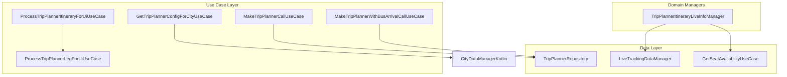

---

## Use Case Inventory

| Use Case | File Path | Responsibility |
|----------|-----------|----------------|
| **MakeTripPlannerCallUseCase** | `domain/MakeTripPlannerCallUseCase.kt` | Standard trip planner API call orchestration |
| **MakeTripPlannerWithBusArrivalCallUseCase** | `domain/MakeTripPlannerWithBusArrivalCallUseCase.kt` | Stop-based trip planning with live arrivals |
| **GetTripPlannerConfigForCityUseCase** | `domain/GetTripPlannerConfigForCityUseCase.kt` | City-specific feature configuration |
| **ProcessTripPlannerItineraryForUiUseCase** | `domain/ProcessTripPlannerItineraryForUiUseCase.kt` | Itinerary API-to-UI model transformation |
| **ProcessTripPlannerLegForUiUseCase** | `domain/ProcessTripPlannerLegForUiUseCase.kt` | Leg API-to-UI model transformation |
| **TripPlannerItineraryLiveInfoManager** | `domain/TripPlannerItineraryLiveInfoManager.kt` | Live ETA and seat availability management |

---

## MakeTripPlannerCallUseCase

The primary use case for orchestrating trip planner API calls. It constructs request payloads with device metadata, handles error mapping, and enriches response data with user-provided location names.

### Dependencies

| Dependency | Purpose |
|------------|---------|
| **TripPlannerRepository** | API call execution |
| **GetTimeInMillisAfterXTimeUseCase** | Time calculation for seconds from midnight |
| **GetDistinctIdUseCase** | User identifier for analytics |
| **LanguageFeature** | Current language for localization |
| **BasicInfoContract** | Device info (version, model, OS) |
| **CityProvider** | Current city context |
| **TimeUtilsContract** | Day name and timezone utilities |

### Invocation Signature

| Parameter | Type | Description |
|-----------|------|-------------|
| **fromLocationDescription** | `String?` | Display name for origin |
| **fromLatLng** | `LatLng` | Origin GPS coordinates |
| **toLocationDescription** | `String?` | Display name for destination |
| **toLatLng** | `LatLng` | Destination GPS coordinates |
| **selectedTimeStamp** | `Long` | Departure time in milliseconds |
| **itineraryType** | `TripPlannerItineraryType` | DIRECT, HOP, or ALL (default: ALL) |
| **transitMode** | `ChaloTransitMode` | Transit mode filter (default: ALL) |
| **startStopId** | `String?` | Optional origin stop ID |
| **endStopId** | `String?` | Optional destination stop ID |
| **skipWalkAndAutoLegs** | `Boolean` | Whether to exclude walk/auto legs (default: false) |

### Execution Flow

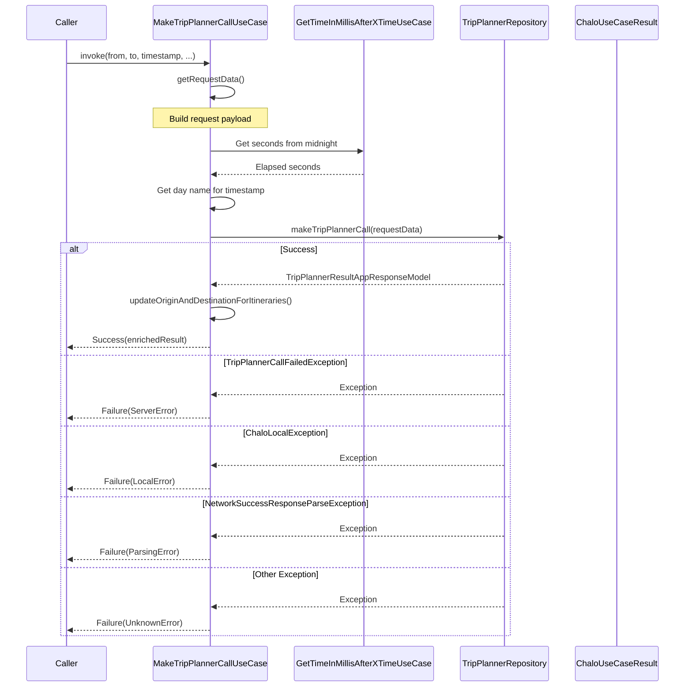

### Request Data Construction

The use case builds a comprehensive `MakeTripPlannerRequestData` payload with device metadata for analytics and personalization.

| Field | Source | Description |
|-------|--------|-------------|
| **fromLatLng** | Parameter | Origin coordinates |
| **toLatLng** | Parameter | Destination coordinates |
| **transitMode** | Parameter | Transit mode filter |
| **startTimeElapsedFromMidnight** | Calculated | Seconds since midnight |
| **userId** | GetDistinctIdUseCase | User identifier (or empty string) |
| **currentLanguage** | LanguageFeature | App language (defaults to ENGLISH) |
| **versionCode** | BasicInfoContract | App version code |
| **city** | CityProvider | Current city name |
| **osVersion** | BasicInfoContract | Device OS version |
| **androidModel** | BasicInfoContract | Device model |
| **day** | Calculated | Day name (e.g., "MONDAY") |
| **startTimeMillis** | Parameter | Full timestamp |
| **itineraryType** | Parameter | Result type filter |
| **startStopId** | Parameter | Optional origin stop ID |
| **endStopId** | Parameter | Optional destination stop ID |
| **skipWalkAndAutoLegs** | Parameter | Walk/auto leg exclusion flag |

### Seconds from Midnight Calculation

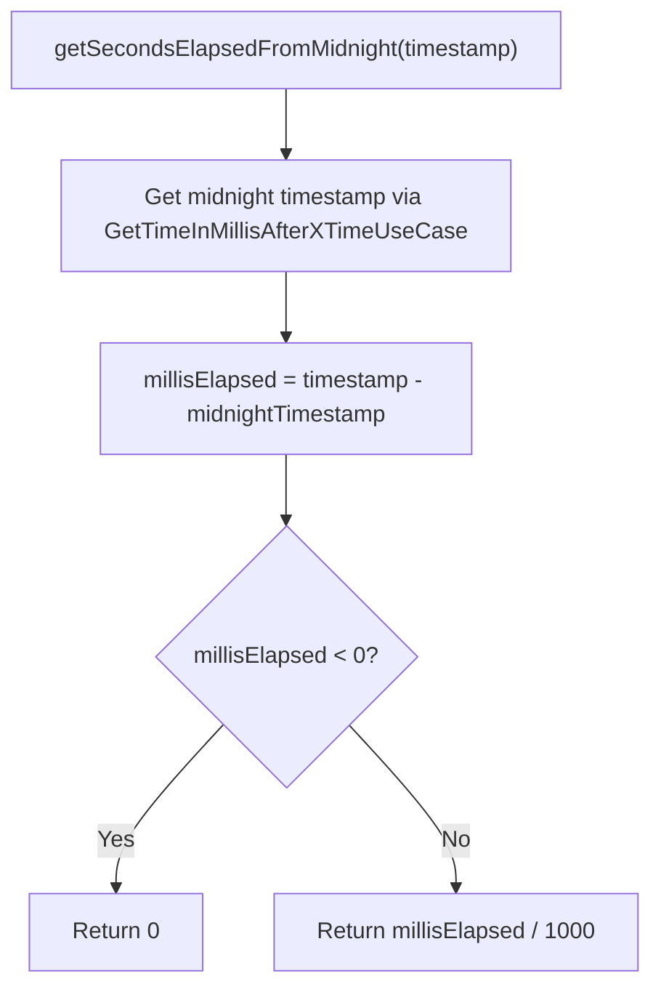

### Origin/Destination Enrichment

The use case enriches API responses by replacing generic place names ("start_place", "end_place") with user-provided descriptions.

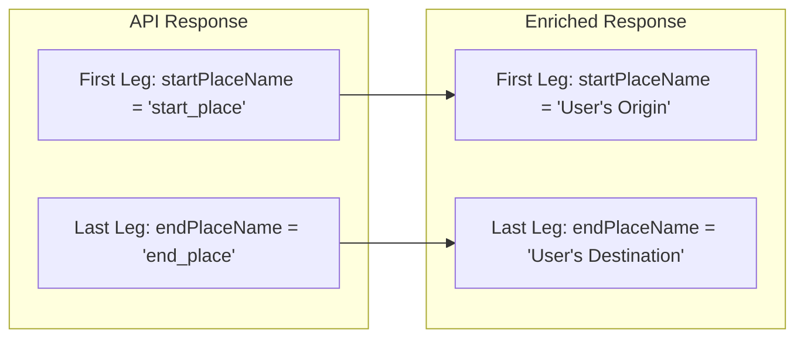

Enrichment applies to these leg types:
- `TripPlannerLegAppModel.Auto`
- `TripPlannerLegAppModel.Bus`
- `TripPlannerLegAppModel.Taxi`
- `TripPlannerLegAppModel.Walk`

Metro, Railway, Ferry, and MonoRail legs retain their original place names.

### Failure Reason Mapping

| Exception Type | Failure Reason | Description |
|----------------|----------------|-------------|
| **TripPlannerCallFailedException** | `ServerError(null)` | Backend returned non-OK status |
| **ChaloLocalException** | `LocalError` | Network connectivity issue |
| **NetworkSuccessResponseParseException** | `ParsingError` | Response deserialization failed |
| **Exception** | `UnknownError` | Unexpected error |

The `MakeTripPlannerCallFailureReason` sealed class provides a `getFailureReason()` method returning a string representation for analytics.

---

## MakeTripPlannerWithBusArrivalCallUseCase

A specialized variant for stop-based trip planning that uses the v6 POST endpoint returning itineraries with embedded live arrival times. Optimized for the stop-based trip planner flow where users select specific stops.

### Key Differences from Standard Use Case

| Aspect | MakeTripPlannerCallUseCase | MakeTripPlannerWithBusArrivalCallUseCase |
|--------|---------------------------|------------------------------------------|
| **API Endpoint** | `v5/{CITY}/tripplanner` (GET) | `v6/{CITY}/tripplanner/bus-wise` (POST) |
| **Request Format** | Query parameters | JSON body |
| **Stop IDs** | Optional | Primary lookup method |
| **LatLng** | Required | Fallback when stop ID absent |
| **Live ETAs** | Not included | Embedded in response (BusArrivalInfo) |
| **Nearby Results** | Not included | Included in response |

### Invocation Signature

| Parameter | Type | Description |
|-----------|------|-------------|
| **fromLatLng** | `LatLng?` | Origin coordinates (optional if startStopId provided) |
| **toLatLng** | `LatLng?` | Destination coordinates (optional if endStopId provided) |
| **selectedTimeStamp** | `Long` | Departure time in milliseconds |
| **itineraryType** | `TripPlannerItineraryType` | Result type filter (default: BUS_WISE) |
| **transitMode** | `ChaloTransitMode` | Transit mode filter (default: ALL) |
| **startStopId** | `String?` | Origin stop ID |
| **endStopId** | `String?` | Destination stop ID |

### Response Structure

The response includes both exact-match results and nearby stop alternatives.

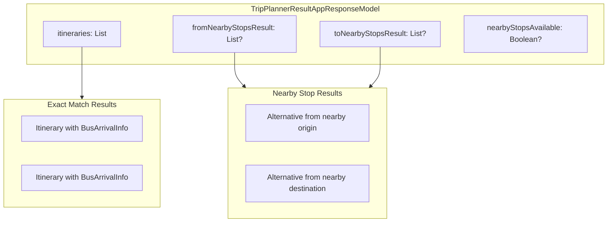

### Bus Arrival Information

Bus legs in the response include `BusArrivalInfo` with:
- **vehicleNumber** - Specific bus to track
- **arrivalTimeInSeconds** - ETA at boarding stop
- **arrivalTimeStamp** - When the ETA was calculated

---

## GetTripPlannerConfigForCityUseCase

Retrieves city-specific trip planner configuration from city data. The configuration controls tab availability, HOP pagination behavior, and UI customization per city.

### Dependencies

| Dependency | Purpose |
|------------|---------|
| **CityDataManagerKotlin** | City data access |
| **CityProvider** | Current city context |

### Config Resolution Flow

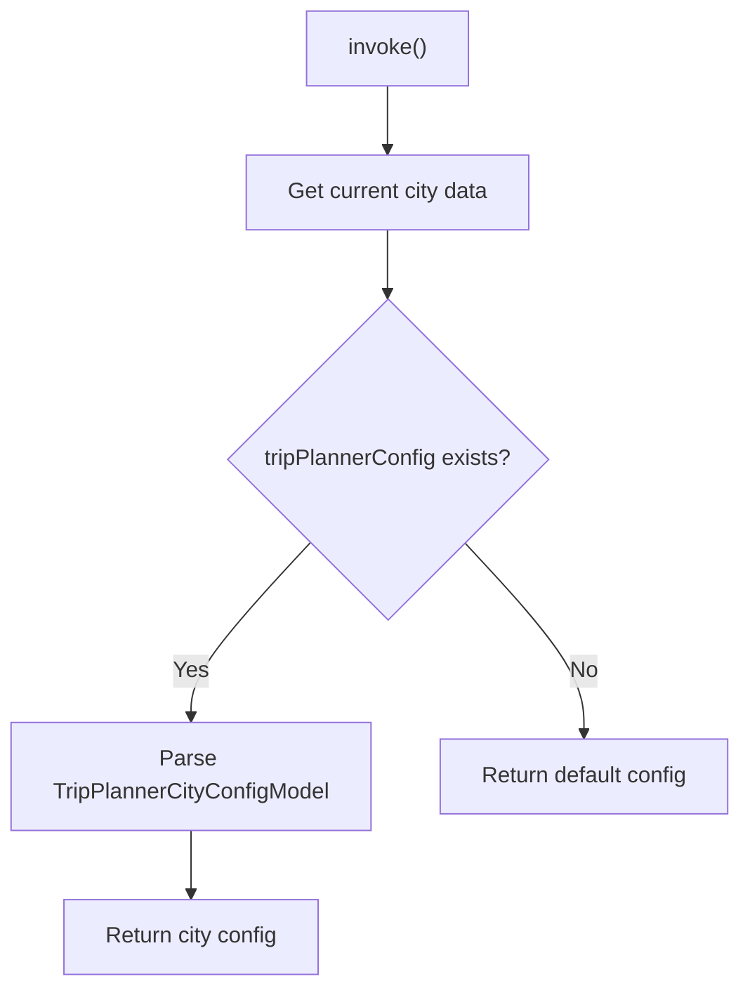

### Configuration Model (TripPlannerCityConfigModel)

| Field | Type | Description |
|-------|------|-------------|
| **enabledTabs** | `List<TripPlannerTabConfig>` | Available filter tabs |
| **defaultTab** | `TripPlannerTabType` | Initially selected tab |
| **hopThresholdForFetch** | `Int?` | Scroll threshold to fetch HOP results |
| **showChaloBusTabTooltip** | `Boolean` | Show premium bus tooltip |

### Tab Configuration (TripPlannerTabConfig)

| Field | Type | Description |
|-------|------|-------------|
| **type** | `TripPlannerTabType` | Tab identifier (ALL, DIRECT, BUS, METRO, CHALO_BUS) |
| **makesApiCall** | `Boolean` | Whether selecting this tab triggers an API call |
| **mode** | `ChaloTransitMode` | Transit mode for filtering |
| **numberOfLegs** | `Int` | Leg count filter (-1 for any) |
| **serviceType** | `RouteServiceType` | REGULAR, PREMIUM, or ALL |

---

## ProcessTripPlannerItineraryForUiUseCase

Transforms API-level itinerary models into UI-ready structures with formatted strings, calculated values, and display hints.

### Dependencies

| Dependency | Purpose |
|------------|---------|
| **CurrencyFeature** | Currency symbol formatting |
| **TimeUtilsContract** | Duration formatting |
| **ProcessTripPlannerLegForUiUseCase** | Individual leg processing |

### Transformation Flow

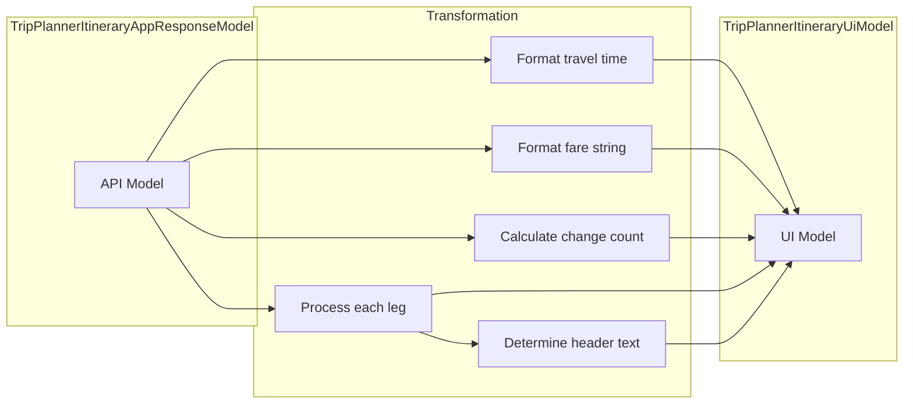

### Output Fields

| Field | Derivation | Example |
|-------|------------|---------|
| **localId** | Direct from API | "itinerary_123" |
| **travelTimeString** | `travelTimeInSeconds * 1000` formatted | "45 min" |
| **changeCount** | Count of relevant legs minus one | `2` |
| **fareString** | Currency symbol + totalFare | "Rs 35" |
| **etaString** | Initially null, updated by LiveInfoManager | "10 min" |
| **seatAvailabilityLevel** | Initially null, updated by LiveInfoManager | `AVAILABLE` |
| **scheduledStringFromFirstLeg** | From first bus/metro leg | "Every 10 min" |
| **fromLegHeaderText** | Based on mode and change count | `BUS_FROM` or `FIRST_BUS_FROM` |
| **firstModeFromStopName** | First stop name of first relevant leg | "MG Road" |
| **rank** | Direct from API | `1` |
| **legs** | Processed via ProcessTripPlannerLegForUiUseCase | List of UI leg models |

### Change Count Calculation

The change count represents the number of transfers, calculated as the count of "relevant primary legs" minus one.

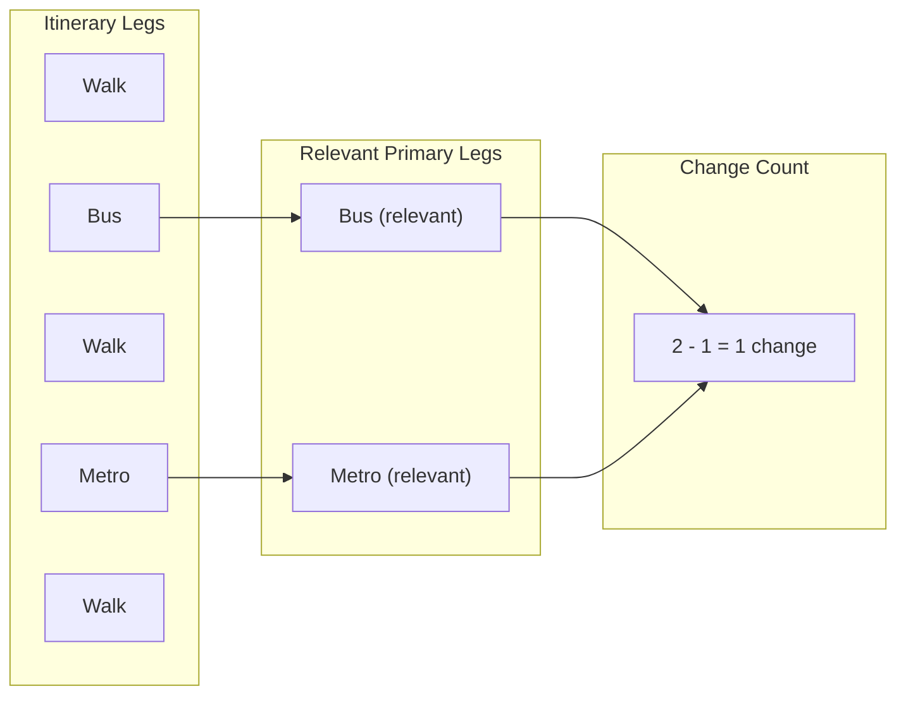

A leg is "relevant primary" if `isRelevantPrimaryLeg()` returns true, which is only for Bus and Metro legs.

### Header Text Logic

| Condition | First Leg Type | Header Text |
|-----------|----------------|-------------|
| Direct route (0 changes) | Bus | `BUS_FROM` |
| Direct route (0 changes) | Metro | `METRO_FROM` |
| Multi-leg route | Bus | `FIRST_BUS_FROM` |
| Multi-leg route | Metro | `FIRST_METRO_FROM` |
| Other modes | Any | `null` |

---

## ProcessTripPlannerLegForUiUseCase

Transforms individual leg API models into display-ready UI models with mode-specific formatting.

### Dependencies

| Dependency | Purpose |
|------------|---------|
| **GetTimeTableDisclaimerTextUseCase** | Disclaimer text retrieval |
| **StringProvider** | Localized string formatting |
| **CurrencyFeature** | Currency symbol |
| **TimeUtilsContract** | Time formatting |

### Mode-Specific Processing

Each transit mode produces a specialized `TripPlannerLegUiModel` variant with relevant display properties.

#### Walk Leg

| Output Field | Source | Example |
|--------------|--------|---------|
| **lastStop** | `endPlaceName` | "City Center" |
| **travelTimeString** | Formatted duration | "5 min" |

#### Auto/Taxi Leg

| Output Field | Source | Example |
|--------------|--------|---------|
| **lastStop** | `endPlaceName` | "Railway Station" |
| **travelTimeString** | Formatted duration | "15 min" |
| **fare** | Formatted fare | "Rs 50" |

#### Bus Leg

| Output Field | Source | Example |
|--------------|--------|---------|
| **routeId** | Direct mapping | "ROUTE_123" |
| **routeName** | Direct mapping | "17A" |
| **routeSchemeType** | Direct mapping | `NUMERIC` |
| **firstStopName** | `firstStop.stopName` | "MG Road" |
| **routeLastStopName** | Last stop name (direction) | "Central Station" |
| **via** | Optional via text | "via Ring Road" |
| **tags** | Route tags | ["AC", "EXPRESS"] |
| **scheduledString** | From frequency/timetable | "Every 15 min" |
| **intermediateStopsList** | Stop names between boarding/alighting | ["Stop A", "Stop B"] |
| **intermediateStopsCountExcludingStartAndLastStop** | Calculated | `5` |
| **fare** | Formatted fare | "Rs 25" |
| **travelTimeString** | Formatted duration | "30 min" |
| **etaString** | Initially null | "10 min" |
| **seatAvailabilityLevel** | Initially null | `AVAILABLE` |
| **disclaimerText** | From timetable status | "Timings may vary" |
| **routeType** | Service type | `PREMIUM` |
| **trackBusBtnString** | Button label | "Track Bus" |
| **buyProductBtnString** | Button label | "Buy Ticket" |

#### Metro Leg

Same structure as Bus leg with additional fields:
- **routeColorName** - Metro line color name (e.g., "Blue Line")
- **routeColourHex** - Hex color code for styling (e.g., "#0000FF")

### Scheduled String Generation

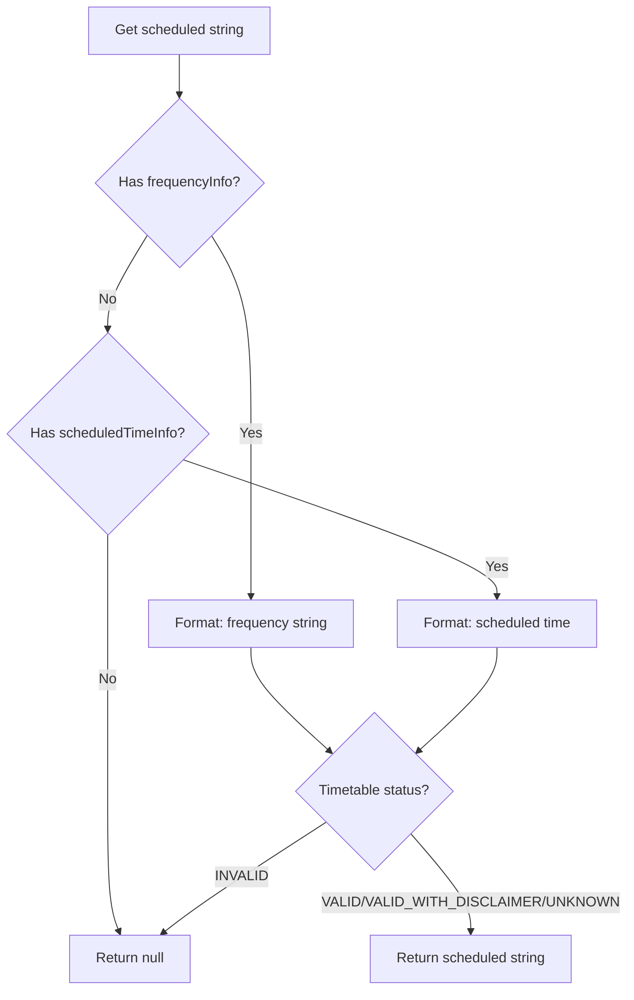

### Disclaimer Text Logic

| Timetable Status | Action |
|------------------|--------|
| **INVALID** | Return disclaimer text |
| **VALID_WITH_DISCLAIMER** | Return disclaimer text |
| **VALID** | Return null |
| **UNKNOWN** | Return null |

---

## TripPlannerItineraryLiveInfoManager

A long-running manager that maintains CRTS connections to fetch live ETAs for bus legs in displayed itineraries. It also polls for seat availability information and combines both into a unified result stream.

### Architecture

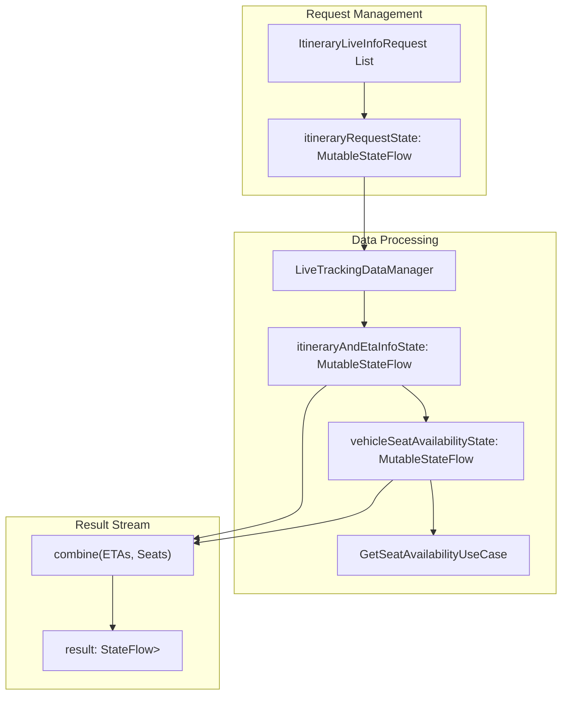

### Request Types

The manager supports two request types via the `ItineraryLiveInfoRequest` sealed class.

#### FirstValidVehicle

Used when the component needs the next available bus, typically for multi-leg itineraries from the location-based trip planner where the user hasn't committed to a specific vehicle.

| Field | Description |
|-------|-------------|
| **id** | Itinerary identifier |
| **routeId** | Bus route identifier |
| **stopId** | Boarding stop identifier |
| **minimumArrivalTimeInMillis** | Earliest acceptable arrival time (when user would reach stop) |

#### SpecificVehicle

Used when the API already provided a specific vehicle assignment, typically for stop-based direct routes from the v6 endpoint.

| Field | Description |
|-------|-------------|
| **id** | Itinerary identifier |
| **routeId** | Bus route identifier |
| **stopId** | Boarding stop identifier |
| **vehicleNumber** | Specific vehicle to track |

### ETA Subscription Flow

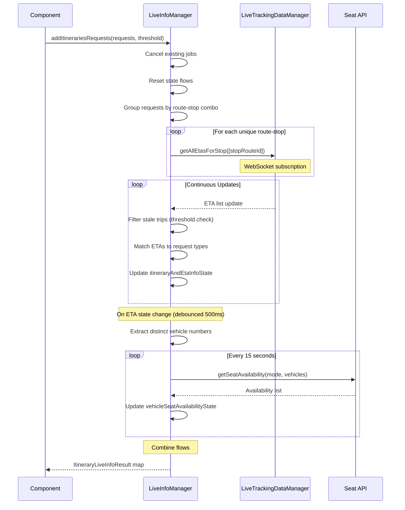

### ETA Filtering Logic

The manager applies several filters to ensure only relevant ETAs are surfaced.

#### Stale Trip Filtering

| Condition | Action |
|-----------|--------|
| ETA exceeds threshold (e.g., 60 minutes) | Exclude from results |
| No threshold configured | Include all ETAs |

#### Request Type Filtering

| Request Type | Filter Logic |
|--------------|--------------|
| **FirstValidVehicle** | Arrival time >= minimumArrivalTimeInMillis AND arrival time >= current time |
| **SpecificVehicle** | Vehicle number exact match (no time filtering) |

### ETA Selection Strategy

For `FirstValidVehicle` requests:
1. Filter ETAs to those arriving after user's minimum arrival time
2. Filter to those arriving after current time
3. Select first matching ETA (closest arrival)
4. If no match, return null

For `SpecificVehicle` requests:
1. Find ETA with exact vehicle number match
2. Return that ETA regardless of timing
3. If no match, return null

### Seat Availability Polling

The manager polls seat availability every 15 seconds for all vehicles with active ETAs.

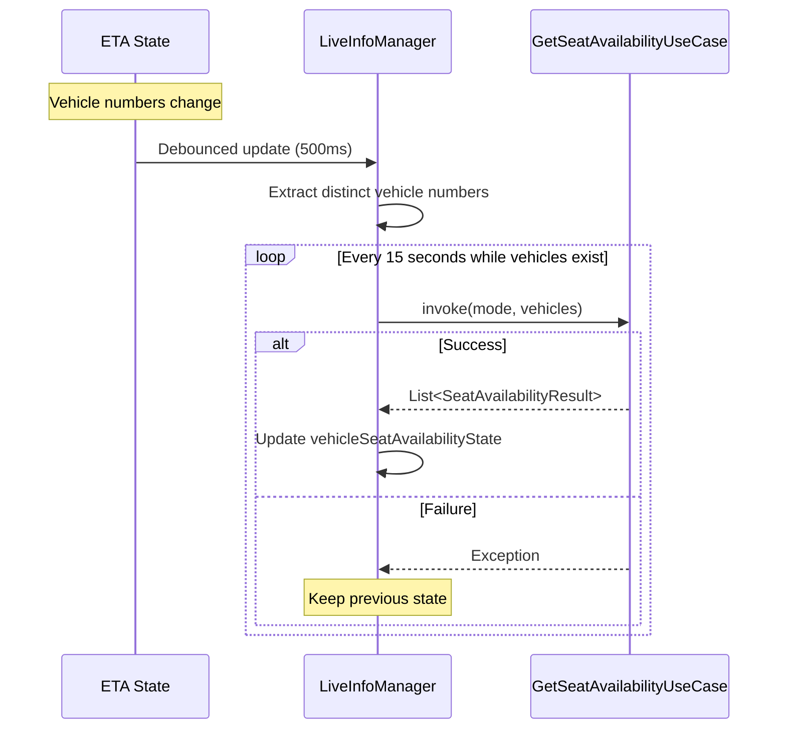

### Result Model (ItineraryLiveInfoResult)

| Field | Type | Description |
|-------|------|-------------|
| **itineraryInfo** | `ItineraryLiveInfoRequest` | Original request |
| **validEta** | `ItineraryEtaInfo?` | Matched ETA or null |
| **seatOccupancyStatus** | `SeatAvailabilityLevel?` | Seat availability level |

### ETA Info Model (ItineraryEtaInfo)

| Field | Type | Description |
|-------|------|-------------|
| **etaInSeconds** | `Long` | ETA from CRTS |
| **vehicleNumber** | `String` | Vehicle identifier |
| **etaTimeStamp** | `Long` | When ETA was calculated |
| **isBusHalted** | `Boolean` | Whether bus is stopped |
| **etaDelayedByInMins** | `Long?` | Delay in minutes if exceeds threshold |

### Lifecycle Management

| Method | Action |
|--------|--------|
| **addItinerariesRequests(requests, threshold)** | Cancels existing jobs, resets state, starts new subscriptions |
| **clear()** | Cancels coroutine scope, clears all jobs |

---

## Error Handling Summary

| Use Case | Error Type | Handling |
|----------|------------|----------|
| **MakeTripPlannerCallUseCase** | TripPlannerCallFailedException | Returns `Failure(ServerError(null))` |
| **MakeTripPlannerCallUseCase** | ChaloLocalException | Returns `Failure(LocalError)` |
| **MakeTripPlannerCallUseCase** | NetworkSuccessResponseParseException | Returns `Failure(ParsingError)` |
| **MakeTripPlannerCallUseCase** | Other Exception | Returns `Failure(UnknownError)` |
| **GetTripPlannerConfigForCityUseCase** | Missing config | Returns default config |
| **TripPlannerItineraryLiveInfoManager** | CRTS error | Emits null ETA for affected itineraries |
| **TripPlannerItineraryLiveInfoManager** | Seat API error | Keeps previous seat availability state |

---

## Threading Model

All use cases are suspend functions designed to run on coroutines:

| Component | Threading |
|-----------|-----------|
| **MakeTripPlannerCallUseCase** | Caller's dispatcher (typically Main) |
| **ProcessTripPlannerItineraryForUiUseCase** | Pure computation, thread-safe |
| **ProcessTripPlannerLegForUiUseCase** | Pure computation, thread-safe |
| **TripPlannerItineraryLiveInfoManager** | Internal CoroutineScope with SupervisorJob |
