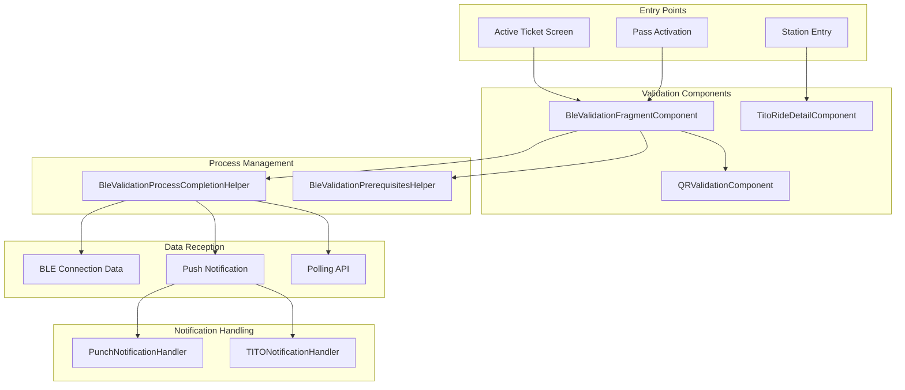
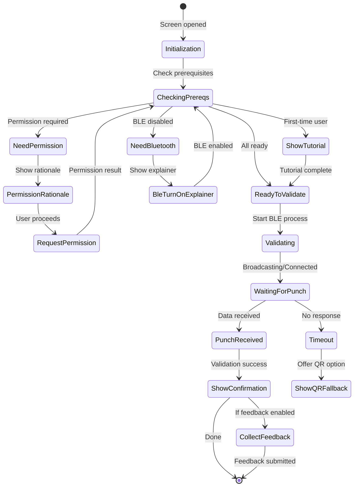
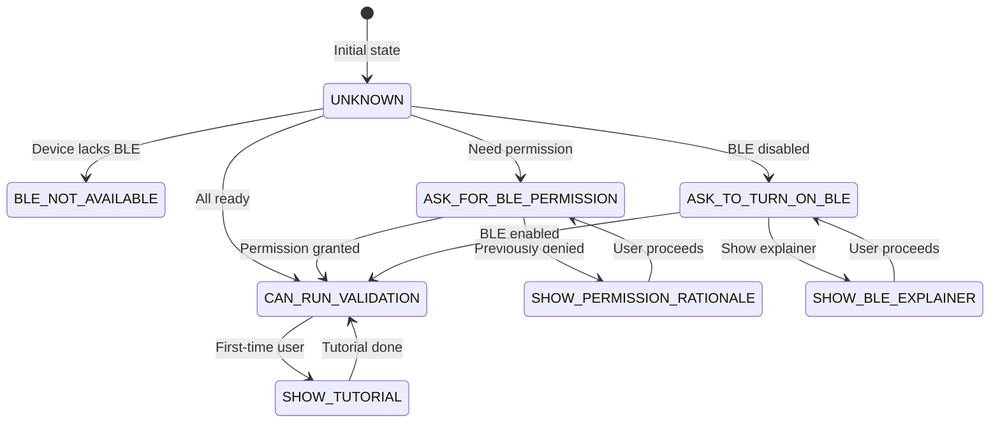
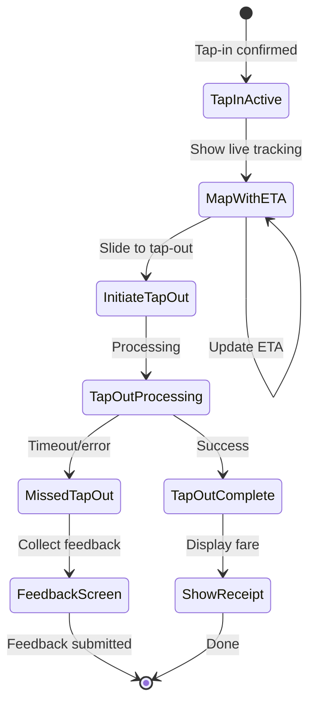
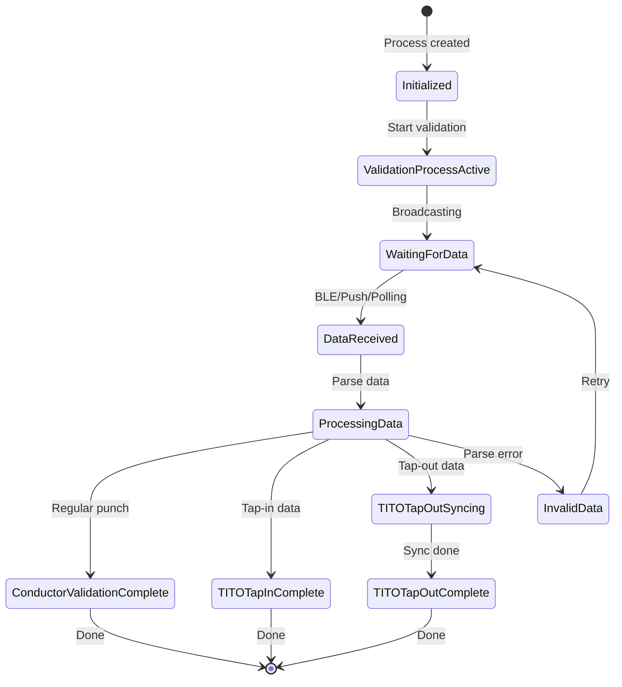
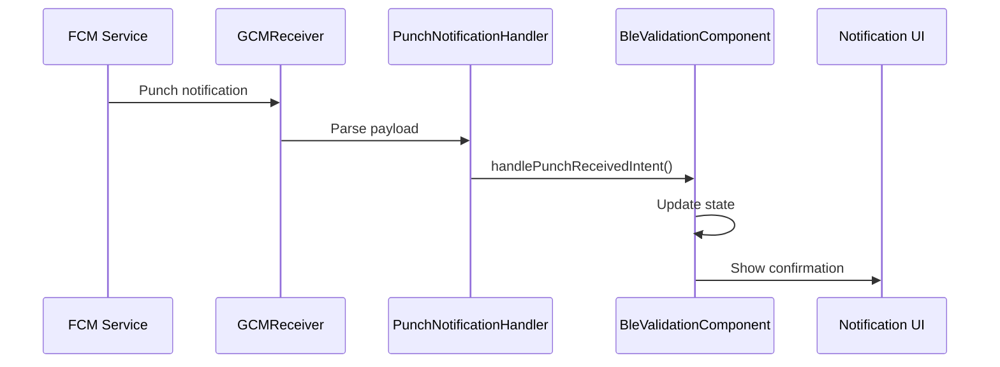
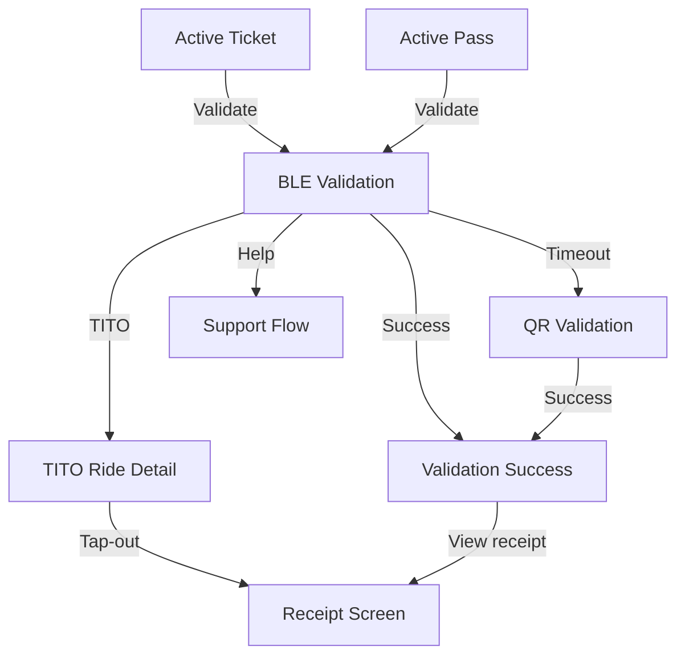

# Validation — Component Documentation

## Architecture Overview

The Validation presentation layer manages ticket and pass validation across multiple methods: BLE (Bluetooth Low Energy), QR codes, sound-based validation, and tap-in/tap-out (TITO). The architecture uses platform-specific components for Android's BLE stack while sharing domain logic. A process completion helper orchestrates the validation lifecycle, handling data from BLE connections, push notifications, and polling APIs.

---

## Screen Inventory

| Screen | Component | Purpose |
|--------|-----------|---------|
| **BLE Validation** | BleValidationFragmentComponent | Primary BLE-based ticket validation |
| **QR Validation** | QRValidationComponent | Fallback QR code validation |
| **TITO Ride Detail** | TitoRideDetailComponent | Tap-in/tap-out ride tracking |
| **TITO Onboarding** | TitoRideDetailComponent | First-time TITO tutorial |
| **Punch Notification** | PunchNotificationHandler | Display validation confirmations |

---

## BLE Validation Screen

The BLE validation component manages the entire Bluetooth-based validation flow, handling prerequisites, device scanning, connection, and punch receipt processing.

### User Journey

1. User navigates from active ticket or pass
2. Component checks BLE prerequisites (permission, Bluetooth state)
3. If prerequisites not met, shows appropriate explainer/rationale
4. Once ready, begins BLE broadcast/scanning
5. Connects to ETM (Electronic Ticket Machine)
6. Sends ticket/pass data via GATT
7. Receives validation confirmation via BLE, push, or polling
8. Shows punch notification and updates ticket status
9. Optionally collects ride feedback

### State Flow

### View State Structure

| Field | Type | Description |
|-------|------|-------------|
| **layoutType** | BleValidationLayoutType | Current screen layout |
| **bleValidationLayoutInfo** | BleValidationLayoutInfo | GIF URLs, hash codes, product details |
| **validationProcessSpecificInfo** | ValidationProcessInfo | Tone, QR codes, activation status |
| **bleValidationBottomsheetType** | BottomSheetType? | Current bottom sheet |
| **shouldShowBleValidationExpiredDialog** | Boolean | Activation expiry state |
| **isWaitingForPunchNotification** | Boolean | Waiting for validation data |

### Layout Types

| Type | Description |
|------|-------------|
| **BLE_VALIDATION** | Main validation screen |
| **BLE_TURN_ON_FULL_SCREEN_EXPLAINER** | Bluetooth enable prompt |
| **NEARBY_DEVICES_PERMISSION_EXPLAINER** | Permission rationale |
| **TAP_TO_VALIDATE_TUTORIAL** | First-time tutorial |
| **VALIDATION_SUCCESS** | Punch confirmed |
| **VALIDATION_EXPIRED** | Ticket/pass expired |

### Intents

| Intent | Trigger | Action |
|--------|---------|--------|
| **InitializationIntent** | Screen mount | Setup validation process |
| **BlePermissionsUpdatedIntent** | Permission change | Update prerequisites state |
| **PunchReceivedIntent** | Validation complete | Process punch data |
| **UseQRCodeClickedIntent** | QR button tap | Switch to QR validation |
| **UnableToVerifyTapHereClickedIntent** | Help tap | Show support options |
| **RideFeedbackRatingSelectedIntent** | Star rating tap | Update selected rating |
| **RideFeedbackSubmittedIntent** | Submit button | Send feedback |
| **DismissBottomSheetIntent** | Sheet dismiss | Close bottom sheet |
| **RetryValidationIntent** | Retry button | Restart BLE process |

### Bottom Sheet Types

| Type | Trigger | Content |
|------|---------|---------|
| **PermissionRationaleSheet** | Permission denied | Why permission needed |
| **PostValidationSheet** | Punch received | Success confirmation |
| **FeedbackSheet** | After validation | Rating collection |
| **ErrorSheet** | Validation error | Error with retry option |
| **QRFallbackSheet** | Timeout | QR option prompt |

### Side Effects

| Effect | When Triggered | Result |
|--------|----------------|--------|
| **RequestBlePermission** | Permission needed | System permission dialog |
| **EnableBluetooth** | BLE disabled | System BLE enable prompt |
| **NavigateToQRValidation** | QR fallback | Open QR screen |
| **ShowPunchNotification** | Punch received | Display confirmation |
| **NavigateToSupport** | Help clicked | Open support flow |
| **SubmitFeedback** | Feedback sent | API call for feedback |

---

## BLE Prerequisites Management

The prerequisites helper manages Bluetooth and permission states before validation can begin.

### Prerequisites State Flow

### Prerequisites States

| State | Meaning | Action |
|-------|---------|--------|
| **UNKNOWN** | Not yet checked | Run checks |
| **BLE_NOT_AVAILABLE** | Device lacks Bluetooth | Show QR only |
| **ASK_FOR_BLE_PERMISSION** | Permission not granted | Request permission |
| **SHOW_PERMISSION_RATIONALE** | Need to explain permission | Show bottom sheet |
| **SHOW_TURN_ON_BLE_EXPLAINER** | BLE disabled | Show full-screen explainer |
| **SHOW_TAP_TO_VALIDATE_TUTORIAL** | First-time user | Show tutorial |
| **CAN_RUN_VALIDATION** | All prerequisites met | Begin validation |
| **BLE_TURN_ON_FAILED** | User declined BLE | Show QR fallback |

---

## QR Validation Screen

The QR validation component provides fallback validation when BLE is unavailable or times out.

### User Journey

1. User arrives from BLE timeout or direct entry
2. QR code displayed (static or dynamic)
3. Conductor scans QR code
4. Server validates and sends push notification
5. Component receives punch notification
6. Shows validation success

### QR Types

| Type | Description | Refresh |
|------|-------------|---------|
| **Static QR** | Pre-generated code | No refresh |
| **Dynamic QR (V2)** | Activation-based code | Periodic refresh |

### Intents

| Intent | Trigger | Action |
|--------|---------|--------|
| **InitializationIntent** | Screen mount | Generate/fetch QR |
| **RefreshQRIntent** | Refresh button | Regenerate dynamic QR |
| **PunchReceivedIntent** | Push notification | Show success |

---

## TITO Ride Detail Screen

The TITO component manages tap-in/tap-out ride tracking with live updates.

### User Journey

1. User taps in at station entry
2. Screen shows active ride with ETA
3. Live tracking displays current position
4. User slides to initiate tap-out
5. Tap-out processed at exit
6. Fare calculated and receipt shown
7. If tap-out missed, feedback collected

### State Flow

### Screen Types

| Type | Description |
|------|-------------|
| **MAP_WITH_ETA_BOTTOM_SHEET** | Live tracking with ETA display |
| **MISSED_TAP_OUT_FEEDBACK_SCREEN** | Feedback collection for missed tap-out |
| **TITO_ONBOARDING_SCREEN** | First-time tutorial |
| **TITO_ONBOARDING_FINISH_SCREEN** | Onboarding completion |

### TITO Status

| Status | Meaning |
|--------|---------|
| **TAP_IN_DONE** | Tap-in recorded, ride active |
| **VERIFIED_TAP_OUT_DONE** | Both tap-in and tap-out complete |
| **MISSED_TAP_OUT** | Tap-out not recorded |

### Intents

| Intent | Trigger | Action |
|--------|---------|--------|
| **SlideToTapOutIntent** | Slide gesture | Initiate tap-out |
| **MissedTapOutIntent** | System detection | Mark ride as missed |
| **TapOutMissedFeedbackSubmitIntent** | Submit button | Send feedback |
| **ViewReceiptIntent** | Receipt button | Show fare details |

---

## Validation Process Helper

The process completion helper orchestrates validation across multiple data reception channels.

### Process Status Flow

### Data Reception Channels

| Channel | Description | Usage |
|---------|-------------|-------|
| **BLE Connection** | Two-way BLE communication | Primary for conductor validation |
| **Push Notification** | FCM-delivered punch data | Backup for BLE |
| **Polling API** | Backend polling | Premium bus, TITO fallback |

---

## Punch Notification Handler

Handles display of validation confirmation notifications.

### Notification Types

| Type | Description |
|------|-------------|
| **PUNCH_SUCCESSFUL** | Validation completed |
| **PUNCH_FAILED** | Validation error |
| **PUNCH_EXPIRED** | Ticket/pass expired |
| **ALREADY_PUNCHED** | Already validated |
| **INVALID_ROUTE** | Wrong route |
| **DEVICE_NOT_FOUND** | ETM not found |

### Notification Flow

---

## Navigation Flow

---

## Analytics Events

| Event | Screen | Trigger |
|-------|--------|---------|
| **ticket_validation_started** | BLE Validation | Screen opened |
| **ble_permission_requested** | BLE Validation | Permission dialog |
| **ble_connection_established** | BLE Validation | Device connected |
| **ticket_punched** | BLE/QR Validation | Validation success |
| **validation_failed** | BLE/QR Validation | Validation error |
| **qr_fallback_shown** | BLE Validation | QR option displayed |
| **tito_tap_in** | TITO Detail | Tap-in confirmed |
| **tito_tap_out** | TITO Detail | Tap-out confirmed |
| **ride_feedback_submitted** | BLE Validation | Feedback sent |

---

## Error Handling

| Error Scenario | Screen | UI Response |
|----------------|--------|-------------|
| **BLE not available** | BLE Validation | Show QR only option |
| **Permission denied** | BLE Validation | Show rationale sheet |
| **Bluetooth disabled** | BLE Validation | Show enable explainer |
| **Device not found** | BLE Validation | Timeout with QR fallback |
| **Connection failed** | BLE Validation | Retry with backoff |
| **Already punched** | Notification | Show already validated |
| **Wrong route** | Notification | Show route mismatch |
| **Ticket expired** | BLE Validation | Show expired dialog |
| **Missed tap-out** | TITO Detail | Show feedback screen |

---

## Platform Differences

### Android-Specific

| Feature | Implementation |
|---------|----------------|
| **BLE Stack** | Native Android Bluetooth APIs |
| **Permission** | Nearby Devices permission (Android 12+) |
| **Background** | Foreground service for scanning |
| **GATT** | Platform-specific GATT handling |

### iOS-Specific

| Feature | Implementation |
|---------|----------------|
| **BLE Stack** | CoreBluetooth framework |
| **Permission** | Bluetooth permission prompt |
| **Background** | Background modes for BLE |
| **Limitation** | BLE limited to Premium Reserve tickets |
