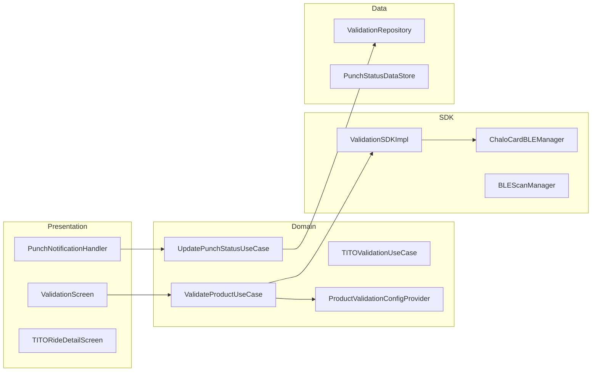

# Validation — High-Level Design

## Overview

The Validation feature handles ticket and pass validation for various Chalo products. It supports multiple validation methods including BLE (Bluetooth Low Energy) scanning, QR codes, tap-in/tap-out (TITO), and conductor validation. The system is built around a plugin architecture with `ProductValidationConfig` to handle different product types uniformly.

## User Journey

1. **Entry Points**:
   - Active ticket → Validate button
   - Bus boarding → Conductor scan
   - Station entry → Tap-in terminal
   - Pass activation → Auto validation

2. **Core Flow**:
   - User initiates validation
   - System detects validation method (BLE/QR/NFC)
   - Connects to validation terminal
   - Sends ticket/pass data
   - Receives validation confirmation
   - Updates ticket status locally
   - Shows punch notification

3. **Exit Points**:
   - Validation success → Ticket marked punched
   - Validation failure → Retry or manual validation
   - Timeout → Error message

## Architecture Diagram



## Key Components

| Component | Platform | File Path | Responsibility |
|-----------|----------|-----------|----------------|
| `ValidationSDKImpl` | Shared | `shared/validationsdk/.../ValidationSDKImpl.kt` | Core validation orchestration |
| `ChaloCardBLEManager` | Shared | `shared/validationsdk/.../chalocard/ChaloCardBLEManager.kt` | BLE device management |
| `ProductValidationConfig` | Shared | `shared/home/.../validation/ProductValidationConfig.kt` | Product-specific config |
| `PunchNotificationHandler` | Shared | `shared/home/.../notification/punch/PunchNotificationHandler.kt` | Punch notification display |
| `TITORideDetailComponent` | Shared | `shared/home/.../tito/titoridedetail/ui/TITORideDetailComponent.kt` | TITO ride tracking |

## Data Flow

### BLE Validation Flow
1. User approaches ETM (Electronic Ticket Machine)
2. `BLEScanManager` discovers BLE devices
3. `ChaloCardBLEManager` connects to terminal
4. `ValidationSDKImpl` sends ticket data via GATT
5. Terminal validates and responds
6. `UpdatePunchStatusUseCase` updates local state
7. Push notification confirms punch

### QR Validation Flow
1. Conductor scans QR code on ticket
2. Server validates ticket authenticity
3. Push notification sent to user
4. `PunchNotificationHandler` displays status
5. Local ticket status updated

### TITO Flow
1. User taps in at station entry
2. `TITOValidationUseCase` records entry
3. Trip tracking begins
4. User taps out at exit
5. Fare calculated based on distance
6. Receipt generated

## Platform Differences

### Android-Specific
- Native BLE implementation via Android Bluetooth APIs
- `BroadcastReceiver` for BLE state changes
- Foreground service for background scanning
- Platform-specific GATT handling

### iOS-Specific
- CoreBluetooth framework integration
- `CBCentralManager` for BLE operations
- Background modes for BLE scanning
- iOS-specific permission handling

## Integration Points

### Analytics Events
- See [Analytics: validation](/analytics/flows/validation) for event documentation
- Key events:
  - `ticket_validation_started`
  - `ble_connection_established`
  - `ticket_punched`
  - `validation_failed`
  - `tito_tap_in`
  - `tito_tap_out`

### Shared Services
- **Notifications**: Punch notification delivery
- **Live Tracking**: TITO ride tracking
- **Ticket Storage**: Local ticket state

### Navigation
- **Navigates to**: Receipt, Ride details, Support
- **Navigated from**: Ticket activation, Pass screen

## Validation Types

### ProductValidationConfig
```kotlin
sealed class ProductValidationConfig {
    data class MTicket(val ticketId: String) : ProductValidationConfig()
    data class SuperPass(val passId: String) : ProductValidationConfig()
    data class PremiumBus(val bookingId: String) : ProductValidationConfig()
    data class Metro(val ticketId: String) : ProductValidationConfig()
    data class NCMC(val cardId: String) : ProductValidationConfig()
}
```

### Validation Methods
```kotlin
enum class ValidationMethod {
    BLE,           // Bluetooth Low Energy
    QR_SCAN,       // QR code scanning
    NFC,           // Near Field Communication
    MANUAL,        // Manual entry by conductor
    TITO           // Tap-in/Tap-out
}
```

## Punch Notification System

### Notification Types (34+ types)
```kotlin
enum class PunchNotificationType {
    PUNCH_SUCCESSFUL,
    PUNCH_FAILED,
    PUNCH_EXPIRED,
    ALREADY_PUNCHED,
    INVALID_ROUTE,
    DEVICE_NOT_FOUND,
    // ... and more
}
```

### Notification Flow
1. FCM delivers punch notification
2. `PunchNotificationHandler` parses payload
3. Displays in-app notification card
4. Updates local punch status
5. Refreshes ticket UI state

## BLE State Machine

### BLEConnectionState
```kotlin
sealed class BLEConnectionState {
    object Idle : BLEConnectionState()
    object Scanning : BLEConnectionState()
    data class Connecting(val device: BLEDevice) : BLEConnectionState()
    data class Connected(val device: BLEDevice) : BLEConnectionState()
    data class Validating(val device: BLEDevice) : BLEConnectionState()
    data class Success(val response: ValidationResponse) : BLEConnectionState()
    data class Error(val error: BLEError) : BLEConnectionState()
}
```

## Edge Cases & Error Handling

| Scenario | Handling |
|----------|----------|
| BLE not enabled | Prompts to enable Bluetooth |
| Device not found | Shows scan timeout message |
| Connection failed | Retry with backoff |
| Already punched | Shows "already validated" |
| Wrong route | Shows route mismatch error |
| Network offline | Queues for retry |
| TITO tap-out missed | Auto-closes ride with max fare |

## Performance Configuration

| Parameter | Value |
|-----------|-------|
| BLE scan timeout | 30 seconds |
| Connection timeout | 10 seconds |
| GATT operation timeout | 5 seconds |
| Retry attempts | 3 |
| Background scan interval | 15 seconds |

## Dependencies

### Internal
- `shared:validationsdk` — Core validation logic
- `shared:home` — Ticket and pass screens
- `shared:notification` — Punch notifications
- `shared:core` — Base utilities

### External
- Android Bluetooth APIs — BLE on Android
- CoreBluetooth — BLE on iOS
- FCM — Push notifications
- SQLDelight — Local state storage
