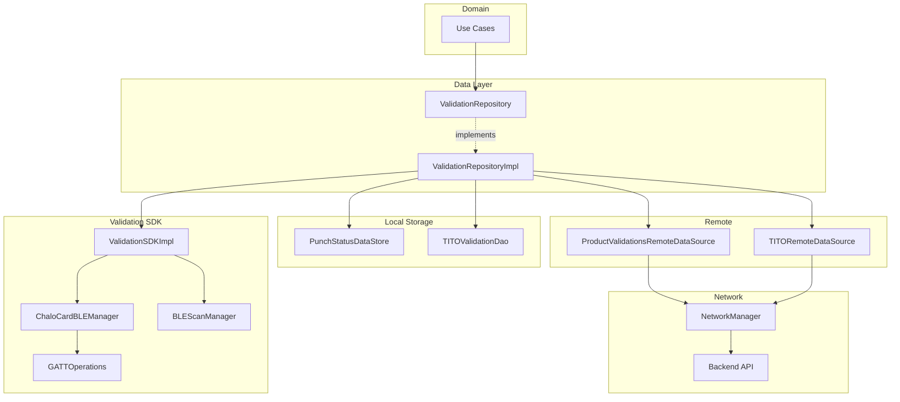
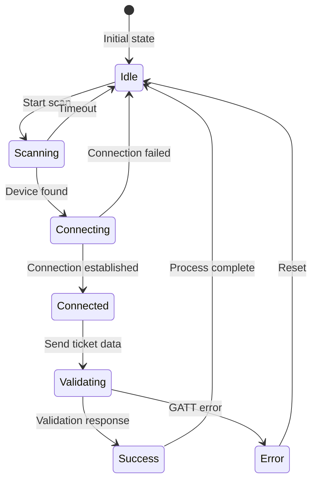
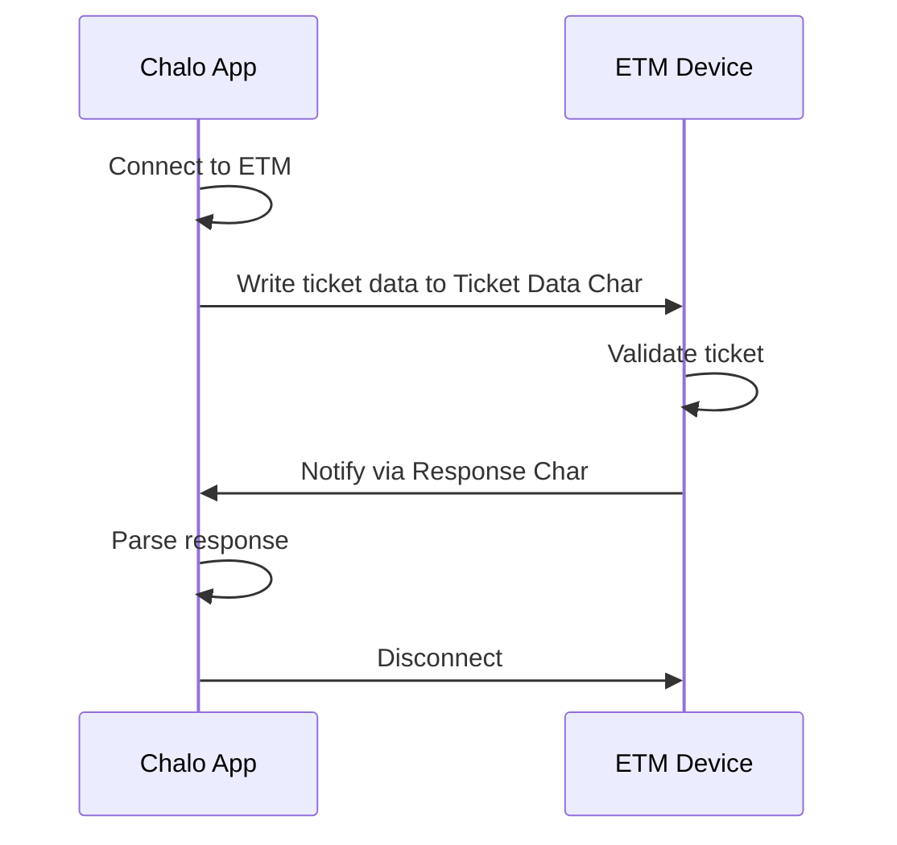
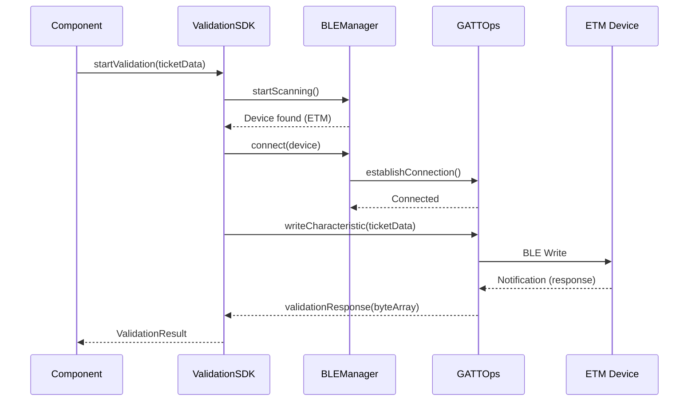
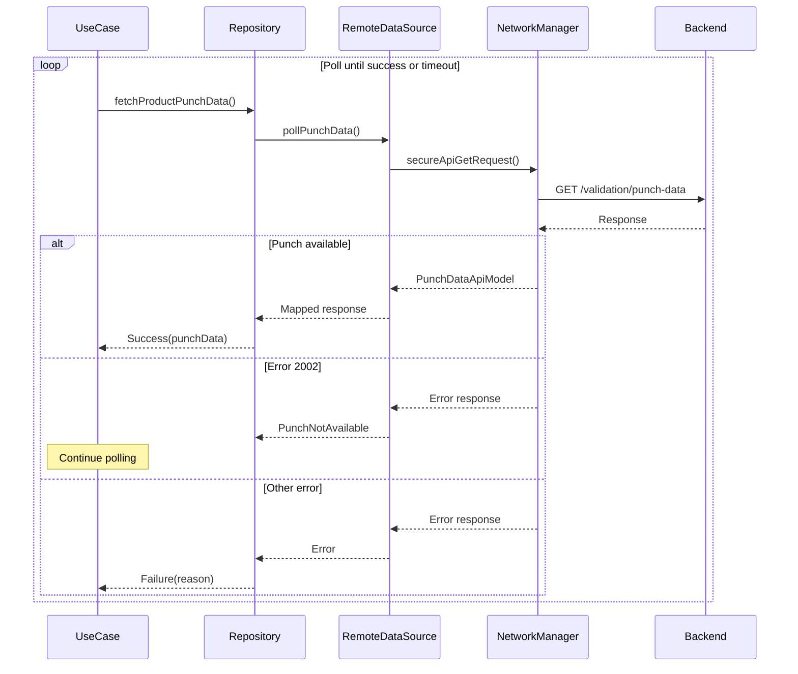
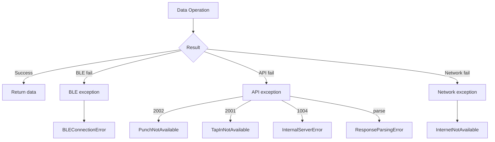

# Validation — Repository Documentation

## Data Layer Overview

The Validation data layer manages BLE communication, API polling, and local punch status persistence. The core of the layer is the ValidationSDK which handles Bluetooth Low Energy operations, GATT communication, and device scanning. Remote data sources poll the backend for punch data, while local data sources persist validation state. The layer abstracts platform-specific BLE implementations behind common interfaces.

---

## Validation SDK Architecture

The ValidationSDK provides the core BLE validation functionality with platform-specific implementations.

### SDK Components

| Component | Platform | Purpose |
|-----------|----------|---------|
| **ValidationSDKImpl** | Shared | Validation orchestration |
| **ChaloCardBLEManager** | Shared | BLE device management |
| **BLEScanManager** | Platform-specific | Device discovery |
| **GATTOperations** | Platform-specific | GATT read/write |

### BLE Connection State Machine

### BLE Connection States

| State | Description |
|-------|-------------|
| **Idle** | No active BLE operation |
| **Scanning** | Scanning for ETM devices |
| **Connecting** | Establishing connection |
| **Connected** | Connection established |
| **Validating** | Sending/receiving data |
| **Success** | Validation complete |
| **Error** | Operation failed |

---

## Repository Interface

The `ValidationRepository` interface defines validation data operations.

### Punch Data Operations

| Method | Purpose | Returns |
|--------|---------|---------|
| **fetchProductPunchData** | Poll for punch data | ProductPunchDataResult |
| **savePunchStatus** | Persist punch locally | Unit |
| **getPunchStatus** | Get local punch status | PunchStatus? |
| **clearPunchStatus** | Remove punch data | Unit |

### TITO Operations

| Method | Purpose | Returns |
|--------|---------|---------|
| **fetchTitoTapinInfo** | Poll for tap-in data | TITOTapInInfoResult |
| **saveTitoValidation** | Persist TITO locally | Unit |
| **getTitoValidation** | Get TITO status | TITOValidationAppModel? |
| **updateTitoStatus** | Update validation status | Unit |

### Configuration Operations

| Method | Purpose | Returns |
|--------|---------|---------|
| **getValidationMethodsConfig** | Fetch validation config | ValidationMethodsConfig |
| **isBleValidationEnabled** | Check BLE enabled | Boolean |

---

## API Endpoints

### Fetch Product Punch Data

Polls for conductor validation punch data.

| Property | Value |
|----------|-------|
| **Endpoint** | GET /validation/punch-data |
| **Auth** | Required |

**Query Parameters**

| Parameter | Type | Description |
|-----------|------|-------------|
| **productId** | String | Product identifier |
| **productType** | String | Product type |
| **activationId** | String | Activation identifier |

**Response: ProductPunchDataApiModel**

| Field | Type | Description |
|-------|------|-------------|
| **punchStatus** | String | Punch status |
| **punchTimestamp** | Long | When punched |
| **conductorId** | String? | Conductor identifier |
| **routeId** | String? | Route identifier |
| **stopId** | String? | Stop identifier |

**Error Codes**

| Code | Meaning |
|------|---------|
| **2002** | PunchNotAvailable |
| **1004** | InternalServerError |

---

### Fetch TITO Tap-In Info

Polls for tap-in data during TITO validation.

| Property | Value |
|----------|-------|
| **Endpoint** | GET /tito/tapin-info |
| **Auth** | Required |

**Query Parameters**

| Parameter | Type | Description |
|-----------|------|-------------|
| **activationId** | String | Activation identifier |
| **walletId** | String? | Wallet ID for QuickPay |

**Response: TITOTapInInfoApiModel**

| Field | Type | Description |
|-------|------|-------------|
| **tapInTimestamp** | Long | Tap-in time |
| **routeId** | String | Route identifier |
| **stopId** | String | Stop identifier |
| **tripNo** | String | Trip number |
| **vehicleNo** | String | Vehicle number |

**Error Codes**

| Code | Meaning |
|------|---------|
| **2001** | TAP_IN_NOT_AVAILABLE |
| **1004** | INTERNAL_SERVER_ERROR |

---

### Fetch Validation Methods Config

Retrieves city/product validation configuration.

| Property | Value |
|----------|-------|
| **Endpoint** | GET /config/validation-methods |
| **Auth** | Required |

**Query Parameters**

| Parameter | Type | Description |
|-----------|------|-------------|
| **cityId** | String | City identifier |
| **productType** | String | Product type |

**Response: ValidationMethodsConfigApiModel**

| Field | Type | Description |
|-------|------|-------------|
| **bleConfig** | BleConfigApiModel | BLE settings |
| **soundConfig** | SoundConfigApiModel | Sound settings |
| **twoWayBleConfig** | TwoWayBleConfigApiModel | Pilot settings |

---

### Submit Ride Feedback

Submits feedback after validation.

| Property | Value |
|----------|-------|
| **Endpoint** | POST /validation/feedback |
| **Auth** | Required |

**Request Body**

| Field | Type | Description |
|-------|------|-------------|
| **productId** | String | Product identifier |
| **rating** | Int | Star rating (1-5) |
| **comments** | String? | Optional comments |

**Response**

| Field | Type | Description |
|-------|------|-------------|
| **success** | Boolean | Submission status |

---

## BLE Communication Protocol

### GATT Service Structure

| UUID | Type | Description |
|------|------|-------------|
| **Validation Service** | Service | Main validation service |
| **Ticket Data Char** | Characteristic | Write ticket data |
| **Response Char** | Characteristic | Read validation response |
| **Notification Char** | Characteristic | Async notifications |

### Data Transmission Flow

### Validation Data Packet Structure

| Offset | Length | Field |
|--------|--------|-------|
| 0 | 1 | Validation type |
| 1 | 4 | Group number |
| 5 | 4 | Activation timestamp |
| 9 | 8 | Punch timestamp |
| 17 | varies | Route/stop/trip data |

### Validation Types

| Code | Type | Description |
|------|------|-------------|
| **1** | REGULAR_BUS_TAP_IN | TITO tap-in validation |
| **2** | REGULAR_BUS_TAP_OUT | TITO tap-out validation |
| **3** | PREMIUM_BUS_VALIDATION | Conductor punch |

---

## Data Flow Diagrams

### BLE Validation Flow

### Polling Flow

---

## Local Storage

### Database Entities

**PunchStatusEntity**

| Field | Type | Description |
|-------|------|-------------|
| **productId** | String (PK) | Product identifier |
| **punchStatus** | String | Status enum value |
| **punchTimestamp** | Long? | When punched |
| **conductorId** | String? | Conductor identifier |
| **routeId** | String? | Route at punch |
| **stopId** | String? | Stop at punch |
| **updatedAt** | Long | Last update time |

**TITOValidationEntity**

| Field | Type | Description |
|-------|------|-------------|
| **activationId** | String (PK) | Activation identifier |
| **userId** | String | User identifier |
| **titoStatus** | String | Status enum value |
| **tapInTimestamp** | Long? | Tap-in time |
| **tapInRouteId** | String? | Tap-in route |
| **tapInStopId** | String? | Tap-in stop |
| **tapOutTimestamp** | Long? | Tap-out time |
| **tapOutRouteId** | String? | Tap-out route |
| **tapOutStopId** | String? | Tap-out stop |
| **fareAmount** | Long? | Calculated fare |

### DataStore Operations

**PunchStatusDataStore**

| Method | Purpose |
|--------|---------|
| **savePunchStatus** | Persist punch |
| **getPunchStatus** | Retrieve punch |
| **clearPunchStatus** | Remove punch |
| **getAllPunches** | List all punches |

**TITOValidationDataSource**

| Method | Purpose |
|--------|---------|
| **saveValidation** | Persist TITO |
| **getValidation** | Retrieve TITO |
| **updateStatus** | Update status |
| **getActiveRides** | List active TITO |

---

## Configuration Models

### RegularBusProductValidationMethodsConfig

**BLE Configuration**

| Field | Type | Description |
|-------|------|-------------|
| **isEnabled** | Boolean | BLE enabled |
| **minAppVer** | Int | Minimum version |
| **maxAppVer** | Int | Maximum version |
| **showFeedbackPercentage** | Float | Feedback sampling rate |
| **timeoutToShowQrValidationOption** | Long | QR fallback timeout (ms) |
| **showQrOptionAfterNoBlePermAttemptsThreshold** | Int | Permission retry limit |
| **bleTutorialCountThreshold** | Int | Tutorial show limit |
| **isQRAsBackupMethodEnabled** | Boolean | QR fallback enabled |

**Sound Validation Configuration**

| Field | Type | Description |
|-------|------|-------------|
| **isEnabled** | Boolean | Sound validation enabled |
| **minAppVer** | Int | Minimum version |
| **maxAppVer** | Int | Maximum version |
| **blacklistedAppVer** | List<Int> | Blocked versions |

**Two-Way BLE Pilot Configuration**

| Field | Type | Description |
|-------|------|-------------|
| **isEnabled** | Boolean | Pilot enabled |
| **stopOperationsDelay** | Long | Delay before stop |
| **connectionReqMaxRetryCount** | Int | Connection retries |
| **oneWayBroadcastMaxRetryCount** | Int | Broadcast retries |
| **duplexConnDataTransferMaxRetryCount** | Int | Transfer retries |
| **retryActiveModeBroadcastDelay** | Long | Retry delay |
| **retryConnectionRequestDelay** | Long | Retry delay |

---

## Polling Configuration

### Default Values

| Parameter | Value | Description |
|-----------|-------|-------------|
| **Polling interval** | 2000ms | Between poll attempts |
| **Polling timeout** | 30000ms | Max polling duration |
| **TITO polling delay** | 10000ms | Initial delay for TITO |
| **TITO polling enabled** | false | Default off |

### TITO Polling Config

| Field | Description |
|-------|-------------|
| **isTitoTapinPollingEnabled** | Enable tap-in polling |
| **titoTapinPollingDelay** | Initial delay before polling |

---

## Exception Handling

### Exception Flow

### Exception Types

| Exception | When Thrown |
|-----------|-------------|
| **PunchNotAvailable** | Punch not yet received (2002) |
| **TapInNotAvailable** | Tap-in not recorded (2001) |
| **InternalServerError** | Server error (1004) |
| **InternetNotAvailable** | Network offline |
| **ResponseParsingError** | Parse failure |
| **BLEConnectionError** | BLE operation failed |
| **GATTError** | GATT operation failed |
| **DeviceNotFound** | ETM not discovered |

---

## Dependency Injection

### Module Bindings

| Interface | Implementation |
|-----------|----------------|
| ValidationRepository | ValidationRepositoryImpl |
| ValidationSDK | ValidationSDKImpl |
| ProductValidationsRemoteDataSource | ProductValidationsRemoteDataSourceImpl |
| TITOValidationDataSource | TITOValidationDataSourceImpl |
| PunchStatusDataStore | PunchStatusDataStoreImpl |

### SDK Dependencies

**ValidationSDKImpl**

| Dependency | Purpose |
|------------|---------|
| BLEScanManager | Device discovery |
| ChaloCardBLEManager | Connection management |
| GATTOperations | Data transfer |
| CoroutineScope | Async operations |

---

## Network Configuration

### Headers

All validation API calls include:

| Header | Value |
|--------|-------|
| Authorization | Bearer {token} |
| Content-Type | application/json |
| X-Platform | android/ios |
| X-App-Version | {version} |
| X-City-Id | {cityId} |

### Timeouts

| Operation | Timeout |
|-----------|---------|
| Config fetch | 15s |
| Punch polling | 30s |
| TITO polling | 30s |
| Feedback submit | 15s |

### BLE Timeouts

| Operation | Timeout |
|-----------|---------|
| Scan | 30s |
| Connection | 10s |
| GATT operation | 5s |
| Overall validation | 60s |

---

## Platform-Specific Implementation

### Android BLE

| Component | Description |
|-----------|-------------|
| **BluetoothAdapter** | System Bluetooth access |
| **BluetoothLeScanner** | BLE scanning |
| **BluetoothGatt** | GATT operations |
| **BroadcastReceiver** | State change listener |
| **ForegroundService** | Background scanning |

### iOS BLE

| Component | Description |
|-----------|-------------|
| **CBCentralManager** | Central role management |
| **CBPeripheral** | Peripheral handling |
| **CBCharacteristic** | GATT characteristics |
| **Background Modes** | Background scanning |

### BLE Retry Policy

| Scenario | Retries |
|----------|---------|
| Connection failed | 3 retries |
| GATT write failed | 2 retries |
| Scan timeout | 1 retry |
| Device not found | No retry (fallback to QR) |

---

## QuickPay OrderId Composition

For QuickPay products, the orderId is composed from wallet and expiry data.

### Composition Logic

| Input | Source | Description |
|-------|--------|-------------|
| **walletId** | BLE data field | User's wallet ID |
| **expiryTime** | BLE data field | Expiry timestamp |

### Utility Function

`ChaloWalletOrderIdUtils.createOrderIdFromWalletIdAndExpiryTime(walletId, expiryTime)`

Combines wallet ID and expiry time to create unique order identifier for QuickPay transactions.
