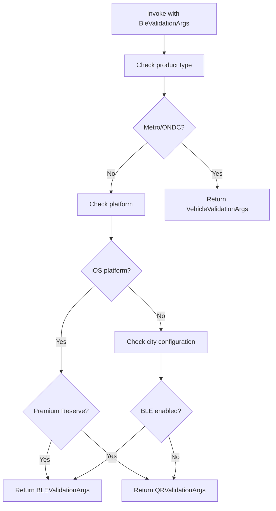
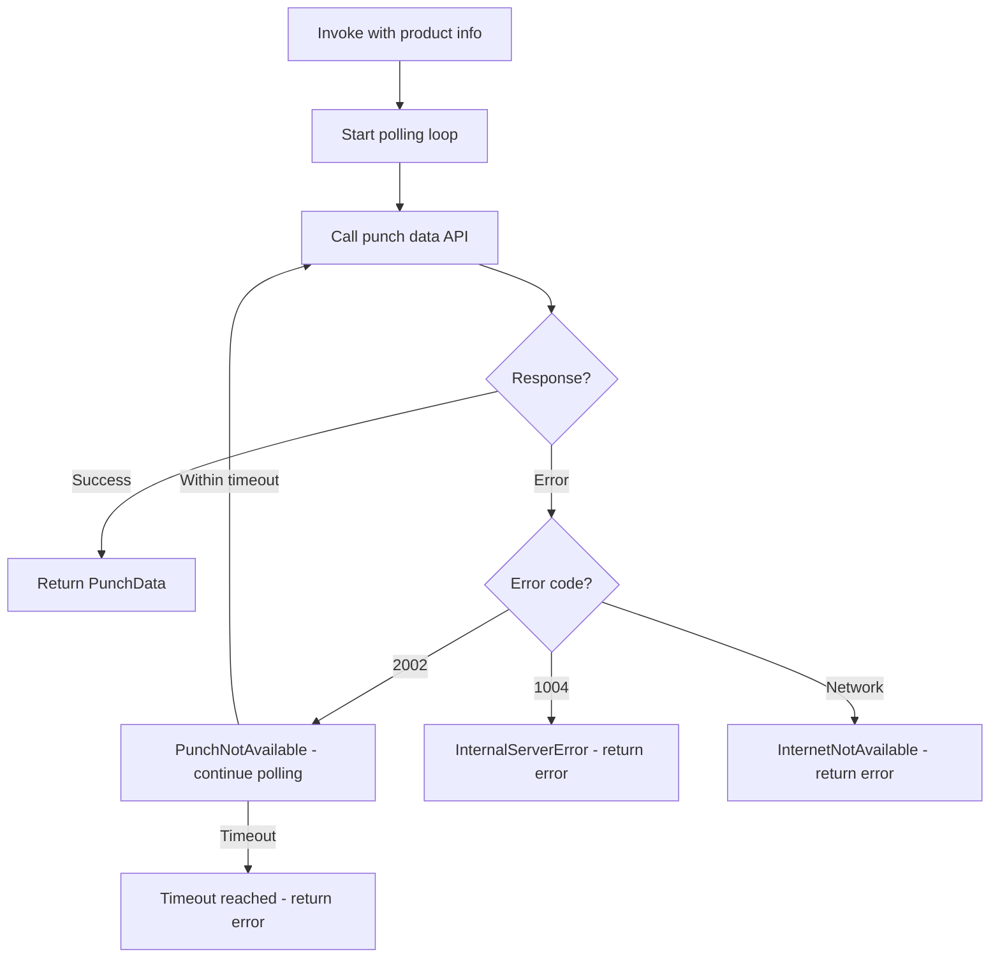
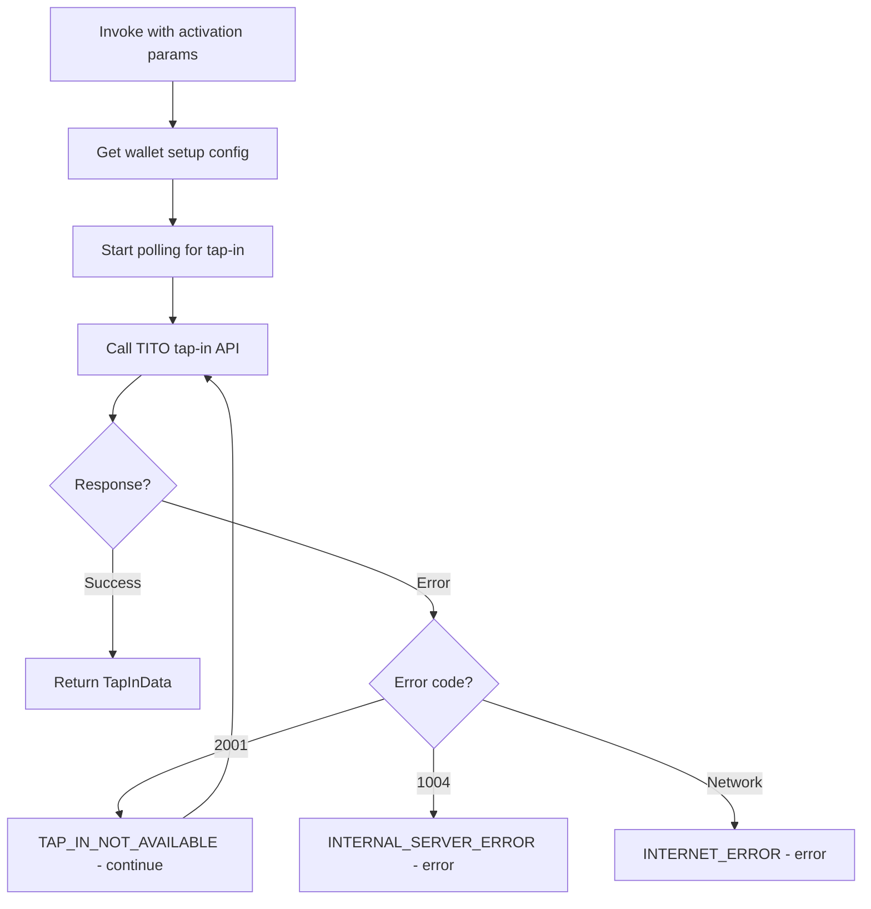
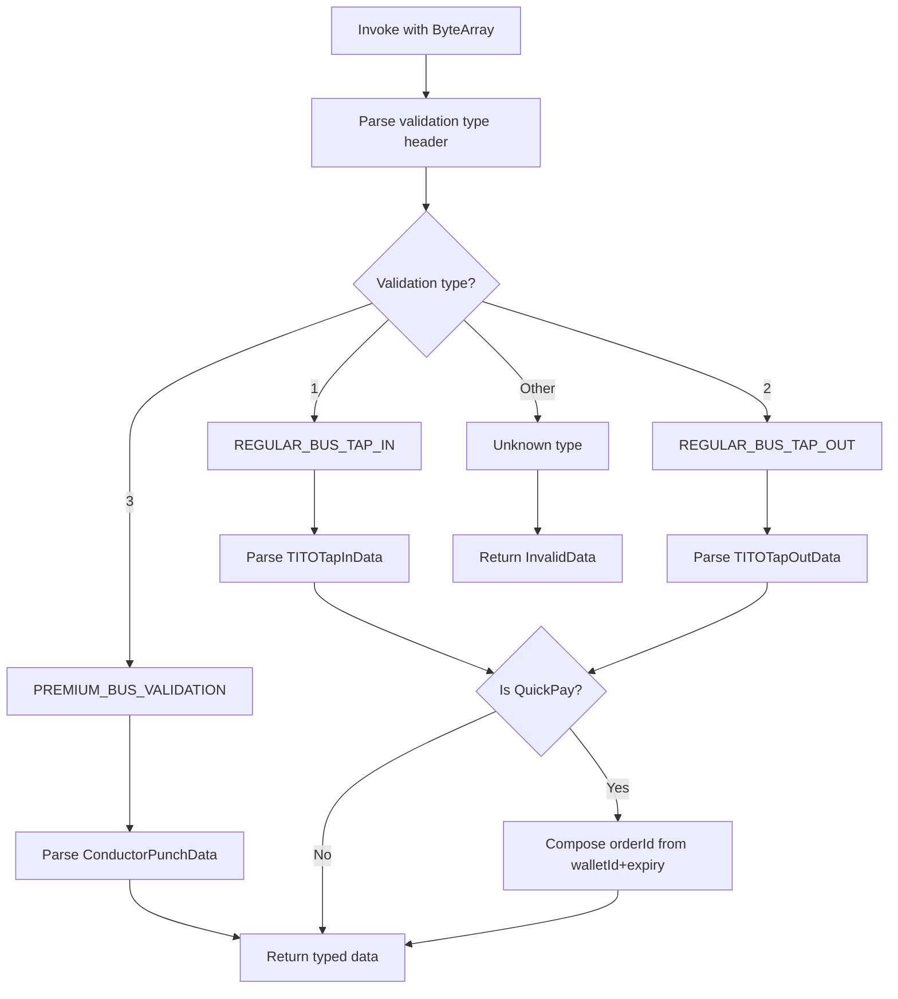
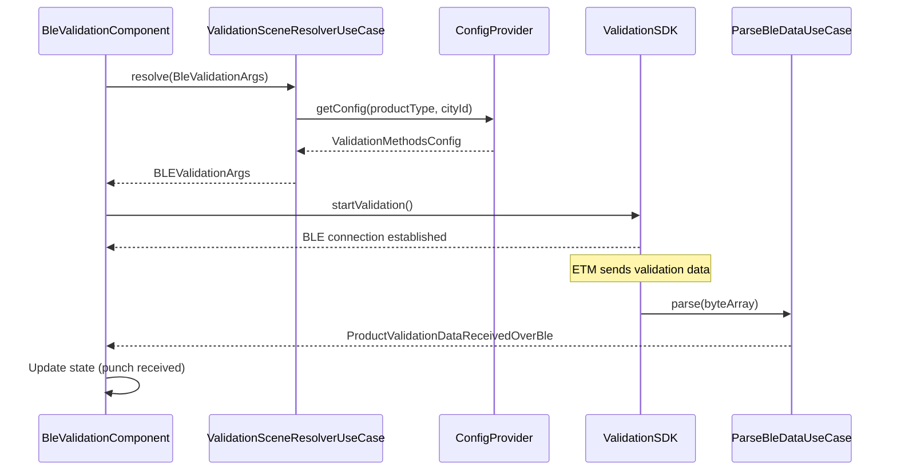
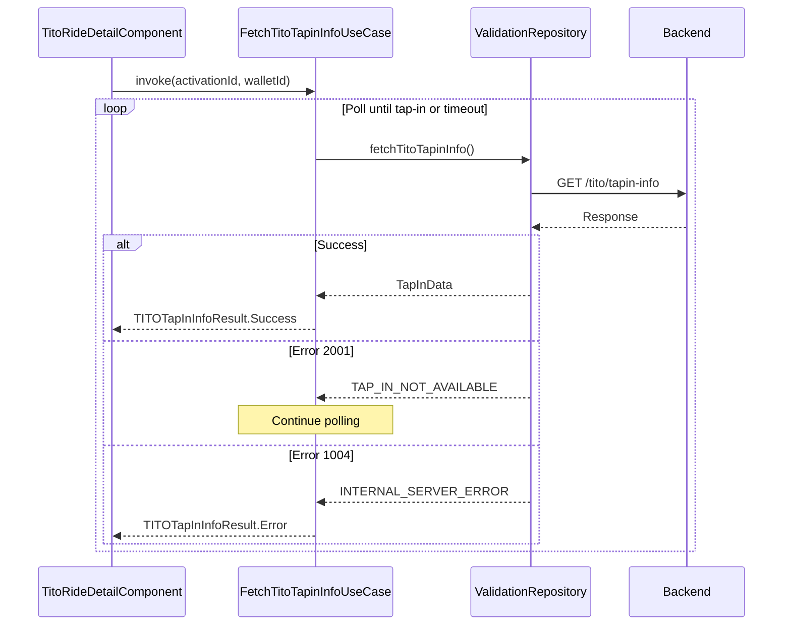

# Validation — UseCase Documentation

## Domain Layer Overview

The Validation domain layer orchestrates ticket and pass validation across multiple methods and product types. The layer uses a plugin architecture with ProductValidationConfig to handle different products uniformly. Use cases manage validation scene resolution, data fetching via polling, BLE data parsing, and configuration retrieval. The domain layer abstracts platform-specific BLE operations while enforcing validation business rules.

```mermaid
flowchart TB
    subgraph Presentation
        BleComp["BleValidationComponent"]
        TITOComp["TitoRideDetailComponent"]
    end

    subgraph Domain["Domain Layer"]
        SceneResolver["ValidationSceneResolverUseCase"]
        FetchPunch["FetchProductPunchDataUseCase"]
        FetchTITO["FetchTitoTapinInfoUseCase"]
        ParseBLE["GetProductValidationDataFromBleUseCase"]
        ConfigProvider["ProductValidationConfigProvider"]
        CheckEnabled["CheckIsBleValidationEnabledUseCase"]
        GetMethods["GetRegularBusProductValidationMethodUseCase"]
        ShowTutorial["ShouldShowBleTutorialUseCase"]
        TimeRemaining["GetTimeRemainingToShowQROptionUseCase"]
    end

    subgraph Data["Data Layer"]
        ValidationRepo["ValidationRepository"]
        ConfigRepo["ConfigurationRepository"]
        RemoteDS["RemoteDataSource"]
    end

    BleComp --> SceneResolver
    BleComp --> FetchPunch
    BleComp --> ParseBLE
    BleComp --> CheckEnabled
    TITOComp --> FetchTITO
    SceneResolver --> ConfigProvider
    FetchPunch --> ValidationRepo
    FetchTITO --> ValidationRepo
    ParseBLE --> ConfigProvider
    CheckEnabled --> ConfigRepo
    GetMethods --> ConfigRepo
```



---

## UseCase Inventory

| UseCase | Layer | Purpose |
|---------|-------|---------|
| **ValidationSceneResolverUseCase** | Domain | Route to appropriate validation method |
| **FetchProductPunchDataForOngoingValidationOnlineUseCase** | Domain | Poll for punch data (Premium Bus) |
| **FetchTitoTapinInfoForActivationUseCase** | Domain | Poll for TITO tap-in data |
| **GetProductValidationDataFromDataReceivedOverBleConnectionUseCase** | Domain | Parse BLE payload |
| **CheckIsBleValidationEnabledUseCase** | Domain | Check BLE enablement per city/product |
| **GetRegularBusProductValidationMethodUseCase** | Domain | Fetch validation methods config |
| **ShouldShowBleTutorialUseCase** | Domain | Determine tutorial visibility |
| **GetTimeRemainingToShowQRValidationOptionUseCase** | Domain | Calculate QR fallback timing |

---

## ValidationSceneResolverUseCase

Routes validation requests to the appropriate validation method based on product type, platform, and configuration.

### Responsibility

Evaluates the product being validated, platform capabilities, and city-level configuration to determine whether to use BLE validation, QR validation, or vehicle-based validation. Returns navigation arguments for the selected validation screen.

### Flow Diagram



### Input Parameters

| Parameter | Type | Description |
|-----------|------|-------------|
| **args** | BleValidationArgs | Product type, flow details, activation info |

### Output

| Type | Description |
|------|-------------|
| **ValidationArgs** | Navigation args for BLE, QR, or vehicle validation |

### Decision Logic

| Condition | Result |
|-----------|--------|
| **Metro/ONDC ticket** | Vehicle-based validation |
| **iOS + non-Premium Reserve** | QR validation only |
| **iOS + Premium Reserve** | BLE validation |
| **Android + BLE enabled** | BLE validation |
| **Android + BLE disabled** | QR validation |

---

## FetchProductPunchDataForOngoingValidationOnlineUseCase

Polls the backend for punch data during Premium Bus validation when BLE communication is unavailable.

### Responsibility

Continuously polls the server for punch data within a timeout window. Handles specific error codes and returns punch data when available. Used primarily for Premium Bus products where conductor validation occurs server-side.

### Flow Diagram



### Input Parameters

| Parameter | Type | Description |
|-----------|------|-------------|
| **productId** | String | Product identifier |
| **productType** | ProductType | Type of product being validated |
| **pollingConfig** | PollingConfig | Delay, timeout settings |

### Output

| Type | Description |
|------|-------------|
| **ProductPunchDataFromPolling** | Punch data or failure reason |

### Error Codes

| Code | Type | Meaning |
|------|------|---------|
| **2002** | PunchNotAvailable | Continue polling |
| **1004** | InternalServerError | Stop with error |
| **Network** | InternetNotAvailable | Stop with error |

---

## FetchTitoTapinInfoForActivationUseCase

Polls for TITO tap-in data during validation activation.

### Responsibility

Fetches tap-in information from the server for TITO (tap-in/tap-out) validation flows. Calculates activation windows for QuickPay products and handles tap-in status updates.

### Flow Diagram



### Input Parameters

| Parameter | Type | Description |
|-----------|------|-------------|
| **activationId** | String | Activation identifier |
| **walletId** | String? | Wallet ID for QuickPay |
| **productType** | ProductType | Product being validated |

### Output

| Type | Description |
|------|-------------|
| **TITOTapInInfoResult** | Tap-in data or failure reason |

### Error Codes

| Code | Type | Meaning |
|------|------|---------|
| **2001** | TAP_IN_NOT_AVAILABLE | Continue polling |
| **1004** | INTERNAL_SERVER_ERROR | Stop with error |

---

## GetProductValidationDataFromDataReceivedOverBleConnectionUseCase

Parses raw BLE data into typed validation data models.

### Responsibility

Converts byte array received from BLE GATT operations into structured validation data. Identifies validation type and maps to appropriate data model. Handles QuickPay-specific orderId composition.

### Flow Diagram



### Input Parameters

| Parameter | Type | Description |
|-----------|------|-------------|
| **data** | ByteArray | Raw BLE payload |
| **productType** | ProductType | Expected product type |

### Output

| Type | Description |
|------|-------------|
| **ProductValidationDataReceivedOverBle** | Typed validation data |

### Validation Types

| Type Code | Name | Data Model |
|-----------|------|------------|
| **1** | REGULAR_BUS_TAP_IN | TITOTapInData |
| **2** | REGULAR_BUS_TAP_OUT | TITOTapOutData |
| **3** | PREMIUM_BUS_VALIDATION | ConductorValidationPunchData |

---

## CheckIsBleValidationEnabledUseCase

Determines if BLE validation is enabled for a product in a specific city.

### Responsibility

Checks city-level and product-level configuration to determine if BLE validation should be offered. Considers app version gating, blacklisted versions, and feature flags.

### Flow Diagram

```mermaid
flowchart TD
    Start["Invoke with product, city"]
    FetchConfig["Fetch validation methods config"]
    CheckEnabled{BLE enabled in config?}
    CheckVersion{Within version range?}
    CheckBlacklist{Version blacklisted?}

    Return True["Return true"]
    Return False["Return false"]

    Start --> FetchConfig
    FetchConfig --> CheckEnabled
    CheckEnabled -->|No| Return False
    CheckEnabled -->|Yes| CheckVersion
    CheckVersion -->|No| Return False
    CheckVersion -->|Yes| CheckBlacklist
    CheckBlacklist -->|Yes| Return False
    CheckBlacklist -->|No| Return True
```

### Input Parameters

| Parameter | Type | Description |
|-----------|------|-------------|
| **productType** | ProductType | Product being validated |
| **cityId** | String | City identifier |
| **appVersion** | Int | Current app version |

### Output

| Type | Description |
|------|-------------|
| **Boolean** | BLE validation enabled |

---

## GetRegularBusProductValidationMethodUseCase

Retrieves the complete validation methods configuration for a city/product combination.

### Responsibility

Fetches detailed configuration including BLE settings, sound validation settings, two-way BLE pilot settings, and QR fallback options. Returns configuration that controls validation behavior.

### Input Parameters

| Parameter | Type | Description |
|-----------|------|-------------|
| **cityId** | String | City identifier |
| **productType** | ProductType | Product type |

### Output

| Type | Description |
|------|-------------|
| **RegularBusProductValidationMethodsConfig** | Full validation config |

### Configuration Fields

| Field | Type | Description |
|-------|------|-------------|
| **bleConfig.isEnabled** | Boolean | BLE enabled flag |
| **bleConfig.minAppVer** | Int | Minimum app version |
| **bleConfig.maxAppVer** | Int | Maximum app version |
| **bleConfig.showFeedbackPercentage** | Float | Feedback collection rate |
| **bleConfig.timeoutToShowQrValidationOption** | Long | QR fallback timeout |
| **bleConfig.showQrOptionAfterNoBlePermAttemptsThreshold** | Int | Permission retry threshold |
| **bleConfig.bleTutorialCountThreshold** | Int | Tutorial show count |
| **bleConfig.isQRAsBackupMethodEnabled** | Boolean | QR fallback enabled |
| **soundConfig.isEnabled** | Boolean | Sound validation enabled |
| **twoWayBleConfig.isEnabled** | Boolean | Two-way BLE pilot enabled |

---

## ShouldShowBleTutorialUseCase

Determines if the BLE validation tutorial should be shown.

### Responsibility

Checks tutorial view count against threshold to decide if first-time tutorial should be displayed. Increments view count after showing.

### Input Parameters

| Parameter | Type | Description |
|-----------|------|-------------|
| **tutorialCountThreshold** | Int | Max times to show |

### Output

| Type | Description |
|------|-------------|
| **Boolean** | Should show tutorial |

---

## GetTimeRemainingToShowQRValidationOptionUseCase

Calculates remaining time before QR fallback option should appear.

### Responsibility

Based on validation start time and configured timeout, calculates how long until the QR fallback option should be displayed to the user.

### Input Parameters

| Parameter | Type | Description |
|-----------|------|-------------|
| **validationStartTime** | Long | When validation started |
| **configuredTimeout** | Long | QR fallback timeout |

### Output

| Type | Description |
|------|-------------|
| **Long** | Milliseconds until QR option |

---

## Domain Models

### ProductValidationDataReceivedOverBle

Sealed class representing typed validation data from BLE.

| Variant | Fields | Description |
|---------|--------|-------------|
| **TITOTapInData** | groupNo, activationTsInSec, tapinPunchTsInMillis, routeId, stopId, tripNo, waybillNo, vehicleNo, walletId?, expiryTime? | Tap-in validation data |
| **TITOTapOutData** | groupNo, activationTsInSec, tapOutTsInMillis, routeId, stopId, tripNo, waybillNo, conductorId, busNo, passengerCount, walletId?, expiryTime? | Tap-out validation data |
| **ConductorValidationPunchData** | bookingId, punchTsInMillis, endStopId | Conductor punch data |
| **InvalidData** | rawData, message | Parse error data |

### BleValidationAckData

Normalized validation result for all product types.

| Variant | Description |
|---------|-------------|
| **ConductorValidationReceiptData** | Regular conductor punch |
| **TITOTapInData** | Tap-in confirmation |
| **TITOTapOutData** | Tap-out confirmation |
| **InvalidData** | Invalid/unparseable data |

### TITOValidationAppModel

| Field | Type | Description |
|-------|------|-------------|
| **tapInDetails** | TapInDetailAppModel | Tap-in information |
| **tapOutDetails** | TapOutDetailAppModel? | Tap-out information (nullable) |
| **productDetails** | TITOProductDetailAppModel | Product information |
| **titoStatus** | TitoValidationStatus | Current validation status |
| **userId** | String | User identifier |

### TitoValidationStatus

| Status | Description |
|--------|-------------|
| **TAP_IN_DONE** | Tap-in recorded, ride active |
| **VERIFIED_TAP_OUT_DONE** | Both tap-in and tap-out complete |
| **MISSED_TAP_OUT** | Tap-out not recorded |

---

## ProductValidationConfig Interface

Plugin interface for product-specific validation configuration.

### Methods

| Method | Purpose | Returns |
|--------|---------|---------|
| **getProductData** | Get validation data for product | ProductValidationData |
| **numDigitsOfHashValue** | Hash code length | Int |
| **hash** | Generate hash | String |
| **onProductReceiptDataReceived** | Handle receipt data | Boolean |
| **getProductReceiptDataFromBleDataReceived** | Extract receipt from BLE | ProductReceiptData |
| **onPunchDataReceivedOverBle** | Handle BLE punch | Boolean |

### Implementations

| Product | Implementation |
|---------|----------------|
| **InstantTicket** | InstantTicketValidationConfig |
| **SuperPass** | SuperPassValidationConfig |
| **PremiumReserve** | PremiumReserveValidationConfig |
| **QuickPay** | QuickPayValidationConfig |
| **Metro** | MetroValidationConfig |
| **ONDC** | ONDCValidationConfig |

---

## ProductValidationData Interface

Data contract for product validation information.

### Properties

| Property | Type | Description |
|----------|------|-------------|
| **getValidationProduct** | ProductValidationModel | Product details |
| **getToneString** | String | Audio validation tone |
| **getStaticQRCode** | String | Static QR code |
| **getActivationId** | String | QR V2 activation ID |
| **getActivationTimestampMS** | Long | Activation time |
| **getProductDetailsFieldsData** | ProductDetailsDisplayData | Display fields |
| **getValidationEntityInfoIfAvailable** | List<TicketValidationInfo> | Validation metadata |

---

## Validation Methods

| Method | Description | Platform |
|--------|-------------|----------|
| **BLE** | Bluetooth Low Energy two-way | Android primary, iOS limited |
| **SOUND** | Audio-based validation | Both (fallback) |
| **QR_SCAN** | QR code scanning | Both (universal fallback) |
| **VEHICLE** | Vehicle-based validation | Metro/ONDC |
| **TITO** | Tap-in/tap-out | Both |

---

## Product-Method Support Matrix

| Product | BLE | Sound | QR | Vehicle |
|---------|-----|-------|----|---------|
| **Instant Ticket** | ✓ | ✓ | ✓ | |
| **Premium Reserve** | ✓ | ✓ | ✓ | |
| **Single Journey** | ✓ | ✓ | ✓ | ✓ |
| **QuickPay** | ✓ | ✓ | ✓ | |
| **Magic Pass** | ✓ | ✓ | ✓ | |
| **Ride-Based Pass** | ✓ | ✓ | ✓ | |
| **ONDC Ticket** | ✓ | ✓ | ✓ | ✓ |
| **Metro Ticket** | ✓ | ✓ | ✓ | ✓ |

---

## Business Rules

| Rule | Description | Enforcement |
|------|-------------|-------------|
| **iOS BLE Limit** | iOS only supports BLE for Premium Reserve | SceneResolverUseCase |
| **Version Gating** | BLE only within min/max app versions | CheckIsBleEnabledUseCase |
| **QR Fallback Timeout** | Show QR option after configured timeout | GetTimeRemainingUseCase |
| **Tutorial Threshold** | Show tutorial up to N times | ShouldShowTutorialUseCase |
| **QuickPay OrderId** | Compose from walletId + expiryTime | BLE parse use case |
| **Polling Timeout** | Stop polling after configured duration | FetchPunchDataUseCase |

---

## Sequence Diagrams

### BLE Validation Flow



### TITO Tap-In Polling Flow



---

## Error Handling

### Punch Fetch Failure Reasons

| Reason | Cause | Handling |
|--------|-------|----------|
| **PunchNotAvailable** | Not yet punched (2002) | Continue polling |
| **InternalServerError** | Server error (1004) | Return error |
| **InternetNotAvailable** | Network offline | Return error |
| **ResponseParsingError** | Parse failure | Return error |
| **Unknown** | Other errors | Return error |

### TITO Tap-In Failure Reasons

| Reason | Cause | Handling |
|--------|-------|----------|
| **TAP_IN_NOT_AVAILABLE** | Not tapped in (2001) | Continue polling |
| **INTERNAL_SERVER_ERROR** | Server error (1004) | Return error |
| **INTERNET_ERROR** | Network offline | Return error |
| **RESPONSE_PARSING_ERROR** | Parse failure | Return error |
| **UNKNOWN** | Other errors | Return error |
