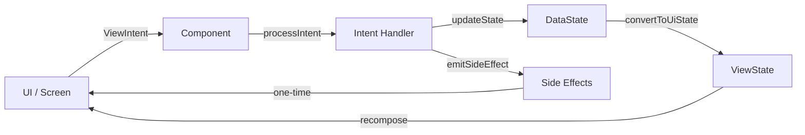

# Architecture

## Overview

`chalo-app-kmp` follows Clean Architecture principles with a unidirectional data flow pattern (MVI). The architecture is built around Decompose for navigation and lifecycle management, Koin for dependency injection, and Compose Multiplatform for UI.

## Architecture Layers

```
┌─────────────────────────────────────────────────────────────────┐
│                        Presentation Layer                        │
│  ┌─────────────────┐  ┌─────────────────┐  ┌─────────────────┐  │
│  │  Screen (UI)    │  │   Component     │  │   ViewState     │  │
│  │  (Compose)      │◄─┤   (ViewModel)   │  │   DataState     │  │
│  └─────────────────┘  └────────┬────────┘  └─────────────────┘  │
└────────────────────────────────┼────────────────────────────────┘
                                 │
                                 ▼
┌─────────────────────────────────────────────────────────────────┐
│                         Domain Layer                             │
│  ┌─────────────────┐  ┌─────────────────┐  ┌─────────────────┐  │
│  │    UseCase      │  │  Domain Model   │  │  Repository     │  │
│  │   (Business)    │  │   (Entities)    │  │  (Interface)    │  │
│  └────────┬────────┘  └─────────────────┘  └─────────────────┘  │
└───────────┼─────────────────────────────────────────────────────┘
            │
            ▼
┌─────────────────────────────────────────────────────────────────┐
│                          Data Layer                              │
│  ┌─────────────────┐  ┌─────────────────┐  ┌─────────────────┐  │
│  │  Repository     │  │   DataSource    │  │    Mappers      │  │
│  │  (Impl)         │  │  (Remote/Local) │  │  (DTO ↔ Model)  │  │
│  └─────────────────┘  └─────────────────┘  └─────────────────┘  │
└─────────────────────────────────────────────────────────────────┘
```

## MVI Pattern with Decompose

The codebase uses a custom MVI (Model-View-Intent) implementation built on top of Decompose's `ComponentContext`.

### ChaloBaseStateMviComponent

All screen components extend `ChaloBaseStateMviComponent`, which provides:

```kotlin
abstract class ChaloBaseStateMviComponent<ViewIntent, DataState, ViewState, ViewSideEffect>(
    componentContext: ComponentContext
) : ComponentContext by componentContext {

    // Internal state management
    protected val dataState: StateFlow<DataState>
    val viewState: Value<ViewState>
    val sideEffects: Flow<ViewSideEffect>

    // Lifecycle-aware scope
    protected val componentScope: CoroutineScope

    // Abstract methods
    abstract fun initialDataState(): DataState
    abstract suspend fun convertToUiState(dataState: DataState): ViewState
    open fun processIntent(intent: ViewIntent)
}
```

### Type Parameters

| Parameter | Purpose |
|-----------|---------|
| `ViewIntent` | User actions dispatched from UI (sealed interface) |
| `DataState` | Internal state holding business data |
| `ViewState` | Presentation state consumed by Compose UI |
| `ViewSideEffect` | One-time events (navigation, toasts, etc.) |

### Data Flow



### Example Component

```kotlin
class EBillFetchComponent(
    componentContext: ComponentContext,
    private val args: EBillFetchScreenArgs,
    private val eBillFetchUseCase: EBillFetchUseCase,
    private val navigationManager: ChaloNavigationManager,
) : ChaloBaseStateMviComponent<
    EBillFetchIntent,      // ViewIntent
    EBillFetchDataState,   // DataState
    EBillFetchViewState,   // ViewState
    EBillFetchSideEffect   // ViewSideEffect
>(componentContext) {

    override fun initialDataState() = EBillFetchDataState()

    override fun processIntent(intent: EBillFetchIntent) {
        when (intent) {
            is EBillFetchIntent.NextClickIntent -> handleNextClick(intent)
            is EBillFetchIntent.NumberEnteredIntent -> handleNumberEntered(intent)
            // ...
        }
    }

    override suspend fun convertToUiState(dataState: EBillFetchDataState): EBillFetchViewState {
        return EBillFetchViewState(
            title = ChaloTextUIState(string = "Enter Consumer Number"),
            isLoading = dataState.isLoading,
            proceedButton = ButtonUIStateFactory.chaloOrangeButton(
                onClick = { processIntent(EBillFetchIntent.NextClickIntent(...)) },
                enabled = dataState.isNextBtnClickable
            )
        )
    }
}
```

## Navigation with Decompose

### RootComponent

The `RootComponent` manages the main navigation stack using Decompose's `ChildStack`:

```kotlin
interface RootComponent {
    val childStack: Value<ChildStack<*, Child>>

    fun navigateTo(args: SceneArgs)
    fun navigateBack()
    fun navigateAndPopUpTo(args: SceneArgs, popUpTo: ChaloScenes, inclusive: Boolean)
    fun clearAllAndNavigateTo(args: SceneArgs)
    fun replaceCurrent(args: SceneArgs)

    sealed class Child {
        data class Home(override val component: HomeComponent) : Child()
        data class EBillFetch(override val component: EBillFetchComponent) : Child()
        // ... 80+ screen types
    }
}
```

### Navigation Patterns

**Push Navigation**
```kotlin
navigationManager.postNavigationRequest(
    ChaloNavigationRequest.Navigate(args = EBillAmountScreenArgs(...))
)
```

**Pop with Result**
```kotlin
navigationManager.postNavigationRequest(
    ChaloNavigationRequest.PopUpTo(
        scene = ChaloScenes.EBillFetch,
        inclusive = false
    )
)
```

**Clear Stack and Navigate**
```kotlin
navigationManager.postNavigationRequest(
    ChaloNavigationRequest.ClearAllAndNavigate(args = HomeArgs())
)
```

### Scene Args

Navigation destinations are defined as serializable `SceneArgs`:

```kotlin
@Serializable
sealed interface SceneArgs {
    fun resolveChaloScene(): ChaloScenes
}

@Serializable
data class EBillAmountScreenArgs(
    val electricityBillJson: String
) : SceneArgs {
    override fun resolveChaloScene() = ChaloScenes.EBillAmountScreen
}
```

### Parent Components (Nested Navigation)

Complex flows use `ParentComponent` for nested navigation:

```kotlin
class CheckoutParentComponent(
    args: CheckoutArgs,
    componentContext: ComponentContext
) : ParentComponent<CheckoutChild, CheckoutArgs>(componentContext) {

    // Manages internal checkout flow stack
    // Delegates to root when flow completes
}
```

## Dependency Injection with Koin

### Module Structure

Each feature module defines its own Koin module:

```kotlin
// shared/home/src/commonMain/kotlin/.../di/ElectricityBillModule.kt
val electricityBillModule = module {
    // Data layer
    single<ElectricityBillRemoteDataSource> { ElectricityBillRemoteDataSourceImpl(get()) }
    single<ElectricityBillRepository> { ElectricityBillRepositoryImpl(get(), get()) }

    // Domain layer
    factory { EBillFetchUseCase(get(), get()) }
    factory { EBillAmountUseCase(get()) }
    factory { EBillCreateOrderUseCase(get(), get(), get()) }
}
```

### Component Factory

Components are created via `AppComponentFactory` using Koin:

```kotlin
object AppComponentFactory : KoinComponent {

    fun createComponent(
        componentContext: ComponentContext,
        args: EBillFetchScreenArgs
    ): EBillFetchComponent = EBillFetchComponent(
        componentContext = componentContext,
        args = args,
        eBillFetchUseCase = get(),
        navigationManager = get(),
        analyticsContract = get(),
        stringProvider = get()
    )
}
```

### Scope Hierarchy

```
├── Application Scope (single)
│   ├── NetworkClient
│   ├── Database
│   ├── AnalyticsContract
│   └── NavigationManager
│
└── Feature Scope (factory)
    ├── UseCases
    └── Components
```

## Data Layer Patterns

### Repository Pattern

```kotlin
// Interface (Domain layer)
interface ElectricityBillRepository {
    suspend fun fetchElectricityBill(userId: String, consumerNumber: String): ElectricityBillAppModel
    suspend fun createPaymentOrder(...): CreateOrderResponseAppModel
}

// Implementation (Data layer)
class ElectricityBillRepositoryImpl(
    private val remoteDataSource: ElectricityBillRemoteDataSource
) : ElectricityBillRepository {

    override suspend fun fetchElectricityBill(...): ElectricityBillAppModel {
        return remoteDataSource.fetchElectricityBill(consumerNumber)
            .toElectricityBillAppModel()  // Map DTO to domain model
    }
}
```

### Data Sources

**Remote Data Source**
```kotlin
class ElectricityBillRemoteDataSourceImpl(
    private val httpClient: HttpClient
) : ElectricityBillRemoteDataSource {

    override suspend fun fetchElectricityBill(consumerNumber: String): FetchElectricityBillResponseApiModel {
        return httpClient.get("/api/v1/ebill/fetch") {
            parameter("consumerNumber", consumerNumber)
        }.body()
    }
}
```

**Local Data Source**
```kotlin
class WalletLocalDataSource(
    private val database: ChaloDatabase,
    private val dataStore: DataStore<Preferences>
) {
    fun getWalletBalance(): Flow<Long> =
        database.walletQueries.getBalance().asFlow()
}
```

### DTOs and Mappers

```kotlin
// API Model (DTO)
@Serializable
data class FetchElectricityBillResponseApiModel(
    val consumerNumber: String?,
    val customerName: String?,
    val dueAmount: Int?,
    val dueDate: Long?
)

// Domain Model
data class ElectricityBillAppModel(
    val consumerNumber: String,
    val customerName: String,
    val dueBillAmountInPaisa: Int,
    val dueDate: Long
)

// Mapper
fun FetchElectricityBillResponseApiModel.toElectricityBillAppModel() = ElectricityBillAppModel(
    consumerNumber = consumerNumber ?: "",
    customerName = customerName ?: "",
    dueBillAmountInPaisa = dueAmount ?: 0,
    dueDate = dueDate ?: 0L
)
```

## Error Handling

### ChaloUseCaseResult

Use cases return a sealed result type:

```kotlin
sealed class ChaloUseCaseResult<out S, out E> {
    data class Success<S>(val data: S) : ChaloUseCaseResult<S, Nothing>()
    data class Failure<E>(val error: E) : ChaloUseCaseResult<Nothing, E>()
}
```

### Error Types

Each feature defines domain-specific error types:

```kotlin
enum class EBillFetchErrorType {
    CONSUMER_NUM_LENGTH_TOO_SHORT,
    CONSUMER_NUM_LENGTH_TOO_LONG,
    CONSUMER_NOT_FOUND,
    API_RESPONSE_FAILED,
    USER_NOT_LOGGED_IN
}
```

### Exception Mappers

Network exceptions are mapped to domain errors:

```kotlin
class NetworkResponseToElectricityBillConsumerNotFoundExceptionMapper {
    fun map(response: HttpResponse): ElectricityBillConsumerNotFoundException? {
        // Map HTTP errors to domain exceptions
    }
}
```

## UI State Management

### UIState Pattern

The codebase uses a UI State factory pattern for consistent component styling:

```kotlin
// UIState classes define visual properties
data class ButtonUIState(
    val textState: ChaloTextUIState,
    val enabled: Boolean,
    val onClick: () -> Unit,
    val backgroundColor: ChaloColorToken
)

// Factories provide pre-configured states
object ButtonUIStateFactory {
    fun chaloOrangeButton(
        textState: ChaloTextUIState,
        onClick: () -> Unit,
        enabled: Boolean = true
    ) = ButtonUIState(
        textState = textState,
        enabled = enabled,
        onClick = onClick,
        backgroundColor = ChaloColorToken.OrangePrimary
    )
}
```

### Color Tokens

```kotlin
enum class ChaloColorToken {
    OrangePrimary,
    White,
    Black_87,
    Black_70,
    ErrorColor,
    // ...
}
```

## Platform-Specific Implementation

### Expect/Actual Pattern

```kotlin
// commonMain
expect class PlatformContext

expect fun getPlatformName(): String

// androidMain
actual class PlatformContext(val context: Context)

actual fun getPlatformName(): String = "Android"

// iosMain
actual class PlatformContext

actual fun getPlatformName(): String = "iOS"
```

### Platform Engines

```kotlin
// commonMain
expect fun createHttpClient(): HttpClient

// androidMain
actual fun createHttpClient() = HttpClient(OkHttp) {
    // Android-specific configuration
}

// iosMain
actual fun createHttpClient() = HttpClient(Darwin) {
    // iOS-specific configuration
}
```

## Testing Architecture

### Component Testing

```kotlin
@Test
fun `processIntent updates state correctly`() = runTest {
    val component = EBillFetchComponent(
        componentContext = TestComponentContext(),
        eBillFetchUseCase = mockk(),
        // ...
    )

    component.processIntent(EBillFetchIntent.NumberEnteredIntent("123456789"))

    assertEquals("123456789", component.dataState.value.currentlyEnteredNumber)
}
```

### UseCase Testing

```kotlin
@Test
fun `fetchEBill returns success when API succeeds`() = runTest {
    val repository = mockk<ElectricityBillRepository> {
        coEvery { fetchElectricityBill(any(), any()) } returns mockBill
    }

    val useCase = EBillFetchUseCase(repository, userContract)
    val result = useCase.fetchEBillOnline("123456789")

    assertTrue(result is ChaloUseCaseResult.Success)
}
```

## Key Design Decisions

| Decision | Rationale |
|----------|-----------|
| Decompose over Jetpack Navigation | Cross-platform, lifecycle-aware, testable |
| MVI over MVVM | Unidirectional data flow, predictable state |
| Factory pattern for UI states | Consistent styling across features |
| Sealed classes for navigation | Type-safe routes with SKIE Swift interop |
| Repository pattern | Abstraction over data sources, testability |
| Koin over Hilt | Multiplatform support, simpler setup |
