# Architecture

## Overview

The Chalo App follows **Clean Architecture** principles with a **Model-View-Intent (MVI)** pattern for the presentation layer. The architecture prioritizes testability, separation of concerns, and unidirectional data flow. Built on **Decompose** for navigation and lifecycle management and **Koin** for dependency injection, the architecture enables maximum code sharing while maintaining clear boundaries between layers.

## Architectural Layers

The codebase is organized into three primary layers, each with distinct responsibilities and dependency rules. Dependencies flow inward—outer layers depend on inner layers, never the reverse.

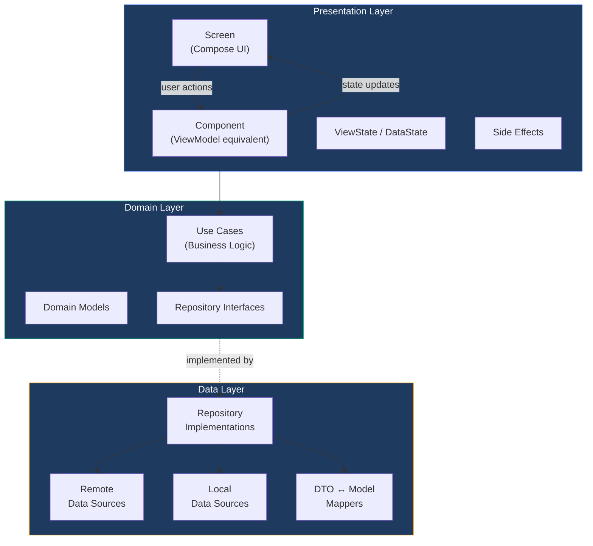

### Layer Responsibilities

| Layer | Contents | Dependency Rules |
|-------|----------|------------------|
| **Presentation** | Compose screens, Decompose components (ViewModels), view states, intents, side effects | Depends on Domain. No direct data layer access. |
| **Domain** | Use cases, domain models, repository interfaces | Pure Kotlin. No framework dependencies. No awareness of data sources. |
| **Data** | Repository implementations, remote/local data sources, API models, mappers | Implements Domain interfaces. Knows about Ktor, SQLDelight, DataStore. |

## MVI Pattern

The presentation layer uses **Model-View-Intent (MVI)**, a unidirectional data flow pattern that makes state changes predictable and testable.

### Data Flow

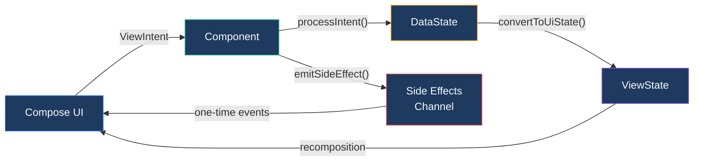

### MVI Type Parameters

Every screen component is parameterized by four types that define its contract with the UI.

| Parameter | Purpose | Example |
|-----------|---------|---------|
| **ViewIntent** | User actions dispatched from UI. Sealed interface with all possible user interactions. | `NumberEnteredIntent`, `NextClickIntent`, `BackPressedIntent` |
| **DataState** | Internal business state. Contains raw data from use cases, not formatted for display. | Loading flags, fetched models, validation errors |
| **ViewState** | Presentation state consumed by Compose. Contains UI-ready strings, colors, button states. | Formatted text, button enabled states, dialog visibility |
| **ViewSideEffect** | One-time events that shouldn't survive recomposition. | Navigation requests, toast messages, keyboard dismiss |

### State Transformation Flow

The component maintains two state representations to separate business concerns from presentation concerns.

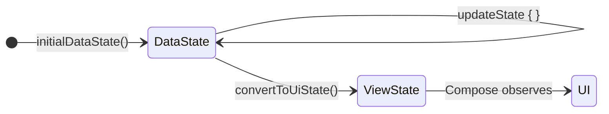

**DataState** holds the raw business data—whether a network call is in progress, the fetched domain model, any error codes. **ViewState** transforms this into UI-ready form—loading spinners, formatted strings, button configurations. This separation allows business logic testing without UI concerns and enables different UI representations of the same data.

### ChaloBaseStateMviComponent

All screen components extend a base class that provides the MVI infrastructure.

| Member | Type | Purpose |
|--------|------|---------|
| `dataState` | `StateFlow<DataState>` | Internal business state, updated via `updateState {}` |
| `viewState` | `Value<ViewState>` | Observable state for Compose, derived from DataState |
| `sideEffects` | `Flow<ViewSideEffect>` | Channel-backed flow for one-time events |
| `componentScope` | `CoroutineScope` | Lifecycle-aware scope, auto-cancelled on destroy |

| Method | Purpose |
|--------|---------|
| `initialDataState()` | Returns the starting DataState when component is created |
| `processIntent(intent)` | Handles user actions, typically via `when` expression |
| `convertToUiState(dataState)` | Transforms DataState to ViewState for UI consumption |
| `updateState { current -> new }` | Thread-safe state mutation |
| `emitSideEffect(effect)` | Sends one-time event to UI |
| `repeatOnStarted { }` | Runs block when lifecycle is at least STARTED, cancels otherwise |

### Intent Processing Pattern

When the UI dispatches an intent, the component processes it through a deterministic handler.

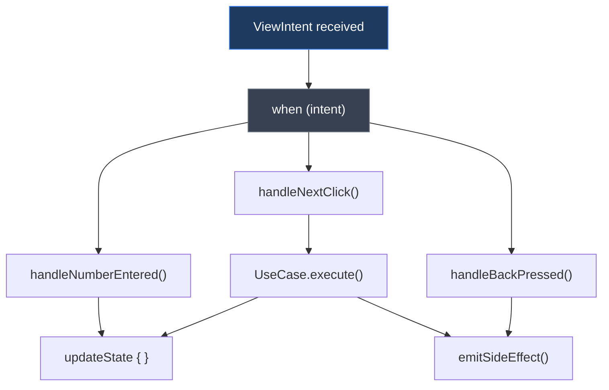

Each intent type maps to a handler method. Handlers may update state immediately (for synchronous operations like text input) or launch coroutines (for async operations like API calls). The pattern ensures all state changes are traceable to specific user actions.

## Navigation with Decompose

**Decompose** provides the navigation and lifecycle infrastructure, replacing Jetpack Navigation with a multiplatform, testable alternative.

### Navigation Architecture

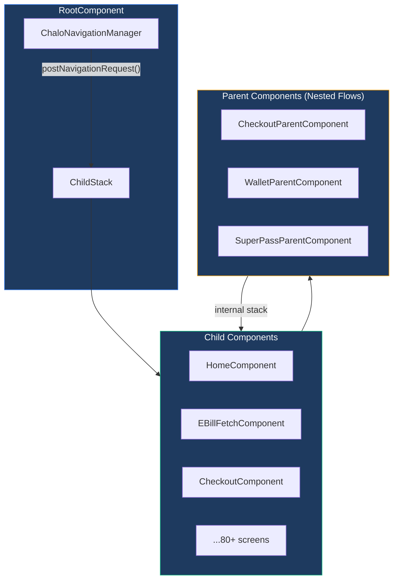

### Navigation Concepts

| Concept | Purpose |
|---------|---------|
| **ChildStack** | Decompose's navigation stack holding screen configurations and component instances |
| **SceneArgs** | Serializable arguments defining a navigation destination, carries data between screens |
| **ChaloScenes** | Enum of all navigable destinations (~80+ screens), each with a route identifier |
| **ChaloNavigationManager** | Centralized navigation coordinator, emits navigation requests to RootComponent |
| **ParentComponent** | Manages nested navigation flows (e.g., checkout has its own internal stack) |

### Navigation Request Types

The navigation manager accepts several request types to handle different navigation patterns.

| Request | Behavior |
|---------|----------|
| **Navigate** | Push new screen onto stack, optionally with pop-up-to configuration |
| **GoBack** | Pop current screen, optionally pop to specific destination |
| **BuildStack** | Replace entire stack with new list of screens (for deep links) |
| **ClearAllAndNavigate** | Clear stack completely and navigate to single destination |

### Nested Navigation (Parent Components)

Complex flows like checkout or pass booking use **ParentComponent** to manage internal navigation independent of the main stack. The parent has its own ChildStack for internal screens while appearing as a single entry in the root stack.

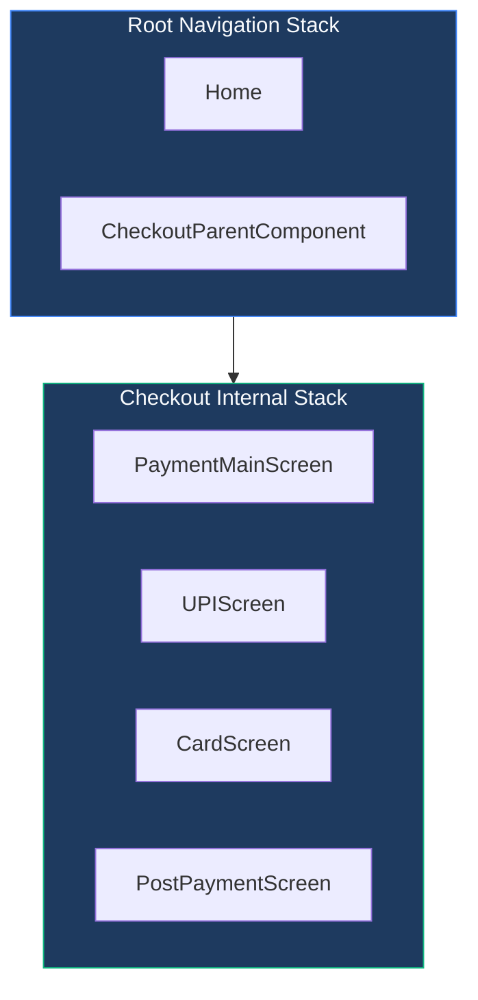

When the nested flow completes, it signals the parent to finish, which pops the entire parent from the root stack, returning the user to the screen before the flow began.

## Dependency Injection with Koin

**Koin** provides lightweight dependency injection across the entire codebase.

### Module Organization

Each feature defines its own Koin module, wiring together data, domain, and presentation layers.

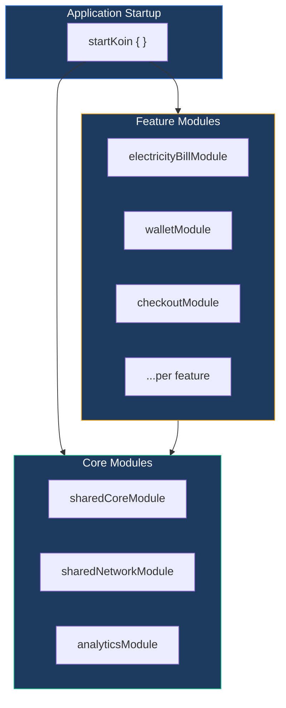

### Scope Guidelines

| Scope | Use For | Lifecycle |
|-------|---------|-----------|
| **single** | Repositories, data sources, managers, singletons | Application lifetime |
| **factory** | Use cases, components | Created fresh each time requested |

Repositories and data sources are singletons because they manage shared resources (HTTP clients, databases). Use cases and components are factories because each screen instance should have its own state.

### Component Creation

Components are created via a factory that retrieves dependencies from Koin.

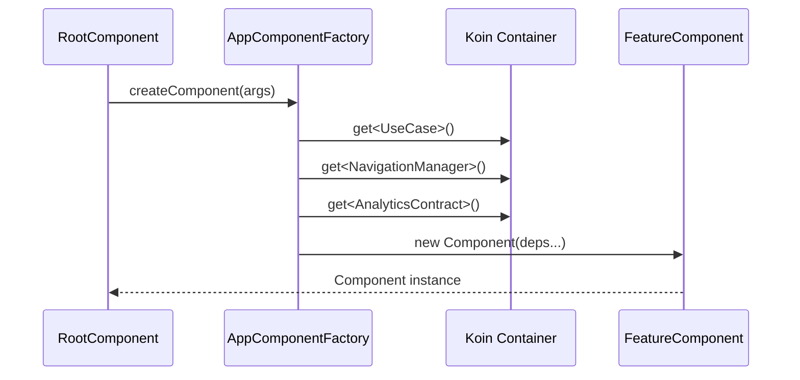

The factory pattern keeps component constructors explicit about their dependencies while delegating resolution to Koin.

## Data Layer Patterns

### Repository Pattern

Repositories abstract data sources from the domain layer. The domain defines interfaces; the data layer provides implementations.

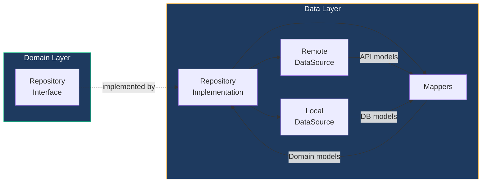

### Data Source Responsibilities

| Data Source | Responsibility |
|-------------|----------------|
| **Remote** | HTTP calls via Ktor, returns API response models |
| **Local** | Database queries via SQLDelight, DataStore reads/writes |
| **Repository** | Coordinates remote/local, applies caching strategy, maps to domain models |

### Model Types

The codebase uses distinct model types at each layer boundary.

| Model Type | Layer | Characteristics |
|------------|-------|-----------------|
| **ApiModel** | Data (network) | Matches API JSON structure, nullable fields for safety, `@Serializable` |
| **DbModel** | Data (local) | Matches SQLDelight schema, generated from `.sq` files |
| **AppModel** | Domain | Clean domain representation, non-nullable where possible, business-meaningful names |
| **UIState** | Presentation | UI-ready formatting, includes styling information |

### Mapping Flow

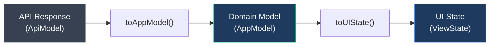

## Error Handling

### Result Types

Use cases return sealed result types that force callers to handle both success and failure cases.

| Result | Contains |
|--------|----------|
| **Success** | The requested data of type `S` |
| **Failure** | A domain-specific error of type `E` |

### Error Type Hierarchy

Each feature defines its own error types, keeping error handling domain-specific.

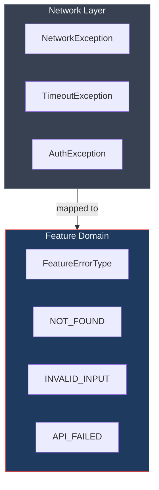

Network exceptions are caught in repositories and mapped to feature-specific error types. This keeps the domain layer ignorant of network implementation details.

### Exception Declaration

Repository methods declare their possible exceptions using `@Throws`, making failure modes explicit.

| Exception Type | When Thrown |
|----------------|-------------|
| **Feature-specific** | Business rule violations (e.g., ConsumerNotFoundException) |
| **ChaloLocalException** | Local parsing or storage failures |
| **CancellationException** | Coroutine cancellation (always allowed to propagate) |

## Platform Abstraction

### Expect/Actual Pattern

For simple platform differences, Kotlin's expect/actual mechanism provides compile-time safety.

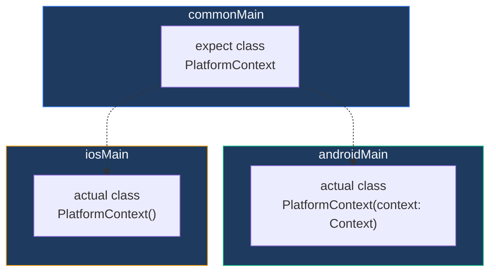

### PlatformDependencyFactory

For complex platform code requiring runtime construction, the **PlatformDependencyFactory** pattern provides indirection without module-level dependencies.

| Platform Need | Factory Request | Result |
|---------------|-----------------|--------|
| HTTP Client | `ChaloHttpClientRequest` | Platform-configured Ktor HttpClient |
| Socket | `ChaloSocketRequest` | Platform-specific WebSocket implementation |
| Map Utilities | `MapUtilsRequest` | Android/iOS map helpers |

The factory is injected once at app startup, then used throughout shared code to obtain platform-specific implementations.

## Key Architectural Decisions

| Decision | Rationale |
|----------|-----------|
| **MVI over MVVM** | Unidirectional data flow makes state changes predictable and debugging easier. Single source of truth for screen state. |
| **Decompose over Jetpack Navigation** | True multiplatform support, better testability (no Android dependencies), component-based lifecycle. |
| **Repository interfaces in Domain** | Domain layer remains pure Kotlin with no framework dependencies, enabling unit testing without mocks. |
| **Separate DataState/ViewState** | Business logic testing doesn't require UI knowledge; UI changes don't affect business logic. |
| **Feature-specific error types** | Each feature handles its own failure modes with appropriate user messaging, avoiding generic error handling. |
| **Factory pattern for components** | Explicit dependency declaration while leveraging Koin for resolution. Easy to test with mock dependencies. |
