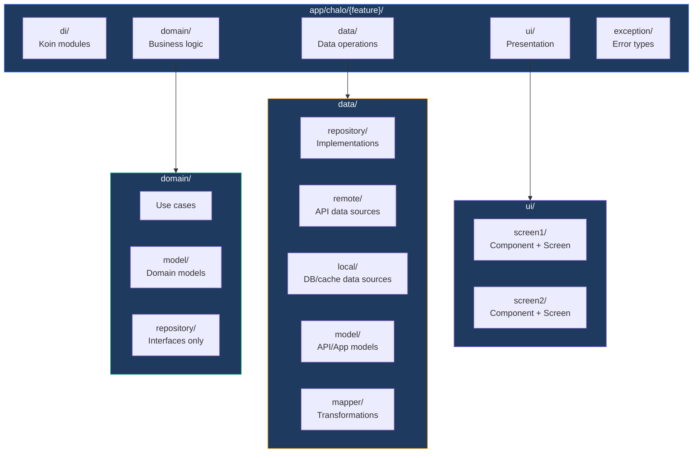

# Coding Conventions

## Overview

The Chalo App codebase follows consistent naming conventions, package structures, and patterns that enable developers to navigate and understand the code quickly. These conventions are designed to make the codebase self-documenting—when you see a class name, you immediately know its role and where to find related code.

## Naming Conventions

### Class Naming Patterns

Every class type follows a predictable naming pattern that reveals its architectural role.

| Type | Pattern | Example | Purpose |
|------|---------|---------|---------|
| **Component** | `{Feature}Component` | `EBillFetchComponent` | Screen-level ViewModel implementing MVI |
| **Parent Component** | `{Feature}ParentComponent` | `CheckoutParentComponent` | Manages nested navigation flow |
| **UseCase** | `{Action}UseCase` | `EBillFetchUseCase` | Single business operation |
| **Repository Interface** | `{Entity}Repository` | `ElectricityBillRepository` | Data abstraction contract |
| **Repository Implementation** | `{Entity}RepositoryImpl` | `ElectricityBillRepositoryImpl` | Concrete data operations |
| **Remote Data Source** | `{Entity}RemoteDataSource` | `ElectricityBillRemoteDataSource` | Network API operations |
| **Local Data Source** | `{Entity}LocalDataSource` | `WalletLocalDataSource` | Database/cache operations |
| **API Model** | `{Name}ApiModel` | `FetchElectricityBillResponseApiModel` | Network response DTO |
| **App Model** | `{Name}AppModel` | `ElectricityBillAppModel` | Domain representation |
| **Scene Args** | `{Scene}Args` | `EBillFetchScreenArgs` | Navigation parameters |
| **ViewState** | `{Feature}ViewState` | `EBillFetchViewState` | UI-ready presentation state |
| **DataState** | `{Feature}DataState` | `EBillFetchDataState` | Internal business state |
| **Intent** | `{Feature}Intent` | `EBillFetchIntent` | User action sealed interface |
| **Side Effect** | `{Feature}SideEffect` | `EBillFetchSideEffect` | One-time UI events |
| **Exception** | `{Entity}{Action}Exception` | `ElectricityBillConsumerNotFoundException` | Domain-specific error |
| **Mapper** | `{Entity}Mapper` | `ElectricityBillMapper` | Model transformation functions |
| **DI Module** | `{feature}Module` | `electricityBillModule` | Koin dependency definitions |

### File Naming Patterns

Files mirror their primary class names.

| Type | Pattern | Example |
|------|---------|---------|
| **Component** | `{Feature}Component.kt` | `EBillFetchComponent.kt` |
| **Screen** | `{Feature}Screen.kt` | `EBillFetchScreen.kt` |
| **Contract** | `{Feature}Contract.kt` | `EBillFetchContract.kt` |
| **UseCase** | `{Action}UseCase.kt` | `EBillFetchUseCase.kt` |
| **Repository** | `{Entity}Repository.kt` | `ElectricityBillRepository.kt` |
| **API Model** | `{Name}ApiModel.kt` | `FetchElectricityBillResponseApiModel.kt` |
| **DI Module** | `{Feature}Module.kt` | `ElectricityBillModule.kt` |

### Package Naming

Package names use lowercase without underscores, following Java/Kotlin conventions.

| Pattern | Example |
|---------|---------|
| `app.chalo.{module}.{layer}` | `app.chalo.electricitybill.data` |
| `app.chalo.{module}.{layer}.{sublayer}` | `app.chalo.electricitybill.data.repository` |
| `app.chalo.{module}.ui.{screen}` | `app.chalo.electricitybill.ui.ebillfetch` |

## Package Structure

### Feature Package Layout

Every feature follows a consistent package organization aligned with Clean Architecture layers.

### Layer Contents

| Layer | Package | Contents |
|-------|---------|----------|
| **di/** | `{feature}/di/` | Koin module definition wiring dependencies |
| **domain/** | `{feature}/domain/` | Use cases, domain models, repository interfaces |
| **domain/model/** | `{feature}/domain/model/` | Pure domain entities |
| **domain/repository/** | `{feature}/domain/repository/` | Repository interfaces (contracts) |
| **data/** | `{feature}/data/` | All data layer code |
| **data/repository/** | `{feature}/data/repository/` | Repository implementations |
| **data/remote/** | `{feature}/data/remote/` | Remote data source interface and implementation |
| **data/local/** | `{feature}/data/local/` | Local data source for DB/cache |
| **data/model/** | `{feature}/data/model/` | DTOs (API models, app models) |
| **data/model/apimodel/** | `{feature}/data/model/apimodel/` | Network request/response models |
| **data/model/appmodel/** | `{feature}/data/model/appmodel/` | Internal app representation |
| **data/mapper/** | `{feature}/data/mapper/` | Model transformation functions |
| **ui/** | `{feature}/ui/` | All presentation layer code |
| **ui/{screen}/** | `{feature}/ui/{screen}/` | Screen-specific component, contract, composable |
| **exception/** | `{feature}/exception/` | Feature-specific exception classes |

### Source Sets

| Source Set | Purpose |
|------------|---------|
| **commonMain/** | Shared code for all platforms |
| **androidMain/** | Android-specific actual implementations |
| **iosMain/** | iOS-specific actual implementations |
| **androidUnitTest/** | Android unit tests |
| **commonTest/** | Cross-platform tests |

## MVI Contract Conventions

### Intent Design

Intents represent all possible user actions for a screen. They are defined as sealed interfaces with descriptive names.

| Intent Category | Naming Pattern | Example |
|-----------------|----------------|---------|
| **User input** | `{Input}EnteredIntent` | `NumberEnteredIntent(number: String)` |
| **Button clicks** | `{Button}ClickIntent` | `NextClickIntent`, `BackClickIntent` |
| **Navigation** | `View{Target}Intent` | `ViewPaymentHistoryIntent` |
| **System events** | `{Event}Intent` | `InternetConnectionIntent(state)` |
| **Lifecycle** | `Screen{Event}Intent` | `ScreenOpenedIntent`, `ScreenResumedIntent` |

### DataState Design

DataState holds raw business data without presentation formatting.

| Field Category | Examples |
|----------------|----------|
| **Loading flags** | `isLoading: Boolean`, `isFetching: Boolean` |
| **Domain models** | `electricityBillAppModel: ElectricityBillAppModel?` |
| **User input** | `currentlyEnteredNumber: String` |
| **Validation** | `customerNoError: EBillFetchErrorType?` |
| **UI triggers** | `showEBillPaymentDialog: Boolean` |

All fields should have sensible defaults, typically `false` for booleans, empty strings, and `null` for optional models.

### ViewState Design

ViewState contains UI-ready representations consumed by Compose.

| Field Category | Examples |
|----------------|----------|
| **Text content** | `title: ChaloTextUIState`, `errorText: ChaloTextUIState?` |
| **UI components** | `toolbarUIState: ToolbarUIState`, `proceedButton: ButtonUIState` |
| **Input fields** | `textFieldUIState: TextFieldUIState` |
| **Dialogs** | `loader: DialogUIState?`, `paymentDialogUIState: DialogUIState?` |
| **Snackbars** | `snackbarUIState: SnackbarUIState?` |

ViewState uses UI state factory classes (like `ButtonUIStateFactory`) to ensure consistent styling.

### Side Effect Design

Side effects represent one-time events that shouldn't survive recomposition.

| Effect Category | Examples |
|-----------------|----------|
| **User feedback** | `ShowToast(message: String)` |
| **Navigation** | `NavigateBack`, `NavigateToSuccess` |
| **Keyboard** | `DismissKeyboard`, `RequestFocus` |
| **External** | `OpenBrowser(url: String)`, `ShareContent(text: String)` |

## UseCase Conventions

### Naming

Use cases are named with action verbs describing their single responsibility.

| Action Type | Pattern | Example |
|-------------|---------|---------|
| **Fetch/Get** | `Fetch{Entity}UseCase` | `FetchElectricityBillUseCase` |
| **Create** | `Create{Entity}UseCase` | `CreatePaymentOrderUseCase` |
| **Validate** | `Validate{Entity}UseCase` | `ValidateConsumerNumberUseCase` |
| **Update** | `Update{Entity}UseCase` | `UpdateUserProfileUseCase` |
| **Delete** | `Delete{Entity}UseCase` | `DeleteSavedCardUseCase` |
| **Process** | `Process{Action}UseCase` | `ProcessPaymentUseCase` |

### Structure

Use cases follow a consistent structure with clear separation of concerns.

| Section | Purpose |
|---------|---------|
| **Constructor dependencies** | Repository interfaces, contracts needed for execution |
| **Public methods** | Named operations returning result types |
| **Validation helpers** | Exposed for UI to show real-time feedback |
| **Companion constants** | Business rule constants (lengths, limits) |

### Result Handling

Use cases return sealed result types forcing callers to handle success and failure.

| Result | When Returned |
|--------|---------------|
| **Success(data)** | Operation completed successfully with data |
| **Failure(error)** | Operation failed with domain-specific error type |

## Repository Conventions

### Interface Design

Repository interfaces define data contracts in the domain layer.

| Aspect | Convention |
|--------|------------|
| **Location** | `domain/repository/` package |
| **Exception declaration** | Use `@Throws` to declare possible exceptions |
| **Return types** | Domain models (AppModel), never API models |
| **Parameters** | Domain primitives, no framework types |

### Implementation Design

Repository implementations coordinate data sources in the data layer.

| Aspect | Convention |
|--------|------------|
| **Location** | `data/repository/` package |
| **Constructor** | Inject data sources and mappers |
| **Mapping** | Transform API models to domain models |
| **Error handling** | Catch data source exceptions, throw domain exceptions |

## API Model Conventions

### Request Models

| Aspect | Convention |
|--------|------------|
| **Suffix** | `RequestApiModel` |
| **Annotation** | `@Serializable` |
| **Fields** | Match API contract exactly |
| **Nullability** | Non-null for required fields |

### Response Models

| Aspect | Convention |
|--------|------------|
| **Suffix** | `ResponseApiModel` |
| **Annotation** | `@Serializable` |
| **Fields** | Nullable for safety (API may omit fields) |
| **Parsing** | Handle missing/null fields gracefully |

### Mappers

Mapper functions transform between model types using extension functions.

| Direction | Pattern | Example |
|-----------|---------|---------|
| **API → Domain** | `{ApiModel}.toAppModel()` | `response.toElectricityBillAppModel()` |
| **Domain → UI** | `{AppModel}.toUIState()` | `bill.toBillSummaryUIState()` |
| **Local → Domain** | `{DbModel}.toAppModel()` | `walletEntity.toWalletAppModel()` |

## Dependency Injection Conventions

### Module Organization

Each feature defines its own Koin module.

| Convention | Description |
|------------|-------------|
| **Function name** | `getShared{Feature}Module()` returns module |
| **Variable name** | `{feature}Module` for val declarations |
| **Location** | `{feature}/di/{Feature}Module.kt` |

### Scope Guidelines

| Scope | Use For |
|-------|---------|
| **single** | Repositories, data sources, managers (shared instances) |
| **factory** | Use cases, components (fresh instances) |
| **factoryOf** | Koin shorthand for constructor injection |

## Analytics Conventions

### Event Naming

Analytics events follow a consistent naming pattern.

| Pattern | Example |
|---------|---------|
| `{screen}_{action}` | `ebill_fetch_screen_opened` |
| `{screen}_{element}_{action}` | `ebill_fetch_screen_next_btn_clicked` |

### Event Properties

| Convention | Description |
|------------|-------------|
| **Case sensitivity** | Event names must match backend exactly |
| **Property keys** | Preserve exact spelling including spaces |
| **Constants** | Define in `AnalyticsEventConstants` object |

## Error Handling Conventions

### Error Types

Each feature defines its own error enum.

| Pattern | Example Values |
|---------|----------------|
| `{Feature}ErrorType` | `CONSUMER_NUM_LENGTH_TOO_SHORT`, `API_RESPONSE_FAILED`, `USER_NOT_LOGGED_IN` |

### Custom Exceptions

| Pattern | Example |
|---------|---------|
| `{Entity}{Issue}Exception` | `ElectricityBillConsumerNotFoundException` |
| `{Action}FailedException` | `PaymentOrderCreationFailedException` |

## iOS Interop Conventions

### SKIE Annotations

Use SKIE annotations on types exposed to Swift.

| Annotation | Apply To | Effect |
|------------|----------|--------|
| **@SealedInterop.Enabled** | Sealed classes | Swift enum with exhaustive switch |
| **@EnumInterop.Enabled** | Enums | Better Swift enum representation |
| **@FlowInterop.Enabled** | Flow properties | Swift AsyncSequence bridging |

## Testing Conventions

### Test File Location

| Test Type | Location |
|-----------|----------|
| **Component tests** | `androidUnitTest/.../ui/{screen}/{Screen}ComponentTest.kt` |
| **UseCase tests** | `commonTest/.../domain/{Action}UseCaseTest.kt` |
| **Repository tests** | `androidUnitTest/.../data/repository/{Entity}RepositoryTest.kt` |

### Test Naming

Tests use descriptive names with backticks following the pattern: `{method} {condition} {expected result}`.

| Example |
|---------|
| `` `processIntent NumberEntered updates currentlyEnteredNumber` `` |
| `` `processIntent NextClick with valid number fetches bill` `` |
| `` `fetchEBill returns failure when consumer not found` `` |

## Code Style Guidelines

### Null Safety

| Guideline | Rationale |
|-----------|-----------|
| Prefer safe calls (`?.`) over `!!` | Prevents runtime crashes |
| Use `requireNotNull` for assertions | Clear failure messages |
| Provide defaults with `?:` | Explicit fallback values |

### Coroutines

| Guideline | Rationale |
|-----------|-----------|
| Launch in `componentScope` | Automatic lifecycle cancellation |
| Use `repeatOnStarted` for collections | Lifecycle-aware Flow collection |
| Avoid `GlobalScope` | Prevents leaks and unmanaged work |

### State Updates

| Guideline | Rationale |
|-----------|-----------|
| Always use `updateState { }` | Thread-safe, immutable updates |
| Never mutate state directly | Ensures proper recomposition |
| Use `copy()` on data classes | Preserves immutability |
