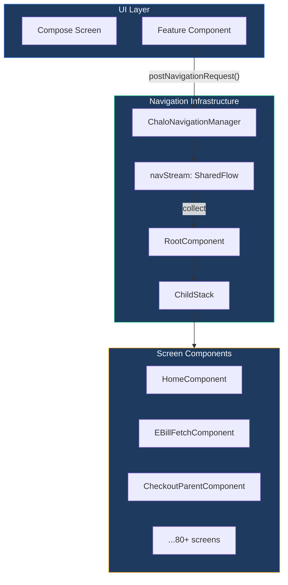
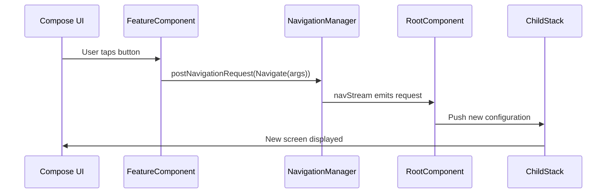
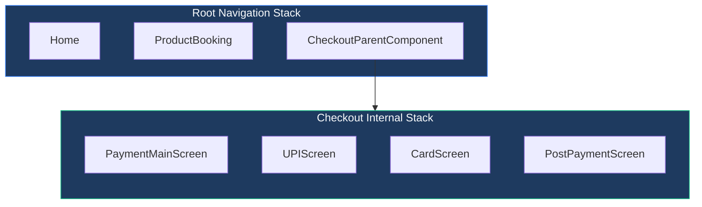
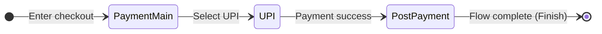
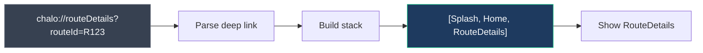
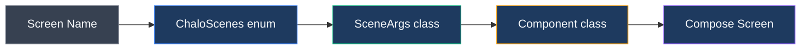

# Navigation Guide

## Overview

Navigation in the Chalo App is built on **Decompose's ChildStack**, providing a type-safe, multiplatform navigation system. All navigation flows through a centralized **ChaloNavigationManager**, which emits navigation requests that the **RootComponent** processes to manipulate the navigation stack.

This document explains how to navigate the codebase by understanding the navigation system—from screen names to code locations.

## Navigation System Architecture

## Core Navigation Concepts

### ChaloScenes

Every navigable destination is defined in the **ChaloScenes** enum. Each scene has a unique route identifier and maps to a specific component.

| Category | Example Scenes |
|----------|----------------|
| **Authentication** | SplashScreen, LoginOptions, LoginOtp, UserConsent |
| **Onboarding** | LanguageSelection, CitySelection, CityLocationSelection, LocationDisclaimer |
| **Home & Core** | Home, ForceAppUpdate, WebViewScene |
| **Tickets** | FareDetails, InstantTicket, MTicketSelection, MTicketTripInfo, TicketSummaryScreen |
| **Passes (Super Pass)** | PassSelectionScreen, PassPassengerSelectionScreen, PassUserEnterDetailsScreen, ConfirmSuperPassScreen, SuperPassBookingSuccessScreen |
| **Premium Bus** | PremiumBus, PremiumBusActivation, PremiumBusSeatSelectionScreen, PremiumBusSlotSelection, PremiumBusStopSelection |
| **Metro** | MetroLandingScreen, StopBasedMetroLandingScreen, ConfirmBookingScreen |
| **Checkout** | CheckoutPaymentMain, CheckoutUpi, CheckoutAddUpi, CheckoutCard, CheckoutNetBanking, CheckoutWallet, CheckoutPostPayment |
| **Wallet** | WalletBalance, WalletLoadMoney, WalletLoadBalanceSuccess, WalletAllTransactions, WalletTransactionSummary |
| **Card (NCMC)** | ChaloCardLandingScreen, ChaloCardEnterDetails, CardLinkingScreen, CardRechargeEnterAmount, NcmcOnlineRecharge |
| **Bills** | EBillFetchScreen, EBillAmountScreen, EBillPaymentConfirmation, EBillPaymentSuccess, EBillHistoryScreen |
| **Live Tracking** | RouteDetails, StopTripDetails, UniversalPicker, TripPlannerResultsScreen, TripPlannerDetailsScreen |
| **Validation** | BleValidation, QrScanner, QrValidation |
| **Quick Pay** | QuickPay, PayForTicket |
| **User Profile** | UserProfileDisplay, UserProfileEdit |
| **KYC** | MinKycDetails, MinKycOtp |

### Scene Arguments

Each scene has a corresponding **SceneArgs** class that carries navigation parameters. Arguments are serializable to support state restoration and deep linking.

| Argument Pattern | Description |
|------------------|-------------|
| **Data object** | Simple destinations with no parameters (e.g., SplashArgs, HomeArgs) |
| **Data class** | Destinations requiring data (e.g., EBillAmountScreenArgs with bill JSON) |
| **Parent args** | Flow entry points with unique instance IDs for nested navigation |

Every SceneArgs implements a `resolveChaloScene()` method that returns the corresponding ChaloScenes enum value, enabling type-safe routing.

## Navigation Patterns

### Simple Navigation Flow

### Navigation Request Types

| Request Type | Behavior | Use Case |
|--------------|----------|----------|
| **Navigate** | Push new screen onto stack | Standard forward navigation |
| **Navigate with popUpTo** | Push and pop intermediate screens | Replace current screen or return to specific point |
| **GoBack** | Pop current screen | Back button handling |
| **GoBack with popUpTo** | Pop multiple screens | Return to specific destination |
| **BuildStack** | Replace entire stack | Deep link handling |
| **ClearAllAndNavigate** | Clear stack and navigate | Logout, session expiry |

### Pop-Up-To Configuration

The pop-up-to configuration controls which screens are removed when navigating.

| Configuration | Behavior |
|---------------|----------|
| **None** | Standard push, no screens removed |
| **Prev** | Replace current screen (pop then push) |
| **Scene(target, inclusive=false)** | Pop screens until reaching target, keep target |
| **Scene(target, inclusive=true)** | Pop screens including target |
| **ClearAll** | Remove all screens from stack |
| **Finish(parentArgs)** | Complete a nested parent flow |

### Navigation Options

| Option | Effect |
|--------|--------|
| **launchSingleTop** | Prevents duplicate screens on top of stack |
| **includePath** | Consider full path when checking for duplicates |
| **popUpToConfig** | Specifies which screens to remove |

## Parent Components (Nested Navigation)

Complex multi-step flows use **ParentComponent** to manage their own internal navigation stack while appearing as a single entry in the root stack.

### Parent Component Architecture

### Parent Components in Codebase

| Parent Component | Entry Scene | Internal Screens | Purpose |
|------------------|-------------|------------------|---------|
| **CheckoutParentComponent** | CheckoutPaymentMain | UPI, Card, NetBanking, Wallet, PostPayment | Payment flow orchestration |
| **SuperPassParentComponent** | PassSelection | PassengerSelection, UserDetails, ProofUpload | Pass booking flow |
| **PremiumBusParentComponent** | PremiumBus | StopSelection, SlotSelection, SeatSelection | Premium bus booking |
| **WalletParentComponent** | WalletBalance | LoadMoney, Transactions, TransactionSummary | Wallet management flow |
| **ValidationParentComponent** | BleValidation | QrScanner, QrValidation | Ticket validation flow |
| **CitySelectionParentComponent** | CitySelection | CityLocationSelection | City selection during onboarding |

### Completing a Parent Flow

When a nested flow completes (e.g., payment successful), it signals completion to its parent, which then pops the entire flow from the root stack.

The Finish navigation request carries the parent's args, enabling the root to identify and remove the correct parent entry.

## Deep Linking

Deep links are handled by building a complete navigation stack that recreates the expected back-stack for the destination.

### Deep Link Stack Building

When handling a deep link to route details, the system builds a stack containing Splash → Home → RouteDetails. This ensures the user can navigate back naturally even when entering via deep link.

### Deep Link Format

| Component | Format |
|-----------|--------|
| Scheme | `chalo://` |
| Path | Scene route (e.g., `routeDetails`) |
| Parameters | URL-encoded JSON args |

## Finding Code by Navigation

### From Screen Name to Code

Follow this tracing path to find the implementation for any screen:

| Step | What to Search | Example |
|------|----------------|---------|
| 1. Find scene | Search `ChaloScenes` for screen name | `EBillFetchScreen` → `ChaloScenes.EBillFetchScreen` |
| 2. Find args | Search for `{SceneName}Args` | `EBillFetchScreenArgs` |
| 3. Find component | Search for classes using those args | `EBillFetchComponent` |
| 4. Find screen | Component typically references its screen | `EBillFetchScreen` (Composable) |

### Feature to Module Mapping

| Feature Area | Module Path | Key Scenes |
|--------------|-------------|------------|
| **Bills** | `shared/home/.../electricitybill/` | EBillFetch, EBillAmount, EBillPaymentSuccess |
| **Instant Ticket** | `shared/productbooking/.../instantticket/` | FareDetails, InstantTicket |
| **Super Pass** | `shared/home/.../superpass/` | PassSelection, ConfirmSuperPass, SuperPassBookingSuccess |
| **Premium Bus** | `shared/home/.../premiumbus/` | PremiumBus, PremiumBusActivation, PBSlotSelection |
| **Checkout** | `shared/checkout/` | CheckoutPaymentMain, CheckoutUpi, CheckoutPostPayment |
| **Wallet** | `shared/wallet/` | WalletBalance, WalletLoadMoney, WalletTransactionSummary |
| **Card** | `shared/home/.../ncmc/` | ChaloCardLanding, CardLinking, NcmcOnlineRecharge |
| **Live Tracking** | `shared/livetracking/` | RouteDetails, StopTripDetails, TripPlannerResults |
| **Login** | `shared/login/` | LoginOptions, LoginOtp, UserConsent |
| **Onboarding** | `shared/onboarding/` | LanguageSelection, CitySelection, LocationDisclaimer |

### Module Internal Navigation

Within a feature module, screens are organized under the `ui/` package.

| Package | Contents |
|---------|----------|
| `ui/{screen}/` | Screen-specific component, contract, and Composable |
| `ui/{screen}/{Screen}Component.kt` | MVI component (ViewModel equivalent) |
| `ui/{screen}/{Screen}Screen.kt` | Compose UI |
| `ui/{screen}/{Screen}Contract.kt` | ViewIntent, DataState, ViewState, SideEffect |

## iOS Navigation (Swift)

SKIE annotations enable Swift code to use the same navigation patterns as Kotlin.

### Swift Navigation Interop

| Kotlin Feature | Swift Equivalent |
|----------------|------------------|
| Sealed class navigation requests | Swift enum with associated values |
| SceneArgs data classes | Swift structs |
| ChaloScenes enum | Swift enum |
| Flow collection | AsyncSequence iteration |

Thanks to SKIE's sealed class interop, Swift code can pattern-match on navigation requests and handle them identically to Kotlin code.

## Debugging Navigation

### Tracing Navigation Flow

Navigation events are logged via the centralized logging infrastructure. Key log tags to filter:

| Tag | Information |
|-----|-------------|
| `ChaloNavigationManager` | Navigation requests posted |
| `RootComponent` | Stack manipulation operations |
| `DeepLinkRuntime` | Deep link parsing and handling |

### Inspecting Current Stack

The current navigation stack can be inspected by examining the RootComponent's childStack value. Each entry contains the SceneArgs configuration and the resolved ChaloScene.

| Stack Property | Contents |
|----------------|----------|
| `items` | List of stack entries (oldest to newest) |
| `active` | Currently visible screen |
| `backStack` | All screens behind the active one |

## Navigation Anti-Patterns

| Anti-Pattern | Problem | Correct Approach |
|--------------|---------|------------------|
| Direct stack manipulation | Bypasses navigation manager, breaks consistency | Always use ChaloNavigationManager |
| Passing large objects in args | Args must be serializable, large objects slow navigation | Pass IDs, fetch data in destination |
| Navigation from background | Component may be destroyed, causing crashes | Check lifecycle state before navigating |
| Hardcoded back navigation | Fragile when flows change | Use popUpTo with scene targets |
