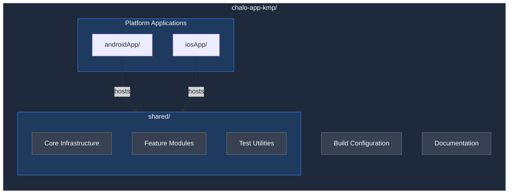
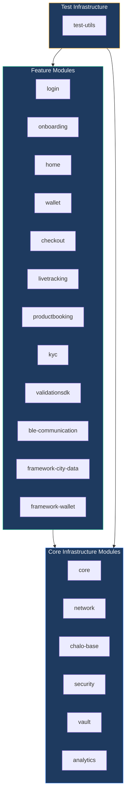
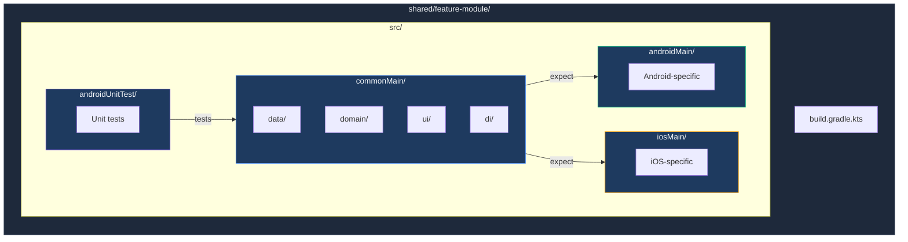

# Project Structure

## Overview

The Chalo App is built as a **Kotlin Multiplatform (KMP)** project, enabling a single codebase to power both Android and iOS applications. The architecture emphasizes maximum code sharing while allowing platform-specific implementations where native behavior is essential. Approximately 85-90% of the codebase—including business logic, data management, and UI—lives in shared Kotlin code, with thin native shells for each platform.

## Repository Organization

The repository follows a monorepo structure with clear separation between shared code and platform-specific applications.

### Top-Level Directories

| Directory | Purpose |
|-----------|---------|
| **androidApp/** | Android application module containing MainActivity, manifest, and platform configuration. Acts as a thin shell hosting the shared Compose UI. |
| **iosApp/** | iOS application with Xcode project, SwiftUI entry point, and CocoaPods integration for KMP framework consumption. |
| **shared/** | All KMP shared modules containing business logic, UI, data management, and platform abstractions. This is where the vast majority of code lives. |
| **gradle/** | Gradle wrapper and version catalog (`libs.versions.toml`) centralizing all dependency versions. |
| **docs/** | Flow-level architecture documentation with HLDs, LLDs, and test cases. |
| **scripts/** | Build utilities, release scripts, and automation tooling. |

## Shared Modules Architecture

The shared directory contains approximately 20 KMP modules, organized into three categories: core infrastructure, feature modules, and test utilities.

### Core Infrastructure Modules

These modules provide foundational capabilities used across all features.

| Module | Responsibility |
|--------|----------------|
| **core** | Application entry point, Decompose root component, main navigation stack, Koin DI setup, and SQLDelight AppDatabase. |
| **chalo-base** | Base MVI component classes, common UI state models, Compose resources (strings, images, fonts), scene argument definitions, and shared utilities. |
| **network** | Ktor-based HTTP client with priority-based request builders, authentication interceptor, error handling, and platform-specific engines (OkHttp for Android, Darwin for iOS). |
| **security** | Encryption services using AES, key management via platform keystores, and SSL certificate pinning. |
| **vault** | Secure storage abstraction over EncryptedSharedPreferences (Android) and Keychain (iOS), plus SQLCipher encrypted database support. |
| **analytics** | Analytics integration layer supporting Mixpanel, Firebase Analytics, Adjust attribution, and Plotline engagement tracking. |

### Feature Modules

Each feature module encapsulates a complete user-facing capability with its own data, domain, and presentation layers.

| Module | Features Contained |
|--------|-------------------|
| **login** | Phone number authentication, OTP verification, Truecaller integration, user consent collection. |
| **onboarding** | Splash screen, language selection, city selection, location permissions, and first-launch flows. |
| **home** | Home screen with tab navigation, plus many nested features: profile, history, bills, super-pass, premium bus, metro, ONDC, validation entry points, notifications, M-ticket, trip planner, SOS, and more. |
| **productbooking** | Route selection, instant ticket booking, metro booking, premium bus booking, and ONDC product selection. |
| **checkout** | Payment orchestration across multiple providers: Razorpay, Juspay, UPI, cards, net banking, and wallet payments. |
| **wallet** | Wallet balance display, load money flow, transaction history, Quick Pay functionality, and wallet-based payments. |
| **livetracking** | Real-time bus tracking, route details, stop-level ETA, and live bus positions on map. |
| **kyc** | KYC verification flow for wallet compliance including document upload and OTP verification. |
| **validationsdk** | Complete ticket validation SDK supporting BLE (Bluetooth), QR code scanning, and NFC tap-in/tap-out. |
| **ble-communication** | Low-level Bluetooth LE communication layer for conductor device validation. |
| **framework-city-data** | City configuration management including routes, stops, and city-specific settings. |
| **framework-wallet** | Secure wallet operations framework including balance queries and transaction signing. |

### Test Infrastructure

| Module | Purpose |
|--------|---------|
| **test-utils** | Shared testing utilities including DecomposeTestFixture for component lifecycle management, StateAssertions for state verification, AnalyticsCapture for event testing, and Flow test helpers. |

## Module Internal Structure

Every shared module follows a consistent KMP source set organization enabling code sharing while allowing platform-specific implementations.

### Source Sets

| Source Set | Platform | Contents |
|------------|----------|----------|
| **commonMain/** | All platforms | Shared Kotlin code including interfaces, business logic, and expect declarations. This is where most code lives. |
| **androidMain/** | Android only | Actual implementations for expect declarations, Android-specific integrations (Context, permissions, etc.). |
| **iosMain/** | iOS only | Actual implementations for expect declarations, iOS-specific integrations (Foundation, UIKit bridges). |
| **androidUnitTest/** | Test | JUnit 5 tests with MockK mocking and Turbine for Flow testing. |
| **commonTest/** | Test | Cross-platform tests that run on all targets. |

### Layer Organization Within commonMain

Each feature follows Clean Architecture with clear layer separation.

| Layer | Package | Responsibility |
|-------|---------|----------------|
| **data/** | `app.chalo.{feature}.data` | Repositories, data sources, API models, local models, and mappers. Handles all data operations. |
| **domain/** | `app.chalo.{feature}.domain` | Use cases containing business logic, domain models, and repository interfaces. No framework dependencies. |
| **ui/** | `app.chalo.{feature}.ui` | Decompose components (ViewModels), Compose screens, view states, intents, and side effects. |
| **di/** | `app.chalo.{feature}.di` | Koin module definitions wiring together data, domain, and UI layers. |

## Platform Applications

### Android Application

The Android app serves as a thin shell that hosts the shared Compose Multiplatform UI. It handles:

- **Application initialization**: Koin setup, WorkManager configuration, Freshchat receiver registration, and StrictMode for debug builds.
- **MainActivity responsibilities**: Lazy-initializing platform delegates (permissions, image picker, phone hint), edge-to-edge layout configuration, deep link processing, root detection, and language localization.
- **Platform bridges**: Providing Context, Activity results, and Android-specific services to shared code via Koin.

The app uses build flavors (primary, beta, alpha) for different release channels and generates APK filenames including version, branch, and build type metadata.

### iOS Application

The iOS app similarly provides a thin native shell using SwiftUI as the entry point.

- **App entry point**: Initializes Koin with `IosDependencyFactory`, sets up native UI bridges for Compose components requiring native iOS UI.
- **AppDelegate**: Handles Firebase initialization, Google Services setup (Maps), Razorpay configuration, and permission/image picker provider initialization.
- **Native UI bridges**: Two-way bridges for components requiring native iOS UI—currently MapKit for maps and WKWebView for web content.
- **SKIE integration**: Enables better Swift interoperability with Flow-to-AsyncSequence bridging, sealed class exhaustive switching, and coroutine support.

## Build System

### Gradle Configuration

The project uses Gradle with the Kotlin DSL and a centralized version catalog for dependency management. All versions are defined in `gradle/libs.versions.toml`, enabling consistent versioning across all modules.

| Configuration | Value |
|---------------|-------|
| Kotlin version | 2.2.20 |
| Compose Multiplatform | 1.9.1 |
| Android Gradle Plugin | 8.13.0 |
| Target SDK | 35 (Android 15) |
| Compile SDK | 36 (Android 16 preview) |
| Minimum SDK | 23 (Android 6.0 Marshmallow) |

### Module Dependencies

Modules declare dependencies on other shared modules using Gradle's typesafe project accessors. The dependency graph flows from feature modules down to core infrastructure, ensuring a clean architectural layering where features depend on core but never on each other directly.

### iOS Build

iOS builds use CocoaPods for KMP framework integration. Running `pod install` in the iosApp directory generates the Xcode workspace with the shared KMP framework linked. The SKIE plugin enhances Swift interoperability by generating Swift-friendly APIs for Kotlin sealed classes, enums, and coroutines.

## Key Design Decisions

| Decision | Rationale |
|----------|-----------|
| **Monorepo structure** | Enables atomic commits across platforms, shared tooling, and simplified dependency management. |
| **Heavy shared code (~90%)** | Maximizes code reuse, reduces platform-specific bugs, and accelerates feature development. |
| **Feature module isolation** | Each feature is independently buildable and testable, enabling parallel team development. |
| **Thin native shells** | Minimizes platform-specific maintenance burden while still allowing native capabilities where essential. |
| **Centralized version catalog** | Single source of truth for all dependency versions, preventing version conflicts and simplifying upgrades. |
