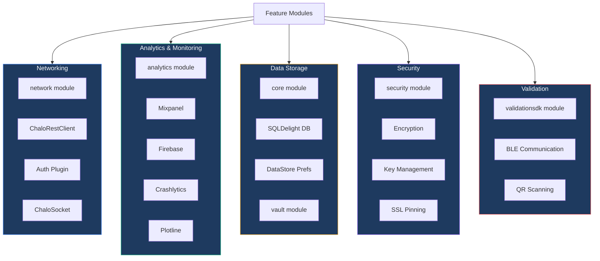
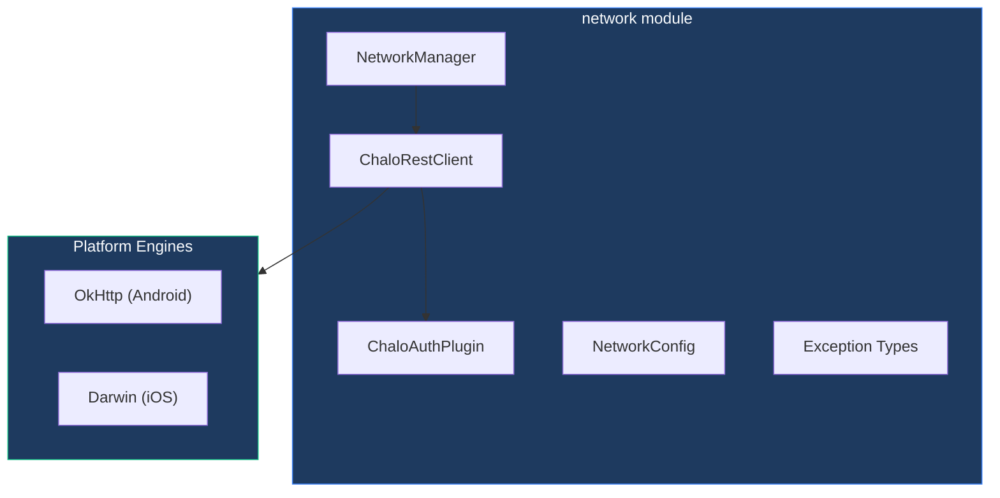
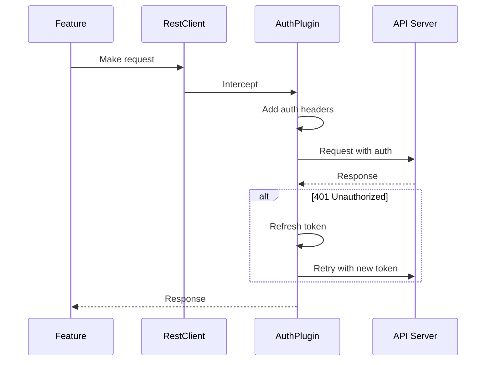
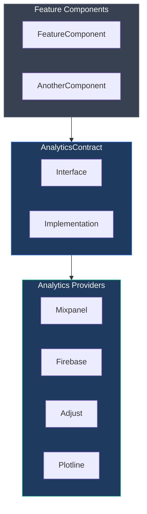
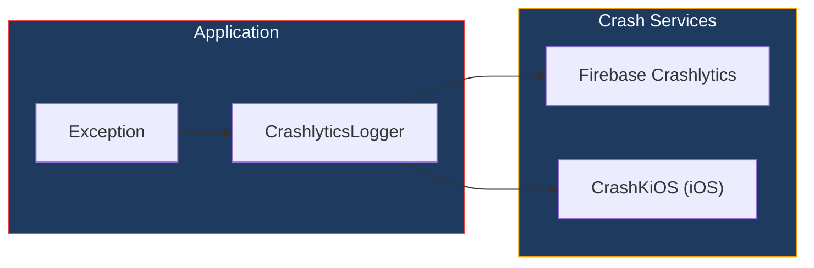
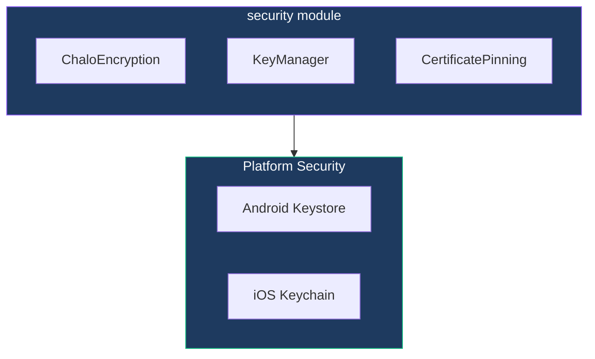
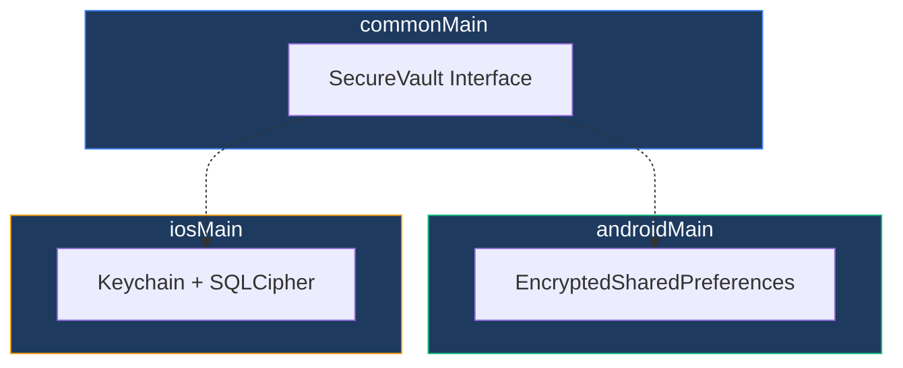
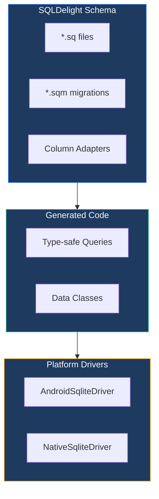
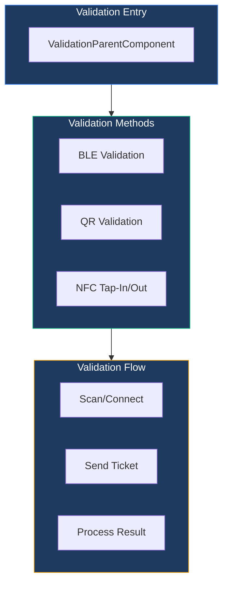
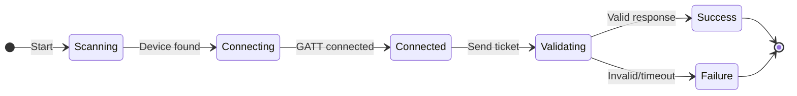

# Shared Infrastructure

## Overview

The Chalo App's shared infrastructure provides cross-cutting concerns that all features depend on—networking, analytics, security, persistence, validation, and logging. These modules live in the `shared/` directory and are designed to be feature-agnostic, providing consistent behavior across the entire application.

## Infrastructure Module Landscape

## Networking Layer

The `shared/network` module provides the HTTP client infrastructure used by all features.

### Architecture

### NetworkManager Interface

The **NetworkManager** provides priority-based request builders, allowing features to specify request importance.

| Priority | Use Case | Characteristics |
|----------|----------|-----------------|
| **Low** | Background sync, prefetching | Longer timeouts, may be delayed |
| **Standard** | Regular API calls | Default configuration |
| **High** | Critical user actions | Shorter timeouts, prioritized |
| **Custom** | Special requirements | Configurable timeout and priority |

### ChaloRestClient

The REST client wraps Ktor's HttpClient with a consistent API for all HTTP operations.

| Operation | Purpose |
|-----------|---------|
| **GET** | Fetch data with query parameters |
| **POST** | Submit data with request body |
| **PUT** | Update existing resources |
| **DELETE** | Remove resources |
| **Multipart** | Upload files with form data |

### Authentication Plugin

The **ChaloAuthPlugin** intercepts all requests to handle authentication transparently.

| Responsibility | Behavior |
|----------------|----------|
| **Header injection** | Adds authorization token to all requests |
| **Token refresh** | Automatically refreshes expired tokens |
| **Session expiry** | Triggers re-authentication flow when session invalid |

### Platform HTTP Engines

| Platform | Engine | Features |
|----------|--------|----------|
| **Android** | OkHttp | Connection pooling, HTTP/2, interceptors |
| **iOS** | Darwin | URLSession-based, native SSL handling |

Both engines are configured with consistent timeouts (30 seconds default) and JSON content negotiation.

### Error Handling

Network errors are categorized into typed exceptions.

| Exception Type | When Thrown |
|----------------|-------------|
| **NetworkException** | Connection failures, DNS errors |
| **TimeoutException** | Request exceeded timeout |
| **ServerException** | 5xx HTTP responses |
| **AuthException** | 401/403 responses after retry |
| **ChaloLocalException** | Response parsing failures |

### Request Configuration

Each request can be configured with priority, retry strategy, and custom headers.

| Configuration | Options |
|---------------|---------|
| **Priority** | Low, Normal, High, Critical |
| **Retry strategy** | None, Exponential backoff, Linear |
| **Timeout** | Custom duration in seconds |

## Analytics Layer

The `shared/analytics` module provides unified analytics tracking across multiple providers.

### Analytics Architecture

### AnalyticsContract Interface

The analytics contract provides a unified API for all analytics operations.

| Operation | Purpose |
|-----------|---------|
| **raiseAnalyticsEvent** | Fire an analytics event with properties |
| **raiseDebugEvent** | Fire debug-only event (not in production) |
| **addToPeopleProperties** | Set user profile properties |
| **addToSuperProperties** | Set properties attached to all events |
| **sendAnalyticsEventToPlotline** | Specifically target Plotline |
| **setupAnalytics** | Initialize analytics on app launch |
| **incrementProperty** | Increment numeric user property |

### Event Frequency Control

Events can be controlled to prevent over-firing.

| Frequency | Behavior |
|-----------|----------|
| **Always** | Fire on every call |
| **OncePerSession** | Fire only once per app session |
| **OncePerLifetime** | Fire only once ever (persisted) |

### Analytics Providers

| Provider | Platform | Purpose |
|----------|----------|---------|
| **Mixpanel** | Android | User analytics, funnels, retention |
| **Firebase Analytics** | Both | Event tracking, audiences |
| **Adjust** | Android | Attribution, marketing analytics |
| **Plotline** | Both | In-app engagement, messaging |

### Crash Reporting

| Platform | Crash Reporter | Special Handling |
|----------|----------------|------------------|
| **Android** | Firebase Crashlytics | Native integration |
| **iOS** | CrashKiOS | Bridges Kotlin exceptions to iOS crash reports |

The **CrashlyticsLogger** provides a safe wrapper that logs exceptions without crashing the app during non-fatal errors.

## Security Layer

The `shared/security` module handles encryption, key management, and SSL security.

### Security Architecture

### Encryption Services

| Operation | Purpose |
|-----------|---------|
| **encrypt** | Encrypt plaintext with default key |
| **decrypt** | Decrypt ciphertext with default key |
| **encryptWithKey** | Encrypt with specific key |
| **decryptWithKey** | Decrypt with specific key |

The encryption implementation uses AES with secure random IVs, ensuring each encryption produces unique ciphertext.

### Key Management

| Platform | Key Storage |
|----------|-------------|
| **Android** | Android Keystore with hardware-backed keys where available |
| **iOS** | Keychain Services with Secure Enclave support |

### Root/Jailbreak Detection

| Platform | Detection |
|----------|-----------|
| **Android** | RootBeer library checks for root indicators |
| **iOS** | Checks for jailbreak artifacts |

The app can restrict functionality or warn users when running on compromised devices.

## Vault (Secure Storage)

The `shared/vault` module provides an abstraction over platform-specific secure storage.

### Vault Architecture

### SecureVault Operations

| Operation | Purpose |
|-----------|---------|
| **store** | Save sensitive value by key |
| **retrieve** | Get sensitive value by key |
| **delete** | Remove specific key |
| **clear** | Remove all vault contents |

### Platform Implementations

| Platform | Implementation | Encryption |
|----------|----------------|------------|
| **Android** | EncryptedSharedPreferences | AndroidX Security Crypto |
| **iOS** | SQLCipher database | AES-256 encryption |

## Data Persistence

### SQLDelight Database

The `shared/core` module hosts the main SQLDelight database schema.

### Database Features

| Feature | Description |
|---------|-------------|
| **Type-safe queries** | Compile-time verified SQL |
| **Migrations** | Versioned schema changes |
| **Flow integration** | Reactive queries via SQLDelight Coroutines |
| **Encryption** | SQLCipher support for sensitive data |

### Column Adapters

Custom adapters handle complex types that don't map directly to SQLite.

| Adapter Type | Converts |
|--------------|----------|
| **JSON adapter** | Complex objects ↔ JSON strings |
| **Enum adapter** | Enum values ↔ String/Int |
| **Date adapter** | DateTime ↔ Long timestamps |

### DataStore Preferences

Type-safe key-value storage using Jetpack DataStore.

| Aspect | Description |
|--------|-------------|
| **Type safety** | Keys define their value types |
| **Coroutines** | All operations are suspend functions |
| **Flow observation** | Changes emit to collectors |
| **Multiplatform** | Works on both Android and iOS |

### Preference Key Categories

| Category | Examples |
|----------|----------|
| **User identity** | User ID, auth token, city ID |
| **App state** | Last sync time, onboarding complete |
| **Cached data** | Frequently accessed values |

## Validation SDK

The `shared/validationsdk` module handles ticket validation across multiple methods.

### Validation Architecture

### Validation Methods

| Method | Description | Use Case |
|--------|-------------|----------|
| **BLE** | Bluetooth Low Energy to conductor device | Bus validation |
| **QR** | Scan QR code for verification | Metro entry/exit |
| **NFC** | Tap card for entry/exit | Metro gates |

### BLE Validation Flow

### BLE Connection States

| State | Description |
|-------|-------------|
| **Disconnected** | No active connection |
| **Scanning** | Searching for conductor device |
| **Connecting** | Establishing GATT connection |
| **Connected** | Ready to send validation request |
| **Validating** | Ticket sent, awaiting response |
| **Success** | Validation approved |
| **Failure** | Validation rejected or timed out |

### Validation Result Types

| Result | Contains |
|--------|----------|
| **Success** | Validation receipt with timestamp |
| **Failure** | Failure reason (expired, invalid, network error) |

## Logging Infrastructure

### ChaloLog

Centralized logging utility replacing platform-specific loggers.

| Level | Purpose |
|-------|---------|
| **debug** | Development information, stripped in release |
| **info** | General information messages |
| **warn** | Warning conditions |
| **error** | Error conditions with optional throwable |

### Network Logging

In debug builds, network requests are logged via Chucker (Android) for inspection.

| Logged Data | Visibility |
|-------------|------------|
| **Request URL** | Debug only |
| **Headers** | Debug only (sensitive masked) |
| **Body** | Debug only |
| **Response** | Debug only |

## Network State Management

### NetworkStateManager

Monitors device connectivity and exposes it as observable state.

| State | Description |
|-------|-------------|
| **Connected** | Device has internet access |
| **Disconnected** | No internet connectivity |
| **Metered** | Connected via metered connection (cellular) |
| **Unknown** | State cannot be determined |

### Component Integration

Components observe network state to update UI and behavior.

## Feature Flags & Remote Config

### Remote Config Integration

Firebase Remote Config (Android) provides runtime configuration.

| Capability | Description |
|------------|-------------|
| **Feature toggles** | Enable/disable features remotely |
| **Config values** | String, boolean, long values |
| **Fetch & activate** | Pull latest values from server |

### Common Feature Flags

| Flag | Type | Purpose |
|------|------|---------|
| **enable_quick_pay** | Boolean | Toggle Quick Pay feature |
| **min_app_version** | String | Force update threshold |
| **payment_providers** | JSON | Configure available payment methods |
| **cities_config** | JSON | City-specific settings |

## Cross-Cutting Utilities

### String Provider

Abstraction over platform-specific string resources.

| Capability | Description |
|------------|-------------|
| **String lookup** | Get localized string by enum key |
| **String formatting** | Insert arguments into format strings |
| **Multiplatform** | Works identically on Android and iOS |

### Date/Time Utilities

Using **kotlinx-datetime** for multiplatform date handling.

| Utility | Purpose |
|---------|---------|
| **TimeUtilsContract** | Centralized time operations |
| **Clock.System.now()** | Current instant |
| **TimeZone handling** | Convert between timezones |

### Image Loading

**Coil 3** provides multiplatform image loading.

| Feature | Description |
|---------|-------------|
| **Disk caching** | Persistent cache across sessions |
| **Memory caching** | Fast access for visible images |
| **Transformations** | Resize, crop, round corners |
| **Compose integration** | AsyncImage composable |

## Dependency Injection Modules

### Core Infrastructure Modules

| Module | Contents |
|--------|----------|
| **sharedCoreModule** | NavigationManager, AppComponentFactory, Database |
| **sharedNetworkModule** | RestClient, NetworkManager, AuthPlugin |
| **analyticsModule** | AnalyticsContract implementation |
| **securityModule** | Encryption services, KeyManager |
| **vaultModule** | SecureVault implementation |

### Module Registration

All infrastructure modules are registered during application startup before any feature modules. This ensures infrastructure dependencies are available when features initialize.

## Platform Abstraction Patterns

### PlatformDependencyFactory

For complex platform-specific code that can't use simple expect/actual.

| Request Type | Creates |
|--------------|---------|
| **ChaloHttpClientRequest** | Configured Ktor HttpClient |
| **ChaloSocketRequest** | Platform-specific WebSocket |
| **MapUtilsRequest** | Platform map utilities |

The factory is injected at app startup, then shared code uses it to obtain platform implementations without direct platform dependencies.

### Provider/Setter Pattern

For features requiring Activity or ActivityResultContract.

| Provider | Purpose |
|----------|---------|
| **PermissionHandlerProvider** | Runtime permissions |
| **ImagePickerProvider** | Gallery/camera access |
| **PhoneNumberHintProvider** | Phone number suggestions |
| **TruecallerSetupHandler** | Truecaller SDK |
| **InstalledUpiAppsHelper** | UPI app detection |
| **AppRatingProcessManager** | In-app ratings |

Providers are lazy-initialized and setters are called from MainActivity/AppDelegate, bridging platform-specific Activity/UIViewController requirements to shared code.
